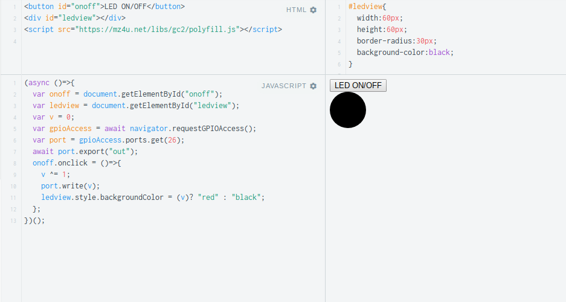
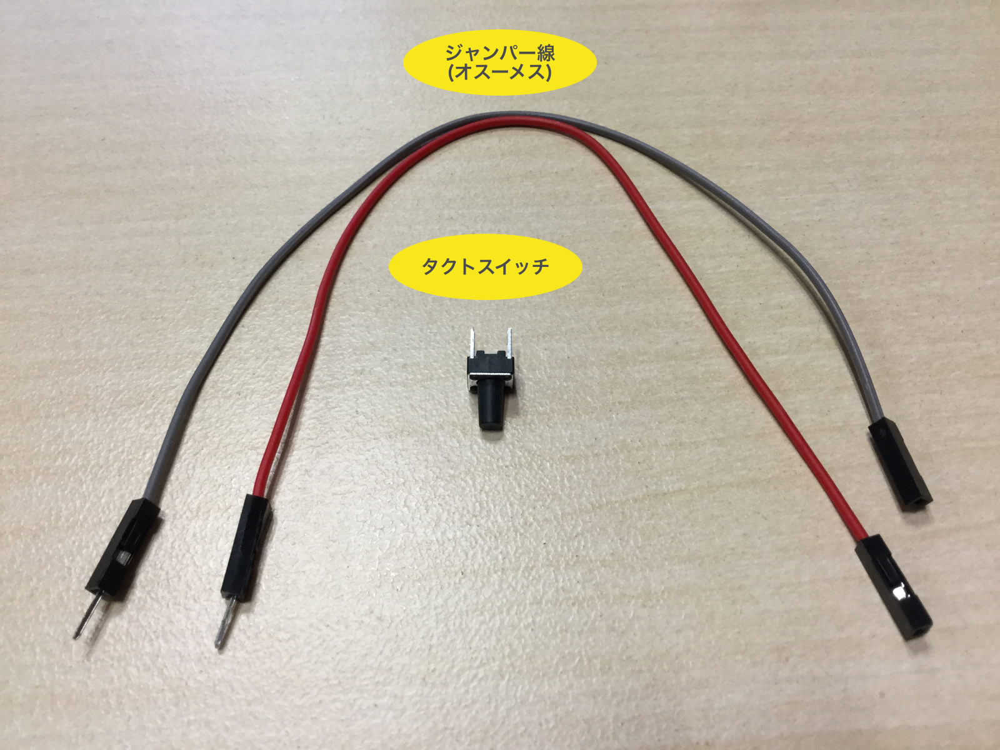
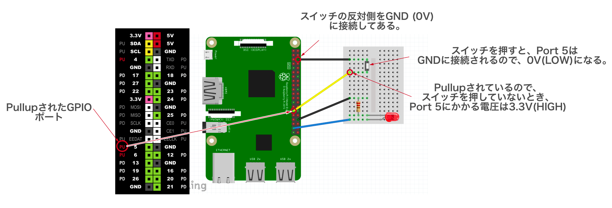
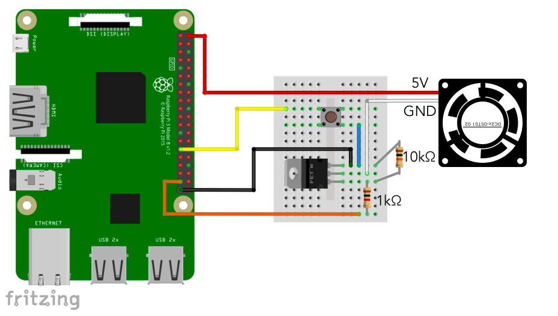

# CHIRIMEN for Raspberry Pi 3 チュートリアル 1. GPIO編

# 概要
CHIRIMEN for Raspberry Pi 3 を使ったプログラミングを通じて、Web GPIO APIの使い方を学びます。

本チュートリアルを進める前に「CHIRIMEN for Raspberry Pi 3 Hello World」でCHIRIMEN for Raspberry Pi 3 の基本的な操作方法を確認しておいてください。

[CHIRIMEN for Raspberry Pi 3 Hello World](section0.md)

## (※1) CHIRIMEN for Raspberry Pi 3とは
Raspberry Pi 3（以下「Raspi3」）上に構築したIoTプログラミング環境です。

[Web GPIO API (Draft)](https://rawgit.com/browserobo/WebGPIO/master/index.html)や、[Web I2C API (Draft)](https://rawgit.com/browserobo/WebI2C/master/index.html)といったAPIを活用したプログラミングにより、WebアプリからRaspi3に接続した電子パーツを直接制御することができます。 

CHIRIMEN Open Hardware コミュニティにより開発が進められています。

# 1. 準備
## 用意するもの
このチュートリアル全体で必要になるハードウエア・部品は下記の通りです。

* [CHIRIMEN for Raspberry Pi 3 Hello World](section0.md) に記載の「基本ハードウエア」と「Lチカに必要となるパーツ」
タクトスイッチ x 1
* [ジャンパーワイヤー (オス-メス)] x 5
* [Nch MOSFET (2SK4017)](http://akizukidenshi.com/catalog/g/gI-07597/)
* [リード抵抗 (1KΩ)] x 1
* [リード抵抗 (10KΩ)] x 1
* [DCファン](http://akizukidenshi.com/catalog/g/gP-02480/) x 1 ※ブレッドボードに接続できるようにケーブルを加工しておいてください。

## CHIRIMEN for Raspberry Pi 3の起動とLチカの確認
* [CHIRIMEN for Raspberry Pi 3 Hello World](section0.md) の 「3. CHIRIMEN for Raspberry Pi 3 を起動してみよう」を参照して、CHIRIMEN for Raspberry Pi 3を起動してください。
* ついでに[CHIRIMEN for Raspberry Pi 3 Hello World](section0.md) の 「4. Lチカをやってみよう」を実施して、Lチカが正しく行えることを確認しておいてください。

## Lチカでのおさらい
* CHIRIMEN for Raspberry Pi 3 では、各種exampleが ```~/Desktop/gc/```配下においてある。配線図も一緒に置いてある
* CHIRIMEN for Raspberry Pi 3 で利用可能なGPIO Port番号と位置は壁紙を見よう
* LEDには方向がある。アノードが足が長い方。こちらをGPIOポートに繋ぐ。反対の足が短い方をGND側に繋ぐ。抵抗はどちらかに繋ぐ
* CHIRIMEN for Raspberry Pi 3 ではWebアプリからのGPIOの制御に[Web GPIO API](https://rawgit.com/browserobo/WebGPIO/master/index.html) を利用する。

# 2. マウスクリックでLEDのON/OFFを制御してみる
それでは、実際にプログラミングをやってみましょう。

[CHIRIMEN for Raspberry Pi 3 Hello World](section0.md) では、[JS Bin](http://jsbin.com/) を使ってLチカのexample コードを少し触ってみるだけでしたが、今度は最初から書いてみることにします。

せっかくですので、このチュートリアルでは他のオンラインエディタ [JSFiddle](https://jsfiddle.net/) を使ってみることにします。

> Web上のオンラインサービスは便利ですが、メンテナンスや障害、サービス停止などで利用できなくなることがあります。
> ローカルでの編集も含め、いくつかのサービスを使いこなせるようにしておくと安心です。
>
> 各サービスにはそれぞれ一長一短がありますので、利用シーンに応じて使い分けると良いかもしれません。

## a. 部品と配線について
このパートでは[CHIRIMEN for Raspberry Pi 3 Hello World](section0.md) で実施したLチカの配線をそのまま利用します。必要な部品も同じです。


LEDは、26番ポートに接続しておいてください。


## b. HTML/CSSを記載する
さて、今回は、ボタンとLEDの状態インジケータを画面上に作ってみましょう。
HTMLに ```<button>```と```<div>``` 要素を1つづつ作ります。

[JSFiddle](https://jsfiddle.net/) にアクセスすると、初期状態でコード編集を始めることができます。
この画面のHTMLペインに下記コードを挿入します。

```html
<button id="onoff">LED ON/OFF</button>
<div id="ledview"></div>
```
※JSFiddleのHTMLペインにはHTMLタグの全てを書く必要はなく、```<body>```タグ内のみを書けばあとは補完してくれます。

```ledview```には下記のようなスタイルを付けておきましょう。こちらはCSSペインに記載します。

```CSS
#ledview{
  width:60px;
  height:60px;
  border-radius:30px;
  background-color:black;
}
```

最後に、HTMLに戻って、[Web GPIO API](https://rawgit.com/browserobo/WebGPIO/master/index.html)を利用可能にするためのPolyfillをロードする記述を行なっておきましょう。
先ほど追加した```ledview```のすぐ下に下記```<script>```タグを記載します。

```html
<script src="https://mz4u.net/libs/gc2/polyfill.js"></script>
```

## c. ボタンに反応する画面を作る
GPIOを実際に使う前に、まずは「ボタンを押したらLEDのON/OFF状態を表示する画面を切り替える」部分を作ってみます。

早速JavaScriptを書いて行きましょう。

```javascript
onload = function(){
	var onoff = document.getElementById("onoff");
	var ledview = document.getElementById("ledview");
	var v = 0;
	onoff.onclick = function(){
		 v ^= 1;
		ledview.style.backgroundColor = (v == 1)? "red" : "black";
	};
}
```

書けたら JSFiddleの```▷ Run```をクリックします。

これで、```LED ON/OFF``` ボタンが表示されるはずですので、ボタンをクリックしてみてください。

赤→黒→赤→黒→赤→黒→とクリックする都度切り替えできるようになったら成功です。


## d. ボタンにLEDを反応させる
画面ができましたので、いよいよ Web GPIO を使ったLED制御コードを入れていきます。

一度Lチカの時に学んだことを思い出せばできるはずですが、まずは書き換えてみましょう。

```javascript
onload = function(){
	mainFunction();
}

async function mainFunction(){
	var onoff = document.getElementById("onoff");
	var ledview = document.getElementById("ledview");
	var v = 0;
	var gpioAccess = await navigator.requestGPIOAccess();
	var port = gpioAccess.ports.get(26);
	await port.export("out");
	onoff.onclick = function(){
		v ^= 1;
		port.write(v);
		ledview.style.backgroundColor = (v)? "red" : "black";
	};
}
```

これで、画面のボタンクリックに反応してLEDのON/OFFができたら成功です。

[CHIRIMEN for Raspberry Pi 3 Hello World](section0.md) のLチカのパートでも簡単に説明しましたが、ここでもういちど[Web GPIO API](https://qiita.com/tadfmac/items/ebd01cfe46e30de70f3d) の流れをおさらいしておきましょう。

### navigator.requestGPIOAccess()

Web GPIOを利用するための```GPIOAccess``` インタフェースを取得するための最初のAPI呼び出しです。
正しくインタフェースが取得されたら```Promise```の`then`に指定したコールバック関数が`GPIOAccess`パラメータ付きでコールされます。

### gpioAccess.ports.get()

`GPIOAccess.ports` は利用可能なportオブジェクトのリスト(Map)です。

`var port = gpioAccess.ports.get(26);`

上記コードで利用可能な`port`オブジェクトの一覧から、**GPIOポート番号 26**を指定して`port`オブジェクトを取得しています。

### port.export()

`port.export("out")`により取得したGPIOポートを**「出力モード」**で初期化しています。
GPIOポートかける電圧をWebアプリ側から切り替えたい時には「出力モード」を指定する必要があります。
GPIOポートはもうひとつ「入力モード」があります。これはGPIOポートの状態を読み込みたい時に利用します。入力モードについてはスイッチのパートで説明します。

### port.write()

`port.write()`は、出力モードに指定したGPIOポートの電圧を切り替える指定を行うAPIです。
`port.write(1)`で、指定したポートからHIGH(Raspberry Pi 3では3.3V)の電圧がかかり、`port.write(0)`で、LOW(0V)になります。

## e. ボタンにLEDを反応させる (ES2017 async function版)
さきほどのコードを見ていただいたらお気づきかもしれませんが、GPIOのアクセス、そしてこれから出てくるI2C対応パーツのDriverの処理などでは、非同期処理が頻繁に出てきます。

`Promise〜then()`の連鎖的な書き方でもコードを書き進めることはできますが、上記のような深い入れ子が続くことでどんどん読みにくいコードになってしまいます。

こうした問題への改善アプローチの一つとして、ES2017で提案されているのが [async function](https://developer.mozilla.org/ja/docs/Web/JavaScript/Reference/Statements/async_function) です。

> ISSUE 全ての非同期処理をasync functionに統一してわかりやすくする。

async functionを使うことで、先ほどのコードを下記のように記述することができます。

```javascript
(async ()=>{
  var onoff = document.getElementById("onoff");
  var ledview = document.getElementById("ledview");
  var v = 0;
  var gpioAccess = await navigator.requestGPIOAccess();
  var port = gpioAccess.ports.get(26);
  await port.export("out");
  onoff.onclick = ()=>{
    v ^= 1;
    port.write(v);
    ledview.style.backgroundColor = (v)? "red" : "black";
  };
})();
```

CHIRIMEN for Raspberry Pi 3 で利用するRaspi3にプリインストールされている Chromium (v60) では async functionをサポートしているため、上記のように記述することも可能です。

以降本チュートリアルでは async functionを使って進めていきたいと思いますが、利用するオンラインエディタによっては未サポートの場合があります。
**(JSFiddleではサポートされているようです。)**



# 3. マウスクリックのかわりにタクトスイッチを使ってみる
それでは、さきほどまで書いたコードをベースに、マウスの替わりにスイッチを利用してみます。

今回は、一般的に「タクトスイッチ」 と呼ばれるものを利用します。

### タクトスイッチについて
「タクトスイッチ」は(アルプス電気の商標)[http://www.alps.com/j/trademark/]のようです。

電子部品屋さん等では、アルプス電気製ではないスイッチも、同様の形状のものは「タクトスイッチ」として売られています。
* [秋月電気の「タクトスイッチ」一覧](http://akizukidenshi.com/catalog/c/ctactsw/)

今回の作例ではこのように「電気部品屋さん等でタクトスイッチとして売られてるスイッチ」を使います。

ようするに、下記のような仕様の「タクトスイッチっぽい」スイッチです。

* SPST (1回路1接点)
* プッシュボタン1つ
* プッシュボタンの押し込みでスイッチON、プッシュボタンを離すとスイッチOFF (モーメンタリ動作)

## a. 準備：画面のボタンをモーメンタリ動作に変えておく
これまでに作成したプログラムは「ブラウザ画面のボタンをクリックしたらLEDのHIGH/LOWを切り替える」というものでした。

クリック後は変更後の状態が維持されます。これは「オルタネート」のスイッチと同じ動きです。

一方で、今回用意したタクトスイッチは「モーメンタリ」のものです。

### スイッチの動作：オルタネートとモーメンタリ

* オルタネート : 状態をトグルします。一度ボタンを押すとONになりボタンから手を離してもOFFに変わりません。次にボタンを押すとOFFになります。ボタンから手を離してもONに変わることはありません。
* モーメンタリ : 押している間だけONになります。スイッチから手を離すとOFFに戻ります。

この2つの動作が混在すると画面とスイッチで状態が一致せず、面倒なことになります。

一旦、ブラウザ画面のボタンを「モーメンタリ」に合わせておきましょう。

下記のように、最初は`onclick` イベントで切り替えています。
`click`イベントは、「マウスのボタンを押して離す」ことで発生します。

```javascript
 :
  onoff.onclick = ()=>{
    v ^= 1;
    port.write(v);
    ledview.style.backgroundColor = (v)? "red" : "black";
  };
 :
```

これを、下記のように変更します。

* マウスのボタンを押す → LEDをON
* マウスのボタンを離す → LEDをOFF

```javascript
:
  onoff.onmousedown = ()=>{
    port.write(1);
    ledview.style.backgroundColor = "red";
  };
  onoff.onmouseup = ()=>{
    port.write(0);
    ledview.style.backgroundColor = "black";
  };
 :
```

これで、思った通りの動作になったはずです。

後でスイッチを追加したときに、同じ処理を呼ぶことになるので、LEDのON/OFFと`ledview`のスタイル切り替えをまとめて関数化しておきましょう。

下記のようになりました。

```javascript
(async ()=>{
  var onoff = document.getElementById("onoff");
  var ledview = document.getElementById("ledview");
  var gpioAccess = await navigator.requestGPIOAccess();
  var port = gpioAccess.ports.get(26);
  await port.export("out");
  onoff.onmousedown = ()=>{
    ledOnOff(1);
  };
  onoff.onmouseup = ()=>{
    ledOnOff(0);
  };
  function ledOnOff(v){
    if(v === 0){
      port.write(0);
      ledview.style.backgroundColor = "black";
    }else{
      port.write(1);
      ledview.style.backgroundColor = "red";
    }
  }
})();
```

## b. 部品と配線について
今回追加するのは下記部品です。

* 前述のタクトスイッチ × 1
* ジャンパーワイヤー（オスーメス）× 2



下図のように、さきほどのLEDの配線にタクトスイッチを追加しましょう。


### 今回のスイッチは「プルアップ」回路で接続

上記回路ではスイッチが下記のように接続されています。

* Port 5にスイッチを接続
* GNDにスイッチの反対側を接続

これでどのようになるかというと、下記のようになります。

* スイッチを押す前は、Port 5は HIGH (3.3V)
* スイッチを押している間、Port 5は LOW (0V)

どうしてこうなるのでしょうか。

実は、Raspi3のGPIOポートのいくつかは、初期状態で「プルアップ」されています。

プルアップとは、回路を初期状態で「HIGHにしておく」ことですが、CHIRIMEN for Raspberry Pi 3で利用可能なGPIOポートのうち、下記ポート番号がプルアップ状態となっています。


今回の回路では、このうち、Port 5を利用しています。
さきほどの動作となるメカニズムは下記の通りです。



この動作を頭に入れておきましょう。

## c. スイッチに反応するようにする (port.read()を使ってみる)
いよいよ、スイッチに対応させてみましょう。

まずは、単純に「GPIOポートの状態を読み込む」 `port.read()`を使ってみたいと思います。

`port.read()`でGPIOを読み込むコードは下記のようになります。

```javascript
  var gpioAccess = await navigator.requestGPIOAccess(); // writeと一緒。
  var port = gpioAccess.ports.get(5); // Port 5 を取得
  await port.export("in"); // Port 5 を「入力モード」に。
  var val = await port.read(); // Port 5の状態を読み込む
```
こんな流れになります。

### port.export()

`port.export("in")`により取得したGPIOポートを「入力モード」で初期化しています。

GPIOポートにかかる電圧をWebアプリ側から読み取りたい時に使います。

### port.read()

`port.export("in")` で入力モードに設定したGPIOポートのデータを任意のタイミングで読み取ります。
読み取りは非同期になるので、`port.read().then((data)=>{});` のように受け取るか、上記コードのように `await`で待つようにしてください。

上記コードでGPIOポートの読み取りが１度だけ行えますが、今回は「スイッチが押され状態を監視する」必要がありますので、定期的に`port.read()`を行ってGPIOポートを監視する必要があります。
下記は `setInterval()`でポーリングする例です。

```javascript
  var gpioAccess = await navigator.requestGPIOAccess(); // writeと一緒。
  var port = gpioAccess.ports.get(5); // Port 5 を取得
  await port.export("in"); // Port 5 を「入力モード」に。
  setInterval(()=>{
    var val = await port.read(); // Port 5の状態を読み込む  
    // switchの状態による処理
  },100);
```

これでも良いのですが、上記方式ですと`setInterval()`のポーリング間隔を短くすると`port.read()`の読み取り結果が返ってくる前に、次のIntervalで読み取り要求してしまうようなケースも発生します。

場合によっては、こうした「順序の乱れ」が意図しない不具合を招くことも考えられます。

順序の乱れを発生させたくない場合は、下記のような一定時間待つ関数 を1つ定義し、`port.read()`と次の`port.read()`の間に挟んだループを形成することで順序通りのポーリングができるようになります。

```javascript
  // 一定時間待つ関数
  var sleep = (ms)=>{
    return new Promise((resolve)=>setTimeout(resolve,ms));
  };

  var gpioAccess = await navigator.requestGPIOAccess(); // writeと一緒。
  var port = gpioAccess.ports.get(5); // Port 5 を取得
  await port.export("in"); // Port 5 を「入力モード」に。
  while(1){
    var val = await port.read(); // Port 5の状態を読み込む  
    // switchの状態による処理
    await sleep(100);
  }
```

LEDの処理と組み合わせた全体のコードは下記のようになりました。

```javascript
(async ()=>{
  var sleep = (ms)=>{
    return new Promise((resolve)=>setTimeout(resolve,ms));
  };

  var onoff = document.getElementById("onoff");
  var ledview = document.getElementById("ledview");
  var gpioAccess = await navigator.requestGPIOAccess();
  var ledPort = gpioAccess.ports.get(26); // LEDのPort
  await ledPort.export("out");
  onoff.onmousedown = ()=>{
    ledOnOff(1);
  };
  onoff.onmouseup = ()=>{
    ledOnOff(0);
  };
  function ledOnOff(v){
    if(v === 0){
      ledPort.write(0);
      ledview.style.backgroundColor = "black";
    }else{
      ledPort.write(1);
      ledview.style.backgroundColor = "red";
    }
  }
  var switchPort = gpioAccess.ports.get(5); // タクトスイッチのPort
  await switchPort.export("in");
  while(1){
    var val = await switchPort.read(); // Port 5の状態を読み込む  
    val ^= 1; // switchはPullupなのでOFFで1。LEDはOFFで0なので反転させる
    ledOnOff(val);
    await sleep(100);
  }
})();
```

さて、出来たらスイッチを押してみてください。
LEDが押してる間だけ点灯したら成功です。

ただ、このコードでブラウザ画面上の「LED ON/OFF」ボタンを押すと正しく点灯しなくなってしまいました。

スイッチを読み込む処理がポーリング動作しているため、スイッチが押されていないとすぐLEDが消えてしまいます。

## d. スイッチに反応するようにする (port.onchange())

これまで一通り`port.read()`を使ったスイッチの制御方法を見てきましたが、実は Web GPIO APIには「入力モード」のGPIOポートの状態を取得する方法がもうひとつ用意されています。それが`port.onchange()`です。

`port.onchange()`の説明は後回しにして、さきほどのサンプルを`port.onchange()`を使ったコードに書き換えてみましょう。

```javascript
(async ()=>{
  var onoff = document.getElementById("onoff");
  var ledview = document.getElementById("ledview");
  var gpioAccess = await navigator.requestGPIOAccess();
  var ledPort = gpioAccess.ports.get(26); // LEDのPort
  await ledPort.export("out");
  onoff.onmousedown = ()=>{
    ledOnOff(1);
  };
  onoff.onmouseup = ()=>{
    ledOnOff(0);
  };
  function ledOnOff(v){
    if(v === 0){
      ledPort.write(0);
      ledview.style.backgroundColor = "black";
    }else{
      ledPort.write(1);
      ledview.style.backgroundColor = "red";
    }
  }
  var switchPort = gpioAccess.ports.get(5); // タクトスイッチのPort
  await switchPort.export("in");
  switchPort.onchange = (val)=>{
   // Port 5の状態を読み込む  
    val ^= 1; // switchはPullupなのでOFFで1。LEDはOFFで0なので反転させる
    ledOnOff(val);
  }
})();
```

コードを見ていただけたらお気づきかもしれません。 `port.onchange()`は入力モードのGPIOポートの「状態変化時に呼び出される関数を設定する」ための機能です。

`port.read()`を使ったコードと異なりポーリングする処理が不要になったので、今回のケースでは簡潔に書けるようになりましたね。

また、ポーリングによるLED制御処理を行なっていないので、ブラウザ画面のボタンも正しく反応できるようになりました。

# 4.LEDのかわりにCPUファンを回してみる
Web GPIO APIの機能が一通り確認できましたので、本パートのしめくくりに違う部品も制御してみましょう。

ここでは、**MOSFET**を使ってDCファンの単純なON/OFFを制御してみましょう。

### MOSFETとは

MOSFETは[電界効果トランジスタ (FET)](https://ja.wikipedia.org/wiki/%E9%9B%BB%E7%95%8C%E5%8A%B9%E6%9E%9C%E3%83%88%E3%83%A9%E3%83%B3%E3%82%B8%E3%82%B9%E3%82%BF) の一種で、主にスイッチング素子として利用される部品です。

[MOSFET(Wikipedia)](https://ja.wikipedia.org/wiki/MOSFET)

今回は、Nch MOSFET「[2SK4017](http://akizukidenshi.com/catalog/g/gI-07597/)」を利用します。


### DCファンとは << 11/21:追記 >>
DCファンは、CPUの冷却等に利用される部品です。

小型のモーター、モータードライバ、そしてファンがセットになっており、通電するだけでファンを回して送風することができます。

今回は、[5V 50mAで回転させることができる小型のDCファン](http://akizukidenshi.com/catalog/g/gP-02480/) を利用します。


#### 11/21 追記: DCファンには極性があるので注意してください!!
[5V 50mAで回転させることができる小型のDCファン](http://akizukidenshi.com/catalog/g/gP-02480/)には極性があります。通常販売している状態では赤黒のケーブルが付属しており、赤い方が5V、黒い方がGNDに接続する仕様ですが、今回のチュートリアルのように違う色のジャンパー線が繋がっている場合は色で判別ができませんので、下記を確認のうえ接続するようにしてください。


接続方法を誤るとDCファンが発熱し故障や事故の原因になる可能性があります。必ず上記確認のうえ配線をお願いします。

### DCファンをブレッドボードで利用するために

今回利用するDCファンには細い電線が付属していますが、もともと基板へのハンダ付けを想定した電線であり、このままの状態ではブレッドボードで利用できません。

下記いずれかの方法でブレッドボードで利用できるようにしましょう。

#### 1. ワニ口クリップでジャンパー線とDCファン付属の線を中継する

下記のように一応やれます。あまり綺麗ではないです。


#### 2. ジャンパケーブルをハンダ付けする

オスピンのジャンパー線の反対側を切ってDCファンに直接ハンダづけすればブレッドボードで扱いやすいDCファンが簡単に作成できます。

こちらの方法をおススメめします。

## a. 部品と配線について
これまでに使った部品に下記を加えましょう。

DCファンは前述の通りジャンパーケーブルをハンダ付けしたものをご用意ください。


つぎに、先ほどの「タクトスイッチを押したらLEDをつけたり消したり」する回路を下記のように変更します。

LEDとLED用の抵抗を一旦外して、MOSFETと抵抗、DCファンを配置します。

タクトスイッチの場所も多少調整していますが、Raspi3側への接続ピン等は変えないでください。



さて、それでは遊んでみましょう。

## b. コードは.... 書き換えなくて良い

実は、この回路は先ほどまでのコード**「d. スイッチに反応するようにする (port.onchange())」**と同じコードで動きます。
LEDが点灯する替わりにファンが回るようになりました。


## c. しかし (オチw)
スイッチを押してDCファンが回るだけなら、5V→タクトスイッチ→DCファン→GND と繋げば **プログラムを書かなくても出来る！！！！**

...... スイッチじゃないのでやりましょう。(布石w)

# まとめ

このチュートリアルでは、実際にコードを書きながらWeb GPIO API の基本的な利用方法を学びました。

* Web GPIO APIを使ったGPIO出力ポートの設定と出力処理までの流れ（`navigator.requestGPIOAccess()`〜`port.write()`）
* Web GPIO APIを使ったGPIO入力ポートの設定と読み出し処理の流れ（`navigator.requestGPIOAccess()`〜`port.read()`）
* Web GPIO APIを使ったGPIO入力ポートの設定と変化検知受信の流れ (`navigator.requestGPIOAccess()`〜`port.onchange()`)

次回『CHIRIMEN for Raspberry Pi 3 チュートリアル 2. I2C　基本編（ADT7410温度センサー）』ではWeb I2C APIの学習を進める予定です。
