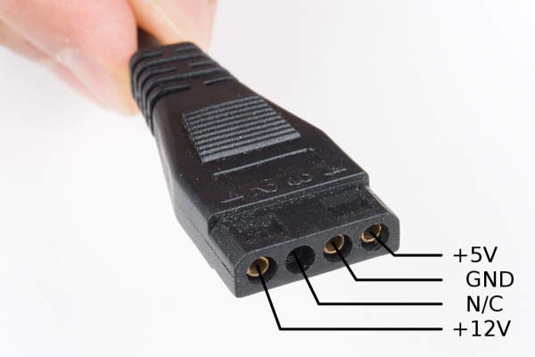
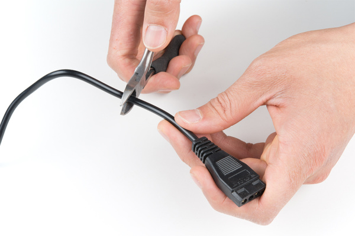
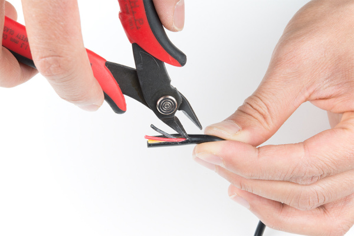
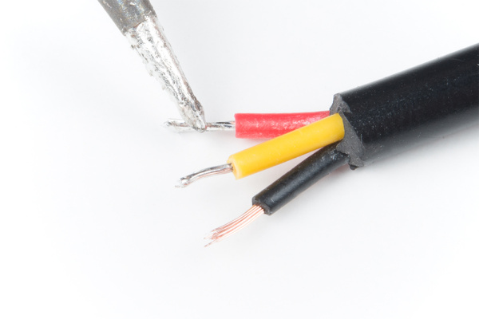
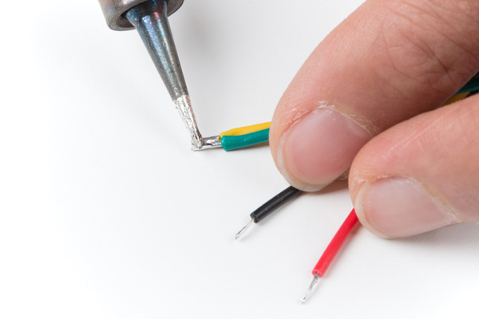
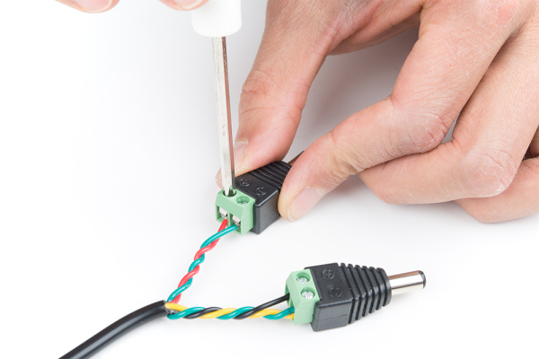
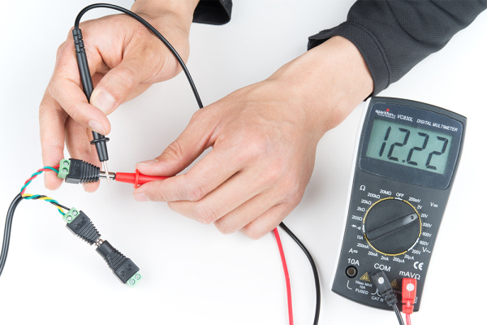
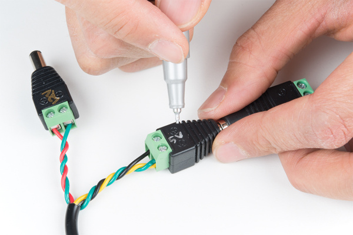
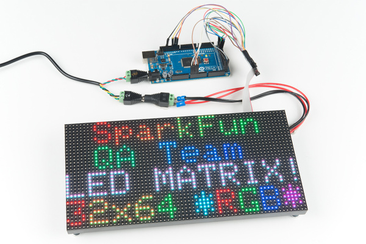
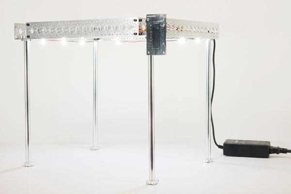

# 12V/5V電源の使い方

[12V/5V（2A）電源](https://www.sparkfun.com/products/15664)は、マイクロコントローラーとLEDに電力を供給するのに適している。
このチュートリアルでは、この電源のMolexコネクタを、2本のオスのバレルジャックアダプタに置き換える。

## 必要な部品

このチュートリアルを進めるには、次の材料が必要になる。
手元にあるものによっては、すべてが必要とは限らない。
カートに入れてガイドを読み進め、必要に応じて調整してほしい。
最も簡単に接続できるのは前者のキットで、電源を改造したい場合には後者のリストが向いている。

### 道具

はんだごて、はんだ、一般的なはんだ付け用アクセサリーに加え、次の道具が必要になる。

- 各種ワイヤー
- デジタルマルチメータ
- はんだ
- 斜めニッパー
- はんだ付けステーション
- ワイヤーストリッパー
- フラッシュカッター

## 参考になるチュートリアル

以下の概念に馴染みがない場合は、先に次のチュートリアルを読んでおくとよい。

- はんだ付けの基本（スルーホール編）
- コネクタの基礎
- プロジェクトへの電源供給
- 配線の基本
- テスターの使い方

## ハードウェア概要

電源のピン配置を下に示す。
コネクタの成形部分には、接続を識別しやすいよう出力に対応する番号が刻まれているはずである。
また、コネクタの両角が斜めにカットされており、極性を間違えないようになっていることにも気づくはずである。

### ピン配置表

> **警告！** メーカーによっては、[被膜内部のワイヤーの色が異なる](https://en.wikipedia.org/wiki/Molex_connector)ことがある。負荷につないで回路の電源を入れる前に、必ずマルチメータで接続を確認すること。

次の表は、ATXコネクタのピン配置と、想定されるワイヤーの色を示している。

| ATXピン配置（4ピン） | 12V/5V電源 | 備考 |
| --- | --- | --- |
| 1 | **+12V** | 「赤」 |
| 2 | N/C | 接続されていないことがある |
| 3 | GND | 「黄」 |
| 4 | **+5V** | 「黒（または白）」 |

## ハードウェアの接続

### ブレイクアウト基板

4ピンコネクタに簡単に接続するには、ATXパワーコネクタ（4ピン）の使用を推奨する。詳しくはチュートリアルを確認してほしい。

---

それ以外の方法として、ケーブルを改造し、好みの極性付きコネクタを使うこともできる。
こちらはより多くの時間と手間がかかる。
以下の画像では旧型の12V/5V電源を使っているため、メーカーによってはワイヤーの色が異なることがある。
4ピンのATXコネクタから1〜2インチほどの位置でケーブルを切断する。

フラッシュカッターで被膜に切り込みを入れる。
ワイヤーを扱うのに十分なスペースができる程度まで被膜を引き戻す。
手を切らないよう注意すること。

電源の3本のワイヤーの被膜を剥く。
これらのワイヤーはより線なので、先端にはんだを流し込んで予備はんだをしておくとよい。

続いて、ジャンパー線を切って被膜を剥く。それをグラウンドのワイヤーにはんだ付けする。

ワイヤーをより合わせ、バレルジャックコネクタに差し込む。
プラスドライバーでねじ端子にワイヤーを固定する。
この段階で、熱収縮チューブや絶縁テープを接続部に加えても構わない。

> **注意：** ねじ端子を使うのは、12V/5V電源を改造する一つの方法である。より確実な接続にしたい場合は、ワイヤーを極性付きコネクタに直接接続し、熱収縮チューブを加えるとよい。好みに応じて、5V側にはUSBコネクタを使うこともできる。

### 出力をテストする

バレルジャックコネクタでケーブルを改造した場合は、電源を入れてマルチメータで電圧を確認する。
通常、電源はセンタープラスであることが多いため、ワイヤーが正しく挿入されているか確認すること。
自分のシステムに合わせて必要に応じて調整する。

### 出力にラベルを付ける

バレルジャックコネクタでケーブルを改造した場合は、油性ペンでそれぞれのバレルジャックコネクタに対応する出力電圧を明確にラベル付けしておくことを推奨する。
使わないときのために、追加のバレルジャックを用意しておいてもよい。

### 回路に電源を入れる

電源を回路に接続し、電源を入れよう。
筆者は個人的に、この電源を基本的な動作テスト用のツールとして使っている。
通常、12V側はArduinoのバレルジャックに接続し、5V出力は、RGB LEDマトリクスや数メートル分のアドレサブルLED（WS2812B、APA102など）といった、より電力を必要とする負荷に使っている。

*12V/5V電源で駆動するArduino Mega 2560と[32x64 RGB LEDマトリクス](https://www.sparkfun.com/products/14718)*

## トラブルシューティング

電源によっては、ノイズがかなり多いものもある。
12V/5V電源はマイクロコントローラーとLEDストリップの組み合わせでは問題なく動作するが、メーカーによっては、そこに静電容量式のタッチセンサーを組み合わせると期待どおりに動作しないことがある。
2電圧出力の電源の中には、適切なフィルタリングが不足しているものがあり、静電容量式タッチポテンショメータに大きな遅延を引き起こすことがある。
使っている電源にノイズが多い場合は、追加の回路を組んで対策することもできる。

[新しい12V/5V電源（TOL-15664）](https://www.sparkfun.com/products/15664)では、この問題は見られないはずである。
以前のバージョンより信頼性が高い。
それでも問題が出る場合は、電源を2つに分けて使う、あるいは[Meanwell](https://www.sparkfun.com/categories/tags/mean-well)のようなより堅牢な電源を使うことも検討してほしい。

> **警告！** メーカーによっては、2電圧出力の電源に適切なフィルタリングが備わっておらず、Touch Potentiometerの動作を大きく乱すことがある。以前の[12V/5V電源（TOL-11296）](https://www.sparkfun.com/products/retired/11296)でこの現象を確認している。旧型の電源をTouch Potentiometerと組み合わせて使うことは**推奨しない**。

*Touch Potentiometer Hookup GuideによるPWM照明コントローラーの例*

## まとめ・参考資料

12V/5V電源を無事に動かせたら、次は自分のプロジェクトに組み込む番である。

より詳しい情報は、以下の資料を参照してほしい。

- [Molexコネクタのピン配置](http://cdn.sparkfun.com/datasheets/Prototyping/molexpinoutdiagram.jpg) — ある電源のピン配置。メーカーによってワイヤーの色が異なる場合がある点に注意
- [Wikipedia：Molexコネクタ](https://en.wikipedia.org/wiki/Molex_connector)
- [SparkFun Eagleライブラリ](https://github.com/sparkfun/SparkFun-Eagle-Libraries) — SparkFunのライブラリにあるMolexコネクタのEagleパーツを確認できる

次のプロジェクトのヒントとして、12V/5V（2A）電源を使った次のようなチュートリアルも参考になる。

- RGB Panel Hookup Guide — 32x16、32x32、32x64のRGB LEDマトリクスパネルを使い、明るくカラフルなディスプレイを作る。これらのパネルの接続方法とArduinoでの制御方法を解説している
- Large Digit Driver Hookup Guide — Large Digitディスプレイドライバー基板の使い始め方。大型の7セグメントLEDディスプレイの裏にモジュール（バックパック）をはんだ付けし、Arduinoからサンプルコードを実行する方法を説明する
- How to Build a Remote Kill Switch — 事態が「自我に目覚めた」ときに電源を落とせる、ワイヤレスコントローラーの作り方
- Building a Safe Cracking Robot — 未知の金庫を1時間以内に開錠する方法

電源についての、次のようなブログ記事も参考になる。

- Power Supply Protection — 逆極性接続から電子機器を守る最良の方法とは
- Enginursday: Supplies! — 一般的な電源の内部を覗いてみる
- Friday Product Post: All's Well That Means Well — 次のプロジェクトに命を吹き込む、さまざまな新しい電源の数々
- Enginursday: 60 USB Chargers in Parallel — USB充電用電源を60個並列に配線したら何が起きるかを試してみる
- Enginursday: More Fun with 60 USB Supplies — この60個のUSB電源を使って、溶接ができるか試してみる

タグ: Hookup、電源

---

出典：[12V/5V Power Supply Hookup Guide](https://learn.sparkfun.com/tutorials/12v5v-power-supply-hookup-guide)（SparkFun Learn）を日本語に翻訳し、再構成した。
原文は [CC BY-SA 4.0](https://creativecommons.org/licenses/by-sa/4.0/) ライセンスで公開されており、本ページも同ライセンスの下で提供する。
