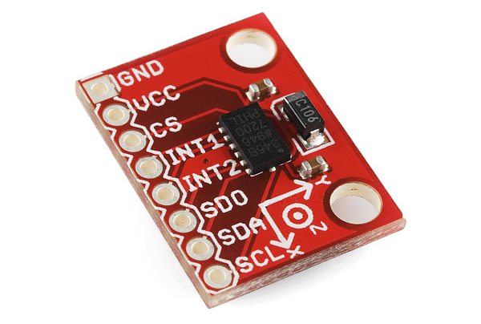
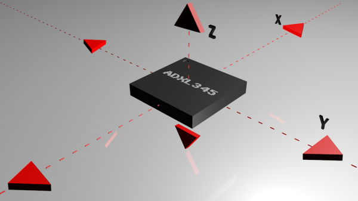
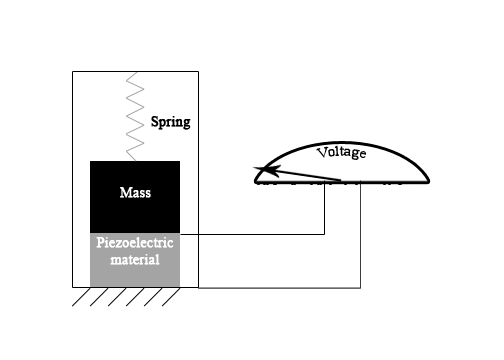
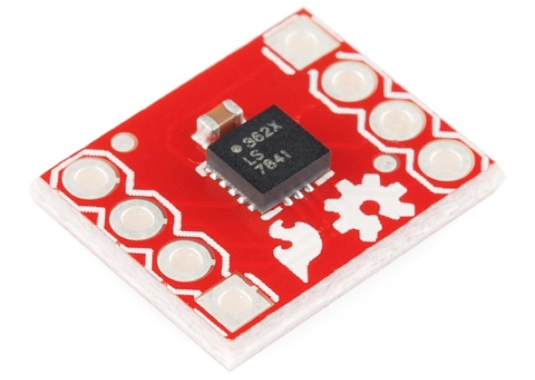

# 加速度センサーの基礎

加速度センサー（アクセロメータ）とは、物体の[速度](https://ja.wikipedia.org/wiki/速度)がどれだけの割合で変化しているかを表す[加速度](https://ja.wikipedia.org/wiki/加速度)を測定する装置である。
単位は毎秒毎秒メートル（m/s²）、あるいはG（重力加速度）で表される。
地球上での1Gは9.8m/s²に相当するが、これは標高によってわずかに変化する（また、重力の強さが異なる他の惑星では値も変わってくる）。
加速度センサーは、システムの振動を検知したり、姿勢を検出したりする用途に役立つ。

参考になるチュートリアル:

以下の話題に馴染みがなければ、加速度センサーに進む前に目を通しておくとよい。

- [ロジックレベル](./logic-levels.md)
- [SPI（シリアルペリフェラルインターフェース）](./serial-peripheral-interface-spi.md)
- [I2C](./i2c.md)
- [パルス幅変調（PWM）](./pulse-width-modulation.md)
- [アナログ-デジタル変換 (ADC)](./analog-to-digital-conversion.md)

## 加速度センサーの仕組み

加速度センサーは、静的または動的な加速度の力を検知する電気機械式の装置である。
静的な力には重力があり、動的な力には振動や動きなどがある。

加速度センサーは1軸、2軸、あるいは3軸の加速度を測定できる。
開発コストが下がるにつれて、3軸タイプが一般的になりつつある。

一般に、加速度センサーは内部に静電容量式のプレートを持っている。
一部のプレートは固定されており、他のプレートは非常に小さなバネに取り付けられ、加速度の力がセンサーに加わると内部で動くようになっている。
これらのプレートが互いに動くと、その間の[静電容量](./capacitors.md)が変化する。
この静電容量の変化から、加速度を求めることができる。

このほかに、圧電材料を中心に構成された加速度センサーもある。
これらの小さな結晶構造は、機械的な力（加速度など）が加わると電荷を出力する。

## 加速度センサーの接続方法

たいていの加速度センサーでは、動作に必要な基本的な接続は電源と通信線である。
いつものように、正しく接続するためにデータシートを確認すること。

### 通信インターフェース

加速度センサーは、アナログ、デジタル、あるいはパルス幅変調のいずれかの接続インターフェースで通信する。

- **アナログ**：アナログインターフェースを持つ加速度センサーは、電圧レベルの変化を通じて加速度を示す。この値はたいてい、グラウンドと供給電圧の間で変動する。マイクロコントローラの[ADC](./analog-to-digital-conversion.md)を使えば、この値を読み取ることができる。これらはたいてい、デジタル式の加速度センサーよりも安価である。
- **デジタル**：デジタルインターフェースを持つ加速度センサーは、[SPI](./serial-peripheral-interface-spi.md)または[I2C](./i2c.md)の通信プロトコルで通信する。これらはたいてい、アナログ式の加速度センサーよりも機能が豊富で、ノイズの影響を受けにくい。
- **パルス幅変調（PWM）**：パルス幅変調でデータを出力する加速度センサーは、周期は一定だが、加速度の変化に応じてデューティ比が変化する矩形波を出力する。

### 電源

加速度センサーは一般に低消費電力の装置である。
必要な電流はたいていマイクロ（µ）アンペアからミリアンペアの範囲に収まり、供給電圧は5V以下であることが多い。
消費電流は設定（省電力モードか通常動作モードかなど）によって変わる。
こうした複数の動作モードがあることから、加速度センサーは電池駆動の用途にも適している。

特にデジタルインターフェースを使う場合は、適切な[ロジックレベル](./logic-levels.md)が一致しているかを必ず確認すること。

## 加速度センサーの選び方

どの加速度センサーを使うかを選ぶ際には、先に述べた消費電力や通信インターフェースをはじめ、いくつかの重要な特徴を考慮する必要がある。
このほかに考慮すべき特徴を以下に挙げる。

### 測定範囲

たいていの加速度センサーには、測定できる力の範囲を選択できるようになっている。
この範囲は±1gから±250gまでさまざまである。
一般に、範囲が小さいほど、加速度センサーの読み取り値の感度は高くなる。
たとえば、テーブルの上の小さな振動を測定したい場合、250gレンジ（ロケットの測定などに向いている）よりも、小さいレンジの加速度センサーを使うほうが詳細なデータが得られる。

### そのほかの機能

加速度センサーの中には、タップ検出（低消費電力用途に便利）、自由落下検出（ハードディスクの衝撃保護機能に使われる）、温度補償（デッドレコニングの精度向上に役立つ）、0g検出といった機能を備えたものもあり、購入時に考慮すべき点となる。
こうした機能が必要かどうかは、加速度センサーを組み込むアプリケーションの用途によって決まる。

また、加速度センサーだけでなく、ジャイロセンサー、さらには磁力センサーまでも1つのICパッケージや基板にまとめたIMU（慣性計測装置）というものもある。
その例として、MPU6050やMPU9150が挙げられる。
これらは、物体の位置や姿勢が重要になるモーショントラッキングの用途や、UAV（無人航空機）の誘導システムなどでよく使われている。

## まとめ

これで、自分のプロジェクトに加速度センサーを組み込むために必要な基本的な道具とスキルが身についたはずである。

加速度センサーについてさらに学びたいなら、次のようなチュートリアルも確認してみてほしい（いずれも英語）。

- [Accelerometer Buying Guide（加速度センサー購入ガイド）](https://www.sparkfun.com/accel-gyro-guide)
- [MMA8452Q Accelerometer Breakout Hookup Guide（MMA8452Q加速度センサーブレイクアウトの使い方）](https://learn.sparkfun.com/tutorials/mma8452q-accelerometer-breakout-hookup-guide)
- [The Uncertain 7-Cube（不確かな7面サイコロ）](https://learn.sparkfun.com/tutorials/the-uncertain-7-cube)
- [Das Blinken Top Hat（光るシルクハット）](https://learn.sparkfun.com/tutorials/das-blinken-top-hat)

タグ: 概念、モーション、センサー、技術

---

出典：[Accelerometer Basics](https://learn.sparkfun.com/tutorials/accelerometer-basics)（SparkFun Learn）を日本語に翻訳し、再構成した。
原文は [CC BY-SA 4.0](https://creativecommons.org/licenses/by-sa/4.0/) ライセンスで公開されており、本ページも同ライセンスの下で提供する。
