# 交流と直流の違い

オーストラリアのロックバンドAC/DCのバンド名の由来をご存じだろうか。
もちろん、交流（Alternating Current）と直流（Direct Current）である。
ACとDCはどちらも、回路内の電流の流れ方を表す言葉である。
**直流**（DC）では、電荷（電流）は一方向にしか流れない。
一方、**交流**（AC）の電荷は周期的に向きを変える。
電流の向きが変わるため、交流回路の電圧も周期的に反転する。

自分で作るデジタル電子工作の多くは直流を使うことになるが、交流の概念も理解しておくことが重要である。
たいていの住宅は交流で配線されているため、プロジェクトをコンセントに接続したい場合は交流を直流に変換する必要がある。
また交流には、単一の部品（変圧器）だけで電圧のレベルを変換できるという便利な性質があり、これが長距離の送電に交流が採用されてきた理由でもある。

このチュートリアルで扱う内容:

- 交流と直流の歴史的背景
- 交流と直流を発生させるさまざまな方法
- 交流と直流の応用例

参考になるチュートリアル:

- [電気とは何か](./what-is-electricity.md)
- [回路とは何か](./what-is-a-circuit.md)
- [電圧、電流、抵抗とオームの法則](./voltage-current-resistance-and-ohms-law.md)
- [電力](./electric-power.md)

## 交流（AC）

交流とは、周期的に向きを変える電荷の流れのことである。
その結果、電圧のレベルも電流と一緒に反転する。
交流は住宅やオフィスビルなどへの電力供給に使われている。

### 交流の発生

交流は「オルタネータ」と呼ばれる装置を使って発生させることができる。
これは交流を発生させるために設計された、特殊な発電機の一種である。

磁場の中でコイル状の配線を回転させると、その配線に沿って電流が誘導される。
配線を回転させる動力源には、風力タービン、蒸気タービン、水流などさまざまなものがありうる。
配線が回転するたびに磁極が周期的に切り替わるため、配線上の電圧と電流も交互に入れ替わる。

交流の発生は、[電圧の水の例え](./voltage-current-resistance-and-ohms-law.md)とも比較できる。

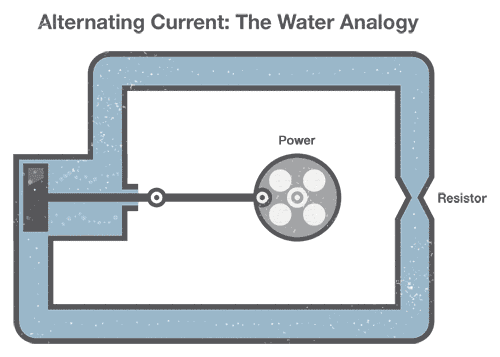

一組の水道管で交流を作り出すには、水を管の中で前後に動かすピストンに機械式のクランクを接続する（これが私たちの「交流」にあたる）。
管の途中にある狭くなった部分は、水の流れる向きに関係なく[抵抗](./voltage-current-resistance-and-ohms-law.md)として働き続けることに注目してほしい。

### 波形

交流には、電圧と電流が交互に変化する限り、さまざまな形がありうる。
交流回路にオシロスコープをつなぎ、電圧を時間の関数としてグラフにすると、いろいろな波形が見えてくる。
もっとも一般的な交流の形は正弦波である。
たいていの住宅やオフィスの交流電圧は、正弦波を描くように振動している。

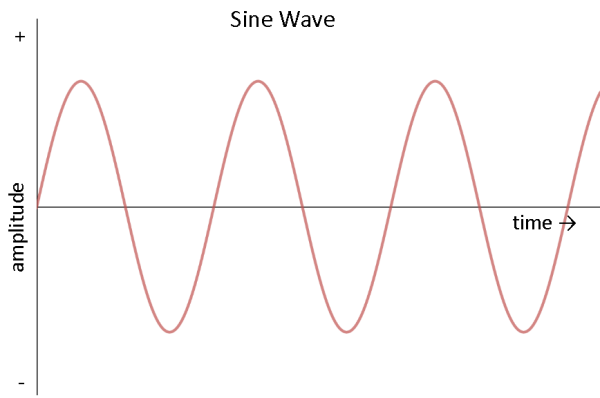

このほかによく見られる交流の形として、矩形波と三角波がある。

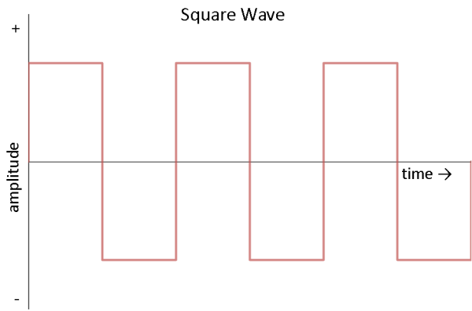

矩形波は、デジタル回路やスイッチング回路の動作テストによく使われる。

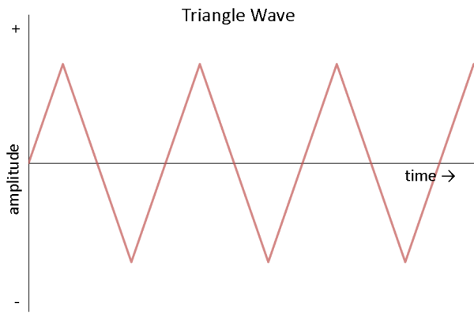

三角波は音響合成の分野で見られ、アンプのようなリニア回路のテストに役立つ。

### 正弦波を数式で表す

交流の波形を数学的な言葉で表したいことがよくある。
ここでは、よく使われる正弦波を例に見ていこう。
正弦波には**振幅、周波数、位相**という3つの要素がある。

電圧だけに注目すると、正弦波は次のような数式で表せる。

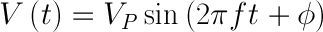

**V(t)** は時間の関数としての電圧を表しており、時間が変化するにつれて電圧も変化することを意味する。
イコールの右側の式は、電圧が時間とともにどのように変化するかを表している。

**VP** は*振幅*である。
これは、正弦波が正負どちらの方向にも到達しうる最大電圧を表しており、電圧は+VPボルト、-VPボルト、あるいはその間のどこかの値を取りうる。

**sin()**関数は、電圧が周期的な正弦波の形、つまり0Vを中心とした滑らかな振動になることを示している。

**2π**は、周波数の単位をサイクル（ヘルツ）から[角周波数](http://en.wikipedia.org/wiki/Angular_frequency)（ラジアン毎秒）に変換するための定数である。

**f**は正弦波の*周波数*を表す。
これは*ヘルツ*、つまり1秒あたりの回数として与えられる。
周波数は、ある波形（この場合は正弦波の1サイクル、つまり1回の上昇と下降）が1秒間に何回起こるかを示している。

**t**は独立変数である時間（秒単位）を表す。
時間が変化するにつれて、波形も変化する。

**φ**は正弦波の*位相*を表す。
位相は、波形が時間に対してどれだけずれているかを示す指標である。
たいてい0度から360度の間の数値として、度単位で与えられる。
正弦波は周期的な性質を持つため、波形を360度ずらしても、0度ずらした場合と同じ波形になる。
簡単にするため、このチュートリアルの残りの部分では位相を0度と仮定する。

身近な例として、コンセントから得られる電力の波形を見てみよう。
アメリカ合衆国では、家庭に供給される電力は交流であり、ゼロからピークまでの電圧（振幅）はおよそ170V、周波数は60Hzである。
これらの数値を先ほどの式に当てはめると（位相は0度と仮定する）、次のようになる。

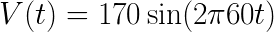

この式は、手元のグラフ電卓や、[Desmos](https://www.desmos.com/calculator)のような無料のオンライングラフ作成ツールを使ってグラフにできる（式の中で"v"の代わりに"y"を使う必要がある場合もある）。

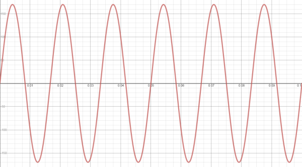

予想どおり、電圧は周期的に170Vまで上昇し、-170Vまで下降していることが分かる。
また、正弦波は1秒間に60サイクル発生している。
コンセントの電圧をオシロスコープで測定すればこのような波形が見られるはずだが、**警告**：コンセントの電圧をオシロスコープで測定してはいけない。機器を破損する可能性が高い。

**注記：** アメリカの交流電圧は120Vだと聞いたことがあるかもしれないが、これも正しい。
なぜだろうか。
交流について語るとき（電圧が絶えず変化するため）、平均値や実効値を使うほうが扱いやすいことが多い。
そのために使われるのが["二乗平均平方根"](http://en.wikipedia.org/wiki/Root_mean_square)（RMS）と呼ばれる方法である。
[電力](./electric-power.md)を計算したいときには、交流のRMS値を使うと便利なことが多い。
先ほどの例では電圧が-170Vから170Vの間で変動していたが、その実効値（RMS）は120Vになる。

### 応用例

家庭やオフィスのコンセントは、ほぼ必ず交流である。
これは、交流を長距離にわたって発生させ、送電するのが比較的容易だからである。
高い電圧（110kVを超える程度）で送電すると、電力の送電時の損失が少なくなる。
電圧が高いほど電流は少なくて済み、電流が少ないほど、電線の抵抗によって[発生する熱](./electric-power.md)も少なくなる。
交流は変圧器を使うことで、高電圧との間で容易に変換できる。

交流はまた、電動モーターを動かす力にもなる。
モーターと発電機はまったく同じ装置であり、モーターは電気エネルギーを機械エネルギーに変換する（モーターの軸を回すと、端子に電圧が発生する）。
これは食器洗い機や冷蔵庫など、交流で動く多くの大型家電にとって便利な性質である。

## 直流（DC）

直流は、交流に比べて理解しやすい。
前後に振動する代わりに、直流は一定の電圧または電流を供給する。

### 直流の発生

直流は、次のようないくつかの方法で発生させることができる。

- ["整流子"](<http://en.wikipedia.org/wiki/Commutator_(electric)>)と呼ばれる装置を備えた交流発電機を使う方法
- ["整流器"](http://en.wikipedia.org/wiki/Rectifier)と呼ばれる、交流を直流に変換する装置を使う方法
- [電池](./battery-technologies.md)を使う方法。電池内部の化学反応によって直流が発生する

再び水の例えを使うと、直流は先端にホースが付いた水タンクによく似ている。

このタンクは、ホースから出ていく一方向にしか水を押し出せない。
直流を発生させる電池と同じように、タンクが空になれば、もう水は管を流れなくなる。

### 直流を数式で表す

直流は「単方向」の電流の流れとして定義される。つまり、電流は一方向にしか流れない。
流れる向きさえ変わらなければ、電圧や電流は時間とともに変化してもよい。
話を単純にするため、ここでは電圧が一定であると仮定しよう。
たとえば単3形電池が1.5Vを供給すると仮定すると、これは次のような数式で表せる。

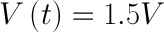

これを時間についてグラフにすると、一定の電圧が見えてくる。

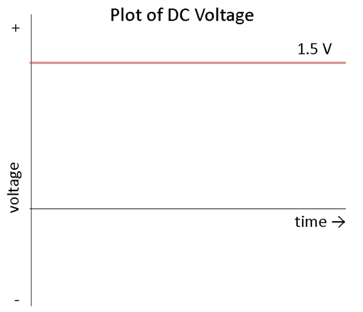

これは何を意味するのだろうか。
たいていの直流電源は、時間が経っても一定の電圧を供給し続けると考えてよいということである。
実際には、電池は徐々に電荷を失っていくため、使用するにつれて電圧は下がっていく。
とはいえ、たいていの目的においては、電圧は一定だと仮定してよい。

### 応用例

SparkFunで販売されているほぼすべての電子工作プロジェクトや部品は、直流で動作する。
電池で動くもの、[ACアダプタ](https://ja.wikipedia.org/wiki/ACアダプター)を使ってコンセントに差し込むもの、USBケーブルで給電するものは、いずれも直流に依存している。
直流で動作する電子機器の例としては、次のようなものがある。

- 携帯電話
- LilyPadを使ったダイスガントレットのようなウェアラブルプロジェクト
- 薄型テレビ（交流がテレビに入り、内部で直流に変換される）
- 懐中電灯
- ハイブリッド車や電気自動車

## 電流戦争

現在ではほぼすべての住宅や事業所が交流で配線されているが、これは一夜にして決まったことではない。
1880年代後半、アメリカ合衆国とヨーロッパ各地でさまざまな発明が生まれ、交流と直流の配電方式をめぐる本格的な争いへと発展していった。

1886年、ブダペストの電気会社ガンツ・ワークスは、ローマ全域に交流で電力を供給した。
一方、トーマス・エジソンは1887年までにアメリカ国内に121の直流発電所を建設していた。
この争いの転機となったのは、翌年、ピッツバーグの著名な実業家ジョージ・ウェスティングハウスが、ニコラ・テスラが持つ交流モーターと交流送電の特許を買い取ったことである。

### 交流対直流

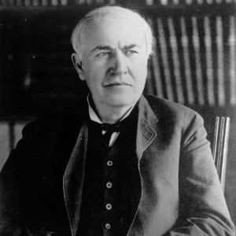

_トーマス・エジソン_

1800年代後半、直流は高電圧への変換が容易ではなかった。
そのためエジソンは、個々の近隣地区や市街地に電力を供給する、小規模で地域密着型の発電所からなるシステムを提案した。
電力は発電所から3本の電線、すなわち+110ボルト、0ボルト、-110ボルトを使って配電された。
照明やモーターは、+110Vまたは-110Vのソケットと0V（中性線）の間に接続することができた。
110Vという電圧は、発電所から負荷（住宅やオフィスなど）までの間である程度の電圧降下が起きることを見込んだ値だった。

送電線での電圧降下は考慮に入れられていたものの、発電所は利用者から1マイル以内に設置する必要があった。
この制約により、農村地域での電力供給は非常に困難、あるいは事実上不可能だった。

| 人物                           | 説明                                                           |
| ------------------------------ | -------------------------------------------------------------- |
| ニコラ・テスラ                 | 交流モーターと交流送電の特許を持っていた発明家                 |
| ジョージ・ウェスティングハウス | テスラの特許を買い取り、交流配電システムの実用化を進めた実業家 |

テスラの特許を得たウェスティングハウスは、交流配電システムの完成に取り組んだ。
変圧器を使えば、交流の電圧を数千ボルトまで安価に昇圧し、また使いやすいレベルまで降圧することができた。
電圧が高いほど、同じ電力をより少ない電流で送電できるため、送電線の抵抗による電力損失も少なくなった。
その結果、大規模な発電所を遠く離れた場所に設置しても、より多くの人々や建物に電力を供給できるようになった。

### エジソンによる印象操作

その後の数年間、エジソンはアメリカ国内で交流の使用を思いとどまらせるための運動を展開した。
これには州議会への働きかけや、交流に関する誤った情報の流布も含まれていた。
エジソンはまた、交流が直流よりも危険であることを示そうとして、複数の技術者に動物を公開の場で交流によって感電死させるよう指示した。
その危険性を示す試みとして、エジソンの部下だったハロルド・P・ブラウンとアーサー・ケネリーは、ニューヨーク州のために交流を使った初の電気椅子を設計した。

### 交流の台頭

1891年、ドイツのフランクフルトで国際電気技術博覧会が開催され、三相交流による初の長距離送電が披露された。
この送電は博覧会場の照明やモーターに電力を供給するものだった。
後にゼネラル・エレクトリックとなる会社の代表者数名もこの場に立ち会い、その展示に大いに感銘を受けた。
翌年、ゼネラル・エレクトリックが設立され、交流技術への投資を始めた。

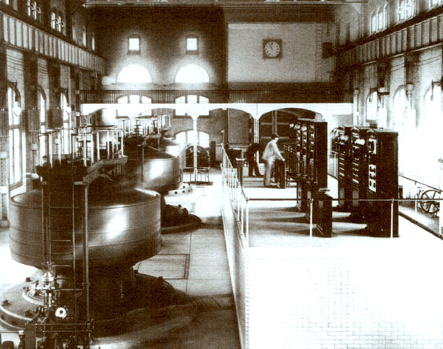

_ナイアガラの滝にあるエドワード・ディーン・アダムズ発電所（1896年）_

ウェスティングハウスは1893年、ナイアガラの滝の水力を利用する水力発電ダムを建設し、バッファローまで交流を送電する契約を勝ち取った。
このプロジェクトは1896年11月16日に完成し、交流電力がバッファローの産業を支えるようになった。
この出来事は、アメリカにおける直流の衰退を象徴する出来事となった。
ヨーロッパでは220〜240ボルトかつ50Hzの交流規格が採用される一方、北米では120ボルトかつ60Hzが標準となった。

### 高圧直流送電（HVDC）

スイスの技術者ルネ・チュリーは、1880年代に一連の電動発電機を使い、長距離にわたって直流電力を送電できる高圧直流システムを考案した。
しかし、チュリー式システムはコストと保守の負担が大きく、HVDCはその後ほぼ1世紀にわたって採用されることがなかった。

1970年代に半導体電子工学が発明されたことで、交流と直流の間を経済的に変換することが可能になった。
専用の設備を使えば、高圧の直流電力（800kVに達するものもある）を発生させられるようになった。
ヨーロッパの一部地域では、さまざまな国を電気的に接続するためにHVDC送電線の導入が進められている。

HVDC送電線は、非常に長距離にわたって送電する場合、同等の交流送電線よりも損失が少ない。
さらに、HVDCは異なる交流方式（たとえば50Hzと60Hz）どうしを接続することも可能にする。
こうした利点がある一方で、HVDCシステムは一般的な交流システムに比べてコストが高く、信頼性の面でも劣る。

結局のところ、エジソン、テスラ、ウェスティングハウスの願いはそれぞれかなえられたと言えるかもしれない。
交流と直流は共存し、それぞれの役割を果たしている。

## まとめ

これで、交流と直流の違いについて十分に理解できたはずである。
交流は電圧レベルの変換が容易であり、高電圧送電をより現実的なものにしている。
一方、直流はほぼすべての電子機器の中に見られる。
この2つはあまり相性がよくないため、たいていの電子機器をコンセントに接続したいなら、交流を直流に変換する必要があることも覚えておこう。
ここまで理解できれば、交流を含むより複雑な回路や概念にも取り組む準備が整ったはずである。

さらに電子工作の世界を深く学びたいなら、次のチュートリアルも確認してみてほしい。

- [直列回路と並列回路](./series-and-parallel-circuits.md)
- [ロジックレベル](./logic-levels.md)
- [テスターの使い方](./how-to-use-a-multimeter.md)
- [プロジェクトへの電源供給](./how-to-power-a-project.md)

タグ: 概念、電気工学、電力

---

出典：[Alternating Current (AC) vs. Direct Current (DC)](https://learn.sparkfun.com/tutorials/alternating-current-ac-vs-direct-current-dc)（SparkFun Learn）を日本語に翻訳し、再構成した。
原文は [CC BY-SA 4.0](https://creativecommons.org/licenses/by-sa/4.0/) ライセンスで公開されており、本ページも同ライセンスの下で提供する。
