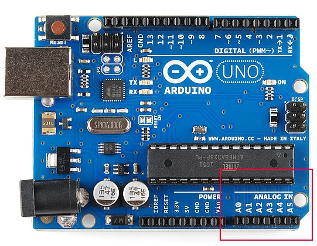
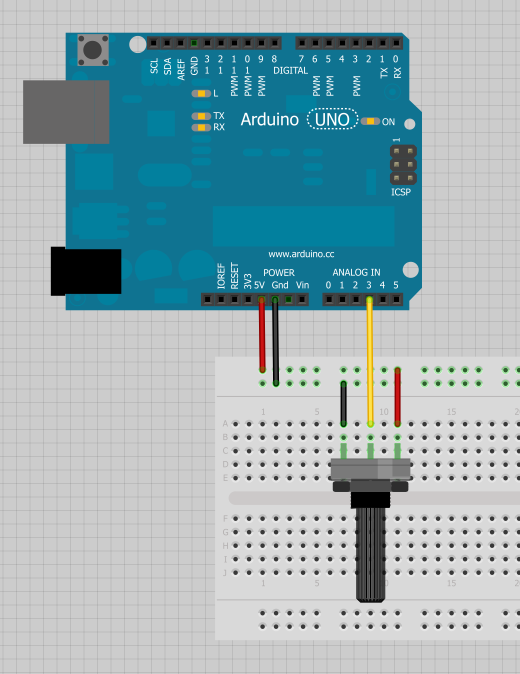

# アナログ-デジタル変換 (ADC)

マイコンが検出できるのは、基本的には二値の信号である。
ボタンが押されているか、いないか。
これが**デジタル信号**である。
5ボルトで動作するマイコンは、0ボルト（0V）を2進数の0、5ボルト（5V）を2進数の1として認識する。
しかし現実の世界はそれほど単純ではなく、その中間の値をとる。
信号が2.72Vだったら、それは0なのか1なのか。
このように変化し続ける信号を測定する必要がある場面は多く、こうした信号を**アナログ信号**と呼ぶ。
5V系のアナログセンサーは、0.01Vや4.99V、あるいはその間のどんな値も出力しうる。
幸い、ほとんどすべてのマイコンには、こうした電圧をプログラムの中で判断材料として使える値に変換する仕組みが内蔵されている。

このチュートリアルを読む前に知っておくとよい話題:

- [電圧、電流、抵抗とオームの法則](./voltage-current-resistance-and-ohms-law.md)
- [2進数](./binary.md)
- [アナログとデジタルの違い](./analog-vs-digital.md)
- Arduinoの `analogRead()`
- [分圧回路](./voltage-dividers.md)
- [テスターの使い方](./how-to-use-a-multimeter.md)
- [プロジェクトへの電源供給](./how-to-power-a-project.md)

## ADCとは何か

**ADC**（Analog to Digital Converter、アナログ-デジタル変換器）は、ピンにかかっているアナログ電圧をデジタルな数値に変換してくれる、非常に便利な機能である。
アナログの世界からデジタルの世界へと変換することで、身の回りのアナログな世界と電子回路とのあいだをつなげられるようになる。



マイコンのすべてのピンがアナログ-デジタル変換に対応しているわけではない。
Arduinoのボードでは、ラベルの先頭に「A」が付いたピン（A0からA5まで）が、アナログ電圧を読み取れるピンであることを示している。

ADCの性能はマイコンによって大きく異なる。
Arduinoに搭載されているADCは10ビットADCであり、1,024段階（2^10）の離散的なアナログレベルを検出できる。
マイコンによっては8ビットADC（2^8 = 256段階）のものもあれば、16ビットADC（2^16 = 65,536段階）のものもある。

ADCの内部動作はかなり複雑である。
実現方法にはいくつかの方式があるが（一覧は[Wikipedia](https://ja.wikipedia.org/wiki/アナログ-デジタル変換回路)を参照）、よく使われる方式の1つは、アナログ電圧で内部のコンデンサを充電し、それを内部の抵抗を通して放電するのにかかる時間を測るという方法である。
マイコンは、コンデンサが放電しきるまでに経過したクロックサイクルの数を数えており、ADCの変換が完了した時点で返される値は、このクロックサイクル数に基づいている。

## ADCの値と電圧の関係

ADCが返す値は**比率としての値**である。
つまりADCは、5Vを1023として扱い、5V未満の電圧はすべて5Vと1023の間の比率として表す。

Arduinoの10ビットADCを5V系で使う場合が多いことを踏まえると、この関係は次の式に単純化できる。

\\[ \text{ADCの値} = \left(\frac{\text{読み取った電圧}}{5\,\text{V}}\right) \times 1023 \\]

システムの電源電圧が3.3Vなら、式の5Vを3.3Vに置き換えるだけでよい。
たとえば3.3V系でADCが512という値を返したとき、実際の電圧はおよそ1.65Vである。

逆に、アナログ電圧が2.12Vのとき、ADCはどんな値を返すだろうか。
先の式をADCの値について解くと、

\\[ \text{ADCの値} = \left(\frac{2.12\,\text{V}}{5\,\text{V}}\right) \times 1023 \approx 434 \\]

という計算になり、ADCはおよそ434を返すはずだとわかる。

## Arduinoを使ったADCの例

実際にArduinoを使ってアナログ電圧を検出してみよう。
トリムポット（可変抵抗）や光センサー、あるいは簡単な分圧回路を使って電圧を作り出す。
ここでは例として、簡単なトリムポットの回路を組む。



まず、ピンを入力として定義する必要がある。
回路図に合わせて、ここではA3ピンを使う。

```cpp
pinMode(A3, INPUT);
```

続いて、[analogRead()](http://arduino.cc/en/Reference/analogRead) コマンドでアナログ-デジタル変換を行う。

```cpp
int x = analogRead(A3); // A3ピンのアナログ値をxに読み込む
```

戻り値として `x` に格納されるのは、0から1023までのいずれかの値である。
Arduinoは10ビットのADCを持つため、2^10 = 1024段階を表現できる。
この値をintに格納するのは、`x` が10ビットであり、バイト型（8ビット）には収まらない大きさだからである。

値が変化する様子を確認するために、シリアルに出力してみる。

```cpp
Serial.print("Analog value: ");
Serial.println(x);
```

アナログ電圧を変化させると、`x` の値もそれに応じて変化する。
たとえば `x` が334と表示され、Arduinoが5Vで動作しているとすると、実際の電圧はいくらになるだろうか。
テスター（デジタルマルチメーター）を取り出して実際の電圧を測ってみると、およそ1.63Vになっているはずである。
これで、Arduinoを使った自作のデジタルマルチメーターができあがったことになる。

## 配線を間違えるとどうなるか

**アナログセンサーを通常の（デジタル用の）ピンにつないだらどうなるか。**
悪いことは何も起きない。
ただし、`analogRead` を正しく実行できなくなる。

```cpp
int x = analogRead(8); // デジタルピン8でアナログ値を読もうとしている（これはうまくいかない）
```

このコードはコンパイルは通るが、`x` には意味のない値が入る。

**デジタルセンサーをアナログピンにつないだらどうなるか。**
これも同様に、壊れることはない。
ボタンのようなデジタル信号をアナログ-デジタル変換すると、ADCの値はほぼ1023（5V、つまり2進数の1に相当）か、ほぼ0（0V、つまり2進数の0に相当）のどちらかに偏った値になるはずである。

## まとめ

アナログ-デジタル変換を学ぶことは、電子工作において大きな意味を持つ。
この重要な概念を理解したところで、ADCを利用しているさまざまなプロジェクトやセンサーにも目を向けてみてほしい。

- [加速度センサー](./accelerometer-basics.md)や[ジャイロセンサー](./gyroscope.md)の一部にはアナログ出力のものがあり、使える値として読み取るにはADCが必要になる。
- <ruby>[PWM](https://learn.sparkfun.com/tutorials/pulse-width-modulation)<rt>パルス幅変調</rt></ruby>は、アナログ入力とは逆の、いわばアナログ出力に相当する仕組みである。
- [INA169](https://learn.sparkfun.com/tutorials/ina169-breakout-board-hookup-guide)のようなICを使うと、ADCで電流を検出できる。
- [分圧回路](./voltage-dividers.md)とADCを組み合わせれば、トリムポットやジョイスティック、スライダー、感圧抵抗（FSR）など、さまざまなセンサーや可変部品を読み取れる。
- ArduinoにはADCの値を別の範囲に変換する [`map()`](https://www.arduino.cc/reference/en/language/functions/math/map/) 関数がある。

タグ: Arduino、概念、電気工学

---

出典：[Analog to Digital Conversion](https://learn.sparkfun.com/tutorials/analog-to-digital-conversion)（SparkFun Learn）を日本語に翻訳し、再構成した。
原文は [CC BY-SA 4.0](https://creativecommons.org/licenses/by-sa/4.0/) ライセンスで公開されており、本ページも同ライセンスの下で提供する。
