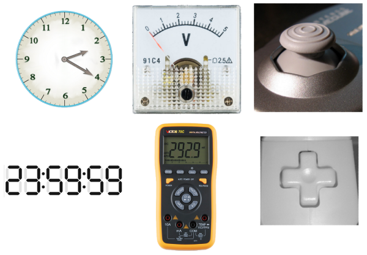
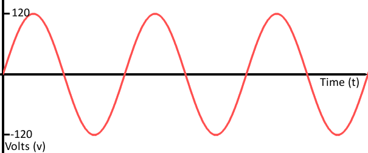
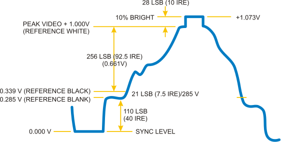
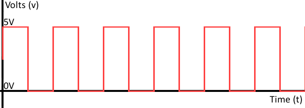
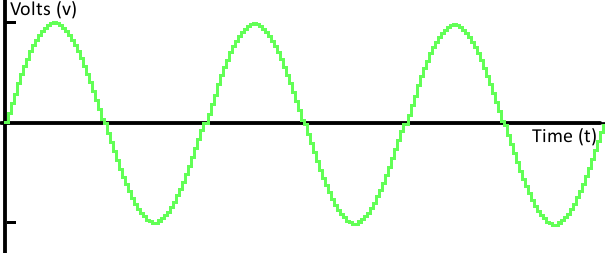
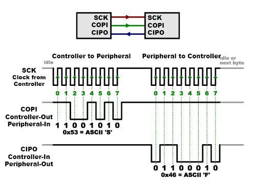
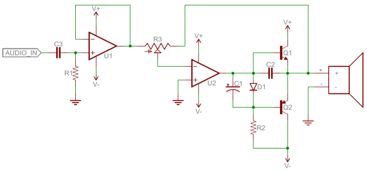
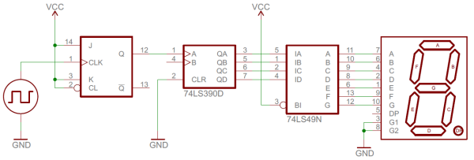

# アナログとデジタルの違い

私たちはアナログな世界に生きている。
ものを塗る色は無限に存在し（たとえ私たちの目にはその違いが分からなくても）、耳にできる音色も無限にあり、嗅ぐことができる匂いも無限にある。
これらのアナログな信号すべてに共通しているのは、その**無限**の可能性である。

デジタルの信号や物体は、**離散的**あるいは**有限**の領域を扱う。
つまり、取りうる値の集合が限られているということである。
それは2通りだけのこともあれば、255通り、4,294,967,296通りということもあるが、いずれにせよ∞（無限）ではない。

電子工作に取り組むということは、アナログとデジタル両方の信号、入力、出力を扱うということでもある。
私たちの電子工作プロジェクトは、何らかの形で現実のアナログな世界とやり取りしなければならないが、たいていのマイクロプロセッサやコンピュータ、論理回路は純粋にデジタルな部品である。
この2種類の信号は、いわば異なる電子的な「言語」のようなものであり、両方の言語を話せるバイリンガルな部品もあれば、どちらか一方しか理解できない部品もある。

このチュートリアルでは、デジタル信号とアナログ信号それぞれの基本を、具体例を交えて紹介する。
また、アナログ回路とデジタル回路、そしてそれぞれに使われる部品についても解説する。

アナログとデジタルという概念そのものは独立した話題であり、それほど多くの電子工学の予備知識を必要としない。
とはいえ、まだ読んでいなければ、次のチュートリアルにも目を通しておくとよい。

参考になるチュートリアル:

- [電圧、電流、抵抗とオームの法則](./voltage-current-resistance-and-ohms-law.md)
- [回路とは何か](./what-is-a-circuit.md)

あわせて、グラフの読み方や、有限集合と無限集合の違いといった数学的な概念も役に立つ。

## アナログ信号

### 信号とは何か

先に進む前に、*信号*とは何か、特に電子的な信号について少し説明しておこう（交通信号や、[伝説のパワートリオによるアルバム](http://www.youtube.com/watch?v=z41I3yX_cVI)、あるいは一般的な意味でのコミュニケーション手段とは区別してほしい）。
ここで言う信号とは、何らかの情報を伝える**時間とともに変化する**「量」のことである。
電気工学において、時間とともに変化するその「量」とは、たいてい**電圧**である（電圧でなければ、たいてい電流である）。
つまり信号について語るときは、時間とともに変化する電圧のことだと考えればよい。

信号は、情報を送受信するために機器と機器の間でやり取りされる。
その情報は映像であったり、音声であったり、何らかの形で符号化されたデータであったりする。
信号はたいてい配線を通じて伝送されるが、無線周波数（RF）の電波として空中を伝わることもある。
たとえば音声信号はパソコンのオーディオカードとスピーカーの間でやり取りされ、データ信号はタブレットとWiFiルーターの間を空中を通じてやり取りされる。

### アナログ信号のグラフ

信号は時間とともに変化するため、横軸（*x*軸）に時間を、縦軸（*y*軸）に電圧を取ってグラフにすると分かりやすい。
信号のグラフを見れば、それがアナログかデジタルかを見分けるのはたいてい簡単である。
アナログ信号の時間対電圧のグラフは、**滑らか**で**連続的**になるはずである。

これらの信号は最大値と最小値の**範囲**に収まっていることが多いが、その範囲の中には依然として無限の値がありうる。
たとえば、コンセントから得られるアナログ電圧は-120Vから+120Vの間に収まっているかもしれないが、分解能を上げていけばいくほど、その信号が実際に取りうる値は無限に存在することが分かる（64.4V、64.42V、64.424Vというように、精度を上げるほど無限に細かい値がありうる）。

### アナログ信号の例

映像や音声の伝送には、アナログ信号が使われることが多い。
たとえば古いRCAジャックから出てくるコンポジット映像信号は、たいてい0V〜1.073Vの範囲で符号化されたアナログ信号である。
信号のわずかな変化が、映像の色や位置に大きな影響を与える。

純粋な音声信号もアナログである。
マイクから出てくる信号は、さまざまなアナログの周波数と倍音成分に満ちており、それらが組み合わさって美しい音楽を作り出している。

## デジタル信号

デジタル信号は、取りうる値の集合が有限でなければならない。
その集合に含まれる値の数は、2個からとても大きいがそれでも無限ではないある数までの間で、いくらでもありうる。
もっとも一般的なデジタル信号は、たとえば0Vか5Vかというように**2通りの値**のどちらかを取る。
このような信号のタイミング図は**矩形波**のような形になる。

あるいは、デジタル信号がアナログ波形を離散的に表現したものであることもある。
遠くから見ると、下の波形は滑らかでアナログのように見えるかもしれないが、近づいてよく見ると、信号が値を近似しようとする小さな離散的な**階段状の段差**があることが分かる。

これが、アナログ波形とデジタル波形の大きな違いである。
アナログ波形は滑らかで連続的だが、デジタル波形は段階的で、矩形状で、離散的である。

### デジタル信号の例

すべての音声や映像の信号がアナログというわけではない。
映像（および音声）用の[HDMI](http://en.wikipedia.org/wiki/HDMI)や、音声用の[MIDI](http://en.wikipedia.org/wiki/Musical_Instrument_Digital_Interface)、[I2S](http://en.wikipedia.org/wiki/I%C2%B2S)、[AC'97](http://en.wikipedia.org/wiki/AC%2797)といった標準規格は、いずれもデジタルで伝送される。

[集積回路](./integrated-circuits.md)どうしの通信の多くもデジタルである。
シリアル通信、I2C、SPIといったインターフェースは、いずれも符号化された矩形波の連続としてデータを伝送する。

## アナログ回路とデジタル回路

### アナログ電子回路

抵抗器、コンデンサ、インダクタ、ダイオード、トランジスタ、オペアンプといった基本的な電子部品のほとんどは、本質的にアナログである。
これらの部品だけを組み合わせて作られた回路は、たいていアナログ回路になる。

アナログ回路は、多数の部品を使った非常に洗練された設計になることもあれば、2つの抵抗器を組み合わせただけの[分圧回路](./voltage-dividers.md)のように、とても単純なこともある。
とはいえ全般的に、アナログ回路は同じ仕事をデジタルで実現する回路に比べて**設計がはるかに難しい**。
アナログのラジオ受信機やアナログの電池充電器を設計するには、特別な才能を持つアナログ回路の達人が必要になる。デジタル部品を使えば、こうした設計ははるかに簡単になる。

アナログ回路は、たいていノイズ（電圧の小さく望ましくない変動）の影響を**受けやすい**。
アナログ信号の電圧レベルのわずかな変化が、処理の過程で大きな誤差を生むことがある。

### デジタル電子回路

デジタル回路は、離散的なデジタル信号を使って動作する。
これらの回路はたいてい、トランジスタと[論理ゲート](./digital-logic.md)の組み合わせでできており、より高いレベルではマイクロコントローラやその他の演算チップで構成される。
パソコンに搭載されているような大きく高性能なプロセッサであれ、小さなマイクロコントローラであれ、たいていのプロセッサはデジタルの領域で動作している。

デジタル回路は、デジタル信号を送るために[2進数](./binary.md)方式を使うのが一般的である。
このような方式では、2つの異なる電圧をそれぞれ異なるロジックレベルに割り当てる。高い電圧（たいてい5V、3.3V、1.8Vなど）が一方の値を、低い電圧（たいてい0V）がもう一方の値を表す。

デジタル回路は一般に設計しやすいが、同じ仕事をするアナログ回路に比べて**コストがやや高くなる**傾向がある。

### アナログとデジタルの組み合わせ

1つの回路の中にアナログとデジタルの部品が混在しているのは、決して珍しいことではない。
マイクロコントローラはたいていデジタルの塊のような存在だが、アナログ回路とやり取りするための内部回路を備えていることが多い（[アナログ-デジタル変換器](./analog-to-digital-conversion.md)、パルス幅変調、デジタル-アナログ変換器など）。
アナログ-デジタル変換器（ADC）を使えば、マイクロコントローラはフォトセルや温度センサーのようなアナログセンサーと接続し、アナログ電圧を読み取ることができる。
それほど一般的ではないが、デジタル-アナログ変換器を使えば、マイクロコントローラがアナログ電圧を出力することもでき、これは音を鳴らしたいときなどに便利である。

## まとめ

これでアナログ信号とデジタル信号の違いが分かったところで、[アナログ-デジタル変換](./analog-to-digital-conversion.md)のチュートリアルも確認してみることをおすすめする。
マイクロコントローラや、およそ論理を扱う電子機器全般を扱うということは、たいていの場合デジタルの領域で作業するということでもある。
光や温度を感知したい場合や、マイクロコントローラをさまざまなアナログセンサーと組み合わせたい場合は、そのセンサーが出力するアナログ電圧をデジタルの値に変換する方法を知っておく必要がある。

また、パルス幅変調（PWM）のチュートリアルを読んでみるのもおすすめである。
PWMは、マイクロコントローラがデジタル信号をアナログ信号であるかのように見せかけるために使う仕組みである。

デジタルインターフェースを深く扱う話題としては、次のようなものがある。

- [2進数](./binary.md)
- [ロジックレベル](./logic-levels.md)
- [シリアル通信](./serial-communication.md)
- [SPI（シリアルペリフェラルインターフェース）](./serial-peripheral-interface-spi.md)
- [I2C](./i2c.md)
- [赤外線通信](./ir-communication.md)

一方、アナログの世界をさらに深く知りたいなら、次のチュートリアルも確認してみてほしい。

- [分圧回路](./voltage-dividers.md)
- [抵抗器](./resistors.md)
- [ダイオード](./diodes.md)
- [コンデンサ](./capacitors.md)
- [トランジスタ](./transistors.md)

タグ: 概念、電気工学

---

出典：[Analog vs. Digital](https://learn.sparkfun.com/tutorials/analog-vs-digital)（SparkFun Learn）を日本語に翻訳し、再構成した。
原文は [CC BY-SA 4.0](https://creativecommons.org/licenses/by-sa/4.0/) ライセンスで公開されており、本ページも同ライセンスの下で提供する。
