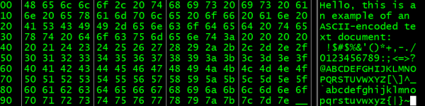
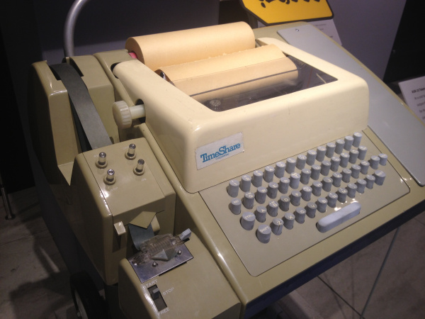
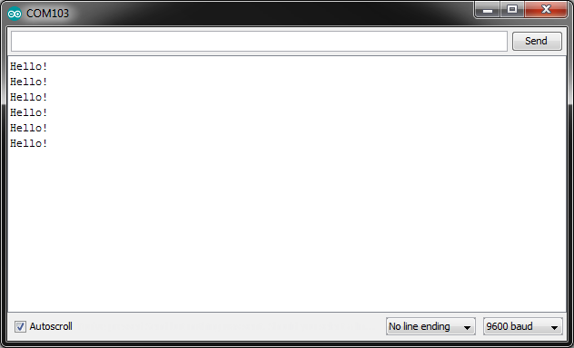

# ASCII

コンピュータが2進数で動作しているとしたら、文字や単語をどうやって保存しているのだろうか。
それを実現するために、私たちは文字に数を割り当てている。
これは[文字コード化](https://ja.wikipedia.org/wiki/文字コード)と呼ばれる。



文字コード化がどのように機能するかを理解するために、簡単な例を作ってみよう。
まず、アルファベットに1から26までの数字を割り当てる。

```
1  2  3  4  5  6  7  8  9  10 11 12 13 14 15 16 17 18 19 20 21 22 23 24 25 26
a  b  c  d  e  f  g  h  i  j  k  l  m  n  o  p  q  r  s  t  u  v  w  x  y  z
```

簡単な暗号メッセージを書くには、文字を数字に置き換える。
たとえば `8 5 12 12 15` である。
数字を使うことで、`h e l l o` という単語を作り出すことができる。

しかし、大文字と小文字のアルファベット、数字、句読点まで含めた英語のアルファベット全体を表すには、26文字だけでは足りない。
そこで生まれたのが、コンピュータ向けの初期の文字コード化規格のひとつである**American Standard Code for Information Interchange**（ASCII）である。

このチュートリアルで扱う内容:

- ASCIIの簡単な歴史
- 10進数、2進数、16進数をASCIIに変換する方法

参考になるチュートリアル:

このガイドを読み始める前に、知っておくとよい概念がいくつかある。

- [2進数](./binary.md)：コンピュータが数をどのように保存しているかを知っておくと、その数を文字に変換する際に役立つ
- [16進数](./hexadecimal.md)：16進数は、2進数を4ビットずつのまとまりで表すためによく使われる
- Installing Arduino IDE（Arduino IDEのインストール）：ASCII文字を表示してみるには、Arduinoを使うのがよい方法である

## 歴史

アメリカ規格協会（ASA、現在のアメリカ規格協会ANSI）は、1960年10月6日にASCIIの策定に着手した。
この符号化方式は、[エミール・ボードー](https://ja.wikipedia.org/wiki/エミール・ボードー)が考案した5ビットの電信符号に起源を持つ。
委員会は最終的に、ASCIIを7ビットの符号として採用することを決めた。

7ビットあれば128文字を表現できる。
この符号化方式にはアメリカ英語の文字と記号だけが選ばれたが、7ビットにしたことで、（たとえば8ビットにする場合と比べて）データ伝送にかかるコストを抑えることができた。

ASCIIの最初の32文字は、制御文字として予約されている。
これらの文字は、プリンターのような他の機器に特別な指示を伝えるために使われた。
たとえば、改行したり、文字を削除したり、機器によってはベルを鳴らしたりすることができた（[Teletype Model 33](https://ja.wikipedia.org/wiki/ASR-33) ASRなどがその例である）。

ASAは1963年に最初のバージョンのASCIIを発表し、1967年に改訂した。
この規格への最後の大きな更新は1986年に行われた。
ASCIIが最初に商用で使われたのは、AT&T（American Telephone & Telegraph）のTWX（テレタイプライター交換）ネットワークだった。



1968年3月11日、リンドン・B・ジョンソン大統領は、アメリカ連邦政府のすべてのコンピュータがASCIIをサポートすることを義務付け、これによりASCIIはアメリカのコンピュータ史における確固たる地位を築いた。

当時は[国際電信アルファベット No.2 (International Telegraph Alphabet No.2: ITA2)](https://ja.wikipedia.org/wiki/Baudot_Code#ITA_No.2)（ITA2）のような他の符号化方式も存在していたが、ASCIIはすぐにアメリカ英語の符号化における標準となった。
ASCIIは、2007年にUTF-8に追い抜かれるまで、インターネット上でもっとも一般的な符号化方式だった。

## ASCIIテーブル

ある文字のASCII値を調べるには、ASCIIテーブルを参照するのが一般的である。
ASCIIテーブルは、それぞれの文字を0から127までの割り当てられた値と対応付けている。

### 制御文字

制御文字は、ASCIIテーブルの最初の32文字を占めている。
これらの文字は表示されることを意図しておらず、代わりにプリンターのような他の機器にコマンドの指示を送るために使われる。
非常に古いシステム（12ビットの[PDP-8](https://ja.wikipedia.org/wiki/PDP-8)など）を扱う可能性もあるため、念のため[8進数](https://ja.wikipedia.org/wiki/8進法)での表記も併記しておく。

| 10進 | 2進 | 8進 | 16進 | 文字 | 説明 |
| --- | --- | --- | --- | --- | --- |
| 0 | 0000 0000 | 000 | 00 | NUL | ヌル文字 |
| 1 | 0000 0001 | 001 | 01 | SOH | ヘディング開始 |
| 2 | 0000 0010 | 002 | 02 | STX | テキスト開始 |
| 3 | 0000 0011 | 003 | 03 | ETX | テキスト終了 |
| 4 | 0000 0100 | 004 | 04 | EOT | 転送終了 |
| 5 | 0000 0101 | 005 | 05 | ENQ | 照会 |
| 6 | 0000 0110 | 006 | 06 | ACK | 肯定応答 |
| 7 | 0000 0111 | 007 | 07 | BEL | ベル |
| 8 | 0000 1000 | 010 | 08 | BS | バックスペース |
| 9 | 0000 1001 | 011 | 09 | TAB | 水平タブ |
| 10 | 0000 1010 | 012 | 0A | LF | 改行 |
| 11 | 0000 1011 | 013 | 0B | VT | 垂直タブ |
| 12 | 0000 1100 | 014 | 0C | FF | 改ページ |
| 13 | 0000 1101 | 015 | 0D | CR | 復帰 |
| 14 | 0000 1110 | 016 | 0E | SO | シフトアウト |
| 15 | 0000 1111 | 017 | 0F | SI | シフトイン |
| 16 | 0001 0000 | 020 | 10 | DLE | データリンクエスケープ |
| 17 | 0001 0001 | 021 | 11 | DC1 | 装置制御1 |
| 18 | 0001 0010 | 022 | 12 | DC2 | 装置制御2 |
| 19 | 0001 0011 | 023 | 13 | DC3 | 装置制御3 |
| 20 | 0001 0100 | 024 | 14 | DC4 | 装置制御4 |
| 21 | 0001 0101 | 025 | 15 | NAK | 否定応答 |
| 22 | 0001 0110 | 026 | 16 | SYN | 同期アイドル |
| 23 | 0001 0111 | 027 | 17 | ETB | 伝送ブロック終了 |
| 24 | 0001 1000 | 030 | 18 | CAN | 取り消し |
| 25 | 0001 1001 | 031 | 19 | EM | 媒体終了 |
| 26 | 0001 1010 | 032 | 1A | SUB | 置換 |
| 27 | 0001 1011 | 033 | 1B | ESC | エスケープ |
| 28 | 0001 1100 | 034 | 1C | FS | ファイル区切り |
| 29 | 0001 1101 | 035 | 1D | GS | グループ区切り |
| 30 | 0001 1110 | 036 | 1E | RS | レコード区切り |
| 31 | 0001 1111 | 037 | 1F | US | ユニット区切り |
| 127 | 0111 1111 | 177 | 7F | DEL | 削除 |

### 表示可能文字

ASCIIの符号化方式には95個の表示可能文字がある。
「space」の文字は、表示可能な空白（半角スペース）を表していることに注意してほしい。

| 10進 | 2進 | 8進 | 16進 | 文字 |
| --- | --- | --- | --- | --- |
| 32 | 0010 0000 | 040 | 20 | （半角スペース） |
| 33 | 0010 0001 | 041 | 21 | ! |
| 34 | 0010 0010 | 042 | 22 | " |
| 35 | 0010 0011 | 043 | 23 | # |
| 36 | 0010 0100 | 044 | 24 | $ |
| 37 | 0010 0101 | 045 | 25 | % |
| 38 | 0010 0110 | 046 | 26 | & |
| 39 | 0010 0111 | 047 | 27 | ' |
| 40 | 0010 1000 | 050 | 28 | ( |
| 41 | 0010 1001 | 051 | 29 | ) |
| 42 | 0010 1010 | 052 | 2A | * |
| 43 | 0010 1011 | 053 | 2B | + |
| 44 | 0010 1100 | 054 | 2C | , |
| 45 | 0010 1101 | 055 | 2D | - |
| 46 | 0010 1110 | 056 | 2E | . |
| 47 | 0010 1111 | 057 | 2F | / |
| 48〜57 | 0011 0000〜0011 1001 | 060〜071 | 30〜39 | 0〜9 |
| 58 | 0011 1010 | 072 | 3A | : |
| 59 | 0011 1011 | 073 | 3B | ; |
| 60 | 0011 1100 | 074 | 3C | < |
| 61 | 0011 1101 | 075 | 3D | = |
| 62 | 0011 1110 | 076 | 3E | > |
| 63 | 0011 1111 | 077 | 3F | ? |
| 64 | 0100 0000 | 100 | 40 | @ |
| 65〜90 | 0100 0001〜0101 1010 | 101〜132 | 41〜5A | A〜Z |
| 91 | 0101 1011 | 133 | 5B | [ |
| 92 | 0101 1100 | 134 | 5C | \ |
| 93 | 0101 1101 | 135 | 5D | ] |
| 94 | 0101 1110 | 136 | 5E | ^ |
| 95 | 0101 1111 | 137 | 5F | _ |
| 96 | 0110 0000 | 140 | 60 | ` |
| 97〜122 | 0110 0001〜0111 1010 | 141〜172 | 61〜7A | a〜z |
| 123 | 0111 1011 | 173 | 7B | { |
| 124 | 0111 1100 | 174 | 7C | \| |
| 125 | 0111 1101 | 175 | 7D | } |
| 126 | 0111 1110 | 176 | 7E | ~ |

## 実際に試してみる

ASCII符号化を使って何かを表示してみたいなら、Arduinoで試すことができる。
Arduinoを始めるには、Installing Arduino IDEのチュートリアルを参照してほしい。

Arduino IDEを開き、次のコードを貼り付けてみよう。

```cpp
void setup()
{
  Serial.begin(9600);
}

void loop()
{
  Serial.write(0x48); // H
  Serial.write(0x65); // e
  Serial.write(0x6C); // l
  Serial.write(0x6C); // l
  Serial.write(0x6F); // o
  Serial.write(0x21); // !
  Serial.write(0x0A); // \n

  delay(1000);
}
```

これをArduinoで実行し、シリアルコンソールを開いてみよう。
「Hello!」が何度も表示されるはずである。



ここで`Serial.print()`ではなく`Serial.write()`を使っていることに注目してほしい。
`write()`コマンドは、シリアル回線に生のバイトをそのまま送信する。
一方`print()`は、その数値を解釈しようとし、ASCII符号化された文字列を送信しようとする。
たとえば`Serial.print(0x48)`は、コンソールに`72`と表示してしまう。

また、「ラインフィード」の制御文字である`0x0A`というASCII文字を使っていることにも注目してほしい。
これは、プリンター（ここではコンソール）に次の行へ進むよう指示する文字である。
「Enter」キーを押すのとよく似た働きをする。

## まとめ

文字コード化の方式は数多く存在する。
World Wide Webでもっとも普及している符号化方式は[UTF-8](https://ja.wikipedia.org/wiki/UTF-8)である。
2016年6月の時点で、UTF-8はすべてのウェブページの87%で使われている。

UTF-8はASCIIとの後方互換性を持っており、最初の128文字はASCIIとまったく同じである。
UTF-8は、ラテン文字、ギリシャ文字、キリル文字、アラビア文字、中国語、韓国語、日本語の文字を含む、現代のほとんどの書き言葉の文字を、2バイト、3バイト、4バイトを使って符号化できる。

基本的なASCII符号化の知識は、シリアルターミナルを扱う際にも役立つ。
数あるシリアルターミナルプログラムの使い方については、[Serial Terminal Basics（シリアルターミナルの基礎）](./terminal-basics.md)のチュートリアルを参照してほしい。

タグ: 通信、コンピュータ工学、概念、プログラミング

---

出典：[ASCII](https://learn.sparkfun.com/tutorials/ascii)（SparkFun Learn）を日本語に翻訳し、再構成した。
原文は [CC BY-SA 4.0](https://creativecommons.org/licenses/by-sa/4.0/) ライセンスで公開されており、本ページも同ライセンスの下で提供する。
