# AST-CAN485の使い方

[AST-CAN485](https://www.sparkfun.com/products/14483)は、Arduino Pro Miniと同じ小型フォームファクタに収まる小型Arduinoである。
通常のArduinoの機能に加えて、オンボードのCANポートとRS485ポートを備えており、産業用機器の多くに手早く接続できる。
CAN485は、メイカーの世界と産業機器の世界の橋渡しをするボードである。

CAN485はArduinoプラットフォームをベースにしている。
Arduino Pro Miniとピン互換であり、プロジェクトに組み込みやすい小型フォームファクタを持つ。
Arduino IDE、Arduinoのコアライブラリに対応しており、ボードマネージャーからインストールできる。
CANポートとRS485ポートに対応するライブラリも提供されている。
オンボードのCANトランシーバーとRS485トランシーバーにより、追加の電子部品なしでCANネットワークやRS485ネットワークにそのまま接続できる。
CANとRS485は、自動化、産業システム、ビル管理、自動車システム、OBD-IIなど、多くの通信プロトコルの基盤になっている。

## 参考になるチュートリアル

以下の概念に馴染みがない場合は、先に次のチュートリアルを読んでおくとよい。

- [はんだ付けの基本（スルーホール編）](./how-to-solder-through-hole-soldering.md)
- [シリアル通信](./serial-communication.md)
- [Arduinoとは何か](./what-is-an-arduino.md)
- [Arduino IDEのインストール](https://learn.sparkfun.com/tutorials/installing-arduino-ide)
- [ロジックレベル](./logic-levels.md)
- [抵抗器](./resistors.md)

## ハードウェア概要

CAN485はPro Miniと同じ約34.65mm × 19.20mmという小さなフォームファクタを採用しており、スペースが限られた用途にも組み込みやすい。
ピン配置もArduino Pro Miniと同じであるため、既存のPro Mini用シールドやアプリケーションとピン互換である。
四辺目のRESETボタン下にあるもう一列のピンには、CANポートとRS485ポートが割り当てられている。

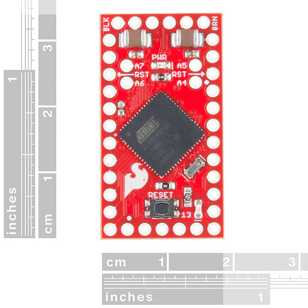

*AST-CAN485の寸法*

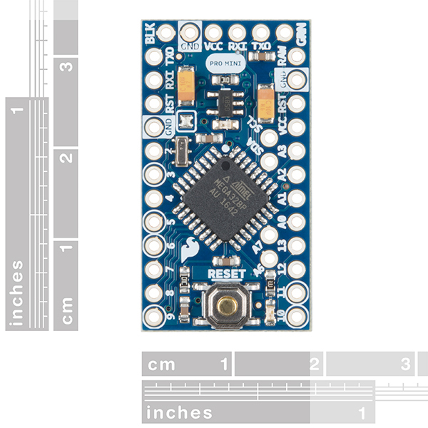

*Arduino Pro Miniの寸法*

### ピン配置

ピン割り当てはArduino Pro Miniとおおむね似ているが、機能にはいくつか違いがある。
Pro Mini用に設計されたシールドをCAN485で使う場合は注意が必要である。
各ピンの詳しい機能はグラフィカルデータシートを参照してほしい。

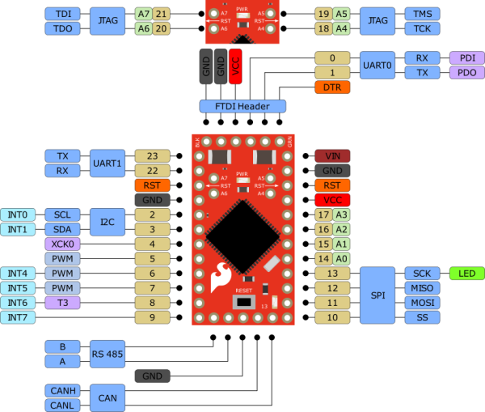

*画像が見づらい場合は、クリックすると拡大表示できる。*

CAN485はAtmelのAT90CAN128プロセッサをベースにしている。
このプロセッサは16MHzで動作し、128KBのフラッシュメモリと4KBのSRAMを持ち、ハードウェアのCANコントローラーを内蔵する。
CAN485は、I2C、SPI、UART、8本のアナログ入力、割り込み対応の6本のピンなど、よく使われる通信ポートとピン機能を引き出している。

詳しくは[AT90CAN128のデータシート](https://github.com/Atlantis-Specialist-Technologies-Admin/CAN485/blob/master/Documentation/Datasheet%20AT90CANXX.pdf)と[AST-CAN485の回路図](https://github.com/Atlantis-Specialist-Technologies-Admin/CAN485/blob/master/Documentation/CAN485%201.0.0.pdf)を参照してほしい。

> **上級者向けの注意：** CAN485のAT90CAN128にはArduinoのブートローダーが書き込まれている。
> AVRプログラマとAtmel Studioを使ってチップに直接書き込みたい場合、ICSPピンは想定とは異なる位置にある。
> D12（MISO）やD11（MOSI）といった通常のSPIピンではなく、実際にはFTDIヘッダーのピンD1（TX0）とD0（RXI）がこれにあたる。

| ターゲットの外部電源 | CAN485 | AVRプログラマ |
| --- | --- | --- |
| | FTDIヘッダーのD1（TX0） | MISO |
| | D13（SCK） | SCK |
| | RST | RST |
| 5V | 5V | 5V |
| | FTDIヘッダーのD0（RXI） | MOSI |
| GND | GND | GND |

詳しくは、AT90CAN128データシートの349ページ、**25.7節「SPI Serial Programming」**を参照してほしい。

### 電源

CAN485にはいくつかの給電方法がある。

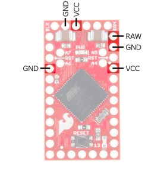

CAN485にはオンボードのレギュレータがあり、**RAW**ピンに未調整の電圧を供給できる。
入力電圧の許容範囲は7〜16Vだが、**推奨は7〜12V**である。

> **注意：** CANポートと5本を超えるデジタル出力を同時に使う場合、入力電圧は12V未満に保つ必要がある。

調整済みの5V電源を**Vcc**に直接供給することもできる。
供給電圧は4.5V〜5.5Vの範囲でなければならない。
FTDIブレイクアウトからFTDIヘッダー経由で給電することも可能である。

> **警告：** 誤った電源を接続すると、CAN485や接続している他の機器を破損する恐れがある。

ボードに電源が入ると、PWR LEDが点灯する。

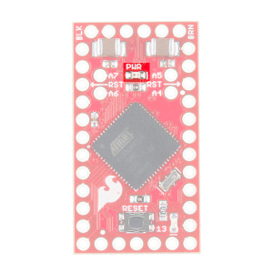

### FTDIプログラミングヘッダー

Pro Miniと同様に、CAN485にもオンボードのUSB接続はない。
ボードへの書き込みやPCとの接続には、外付けのFTDIブレイクアウトボードが必要である。

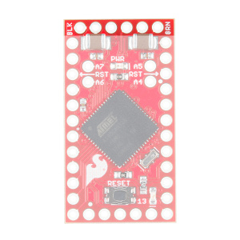

接続には5V仕様のFTDI、ヘッダーピン、mini-B USBケーブルが必要になる。

はんだ付けに不慣れな場合は、はんだ付けの基本（スルーホール編）のチュートリアルを確認してほしい。
はんだごて、はんだ、一般的なはんだ付け用アクセサリーも用意しておくとよい。

標準的なプロトタイピング用の構成としては、ブレッドボードに挿しやすいようピンを下向きに、FTDIを外側に向け、通信用ピンをジャンパーケーブルでアクセスしやすいよう上向きにする配置がよく使われる。

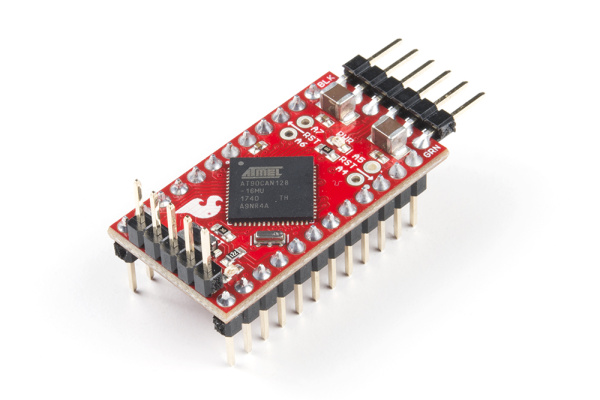

### CANポート

CANコントローラーはハードウェアアクセラレーションに対応しており、プロセッサへの負荷を最小限に抑えながら高速なCAN通信を行える。
オンボードのCANトランシーバーにより、追加の電子部品なしでCAN485を直接CANネットワークに接続できる。

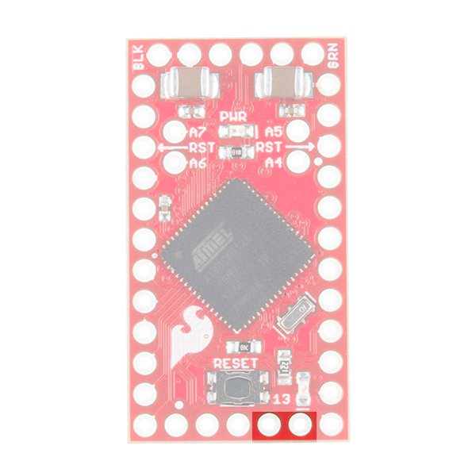

*AST-CAN485の表側：CANポート*

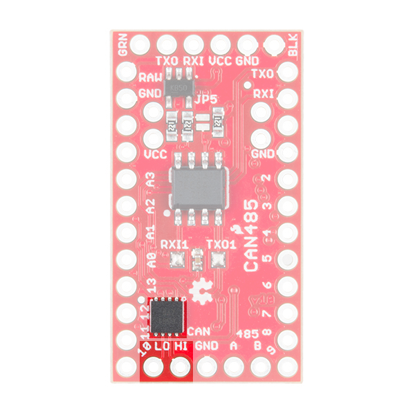

*AST-CAN485の表側：CAN用ICとポート*

#### CANネットワークへの接続

次の画像は、CAN485とCANネットワークの典型的な接続を示している。
このネットワークは2本の信号線（CANHとCANL）で構成されており、複数のデバイスをこれらの線に並列接続できる。
バスの両端は、終端抵抗（一般に100Ω〜120Ω）で終端しなければならない。

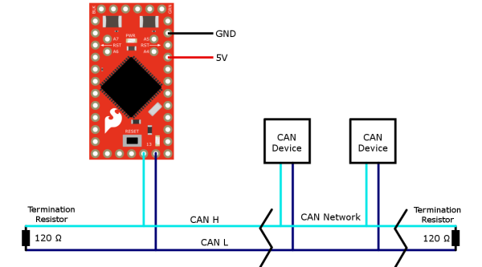

詳しくは、後述のCAN入門の節を参照してほしい。

### RS485ポート

CANポートと同様に、CAN485にはオンボードのRS485トランシーバーが搭載されており、あらゆるRS485ネットワークに簡単に接続できる。
RS485ポートはUART1を専有するが、シリアルポートとして使いたい場合に備えてピン22と23にも引き出されている。

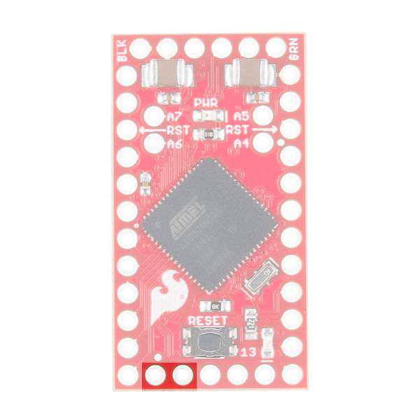

*AST-CAN485の表側：RS485ポート*

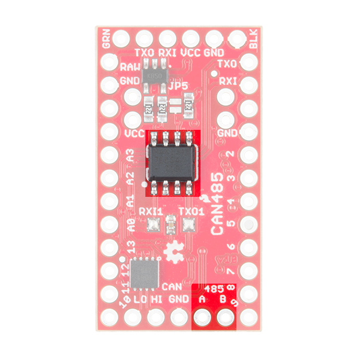

*AST-CAN485の裏側：RS485用ICとポート*

#### RS485ネットワークへの接続

次の画像は、CAN485とRS485ネットワークの典型的な接続を示している。
このネットワークは2本の信号線（AとB）で構成されており、デバイスはこれらの線に並列接続される。
バスの両端は、終端抵抗（一般に100Ω〜120Ω）で終端しなければならない。

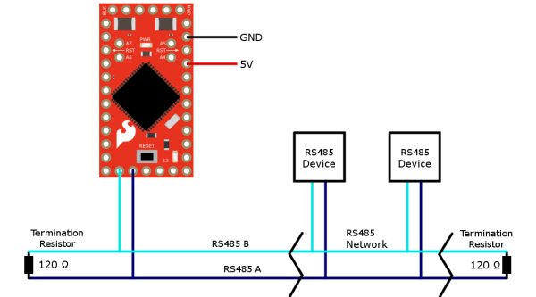

詳しくは、後述のRS485入門の節を参照してほしい。

### JTAG

JTAGによるプログラミング・デバッグ用インターフェースはピン18〜21に引き出されている。
これにより、Atmel Studioを使ったより高度なデバッグが可能になる。

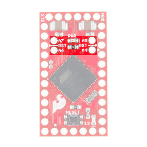

重要な点として、これらのピンを通常の入出力として使うには、JTAGインターフェースを**必ず**無効化しなければならない。
これは`setup()`関数に少しコードを追加するだけで行える。

対応するサンプルコードはASTのGitHubリポジトリ（`JTAG_Software_Disable.ino`）で公開されている。

### AltSoftSerialを使ったソフトウェアシリアル

残念ながら、AT90CAN128チップのピンはピン変化割り込みに対応していない。
そのため、Arduinoの`SoftwareSerial`ライブラリは**利用できない**。
代わりにAltSoftSerialライブラリを使うことができる。

AltSoftSerialライブラリにはいくつか制約がある。
マイクロプロセッサのタイマーリソースを一つ使用するため、利用できるAltSoftSerialポートは**1つ**だけであり、ピン5と9に固定されている。
ASTは標準のAltSoftSerialライブラリをCAN485向けに改変しており、AST GitHubで公開している。

## ハードウェアの接続

CAN485にはヘッダーがはんだ付けされた状態では出荷されない。
プロジェクトに合わせてヘッダーやワイヤーをボードにはんだ付けするのはユーザーの役目である。
選択肢としては、スタッカブルヘッダー、ベントヘッダー、ピンパッドへのワイヤーの直付けなどがある。

## ソフトウェアのインストール

> **注意：** Arduino IDEが1.6.3より古いバージョンの場合はアップグレードが必要である。
> この説明はデスクトップ版Arduino IDEの最新版を使っている前提で進める。
> Arduinoを初めて使う場合は、Arduino IDEのインストールのチュートリアルを先に確認してほしい。

次のステップは、CAN485ボードをArduino IDEにインストールすることである。
インストール方法は2通りある。
一つはArduinoのボードマネージャーを使う方法で、こちらが推奨の方法である。
もう一つは、GitHubリポジトリからファイルを手動でコピーする方法である。

### ボードマネージャーを使ったボードのインストール

Arduino IDEのボードマネージャーを使う方法が推奨されている。

Arduino IDEで環境設定ウィンドウ（**ファイル > 環境設定**）を開く。
次のURLをコピーし、ボードマネージャーのURLリストに追加する。

```
https://raw.githubusercontent.com/Atlantis-Specialist-Technologies/Arduino-Boards-Packages/master/package_ast_boards_index.json
```

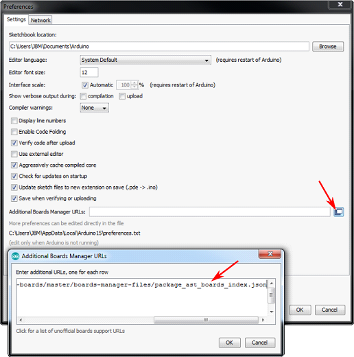

ボードマネージャー（**ツール > ボード > ボードマネージャー...**）を開く。

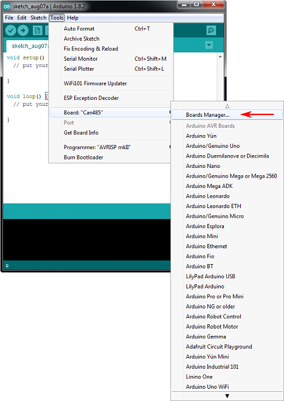

**AST AVR Boards**までスクロールし、**インストール**ボタンをクリックする。

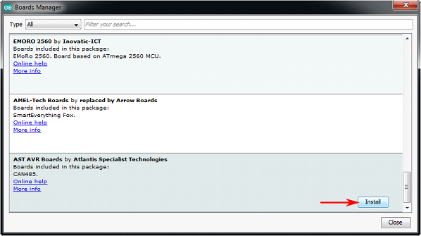

これで、AST AVR Boardsがボードメニューから選択できるようになる。
開発ボードに書き込む際は**Can485**を選択する。

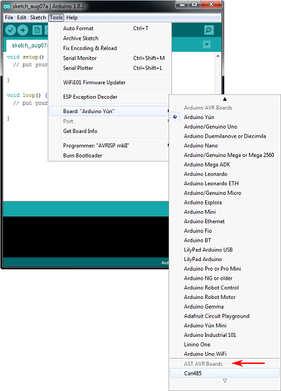

### ボードの手動インストール

**AST AVR Boardアドオン**を手動でインストールする手順は次のとおりである。

- GitHubから[CAN485リポジトリ](https://github.com/Atlantis-Specialist-Technologies/CAN485/archive/master.zip)をダウンロードする。
- フォルダを解凍する。
- `ast`フォルダを`…\MyDocuments\Arduino\hardware`にコピーする。
- ディレクトリ構造は`…\MyDocuments\Arduino\hardware\ast`となる。

### ライブラリの手動インストール

Arduinoライブラリを一度もインストールしたことがない場合は、先にライブラリのインストールガイドを確認してほしい。

**CANライブラリ**を手動でインストールする手順は次のとおりである。

- GitHubから[AST_CAN_Arduino_Libraryリポジトリ](https://github.com/Atlantis-Specialist-Technologies/AST_CAN_Arduino_Library/archive/master.zip)をダウンロードする。
- `AST_CAN_Arduino_Library-master.zip`フォルダを解凍する。
- `...\AST_CAN_Arduino_Library-master`フォルダを開く。
- `AST_CAN_Arduino_Library-master`フォルダをArduinoのlibrariesフォルダ（`...\MyDocuments\Arduino\libraries`）に移動する（librariesフォルダが存在しない場合は作成する）。
- 最終的なディレクトリ構造は`...\MyDocuments\Arduino\libraries\AST_CAN_Arduino_Library-master`となる。

**RS485ライブラリ**を手動でインストールする手順は次のとおりである。

- GitHubから[AST_RS485_Arduino_Libraryリポジトリ](https://github.com/Atlantis-Specialist-Technologies/AST_RS485_Arduino_Library/archive/master.zip)をダウンロードする。
- `AST_RS485_Arduino_Library-master.zip`フォルダを解凍する。
- `...\AST_RS485_Arduino_Library-master`フォルダを開く。
- `AST_RS485_Arduino_Library`フォルダをArduinoのlibrariesフォルダ（`...\MyDocuments\Arduino\libraries`）に移動する（librariesフォルダが存在しない場合は作成する）。
- 最終的なディレクトリ構造は`...\MyDocuments\Arduino\libraries\AST_RS485_Arduino_Library-master`となる。

**AST AltSoftSerialライブラリ**を手動でインストールする手順は次のとおりである。

- GitHubから[AltSoftSerialリポジトリ](https://github.com/Atlantis-Specialist-Technologies/AltSoftSerial/archive/master.zip)をダウンロードする。
- `AltSoftSerial-master.zip`フォルダを解凍する。
- `...\AltSoftSerial-master`フォルダを開く。
- Arduinoのlibrariesフォルダ（`...\MyDocuments\Arduino\libraries`）に解凍する（librariesフォルダが存在しない場合は作成する）。
- 最終的なディレクトリ構造は`...\MyDocuments\Arduino\libraries\AltSoftSerial-master`となる。

> **トラブルシューティング：** ライブラリをArduinoのDocumentsフォルダに手動でインストールする場合、ライブラリがサブフォルダの中に入れ子になっていないか確認してほしい。
> 入れ子になっているとArduino IDEがライブラリを認識できず、コンパイルエラーの原因になる。
> たとえばCANライブラリを手動インストールした際、`...\Documents\Arduino\libraries\AST_CAN_Arduino_Library-master\AST_CAN_Arduino_Library-master`のように`src`フォルダが二段目の`AST_CAN_Arduino_Library-master`の中に入っていると、Arduino IDEはソースファイルを認識できない。
> 対処法は、サブフォルダの中身をすべて一段上のディレクトリに移動し、Arduino IDEを再起動することである。

> **トラブルシューティング：** AST独自の「AltSoftSerial」ライブラリと、Paul Stoffregen氏の「AltSoftSerial」ライブラリの両方がインストールされていると、ライブラリが競合することがある。
> Arduino IDEはどちらを使うべきか判断できず、最初に見つけたAltSoftSerialライブラリを使ってしまう。
> 発生しうるコンパイルエラーの例は次のとおりである。
>
> ```
> Multiple libraries were found for "AltSoftSerial.h"
>    Used: ...\Documents\Arduino\libraries\AltSoftSerial
>    Not used: ...\Documents\Arduino\libraries\AST_AltSoftSerial_Arduino_Library
> exit status 1
> Error compiling for board Can485.
> ```
>
> 簡単な対処法は、Paul Stoffregen氏の「AltSoftSerial」をArduinoのlibrariesフォルダから一時的に取り除き、AST-CAN485向けのコードをコンパイルする際はASTの「AltSoftSerial」だけを使うようにすることである。
> こうすれば、同名の複数ライブラリによる競合を避けられる。

### コードの書き込み

図のとおりにFTDIプログラミングケーブルをFTDIヘッダーに接続する。

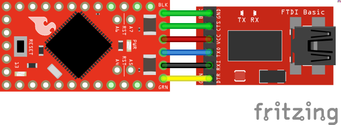

Arduino IDEを開き、ツールメニューでCAN485ボードを選択する。
正しいCOMポートが選択されていることを確認する。
Blinkのサンプル（**File > Examples > 01.Basics > Blink**）を書き込む。
ピン13に接続された内蔵LEDが点滅すれば成功である。

## CAN入門

> **注意：** この節では、CANバスの重要な特徴の一部を簡単に紹介する。
> より詳しい情報は、後述の参考リンクを参照してほしい。

CAN（Controller Area Network）バスは、自動車業界を起源とする通信規格である。
堅牢性とノイズ耐性を高めるいくつかの機能を備えている。
複数のノードに対応できるメッセージベースのプロトコルである。
40m未満の距離であれば最大1Mbpsの速度に対応し、より長い距離でも低速であれば通信できる（125Kbpsで500m）。
CANバスにはアービトレーション（調停）という仕組みもあり、メッセージの優先順位付けとパケット衝突の解決を自動的に行う。

CANは産業用途のフィールドバスとして使われており、その上に多くの上位レイヤープロトコルが構築される下位レイヤーを構成する。
CANopenとDeviceNetは、CANバスをベースにした代表的な上位レイヤープロトコルで、産業オートメーションで使われている。
CANバスは、米国とEUの現行車両で義務付けられているOBD-II車両診断規格にも使われている。

### 信号の説明

CANバスは2本の信号線（CAN HとCAN L）で構成され、両端は終端抵抗（一般に100Ω〜120Ω）で終端する。
高速通信の場合は120Ωの終端抵抗が推奨される。
これらの線は通常、ツイストペアとして束ねられる。

バスにはリセッシブ状態（論理1）とドミナント状態（論理0）がある。
バスをドミナント状態にするには、いずれかのノードが能動的に駆動する必要がある。
どのノードもドミナント状態に駆動していなければ、バスはリセッシブ状態に戻る。
このドミナントとリセッシブの性質により、二つのノードが同時に送信した場合、ドミナントなビットが優先される。
アービトレーションの仕組みは、この性質を利用してパケットの衝突を解決する。

ラインの状態とマイクロプロセッサが扱う論理状態を変換するには、CANトランシーバーが必要になる。

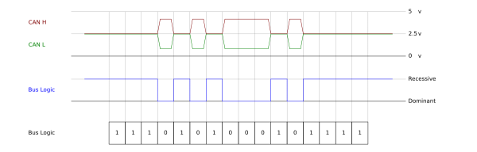

*画像が見づらい場合は、クリックすると拡大表示できる。*

### ネットワーク構造

複数のノードを並列に接続できる。
両端のラインは終端抵抗（一般に100Ω〜120Ω）で終端しなければならない。
高速CANバスの場合、下図のネットワークでは両端に120Ωの終端抵抗を入れている。

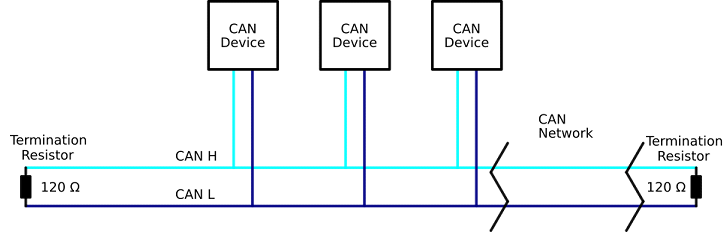

### パケット構造

CANのメッセージは、メッセージID、データ長フィールド、データフレーム、CRC、その他の制御ビットからなる標準フォーマットを持つ。
メッセージベースのプロトコルであるため、ノードのアドレスは存在せず、代わりにメッセージIDが使われる。
データはデバイスではなくIDに紐づけられ、一つのノードが複数のメッセージIDを使って送信することもできる。
この性質は非常に便利である。
たとえば一つのノードが、モーターの速度、位置、加速度をそれぞれ異なるメッセージIDで報告すれば、受信側のノードはパラメータを簡単に識別できる。

メッセージIDは一意でなければならない。
二つのノードが同じIDのメッセージを同時に送信しようとするとエラーが発生する。
メッセージIDは、二つのノードが同時に送信しようとした際にどちらのメッセージを優先するかを決めるアービトレーションの過程でも使われる。

CANパケットには標準フォーマットが二つある。
基本フォーマット（CAN2.0A）と拡張フォーマット（CAN2.0B）である。
拡張フォーマットは29ビットのIDを持ち、基本フォーマットは11ビットのIDを持つ。
拡張フォーマットは後方互換性があり、同じCANネットワーク上で両方のフォーマットを使うことができる。

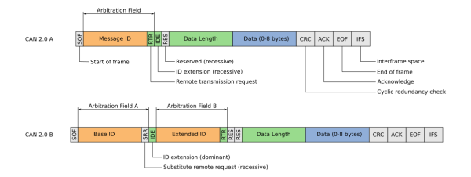

*画像が見づらい場合は、クリックすると拡大表示できる。*

### アービトレーション

二つのノードが同時に送信しようとすると、アービトレーションの過程でどちらを優先するかが決まる。
送信中、各ノードはバスの状態も同時に読み取っている。
あるノードが、自分が送ったリセッシブなビットを別のノードによってドミナントに駆動されたことを検出すると、そのノードは送信を停止する。
この仕組みにより、IDの値が小さいメッセージほど優先される。
アービトレーションに敗れたノードは、現在の送信が完了した時点で再送を試みる。
この動作により、優先順位付けと衝突解決が自動的に行われる。

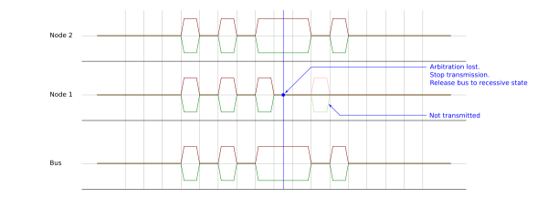

*画像が見づらい場合は、クリックすると拡大表示できる。*

## 例：シンプルなCANネットワーク

この例では、2ノードからなるシンプルなCANバスネットワークを構築する。
一方のノードがメッセージを送信し、もう一方がそれを受信してシリアルポート経由でPCに転送する。

### 必要な部品

この例に必要な部品は次のとおりである。
手元にあるものによっては、すべてが必要とは限らない。
カートに入れてガイドを読み進め、必要に応じて調整してほしい。

- CAN485 × 2
- 120Ω抵抗 × 2 ※
- FTDI
- USBケーブル
- ブレッドボード、ジャンパーワイヤーなど

※120Ω抵抗が手元にない場合は、100Ωの抵抗1本と10Ωの抵抗2本を直列にすることで120Ωを作ることができる。

### ハードウェアの接続

図のとおりにネットワークを構築する。

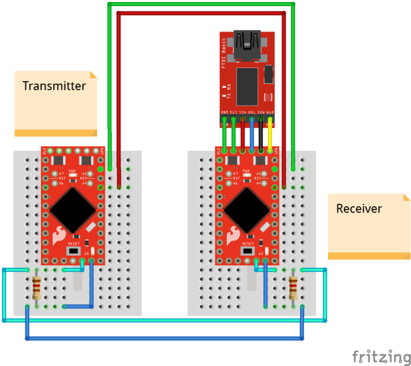

### コードの書き込み

CAN485ボードとCANライブラリがインストールされていることを確認する。
サンプルコードはCANライブラリと一緒にインストールされ、Arduino IDEのExamplesメニューから利用できる。

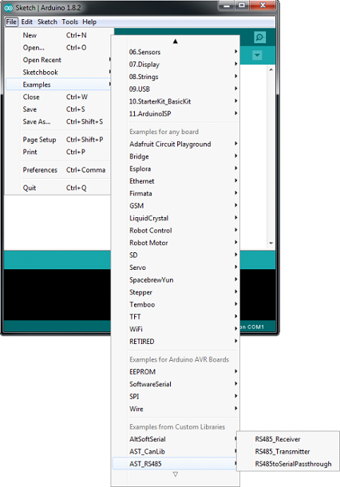

送信側のノードに送信用のサンプルコードを書き込む。
続いて、受信側のノードに受信用のサンプルコードを書き込む。

### 動作の確認

送信ノードは500msごとにメッセージを送信する。
受信ノードはそれを受信し、シリアルポート経由でPCに転送する。
PC側では、Arduinoシリアルモニタ（または好みのシリアルターミナル）でシリアルポートを開き、**1000000（1MBaud）**を選択する。

## 例：マルチノードCANネットワーク

この例では、より大規模なCANネットワークを構築する。
複数のノードがメッセージを送信し、一つのノードがそれらをシリアルポート経由でPCに中継する。

### 必要な部品

この例に必要な部品は次のとおりである。
手元にあるものによっては、すべてが必要とは限らない。
カートに入れてガイドを読み進め、必要に応じて調整してほしい。

- CAN485 × 3以上
- 120Ω抵抗 × 2 ※
- FTDI
- USBケーブル
- ブレッドボード、ジャンパーワイヤーなど
- 外部電源 × 1 ※※
- DCバレルジャックアダプタ（メス）× 1 ※※

※120Ω抵抗が手元にない場合は、100Ωの抵抗1本と10Ωの抵抗2本を直列にすることで120Ωを作ることができる。

※※FTDI変換器からの給電に頼るより、外部電源を使うことが望ましい。

### ハードウェアの接続

図のとおりにネットワークを構築する。

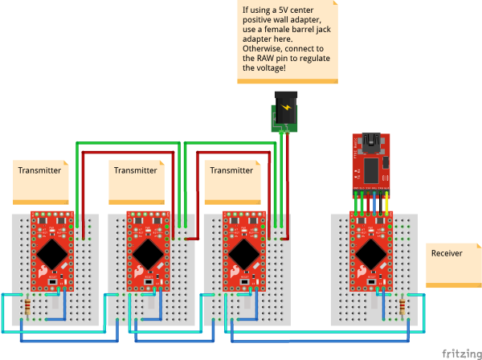

### コードの書き込み

CAN485ボードとCANライブラリがインストールされていることを確認する。
サンプルコードはCANライブラリと一緒にインストールされ、Arduino IDEのExamplesメニューから利用できる。

送信側の各ノードに送信用のサンプルコードを書き込む。
その際、各ノードのメッセージID（`MESSAGE_ID`）をそれぞれ一意な値に変更しておく。

続いて、受信側のノードに受信用のサンプルコードを書き込む。

### 動作の確認

送信ノードはそれぞれ500msごとにメッセージを送信する。
受信ノードはそれを受信し、シリアルポート経由でPCに転送する。
PC側では、Arduinoシリアルモニタ（または好みのシリアルターミナル）でシリアルポートを開き、**1000000（1MBaud）**を選択する。

## RS485入門

RS485は、シリアル通信システムで広く使われている規格である。
RS485が規定するのは電気的なインターフェースのみであり、規格そのものが特定の通信プロトコルを定めているわけではない。
その代わりに、多くの異なるプロトコルの物理層として使われる。
たとえば、シリアルポートをRS485の物理層の上で動かすことができる。

RS485はツイストペア上で差動信号を使うため、ノイズに強い。
複数ノードにも対応しており、接続できるノード数は通常、使用するプロトコルによって決まる。
最大1200mの距離、最大10Mbpsの通信速度に対応できるが、距離と速度にはトレードオフがある。
たとえば、50mのケーブルであれば2Mbpsで通信できる。

RS485はよく使われる物理層の一つであり、産業システム、コンピューティング、自動車、ビル管理などの用途で使われている。
ModbusとProfibusは、RS485を利用する代表的な産業用プロトコルである。

### 信号の説明

インターフェースは、信号AとBの2本の線で構成される。
バスがアイドル状態のとき、両方の線はフロート状態になる。
動作中は、一つのノードがコントローラーとしてバスを制御し、2本の線を適切な電圧に駆動する。
他のノードはペリフェラルとして動作し、送信されるデータを受信する。
2本の線は互いに逆極性に駆動される。Aがプラスであれば、Bはマイナスになる。
この信号を反転させることで、論理レベルの0と1を表現できる。

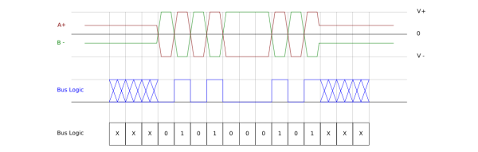

*画像が見づらい場合は、クリックすると拡大表示できる。*

### ネットワーク構造

複数のノードを並列に接続できる。
両端のラインは終端抵抗（一般に100Ω〜120Ω）で終端しなければならない。

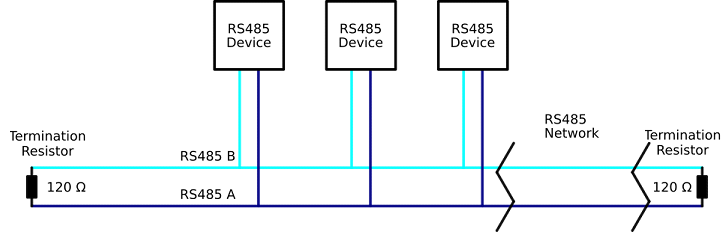

## 例：シンプルなRS485ネットワーク

この例では、2ノードからなるシンプルなRS485バスネットワークを構築する。
一方のノードが500msごとにメッセージを送信し、もう一方がそれを受信してシリアルポート経由でPCに転送する。

### 必要な部品

この例に必要な部品は次のとおりである。
手元にあるものによっては、すべてが必要とは限らない。
カートに入れてガイドを読み進め、必要に応じて調整してほしい。

- CAN485 × 2
- FTDI
- USBケーブル
- 120Ω抵抗 × 2 ※
- ブレッドボード、ジャンパーワイヤーなど

※120Ω抵抗が手元にない場合は、100Ωの抵抗1本と10Ωの抵抗2本を直列にすることで120Ωを作ることができる。

### ハードウェアの接続

図のとおりにネットワークを構築する。


### コードの書き込み

CAN485ボードとRS485ライブラリがインストールされていることを確認する。
サンプルコードはRS485ライブラリと一緒にインストールされ、Arduino IDEのExamplesメニューから利用できる。


受信側のノードに受信用のサンプルコードを書き込む。
続いて、送信側のノードに送信用のサンプルコードを書き込む。

### 動作の確認

送信ノードは500msごとにメッセージを送信する。
受信ノードはそれを受信し、シリアルポート経由でPCに転送する。
PC側では、Arduinoシリアルモニタ（または好みのシリアルターミナル）で115200baudでシリアルポートを開く。

## 拡張用ボード

CAN485を使って24Vの入出力を制御したい場合は、有線接続用の[I/Oシールド（24V）](https://learn.sparkfun.com/tutorials/ast-can485-io-shield-24v-hookup-guide)を確認してほしい。
このシールドは、AST-CAN485開発ボードを24Vの入出力に接続できるようにするArduinoシールドで、産業システムへの応用範囲を広げる。

RS485やCANのデバイスを遠隔から制御したい場合は、[WiFiシールド](https://learn.sparkfun.com/tutorials/ast-can485-wifi-shield-hookup-guide)を確認してほしい。

## まとめ・参考資料

AST-CAN485開発ボードを無事に動かせたら、次は自分のプロジェクトに組み込む番である。

より詳しい情報は、以下の資料を参照してほしい。

- [回路図](https://cdn.sparkfun.com/assets/2/8/3/4/7/SparkFun_AST-CAN485.pdf)
- [Eagleファイル](https://cdn.sparkfun.com/assets/c/4/c/e/5/SparkFun_AST-CAN485_1.zip)
- [AST GitHubリポジトリ](https://github.com/Atlantis-Specialist-Technologies)
  - [CAN485製品リポジトリ](https://github.com/Atlantis-Specialist-Technologies/CAN485)
  - [AST CANライブラリ](https://github.com/Atlantis-Specialist-Technologies/AST_CAN_Arduino_Library)
  - [AST RS485ライブラリ](https://github.com/Atlantis-Specialist-Technologies/AST_RS485_Arduino_Library)
  - [AST AltSoftSerial](https://github.com/Atlantis-Specialist-Technologies/AltSoftSerial)
  - [Arduino Boards Packages](https://github.com/Atlantis-Specialist-Technologies/Arduino-Boards-Packages)
- データシート
  - [AT90CAN128](https://github.com/Atlantis-Specialist-Technologies/CAN485/blob/master/Documentation/Datasheet%20AT90CANXX.pdf)
  - [CANトランシーバー](https://github.com/Atlantis-Specialist-Technologies/CAN485/blob/master/Documentation/Datasheet%20CAN%20Transciever.pdf)
  - [RS485トランシーバー](https://github.com/Atlantis-Specialist-Technologies/CAN485/blob/master/Documentation/Datasheet%20RS485%20Transceiver.pdf)
- CANバス
  - [Wikipedia：CANバス](https://ja.wikipedia.org/wiki/Controller_Area_Network)
  - [CAN 2.0仕様](http://esd.cs.ucr.edu/webres/can20.pdf)（現在はISO標準に置き換わっている）
  - [ISO標準](https://www.iso.org/standard/63648.html)
  - [Wikipedia：CANopen](https://ja.wikipedia.org/wiki/CANopen)
  - [Wikipedia：DeviceNet](https://ja.wikipedia.org/wiki/DeviceNet)
  - [Electronics Stack Exchange：CANバスの終端抵抗になぜ120Ωが使われるのか](https://electronics.stackexchange.com/questions/55389/why-does-the-can-bus-use-a-120-ohm-resistor-as-the-terminating-resistor-and-not)
- RS485
  - [Wikipedia：RS-485](https://ja.wikipedia.org/wiki/EIA-485)
  - [Wikipedia：Modbus](https://ja.wikipedia.org/wiki/Modbus)
  - [Modbusライブラリ](https://github.com/4-20ma/ModbusMaster)
  - [Wikipedia：Profibus](https://ja.wikipedia.org/wiki/Profibus)
  - [Electronics Stack Exchange：RS485ネットワークで終端抵抗が必要になるケーブル長](https://electronics.stackexchange.com/questions/32135/at-what-cable-lengths-are-termination-resistors-required-for-rs-485-networks)

次のプロジェクトのヒントとして、関連するチュートリアルも参照してほしい。

- [OBD II UARTの使い方](https://learn.sparkfun.com/tutorials/obd-ii-uart-hookup-guide) — OBD-II UARTボードの使い始め方
- [CAN-BUSシールドの使い方](https://learn.sparkfun.com/tutorials/can-bus-shield-hookup-guide) — CAN-Busシールドを使うための基礎知識
- [OBD-II入門](./getting-started-with-obd-ii.md) — 自動車や産業用途で使われるOBD-IIプロトコルの概説

タグ: 概念、通信、Arduino、Hookup

---

出典：[AST-CAN485 Hookup Guide](https://learn.sparkfun.com/tutorials/ast-can485-hookup-guide)（SparkFun Learn）を日本語に翻訳し、再構成した。
原文は [CC BY-SA 4.0](https://creativecommons.org/licenses/by-sa/4.0/) ライセンスで公開されており、本ページも同ライセンスの下で提供する。
