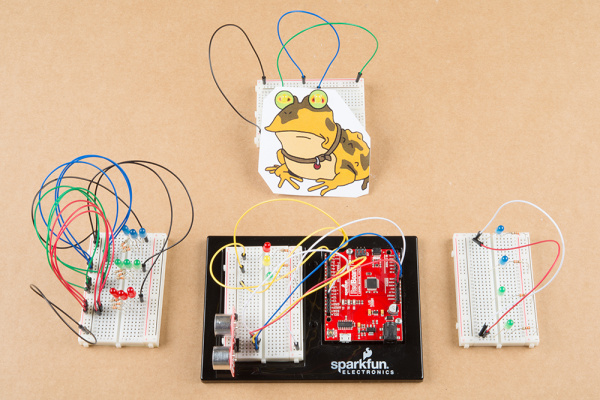
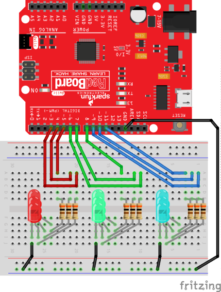
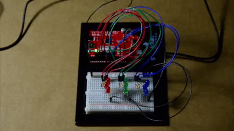
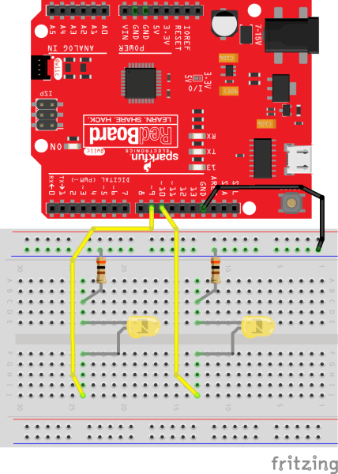
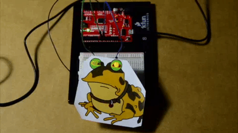
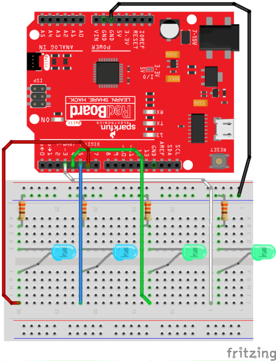
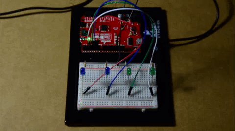
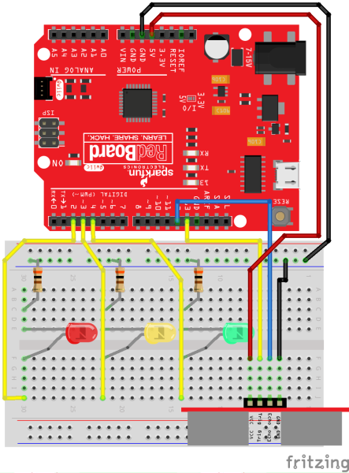
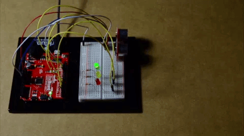

# 初心者向けLEDアニメーションの基礎（Arduino編）

## はじめに

光を制御したいという欲求は、文字による記録が残るよりもずっと昔から、人類につきまとってきた。
明かりの持つ力は、誰の中にも生物的な感覚を呼び起こす。
木に蓄えられたエネルギーを化学的に燃焼させる方法から、より揮発性の高いガソリン蒸気へと、私たちは進化してきた。
物理的な炎は、やがて温かく輝く繊細な金属コイルに取って代わられた。
筆者のお気に入りの発光方法は、それよりもずっと単純で、電子がエネルギーを放出する*エレクトロルミネセンス*という現象そのものである。
[発光ダイオード](https://www.sparkfun.com/leds)、いわゆる[LED](https://www.sparkfun.com/leds)は、過去の発光方法よりもはるかにエネルギー効率がよく、暗闇と戦うための、ほぼ無限とも言える可能性を与えてくれる。



このチュートリアルでは、LEDの扱いについてのいくつかの概念を振り返りながら、RedBoard Qwiicで個々のLEDを制御し、楽しいエフェクトを作ってみる。

### 必要な部品

このチュートリアルの内容を試すには、次の部品が必要である。手元にあるものによっては、すべてが必要になるとは限らない。

> [!NOTE]
> 注意：以下の画像では赤色版の超音波距離センサーを使用しているが、より正確な新しいモデルに置き換わっている。必ず赤色ではなく青色のバージョンを入手すること。

この部品一覧は、RedBoard Qwiicを搭載した新しいSparkFun Inventor's Kitから抜粋したものである。電子部品をもっとたくさん揃えたい場合は、フルセットを購入してもかまわない。

## 基礎の振り返り

[LED](./light-emitting-diodes-leds.md)についての重要なポイントを、いくつか思い出しておこう。

1. **他のダイオードと同じく、[電流は一方向にしか流れない](./polarity.md)。**
   - 十分に高い電圧をかければ、電流は逆方向にも一瞬だけ流れる。もちろん、あのマジックスモークとともにである。
2. 同じく他のダイオードと同様、動作するには「最低限」の電圧が必要である。
3. 最後に、光が「より青い」ほど、より多くのエネルギーを使っている。

以下の概念に馴染みがなければ、続きを読む前にこれらのチュートリアルを確認しておくことをおすすめする。ここに挙げたポイントの多くは、LEDを使った基本的な回路のルールを説明する、以前のチュートリアルで扱った内容である。振り返りたい場合は、ぜひそちらも確認してみてほしい。

- [発光ダイオード（LED）](./light-emitting-diodes-leds.md)

Arduinoやブレッドボード、その他の電子工作の基礎に馴染みがない場合は、次のようなチュートリアルやガイドにもぜひ目を通してみてほしい。

- [ブレッドボードの使い方](./how-to-use-a-breadboard.md)
- [電気とは何か](./what-is-electricity.md)
- SparkFun Inventor's Kit Experiment Guide - v4.1

> [!NOTE]
> 注：この例では、デスクトップに最新版のArduino IDEがインストールされていることを前提としている。Arduinoを初めて使う場合は、[Arduino IDEのインストール](https://learn.sparkfun.com/tutorials/installing-arduino-ide)のチュートリアルを確認してほしい。
>
> CH340デバイスをパソコンに接続したことがない場合は、USB-シリアル変換用のドライバをインストールする必要があるかもしれない。インストールの参考として、[CH340ドライバのインストール方法](https://learn.sparkfun.com/tutorials/sparkfun-serial-basic-ch340c-hookup-guide#drivers-if-you-need-them)のセクションを確認してほしい。

### 順方向電圧

LEDは、他のダイオードと同様、動作するのに「最低限」の電圧を必要とする。
回路解析では、これを電圧降下と呼ぶ。
ダイオードの場合、この順方向電圧は利用可能な電圧の一部を「消費している」と考える。トラブルシューティングのコツその1：

- アノードとカソード間の電圧が、動作に必要な最低限の順方向電圧を満たしているか確認すること。「最低限」という言葉はやや大まかに使っている。古くて弱った電池をLEDの端子に触れさせても、かすかに光ることがあるからである。

### 電流が多すぎる場合

LEDには最低限の要件があることを確認したが、最大値も存在する。
たいていの物理の教科書では、電流の例え話として水が使われる。
配管が破裂したことがある人なら、あまりに多くのものが一気に流れ込むことの危険性がわかるはずである。
ここでも、[LEDのデータシートを確認](./light-emitting-diodes-leds.md)し、電圧をかけすぎていないか確かめること。
電圧を上げれば、電流も上がる。トラブルシューティングのコツその2：

- LEDの内部で、ぱっと光った後に暗い点が見えたら、それはもう壊れてしまったということである（また、古いLEDがどうしても点灯しない場合、誰かがうっかりやらかしたのかもしれない、ということも覚えておいてほしい）。

### 抵抗は味方になる

最初の2つのポイントで大きな鍵となるのが、抵抗を使って電流を制限するという考え方である。
電圧が高すぎる場合、LEDと直列に適切な抵抗を入れれば、より安全な水準まで電圧を下げることができる。
電圧は問題ないのにダイオードが次々と切れてしまい、LEDの手持ちが少なくなってきたとしよう。
理想的ではないが、大電流で意図的に切れるように設計された抵抗、いわゆるヒューズ抵抗というものもある。

- [抵抗器](./resistors.md)

## GPIOによる単純なON/OFF

LEDのピンをコイン電池に触れさせるだけでも十分に単純で、テープを少し貼れば、それだけで超簡単な懐中電灯になる。
では、制御や派手さが欲しい場合はどうだろうか。LEDが一方向にしか電流を通さないからといって、私たちの発想まで一方向に縛られる必要はない。
ここからは、いくつかの単純な部品を組み合わせ、マイクロコントローラが照明の要求に対して何をしてくれるのか、いろいろ試していく。

まずはGPIOについて話そう。これは**G**eneral **P**urpose **I**nput and **O**utput（汎用入出力）の略で、単純に入力または出力のために使われる。
つまり、設定次第で、そのピンは電圧信号を受け取ることも、電圧信号を出力することもできるということである。
RedBoardでは、「オン」（つまり出力）の電圧は、非常に扱いやすい5ボルトである。
これをATMEGAのICに行わせるには、Arduinoのコードで`digitalWrite(PIN_NUMBER, HIGH);`と書けばよい。
しかし、これをそのままloopセクションにコピー＆ペーストしただけではうまく動かないことに気づくはずである。
まず、そのピンをどう扱いたいかを宣言しておく必要がある。
そこで、ピン番号を簡単に参照できるよう変数を作る。それが`PIN_NUMBER`である。
単純にするため、ここではRedBoard Qwiicのデフォルトのピンである13番ピンを使う。
次に`setup()`関数の中で、`pinMode(PIN_NUMBER, OUTPUT);`と書く必要がある。
これは、そのピンを出力用として割り当てるという意味である。
これによって、デジタルハイを書き込んだとき、ICは何をすればよいか正確に把握できる。
[マルチメーターを接続](./how-to-use-a-multimeter.md)すれば、あるいはオシロスコープを使えば、そのピンは`digitalWrite(PIN_NUMBER, LOW);`でLOWを宣言するまで、GND（0V）を基準に**5V**になっているはずである。
つまるところ、これがオンからオフ、そしてまたオフへと戻る「点滅」というものである。
時間の遅延を加えることで、さまざまな効果を作ることができる。

```cpp
//この例は、遅延を挟みながらGPIOピンをON/OFFする。

const int PIN_NUMBER = 13; //'PIN_NUMBER'を実際のピン番号に置き換える。ここではRedBoard Qwiicの13番ピンに内蔵されたLEDを使う

void setup() {
  pinMode(PIN_NUMBER, OUTPUT);    //デジタルピンを出力として設定する
}

void loop() {

  digitalWrite(PIN_NUMBER, HIGH); //13番ピンに接続されたLEDが点灯する
  delay(5000);                    //delay(ミリ秒)なので、'5000'は5秒
  digitalWrite(PIN_NUMBER, LOW);  //13番ピンに接続されたLEDが消灯する
  delay(5000);                    //delay(ミリ秒)なので、'5000'は5秒

}
```

### 「なるほど、それで結局何の役に立つのか」

これは、これらの「補助的なピン」が入力にも、今回のように出力にも使えるということを示している。
このステップを踏まえれば、この先には非常にたくさんの選択肢が広がっている。
ここから先は、LEDを使った楽しい配置やエフェクト、実用的な使い道をいろいろと探っていく。

マイクロコントローラのピンについて、少ししつこく説明しすぎたかもしれない。
ピン自体だけで一連のチュートリアルになるほどのテーマだが、ここではそこまでは扱わない。
それでもこれを強調しているのは、これらのピンが、複数のLEDを制御するための配線網の要になるからである。

大きな視点で見ると、回路のどこかに電圧のかかったポイントがあり、その電圧が十分に高ければ（そして高すぎなければ、LEDを壊さずに済む）、LEDを点灯させることができる、ということである。
GPIOピンの出力は、必要な電力を供給する電源として働く。
これらは、スイッチと電球であふれた部屋の中にある、ちょっと気の利いたスイッチのようなものだと考えるとよい。

## ライト、カメラ、アクション

### Booyahのように点滅させる

以下の回路図で、すべてがどう接続されているか確認してみよう。



*回路が見づらい場合は、画像をクリックして拡大表示してほしい。*

この例では少し遊んでみることにした。それぞれのLEDのセットを1つずつ順番に点灯させていく。あるセットが点灯し終わったら、次のセットに移る前に、それらを1つずつ順番に消灯していく。

以下のコードをArduino IDEにコピー&ペーストする。アップロードして、何が起こるか見てみよう。

```cpp
//この例は、それぞれのLEDセットを1つずつ順番に点灯させる。あるセットが点灯し終わったら、次のセットに移る前に、それらを1つずつ順番に消灯していく。

//ピンを宣言する
const int GREEN_A = 8;
const int GREEN_B = 7;
const int GREEN_C = 6;
const int RED_A = 5;
const int RED_B = 4;
const int RED_C = 3;
const int BLUE_A = 11;
const int BLUE_B = 10;
const int BLUE_C = 9;

const int turn_time = 300;      //この整数値をいろいろ変えて試してみよう

void setup() {
  // ピンを出力として初期化する
  pinMode(GREEN_A, OUTPUT);
  pinMode(GREEN_B, OUTPUT);
  pinMode(GREEN_C, OUTPUT);
  pinMode(RED_A, OUTPUT);
  pinMode(RED_B, OUTPUT);
  pinMode(RED_C, OUTPUT);
  pinMode(BLUE_A, OUTPUT);
  pinMode(BLUE_B, OUTPUT);
  pinMode(BLUE_C, OUTPUT);
}

void loop() {
  //この一連の処理は、同じ色のLED3個を1つずつ順番に点灯させ、
  //その後1つずつ順番に消灯するだけである。
  digitalWrite(BLUE_A, HIGH);   // LEDを点灯する（HIGHが電圧レベル）
  delay(turn_time);                       // 少し待つ
  digitalWrite(BLUE_B, HIGH);   // LEDを点灯する（HIGHが電圧レベル）
  delay(turn_time);                       // 少し待つ
  digitalWrite(BLUE_C, HIGH);   // LEDを点灯する（HIGHが電圧レベル）
  delay(turn_time);                       // 少し待つ
  digitalWrite(BLUE_A, LOW);    // 電圧をLOWにしてLEDを消灯する
  delay(turn_time);                       // 少し待つ
  digitalWrite(BLUE_B, LOW);    // 電圧をLOWにしてLEDを消灯する
  delay(turn_time);                       // 少し待つ
  digitalWrite(BLUE_C, LOW);    // 電圧をLOWにしてLEDを消灯する
  delay(turn_time);                       // 少し待つ

  digitalWrite(GREEN_A, HIGH);   // LEDを点灯する（HIGHが電圧レベル）
  delay(turn_time);                       // 少し待つ
  digitalWrite(GREEN_B, HIGH);   // LEDを点灯する（HIGHが電圧レベル）
  delay(turn_time);                       // 少し待つ
  digitalWrite(GREEN_C, HIGH);   // LEDを点灯する（HIGHが電圧レベル）
  delay(turn_time);                       // 少し待つ
  digitalWrite(GREEN_A, LOW);   // LEDを消灯する
  delay(turn_time);                       // 少し待つ
  digitalWrite(GREEN_B, LOW);   // LEDを消灯する
  delay(turn_time);                       // 少し待つ
  digitalWrite(GREEN_C, LOW);   // LEDを消灯する
  delay(turn_time);                       // 少し待つ

  digitalWrite(RED_A, HIGH);   // LEDを点灯する（HIGHが電圧レベル）
  delay(turn_time);                       // 少し待つ
  digitalWrite(RED_B, HIGH);   // LEDを点灯する（HIGHが電圧レベル）
  delay(turn_time);                       // 少し待つ
  digitalWrite(RED_C, HIGH);   // LEDを点灯する（HIGHが電圧レベル）
  delay(turn_time);                       // 少し待つ
  digitalWrite(RED_A, LOW);    // 電圧をLOWにしてLEDを消灯する
  delay(turn_time);                      // 少し待つ
  digitalWrite(RED_B, LOW);    // 電圧をLOWにしてLEDを消灯する
  delay(turn_time);                      // 少し待つ
  digitalWrite(RED_C, LOW);    // 電圧をLOWにしてLEDを消灯する
  delay(turn_time);                      // 少し待つ

}
```

この例は、少し手を加えて試してみるとよい。`turn_time`の値を変えてみよう。
`delay()`関数はこれらの整数値を引数に取り、ミリ秒を表す。50ならとても速く、5000ならとてもゆっくり動く。



### 催眠ガエル

以下の回路図で、すべてがどう接続されているか確認してみよう。



Arduino IDEには、Blink以外にも本当に優れた[初心者向けの例](https://www.arduino.cc/en/Tutorial/BuiltInExamples)がそろっている。
筆者のお気に入りは[LED Fade](https://www.arduino.cc/en/Tutorial/Fade)である。
これを少し手直しして、2つのLEDをフェードさせ、目に見立てて使ってみよう。
このフェード機能は`analogWrite()`に頼っている。
この関数は[パルス幅変調（PWM）](./pulse-width-modulation.md)信号を出力する。
整数値が小さいとLEDは暗くなり、大きいとLEDは明るくなる。

以下のコードをArduino IDEにコピー&ペーストする。アップロードして、何が起こるか見てみよう。

```cpp
//この例は1つのLEDをフェードイン・フェードアウトさせる。その後、もう一方のLEDもフェードイン・フェードアウトする。

//ピンと変数を宣言する
const int ledA = 9;
const int ledB = 10;
int brightness = 0;
int fadeAmount = 5;

void setup() {

  //ピンを出力として宣言する
  pinMode(ledA, OUTPUT);
  pinMode(ledB, OUTPUT);
}

void loop() {

  //ledAがフェードインする
  for (int i = 0; i <= 255;) {
    analogWrite(ledA, brightness);
    brightness += fadeAmount;
    i += fadeAmount;
    delay(30);
  }

  //ledAがフェードアウトする
  for (int i = 255; i >= 0;) {
    analogWrite(ledA, brightness);
    brightness -= fadeAmount;
    i -= fadeAmount;
    delay(30);
  }

  //ledBがフェードインする
  for (int j = 0; j <= 255;) {
    analogWrite(ledB, brightness);
    brightness += fadeAmount;
    j += fadeAmount;
    delay(30);
  }

  //ledBがフェードアウトする
  for (int j = 255; j >= 0;) {
    analogWrite(ledB, brightness);
    brightness -= fadeAmount;
    j -= fadeAmount;
    delay(30);
  }

}
```

片方のLEDがフェードイン・フェードアウトし、その後もう一方のLEDもフェードイン・フェードアウトするはずである。
筆者は、あるお馴染みのキャラクターの画像を印刷し、目の部分にLED用の穴を開けてみた。
インターネットで面白い画像を探して、自分でも穴を開けてみるとよい。
目の位置を合わせるため、画像のサイズやLEDの位置を調整する必要があるかもしれない。ぜひ自由に工夫してみてほしい。



### 2進数カウンタ

コンピュータサイエンスの中でもあまり華やかではない話題が、2進数、いわゆる悪名高き1と0である。
2進数で数えるとき、私たちは数を1と0の並びで表現する。
たとえば、4という数を書きたければ、**0100**という「2進数の文」が必要になる。
2進数についてもっと詳しく知りたければ、[2進数](./binary.md)のチュートリアルで探ってみることができる。

今回作る2進数のプロジェクトでは、LEDを使って1と0を表す。
点灯しているLEDが1、消灯しているLEDが0である。
また、コードについて特筆すべき点として、今回は`if()`文の代わりにswitch文を使う。
`switch`文に馴染みがなければ、[Arduinoのリファレンス言語](https://www.arduino.cc/reference/en/language/structure/control-structure/switchcase/)を確認して慣れておいてほしい。

以下の回路図で、すべてがどう接続されているか確認してみよう。



以下のコードをArduino IDEにコピー&ペーストする。アップロードして、何が起こるか見てみよう。

```cpp
//この例はLEDを2進数カウンタとして使う。

//ピンを宣言する
const int ledA = 3; //2進数では、このピンが一番右の桁（1の位）にあたる
const int ledB = 4; //2番目の桁
const int ledC = 5; //3番目の桁
const int ledD = 6; //4番目の桁

void setup() {
  //ピンを出力として宣言する
  pinMode(ledA, OUTPUT);
  pinMode(ledB, OUTPUT);
  pinMode(ledC, OUTPUT);
  pinMode(ledD, OUTPUT);
}

void loop() {
  for (int i = 0; i < 16; i++) {
    switch (i) {
      case 0:  //0 = 0b0000
        delay(1000);
        digitalWrite(ledA, LOW);
        digitalWrite(ledB, LOW);
        digitalWrite(ledC, LOW);
        digitalWrite(ledD, LOW);
        break;

      case 1: //1 = 0b0001
        digitalWrite(ledA, HIGH);
        delay(1000);
        digitalWrite(ledA, LOW);
        break;

      case 2: //2 = 0b0010
        digitalWrite(ledB, HIGH);
        delay(1000);
        digitalWrite(ledB, LOW);
        break;

      case 3: //3 = 0b0011
        digitalWrite(ledA, HIGH);
        digitalWrite(ledB, HIGH);
        delay(1000);
        digitalWrite(ledA, LOW);
        digitalWrite(ledB, LOW);
        break;

      case 4: //4 = 0b0100
        digitalWrite(ledC, HIGH);
        delay(1000);
        digitalWrite(ledC, LOW);
        break;

      case 5: //5 = 0b0101
        digitalWrite(ledA, HIGH);
        digitalWrite(ledC, HIGH);
        delay(1000);
        digitalWrite(ledA, LOW);
        digitalWrite(ledC, LOW);
        break;

      case 6: //6 = 0b0110
        digitalWrite(ledB, HIGH);
        digitalWrite(ledC, HIGH);
        delay(1000);
        digitalWrite(ledB, LOW);
        digitalWrite(ledC, LOW);
        break;

      case 7: //7 = 0b0111
        digitalWrite(ledA, HIGH);
        digitalWrite(ledB, HIGH);
        digitalWrite(ledC, HIGH);
        delay(1000);
        digitalWrite(ledA, LOW);
        digitalWrite(ledB, LOW);
        digitalWrite(ledC, LOW);
        break;

      case 8: //8 = 0b1000
        digitalWrite(ledD, HIGH);
        delay(1000);
        digitalWrite(ledD, LOW);
        break;

      case 9: //9 = 0b1001
        digitalWrite(ledA, HIGH);
        digitalWrite(ledD, HIGH);
        delay(1000);
        digitalWrite(ledA, LOW);
        digitalWrite(ledD, LOW);
        break;

      case 10: //10 = 0b1010
        digitalWrite(ledB, HIGH);
        digitalWrite(ledD, HIGH);
        delay(1000);
        digitalWrite(ledB, LOW);
        digitalWrite(ledD, LOW);
        break;

      case 11: //11 = 0b1011
        digitalWrite(ledA, HIGH);
        digitalWrite(ledB, HIGH);
        digitalWrite(ledD, HIGH);
        delay(1000);
        digitalWrite(ledA, LOW);
        digitalWrite(ledB, LOW);
        digitalWrite(ledD, LOW);
        break;

      case 12: //12 = 0b1100
        digitalWrite(ledC, HIGH);
        digitalWrite(ledD, HIGH);
        delay(1000);
        digitalWrite(ledC, LOW);
        digitalWrite(ledD, LOW);
        break;

      case 13: //13 = 0b1101
        digitalWrite(ledA, HIGH);
        digitalWrite(ledC, HIGH);
        digitalWrite(ledD, HIGH);
        delay(1000);
        digitalWrite(ledA, LOW);
        digitalWrite(ledC, LOW);
        digitalWrite(ledD, LOW);
        break;

      case 14: //14 = 0b1110
        digitalWrite(ledB, HIGH);
        digitalWrite(ledC, HIGH);
        digitalWrite(ledD, HIGH);
        delay(1000);
        digitalWrite(ledB, LOW);
        digitalWrite(ledC, LOW);
        digitalWrite(ledD, LOW);
        break;

      case 15: //15 = 0b1111
        digitalWrite(ledA, HIGH);
        digitalWrite(ledB, HIGH);
        digitalWrite(ledC, HIGH);
        digitalWrite(ledD, HIGH);
        delay(1000);
        digitalWrite(ledA, LOW);
        digitalWrite(ledB, LOW);
        digitalWrite(ledC, LOW);
        digitalWrite(ledD, LOW);
        break;
    }
  }
  delay(500);
}
```

青いLEDを左手に見ながら、LEDがゆっくりと2進数で数え上げ、そのシーケンスを繰り返す様子が見えるはずである。
LEDと`switch`のcaseをさらに追加して、2進数カウンタの桁数を増やせるか試してみよう。



> [!NOTE]
> 注：上のLEDは、（写真のとおり）左から順にコード中のピン`ledD`、`ledC`、`ledB`、`ledA`に対応している。

## 締めくくりにもう一つ

最後の演習では、LEDを点滅させたりフェードさせたりするのとは違い、センサーの状態を示すインジケータとしてLEDを使う感覚を味わってみよう。
センサーの状態を示すランプは、非常に単純でありながら効果的なユーザーインターフェースの一形態である。
そこで、近接センサーが何かが近づきすぎたことを検知したときに、[信号機](https://ja.wikipedia.org/wiki/%E4%BA%A4%E9%80%9A%E4%BF%A1%E5%8F%B7%E6%A9%9F)のようなシーケンスを起動させてみる。

以下の回路図で、すべてがどう接続されているか確認してみよう。



以下のコードをArduino IDEにコピー&ペーストする。アップロードして、何が起こるか見てみよう。

```cpp
//この例は、近接センサーが何かが近づきすぎたことを検知したときに、「信号機」のシーケンスを起動する。

//ピンと変数を宣言する
int trigger = 13;
int echo = 12;
int red = 2;
int yellow = 3;
int green = 4;

void setup() {
  Serial.begin(9600);               //シリアルモニタを9600ボーで初期化する
  pinMode(trigger, OUTPUT);         //センサーのサイクルを開始するための出力
  pinMode(echo, INPUT);             //距離を計算するための入力
  pinMode(red, OUTPUT);
  pinMode(yellow, OUTPUT);
  pinMode(green, OUTPUT);

  digitalWrite(green, HIGH);
}

void loop() {
  long duration, distance;
  digitalWrite(trigger, LOW);
  delayMicroseconds(2);
  digitalWrite(trigger, HIGH);
  delayMicroseconds(10);
  digitalWrite(trigger, LOW);
  duration = pulseIn(echo, HIGH);   //PWMを読み取る
  distance = (duration / 2) / 29.1; //durationを半分にして29.1で割る
  Serial.print(distance);
  Serial.println(" cm");
  delay(750);

  if (distance <= 15) {
    //信号機のアニメーション
    digitalWrite(green, LOW);
    digitalWrite(yellow, HIGH);
    delay(2000);
    digitalWrite(yellow, LOW);
    digitalWrite(red, HIGH);
    delay(3500);
    digitalWrite(red, LOW);
    digitalWrite(green, HIGH);
    delay(3500);
  }
}
```

コードが初期化されると、緑のLEDが点灯した状態になる。
超音波センサーに何かが近づきすぎると、信号機のシーケンスが動き始める。
これは、超音波センサーを使ってLEDを起動させる、信号機の仕組みを単純化した例である。
設計者によっては、実際の交通信号システムでは、カメラによる画像処理やレーダー、赤外線センサー、磁力計、あるいは誘導ループを使って、車が交差点を横切ろうとしていることを検知することもある。
車が検知されると、信号機が起動し、交差点の反対側にいる他の車に減速と停止を知らせる。
数秒後、超音波センサーの前にまだ物体がある場合、LEDは緑に戻り、再びシーケンスを繰り返す。

コードを調整して、緑に戻す代わりに、物体がセンサーの前にある限り赤いLEDを点灯させ続けるようにしてみよう。
この回路は、交通信号システムのミニチュア版の試作にすぎない。
[LEDを段ボールの筐体に取り付けて](https://github.com/sparkfun/ArduinoInventorsGuideResources/blob/master/P2_Stoplight/P2_Templates/P2_StopLightTemplate.pdf)、2本の一方通行の道が交わる、自分だけのミニチュア交差点を作ってみよう。
さらにLEDを追加し、コードを調整して、四差路の交差点用にLEDを制御することにも挑戦してみてほしい。



## まとめ

さらに詳しい情報は、以下の資料を参考にしてほしい。

- [テスターの使い方](./how-to-use-a-multimeter.md)
- [パルス幅変調（PWM）](./pulse-width-modulation.md)
- [2進数](./binary.md)
- Arduino.cc
  - [Built-In Examples](https://www.arduino.cc/en/Tutorial/BuiltInExamples)
  - [Reference Language](https://www.arduino.cc/reference/en/)
- 信号機
  - [Wikipedia: Traffic Light](https://ja.wikipedia.org/wiki/%E4%BA%A4%E9%80%9A%E4%BF%A1%E5%8F%B7%E6%A9%9F)
  - [Arduino Inventor's Guide: Miniature Stoplight Template](https://github.com/sparkfun/ArduinoInventorsGuideResources/blob/master/P2_Stoplight/P2_Templates/P2_StopLightTemplate.pdf)

LEDは、どんな回路にも手軽に楽しく追加できる部品である。選択肢は無数にある。電源インジケータ、信号インジケータ、あるいは単純にかっこいい照明エフェクトなど、いろいろな使い道がある。
Arduinoのコードをいろいろいじって、かっこいいエフェクトを作ってみよう。ちょっとした明かりが、さらに素晴らしい何かのきっかけになるかもしれない。
次のプロジェクトのヒントが欲しい場合は、LEDを使った次の関連チュートリアルも参考にしてほしい（いずれも英語）。

- [Interactive Hanging LED Array](https://learn.sparkfun.com/tutorials/interactive-hanging-led-array)：72個の電球を、会議室用のインタラクティブなLEDアレイに変えた事例。
- [FemtoBuck Constant Current LED Driver Hookup Guide v13](https://learn.sparkfun.com/tutorials/femtobuck-constant-current-led-driver-hookup-guide-v13)：高効率・単チャンネルの定電流LEDドライバであるFemtoBuckボードのガイド。
- [DIY Heated Earmuffs](https://learn.sparkfun.com/tutorials/diy-heated-earmuffs)：ヒーターパッドと4つのNeopixelリングを組み込んだ、防寒だけでなく見た目にもこだわったイヤーマフ。
- [APA102 Addressable LED Hookup Guide](https://learn.sparkfun.com/tutorials/apa102-addressable-led-hookup-guide)：APA102アドレサブルLEDストリップの接続、電源供給、制御の方法。

タグ: Arduino、概念、教育、接続ガイド、LED、光、センサー

---

出典：[Basic LED Animations for Beginners (Arduino)](https://learn.sparkfun.com/tutorials/basic-led-animations-for-beginners-arduino)（SparkFun Learn）を日本語に翻訳し、再構成した。
原文は [CC BY-SA 4.0](https://creativecommons.org/licenses/by-sa/4.0/) ライセンスで公開されており、本ページも同ライセンスの下で提供する。
