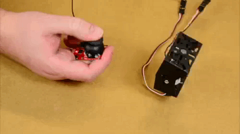
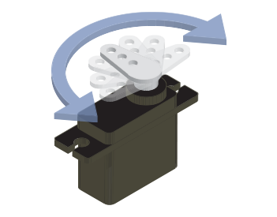
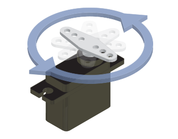
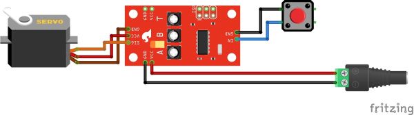
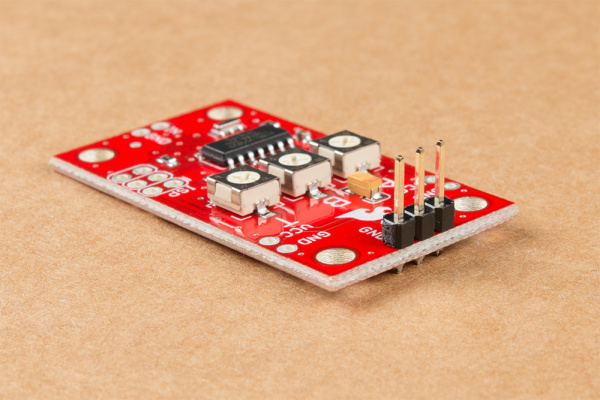
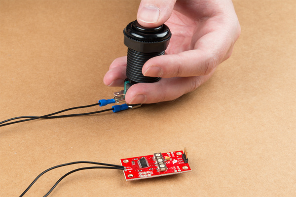
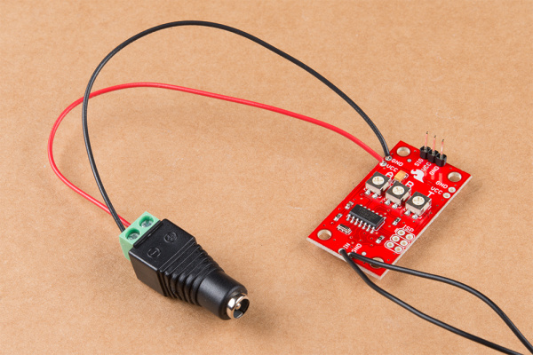
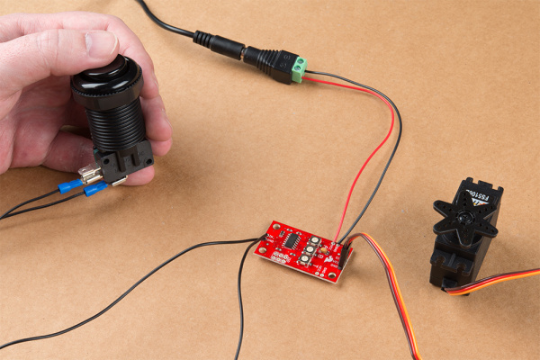
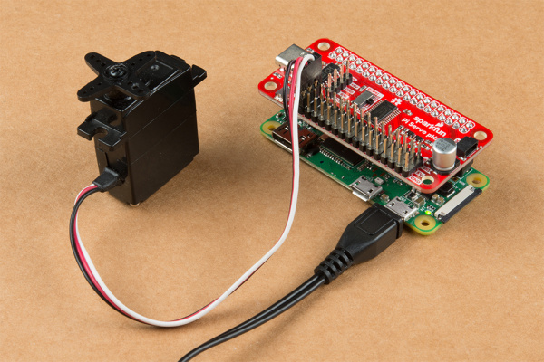
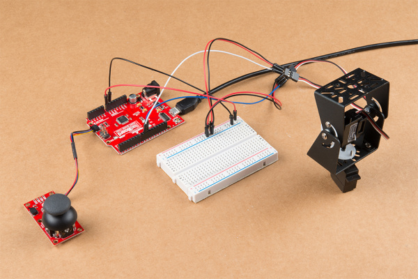

# サーボモーターの基本的な制御方法

物体を単純に左右へ振らせる用途から、ロボットやラジコンカーのステアリングを追加する用途まで、[ホビーサーボ](https://www.sparkfun.com/servos)は次のプロジェクトに動きを加えるのに適した部品である。
サーボを使えば、出力軸の速度、方向、位置[^footnote1]を、たった3本のワイヤーで簡単に制御できる。



このチュートリアルでは、サーボを制御するいくつかの方法と、外部入力からサーボを制御する方法を示すプロジェクトを紹介する。
まず、まったくプログラミングを必要としない例を使って、サーボ制御の基本をいくつか説明する。
続いて、Arduino IDEとPythonを使ってコードでサーボを制御する。
自分が使いたい部品やコーディング環境に応じて、好きな例に読み進めてもらって構わない。

[^footnote1]: 出力軸の位置フィードバックは、標準（クローズドループ）サーボでのみ利用できる。この点については次のセクションで詳しく説明する。

## 参考になるチュートリアル

このチュートリアルを進める前に、次の関連ガイドで、例の中で使う概念や部品について確認しておくとよい。

- [パルス幅変調（PWM）](./pulse-width-modulation.md) — パルス幅変調の概念の入門
- [モーターと最適な選び方](./motors-and-selecting-the-right-one.md) — さまざまな種類のモーターと、それぞれの動作原理を学ぶ
- [サーボモーター入門](./hobby-servo-tutorial.md) — サーボは出力軸の回転を正確に制御できるモーターであり、ロボット工学をはじめさまざまなプロジェクトの可能性を広げてくれる

## サーボモーターの基本

このチュートリアルの例に入る前に、サーボモーターの基本をいくつか確認しておこう。
サーボの詳しい背景や動作原理について詳しくは、[サーボモーター入門](./hobby-servo-tutorial.md)を参照してほしい。

### 標準サーボと連続回転サーボ

SparkFunでは、標準（standard）と連続回転（continuous rotation）という2種類のホビーサーボを扱っている。
両者にはいくつかの違いがあるが、このチュートリアルの目的においては、標準サーボと連続回転サーボの主な違いだけを確認しておけば十分である。

**標準サーボ**は、回転弧（通常は0〜90°または0〜180°）の範囲で動作し、コントローラーに位置のフィードバックを返す。
これにより、回転弧上の特定の位置までサーボを動かし、サーボ側がその位置をコントローラーに報告できる。
標準サーボは、ラジコンでのステアリング制御、[ロボットグリッパー](https://www.sparkfun.com/products/13174)の制御、あるいはこのチュートリアルで後述する[パン・チルトブラケット](https://www.sparkfun.com/products/10335)の制御など、位置決めが必要な用途に適している。



**連続回転サーボ**（フルローテーションサーボ、あるいは単に360°サーボと呼ばれることもある）は、通常のDCモーターにより近い動作をする。
サーボの位置を制御する代わりに、コントローラーはモーターの速度と方向を設定する。
連続回転サーボは、駆動用モーターや、わずかなワイヤーだけでモーターの速度と方向を制御したい用途に適している。



それぞれの種類に長所と短所があるため、自分のサーボプロジェクトに最も合った種類を検討するとよい。

### コネクタのピン配置

どのサーボを使う場合でも、配線を間違えないよう、コネクタのピン配置を確認しておくことが特に重要である。

ほとんどのサーボは、電源（**VCC**）、グラウンド（**GND**）、**制御信号**について、特定の色分けの規則に従っている。
下の表は、よく使われる3種類のサーボコネクタタイプの色分けを示している。
ピン番号の並びはほぼどのメーカーでも共通だが、ワイヤーの色はメーカーによって異なることがある。
自分のサーボがこの表と一致しない場合や確信が持てない場合は、必ずサーボのドキュメントで確認すること。

| ピン番号・名称 | 配色 - Hitec | 配色 - Futaba | 配色 - JR |
| --- | --- | --- | --- |
| 1. グラウンド（-） | 黒 | 黒 | 茶 |
| 2. 電源（+） | 赤 | 赤 | 赤 |
| 3. 制御信号 | 黄または白 | 白 | オレンジ |

*一般的なサーボのピン配置の表*

### 電圧範囲と電源

続いて、サーボプロジェクトの電源を選ぶ必要がある。
電源が供給する電圧が、そのサーボの電圧範囲（一般には**4.8〜6V**だが、必ずサーボのデータシートで確認すること）に収まっていることを確認する。
また、電源がサーボを駆動するのに十分な電流を供給できることも確認する。
ここでも、サーボのデータシートを見れば、電源から流れうる最大電流を把握する手がかりが得られる。
通常、サーボモーターの最大消費電流を知るには、データシートに記載されているストール電流（記載がある場合）を確認すればよい。

### 制御信号の範囲

最後にもう一つ確認しておきたいのが、サーボの**制御信号の範囲**である。
このチュートリアルでは制御信号の範囲についてのみ扱う。
サーボの制御信号がどう機能するかについてより詳しく知りたい場合は、[サーボモーター入門の「制御信号」](./hobby-servo-tutorial.md#制御信号)を参照してほしい。

ここで覚えておきたい最も重要な点は、サーボの制御信号のパルス幅（持続時間）の範囲である。
これは通常1〜2msの間だが、メーカーやサーボの種類によって異なることがある。
モーターやギアボックスを傷めないよう、必ず自分のサーボの仕様でパルス範囲を確認すること。
これは特に、ArduinoやPythonのセクションで示すように、マイクロコントローラーやシングルボードコンピュータからPWM値を送る場合に重要である。

## SparkFun Servo Triggerによるサーボ制御

最初の例では、[SparkFun Servo Trigger](https://www.sparkfun.com/products/13118)を使ってサーボモーターを動かす方法を示す。
この例ではコーディングもコンピュータへの接続も不要だが、推奨する方法で組み立てるにはスルーホールのはんだ付けが必要になる。
スルーホール部品のはんだ付けに馴染みがない場合は、まず[はんだ付けの基本（スルーホール編）](./how-to-solder-through-hole-soldering.md)を確認してほしい。

Servo Triggerは、基板にあらかじめ書き込まれたファームウェアが、基板上の3つのポテンショメータの位置を解釈することで動作する。
これらのポテンショメータは、サーボの開始位置・停止位置（「A」「B」とラベル付けされている）と、開始位置から停止位置まで移動するのにかかる時間（「T」とラベル付けされている）を決定する。
この移動シーケンスは、**`IN`**ピンと**`GND`**ピンを接続することで開始される。
この例では、[コンケーブボタン](https://www.sparkfun.com/products/9339)を使ってこの接続を行う。

これはSparkFun Servo Triggerの動作についてのごく簡単な概要である。
基板の全体像と使い方について詳しくは、[Servo Trigger Hookup Guide](https://learn.sparkfun.com/tutorials/servo-trigger-hookup-guide)を参照してほしい。

### 必要な部品

この例を進めるには、ウィッシュリストにある部品が必要になる。
すでに持っている部品や使いたいサーボに応じて、カートの内容を自由に追加・削除してほしい。

> **注意：** この例では標準のServo Triggerと標準サーボを使っているが、[SparkFun Servo Trigger - Continuous Rotation](https://www.sparkfun.com/products/13872)と[High Torque Continuous Rotation Servo](https://www.sparkfun.com/products/9347)のようなサーボに置き換えれば、連続回転タイプのプロジェクトにも簡単に応用できる。

### 必要な道具

上記の部品に加えて、回路を組み立てるには次の道具・材料を推奨する。

- はんだ
- はんだごて
- はんだ吸い取り線
- ワイヤーストリッパー

### ハードウェアの接続

次の接続を行う必要がある。
下に、Servo Triggerに接続する部品のFritzing図を示す。
部品同士をどう接続するか、順を追って説明する。



*回路が見づらい場合は、画像をクリックすると拡大表示できる。*

必要な部品と道具がすべて揃ったら、いよいよ回路の組み立てを始める。
まず、Servo Trigger上のサーボ用ピンにはんだ付けする。
選んだブレイクアウェイヘッダーから3ピン分を切り出し、**`SIG`**、**`VCC`**、**`GND`**とラベル付けされたサーボ用の3ピンの列にはんだ付けする。
オスヘッダーを使うことで、サーボモーターをトリガー基板に簡単に着脱できるようになる。
サーボのワイヤーハーネスが短すぎる場合は、[サーボ延長ケーブル](https://www.sparkfun.com/products/15808)で延長できる。



次に、ボタンへの接続を行う。
2本のスペードコネクタを用意し、被膜を剥いた側の端を、サーボの接続とは反対側にあるServo Triggerの**`IN`**ピンと**`GND`**ピンにはんだ付けする。
[マイクロスイッチ](https://www.sparkfun.com/products/9506)のないボタンを使いたい場合は、[ジャンパー線](https://www.sparkfun.com/products/11367)など他の材料で制御入力（プッシュボタンなど）を接続してもよい。
はんだ付けが終わったら、`IN`にはんだ付けしたワイヤーのスペードコネクタ側を、ボタンのマイクロスイッチの**`NO`**とラベル付けされたコネクタに、`GND`にはんだ付けしたもう一方のスペードコネクタを**`COM`**コネクタに接続する。



回路の組み立ての最後の部分は、電源の接続である。
サーボの接続と同様にヘッダーをはんだ付けしてジャンパー線で電源に接続することもできるが、これは電源に直接つながる部分なので、確実な接続にするため、Servo Trigger側面の**`VCC`**ピンと**`GND`**ピンにワイヤーを直接はんだ付けする。

電源用の電源ラインとグラウンドライン用に、2本のワイヤーを用意する。
それぞれのワイヤーの片端の被膜を剥き、下の写真のようにServo Trigger側面の**`VCC`**ピンと**`GND`**ピンにはんだ付けする。



続いて、[DCバレルジャックアダプタ](https://www.sparkfun.com/products/10288)を使う場合、Servo Triggerにはんだ付けしたワイヤーのもう一方の端の被膜を少し剥き、アダプタ端のねじ端子に差し込んで、ドライバーで固定する。
`VCC`ピンにはんだ付けしたワイヤーは「**+**」とラベル付けされた端子に、`GND`にはんだ付けしたワイヤーは「**-**」とラベル付けされた端子に対応させること。

> **⚡ 注意！** VCCとGNDを、DCバレルジャックアダプタの対応する接続（「**+**」「**-**」とラベル付けされている）に必ず接続すること。逆に配線すると回路がショートし、Servo Trigger、サーボ、電源を損傷する恐れがある。

Servo Triggerへのはんだ付けがすべて終わり、ボタンとサーボが接続されたら（まだ接続していなければ）、電源を接続してボタンを押してみる。
サーボが片側からもう片側へ振れる動きが見えるはずである。
Servo Trigger上の3つのポテンショメータを調整し、サーボの方向、動作角度、動作時間を切り替えてみてほしい。



### トラブルシューティングのヒント

#### サーボが動かない、または電源が入らない

サーボが動かない、あるいはボタンを押しても反応しない場合、最もよくある原因ははんだ付け不良である。
サーボの電源が入らない、あるいはボタンを押しても動かない場合は、はんだ付けがピンやワイヤーとはんだパッドを完全に接続しているか、ワイヤーやはんだ付け部分同士が触れ合っていないか確認すること。
また、電源がDCバレルジャックアダプタとコンセントにしっかり差し込まれており、サーボとServo Triggerを駆動するのに十分な電圧を供給しているかも確認すること。
はんだ付け不良の修正のコツについては、[SparkFunのトラブルシューティングのコツ](./sparkfun-troubleshooting-tips.md)を参照してほしい。

#### 不規則な動き

これは、ポテンショメータがサーボのパルス範囲を超えて設定されているか、ボタンの配線が逆になっている可能性がある。
「A」と「B」のポテンショメータを調整して、不規則な動きを直してみてほしい。
電源を入れた直後にサーボがすぐに動いてしまい、その後ボタンを押しても予期しない反応をする場合は、ボタンのワイヤーのどちらかが誤って接続されている可能性がある。
`IN`ピンがボタンの`NO`コネクタに、`GND`ピンが`COM`コネクタに接続されているか確認すること。

## ArduinoとServoライブラリによるサーボ制御

2つ目のサンプル回路は、組み立てはずっと簡単ではんだ付けも不要だが、[Arduino IDE](https://www.arduino.cc/en/Main/Software)でコードをアップロード・使用する必要がある。
Arduinoに馴染みがない、あるいはコンピュータにインストールしていない場合は、まず下記のガイドでIDEをインストールし、Arduinoを始めてみてほしい。

- [Arduinoとは何か](./what-is-an-arduino.md)
- [Arduino IDEのインストール](https://learn.sparkfun.com/tutorials/installing-arduino-ide)

[SparkFun RedBoard Qwiic](https://www.sparkfun.com/products/15123)を、[パルス幅変調（PWM）](./pulse-width-modulation.md)を使ったサーボモーターのドライバー・コントローラーとして使う。

### 必要な部品

この例を進めるには、下記の部品が必要になる。
すでに持っている部品や、別の開発ボード・サーボを使いたい場合に応じて、カートの内容を調整してほしい。

### ハードウェアの組み立て

この回路で必要なのは、下の図のようにサーボモーターをRedBoardに接続することだけである。


この回路のセットアップは、RedBoard Qwiicの3本のピンだけを使うためとても簡単だが、サーボの電源ピンは**5V**ではなく**VIN**に接続する点に注意してほしい。
**5V**ピンは最大250mAまでしか供給できず、ほとんどのサーボを駆動するには不十分なため、代わりに**VIN**ピンを使う。

> **注意！** この例のように、コンピュータからUSB経由でRedBoard Qwiicに給電している限り、**VIN**からサーボに給電する方法でうまく動作する。ただし**VIN**ピンは電源に直接つながっているため、バレルジャックコネクタなど他の方法でRedBoardに給電する場合は、その電圧がサーボの電圧範囲に収まっていることを確認すること。

### Arduinoのコード

回路の配線が終わったら、いよいよコードをアップロードする番である。
RedBoard（または他の開発ボード）をUSBケーブルでコンピュータに接続し、表示されるポートを確認する。
続いてArduino IDEを開き、下のコードをコピーして新しいスケッチに貼り付ける（デフォルトのコードテンプレートを必ず削除すること）。

次に、**Tools**メニューでボードの種類（この場合は**Arduino/Genuino Uno**）と、ボードが列挙されたCOMポートを選択する。
続いて「Upload」ボタンをクリックする。
コンパイルとアップロードにエラーがなければ、サーボが左右に振れる動きが見えるはずである。

```cpp
/******************************************************************************
servo-sketch.ino
Example sketch for connecting a servo to a SparkFun RedBoard
  Servo Motor: (https://www.sparkfun.com/products/11965)
  SparkFun RedBoard: (https://www.sparkfun.com/products/13975)
Byron Jacquot@ SparkFun Electronics
May 17, 2016

**SparkFun code, firmware, and software is released under the MIT License(http://opensource.org/licenses/MIT).**

Development environment specifics:
Arduino 1.6.5
******************************************************************************/

#include <Servo.h>

Servo my_servo;

uint32_t next;

void setup()
{
  // the 1000 & 2000 set the pulse width 
  // mix & max limits, in microseconds.
  // Be careful with shorter or longer pulses.
  my_servo.attach(9, 1000, 2000);

  next = millis() + 500;
}

void loop()
{
  static bool rising = true;

  if(millis() > next)
  {
    if(rising)
    {
      my_servo.write(180);
      rising = false;
    }
    else
    {
      my_servo.write(0);
      rising = true;
    }

    // repeat again in 3 seconds.
    next += 3000;
  }

}
```

### コツとトラブルシューティング

#### コンパイル・アップロードのエラー

コンパイルやアップロードでエラーが出た場合、最もよくある原因はポートの選択間違いである。
RedBoardが接続されているポートを再確認し、もう一度試してみてほしい。
「Port」メニューに複数のポートが表示される場合は、RedBoardを接続する前にどのポートが利用可能か確認しておき、接続後にそのメニューに新しく表示されたポートを選択するとよい。

もう一つ考えられる問題は、コードが正しくコピーされていない場合である。
よくある原因は、デフォルトのコードテンプレートがサンプルコードで完全に削除・上書きされていないことである。
自分のコードをざっと確認し、重複した`void loop();`や`void setup();`、あるいはデフォルトテンプレートの残骸が残っていないか確認すること。
画面下部に表示されるエラーの詳細を見れば、エラーの内容や、コード中のコンパイルエラーの箇所についてより詳しい情報が得られる。

#### サーボの動作の問題

サーボがまったく動かない場合は、おそらくワイヤーの配線を間違えている。
RedBoard上の正しいピンにサーボが接続されているか、配線をやり直して確認してみてほしい。

サーボがガタガタ動く、あるいは固まっているように見える場合は、サーボのパルス範囲を超えて駆動している可能性がある。
サーボのデータシートを確認し、setup内の`servo.attach(9, 1000, 2000);`関数の2番目と3番目の値を調整してほしい。

## PythonとPi Servo pHATによるサーボ制御

3つ目の例では、[Raspberry Pi](https://www.sparkfun.com/categories/395)と[SparkFun Servo pHAT for Raspberry Pi](https://www.sparkfun.com/products/15316)を、[SparkFun PiServoHAT Pythonモジュール](https://github.com/sparkfun/PiServoHat_Py)とともに使い、サーボを駆動する方法を示す。
Servo pHATは最大*16*個のPWMデバイスを制御できるため、複数のサーボやLEDなど他のPWMデバイスを組み合わせるプロジェクトに適している。
Raspberry Piは、前の例で使ったRedBoardのような開発ボードよりもはるかに高い処理能力を持つため、複雑なプロジェクトに向けてさまざまな処理をバックグラウンドで実行できる。

Raspberry PiやServo pHATを使ったことがない場合は、続ける前に次のチュートリアルを読むことを*強く推奨する*。
「Getting Started with the Raspberry Pi」のチュートリアルは、Raspberry Piをセットアップする上で最も重要であり、これを先に済ませておかないとこの例を進めることはできない。

- [PythonプログラミングでRaspberry Piを始める](./python-programming-tutorial-getting-started-with-the-raspberry-pi.md) — Pythonでハードウェアを制御するRaspberry Pi向けプログラムの書き方を学べるガイド
- [Pi Servo pHAT (v2)の使い方](./pi-servo-phat-v2-hookup-guide.md) — Raspberry PiでPi Servo pHATを接続・使用する方法の入門ガイド

### 必要な部品

この例を進めるには、次の部品が必要になる。
すでに持っている部品や、別の[Raspberry Pi](https://www.sparkfun.com/categories/395)や[サーボ](https://www.sparkfun.com/categories/245)を使いたい場合に応じて、カートを調整してほしい。

これらの部品に加えて、Raspberry Piを設定・操作するためのキーボード、マウス、モニタも用意しておくとよい。
あるいは、別のコンピュータを使ってRaspberry Piの[ヘッドレスセットアップ](https://learn.sparkfun.com/tutorials/headless-raspberry-pi-setup)を行うこともできる。
また、すでに使いたいSDカードがある場合は、Raspberry Pi Foundationの[Setting up your Raspberry Pi](https://projects.raspberrypi.org/en/projects/raspberry-pi-setting-up)ガイドの手順に従い、Raspbian OSをダウンロード・インストールすることもできる。

### ハードウェアの接続

Servo pHATの接続自体はかなり単純だが、いくつか注意点がある。
すべての電源を切った状態で、下の写真のような向きになるよう注意しながら、pHATをPiの2×20 GPIOヘッダーに取り付ける。


*Raspberry Pi 3（左）とRaspberry Pi Zero W（右）に正しく接続されたPi Servo pHAT。画像をクリックすると拡大表示できる。*

続いて、サーボのピンとServo pHATのシルクスクリーンのラベルを合わせながら、3ピンのチャンネルヘッダーのいずれかにサーボを接続する。
今回使う例ではデフォルトで**チャンネル0**を使うので、別のチャンネルを使う場合はコードもそれに合わせて調整すること。
Piの電源が入っている状態でサーボを接続しては**いけない**。急激な電流の変化により、Raspberry Piがリセットされることがある。

続いて、Piを接続する。
そして電源を入れれば、プログラミングに進む準備は完了である。
下の写真は、Raspberry PiとPi Servo pHATへの給電方法の2つの選択肢を示している。




*さまざまな電源の選択肢のうち、2つの例。*

### Pythonパッケージ

ハードウェアの組み立てがすべて終わり、[Piの設定](https://learn.sparkfun.com/tutorials/python-programming-tutorial-getting-started-with-the-raspberry-pi/configure-your-pi)も準備できたら、いよいよPythonモジュールをインストールし、サンプルの一つを実行する番である。
今回は、[Example 2 - Full Sweep with 180 deg. Servo](https://github.com/sparkfun/PiServoHat_Py/blob/master/examples/ex2_full_sweep_with_180_deg_servo.py)を使う。

まず、Piにパッケージをインストールする必要がある。
このチュートリアルを簡潔にするため、ここではSparkFun Qwiic Pythonパッケージ一式をインストールする方法だけを扱う。
パッケージの一部だけをインストールしたい場合や手動でインストールしたい場合は、[Pi Servo pHAT (v2)の使い方の「Pythonパッケージの概要」](./pi-servo-phat-v2-hookup-guide.md#pythonパッケージの概要)で詳しい手順を確認してほしい。

SparkFun Qwiic Pythonパッケージは、SparkFunのQwiic製品向けに利用可能なPythonパッケージをすべてインストールし、必要なI2Cドライバーパッケージも含んでいる。
`pip3`（Python 2の場合は`pip`）経由でPyPiに対応しているシステムでは、次のコマンドで簡単にインストールできる。

**すべてのユーザー**向け（[sudo](https://en.wikipedia.org/wiki/Sudo)権限が必要な点に注意）には、コマンドプロンプトから次のコマンドを入力する。

```bash
sudo pip3 install sparkfun-qwiic
```

**現在のユーザー**だけにパッケージをインストールしたい場合は、コマンドプロンプトで次のコマンドを入力する。

```bash
pip install sparkfun-qwiic
```

SparkFun Qwiicパッケージのインストールが終わったら、いよいよコードを作成して実行する番である。
下のコードを[ダウンロード](https://github.com/sparkfun/PiServoHat_Py/tree/master/examples)するか、コピーしてファイルに貼り付ける。
続いて、ファイルを開いて（あるいは保存して）、好みの[Python IDE](https://www.sparkfun.com/news/2706)でコードを実行する。
たとえば、Raspbianのデフォルトの開発環境であるIDLEでこの例を実行するには、**Run > Run Module**をクリックするか、`F5`キーを使う。
サンプルを止めるには、`Ctrl` + `C`のキーの組み合わせを使う。

このサンプルを実行している間、サーボが180度の弧を左右に動く様子が見えるはずである。

```python
#-----------------------------------------------------------------------
# Pi Servo Hat - Example 2
#-----------------------------------------------------------------------
#
# Written by  SparkFun Electronics, June 2019
# Author: Wes Furuya
#
# Compatibility:
#     * Original: https://www.sparkfun.com/products/14328
#     * v2: https://www.sparkfun.com/products/15316
#
# Do you like this library? Help support SparkFun. Buy a board!
# For more information on Pi Servo Hat, check out the product page
# linked above.
#=======================================================================

"""
This example should be used with a 180 degree (range of rotation) servo
on channel 0 of the Pi Servo Hat.

The extended code (commented out), at the end of the example could be
used to test the full range of the servo motion. However, users should
be wary as they can damage their servo by giving it a position outside
the standard range of motion.
"""

import pi_servo_hat
import time

# Initialize Constructor
test = pi_servo_hat.PiServoHat()

# Restart Servo Hat (in case Hat is frozen/locked)
test.restart()

# Test Run
#########################################
# Moves servo position to 0 degrees (1ms), Channel 0
test.move_servo_position(0, 0, 180)

# Pause 1 sec
time.sleep(1)

# Moves servo position to 180 degrees (2ms), Channel 0
test.move_servo_position(0, 180, 180)

# Pause 1 sec
time.sleep(1)

# Sweep
#########################################
while True:
    for i in range(0, 180):
        print(i)
        test.move_servo_position(0, i, 180)
        time.sleep(.001)
    for i in range(180, 0, -1):
        print(i)
        test.move_servo_position(0, i, 180)
        time.sleep(.001)

#########################################
# Code below may damage servo, use with caution
# Test sweep for full range of servo (outside 0 to 180 degrees).
# while True:
#     for i in range(-45, 200):
#         print(i)
#         test.move_servo_position(0, i, 180)
#         time.sleep(.001)
#     for i in range(200, -45, -1):
#         print(i)
#         test.move_servo_position(0, i, 180)
#         time.sleep(.001)
```

### トラブルシューティングのヒント

サーボが動かない、あるいはPi側でServo pHATが認識されない場合は、次のヒントを参考にしてほしい。

#### デバイスが見つからない

`OSError: [Errno 121] Remote I/O error`というエラーが表示される場合は、GPIOヘッダーへの接続を再確認してほしい。

また、Raspberry Pi上でI2Cハードウェアが有効になっているかも確認すること。
有効になっていない場合、おそらく`Failed to connect to I2C bus 1.`というエラーが表示される。
PiでI2Cを有効化する方法については、[Raspberry PiのSPIとI2Cチュートリアルの「PiでのI2C」](./raspberry-pi-spi-and-i2c-tutorial.md#piでのi2c)を参照してほしい。

#### I2C接続を確認する

Raspberry PiがI2C経由でServo pHATと通信できているかを確認する簡単な方法は、I2Cバスにpingを送ることである。
最新版のRaspbian Stretchでは、i2ctoolsパッケージがあらかじめインストールされているはずである。
入っていない場合は、ターミナルで次のコマンドを実行する。

```bash
sudo apt-get install i2ctools
```

**i2ctools**パッケージがインストールされたら、ターミナルで次のコマンドを実行してI2Cバスにpingを送れる。

```bash
i2cdetect -y 1
```

ターミナルに表が表示されるはずである。
Servo pHATが正しく接続され動作していれば、**0x40**のアドレス空間が`40`とマークされているはずである。

#### 電流消費の問題

サーボが電源の許容範囲を超える電流を消費している場合、Servo pHATは正しく動作せず、Raspberry Piが再起動したり、電圧不足で断続的に不安定になったりすることがある。

特に大型のサーボを使っている場合や、多数のサーボで重い負荷を駆動している場合、PiのUSBポートでPiとServo pHATの両方に給電していると、Piが再起動したり電圧不足になったりすることがある。
pHAT上のUSB-Cコネクタから直接PiとServo pHATに給電するよう切り替えることもできるが、より良い解決策は、Power Isolationジャンパーを切断し、それぞれのデバイスに個別に給電することである。
このジャンパーの場所と変更方法については、[Pi Servo pHAT (v2)の使い方の「ジャンパー」](./pi-servo-phat-v2-hookup-guide.md#ジャンパー)で説明している。

## Qwiic Joystickによるサーボの直接制御

ループでサーボを制御する方法は、電源が入っている間ずっと何かを動かし続けたいプロジェクトには適しているが、サーボをもっと直接的に制御したい場合はどうすればよいだろうか。
このプロジェクトでは、まさにその方法を示す。

このプロジェクトでは、[Qwiic Joystick](https://www.sparkfun.com/products/15168)を入力として使い、[RedBoard Qwiic](https://www.sparkfun.com/products/15123)に取り付けたパン・チルトブラケット上の2つのサーボを制御する。
Qwiic Joystickについて詳しくは、[Qwiic Joystick Hookup Guide](https://learn.sparkfun.com/tutorials/qwiic-joystick-hookup-guide)を確認してほしい。

### 必要な部品

このサンプルプロジェクトを進めるには、次の部品が必要になる。
すでに持っている部品に応じて、カートの内容を更新するとよい。

### ハードウェアの接続

このプロジェクトでまず組み立てるのは、2つのサブマイクロサーボを使ったパン・チルトブラケットである。
サーボを使ってパン・チルトブラケットを組み立てる基本的な手順は、[組み立てガイド](https://learn.sparkfun.com/tutorials/setting-up-the-pi-zero-wireless-pan-tilt-camera)を参照してほしい。

> **組み立てのコツ：** サーボを正しく位置合わせしておくと、可動範囲をフルに活用でき、配線が終わった後でサーボを付け直す手間を避けられる。
>
> フィット感によっては、ガイドで示されている2枚ではなく3枚のワッシャーで間隔を調整する必要があるかもしれない。

パン・チルトブラケットを組み立てたら、サーボの信号線をRedBoard上の指定されたI/Oピンに接続し、Qwiic CableでQwiic JoystickをRedBoardに接続する。
サンプルコードでは、デフォルトで水平方向のサーボに**D9**、垂直方向のサーボに**D10**を使っているが、必要であれば`servoH.attach(9);`と`servoV.attach(10);`の関数を変更して別のピンに接続することもできる。

最後に、サーボの電源ピンを接続する必要がある。
先ほどのArduino Servoライブラリの例と同様に、RedBoardの**VIN**ピンを使う。
**5V**ピンは最大**250mA**までしか供給できず、パン・チルト用サーボはブラケットに何も取り付けていない状態でも**350mA**を超える電流を消費することがあるためである。

パン・チルトブラケットには2つのサーボがあるため、ブレッドボードを使って両方のサーボの電源ピンをまとめて接続する。

> **注意：** ブレッドボードを使ったことがない場合は、[ブレッドボードの使い方](./how-to-use-a-breadboard.md)を確認することを推奨する。

各サーボの電源ピンとグラウンドピンをブレッドボードの「**+**」「**-**」レールに接続し、続いてRedBoardの電源を**切った状態**で、RedBoardの**VIN**ピンと**GND**ピンも同じブレッドボードのレールに接続する。
すべての電源・グラウンドピンを正しく接続したら、RedBoardをUSBで接続する。

> **注意！** シンプルなArduinoの例と同様に、**VIN**ピンはUSBポートに接続されている場合5Vを出力するため、サーボの駆動に問題なく使える。ただし、回路に別の電源を使う場合は、サーボの電圧範囲内で給電するよう注意すること。このプロジェクトで使うサーボ（および他のほとんどのホビーサーボ）の場合、**4.8〜6V**である。



*回路が見づらい場合は、写真をクリックすると拡大表示できる。*

### Arduinoのコード

配線がすべて終わったら、いよいよコードをアップロードする番である。
まず、[Qwiic Joystickライブラリ](https://github.com/sparkfun/SparkFun_Qwiic_Joystick_Arduino_Library)がまだインストールされていなければインストールする。
上記のリンクからダウンロードして手動でインストールすることもできるが、Library Managerツールからインストールすることを推奨する。
Library Managerを開き、「**SparkFun Qwiic Joystick**」を検索してインストールをクリックするだけでよい。
Arduinoのライブラリをインストールしたことがない場合は、[Installing an Arduino Library Tutorial](https://learn.sparkfun.com/tutorials/installing-an-arduino-library)で手順全体を確認できる。

ライブラリのインストールが終わったら、下のコードをコピーして新しいスケッチに貼り付ける。
ボードとして「**Arduino/Genuino Uno**」（あるいは別の開発ボードを使っている場合はそれ）を選択し、ボードが接続されている「Port」を選んでコードをアップロードする。

```cpp
/*
 Example code to control two servos using the SparkFun Qwiic Joystick.
 Code takes the readings of the Vertical (Y) and Horizontal (X) axes of the joystick
 and maps them to values between 0 and 180 degrees.

 Based off of the Arduino "Knob" example:

 Controlling a servo position using a potentiometer (variable resistor)
 by Michal Rinott <http://people.interaction-ivrea.it/m.rinott>

 modified on 8 Nov 2013
 by Scott Fitzgerald
 http://www.arduino.cc/en/Tutorial/Knob
*/

#include <Servo.h>
#include "SparkFun_Qwiic_Joystick_Arduino_Library.h"

JOYSTICK joystick; // create joystick object to send position values


Servo servoH;  // create servo object to control a servo
Servo servoV;

int h;    // variable to read the horizontal values from the Qwiic Joystick
int v;    // variable to read the vertical values from the Qwiic Joystick

void setup() {
  servoH.attach(9); // attaches servo1 on pin 9 to the servo object
  servoV.attach(10);  // attaches servo2 on pin 10 to the servo object
  Serial.begin(9600);
  Serial.println("Qwiic Joystick Servo Control");

  if(joystick.begin() == false)
  {
    Serial.println("Joystick not connected. Check wiring. Freezing...");
    while(1);
  }
}

void loop() {
  h = joystick.getHorizontal();   // reads the value of the Qwiic Joystick's horizontal axis (between 0 & 1023)
  h = map(h, 0, 1023, 0, 160);     // scale it to use it with the servo (value between 0 and 180)
  servoH.write(h);                  // sets the horizontal servo position according to the scaled value
  v = joystick.getVertical(); // reads the value of the Qwiic Joystick's vertical axis (between 0 & 1023)
  v = map(v, 0, 1023, 0, 165);
  servoV.write(v);
  delay(15);    // waits for the servo to get there
  /*Serial.print("X: ");  //uncomment these lines to view the serial print of the x and y axes of the Qwiic Joystick 
  Serial.print(joystick.getHorizontal());   //these can be helpful for debugging or identifying any drift on your joystick
  Serial.print("Y: ");
  Serial.print(joystick.getVertical());
  Serial.println();*/
}
```

コードのアップロードが終わったら、ジョイスティックを動かしてみてほしい。
下のGIFのように、9番ピンに接続したサーボが水平方向の動きに、10番ピンに接続したサーボが垂直方向の動きに反応するはずである。


### トラブルシューティングのヒント

この例でよくあるつまずきポイントについて、いくつかヒントを紹介する。

#### コンパイル・アップロードのエラー

`avrdude stk500_recv() programmer is not responding`や、対象デバイス（つまりRedBoard）に関する類似のエラーが出た場合は、RedBoardの正しいポートと正しいボードの種類を選択しているか確認してほしい。

`SparkFun_Qwiic_Joystick_Arduino_Library.h: No such file or directory`のようなエラーが出た場合は、Qwiic Joystickライブラリが正しくインストールされていない。
Arduino Library Managerツールで、ライブラリがインストールされていて最新版になっているか確認してほしい。

#### 電源の問題

この例ではブレッドボードを使っているため、電源関連の問題（たとえばUSBを接続しても回路全体の電源が入らないなど）でよくある原因は、ワイヤーの配線ミスである。
ブレッドボード上のすべての電源線とグラウンド線が正しく接続されているか確認すること。
よくあるミスは、ワイヤーの一部が逆になっている（電源とグラウンドが入れ替わっているなど）ことである。
ブレッドボードの正しいレールに差し込まれ、サーボとRedBoardの両方としっかり接続されているか確認してほしい。

## まとめ・参考資料

さまざまな方法でサーボを制御する基礎がしっかり身についたところで、次はこれらをプロジェクトにどう組み込むか考える番である。
パン・チルトブラケットには、カメラやLEDアレイなど、いろいろなものを追加できる。
先ほどのプロジェクトの[Qwiic Joystick](https://www.sparkfun.com/products/15168)を、IMUのような別のセンサーに置き換えることもできるし、ジョイスティックのデータを無線接続で送信すれば、自分だけのラジコンカーやロボットを作る道も開けてくる。

サーボをプロジェクトに組み込むアイデアが欲しい場合は、サーボを使った次のようなチュートリアルも参考にしてほしい。

- [Building a Safe Cracking Robot](https://learn.sparkfun.com/tutorials/building-a-safe-cracking-robot) — 未知の金庫を1時間以内に開錠する方法
- [Setting Up the Pi Zero Wireless Pan-Tilt Camera](https://learn.sparkfun.com/tutorials/setting-up-the-pi-zero-wireless-pan-tilt-camera) — Raspberry Pi Zeroをヘッドレスなワイヤレスパン・チルトカメラとして組み立て、プログラムし、アクセスする方法
- [SparkFun ESP32 DMX to LED Shield](https://learn.sparkfun.com/tutorials/sparkfun-esp32-dmx-to-led-shield) — DMX to LED Shieldをさまざまな方法で活用する方法を学ぶ
- [LED Gumball Machine](https://learn.sparkfun.com/tutorials/led-gumball-machine) — ガムボールマシンを改造して、世界をもう少し楽しく、ぴかぴかにする

自分のサーボプロジェクトのヒントとして、次のようなブログ記事も参考になる。

- [Hack-o-Lantern 2009](https://news.sparkfun.com/303) — 2009年のSparkFun Hack-o-Lanternコンテストの優勝者を発表
- [Intro to Servo Motors with Jeff](https://news.sparkfun.com/1058) — 教育チームによるもう一つの動画を紹介
- [Animatronic Iron Man MKIII Suit](https://news.sparkfun.com/1475) — 友人のJerome氏が作った驚くべきアイアンマンスーツ
- [Hardware Hump Day: Sleight of Servo](https://news.sparkfun.com/2482) — 電子工作で観客を沸かせるマジシャン、Mario the Maker Magician
- [SIK v4.0 Extra Projects](https://news.sparkfun.com/2538) — SparkFun Inventor's Kitを、さらなるプロジェクトで一歩先へ
- [Interactive Spooky Halloween Cat](https://news.sparkfun.com/2799) — トリックオアトリートの子どもたちを驚かせる、距離センサーを使ったハロウィン小道具
- [Making Motion Simple with Servos](https://news.sparkfun.com/3262) — サーボを使って次のプロジェクトに動きを組み込むアイデアの概要と、いくつかの例

タグ: Arduino、Hookup、モーター、Python、Qwiic、Raspberry Pi

---

出典：[Basic Servo Control for Beginners](https://learn.sparkfun.com/tutorials/basic-servo-control-for-beginners)（SparkFun Learn）を日本語に翻訳し、再構成した。
原文は [CC BY-SA 4.0](https://creativecommons.org/licenses/by-sa/4.0/) ライセンスで公開されており、本ページも同ライセンスの下で提供する。
