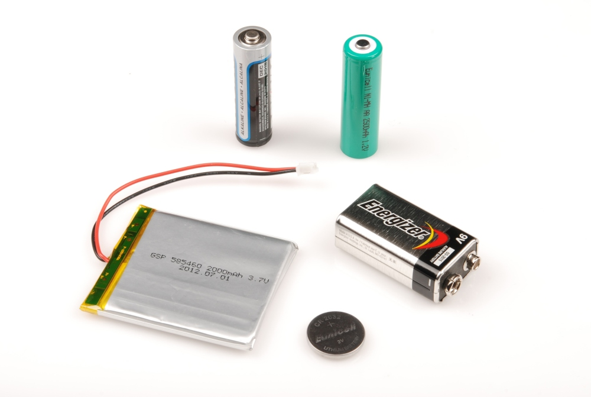
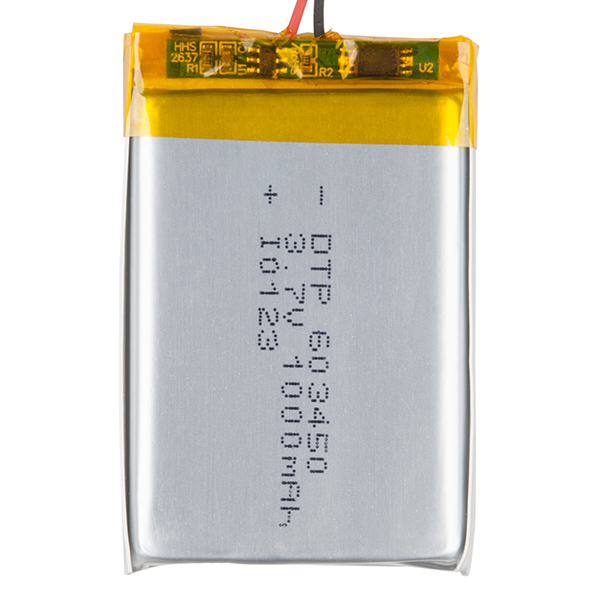
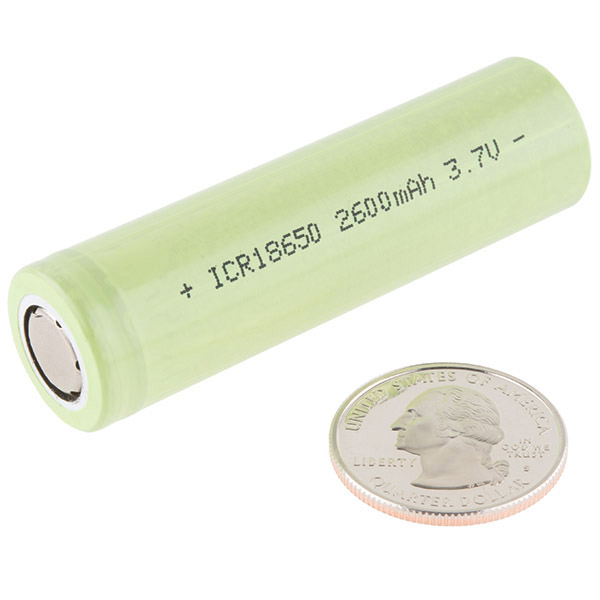
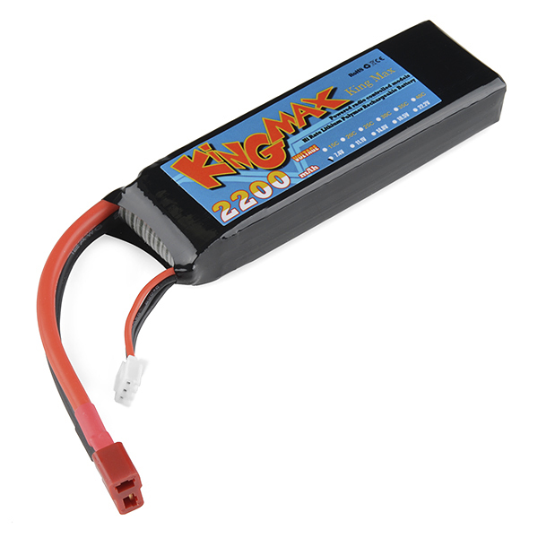

# 電池の技術

電池の技術には実に多くの種類がある。
[電池の化学的な仕組み](http://batteryuniversity.com/learn/article/whats_the_best_battery)の細かい話については、優れた資料がすでにたくさんある。
特にWikipediaの「[電池](https://ja.wikipedia.org/wiki/%E9%9B%BB%E6%B1%A0)」のページは充実しており、網羅的である。
このチュートリアルでは、組み込みシステムやDIYの電子工作でよく使われる電池に焦点を当てる。

参考になるチュートリアル:

- [回路とは何か](./what-is-a-circuit.md)
- [電圧、電流、抵抗とオームの法則](./voltage-current-resistance-and-ohms-law.md)
- [電気とは何か](./what-is-electricity.md)
- [交流と直流の違い](./alternating-current-ac-vs-direct-current-dc.md)

## 用語

電池について語るときによく使われる用語をいくつか紹介する。

**容量**：電池には、どれだけの電力を蓄えられるかを示す定格がある。
電池が満充電のとき、その容量がその電池に蓄えられている電力量にあたる。
同じ種類の電池どうしは、時間あたりに出力できる電流量で定格を表すことが多い。
たとえば[1000mAh](https://www.sparkfun.com/products/339)（ミリアンペア時）や[2000mAh](https://www.sparkfun.com/products/8483)の電池がある。

**公称セル電圧**：充電されたセルが出力する平均的な電圧である。
電池の公称電圧は、その背後にある化学反応によって決まる。
鉛蓄電池を使った自動車用バッテリーは12Vを出力し、リチウムコイン電池は3Vを出力する。

ここで重要なのは「公称」という言葉である。
実際に測定される電圧は、放電が進むにつれて下がっていく。
満充電のLiPo電池はおよそ4.23Vを出力するが、放電しきった状態ではおよそ2.7V程度まで下がることがある。

**形状**：電池にはさまざまな大きさや形がある。
「単3形」という呼び方は、特定の形状と規格のセルを指す。
[形状には非常に多くの種類がある](http://en.wikipedia.org/wiki/List_of_battery_sizes)。

**一次電池と二次電池**：一次電池は**使い切り**の電池とほぼ同じ意味である。
一次電池は一度完全に使い切ると、（安全かつ確実には）再充電できない。
二次電池は**充電式**の電池としてよく知られている。
満充電にするには別の電源が必要になるが、寿命が尽きるまで何度も充放電を繰り返せる。
一般に一次電池は放電速度が遅く長持ちするが、充電式の電池ほど経済的でないこともある。

| 電池の形状 | 化学的方式 | 公称電圧 | 充電式か |
| --- | --- | --- | --- |
| 単3、単4、単2、単1形 | アルカリまたはマンガン | 1.5V | いいえ |
| 9V形 | アルカリまたはマンガン | 9V | いいえ |
| コイン電池 | リチウム | 3V | いいえ |
| シルバーフラットパック | リチウムポリマー（LiPo） | 3.7V | はい |
| 単3、単4、単2、単1形（充電式） | ニッケル水素またはニッケルカドミウム | 1.2V | はい |
| 自動車用バッテリー | 6セル鉛蓄電池 | 12.6V | はい |

**エネルギー密度**：電池の容量と、形状や大きさを組み合わせることで、エネルギー密度を計算できる。
技術によって実現できる密度は異なり、たとえばリチウム系の電池は、アルカリ電池やコイン電池に比べて同じ体積でより多くのエネルギーを詰め込めることが多い。

**自己放電率**：6か月放置していた車のエンジンをかけようとしたことはないだろうか。
電池は、棚に置いたまま使わずにいても放電していく。
時間の経過とともに電池自身が放電していく速さを、自己放電率と呼ぶ。

**安全性**：電池はエネルギーを蓄えているため、基本的にはごく小さな爆発物のようなものである。
危害を防ぐため、電池はできる限り安全に設計されている。
たいていの電池技術は、誤った使い方をされた場合でも安全に放電するように設計されている。
アルカリ電池を間違った向きに接続すると、熱くなることはあっても、発火することはないはずである。
たいていのリチウムポリマー電池には、電池を保護し、危険な使い方を防ぐための保護回路が内蔵されている。

用語の一覧や技術的な概要については、Wikipediaが[優れた資料](http://en.wikipedia.org/wiki/Battery_(electricity))になる。

## リチウムポリマー

**リチウムポリマー**（LiPoと略されることが多い）電池は、組み込み電子工作にとって非常に有用な電池である。
市場で手に入るものの中でも最高水準のエネルギー密度を持つ。
携帯電話の多くにこのタイプの電池が使われているため、手頃な価格で入手しやすい。
専用の充電が**必要**なので、必ず適切な充電器を使うこと。
SparkFunでは3.7Vのリチウムポリマーバッテリーをさまざまなサイズで扱っている。
どの容量を選ぶかは、プロジェクトの想定稼働時間やサイズの制約など、さまざまな要因によって決まる。

### 公称電圧

LiPoの1セルの**公称電圧は3.7V**である。
満充電時には4.3V近くまで達するが、通常の使用ではすぐに3.7Vまで下がる。
使い切った状態では、セルの電圧はおよそ3V程度になる。
つまり、セルから直接電源を取るプロジェクトでは、さまざまな電圧に対応できる設計にする必要がある。
5Vが必要な場合は、2本のLiPoを直列につないで7.4Vのパックを作り、そこから5Vまで降圧する必要がある。

### コネクタ

小型電子機器の世界では、たいていのLiPo電池は何らかの2ピンコネクタで終端されている。
SparkFunでは**JSTコネクタ**を採用している。
これにより、電池を間違った向きに接続してしまうことを防げる。
このコネクタは摩擦だけで固定されているため、電池を取り外すときはペンチなどを使って優しく引き抜くのが一般的である。

### 充電と放電

LiPo電池を充電するための安価な充電器は数多く販売されている。
たいていUSB経由で充電する。
専用の充電器**なしで**LiPo電池を充電しようとしてはいけない。
LiPo電池は過充電によって傷んでしまうことがあるので、必ずLiPo専用に設計された充電器を使うこと。

リチウムイオン電池を充電する前に、電池の容量と、充電器が供給する充電電流を必ず確認しておくこと。

LiPo電池は、放電しすぎることでも傷んでしまう。
これを防ぐため、ほとんどのLiPo電池にはセルの上部に小さな安全回路が内蔵されており、電圧が一定のしきい値（たいてい**3V**）を下回ると電池を遮断するようになっている。
この保護回路の基板は、たいてい配線が接続されている黄色いカプトンテープの下に隠れている。

LiPo電池は**自己放電率が非常に低い**。
そのため、消費電力が少なく、何日も、あるいは何か月も動作させ続ける必要があるプロジェクトに適している。

**エネルギー密度には注意すること：** これらの電池は大きな力を秘めており、連続して数アンペアもの電流を供給できる。
ショート保護機能はショートを検知すると電池を遮断してくれるが、これらの電池を使うプロジェクトでは常識的な注意を払うべきである。

> [!NOTE]
> メーカーが提供するデータシートの中には、定格容量を「C 5 A」のような単位で表記しているものがある。
> これはLiPo電池の測定に使われる標準的な表記であり、たとえば850mAhのLiPo電池が「0.2C 5 A」という定格容量を持つ場合、これは容量850mAに0.2を掛けた電流を、5時間にわたって流し続けたときの値であることを示している。
> この電流値を負荷にかけ続け、その時間内に電池の電圧が最低値に達するかどうかを見て容量を測定している。

ほぼすべての携帯用途において、LiPoをおすすめする。
そこそこ頑丈であり、安全に使えば優れた電源になる。

### その他の種類のリチウムイオン電池

#### 円筒形の大容量リチウムイオン電池

この種の電池は主に懐中電灯用途で使われてきたが、扱いやすく取り付けも簡単で、大きな電力を蓄えられる。

- **公称電圧**：これらの電池も**3.7V**の公称電圧を持つが、平型のLiPo電池とは異なり、これらの円筒形セルには保護回路が内蔵されて**いない**。傷めないようにするには、充放電時に特別な注意が必要である。
- **コネクタ**：専用の電池ホルダーを使えば、プロジェクトに簡単に組み込める。
- **充電と放電**：これらの電池には保護回路がないため、過充電や過放電によって電池が傷まないよう、使う側が注意する必要がある。汎用の充電器を使うことをおすすめする。

#### 高放電リチウムイオン電池

高放電リチウムイオン電池は、大きな力を必要とする小型のR/C、ロボット、携帯用プロジェクトの電源として優れている。

- **公称電圧**：これらは**7.4V**の公称電圧を持ち、円筒形セルと同様に保護回路は内蔵されて*いない*。傷めないようにするには、充放電時に特別な注意が必要である。
- **コネクタ**：充電用コネクタは3ピンのJST-XHプラグである。放電にはディーンズコネクタのリード線を使う。
- **充電と放電**：これらの電池には保護回路がないため、過充電や過放電によって電池が傷まないよう、使う側が注意する必要がある。たいてい2セル構成のパックであるため、専用の充電器が必要であり、単セル用の充電器は使えない。専用の充電器の使用をおすすめする。

## ニッケル水素

**ニッケル水素**（NiMHと略されることが多い）電池は、実績のある充電式の技術である。
他の化学方式に比べて安価なことが多いが、LiPoに比べるとエネルギー密度で劣る。
NiMH電池は充電カーブがそれほど厳密でなくてよいため、充電器のコストも抑えられる。
NiMHは、出力電圧がそれほど重要でない電動歯ブラシやコードレスシェーバーのような、比較的安価な電子機器でよく使われている（電池が減ってくると歯ブラシの動きが遅くなるが、それでも動き続けるのに気づくだろう）。

それぞれのセルは**公称1.2V**を出力する。
これは、同じサイズで1.5Vを出力するアルカリ電池とよく似ている。
単3形のNiMHを4本組み合わせれば4.8Vのパックになり、たいていの5V系システムを動かせるが、放電が進むにつれて電圧は下がっていく。

### 充電と放電

NiMH電池自体には放電保護回路が内蔵されていない。
放電保護回路は、電池が一定の電圧を下回って放電するのを防ぎ、電池が傷むのを防ぐ役割を持つ。

一般的な消費者向け電池とよく似た性質を持つことから、NiMH電池の充電には壁のコンセントに直接差し込むタイプの充電器がよく使われる。
すでに単3形の電池を使う前提で設計された機器には、NiMHをおすすめする。

## コイン電池

[コイン電池](https://www.sparkfun.com/products/338)は、非常に小型で消費電力の少ないプロジェクトに適している。
安価であり、大量に必要なら、まとめ買いするとよい。
[LED](https://learn.sparkfun.com/tutorials/light-emitting-diodes-leds)のテストにも重宝する。
[リモコン](https://www.sparkfun.com/products/10280)や[電子キャンドル](https://www.google.com/search?q=tea+candles)など、多くの使い捨て小型機器の内部にこのタイプの電池が隠れているのを見つけられるだろう。

これらの電池は充電**できない**。
複雑な仕組みを持つ[充電可能なバージョン](https://www.sparkfun.com/products/10319)も一部にはあるが、コイン電池の大半は使い切ったら捨てることを前提としている。

コイン電池を支える化学的方式や技術はさまざまである。
アルカリ系のものもあれば、リチウム系のものもある。
アルカリ系のコイン電池の公称電圧は1.5Vであり、リチウム系のコイン電池の公称電圧は3Vである。

コイン電池にはいくつかのサイズがあり、それぞれサイズと化学方式を示す専用のコード名が付けられている。
アルカリ系のコイン電池はすべて「L」で始まり、リチウム系のコイン電池はすべて「C」で始まる。
たとえば人気の[CR2032](https://www.sparkfun.com/products/338)はリチウム電池（公称3V）で、直径20mm、厚さ3.2mmである。
[LR1154（LR44とも呼ばれる）](https://www.sparkfun.com/products/11305)はアルカリ電池（1.5V）で、直径11mm、厚さ5.4mmである。

コイン電池は、ATtinyのような小型マイコンとLEDを使ったプロジェクトの電源にも適している。

## アルカリ電池

私たちは皆、この使い切りタイプの電池とともに育ってきた。
何十年も前から存在するため、どこでも見つかる。
単3形や9V形の[電池ホルダー](https://www.sparkfun.com/search/results?term=battery+holder&what=products)やアクセサリーも数多くある。

これらの電池は安価で、安全に使え、どこでも手に入るが、残念ながら充電は**できない**。
アルカリという化学方式のおかげで、これらの電池は特に扱いを間違えにくい（安全な）設計になっている。

単3形と単4形がもっとも一般的なアルカリ電池であり、**公称1.2V**を出力する（使い始めはおよそ1.5V程度になる）。
単3形は1.2Vしか出力しないため、3.3Vや5V系のシステムを動かすには3本または4本を組み合わせる必要がある。
9V形の電池は、当然ながら公称9Vである。

[接続ケーブル](https://www.sparkfun.com/products/9518)付きの9V電池は、プロジェクトを手早く携帯用にするのに優れた方法だが、あまり長持ちするとは期待しないほうがよい。
9Vを出力するとはいえ、9V電池の容量自体はかなり小さい。

私たちは初心者向けにこのタイプの電池をよく使っている。
初心者はこの種の電池に慣れており、簡単に手に入れられることが多い。
電池を逆向きに取り付けてしまっても、熱くなる程度でほとんど問題は起きない。
基礎を身につけた生徒には、より長持ちし、充電もできるLiPoへの移行を勧めることが多い。

## まとめ

電池の技術について少し詳しくなったところで、次のような関連するチュートリアルやプロジェクトも確認してみてほしい。

- [コネクタの基礎](./connector-basics.md)：コネクタは、電子工作を始めたばかりの人にとって混乱のもとになりやすい。さまざまな選択肢や用語、名称があるため、必要なものを選んだり見つけたりするのは大変である。このチュートリアルで、コネクタの世界への足がかりをつかめる。
- [How to Power a Project（プロジェクトへの電源供給）](./how-to-power-a-project.md)：プロジェクトに必要な電源の条件を見極める手助けになるチュートリアルである。
- [テスターの使い方](./how-to-use-a-multimeter.md)：テスターを使って導通、電圧、抵抗、電流を測定する基本を学べる。

タグ: 部品、電気工学、電力、技術

---

出典：[Battery Technologies](https://learn.sparkfun.com/tutorials/battery-technologies)（SparkFun Learn）を日本語に翻訳し、再構成した。
原文は [CC BY-SA 4.0](https://creativecommons.org/licenses/by-sa/4.0/) ライセンスで公開されており、本ページも同ライセンスの下で提供する。
