# KiCad入門

EAGLE PCBからKiCadへの移行を決めた人にとって、その変化はかなり戸惑うものになりうる。
EAGLEには数々の癖や粗さがあり、筆者自身2005年に初めて学んだときにはきっと悪態をついていたはずである。
それ以来、EAGLEは筆者にとって第二言語のようなものになり、苦労した部分はすっかり忘れてしまった。
KiCadへ移行する際は、休憩を取り、深呼吸することを忘れないでほしい（そして頭の中で「キー・キャド」と発音してみてほしい）。
すぐにKiCadの夢を見るようになるはずである。

このチュートリアルでは、回路図の作成からPCBレイアウトまで、KiCadのサンプルプロジェクトを一通り説明する。
ライブラリのリンク、編集、作成にも触れる。
さらに、ボードを製造できるようPCBをガーバーファイルとしてエクスポートするところまで扱う。

このチュートリアルは初心者向けだが、「回路図コンポーネント」や「ポリゴンポア」といった用語もそのまま使う。
意味がわからなくても問題ない。少し検索してみてほしい。
本当に行き詰まった場合は、右側のコメント欄を利用してほしい。
チュートリアルをよりわかりやすくするため、常に改善に努めている。

## KiCadのプロジェクトウィンドウ

### KiCadのダウンロードとインストール

> **注意：** このチュートリアルはWindows 10上のKiCad 4.0.6を使って書かれている（つまり、このバージョンを使うと同じ手順で進められる）。

> **v5での回避策：** より新しいバージョンのKiCadを使ってこのチュートリアルを手順どおりに進めようとすると、必ず何らかの問題に突き当たる。とはいえ、ある顧客が親切にも**v5**向けのさまざまな回避策を提供してくれており、同じ道をたどる人には参考になるはずである。詳しくはコメント欄を確認してほしい。
>
> KiCad（v5）については、次のような他のチュートリアルも参考になる。
>
> - [Tutorial hosted by KiCad](https://kicad.org/help/tutorials/)
> - [KiCAD tutorial series on GitHub](https://hackaday.com/2019/07/29/a-new-kicad-tutorial-hits-the-scene/)

それでは始めよう。[KiCadのダウンロードページ](http://kicad.org/download)へ行き、自分のプラットフォーム向けの最新版ソフトウェアをダウンロードする。

> **警告：** KiCadソフトウェアをダウンロードする際は、ドメインが必ず`kicad.org`であることを確認すること。KiCadをインストールする際は、必ずインストーラーの署名を確認してほしい。KiCad**バージョン5.99**以降、すべてのインストーラーは*KiCad Services Corporation*によって署名されている。
>
> 詳しくは、KiCad開発者の一人による[KiCadフォーラムの注意喚起](https://forum.kicad.info/t/warning-avoid-all-links-to-kicad-pcb-org-use-kicad-org/31521)や、[Hackadayの記事](https://hackaday.com/2021/10/20/kicad-team-releases-warning-regarding-domain-name/)を参照してほしい。

### KiCadを実行する

インストールが終わったら、KiCadを実行する。
メインのナビゲーションウィンドウが表示され、そこから回路図キャプチャやPCBレイアウトといった周辺プログラムをすべて開けるようになる。

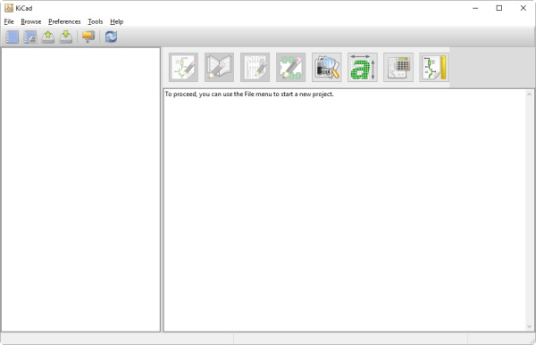

*画像をクリックすると拡大表示できる*

KiCadのプロジェクトウィンドウは、かなり空っぽで寂しく見える。
さっそくサンプルを開いてみよう。

### プロジェクトのセットアップ

もともと[SparkX](https://www.sparkfun.com/sparkx)で設計された[ZOPT2201 UVセンサー](https://www.sparkfun.com/products/14264)は、優れたI2C UVインデックスセンサーであり、このチュートリアルの出発点として使う。
KiCad用の[ZOPT220x UV Sensor Breakout](https://cdn.sparkfun.com/assets/learn_tutorials/6/6/0/ZOPT220x_UV_Sensor_Breakout-Tutorial.zip)の設計データをダウンロードし、4つのファイルをローカルディレクトリに解凍する。

> **注意：** 筆者は`...\Dropbox/Projects`フォルダを中心に作業しているため、画像の多くにこのファイル構造が写っている。この構成のおかげで、ノートパソコンと仕事用パソコンの間を面倒なく同期できる。

4つのファイルがローカルディレクトリに置かれたら（*ダウンロードフォルダの`...\ZOPT220x_UV_Sensor_Breakout-Tutorial`を探してみてほしい*）、**File → Open Project**をクリックし、*ZOPT220x UV Sensor Breakout.pro*ファイルを開く。

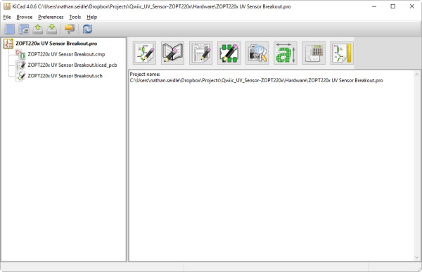

*画像をクリックすると拡大表示できる*

これらのファイルはいったい何だろうか。

- ***.pro** — ファイル構造を管理するメインのプロジェクトファイル。
- ***.cmp** — どのフットプリントがどの回路図コンポーネントと対応するかを定義する。
- ***.kicad_pcb** — PCBレイアウト。
- ***.sch** — 回路図。

この4つのファイルさえあれば、共同作業者とKiCadの設計データを共有できる。
フットプリントファイルの共有も必要になることがあるが、これについてはこのチュートリアルの後半で説明する。

ここで最初の「本当にこれでいいのか」という疑いの目を向けたくなったかもしれない。
なぜ、どのフットプリントがどの回路図コンポーネントと対応するかを定義する専用のファイルがあるのだろうか。
これはKiCadの根本的な仕組みであり、EAGLEの動作とはまったく異なる。
悪いことではなく、単に違うだけである。

## 回路図コンポーネントライブラリのセットアップ

回路図ファイルを、KiCadのEeschema回路図エディタでダブルクリックする。
おそらくエラーが出るはずである。

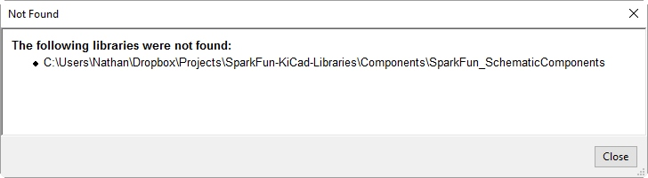

今は無視してよい。**Close**をクリックする。

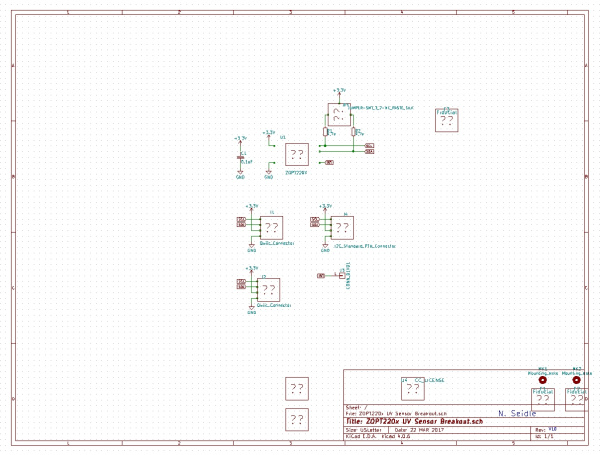

回路図が読み込まれると、数多くのコンポーネントにクエスチョンマーク（**??**）が表示される。
KiCadは、この回路図内のデバイスへのリンクを見失っている。
これをリンクさせよう。

### Eeschemaでコンポーネントライブラリをリンクする

EeSchemaの中で、**Preferences → Component Libraries**をクリックする。
新しいウィンドウが開く。
下の画像を見ると、プロジェクトファイルには「*コンポーネントライブラリファイル*」をどこで探すべきかという情報が含まれていることがわかる。
プロジェクトごとに、異なるファイル構造への接続情報を個別に持っている。
このプロジェクトに、この回路図で使うシンボルの場所を教える必要がある。

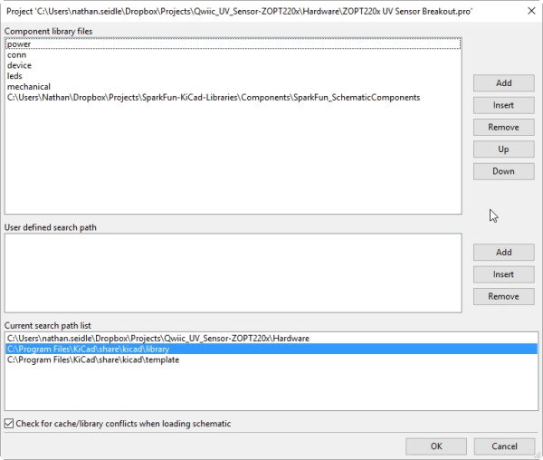

*[SparkFun_SchematicComponents.lib](https://cdn.sparkfun.com/assets/learn_tutorials/6/6/0/SparkFun_SchematicComponents.lib)ファイルが必要になる。ダウンロードしてローカルディレクトリに保存する。*

KiCadのウィンドウで、上部の**Add**ボタンをクリックする。
自分だけの回路図シンボルを作る方法については、この後すぐに説明する。

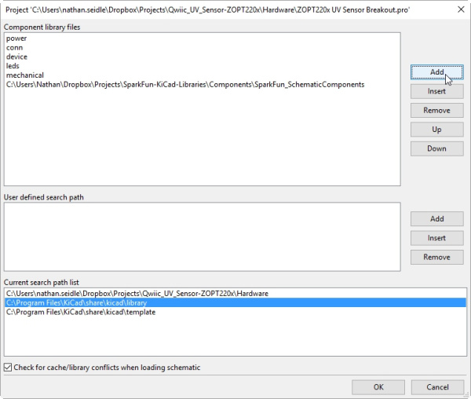

*SparkFun_SchematicComponents.lib*ファイルを保存したディレクトリに移動し、**Open**をクリックする。
このファイルには、すべての回路図コンポーネントが含まれている。

SparkFunの回路図コンポーネントライブラリファイルを追加すると、リストに追加されているのが確認できるはずである。

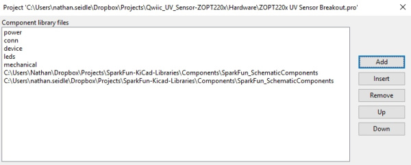

注意深い人は、ウィンドウ内のディレクトリ構造がわずかに異なることに気づくかもしれない。

> `C:\Users\Nathan...`

と

> `C:\Users\nathan.seidle...`

これは、筆者の自宅のPCと仕事用のPCの違いである。
この回路図を開く際に将来のエラーを避けるため、有効なライブラリファイルの一覧からこのエントリを削除しておこう。
リストから`C:\Users\Nathan...`のエントリをハイライトし、**Remove**ボタンをクリックする。

**OK**をクリックし、*Component Libraries*マネージャーを閉じる。
これで、回路図を一度閉じて再度開き、更新する。

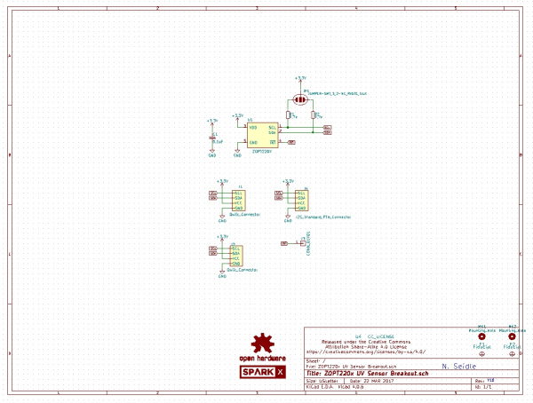

おめでとう。**??**のボックスがなくなった。
複数のコンピュータをまたいで回路図コンポーネントライブラリを使う方法について詳しくは、次の「ユーザー定義の検索パス」の節を確認してほしい。
そうでなければ、いよいよ回路図の編集に進もう。

### ユーザー定義の検索パス：複数のコンピュータでコンポーネントライブラリを使う

回路図コンポーネントライブラリは、KiCadのComponent Library Managerを使って割り当てられる。
筆者のように、複数のコンピュータで回路図ライブラリを共有している場合は、「*ユーザー定義の検索パス*」を追加しておくと便利である。

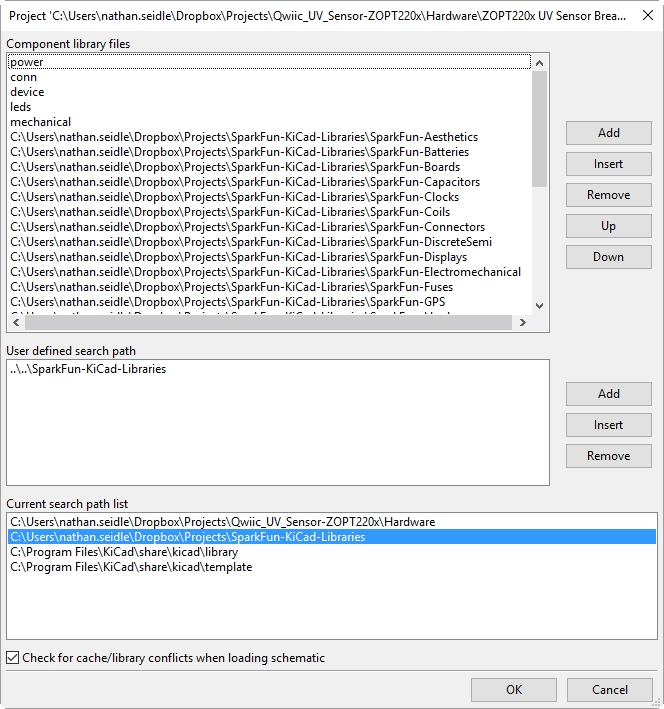

画像では、筆者は「**..\..\SparkFun-KiCad-Libraries**」を定義している。
これは、Dropboxフォルダへのローカルな相対パスである。
これらのコンポーネントライブラリのパスは、このプロジェクトと*.pro*ファイルに固有のものである。
このプロジェクトをノートパソコンで開くと、まず「`C:\Users\nathan.seidle...`」の場所を探しに行く。
それが失敗すると、続けて「`..\SparkFun-KiCad-Libraries`」という相対パスを探し、そこでファイルを見つける。
これにより、コンピュータやGitHubリポジトリをまたいでライブラリを共有でき、別のコンピュータでプロジェクトを開くたびにライブラリを再割り当てする必要がなくなる。

とりあえず今はこのままチュートリアルを進めてよい。
複数のコンピュータでKiCadを使うようになったら、後で見直すとよいだろう。

## 回路図の編集

他に何も伝えられなかったとしても、キーボードショートカットだけは覚えてほしい。
もちろん対応するボタンをクリックしてもよいが、KiCadの速さと効率のよさは、体が動きを覚えたときに真価を発揮する。ぜひ覚え始めてほしい。
このチュートリアルで頻繁に使う、KiCadのEeschemaのキーボードショートカットを紹介する。

- **a** — コンポーネントを追加する。
- **c** — カーソルが別のコンポーネントの上にあるとき、そのコンポーネントをコピーする。
- **w** — コンポーネント同士を配線する。
- **v** — コンポーネントの値を編集する。
- **Esc** — 進行中のモードやコマンドを中断し、通常のポインタモードに戻る。
- **ctrl+z** — 元に戻す。ミスをしたら遠慮なく使う。
- **ctrl+s** — 保存する。こまめに保存すること。

> **注意：** すべてのホットキーの一覧を見る、あるいは編集するには、**Preferences → Hotkeys**に進む。

このブレイクアウトボードには、（筆者がそう決めたので）より大きな4.7uFのデカップリングコンデンサが必要である。追加してみよう。

### 回路図にコンポーネントを追加する

**a**キーを押し、回路図にデバイスを追加する。
これによりコンポーネントウィンドウが開く（別のツールを使っている場合、回路図の方もクリックする必要があるかもしれない）。

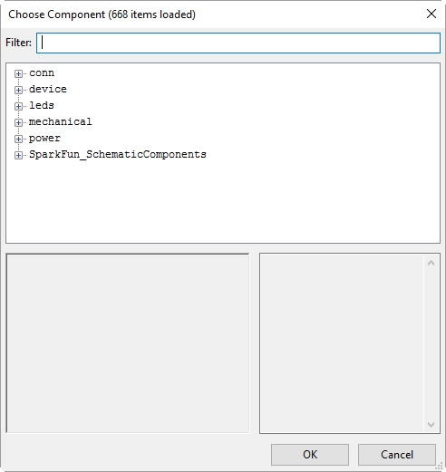

数百種類のコンポーネントがある（タイトルバーによれば668項目）。
自由に探し回ってもよいが、必要なものを素早く見つけるには、**Filter:**のフィールドに「cap」と入力する。
**device**ライブラリから、*C_Small*というラベルのデバイスを選択する。
続けてEnterキーを押すか、**OK**をクリックする。

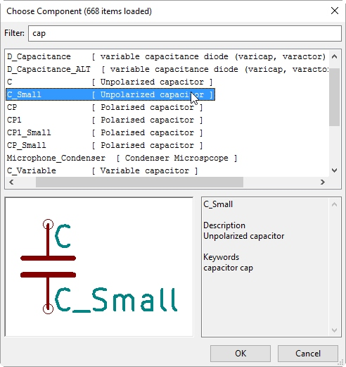

0.1uFのコンデンサの隣に、回路図上に配置する。

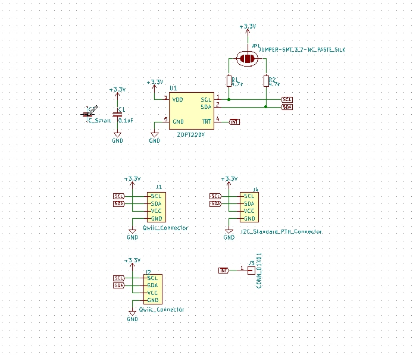

コンデンサを配置した後も、配置モードのままであることに気づくはずである。
キーボードの**Esc**キーを押し、通常のポインタモードに戻る。
筆者は、確実にデフォルトの状態に戻すため、Escapeを2回押すことがよくある。

### コンポーネントをコピーする

デフォルトの状態になったら、マウスポインタを0.1uFのコンデンサの3.3Vマーカーの上に置く。
**c**キーを押してそのデバイスをコピーし、新しいコンデンサの上に配置する。

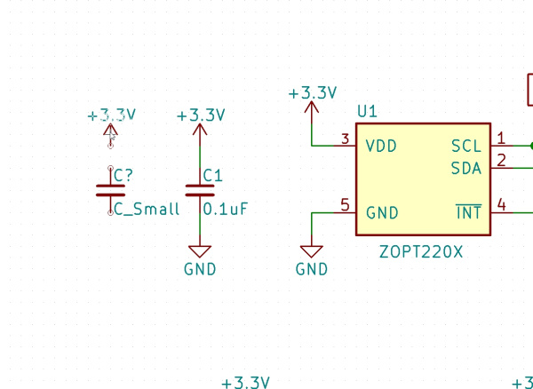

グラウンドマーカーについても同じ手順を行う。
**ctrl+s**キーを押して作業を保存する。

### コンポーネントを配線する

これらを配線でつなごう。
予想どおり**w**キーを押すが、一つ注意点がある。**w**を押す前に、マウスポインタをどちらかのバブルの上に置いておく必要がある。

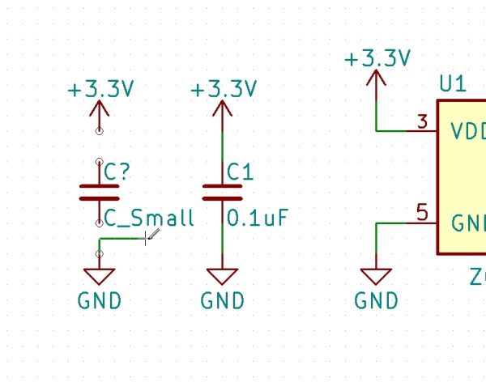

マウスをもう一方のバブルに移動し、左クリックしてGNDの配線を完了させる。
もし失敗したら、**Esc**を1〜2回押してデフォルトの状態に戻せることを覚えておいてほしい。
続いて、接続したいバブルにマウスポインタを移動し、**w**を押して3.3Vの配線を始める。
ショートカットの**w**はwire（配線）の頭文字である。

何かうまくいかないことがあれば、遠慮なく**ctrl+z**でミスを元に戻してほしい。

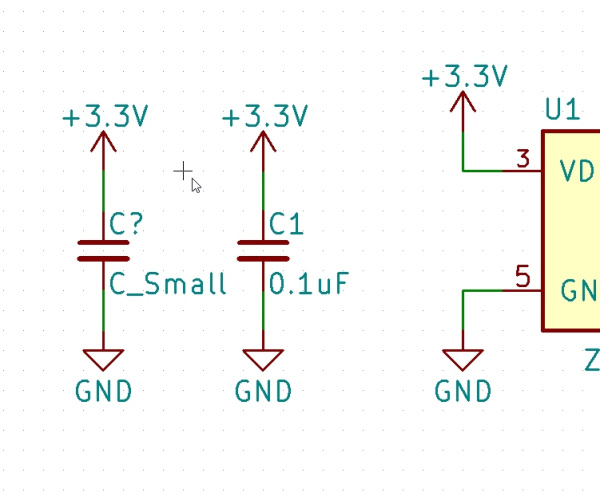

これで、電源とグラウンドがコンデンサに接続された。

### コンポーネントの値を変更する

値を*C_Small*から4.7uFに変更しよう。
マウスポインタを*C_Small*の上に置き、**v**キー（valueの変更）を押す。
**Text**フィールドの*C_Small*を*4.7uF*と入力して変更する。
続けてEnterキーを押すか、**OK**をクリックする。

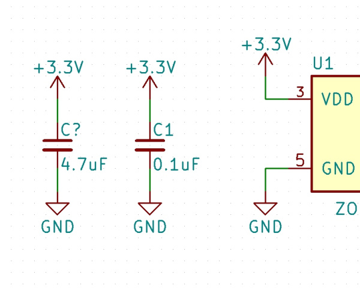

おめでとう。これで最初の回路図コンポーネントの配線が完了した。
**ctrl+s**を押して作業を保存する。

### 回路図コンポーネントに注釈を付ける

しかし、**C?**という記号はどうなるのだろうか。心配は要らない。
KiCadの数多くの利点の一つが、回路図を自動的に注釈付けできる機能である。

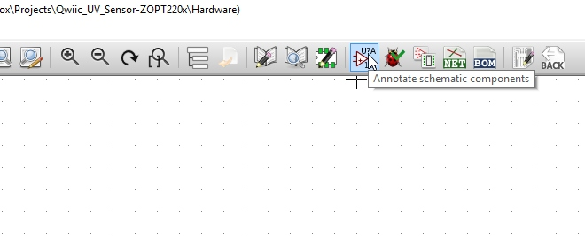

*Annotate schematic components*ボタンをクリックする。

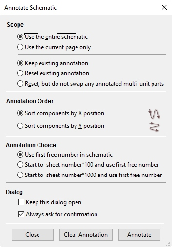

デフォルトの設定のまま、Annotateボタンをクリックして確定する。

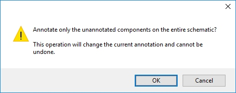

*注釈付けを確認するKiCad*

KiCadから確認を求められるので、そのままEnterキーを押すか、もう一度**OK**をクリックする。

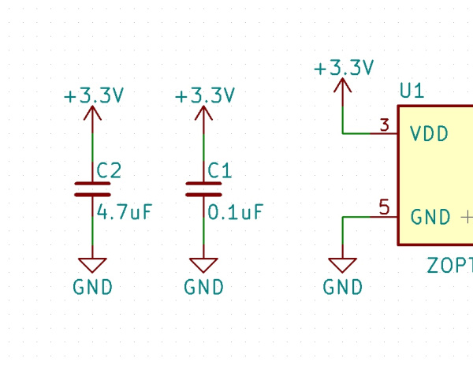

正しい値と識別子を持つコンデンサができた。これで準備は完了である。いよいよPCBを編集する番だ。

## PCBレイアウトの編集

PCBの編集を始める前に、このチュートリアルで頻繁に使う、KiCadのPcbnewのキーボードショートカットを紹介する。

- **+** — 次のレイヤーに切り替える。
- **-** — 前のレイヤーに切り替える。
- **m** — アイテムを移動する。
- **b** — グラウンドのポリゴンポアを更新する。
- **Delete** — トレースやコンポーネントを削除する。
- **x** — 新しいトラックを配線する。
- **v** — スルーホールビアを追加する。
- **n** — 次のグリッドサイズに切り替える。慎重に使うこと。50milか25mil以外のグリッドを使うと、後で痛い目にあう。
- **Page Up** — 最上位の銅箔レイヤーに戻る。
- **Esc** — 進行中のモードやコマンドを中断し、通常のポインタモードに戻る。
- **ctrl+z** — 元に戻す。ミスをしたら遠慮なく使う。
- **ctrl+s** — 保存する。こまめに保存すること。

> **注意：** すべてのホットキーの一覧を見る、あるいは編集するには、**Preferences → Hotkeys**に進む。

### ネットリストを生成する

回路図はできたので、新しい4.7uFのコンデンサをボードに配置しよう。
回路図から**Generate netlist**ボタンをクリックする。

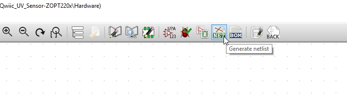

次のようなウィンドウが表示される。

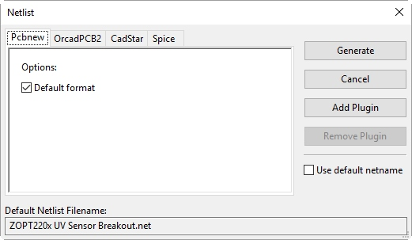

KiCadは*強力*である。そしてその強力さゆえに、膨大な数のオプションが用意されている。
幸い、今回はまだ表面をなぞっているだけなので、これらのオプションをいじる必要はない。
そのままEnterキーを押すか、**Generate**をクリックしてこの画面を確定する。
KiCadは、ネットリストを**.net**ファイルとしてどこに保存するか尋ねてくる。デフォルトの場所はプロジェクトフォルダである。
ここでも、Enterキーを押すか、**Save**をクリックして確定する。

### レイヤーの色を設定する

メインのプロジェクトウィンドウに戻り、**.kicad_pcb**ファイルをダブルクリックする。

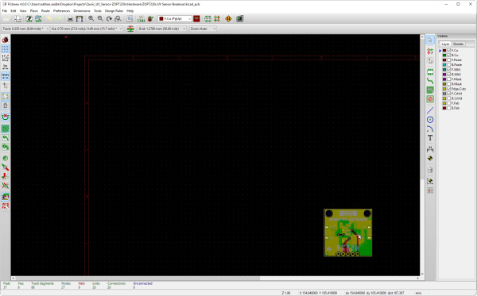

PCB編集の世界へようこそ。
EAGLEとKiCadの違いの中でも、PCBレイアウト内の見た目には筆者も最も戸惑わされた。
*View*メニューには、他に3種類の表示、*Default*、*OpenGL*、*Cairo*がある。
筆者は*OpenGL*を好んで使っている。
とりあえず*Switch Canvas to OpenGL*に切り替えておこう。

マウスホイールは期待どおりに動作する。拡大縮小はホイール、クリックでパンできる。

**このレイヤーの色は好きじゃない！** そう、筆者も同感である。
レイヤーの色を変更するには、右側のメニューでB.Cu（下面銅箔レイヤー）の隣にある緑色の四角をマウスホイールでクリックする。
筆者は次のレイヤーの色を好んで使っている。

- **F.Cu**（上面銅箔）：**Red 2（デフォルト）**
- **B.Cu**（下面銅箔）：**Blue 4**
- **F.SilkS**（表面シルクスクリーン）：**White**
- **B.SilkS**（裏面シルクスクリーン）：**Yellow 3**
- **Edge.Cuts**（EAGLEでいうボードの輪郭や寸法レイヤーに相当）：**Gray 3**
- **F.CrtYd**（そのコンポーネントが上面で必要とするボード上の総スペースを示す）：**Gray 2（デフォルト）**

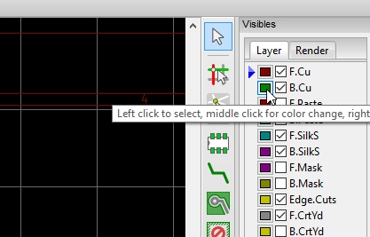

**+**と**-**を押すと、上面と下面の銅箔レイヤーを切り替えられる。
特定のレイヤーを確認したいときに便利である。

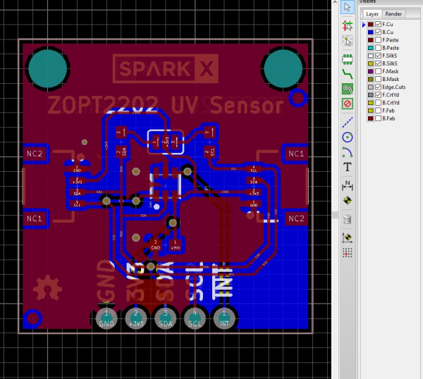

見た目だけの話ではあるが、こうしたレイヤーの色分けのおかげで、何が起きているかを把握しやすくなる。

（Layerタブの隣にある）*Render*タブ、特に*Values*と*References*のチェックボックスもぜひ確認してほしい。

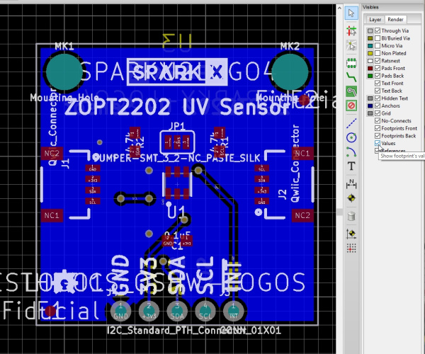

筆者は、*Values*と*References*をオンにするとかなり気が散ってしまうため、常にオフにしている。
多くの設計者はこれらの値を頼りに作業しているので、必要に応じて使ってほしい。

### フットプリントを追加する

**ボードに4.7uFのコンデンサを追加するはずでは？ どこにあるのだろうか？** 残念ながら、どこにもない。

何が起きているのだろうか。
回路図に追加したコンデンサに、フットプリントを割り当て忘れているのである。
KiCadは、EAGLEのような形で回路図コンポーネントとフットプリントをリンクしないことを思い出してほしい。
追加した回路図コンポーネントそれぞれに、フットプリントを個別に接続する必要がある。

回路図に戻り、**Run CvPcb**ボタンをクリックして、コンポーネントとフットプリントを関連付ける。

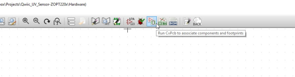

CvPcbを初めて実行する場合、次のような警告が出る。

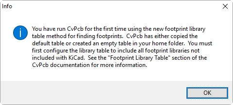

そのままクリックして進めばよい。

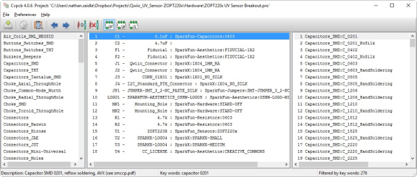

インストールされているライブラリの数によっては、これに最大30秒程度かかることがある。
このチュートリアルの後半でこれを速くする方法を紹介するが、今のところは辛抱してほしい。

左側の列には、KiCadに同梱されているすべてのフットプリントライブラリが表示される。
中央には、自分の回路図に含まれるコンポーネントの一覧が表示される。
右側には、中央でハイライトされたコンポーネントに合いそうなフットプリントが表示される。
中央のコンポーネントに対応する、右側のフットプリントをダブルクリックするのが作業の内容である。

作業を楽にするため、**View selected footprint**ボタンをクリックする。

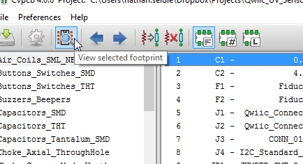

これで、右側のリストをクリックしながらフットプリントをプレビューできるようになる。

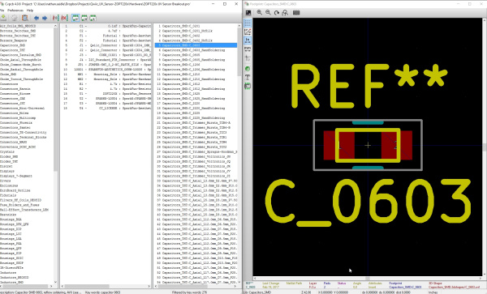

Windowsでは、Windowsキーを押したまま左矢印キーを押して離すと、CvPcbウィンドウを画面の片側に固定できる。
続けて、Footprint Previewウィンドウを選択し、右側に固定する。
これにより、左側のウィンドウでフットプリントを切り替えながら、右側でプレビューを確認できる。

中央の列で**C2**をハイライトする。
続いて、右側の列にある**Capacitors_SMD:C_0603**をダブルクリックする。
これでC2にフットプリントが割り当てられるはずである。

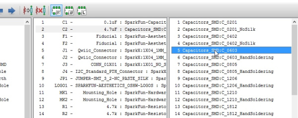

### ネットリストを再生成する

CvPcbウィンドウを閉じ、**Save and Exit**をクリックする。
ネットリストを再度エクスポートする必要がある。方法を覚えているだろうか。
もう一度**Generate netlist**ボタンをクリックし、Enterを2回押す。
回路図またはプロジェクトウィンドウのどちらからでもよいので、PCBエディタを開く。

**あれ、まだ表示されていない！** データを変更したので、ネットリストをインポートし直す必要がある。方法を覚えているだろうか。
**Read netlist**ボタンをクリックすると、次のようなウィンドウが表示されるはずである。

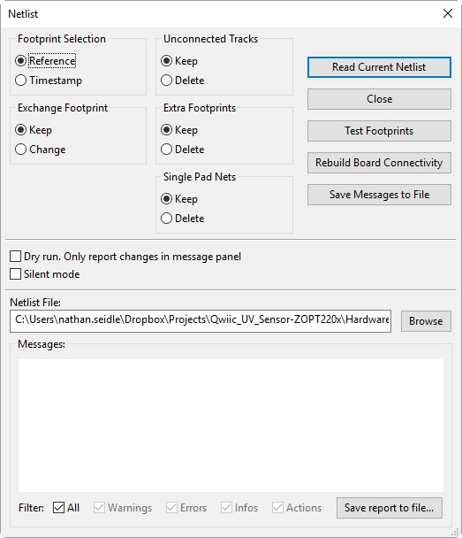

**Read Current Netlist**をクリックし、確認のため**YES**をクリックする。
Enterを2回押してもよい。
これで、ボードの近くに新しいコンデンサが表示されるはずである。

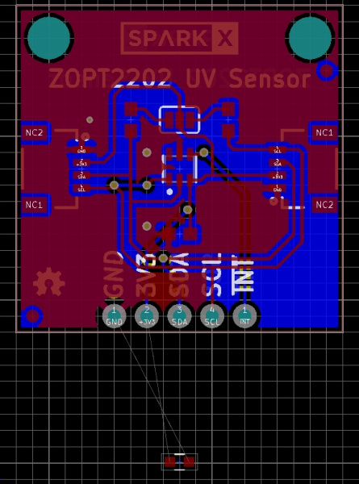

これはデカップリングコンデンサなので、すでに配置されている0.1uFのコンデンサの隣に置こう。
まず、新しいコンデンサにマウスポインタを合わせ、**m**（移動）を押す。

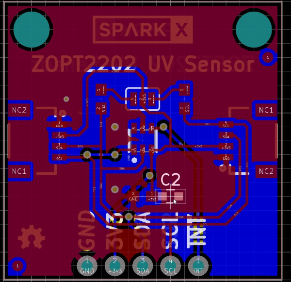

左クリックしてコンデンサを配置する。
続いて、邪魔になっている0.1uFのコンデンサの上で**m**を押し、左に移動する。

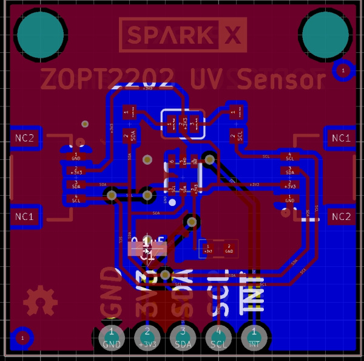

**b**を押し、GNDのポリゴンポアを更新する。

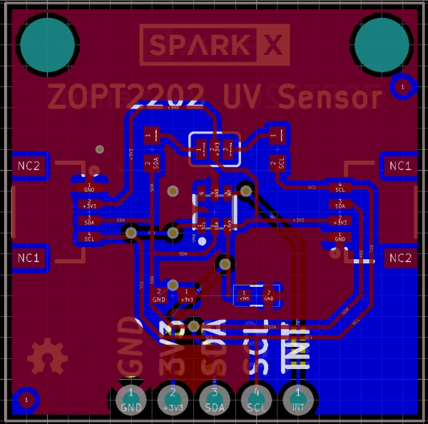

いくつかトレースを修正する必要があるが、それほど大変ではない。
削除したいトレースの断片にマウスポインタを合わせ、**Delete**を押す。
コンデンサの+3v3端子の下にあるトレースとビアを削除しよう。
ポインタが複数のアイテムの上にある場合（下の画像のように、カーソルがトレースとコンデンサの両方の上にある場合）、KiCadはメニューをポップアップ表示し、どちらを選ぶか尋ねてくる。
これは基本的に、どちらを操作したいのかを選ぶよう求めているものである。

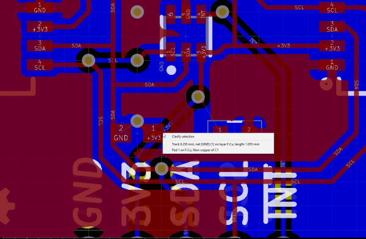

何か問題が起きたら、**Esc**を押して通常のポインタモードに戻る。
何か間違って削除してしまった場合は**ctrl+z**を押す。

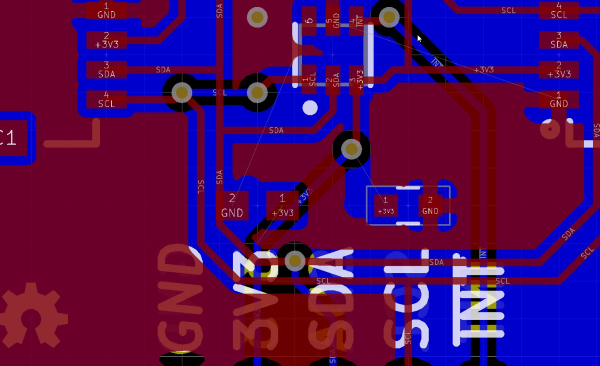

問題のあるトレースの大半を取り除いたら、**x**を押して配線を始められる。

> **なぜ追加した0603フットプリントは、ボード上のものと一致しないのか？** SparkFunは、長年にわたり自社の製造工程に合わせてPCBフットプリントを微調整してきた。これには、ピック＆プレースや自動光学検査も含まれる。特に不思議なことではなく、私たちの環境ではやや大きめの0603フットプリントが最もうまく機能することがわかっている。KiCad付属のフットプリントと、自社で用意したフットプリントの両方を組み合わせて使っている。このチュートリアルの目的においては、気にする必要はない。このフットプリントで問題なく動作する。

灰色のエアワイヤーがあるパッドをシングルクリックし、接続先のパッドまでドラッグする。
もう一度シングルクリックして、その位置に配線を固定する。
**b**を押してポリゴンを更新する。

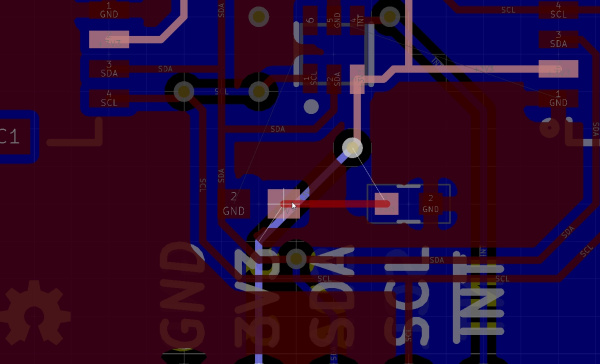

下の画像では、KiCadがこのトレースを妙な形で配線しようとしている。
ここにトレースを置くと鋭角ができてしまい、一般によくない（「アシッドトラップ」について調べてみてほしい）。
このトレースはT字の交点にしたい。グリッドを変更する必要がある。

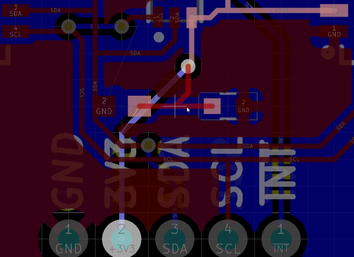

*これは煩わしい！*

**n**を押し、次のグリッドサイズに切り替える。
筆者の場合、この見栄えのよい交点を得るには**n**を1回押して*0.25mil*グリッドに切り替えるだけで済んだが、もっと細かいグリッドが必要になることもある。
これはメニューの「*Grid: 0.0635mm (2.5mils)*」からも確認できる。

> **強く推奨する。** **50mil**か**25mil**以外のグリッドは使わないでほしい。そうしないと、後で痛い目にあう。すべてのコンポーネント、ビア、トレース、ボードの輪郭は、**必ず**50milか25milのグリッドに乗せなければならない（シルクスクリーンは話が別である）。

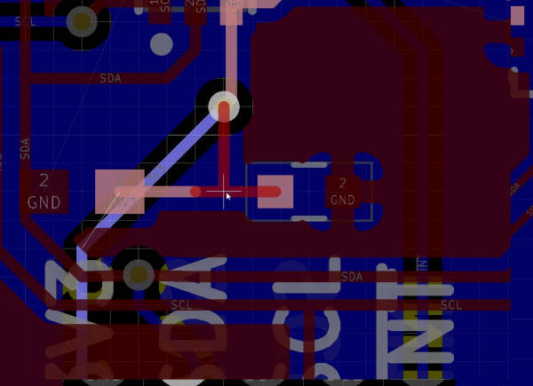

*きれいなT字の交点！*

下の画像では、GNDのエアワイヤーを配線している。
ポリゴンポアが2つのパッドをつなげてくれるため、これは本来必要ないが、KiCadの「磁力」による配線支援がどれだけ優れているかがよくわかる。
パッドからパッドへ、非常にすばやく簡単に移動できる。

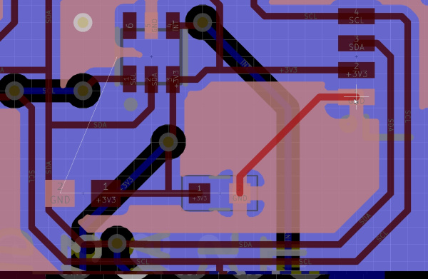

残るエアワイヤーは2本である。
これらをつなぐには、下面レイヤーへのビアを配置する必要がある。
まず**x**を押し、コンデンサのGND用エアワイヤーの起点を再度クリックする。

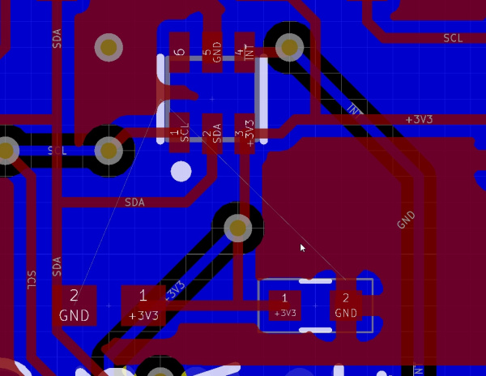

トレースを引き出す。

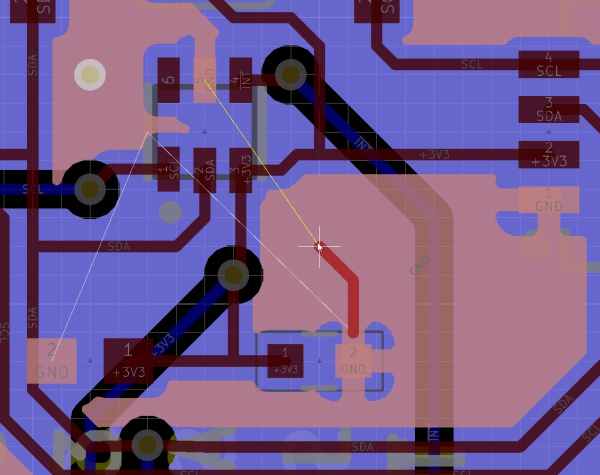

開けたグラウンドに到達したら、**v**を押してビアを作成する。
シングルクリックしてビアを配置すると、KiCadは自動的に下面レイヤーでの配線を開始する。
**Esc**を押してトレースの配置を止める。あとはポリゴンポアが処理してくれる。
**Page Up**を押すと、最上位レイヤーに戻る。

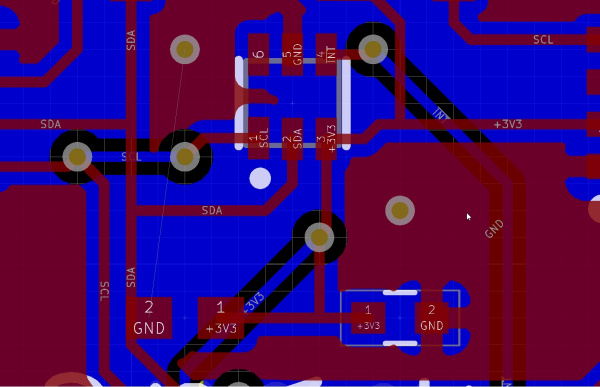

*エアワイヤーが残り1本！*

最後のエアワイヤーを処理するため、0.1uFコンデンサのGNDパッドをクリックしてみようとしても、なぜかKiCadは配線を始めてくれない。なぜだろうか。
実はこれはよいことである。SDAのトレースが、0.1uFコンデンサのGNDパッドに近すぎる（実際には重なっている）のである。
配線を始めさせないことで、KiCadは、ここにトレースを置くとDRCルールに違反すると教えてくれているのである。
どうすればよいだろうか。SCLとSDAのラインを一度引き剥がしてスペースを作る。

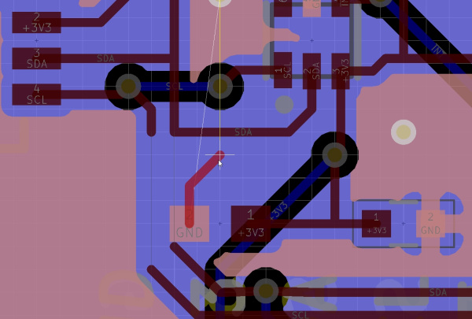

なるほど、これでずっとよくなった。
**x**を押し、コンデンサのGND端子をクリックしてトレースを引き出し、**v**を押してこのあたりにビアを落とす。
Escapeを押して配線を止める（あとはポリゴンに任せる）。
最後に**Page Up**を押して最上位レイヤーの表示に戻る。

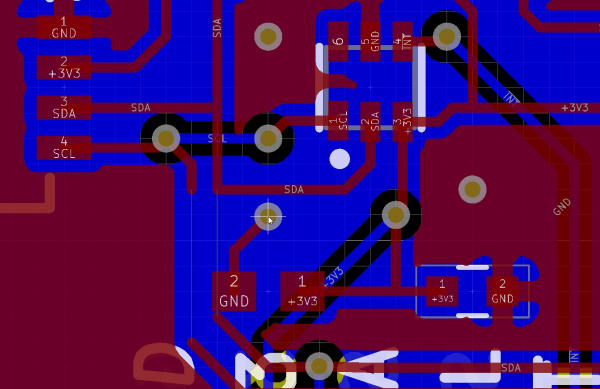

**Delete**と**x**ボタンを使ってSDAとSCLのラインを配線し直し、このボードを仕上げる。
続いて**b**を押してポリゴンを更新する。
ボードは下の画像のような見た目になるはずである。

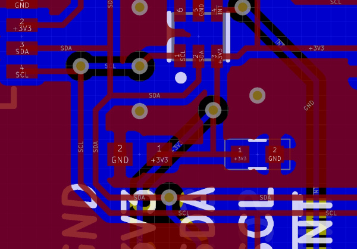

*エアワイヤーなしで配線完了！*

おめでとう。フットプリントの配線が完了した。
それでは、法律違反（DRCエラー）がないかDRCを実行してみよう。

### コンポーネントのフットプリントをPCBレイアウトから削除する方法

続ける前に、PCBレイアウトからコンポーネントを変更・削除する手順を確認しておこう。
たとえば、設計から余分なコンデンサや抵抗を取り除きたいとする。
その場合、通常は次の手順を行う。

1. 回路図からデバイスを削除する。
2. Generate netlistボタンをクリックし、ネットリストをエクスポートする。
3. Read netlistボタンをクリックし、PCBレイアウトにネットリストをインポートする。

違うのは、いくつかのインポート設定だけである。

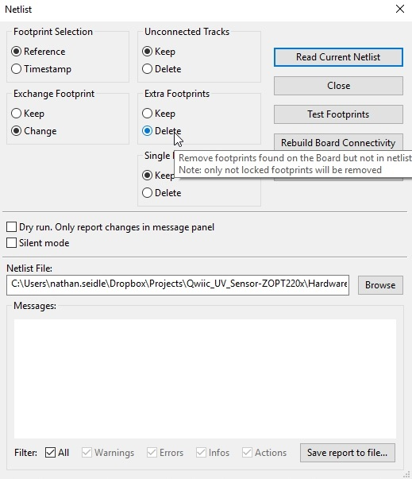

ネットリストのインポート時、デフォルト設定では、交換用フットプリントは**Keep**、余分なフットプリントも**Keep**になっている。

ここでは、2つの設定を変更する必要がある。

- **Exchange Footprint → Change**：フットプリントの変更を許可する
- **Extra Footprints → Delete**：残っている余分なフットプリントを削除する

削除したコンポーネントから残った未接続のトラックを片付けるため、**Delete**で未接続のトラックも削除しておくとよいだろう。

## デザインルールチェックの実行

緑のチェックマークが付いたテントウムシのアイコンをクリックし、Design Rule Check（DRC）ウィンドウを開く。

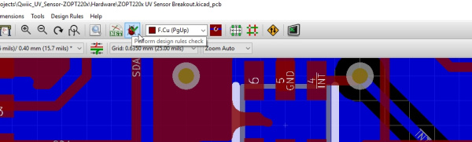

> **注意：** すべてのDRC設定はミリメートル単位である。インチ単位で見たい場合は、このウィンドウを閉じ、PCBレイアウトウィンドウの左側のツールメニューにある**in**ボタンをクリックする。これですべての単位がインチに変わる。DRCウィンドウを再度開けば、ヤード・ポンド法の単位で設定を変更できる。

トレース幅、トレース間隔、ビアについて少し話しておこう。
一般に、SparkFunは次の仕様でボードを設計している。

- 10milのトレース幅
- 10milのトレース間隔
- 20milのビア

多くの設計ではこれよりも小さくすることもあるが、初めてPCBを設計するのであれば、4milのトレースと8milのビアで設計しては*いけない*。
最初のボードで、そこまで小さくする*必要*はないはずである。

### 同じ価格でファブハウスが8mil以下に対応しているのに、なぜ10milのトレース・間隔で設計するのか

PCBの製造は繊細な作業であり、許容誤差を一段階削るごとに、（試作かどうかにかかわらず）そのPCBがエラーとともに製造されてしまう可能性が高まる。
そして、そうしたエラーは見つけにくいことがある。
私たちが10milのトレース・間隔で設計しているのは、生産現場でエラーのあるPCBに遭遇する確率を抑えるためである。
不具合のある製品のトラブルシューティングをしていて、「本に書いてあるリワークとはんだ付けの技はすべて試した。まさかPCB自体が不良なのだろうか」と自問するほど嫌なことはない。

とはいえ、多くのPCBファブハウスが、7milのトレース・間隔と12milのビアを低価格で提供するようになってきている。
配置に厳しい制約のある複雑なボードを扱っているなら、より小さいトレース・間隔とビアを使う方がよい。
レイアウトの時間を節約し、ボードを正しく製造する部分はPCBファブハウスに任せてしまおう。

一般に、次のKiCadのデフォルト値を使っている。

- **Clearance：** By Netclass
- **Min Track Width：** 0.2mm = 7.9mil
- **Min Via Size：** 0.4mm = 15.7mil

もう一度Enterを押し、デフォルト設定でDRCを実行する。

#### ErrType()：Via near track

**しまった！ ボードの何が問題なのだろう？** 赤い矢印で示されたビアが、近くのトレースに近すぎる。
エラーメッセージには「**Via near track**」というエラーが表示される。
ビアの近くにあるトレースを一度引き剥がし（**Delete**を押す）、配線し直す（**x**を押す）ことで修正できる。

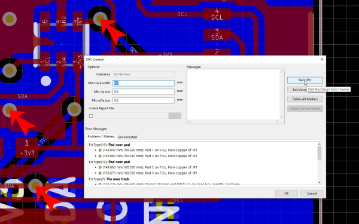

問題を起こしていたトレースを調整したら、DRCを再度実行する。
先ほどの3つのフラグが消えているはずである。

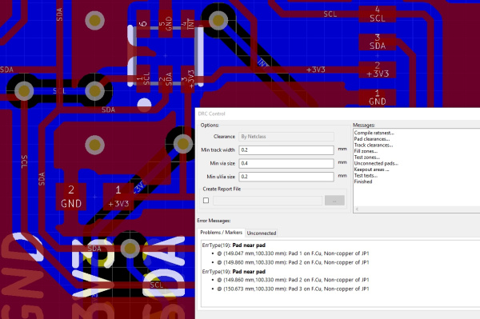

*DRCマーカーがクリアされた*

おめでとう。「Via near track」の問題を修正できた。

#### ErrType()：Pad near pad

しかし、まだ終わりではない。
「**Pad near pad**」というエラーを示すDRCエラーの矢印がまだ2つ残っている。
KiCadは、このソルダージャンパーのパッド同士が近すぎることを伝えようとしている。
SparkFunはこのフットプリントを長年使っており、この設計に問題がないことを把握しているので、Netclassのクリアランス制約の方を変更しよう。

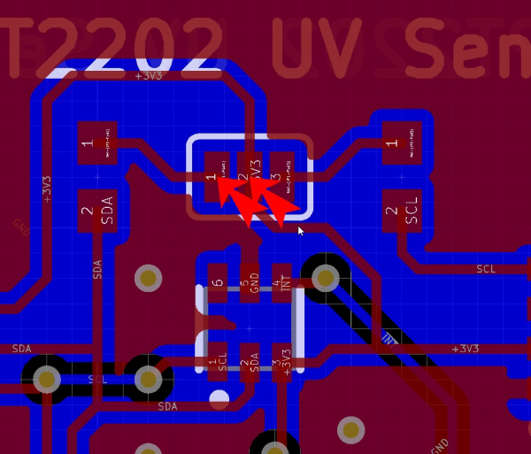

Design Rulesメニューから、DRCのルールを開く。

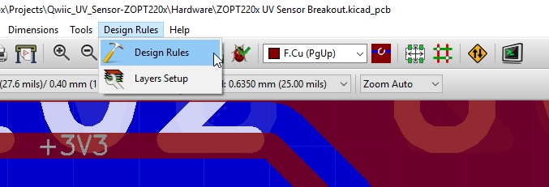

ここで、特定のトレースやトレースのクラスごとに固有のルールを作成できる。
ここで起きている問題は、**Default**の**Clearance**が7.9mil（0.2mm）になっていることである。
これを7mil（0.1778mm）に減らし、**OK**をクリックしてDRCを再実行すると……

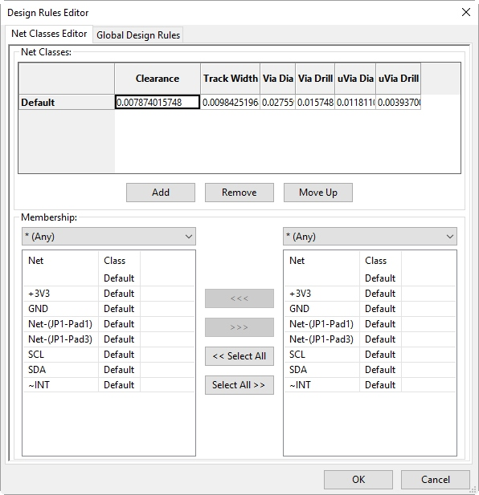

DRCエラーが解消された。
とはいえ、ボードをDRCに通すためにDRCのクリアランスを小さくするのは、理想的な解決策とは言えない。
このソルダージャンパーのパッドは、はんだで簡単にジャンパーできるよう近い距離を保っておきたいため、フットプリント上のパッド間の距離を広げるのは逆効果になる。
一般に、DRCのルールはあらかじめ決めておき、それを守り続けるべきである。

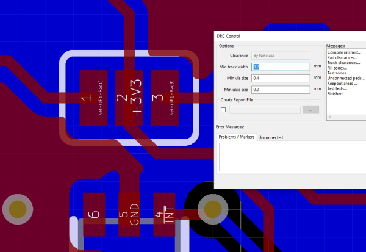

### エアワイヤーに気を付ける

DRCについて最後にもう一つ。
PCBにエアワイヤーを残したままにしておくと、ほぼ確実に使い物にならないPCB（いわゆる「コースター」）ができあがる。

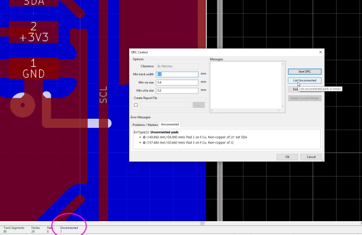

DRCウィンドウには**List Unconnected**ボタンがある。
これをクリックすると、未接続のトレースの位置がすべて表示される（このエラーを表示するため、あえてPCB右下のSDAトレースを引き剥がした）。
PCBを発注する前に、エアワイヤーがないか確認することは非常に重要である。
レイアウトを進める中では、画面下部の（ピンク色で囲んだ）「*Unconnected*」の数に注目することを推奨する。
配線が終わったつもりでも、見つけられない未接続のワイヤーがいくつか残っている場合、DRCウィンドウがその場所を見つける手助けをしてくれる。

**ctrl+s**を押して作業を保存する。

よくできた。これでデザインルールチェックを乗り越えた。いよいよボードを発注する番である。

## ガーバーファイルのエクスポート

回路図にコンポーネントを追加し、PCBレイアウトを修正し、エラーを確認した。
これで自信を持ってボードを製造してもらう準備が整った。ガーバーファイルをエクスポートしよう。

### ドリルファイルとガーバーファイルを生成する

ガーバーファイルは、PCB製造会社がボードを組み立てる際に使う「アートワーク」、つまり各レイヤーのデータである。
[PCBの各レイヤー](./pcb-basics.md)については優れたチュートリアルがあるので、この内容が初めての場合はぜひ読んでおいてほしい。

上部バーのプリンタアイコンの隣にある**Plot**ボタンをクリックし、*Plot*ウィンドウを開く。

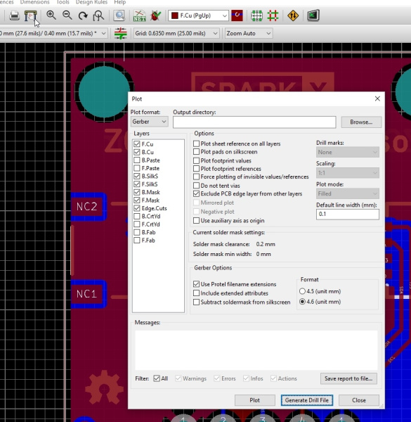

一般に、PCBを製造してもらうには8種類のレイヤーが必要になる。

- 上面銅箔（F.Cu）+ ソルダーマスク（F.Mask）+ シルクスクリーン（F.SilkS）
- 下面銅箔（B.Cu）+ ソルダーマスク（B.Mask）+ シルクスクリーン（B.SilkS）
- ボードの輪郭（Edge.Cuts）
- ドリルファイル

Plotウィンドウで、Plot formatを*Gerber*に設定した状態で、次の*Layers*にチェックが入っていることを確認する。

- ☑ F.Cu
- ☑ B.Cu
- ☑ B.SilkS
- ☑ F.SilkS
- ☑ B.Mask
- ☑ F.Mask
- ☑ Edge.Cuts

さらに、**Generate Drill File**ボタンをクリックする。
ここもデフォルトの設定のままでよい。PTHとNPTHのチェックボックスについては後ほど説明する。
今は**Drill File**をクリックするか、Enterを押してドリルファイルを生成するだけでよい。

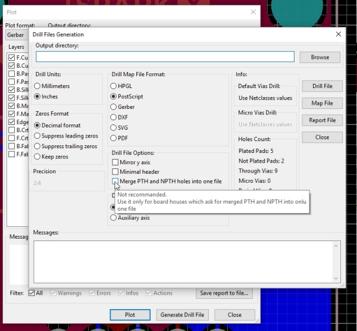

「Drill Files Generation」ウィンドウで**Close**をクリックする。

**Plot**をクリックして各レイヤーのガーバーファイルを生成し、続けて**Close**をクリックする。

### ガーバーファイルを確認する時間

実際のお金を払う前に、エラーを見つけられる最後のチャンスである。
ガーバーの各レイヤーを見直すと、ファブに送る前に潜在的なエラーや問題に気づけることが多い。

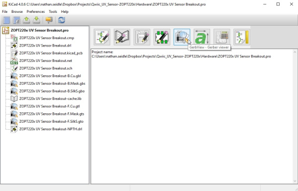

メインのKiCadプロジェクトウィンドウに戻り、ボタンをクリックしてGerbViewを開く。

> **注意：** ガーバービューアーには数多くの選択肢がある。筆者は[Gerbv](http://gerbv.geda-project.org/)を好んで使っているが、KiCad付属のビューアーもよくできているので、ここではそちらを扱う。

KiCadのGerbViewが開いたら、**File → Load Gerber File**をクリックする。
表示されたファイルをすべて選択し、**Open**をクリックする。

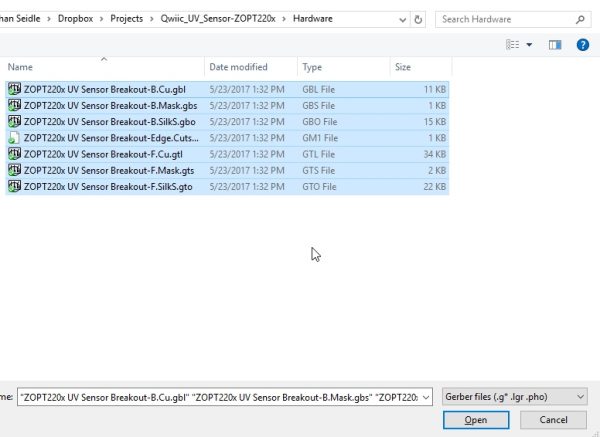

続いて、**File → Load EXCELLON Drill File**をクリックする。
表示されたドリルファイルをすべて選択し、**Open**をクリックしてドリルファイルを読み込む。
同じディレクトリにあるはずである。

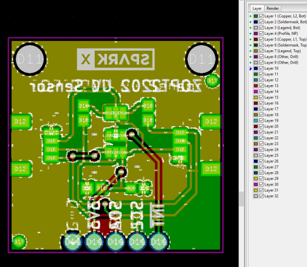

レイアウトはかなり異なる見た目になるが、これは*よいこと*である。
自分のデザインを何時間も見続けていると、脳が問題を見落としやすくなる。
筆者は基本的に、必要のない限りレイヤーの色は変更しない。
ガーバーの確認は、普段のレイアウト作業とは違う、目に刺さるような見た目にしておきたい。その方が問題に気づきやすくなるからである。

この画面から、*Top Copper（layer 5）*以外のすべてのレイヤーをオフにする。
さらにRenderメニューから、*Grid*と*DCodes*をオフにする。
これで確認作業がすっきりする。

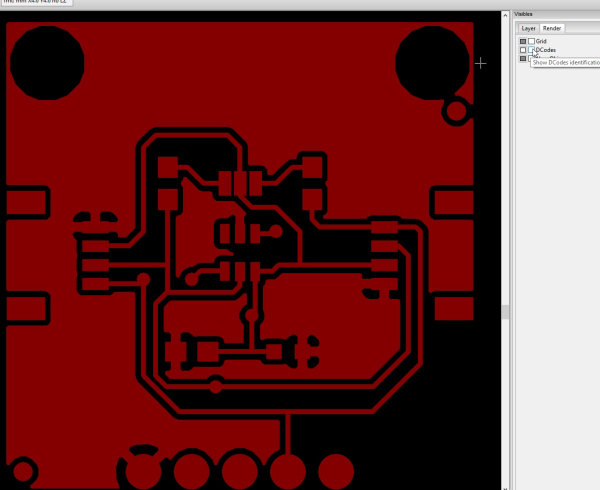

続いて、各レイヤーのオン・オフを切り替えながら順に見ていく。
不規則な部分やおかしく見える箇所を探す。
筆者が確認しているポイントをいくつか紹介する。

- 妙な配線になっていて改善できそうなトレースはないか
- ビアは、あるべき場所で上面銅箔と正しく重なっているか
- 上面のソルダーマスクは、SMD ICのフットプリントと整合しているか
- ビアはソルダーマスクで覆われている（いわゆる「テンティングビア」）か、それとも露出しているか
- 上面のシルクスクリーンは見た目がよいか。意味が通っているか。すべて意図どおりに揃っているか。ピン1の目印は明確か

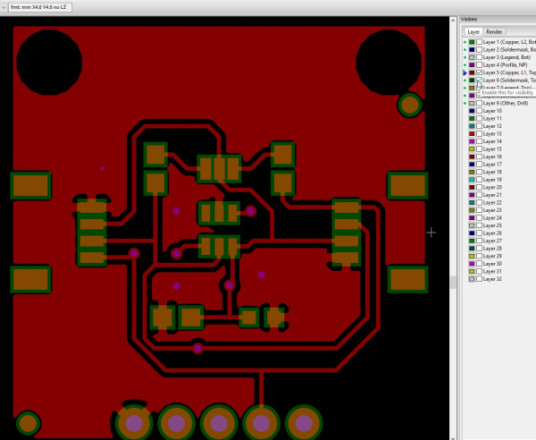

すべてオフにしたら、今度は下面のレイヤーについて同じことを繰り返す。

気づいただろうか。このサンプルには、いくつか問題がある。

1. 下面のシルクスクリーンに、GNDの表示が抜けている。
2. 上面のGNDシルクスクリーンの表示が*イタリック*になっている。
3. なぜかドリルファイルが2つある。

シルクスクリーンの表示が一つ抜けていてもボード自体が壊れるわけではないが、こうした小さな不具合を見つけるのが、まさにガーバーの確認作業の目的である。

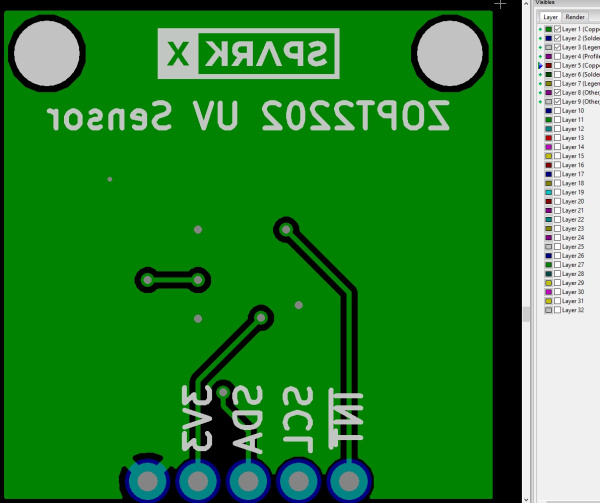

*しまった。下面のGND用シルクスクリーンが抜けている！*

**演習：**
少し時間を取り、PCBレイアウトのウィンドウに戻って次の修正を行ってみてほしい。

- **下面レイヤーにGND用のシルクスクリーンを追加する。** Pcbnewで下面のシルクレイヤー（B.SilkS）を選択する。**Place → Text**をクリックし、Text:フィールドに「GND」と入力して**OK**をクリックする。下面のシルクスクリーンレイヤーのテキストを右クリックして**Duplicate**を選択し、GNDパッドの隣にテキストを配置してコピーすることもできる。テキストを右クリックして**Properties**を選び、内容を変更してGNDに書き換え、**OK**をクリックすることを忘れずに。
- **上面のGND表示を、イタリックでないように変更する。** テキストのプロパティを編集し、**Style:**を**Normal**に変更する。
- **新しいガーバーファイルをプロットする。**
- **GerbViewで修正内容を確認する。**

さて、次はドリルファイルが2つある問題に対処しよう。

### PTHとNPTH

このデザインのドリルファイルを生成した際、2つのファイルが生成された。

- ***.drl** — PCBファブハウスに送る必要がある標準のEXCELLONドリルファイル。
- ***-NPTH.drl** — 非めっきスルーホール用のドリルファイル。

非めっきスルーホールとは、穴の垂直な壁面が銅で覆われていない穴のことである。
これは、徹底した電気的絶縁が必要な高度な設計で必要になることがあるが、まれである。
一方でめっきスルーホール（PTH）は一般的で安価だが、NPTHはPCB製造工程に追加のステップが必要になり、しばしば追加コストがかかる。

このデザインにNPTHは不要なのに、なぜこうなったのだろうか。
「STAND-OFF」フットプリント（ボード上部の取り付け穴用のドリル穴に使われるもの）はSparkFunのEagleライブラリからインポートされたもので、なぜかKiCadはこれを非めっき穴だと認識してしまっているようである。

これを修正するには、PCBレイアウトに戻り、Plotterをクリックし、「Generate Drill File」をクリックして、「Merge PTH and NPTH holes into one file」のチェックボックスを選択する。
後のセクションで、「STAND-OFF」フットプリントを通常のPTH穴として使うよう編集する方法を説明する。

### ソルダーペーストのステンシル

SMDのリフローはんだ付けを行うだろうか。
ボードにソルダーペーストを塗布するためのステンシルを発注する必要があるだろうか。
Plotウィンドウで F.Paste をオンにすると、上面のペーストレイヤーを生成できる。

この***.gtp**ファイルは、ステンシルの製造業者に送り、ステンレスやマイラー製のソルダーペーストステンシルを作ってもらう。
ソルダーペーストのステンシルに馴染みがない場合は、[すばらしいチュートリアル](https://www.sparkfun.com/tutorials/58)がある。

試作用のステンシルには[OSHStencils](https://www.oshstencils.com)を使っている。
上面のペーストレイヤーは、PCBを製造するだけであれば必要ない。

### ボードを発注する

レイアウトに満足したら、PCBを発注しよう。
どのファブハウスもガーバーファイルを理解して扱えるので、KiCadのプロジェクトがあるコンピュータ上のディレクトリに移動する。

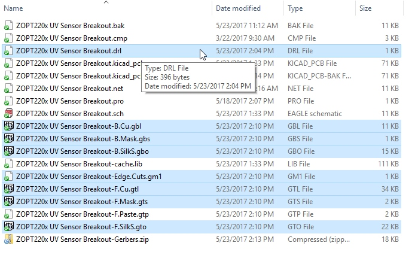

次の8個のファイルを選択してZIPにまとめる。

- ***.drl** — ドリルファイル
- ***.gbl** — ガーバー下面レイヤー
- ***.gbs** — ガーバー下面ソルダーマスク
- ***.gbo** — ガーバー下面シルクスクリーン（オーバーレイ）
- ***.Edge.Cuts.gm1** — ボードの輪郭（Gerber Mechanical 1）
- ***.gtl** — ガーバー上面レイヤー
- ***.gts** — ガーバー上面ソルダーマスク
- ***.gto** — ガーバー上面シルクスクリーン（オーバーレイ）

ディレクトリ内の*すべて*のファイルをZIPにしてファブハウスに送ることもできるが、それは推奨しない。
PCBレイアウトソフトウェアは数多くあり、それぞれ異なるファイル名や形式を生成する。
***.cmp**がガーバーファイルなのか、それとも別のものなのか判断がつきにくいことも多い。
顧客は***.gtp**ファイルを気にするだろうか、それとも余計なファイルだろうか。
ファブハウスには、製造してほしいものだけを渡す方がよい。

最後のステップは、ボードを発注することである。
ガーバーはPCBベンダーとやり取りするための共通言語である。
PCBベンダーは何百、いや何千と存在する。いろいろ探してみてほしい。

ガーバーに加えて、メールやPCBベンダーのサイトを通じて、次のようなPCBの各種仕様を指定する必要がある。

- **PCBの厚さは？** 1.6mmが標準だが、0.8mmでも同じくらい剛性があり、50Ωのトレースインピーダンス整合に役立つこともある。
- **ソルダーマスクの色は？** 緑がデフォルトだが、赤もかっこいい。
- **シルクスクリーンの色は？** 白が最も一般的だが、他の色も選べる。
- **レイヤー数は？** この例は*2層*ボードで、上面銅箔と下面銅箔だけである。ただし、デザインによってはボードを配線するために4層、10層、16層まで必要になることもある。レイヤーが増えるとコストは大幅に上がる。

### ソルダーマスクが大きく見える問題

このPCBのソルダーマスクを見て、なぜ変な見た目なのか気になった人もいるだろう。筆者もそうだった。
このPCBのソルダーマスクを、KiCad（緑色で表示）とEagle（ピンク色で表示）で比較してみよう。次の2点に気づくはずである。

1. KiCadのデザインでは、メインセンサーのパッドの一つが、わずかに位置がずれているように見える。パッド1が他のパッドと揃っていない。妙である。修正が必要な問題だが、ボードが壊れるほどのエラーではない。
2. より重要な点として、Eagleのデザインではコネクタとセンサー ICのピンの間にソルダーマスクの隙間がある。これにより、ピン間のはんだブリッジを減らせる。KiCad版では、マスクの開口部が大きすぎるように見える。

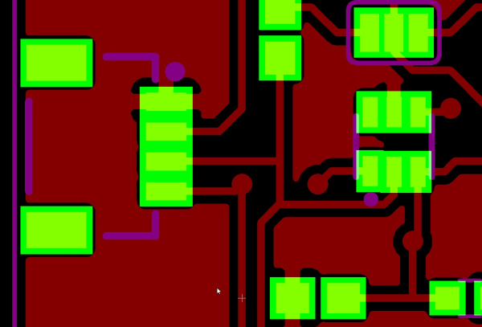

*KiCadのソルダーマスク*

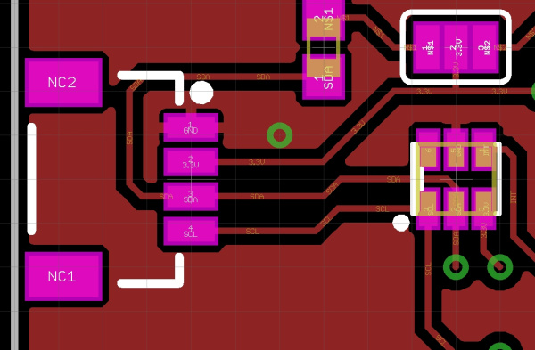

*Eagleのソルダーマスク*

下の画像では、Eagle内の[SMD Qwiicコネクタ](https://www.sparkfun.com/qwiic)を確認できる。
Eagleのデフォルトのソルダーマスククリアランスは片側0.1mmである。

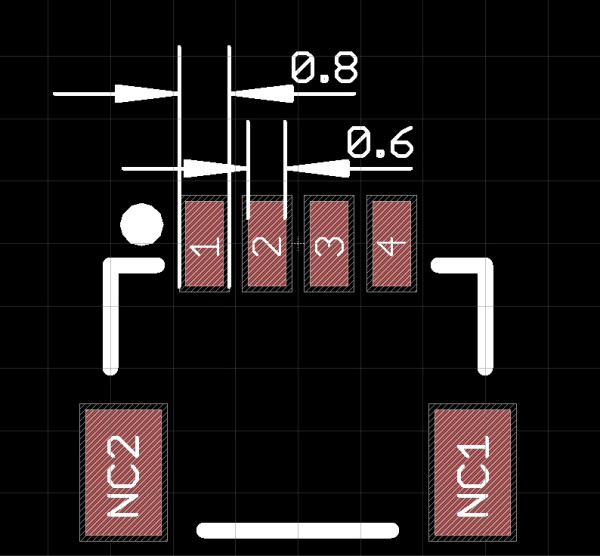

KiCadのPcbnewで、ZOPT220x Breakoutを開き、**Dimensions → Pads Mask Clearance**をクリックする。
KiCadのソルダーマスククリアランスのデフォルトは片側0.2mmである。
この値を**0.1mm**に変更することを推奨する。
ほとんどのファブハウスも、0.1mmをデフォルトとして使っている。
その後、ガーバーを再エクスポートし、GerbViewに読み込み直す必要がある。

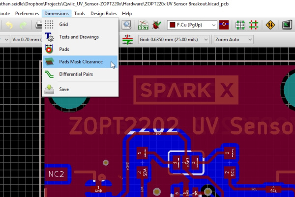

クリアランスを0.1mmより小さくすると、ファブハウスがレジストレーションを正しく合わせるのが難しくなる。

> **レジストレーションとは何か？** 異なるレイヤー同士の位置合わせのことである。ソルダーマスクレイヤーが銅箔レイヤーから2mmずれていたら、はんだ付けしたいSMDパッドがソルダーマスクで覆われてしまう。ファブハウスは、機能するボードを作るためにこれらのレイヤーを高い精度で位置合わせする必要がある。クリアランスを0.1mm未満に減らすと、ファブハウスの許容誤差が小さくなり、遅延や製造コストの増加につながることがある。

## カスタムKiCadフットプリントライブラリを作る

このセクションでは、自分だけのローカルなカスタムフットプリントを作成し、CvPcbを使って回路図コンポーネントと接続する方法を説明する。
このチュートリアルの前のセクションをすでに終えており、KiCadがダウンロード・インストール済みであることを前提とする。

KiCadのプロジェクトマネージャーを開き、PCB footprint editorボタンをクリックする。

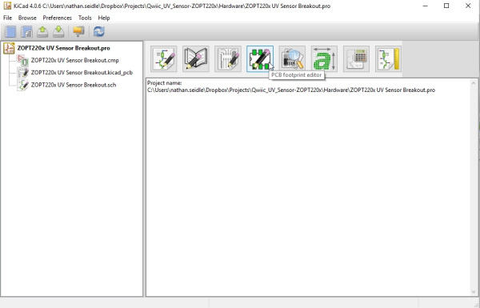

警告が出ることがある。問題ない、そのままクリックして進めばよい。
これは、KiCadの膨大な[GitHubリポジトリ](https://github.com/KiCad/kicad-library)にリンクするデフォルトのライブラリ一覧を作成することをKiCadが伝えているだけである。

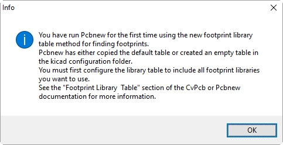

**Preferences → Footprint Libraries Manager**をクリックする。
これにより、現在アクセスできるすべてのフットプリントライブラリの一覧が開く。

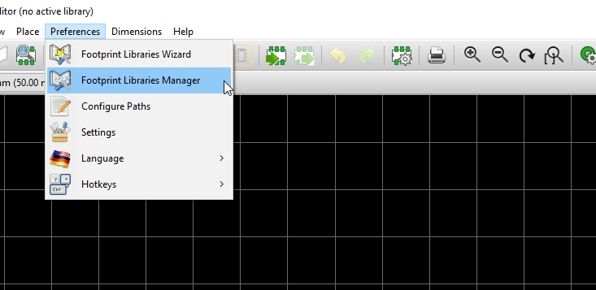

これは膨大なライブラリのリストである。**OK**をクリックしてマネージャーを閉じる。

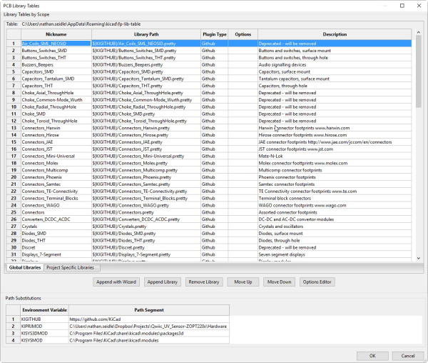

これらのライブラリを少し覗いてみよう。
**Load footprint from library**ボタンをクリックし、続けて**Select by Browser**をクリックする。
これは、利用可能なフットプリントを閲覧するのに便利なツールである。

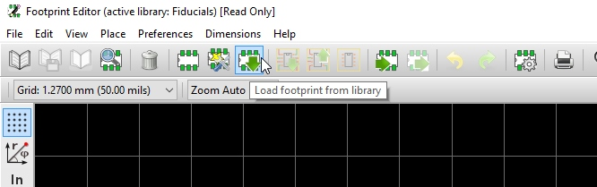

**LEDs → LED_CREE-XHP50_12V**というフットプリントに移動する。
これはLEDsライブラリ内のフットプリントの一例である。
このフットプリントをダブルクリックし、エディタで開く。

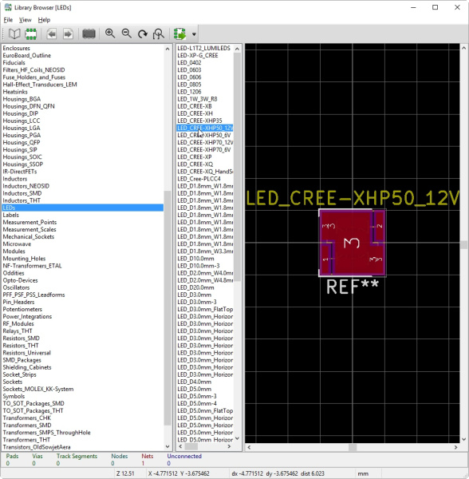

エディタウィンドウのタイトルバーが変わったことに気づくはずである。
アクティブなライブラリは現在LEDsであり、これは読み取り専用である。
当然ながら、KiCadは自分たちのライブラリを管理したいと考えており、誰でも自由にリポジトリに保存できるわけではない。
このフットプリントを編集したい場合は、自分だけのローカルコピーが必要になる。

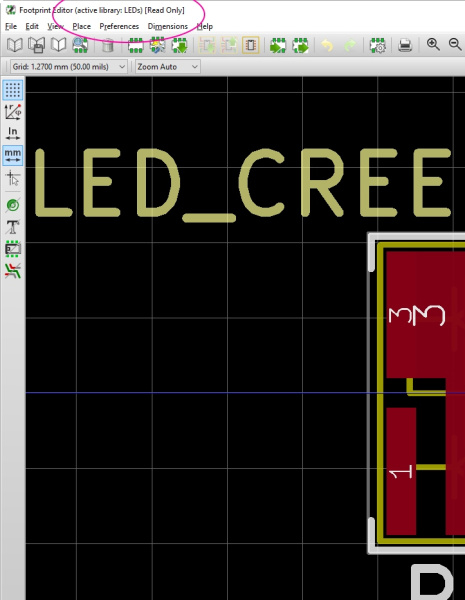

自分のフットプリントをすべて保管するローカルディレクトリを作ろう。
このチュートリアルでは、**`C:\KiCadLibs\`**（あるいは自分のプラットフォームに相当するもの）というローカルフォルダを作成してほしい。

続いて、**File → Save Footprint in New Library**をクリックする。

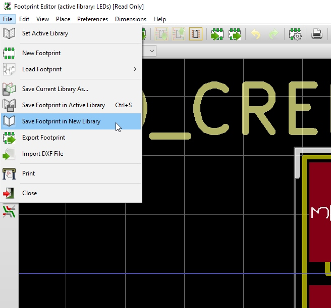

フットプリントの種類（抵抗、コネクタ、LEDなど）ごとに、異なるディレクトリ名を使うことを推奨する。
先ほど作成した*KiCadLibs*フォルダを選択し、`\LEDs`と入力する。
KiCadは新しい*LEDs.pretty*ディレクトリを作成し、`C:\KiCadLibs\LEDs.pretty\LED_CREE-XHP50_12V.kicad_mod`というファイルができる。
これで一件落着かと思いきや、まだそうではない。

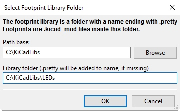

Footprint Editorのタイトルバーには、まだアクティブなライブラリがLEDsであり、読み取り専用であると表示されているはずである。
アクティブなディレクトリを、自分のローカルフォルダに切り替える必要がある。
先に断っておくと、**File → Set Active Directory**は使えない。KiCadに同梱されているライブラリの一覧しか表示されないためである。おいおい、KiCadよ。

新しいフットプリントディレクトリをアクティブに設定する前に、まずKiCadにその存在を認識させる必要がある。
**Preferences → Footprint Libraries Manager**を再度開く。

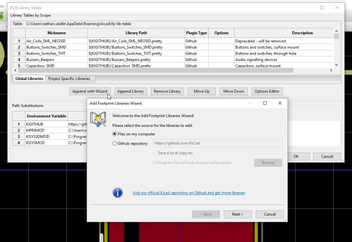

**Append with Wizard**ボタンをクリックする。
追加したいディレクトリを尋ねられる。
今回は*'Files on my computer'*を追加したい。
**Next >**ボタンをクリックし、先ほど作成したディレクトリ（すなわち`C:\KiCadLibs\LEDs.pretty`）を選択する。
**Next >**を数回クリックする。
「*新しいライブラリをどこに追加したいか*」と尋ねられたら、「*To Global library configuration（visible to all projects）*」を選択し、**Finish**をクリックする。

「LEDs」というニックネームが二重に使われているというエラーがKiCadから出ることがある。
筆者は**'LEDs-Custom'**という名前に変更し、**OK**をクリックしてFootprint Libraries Managerを閉じた。

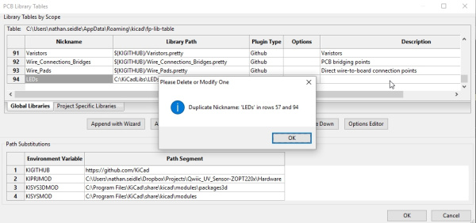

再度Footprint Editorのツールバーを確認すると、LEDsライブラリがまだアクティブで読み取り専用のままになっているはずである。
ここで**File → Set Active Library**をクリックする。
ここがKiCadの光る部分で、Filterがよく機能する。
「LED」と入力し、LEDs-Customライブラリを選択する。

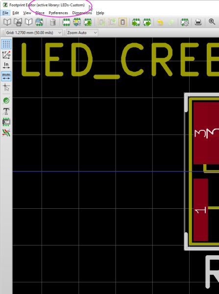

ついに、アクティブなローカルライブラリができた。
これで「Save footprint in local library」をクリックするか**ctrl+s**を押すと、KiCadは名前を尋ねるSave Footprintウィンドウを表示する（毎回聞かれるのは少々面倒である）。
Enterを押せば、変更内容が保存される。

> **警告：** KiCadは上書きの警告を出さない。すでに「1206 LED」というフットプリントがある状態で、新しいフットプリントを作って同じ「1206 LED」という名前で保存すると、KiCadは何も言わずに古いフットプリントを上書きしてしまう。

これで、Footprint Editorを使ってフットプリントを作成・編集できるようになった。

最初のフットプリントを1つか2つ作り終えたら、ぜひKiCadの[KiCad Library Conventions（KLC）](https://github.com/KiCad/kicad-library/wiki/Kicad-Library-Convention)を読んでほしい。
コミュニティで共有できるフットプリントを作るためのよく整理された仕組みである。
思い思いに作っていると、みんな少しずつ異なるものを作ってしまう。KLCは、みんなの認識を揃えるためのものであり、SparkFunもこれに従っている。

今後、フットプリントを大量に作る予定があるなら、gitリポジトリで変更を管理することを検討するとよい。
SparkFunでは、次のような構造を使っている。

- **\SparkFun-KiCad-Libraries** — すべてのKiCad回路図コンポーネントファイル（*.lib）を含むgitリポジトリのディレクトリ
- **\SparkFun-KiCad-Libraries\Footprints** — フットプリントのディレクトリ群を含む
- **\SparkFun-KiCad-Libraries\Footprints\LEDs.pretty** — すべてのLEDフットプリント（*.kicad_mod）を含むディレクトリ
- **\SparkFun-KiCad-Libraries\Footprints\Sensors.pretty** — すべてのセンサーフットプリント（*.kicad_mod）を含むディレクトリ
- 以下同様

gitリポジトリを使うことで、SparkFunのエンジニアやユーザーが回路図コンポーネントやフットプリントを貢献できるようになる。

### KiCadライブラリを絞り込む

CvPcbを開いて回路図コンポーネントにフットプリントを割り当てる際、読み込みに非常に時間がかかることがある。
これは、KiCadがすべてのKiCad GitHubリポジトリに問い合わせ、93個のライブラリをダウンロードしているためである。
これを速くするには、非推奨になっているライブラリや、自分が絶対に使わないライブラリを削除することを推奨する。

ライブラリの削除は素早く簡単に行える。Footprint Libraries Managerで行を選択し、「Remove Library」ボタンをクリックするだけである。
何かおかしくなっても慌てる必要はない。マネージャーウィンドウで「Cancel」をクリックすれば、変更を保存*せずに*ライブラリマネージャーが閉じる。
本当に大変なことになった場合は、*'fp-lib-table'*ファイルを削除してKiCadを再起動すればよい。
これにより、KiCadのデフォルト設定でフットプリントテーブルが再作成される。

フットプリントライブラリテーブルファイルは、（Windows 10の場合）AppDataフォルダにあり、次のような場所になっているはずである。
**`C:\Users\Nathan\AppData\Roaming\kicad\fp-lib-table`**

> **注意：** AppDataは隠しディレクトリなので、[隠しフォルダを表示する](https://support.microsoft.com/en-us/help/14201/windows-show-hidden-files)設定が必要になる。

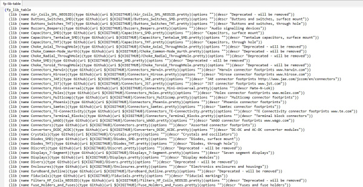

*'fp-lib-table'の内容*

非推奨のライブラリを削除すると、デフォルトの数は75まで減るが、それでもCvPcbの読み込みには煩わしいほど時間がかかる。
ここからは、厳しい判断をしていく必要がある。
*'Shielding-Cabinets'*ライブラリが必要になることはあるだろうか。あるかもしれないし、ないかもしれない。
もし将来デザインでRFシールドが必要になったとしても、たいていはカスタムパーツになるか、ライブラリに*ない*パーツになるはずである。だから、これは削除してしまう。

SparkFunは、両方を組み合わせたアプローチを取っている。
デフォルトのKiCadライブラリにかなり慣れてきており、意味のある場面ではそのフットプリントを使っている。
気に入ったパッケージを見つけたり使ったりしたときは、それを[SparkFun-KiCad-Libraries](https://github.com/sparkfun/SparkFun-KiCad-Libraries)のGitHubリポジトリにコピーしている。
同時に、10年以上にわたって使い、作り続けてきたカスタムのEagleフットプリントも活用し続けている。
これらのフットプリントはよく知っていて、信頼できる。
筆者は、他人のフットプリントを信用したせいでPCBを何枚も無駄にした経験があるため、かなり慎重になる傾向がある。
コミュニティのものは活用できるところでは活用しつつも、正しさの確認は非常に厳密に行うようにしてほしい。

一般的な2×5ピンのオスヘッダーが必要なら、KiCadのライブラリを確認すればよい。問題なく使えるはずである。
とはいえ、より特殊な部品を使う場合は、フットプリントをゼロから作った方がよいこともある。
KiCadのライブラリにその部品が含まれている場合でも、データシートと入念に照合し、実寸で試し印刷しておくとよいだろう。

### KiCadでEagleのフットプリントを使う

Eagleに慣れている場合、フットプリント作成にかけた時間がKiCadへの移行ですべて無駄になってしまうのではないかと不安になるかもしれない。
心配は要らない。KiCadは元々Eagleのフットプリントを読み込める。そう、標準機能として組み込まれている。
ただし、あまり期待しすぎないでほしい。KiCadはEagleの回路図コンポーネントは読み込めないが、これについては後のセクションで解決策を紹介する。

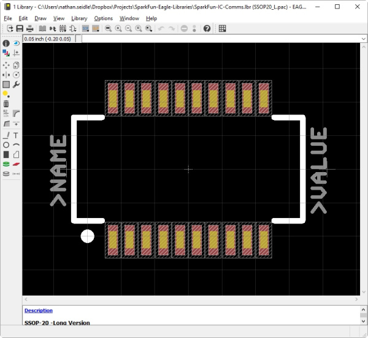

SparkFunで採っているアプローチは、従来のEagleライブラリすべてのローカルコピーにリンクしておくことである。
Eagleのフットプリントが必要になるたびに、それを最新のKiCadライブラリにコピー＆ペーストしている。
フットプリントを一から作り直す必要はなく、KiCadライブラリに移すだけでよい。
そうすれば、必要に応じてそのフットプリントを編集できるようになる。
さらに、新しいフットプリントはすべてゼロから作成し、対応するSparkFunのKiCadライブラリに保存している。

ここまでで、少なくとも一度はPCB Footprint Editorを開いているはずである。
これにより、この後編集する*'fp-lib-table'*ファイルが作成されているはずである。
それでは始めよう。まずKiCadが閉じていることを確認する。

GitHubから[SparkFun Eagle Libraries](https://github.com/sparkfun/SparkFun-Eagle-Libraries)をダウンロードする。

好きなローカルディレクトリに解凍する。
筆者はEagleライブラリをDropboxフォルダに保存しており、デスクトップとノートパソコンの両方から同じファイル群にアクセスできるようにしている。

Footprint Editor内のFootprint Libraries Managerを使うこともできるが、多数のライブラリを追加・削除するのは面倒である。テーブルファイルを直接編集する方が簡単である。

*fp-lib-tableの内容*

「*fp-lib-table*」は、KiCadにさまざまなライブラリの場所と、その種類（KiCad、GitHub、EAGLEなど）を教えるファイルである。

このファイルを編集し、SparkFunのライブラリを追加するとともに、非推奨のライブラリやSparkFunが使わないライブラリを削除する。

重要なファイルは次のとおりである。

- **[original fp-lib-table](https://cdn.sparkfun.com/assets/learn_tutorials/6/6/0/original_fp-lib-table)** — KiCadがデフォルトで作成するもの。ダウンロードする必要は特にない。参考用である。
- **[sparkfun fp-lib-table](https://cdn.sparkfun.com/assets/learn_tutorials/6/6/0/sparkfun_eagle_fp-lib-table)** — SparkFunのライブラリの一覧。ダウンロードする必要はなく、参考用である。
- **[combined fp-lib-table](https://cdn.sparkfun.com/assets/learn_tutorials/6/6/0/combined_fp-lib-table)** — 元のテーブルから余分なライブラリを削除し、SparkFunのライブラリを追加したもの。

*'combined fp-lib-table'*をローカルフォルダにダウンロードする。
これを*'fp-lib-table'*という名前に変更する。
続いて、KiCadが想定している場所にこのファイルを移動する。
フットプリントライブラリテーブルファイルは、（Windows 10の場合）AppDataフォルダにあり、`C:\Users\Nathan\AppData\Roaming\kicad\fp-lib-table`のような場所になる。
そこにある既存のファイルを上書きすることになる。

> **注意：** AppDataは隠しディレクトリなので、[隠しフォルダを表示する](https://support.microsoft.com/en-us/help/14201/windows-show-hidden-files)設定が必要になる。

ファイルを配置したら、KiCadを再度開き、PCB footprint editorを開き、続けてFootprint Libraries Managerを開く。
新しいSparkFunのライブラリを含む、長いライブラリの一覧が表示されるはずである。

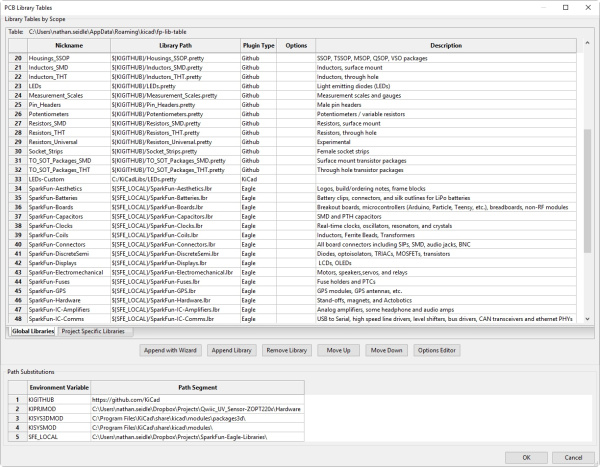

最後のステップは、SparkFunのライブラリへのローカルパスをKiCadに教えることである。
現在、これはSFE_LOCALという変数になっている。これに値を割り当てる必要がある。
Library Managerウィンドウを閉じ、**Preferences → Configuration Paths**をクリックする。
**Add**ボタンをクリックし、NameとPathのフィールドを編集する。

下の画像では、**'SFE_LOCAL'**変数を`C:\Users\nathan.seidle\Dropbox\Projects\SparkFun-Eagle-Libraries\`というローカルパスに設定している。
この変数は、SparkFun Eagle Librariesをローカルに保存した場所に設定してほしい。

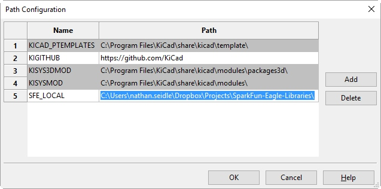

おめでとう。これで、SparkFunのすべてのEagleライブラリを閲覧、使用、コピーできるようになった。

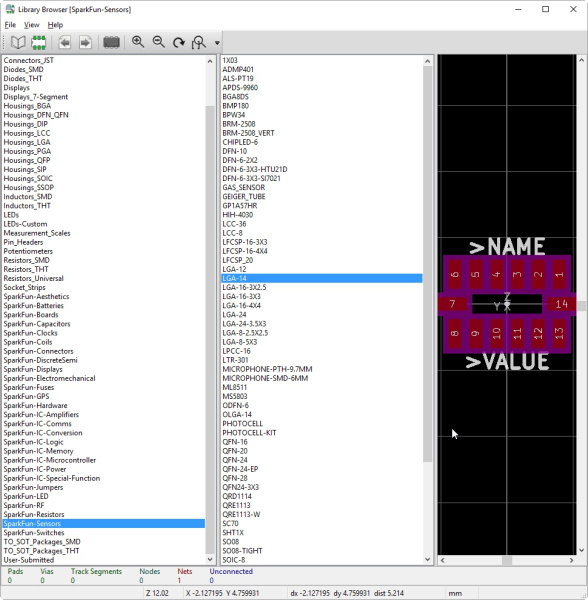

## カスタムKiCad回路図コンポーネントを作る

自分だけの回路図パーツやカスタムフットプリントの作り方を学べば、扱える技術の幅に制限がなくなる。さっそく始めよう。

メインのプロジェクトウィンドウから、*Schematic library editor*を起動する。

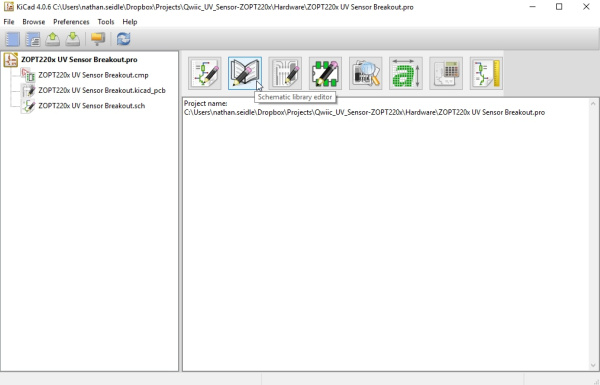

この手順は、カスタムフットプリントライブラリを作り始めたときと似ている。
まず、カスタムライブラリの出発点にしたい回路図シンボルを探そう。
[フォトセル](https://www.sparkfun.com/products/9088)は非常によくあるパーツである。
*device*ライブラリから「R_PHOTO」という回路図コンポーネントを取り込み、これを出発点に新しいカスタム回路図コンポーネントライブラリを作ろう。

左上にある**'Selecting working library'**（本のアイコン）をクリックすることから始める。
続いて*'device'*を選択し、作業対象のライブラリに設定する。

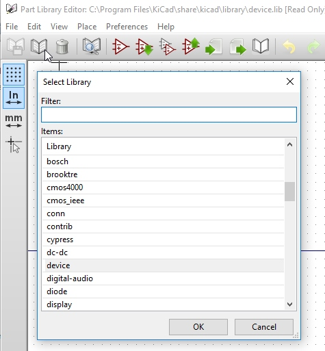

**'Load component to edit from current library'**ボタンをクリックし、フィルターに*r_photo*と入力してフォトレジスタのコンポーネントを素早く見つける。
見つかったら**OK**をクリックする。

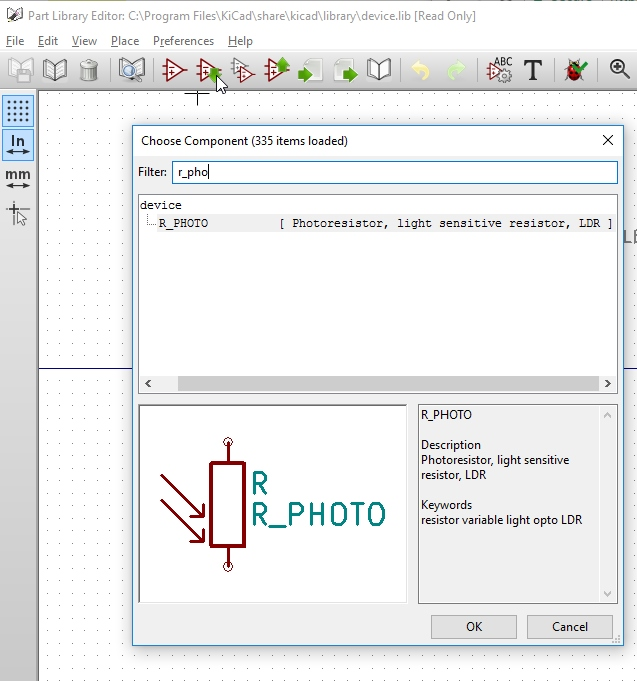

**'Save current component to new library'**ボタンをクリックする。

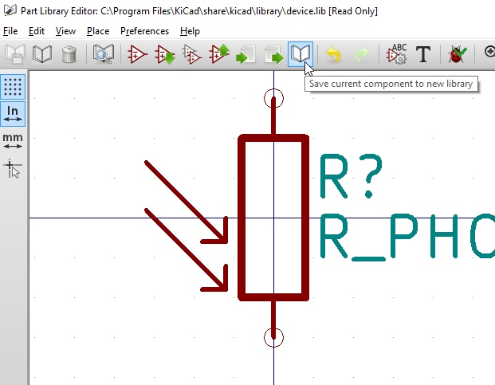

この*.lib*ファイルは、フットプリントライブラリを保存したのと同じ`C:\KiCadLibs\`ディレクトリに保存することを推奨する。
筆者はこのlibファイルを**'CustomComponents.lib'**と名付け、自分のものだとわかるようにしている。

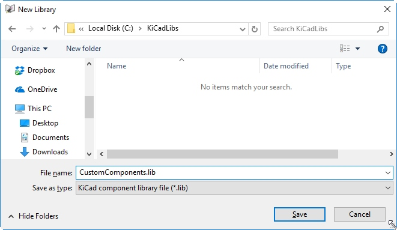

**Save**をクリックすると、警告がポップアップする。
これは単に、ライブラリにリンクするまではそのライブラリにアクセスできないことをKiCadが丁寧に伝えているだけである。それでは、リンクしよう。

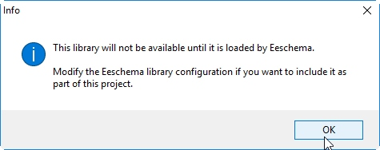

**Preferences → Component Libraries**をクリックし、現在のライブラリの一覧を確認する。
下の画像では、KiCadに同梱されている標準の回路図コンポーネントライブラリが確認できる。
*'Component library files'*の隣にある**Add**をクリックする。

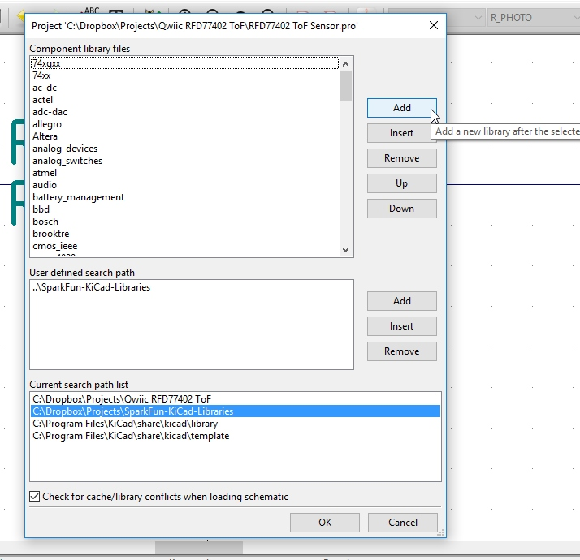

`C:\KiCadLibs`ディレクトリに移動し、**'CustomComponents.lib'**を開く。
これで、*Component library files*リストの一番下に表示されるはずである。
**OK**をクリックし、ライブラリエディタに戻る。

再度**'Select working library'**ボタンをクリックするが、今度は自分のカスタムリストまでスクロールするか、「Custom」と入力して**'CustomComponents'**ライブラリを見つける。**OK**をクリックする。

続いて**'Load component to edit from the current library'**ボタンをクリックすると、フォトレジスタの回路図コンポーネントだけが表示されるはずである。
R_PHOTOをダブルクリックし、編集を始める。

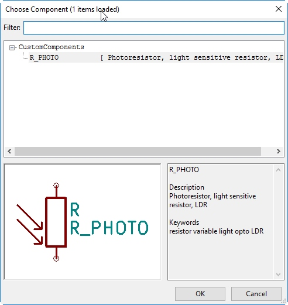

ここまでくれば、新しいシンボルをライブラリにゼロから追加することも、あるライブラリから別のライブラリへコピーすることもできるようになる。

### カスタムKiCadライブラリにコンポーネントをコピーする方法

KiCadは常に進化しており、大きく改善を重ねてきているが、ある回路図コンポーネントを別のライブラリにコピーする作業は、まだ少し荒削りなところがある。

たとえば、*silabs*ライブラリからCP2104を自分のカスタムライブラリにコピーしてみよう。
まず、**'Select working library'**ボタンをクリックし、コピーしたいパーツが含まれるライブラリをアクティブに設定する。
この例では、*silabs*をアクティブなライブラリに設定する必要がある。

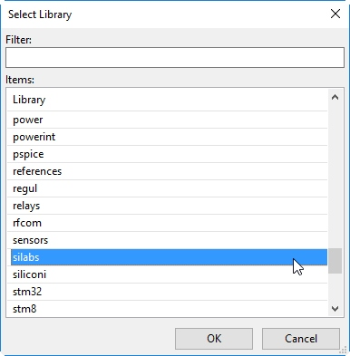

**'Load component to edit from the current library'**ボタンをクリックし、CP2104コンポーネントを読み込む。

続いて、CP2104をコピーしたい先のライブラリをアクティブに設定する。
この例では、**'Select working library'**ボタンをクリックし、アクティブなライブラリを「CustomComponents」に設定する必要がある。

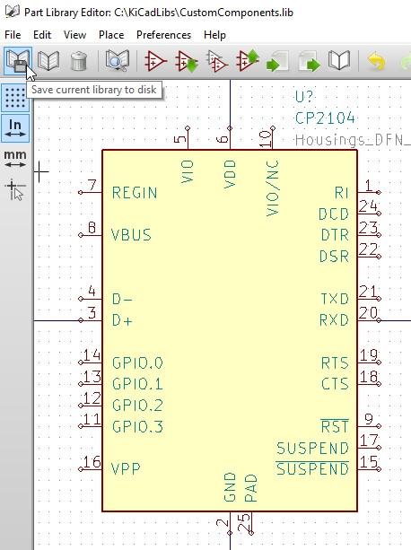

**'Update current component in current library'**ボタンをクリックし、*CustomComponents.lib*にコンポーネントを保存する。
**'Save current library to disk'**ボタンが有効になり、このコンポーネントをカスタムライブラリに保存できるようになる。

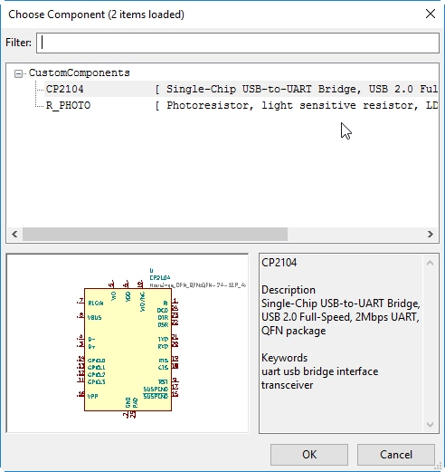

ライブラリに追加されたことを確認するには、**'Load component to edit from the current library'**ボタンをクリックする。
新しいCP2104がリストに表示されているはずである。

### カスタムKiCadライブラリからコンポーネントを削除する方法

困ったCP2104よ、悪いコンポーネントめ。

コンポーネントを削除するには、まず自分のカスタムライブラリがアクティブになっていることを確認する。
先ほどカスタムライブラリ*CustomComponents.lib*に追加したコンポーネントを削除してみよう。
まだ設定していなければ、**'Select working library'**をクリックしてアクティブなライブラリを*CustomComponents*に設定する。
**'Delete component in current library'**（ゴミ箱アイコン）ボタンをクリックする。
どのコンポーネントを削除するか尋ねられる。リストからCP2104を選択する。

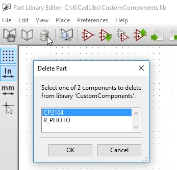

**OK**をクリックし、続けて**Yes**をクリックしてライブラリからコンポーネントを削除する。
**'Current library to disk'**ボタンをクリックし、**Yes**をクリックして保存する。

[Joan_Sparky](https://forum.kicad.info/t/how-do-i-delete-a-component-i-placed-in-a-library/4610)氏に感謝を。最高の人物である（血縁関係はない）。

### KiCadライブラリ規約

コンポーネントの作成に慣れてきたら、必ずKiCadの[KiCad Library Convention](https://github.com/KiCad/kicad-library/wiki/Kicad-Library-Convention)を確認してほしい。
これらの規約には、業界で培われた専門知識の蓄積が反映されており、誰にとっても有益である。

## まとめ・参考資料

おめでとう。大きなチュートリアルだったが、最後までやり遂げた。

KiCadに関するさらに詳しい情報は、次の資料を参考にしてほしい。

- [KiCad](http://kicad.org/) — KiCad公式ページ
  - [Download KiCad](http://kicad.org/download/) — 自分のOSやディストリビューション向けのKiCadソフトウェアのダウンロードページ
  - [Online Documentation](http://kicad.org/help/documentation/)
  - [Library GitHub Repo](https://github.com/KiCad/kicad.github.io) — KiCadチームがサポートする回路図・3Dライブラリ
- [Contextual Electronics: KiCad YouTube Video Series](https://www.youtube.com/watch?v=iTyi3RvNoB0&list=PLy2022BX6Esr6yxwDzhqYZyuuenJE2s5B)
- [Lachlan's Eagle to KiCad Converter GitHub Repo](https://github.com/lachlanA/eagle-to-kicad) — EagleのSchematic・LibraryをKiCadのSchematic・Libraryに変換するULPスクリプト
- [ZOPT220x UV Sensor Breakout KiCad Files（ZIP）](https://cdn.sparkfun.com/assets/learn_tutorials/6/6/0/ZOPT220x_UV_Sensor_Breakout-Tutorial.zip) — このチュートリアルで使ったKiCadファイルのサンプル
- [SparkFun_SchematicComponents.lib](https://cdn.sparkfun.com/assets/learn_tutorials/6/6/0/SparkFun_SchematicComponents.lib) — このチュートリアルでZOPT220x UV Sensor Breakoutの回路図のコンポーネントをリンクするために使ったライブラリ
- [original fp-lib-table](https://cdn.sparkfun.com/assets/learn_tutorials/6/6/0/original_fp-lib-table) — KiCadがデフォルトで作成するライブラリ
- [sparkfun fp-lib-table](https://cdn.sparkfun.com/assets/learn_tutorials/6/6/0/sparkfun_eagle_fp-lib-table) — SparkFunのライブラリの一覧。ダウンロードする必要はなく、参考用
- [combined fp-lib-table](https://cdn.sparkfun.com/assets/learn_tutorials/6/6/0/combined_fp-lib-table) — 元のKiCadテーブルから余分なライブラリを削除し、SparkFunのライブラリを追加したもの
- [SparkFun Eagle Library GitHub Repo](https://github.com/sparkfun/SparkFun-Eagle-Libraries) — SparkFunの従来のEagleライブラリ
- [SparkFun KiCad Library GitHub Repo](https://github.com/sparkfun/SparkFun-KiCad-Libraries) — SparkFunのEagleライブラリをKiCadライブラリに移植したもの

回路図、PCBレイアウト、ライブラリの編集方法を学んだところで、いよいよ自分だけのカスタムプロジェクトでその腕を試す番である。
[ZOPT220x UV Sensor BreakoutのKiCadファイル](https://cdn.sparkfun.com/assets/learn_tutorials/6/6/0/ZOPT220x_UV_Sensor_Breakout-Tutorial.zip)を次のプロジェクトの出発点として使うことを推奨する。
このサンプルプロジェクトをもとに、白紙の状態から始めるのではなく、必要に応じてデバイスを削除・追加していけばよい。

さらにインスピレーションが欲しい場合は、KiCadに関するSparkFunのEnginursdayやプロジェクトのブログ記事も確認してみてほしい。

- Enginursday: KiCad and Open-Source Design — オープンソースの設計から最終製品に至るまでのプロセスを、KiCad、PJRC、Advanced Circuitsを例に紹介する
- Enginursday: The Pro-One and Proto-8 Synthesizers, with Teensy! — Teensy Audioプラットフォームでモジュラーシンセサイザーをエミュレートする
- Stupid Arduinos: The RedBoard Pro Micro-ATX — 「くだらないゲームで遊べば、くだらない賞品が手に入る」とはよく言うが、くだらない賞品こそ筆者の好物である

### EagleからKiCadへ

EAGLEの熟練者でKiCadに足を踏み入れ始めたばかりであれば、EagleのPCBレイアウトをKiCadに変換するためのLachlan氏の[Eagle to KiCad converter](https://github.com/lachlanA/eagle-to-kicad)もぜひ確認してほしい。
完璧ではないが、Lachlan氏は膨大な基礎作業をこなしてくれている。

読んでくれてありがとう。コメントや質問があれば、コメント欄で気軽に尋ねてほしい。

### Digi-KeyとSparkFunによるKiCad動画シリーズ

あるいは、[Digi-KeyとSparkFunによる10部構成のKiCad動画シリーズ](https://www.youtube.com/playlist?list=PLEBQazB0HUyR24ckSZ5u05TZHV9khgA1O)もおすすめである。
Shawnがバッジ用のシンプルな555タイマー回路を設計し、部品を発注して、バッジを組み立てる様子を追える。
下にリンクした動画は、Digi-KeyによるKiCadの案内が終わり、実際にバッジの製作にそのスキルを応用し始める場面からである。

タグ: スキル

---

出典：[Beginner's Guide to KiCad](https://learn.sparkfun.com/tutorials/beginners-guide-to-kicad)（SparkFun Learn）を日本語に翻訳し、再構成した。
原文は [CC BY-SA 4.0](https://creativecommons.org/licenses/by-sa/4.0/) ライセンスで公開されており、本ページも同ライセンスの下で提供する。
