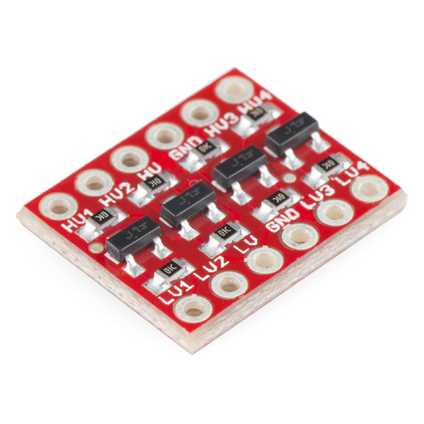
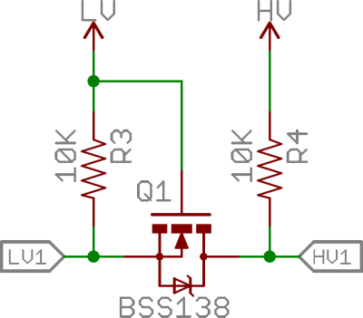
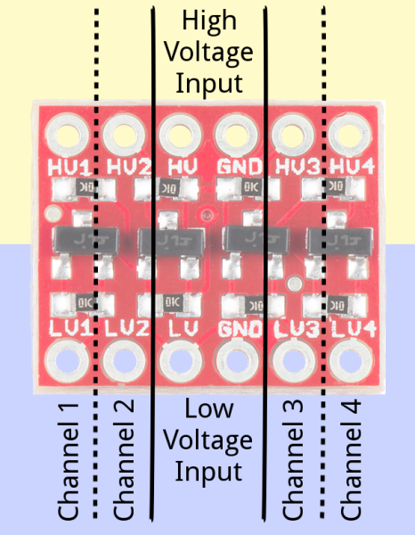
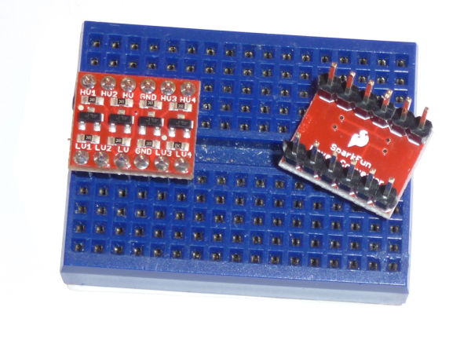
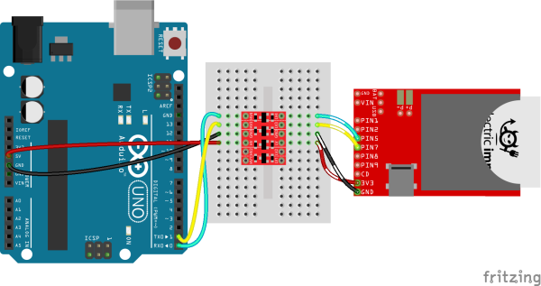
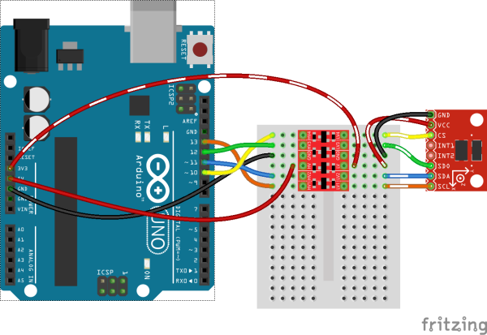
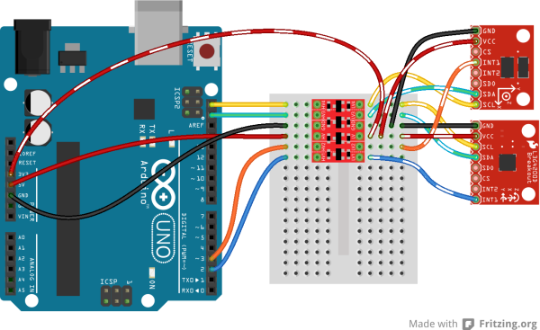

# 双方向ロジックレベルコンバータの使い方

3.3VのI2CセンサーやSPIセンサーを5VのArduinoに接続して、煙を出してしまいそうで心配になったことはないだろうか。
あるいは、5Vのデバイスを3.3VのRaspberry Pi 4やRaspberry Pi Zero、RedBoard Turbo、Arduino Dueと組み合わせるために、何らかの回避策が必要になったことは。

この壁を乗り越えるには、3.3Vを5Vに、あるいは5Vを3.3Vに変換できる装置が必要になる。
これはロジックレベルシフトと呼ばれる。
レベルシフトはあまりにもよくある悩みであるため、SparkFunでは機器どうしのインターフェースを少し簡単にするシンプルなPCB基板、[双方向ロジックレベルコンバータ](https://www.sparkfun.com/products/12009)を設計した。

形と大きさは同じだが、この双方向ロジックレベルコンバータは、より単純な["単方向"バージョン](https://www.sparkfun.com/products/11978)とは区別する必要がある。
このコンバータは、**すべてのチャンネル**において、高い電圧から低い電圧へ、あるいはその逆の両方向にデータを通すことができる。
[I2C](./i2c.md)やワンワイヤーインターフェースのように、データ線を共有する機器どうしのレベルシフトに最適である。

このチュートリアルで扱う内容:

このチュートリアルでは、双方向ロジックレベルコンバータについて詳しく見ていく。
回路図と基板のレイアウトを確認し、それぞれのピンの役割を説明する。
最後に、さまざまなインターフェースに合わせてこの基板をどう接続するか、いくつかの接続例を紹介する。

参考になるチュートリアル:

以下の概念に馴染みがなければ、続きを読む前にこれらのチュートリアルを確認しておくことをおすすめする。

- [ロジックレベル](./logic-levels.md)
- [ブレッドボードの使い方](./how-to-use-a-breadboard.md)
- [Arduinoとは何か](./what-is-an-arduino.md)
- [はんだ付けの基本（スルーホール編）](./how-to-solder-through-hole-soldering.md)
- [配線の基本](./working-with-wire.md)

## 基板の概要

この基板の[回路図](https://cdn.sparkfun.com/datasheets/BreakoutBoards/Logic_Level_Bidirectional.pdf)を見てみると、双方向ロジックレベルコンバータ（以下BD-LLCと略す）は実はとても単純な装置であることが分かる。
基板上には基本的に1つのレベルシフト回路があり、それが4回繰り返されて4つのレベルシフトチャンネルを作り出している。
この回路は、1個のNチャンネルMOSFETと2、3個のプルアップ抵抗を使って、双方向のレベルシフトを実現している。

半導体のちょっとした魔法によって、この回路は低電圧信号を高電圧に、あるいは高電圧信号を低電圧に変換できる。
片側で0Vの信号は、もう片側でも0Vのままである。
この回路の完全な解析については、優れた[Philips Application Note AN97055](http://cdn.sparkfun.com/tutorialimages/BD-LogicLevelConverter/an97055.pdf)を参照してほしい。

### ピン配置

BD-LLCには合計12本のピンがあり、6本ずつ2列に並んだヘッダーになっている。
一方の列には高電圧側（たとえば5V）の入出力がすべて、もう一方の列には低電圧側（たとえば3.3V）のものがすべて配置されている。

ピンは基板の表と裏の両方にラベル付けされており、いくつかのグループに分かれている。
いくつかのピングループを詳しく見ていこう。

#### 電圧入力

**HV**、**LV**、そして2つの**GND**というラベルの付いたピンは、基板に高電圧と低電圧の**基準電圧**を供給する。
この両方の入力に安定したレギュレート済みの電圧を供給することが**必須**である。

*HV*と*GND*の入力に供給する電圧は、*LV*側に供給する電圧よりも高くなければならない。
たとえば5Vから3.3Vへ変換する場合、*HV*ピンの電圧は5V、*LV*の電圧は3.3Vにする。

#### データチャンネル

BD-LLCには4つの独立したデータチャンネルがあり、それぞれ高電圧と低電圧の間でデータを双方向にシフトできる。
これらのピンは**HV1**、**LV1**、**HV2**、**LV2**、**HV3**、**LV3**、**HV4**、**LV4**とラベル付けされている。
それぞれのラベルの末尾の数字はピンのチャンネルを示し、*HV*または*LV*という接頭辞は、そのチャンネルの高電圧側か低電圧側かを示している。

たとえば*LV1*に入力された低電圧信号は、より高い電圧にシフトされて*HV1*から出力される。
*HV3*に入力されたものは、低電圧にシフトされて*LV3*から出力される。
プロジェクトに必要な数だけこれらのチャンネルを使えばよく、すべてのチャンネルを使う必要はない。

これらのレベルシフターは**純粋にデジタル**である点に注意してほしい。
あるアナログの最大電圧を別の最大電圧に対応付けるような使い方はできない。

## 接続例

### 組み立て

コンバータをシステムに接続する前に、何かを[はんだ付け](./how-to-solder-through-hole-soldering.md)する必要がある。
ここにはさまざまな選択肢がある。
まっすぐなオスヘッダーをはんだ付けしてブレッドボードにそのまま挿すこともできるし、配線を直接はんだ付けすることもできる。
自分の使い方に合った組み立て方法を選ぼう。

BD-LLCのはんだ付けが終わったら、いよいよ接続する番である。
接続方法は、使う通信インターフェースによって変わってくる。
以下では、もっともよく使われる3つの通信プロトコルについて、レベルコンバータの接続方法を紹介する。

### BD-LLCをシリアル通信に使う

BD-LLCの双方向という機能を活かしきることにはならないが、[シリアル通信](./serial-communication.md)のレベルシフトにこの基板を使ってもまったく問題ない。
シリアル通信にはたいてい*RX*（受信）と*TX*（送信）という2本の信号線が必要であり、どちらも決まった方向を持つ。
これらの信号は、BD-LLCの4つのチャンネルのどれを使って通してもよい。

たとえば、最大入力電圧が3.6VのElectric Imp Breakout Boardを、UART経由でArduino Unoに接続したいとしよう。
接続方法の一例は次のとおりである。

*この例では、ArduinoとElectric Impの両方がそれぞれ独自の電源を持っていることに注意してほしい。*

*LV*が3.3Vで、*HV*が5Vで電源供給されていることを確認しよう。
チャンネルの対応が合っているか再確認すれば、あとはレベルシフトが行われるだけである。
残りの2チャンネルは好きなように使うことができる。

### BD-LLCをSPI通信に使う

BD-LLCの4つのチャンネルは、たいていの[SPI通信](./serial-peripheral-interface-spi.md)にちょうどよく対応する。
SPIにはたいてい4本の配線、MOSI（コントローラ出力/ペリフェラル入力）、MISO（コントローラ入力/ペリフェラル出力）、SCLK（シリアルクロック）、CS（チップセレクト）が必要である。
これら4本の配線は、それぞれBD-LLCのチャンネルに通すことができる。

たとえば、動作範囲が2.0V〜3.6VのADXL345 Breakout Boardに、Arduinoを接続したい場合、BD-LLCを次のように組み込むことができる。

BD-LLCの各チャンネルはすべて双方向であるため、SPIの4本の線のどれを、BD-LLCの4つのチャンネルのどれに通してもかまわない。

### BD-LLCをI2C通信に使う

[I2C](./i2c.md)は、BD-LLCが真価を発揮する通信規格である。
なぜなら、データ線とクロック線の両方、つまりSDAとSCLの両方が双方向でなければならないからである。
これらの線はそれぞれ、BD-LLCのレベルシフトチャンネルのどれかに通すことができる。

この例でも引き続きADXL345 breakoutを使うが、今度はI2Cインターフェースに切り替えてみよう。
さらに別のI2Cデバイス、たとえばL3G4200D Gyroscope Breakoutを追加することもできる。
I2Cは2本の配線だけのインターフェースなので、BD-LLCにはそれぞれの基板の割り込み出力のような、追加の信号を通す余裕がある。

2つの3.3VのI2Cデバイスは、どちらも同じレベルシフトされたSDAとSCLの線を共有できる。
それぞれが固有のアドレスを持っている限り、さらに多くのI2Cデバイスを追加することもできる。

## まとめ

LLCとレベルシフト全般に関連するリソースをいくつか紹介する。

- [Schematic（回路図PDF）](https://cdn.sparkfun.com/datasheets/BreakoutBoards/Logic_Level_Bidirectional.pdf)
- [Eagle Files（Eagleファイルのzip）](https://cdn.sparkfun.com/datasheets/BreakoutBoards/Logic_Level_Bidirectional.zip)
- [Philips AN97055（PDF）](http://cdn.sparkfun.com/tutorialimages/BD-LogicLevelConverter/an97055.pdf)：双方向レベルシフト回路について扱った優れたアプリケーションノート
- [GitHub Repo（GitHubリポジトリ）](https://github.com/sparkfun/Logic_Level_Bidirectional)

LLCの使いどころを探しているなら、次のようなチュートリアルもヒントになるかもしれない（いずれも英語）。

- [Using the Arduino Pro Mini 3.3V（3.3V版Arduino Pro Miniの使い方）](https://learn.sparkfun.com/tutorials/using-the-arduino-pro-mini-33v)：Arduinoにこだわりつつ3.3Vのセンサーを使いたいなら、3.3Vで動作するArduinoを使うという選択肢もある。そうすれば、そもそもLLCを用意する手間すら要らなくなる。

タグ: 通信、部品、接続ガイド

---

出典：[Bi-Directional Logic Level Converter Hookup Guide](https://learn.sparkfun.com/tutorials/bi-directional-logic-level-converter-hookup-guide)（SparkFun Learn）を日本語に翻訳し、再構成した。
原文は [CC BY-SA 4.0](https://creativecommons.org/licenses/by-sa/4.0/) ライセンスで公開されており、本ページも同ライセンスの下で提供する。
