# バイナリブラスターの組み立てガイド

Binary Blaster（バイナリブラスター）は、[2進数](./binary.md)での数え方や、10進数（や16進数）と2進数の間をすばやく変換する方法を学べるゲームである。
7セグメントディスプレイに値が表示され、プレイヤーはそれに対応する2進数を表すようにボタンを押すことに挑戦する。
ボタンを押せばそのビットが「立ち」、押さなければそのビットは「0のまま」になる。
ボタンは4つあり、それぞれが1ビットを表す。
つまり15通りの組み合わせがある。
15問すべてに正解すればクリアである。
経過時間のスコアも表示されるので、自分の最速記録を追いかけながら、より速くなるよう練習できる。

この製品はスルーホールはんだ付けキットとして販売されており、自分で組み立てる必要がある。

はんだ付けが初めてであれば、Binary Blaster PTHキットは始めるのにうってつけの製品である。
このガイドでは、キットに含まれる部品を1つずつ説明し、それぞれをどうはんだ付けするかを紹介する。

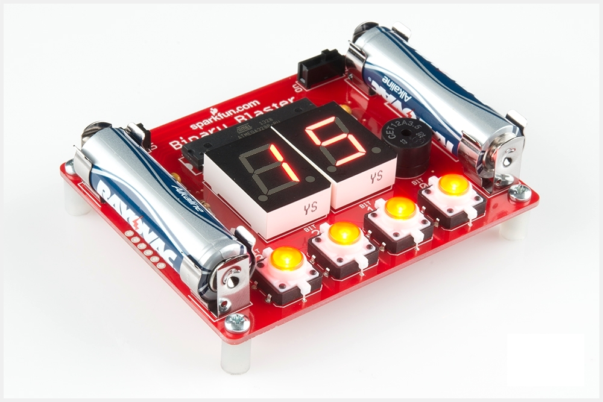

### 必要な道具

- はんだごて
- はんだ
- ニッパー

### あるとよい追加の道具

- 保護メガネ
- フラックスペン
- はんだ吸取り線
- 洗浄用のブラシ（古い歯ブラシで十分）
- 洗浄用の脱イオン水（水道水でも代用可能）

参考になるチュートリアル:

スルーホールはんだ付けについてさらに一般的な知識を得たい場合は、次のようなチュートリアルもおすすめである。

- [はんだ付けの基本（スルーホール編）](./how-to-solder-through-hole-soldering.md)
- Decoding Resistor Markings（抵抗器のカラーコードの読み方）
- Diode and LED Polarity（ダイオードとLEDの極性）
- Electronics Assembly - Washing（電子部品の組み立て：洗浄）

## クイックスタート：最初の部品

10kΩの抵抗器を見つけよう。
茶、黒、橙、金という特定の縞模様が入っている。

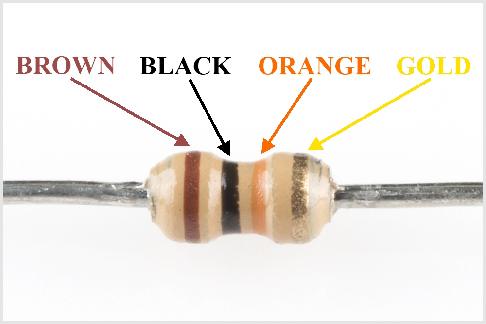

なお、この模様は逆順になっていることもあるが、それでも正しい抵抗器である。

抵抗器のカラーコードについてさらに理解を深めたい場合は、Decoding Resistor Markingsのチュートリアルを参照してほしい。

脚を下向きに曲げる。

基板上の10kΩ抵抗器の位置を確認する。

抵抗器をPCBに挿入する。
この部品には極性がないため、どちらの脚をどちらの穴に入れても構わない。
このキットの一部の部品には[極性があり](./polarity.md)、その際には正しい向きで挿入するよう特に注意を払う。

抵抗器を、ほぼ基板に密着するまで押し込む。

脚を少しだけ外側に曲げて、抵抗器を固定する。

基板を裏返す。
はんだごての「スイートスポット」を、脚と金属のリングの両方に触れるように当てる。
2秒間そのまま保持する。

接合部にはんだを流し込む。

まず、はんだを離す。

次に、こてを離す。

はんだ接合部は、次のような見た目になっているはずである。

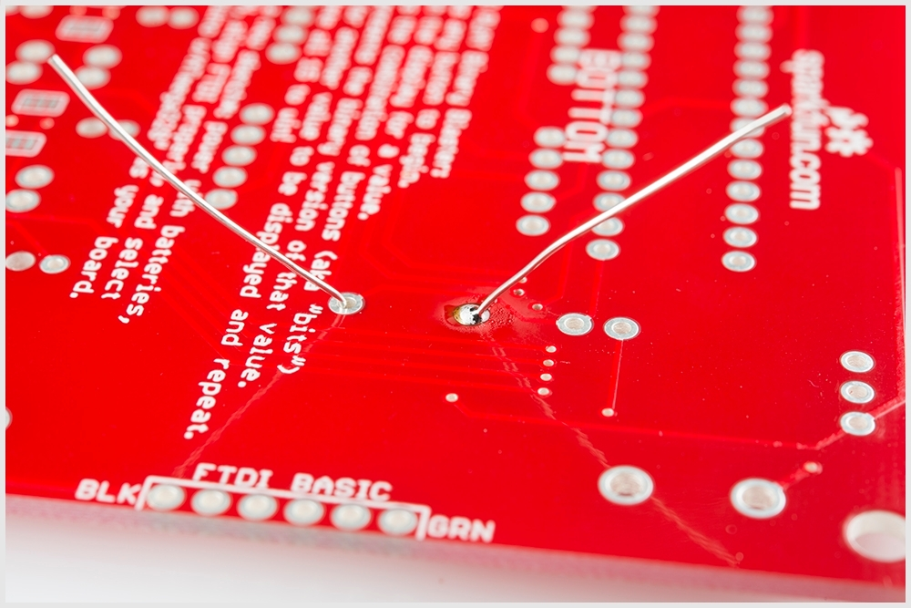

余分な脚を切り落とす。

## コンデンサ

0.1µFのコンデンサを2つ見つけよう。
これらは抵抗器とは少し見た目が異なる。
部品の底面から2本のリード線が伸びており、「104」という表記がある。
底面には「K5M」のような別の文字が書かれていることもある。

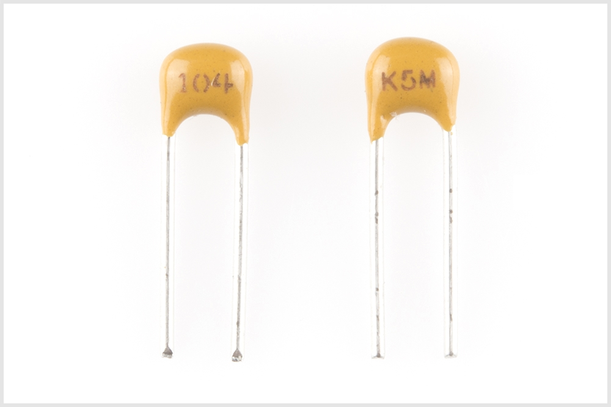

PCB上のそれぞれの位置を確認する。

コンデンサがPCBの表面に密着し、まっすぐ立っていることを確認する。
はんだ付けし、余分なリード線を切り落とす。

## マイクロコントローラ

マイクロコントローラを見つけよう。
このマイクロコントローラは[ATmega328](https://www.sparkfun.com/products/9061)である。
この部品には極性があるため、基板に正しく取り付けるよう特に注意する必要がある。
切り欠きに注目してほしい。

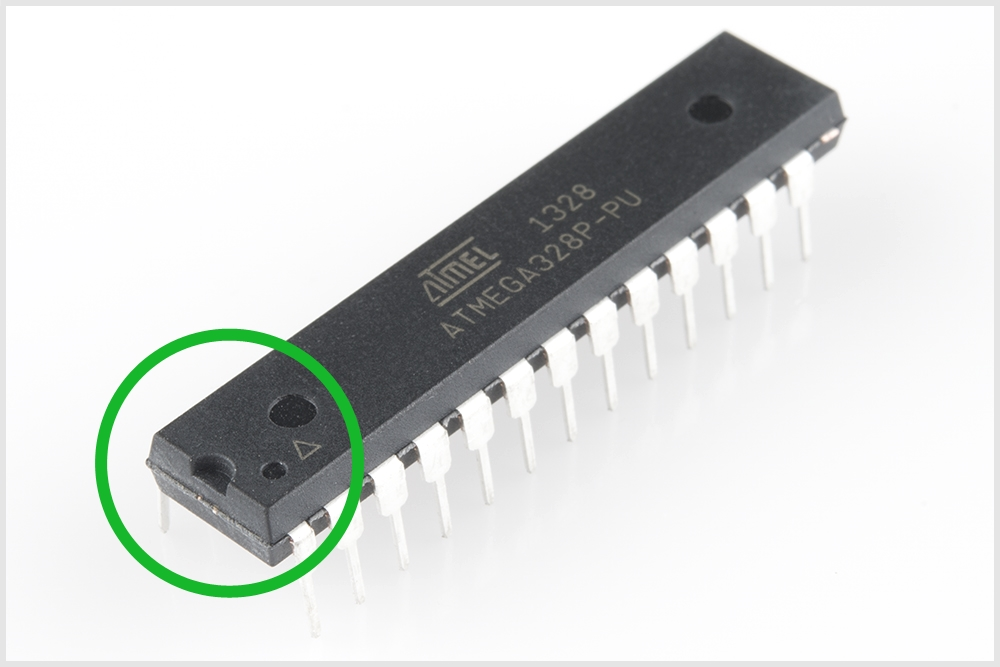

次に、PCB上の対応する位置を確認する。
ここでも、PCBの白い印刷の中に同じような切り欠きの記号があることに注目してほしい。

切り欠きの向きを正しく合わせながら、ATmega328をPCBに配置する。
最初の1本の脚をはんだ付けする際（どの脚からでもよい）、部品がPCBに密着した状態を保つようにする。

この部品のはんだ付けが終わると、基板の裏面は、きれいに並んだ火山のような形のはんだ接合になっているはずである。

## ブザーとスイッチ

[ブザー](https://www.sparkfun.com/products/7950)と[スライドスイッチ](https://www.sparkfun.com/products/102)を見つけよう。

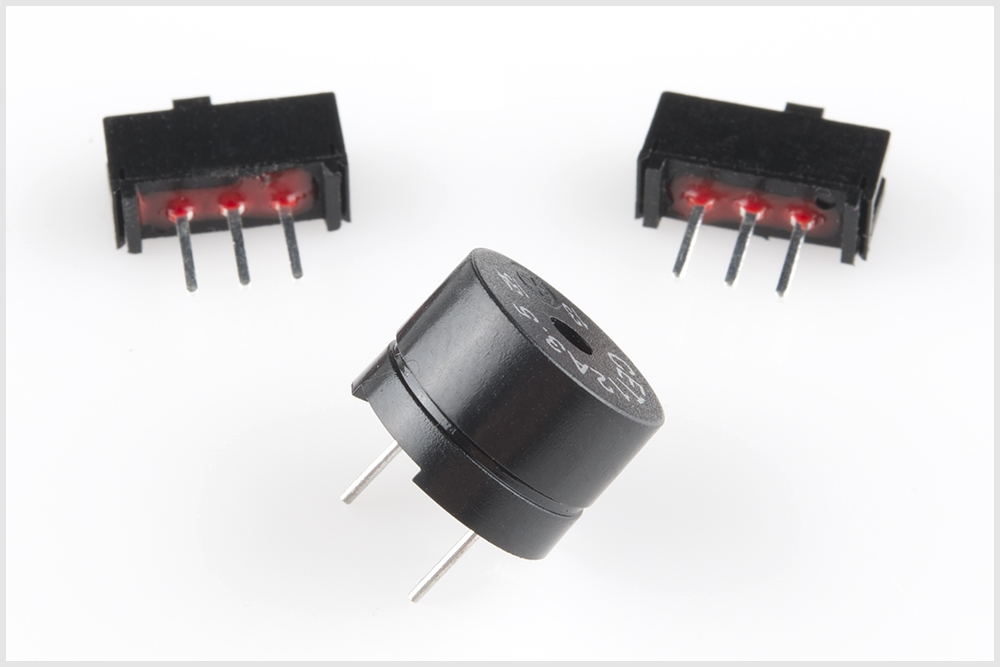

PCB上のそれぞれの位置を確認する。

部品をPCBに配置する。
裏返してはんだ付けする。
終わったら、PCBは次のような見た目になっているはずである。

> [!NOTE]
> ブザーには極性を示すマークが付いているが、基板にはんだ付けする向きはどちらでも問題ない。ブザーは向きにかかわらず正常に動作する。このガイドに沿って作業したい場合は、画像で示されているように「BIT 0」のシルクスクリーンに近い側に「＋」が来るようにブザーを挿入するとよい。もし向きを間違えてはんだ付けしてしまった場合は、はんだごとで両方のスルーホールを加熱し、部品を慎重に取り外すことでやり直せる。はんだ吸取り器やスラップ法を使って、PTHパッドに残ったはんだを取り除こう。ピンから余分なはんだを取り除いたら、ガイドどおりの向きでブザーをスルーホールに戻し、ピンを再びはんだ付けする。PTH部品をやり直す際は、パッドが剥がれてしまう危険があるため、はんだ接合部を十分に加熱するよう気をつけよう。

## 光るボタン

4個の[LED付きタクトボタン](https://www.sparkfun.com/products/10442)を見つけよう。

これらのボタンには極性がある。
白いプラスチックの脚の上面にある小さな「＋」の印に注目してほしい。

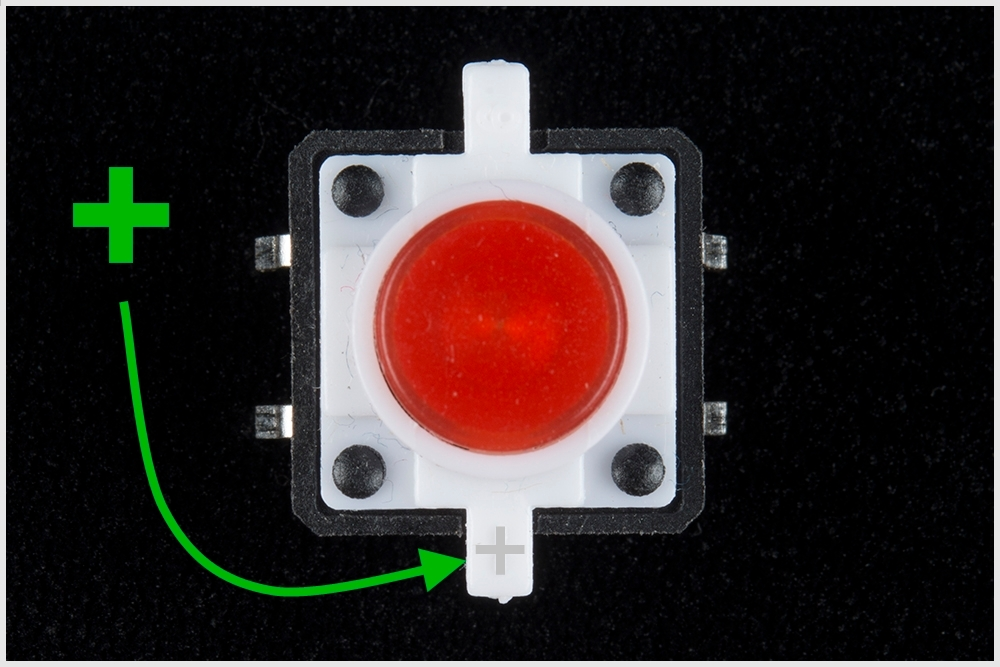

PCB上の4か所の位置を確認する。

PCB上の極性マークに注目する。
ボタンの「＋」側が、PCBの「＋」マークと揃っていることを確認する。

はんだ付けする。
終わったら、基板は次のような見た目になっているはずである。

## 7セグメントディスプレイ

2個の[7セグメントディスプレイ](https://www.sparkfun.com/products/8546)を見つけよう。

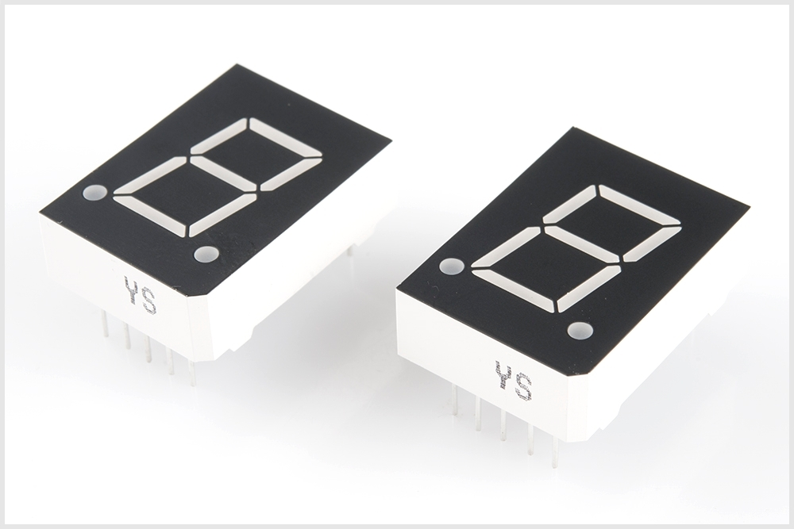

これらのディスプレイには極性がある。
数字の下にある小数点の位置に注目してほしい。

PCB上の2か所の位置を確認する。

PCB上の極性マークに注目する。
ディスプレイの小数点が、PCBの小数点マークと揃っていることを確認する。
はんだ付けする。
終わったら、基板は次のような見た目になっているはずである。

## 電池クリップ

4個の[電池クリップ](https://www.sparkfun.com/products/7949)を見つけよう。

PCB上の4か所の位置を確認する。

これらの部品には極性があり、裏面が外側を向くようにはんだ付けする必要がある。
向きを間違えると、電池が収まらなくなる。
基板に密着し、裏面が外側を向いていることを確認する。

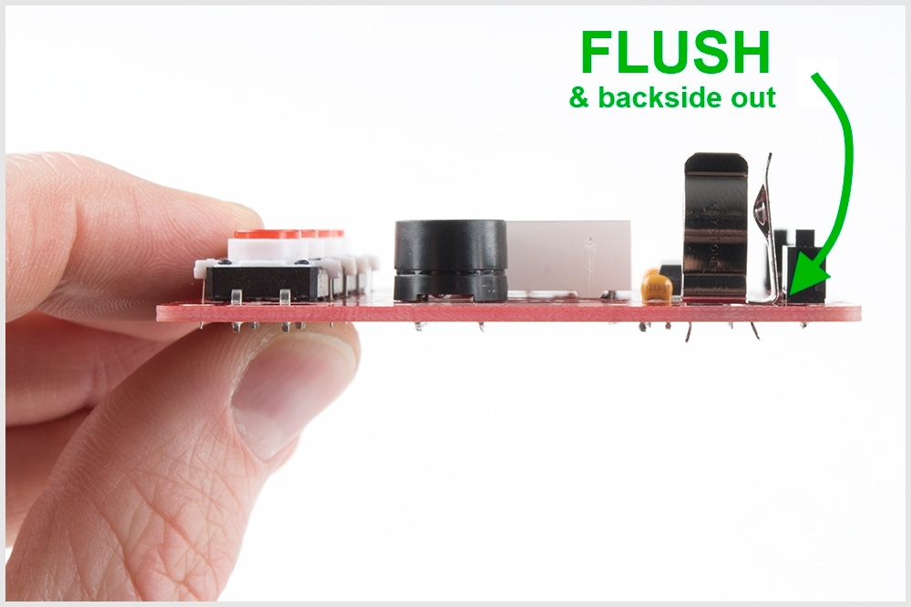

はんだ付けする。
終わったら、基板は次のような見た目になっているはずである。

## スタンドオフ

4個のプラスチック製スタンドオフと4本の金属ネジを見つけよう。

なお、これらをPCBに取り付けるのにドライバーは必要ない。
手で締めるだけで十分である。

スタンドオフを取り付けると、Binary Blasterはテーブルの上に平らに置けるようになる。

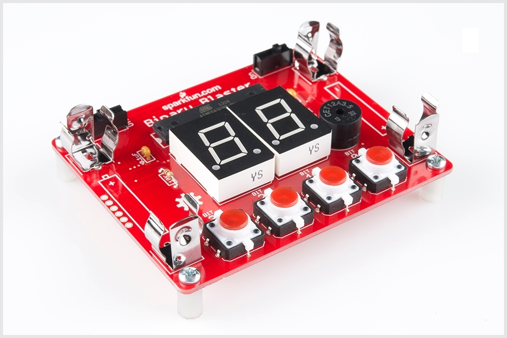

## 電池

2本の単3形電池を見つけよう。

これらには極性があるため、「＋」と「－」の向きを正しく合わせること。

電池をクリップに入れ、電源を入れて正しく取り付けられているか確認する。
電池が正しく入っていれば、LEDタクトボタンが点灯し、Binary Blasterに電源が入ったことを確認できるはずである。

## ゲームの遊び方

まず、Binary Blasterの電源を入れる。
電源用のスライドスイッチはPCBの左上にある。
「ON」の位置（左側）にスライドさせる。

サウンドスイッチも確認しておくとよいだろう。
音を鳴らしたいかどうかに応じて、左右どちらかにスライドさせる。

何も反応がない場合、電池の向きが間違っている可能性がある。
極性をもう一度確認してほしい。

電源を初めて入れると、ボタンが右から左へ素早く点灯し、その後ディスプレイが円を描くように点滅を始める。
この点滅は、LEDとディスプレイが正しく動作しているかを確認するための「起動処理」の一部である。

ディスプレイが円を描くパターンで点滅している間、Binary Blasterは新しいゲームを開始する準備ができている。

新しいゲームを始めるには、いずれかのボタンを押すだけでよい。

ディスプレイに最初の値が表示される。
これは毎回異なる値になりうる。

その値に対応する2進数を、4つのボタンで入力する必要がある。
参考になる対応表を示す。

| 10進数 | 2進数 |
| --- | --- |
| 1 | 0001 |
| 2 | 0010 |
| 3 | 0011 |
| 4 | 0100 |
| 5 | 0101 |
| 6 | 0110 |
| 7 | 0111 |
| 8 | 1000 |
| 9 | 1001 |
| 10 | 1010 |
| 11 | 1011 |
| 12 | 1100 |
| 13 | 1101 |
| 14 | 1110 |
| 15 | 1111 |

ボタンの使い方を示すいくつかの例を紹介する。

#### 例1

ディスプレイに「1」と表示された場合、対応する2進数「0001」を入力する必要がある。
つまり、「BIT 0」ボタン（一番右のボタン）を押すということである。
残りの3つのボタンには触れてはいけない（押さないこと）。
こうすることで、「BIT 0」だけを立てる（0のままにせず1にする）ことになる。

#### 例2

ディスプレイに「2」と表示された場合、対応する2進数「0010」を入力する必要がある。
つまり、「BIT 1」ボタン（右から2番目のボタン）を押すということである。
こうすることで、そのビットを立てる（0のままにせず1にする）ことになる。

#### 例3

ディスプレイに「5」と表示された場合、対応する2進数「0101」を入力する必要がある。
つまり、**「BIT 0」と「BIT 2」のボタンを同時に押す**ということである。

数秒以内に正しい値を入力できなければ、Binary Blasterはタイムアウトし、そのラウンドは失敗となる。
もう一度挑戦するには、いずれかのボタンを押すだけでよい。

正しい2進数を入力すると、次のランダムな値に進む。
全部で15問ある。
タイムアウトすることなく15問すべてを変換できればクリアである。

新しいゲームを始めるたびに、出題順序は変わる。
これは、パターンを筋肉記憶で覚えるのではなく、変換そのものを学べるようにするための工夫である。
また、15問すべてを終えると、ディスプレイに「スコア」が表示される。
これは、クリアするのにかかった秒数である。
変換の練習を重ねるにつれて、この数字をどんどん小さくできるはずである。
健闘を祈る。

標準の遊び方（10進数変換）を極めたら、16進数表記から2進数への変換にも挑戦してみるとよい。
16進モードでは、Binary Blasterは10〜15の値を16進数で表示する。
なお、小さい値（1〜9）はどちらの表記でも同じであるため、10進数のまま表示される。

### 16進モード

**16進モードで遊ぶには、次の3つの手順に従う。**

1. Binary Blasterの電源を切る。
2. 「BIT 0」ボタンを押したままにする。
3. 「BIT 0」ボタンを押したまま、Binary Blasterの電源を再び入れる。ディスプレイに「A b C d E F」と表示されるはずである。これで16進モードに入った。標準の10進モードに戻すには、ボタンを何も押さずに電源を入れ直すだけでよい。

参考になる16進数の対応表を示す。

| 10進数/16進数 | 2進数 |
| --- | --- |
| 1 | 0001 |
| 2 | 0010 |
| 3 | 0011 |
| 4 | 0100 |
| 5 | 0101 |
| 6 | 0110 |
| 7 | 0111 |
| 8 | 1000 |
| 9 | 1001 |
| A | 1010 |
| b | 1011 |
| C | 1100 |
| d | 1101 |
| E | 1110 |
| F | 1111 |

Binary Blasterを楽しんでもらえたら幸いである。

## ボタンのトラブルシューティング

ボタンのひとつが点灯しない場合でも、心配は要らない。簡単な直し方がある。
LEDが点灯しない原因としてもっとも多いのは、極性の間違いである。
Binary BlasterのPCBには、これを直すための特別な工夫が施されている。
2本の配線パターンを切断し、2つのジャンパーを閉じるだけで、ボタンを取り外すことなく極性を入れ替えられる。

まず、問題のあるボタンの隣にあるはんだジャンパーを見つける。
それぞれのボタンには2つのジャンパーがあり、PCBの裏面、各ボタンの近くにある。

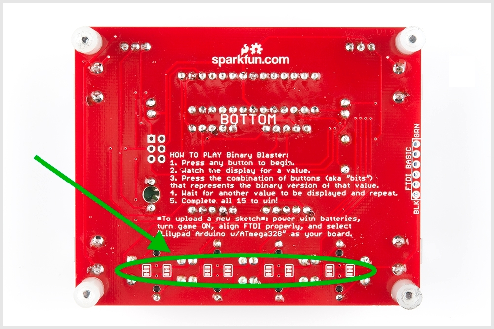

それぞれのジャンパーには、中央のパッドとデフォルトの極性設定をつなぐ小さな配線パターンがある。
この小さな配線パターンは見えにくいことがあるが、明るい赤色をした細い金属の筋として見えるはずである。
[ホビーナイフ](https://www.sparkfun.com/products/9200)（Xactoナイフとも呼ばれる）を使って、デフォルトの配線パターンを切断する。

はんだごてを使って、中央のパッドともう一方の外側のパッドの間にジャンパーを作る。

これで、そのLEDにつながる配線パターンの極性が入れ替わり、LEDが点灯するようになるはずである。

## まとめ

Binary Blasterの設計をさらに理解したい場合は、まず設計ファイルを確認してみるとよい。
ハードウェアとファームウェアのファイル一式は、GitHubリポジトリで公開されている。

- [Binary Blaster GitHub Repo（Binary BlasterのGitHubリポジトリ）](https://github.com/sparkfun/Binary_Blaster)

Binary BlasterのゲームはArduinoで再プログラムできる。
つまり、ゲームのルールを変えたり、機能を追加したり、まったく別のプロジェクトに作り変えたりすることもできるということである。
Arduinoでの再プログラムについて詳しくは、次のチュートリアルを参照してほしい。

- [What is an Arduino?（Arduinoとは何か）](./what-is-an-arduino.md)

タグ: オーディオ、ゲーム、接続ガイド、プログラミング、はんだ付け

---

出典：[Binary Blaster Assembly Guide](https://learn.sparkfun.com/tutorials/binary-blaster-assembly-guide)（SparkFun Learn）を日本語に翻訳し、再構成した。
原文は [CC BY-SA 4.0](https://creativecommons.org/licenses/by-sa/4.0/) ライセンスで公開されており、本ページも同ライセンスの下で提供する。
