# ボタンとスイッチの基礎

もっとも基本的でありながら見落とされがちな回路部品の1つが、**スイッチ**である。

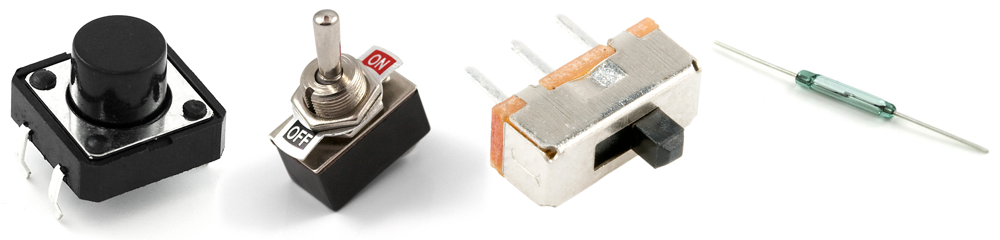

スイッチを評価するのに複雑な計算式は必要ない。
スイッチがしているのは、開放回路と短絡回路を切り替えることだけである。
単純な部品だが、ボタンやスイッチなしで暮らすことなど考えられるだろうか。
ユーザーからの入力を受け付けないブリンク回路に何の意味があるだろうか。
非常停止スイッチのない危険なロボットなど論外である。
[絶対に押してはいけない](http://www.youtube.com/watch?v=ku2wFaaPAzI)大きな赤いボタンのない世界を想像できるだろうか。

このチュートリアルで扱う内容:

- モーメンタリー（自動復帰）スイッチとメンテイン（維持）スイッチの違い
- SPST、SPDT、DPDTなどの表記が何を意味するか
- ノーマリークローズとノーマリーオープンのボタンの違い
- スイッチのさまざまな見た目
- 重要なスイッチの定格
- スイッチの応用例

参考になるチュートリアル:

- [回路とは何か](./what-is-a-circuit.md) 特に[開放回路と短絡回路](./what-is-a-circuit.md)の違いを押さえておくとよい
- [電圧、電流、抵抗とオームの法則](./voltage-current-resistance-and-ohms-law.md)
- [電力](./electric-power.md)
- [テスターの使い方](./how-to-use-a-multimeter.md)
- [2進数](./binary.md)

## スイッチとは何か

**スイッチ**は、電気回路が開いているか閉じているかを制御する部品である。
配線を実際に切ったり継ぎ足したりすることなく、回路内の電流の流れを制御できる。
スイッチは、ユーザーの操作や制御を必要とするあらゆる回路に欠かせない部品である。

スイッチが取りうる状態は、開（オフ）か閉（オン）のどちらか一方だけである。
**オフ**の状態では、スイッチは回路の中に開いた隙間があるように見える。
これは実質的に**開放回路**であり、電流が流れるのを妨げる。

**オン**の状態では、スイッチは完全に導通する1本の電線のようにふるまう。
つまり短絡である。
これにより**回路が閉じ**、システムが「オン」になって、残りの部分に電流が滞りなく流れられるようになる。

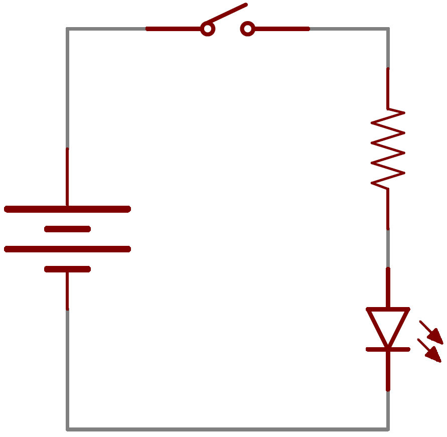

スイッチにはトグル式、ロータリー式、DIP式、押しボタン式、ロッカー式、メンブレン式など、実にさまざまな種類がある。
それぞれのスイッチには、他と区別するための固有の特徴がある。
どんな動作でスイッチが切り替わるか、あるいはスイッチがいくつの回路を制御できるか、といった特徴である。
次は、スイッチの基本的な特徴をいくつか見ていこう。

## スイッチを特徴づける要素

### 操作方法

ある状態から別の状態へ切り替えるには、スイッチを**操作**（アクチュエート）する必要がある。
つまり、スイッチの状態を「切り替える」には何らかの物理的な動作が必要になる。
スイッチの操作方法は、そのスイッチを特徴づけるもっとも大きな要素の1つである。

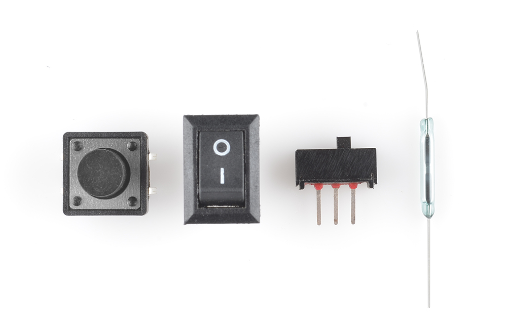

スイッチの操作には、押す、スライドさせる、揺らす、回す、倒す、引く、鍵を回す、加熱する、磁化する、蹴る、はじく……など、スイッチ内部の機械的な接点を接触させたり離したりできる物理的な動作であれば、どんなものでもありうる。

### モーメンタリーとメンテイン

すべてのスイッチは、モーメンタリー（自動復帰）かメンテイン（維持）のどちらかに分類できる。

**メンテイン**スイッチは、壁の照明スイッチのように、操作されるまで1つの状態を保ち続け、新しい状態に切り替わった後もその状態を保つ。
「トグルスイッチ」や「ON/OFFスイッチ」と呼ばれることもある。

**モーメンタリー**スイッチは、操作され続けているあいだだけ有効な状態を保つ。
操作されていなければ、常に「オフ」の状態に戻る。
キーボードのキーは、身近なモーメンタリースイッチの代表例である。

用語について1つ補足しておくと、一般に「ボタン」と呼ばれるスイッチの多くはモーメンタリー型に分類される。
ボタンを押すという操作自体が、いかにも「押している間だけ」という感覚に結びつくからである。
中には[メンテイン式のボタン](https://www.sparkfun.com/products/9808)も存在するが、このチュートリアルで単に「ボタン」と言うときは、基本的に「押している間だけオンになるモーメンタリースイッチ」を指すものと考えてほしい。

### 実装方法

多くの部品と同じく、スイッチの端子の形式も表面実装（SMD）かスルーホール（PTH）のどちらかになる。
スルーホール型のスイッチはたいてい大きめで、[ブレッドボード](./how-to-use-a-breadboard.md)での試作に使いやすいよう設計されているものもある。

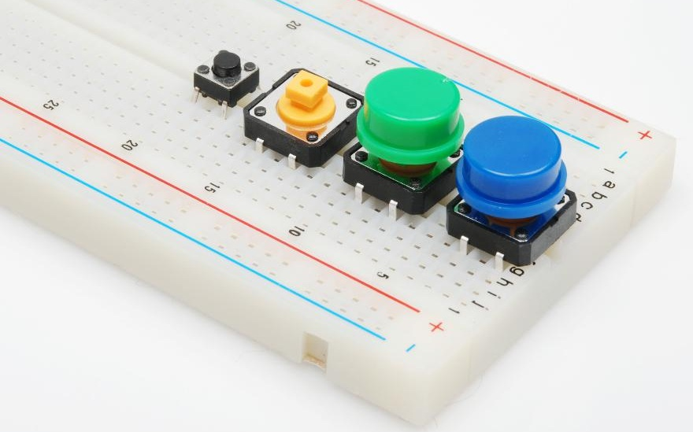

SMD型のスイッチはPTH型より小さく、PCBの上に平らに実装される。
たいてい軽い力での操作を前提としており、スルーホール型ほどの操作力には耐えられないことが多い。

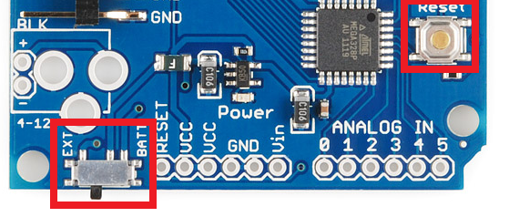

筐体の外側に取り付けるパネルマウント型のスイッチも、よく使われる実装方法の1つである。
筐体の内側に隠れたスイッチは操作しづらい。
パネルマウント型のスイッチには、PTH、SMD、あるいは配線をはんだ付けする頑丈なラグ端子など、さまざまな端子形式がある。

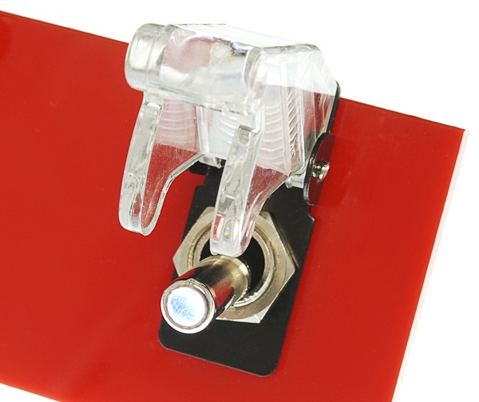

もう1つ重要なスイッチの特徴として、スイッチ内部の回路構成があり、これは章を1つ割くだけの価値がある話題である。
SPSTなのか、DPSTなのか、4PDTなのか、こうした表記は、いったい何を意味しているのだろうか。

## 極（ポール）と投（スロー）、開と閉

スイッチには少なくとも2本の端子が必要であり、一方から電流が（場合によっては）入り、もう一方から（場合によっては）出ていく。
ただし、これはもっとも単純なスイッチの説明にすぎない。
実際には、スイッチに2本より多くのピンがあることのほうが多い。
では、こうした端子はスイッチの内部構造とどう対応しているのだろうか。
ここで重要になるのが、スイッチが持つ「極（ポール）」と「投（スロー）」の数である。

スイッチの**極**（ポール）の数は、そのスイッチが制御できる独立した回路の数を表す。
極が1つのスイッチは、1つの回路にしか影響を与えられない。
4極のスイッチなら、4つの異なる回路を個別に制御できる。

スイッチの**投**（スロー）の数は、それぞれの極が接続できる位置の数を表す。
たとえば投が2つのスイッチなら、スイッチ内の各回路（極）は2つの端子のどちらかに接続できる。

極と投の数がわかれば、スイッチをより具体的に分類できる。
よく見かけるのは「単極単投」「単極双投」「双極双投」といった分類で、それぞれ略してSPST、SPDT、DPDTと呼ばれる。

#### SPST

単極単投（**SPST**）スイッチは、もっとも単純な構成である。
出力が1つ、入力が1つしかない。
このスイッチは閉じているか、完全に切り離されているかのどちらかである。
SPSTはオンとオフの切り替えに最適であり、[モーメンタリー](#モーメンタリーとメンテイン)スイッチの一般的な形式でもある。
SPSTスイッチに必要な端子は**2本だけ**である。

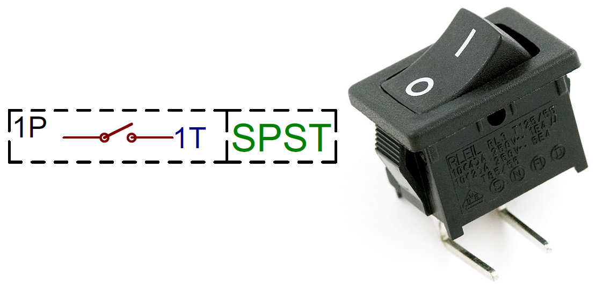

#### SPDT

もう1つよく使われるのが**SPDT**である。
SPDTには3本の端子があり、1本の共通ピンと、共通ピンとの接続を奪い合う2本のピンで構成される。
SPDTは、2つの電源の切り替えや入力の入れ替えなど、2つの回路のどちらかを選びたい場面に適している。
シンプルなスライドスイッチの多くはSPDT型である。
SPDTスイッチにはたいてい**3本の端子**がある（余談だが、SPDTの投を1つ未接続のままにしておけば、実質的にSPSTとして使うこともできる）。

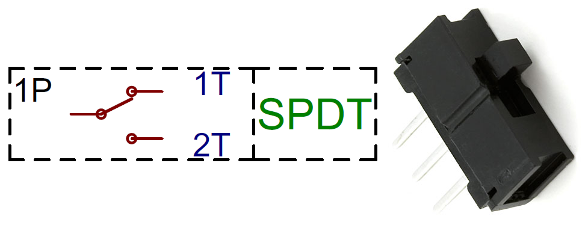

#### DPDT

SPDTにもう1つ極を追加すると、双極双投（**DPDT**）スイッチになる。
基本的にはSPDTスイッチを2つ組み合わせたもので、2つの独立した回路を制御できるが、常に1つのアクチュエーターで一緒に切り替わる。
DPDTには**6本の端子**がある。

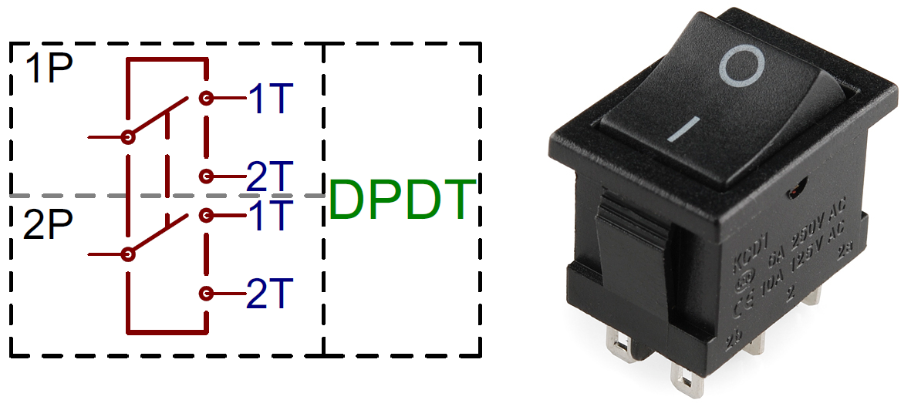

#### XPYT

3極以上、あるいは3投以上のスイッチはあまり一般的ではないが、実際に存在する（形も独特で接続もしにくいことが多い）。
極や投が2つを超えると、略称にはそのまま数字を当てはめていく。
たとえば4PDTスイッチは、4つの独立した回路を、それぞれ2つの位置で制御できる。

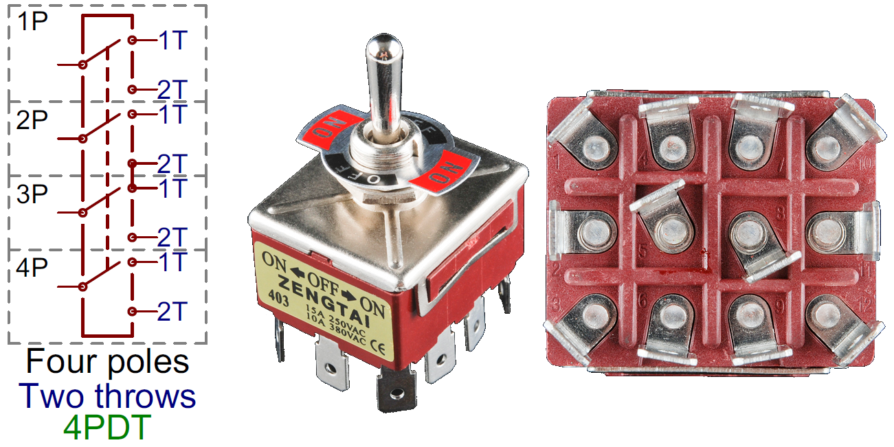

> [!NOTE]
> 豆知識：英語では"poles"（極）を"pulls"と間違えて発音してしまう人がよくいるが、正しくは"poles"である。

### ノーマリーオープンとノーマリークローズ

モーメンタリースイッチが操作されていないとき、それは「通常」の状態にある。
ボタンの構造によって、この通常の状態は開放回路にも短絡回路にもなりうる。
操作されるまで開いているボタンは**ノーマリーオープン**（略してNO）と呼ばれる。
NOスイッチを操作すると回路が閉じるため、「push-to-make（押して導通させる）」スイッチとも呼ばれる。

逆に、操作されない限り短絡回路のようにふるまうボタンは**ノーマリークローズ**（NC）スイッチと呼ばれる。
NCスイッチは「push-to-break（押して遮断する）」であり、操作すると回路が開く。

この2つのうち、ノーマリーオープンのモーメンタリースイッチに出会う機会のほうがずっと多いだろう。

## モーメンタリースイッチ

モーメンタリースイッチは、操作されている（押されている、保持されている、磁化されているなど）あいだだけオンの状態を保つスイッチである。
たいていは、リセットボタンやキーパッドのボタンのように、断続的なユーザー入力に使うのに適している。

### モーメンタリースイッチの例

#### 押しボタン

押しボタンスイッチは、モーメンタリースイッチの代表格である。
たいてい押したときに心地よい「クリック」というタクタイルフィードバックがある。
大きさや色、照光式（内部のLEDがボタン越しに光る）など、実にさまざまなバリエーションがある。
端子はスルーホール、表面実装、パネルマウントなど、いろいろな形式がある。

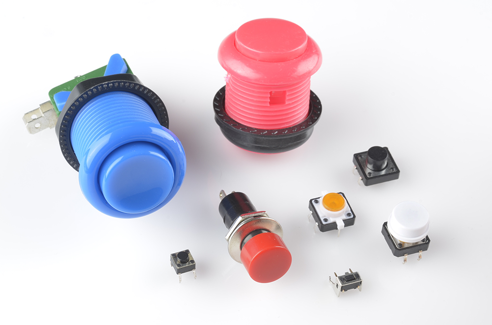

#### ボタンマトリクス

キーボードのような大量のモーメンタリーボタンの集まりや、キーパッドのようなもう少し小さなまとまりでは、たいていすべてのスイッチを大きなマトリクス状に配置する。
パッド上のそれぞれのボタンには、行と列が割り当てられる。
これによりマイコン側で多少の処理が余分に必要になるが、その分I/Oピンを大幅に節約できる。

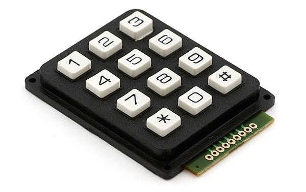

#### その他

モーメンタリースイッチは、必ずしも押し下げる動作で操作するとは限らない。
一部のジョイスティックのように、横に押す動作で操作するものもある。

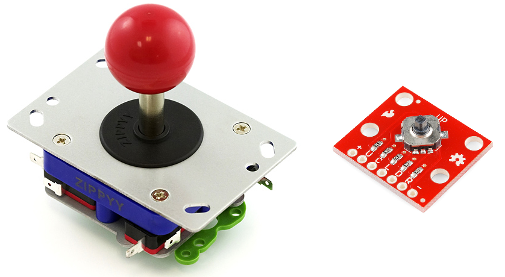

もう一方の極端な例として、[リードスイッチ](https://www.sparkfun.com/products/8642)は磁場にさらされると開閉する。
非接触式のスイッチを作るのに適している。

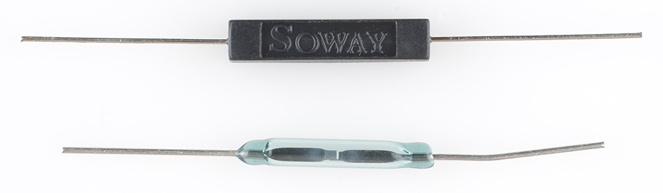

## メンテインスイッチ

メンテインスイッチは、新しい状態に操作されるまでその状態を保ち続ける。
身近な例は、すぐそこの壁にある（部屋の照明を制御しているあのスイッチである）。
メンテインスイッチは、電源のオンとオフのように「一度設定したらそのまま」にしておきたい用途に適している。

### メンテインスイッチの例

#### スライドスイッチ

飾り気のないシンプルなON/OFFスイッチや切り替えスイッチが必要なら、スライドスイッチがぴったりかもしれない。
このスイッチにはスイッチ本体から突き出た小さなつまみがあり、それを本体の上でスライドさせて2つ（またはそれ以上）の位置のどれかに合わせる。

スライドスイッチはたいていSPDTかDPDTの構成で見られる。
共通端子はたいてい中央にあり、2つの選択位置がその両側に配置される。

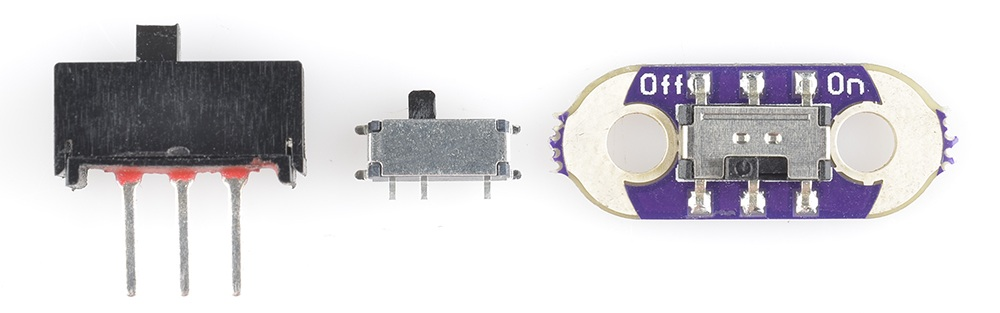

#### トグルスイッチ

「トグルスイッチ」と聞くと、「ミサイル発射！」のようなイメージを思い浮かべるかもしれない。
トグルスイッチには長いレバーがあり、揺らすような動きで動作する。
新しい位置に切り替わるとき、トグルスイッチは実に気持ちのよい「カチッ」という音を立てる。

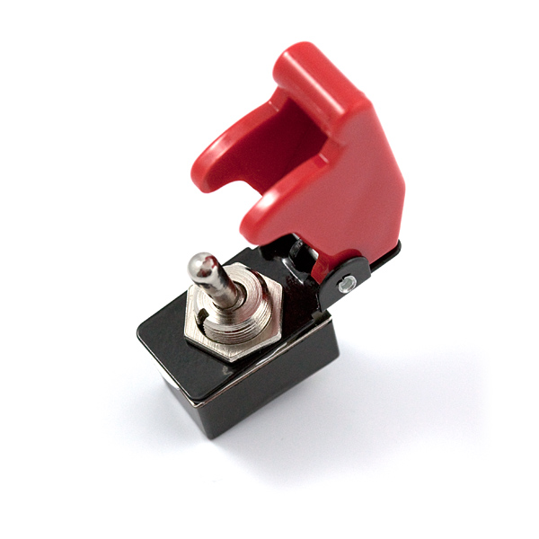

トグルスイッチには[SPST](https://www.sparkfun.com/products/9276)（2端子）やSPDT（3端子）が一般的だが、それ以外の構成のものも見つかる。
他のスイッチと同じく、スルーホール型、表面実装型、そしておそらくもっとも一般的なパネルマウント型がある。

#### DIPスイッチ

DIPスイッチは、スルーホール型のDIP ICと同じ考え方で設計されたスルーホール型のスイッチである。
DIP ICと同じように、中央部分をまたぐ形で[ブレッドボード](./how-to-use-a-breadboard.md)に配置できる。
8個以上の独立したSPSTスイッチが、小さなスライドレバーとともに配列されている製品が多い。
コンピュータの黎明期には広く使われていたが、今でもハードウェア側で機器を設定する用途に役立っている。

#### ラッチングボタン

押しボタンのすべてがモーメンタリーというわけではない。
[一部の押しボタン](https://www.sparkfun.com/products/9808)は、一度押すとその位置で固定され、もう一度押すまでその状態を保つ。
ギターのエフェクトペダルにあるようなスイッチが、この一例である。

#### その他

メンテインスイッチの多様さは、ここで紹介した以上に広がっている。
[プルチェーンスイッチ](https://www.sparkfun.com/products/11136)はプロジェクトに気の利いた雰囲気を加えてくれる。
[キースイッチ](https://www.sparkfun.com/products/14947)は、誰にでも殺人ロボットの電源を入れられては困る場面に。
テスターに付いているような[ロータリースイッチ](https://www.sparkfun.com/products/10064)は、特に多くの投を必要とする場面でユニークな入力手段になる。

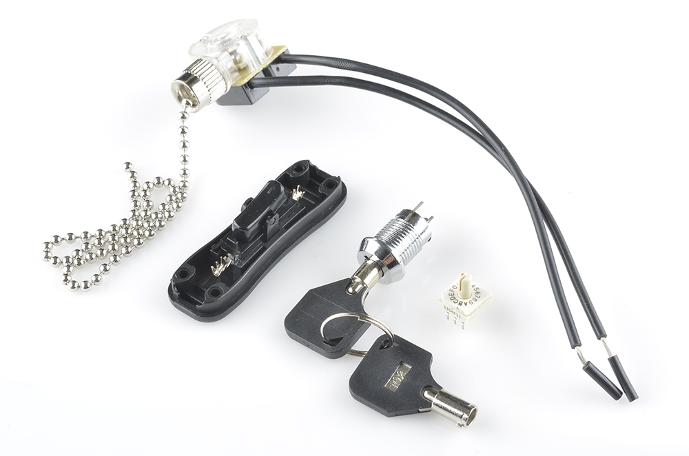

そしてもちろん、あの大きな[ナイフスイッチ](http://www.youtube.com/watch?v=mOPTriLG5cU)なしで暮らせるマッドサイエンティストなどいないだろう。

## スイッチの応用例

### オンとオフの制御

スイッチのもっとも身近な応用が、単純なオンとオフの制御である。
暗い部屋に入るたびにしているあの動作である。
オンとオフスイッチは、電源ラインに**直列**にSPSTスイッチを1つ挟むだけで実現できる。
たいていはトグルスイッチやスライドスイッチのようなメンテイン型が使われるが、モーメンタリー型のオンとオフスイッチにも用途はある。

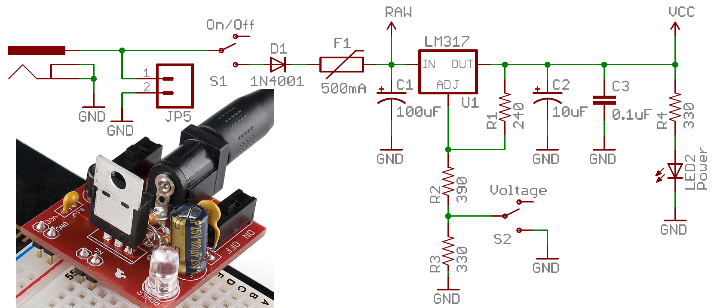

このようなスイッチを実装するときは、プロジェクトが消費するすべての電流がそのスイッチを通ることになる点に注意してほしい。
理想的にはスイッチは完全な導体だが、現実には2つの接点のあいだにわずかな抵抗がある。
その抵抗のせいで、すべてのスイッチには耐えられる**最大電流**の定格が定められている。
スイッチの最大電流定格を超えると、プラスチックが溶けたり、魔法の煙が出てきたりすることになる。

たとえば、この[SPDTスライドスイッチ](https://www.sparkfun.com/products/102)は、小規模なプロジェクト（Simon風のゲームやメトロノームなど）の電流を制御するのには適しているが、大出力のモータードライバーや100個連なったLEDストリングの制御には向かない。
そうした用途には、[4A対応のトグルスイッチ](https://www.sparkfun.com/products/9276)や[6A対応のランプスイッチ](https://www.sparkfun.com/products/11477)のようなものを検討するとよい。

### ユーザー入力

もちろん、ユーザー入力もスイッチのもっとも一般的な応用の1つである。
たとえばスイッチをマイコンの入力ピンに接続したいなら、次のような簡単な回路だけで済む。

スイッチが開いているとき、MCUのピンは抵抗を通して5Vにつながっている。
スイッチが閉じると、ピンは直接GNDにつながる。
この回路の抵抗は[プルアップ抵抗](./pull-up-resistors.md)であり、入力をハイにバイアスし、スイッチが閉じたときにグラウンドへの短絡が起きないようにするために必要である。

## まとめ

これでスイッチの基礎はひととおりカバーできた。
次は、次のような関連するチュートリアルを探ってみるとよい。

- [プルアップ抵抗](./pull-up-resistors.md)：プルアップ抵抗は、モーメンタリーボタンのほとんどの回路と組み合わせて使われる。電源とグラウンドが短絡しないようにし、I/Oラインがフローティングにならないようにしてくれる。
- [トランジスタ](./transistors.md)：これも（他の多くの用途とあわせて）電子的に制御できるスイッチのようなものとして使える。
- リレー：もう1つの電子的に制御できるスイッチであり、大電力の回路のオンとオフに適している（SparkFun Learnには独立したリレーの概念解説チュートリアルは現時点で存在しない）。
- [加速度センサーの基礎](./accelerometer-basics.md)：スマートフォンや新しいゲームコントローラーに搭載されている動き検出用の加速度センサーは、こうした従来型のスイッチに代わる入力デバイスとして急速に普及している。
- [プロジェクトへの電源供給](./how-to-power-a-project.md)：あなたのスイッチは、どんな電源をオンとオフすることになるだろうか。

タグ: 部品、概念、電気工学、入力デバイス、技術

---

出典：[Button and Switch Basics](https://learn.sparkfun.com/tutorials/button-and-switch-basics)（SparkFun Learn）を日本語に翻訳し、再構成した。
原文は [CC BY-SA 4.0](https://creativecommons.org/licenses/by-sa/4.0/) ライセンスで公開されており、本ページも同ライセンスの下で提供する。
