# コンデンサ

**コンデンサ**は、2端子の電子部品である。
[抵抗器](./resistors.md)やインダクタと並んで、もっとも基本的な**受動部品**の1つであり、コンデンサがまったく使われていない回路を探すほうが難しいくらいである。

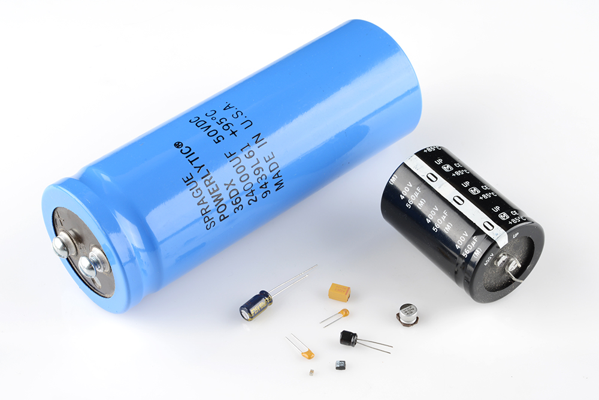

コンデンサを特別な存在にしているのは、**エネルギーを蓄える**能力である。
いわば、満充電の電池のようなものだ。
一般に*キャパシタ*とも呼ばれるこの部品は、回路の中であらゆる重要な役割を担っており、局所的なエネルギーの蓄積、電圧スパイクの抑制、複雑な信号のフィルタリングなど、その用途は幅広い。

このチュートリアルで扱う内容:

- コンデンサがどう作られているか
- コンデンサがどう動作するか
- 静電容量の単位
- コンデンサの種類
- コンデンサの見分け方
- 静電容量が直列や並列でどう合成されるか
- コンデンサのよくある応用例

参考になるチュートリアル:

- [電気とは何か](./what-is-electricity.md)
- [電圧、電流、抵抗とオームの法則](./voltage-current-resistance-and-ohms-law.md)
- [回路とは何か](./what-is-a-circuit.md)
- [直列回路と並列回路](./series-and-parallel-circuits.md)
- [テスターの使い方](./how-to-use-a-multimeter.md)
- [メートル法の接頭辞](./metric-prefixes-and-si-units.md)

## 記号と単位

### 回路図記号

コンデンサを回路図に描く方法には、一般的なものが2通りある。
コンデンサには常に2つの端子があり、そこから回路の残りの部分へとつながる。
コンデンサの記号は、平行な2本の線（まっすぐなものと、曲がったもの）で表され、どちらの記号でも2本の線は互いに平行で、近くにあるが接触してはいない（これは実際の[コンデンサの構造](#コンデンサの理論)をそのまま表している）。
言葉で説明するより、見たほうが早い。

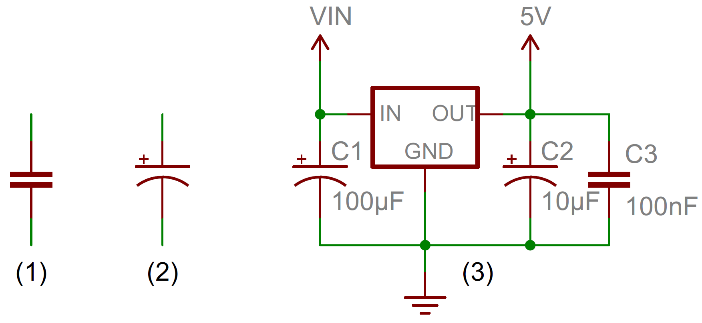

曲線を使った記号（上の写真の2番目）は、そのコンデンサが[極性を持つ](https://learn.sparkfun.com/tutorials/polarity)こと、つまりおそらく電解コンデンサであることを示している。
詳しくは、このチュートリアルの後半にある「コンデンサの種類」の節で説明する。

それぞれのコンデンサには、C1、C2のような名前と、値が添えられる。
この値は、そのコンデンサの静電容量、つまり何ファラドあるかを示す。
ファラドという単位について、もう少し詳しく見ていこう。

### 静電容量の単位

すべてのコンデンサが同じというわけではない。
それぞれのコンデンサは、決まった大きさの静電容量を持つように作られている。
コンデンサの**静電容量**は、**どれだけの電荷を蓄えられるか**を表す量であり、静電容量が大きいほど蓄えられる電荷の量も多くなる。
静電容量の標準単位は**ファラド**（記号 *F*）と呼ばれる。

実は1ファラドというのは*非常に*大きな静電容量であり、0.001F（1ミリファラド、1mF）であっても十分に大きなコンデンサになる。
実際に使われるコンデンサの多くは、ピコファラド（10⁻¹²）からマイクロファラド（10⁻⁶）程度の範囲に収まる。

| 接頭辞の名前 | 記号 | 倍率 | ファラド換算 |
| --- | --- | --- | --- |
| ピコファラド | pF | 10⁻¹² | 0.000000000001 F |
| ナノファラド | nF | 10⁻⁹ | 0.000000001 F |
| マイクロファラド | µF | 10⁻⁶ | 0.000001 F |
| ミリファラド | mF | 10⁻³ | 0.001 F |
| キロファラド | kF | 10³ | 1000 F |

ファラドからキロファラドの範囲に入ってくると、*スーパー*キャパシタや*ウルトラ*キャパシタと呼ばれる特殊なコンデンサの話になってくる。

## コンデンサの理論

> [!NOTE]
> ここで説明する内容は、電子工作を始めたばかりの人にとって必ずしも重要ではなく、後半になるほど話が少し込み入ってくる。
> 「コンデンサの作り方」の節はぜひ読んでほしいが、それ以外の節は、難しく感じたら読み飛ばしてもかまわない。

### コンデンサの作り方

コンデンサの回路記号は、実際の構造をかなり忠実に表している。
コンデンサは、2枚の金属板と、**誘電体**と呼ばれる絶縁材料からできている。
2枚の金属板は互いにごく近い距離で平行に配置されるが、誘電体がそのあいだに挟まることで、金属板どうしが直接触れ合わないようになっている。

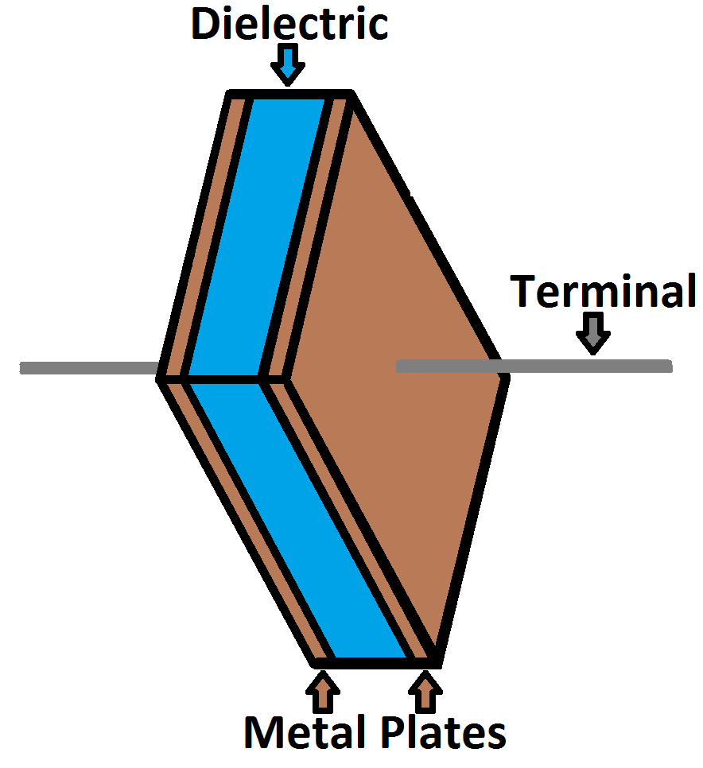

誘電体には、紙、ガラス、ゴム、セラミック、プラスチックなど、電流の流れを妨げるものであればさまざまな絶縁材料が使われる。

金属板には、アルミニウム、タンタル、銀といった導電性の材料が使われる。
それぞれの金属板は端子用の配線につながっており、最終的に回路の他の部分と接続される。

コンデンサの静電容量、つまり何ファラドあるかは、その構造によって決まる。
静電容量を大きくするには、より大きなコンデンサが必要になる。
金属板が重なり合う面積が大きいほど静電容量は大きくなり、金属板どうしの距離が離れるほど静電容量は小さくなる。
誘電体の材質も、コンデンサの静電容量に影響を与える。
コンデンサの静電容量は、次の式で計算できる。

\\[ C = \varepsilon_r \, \varepsilon_0 \, \frac{A}{d} \\]

ここで *εr* は誘電体の[比誘電率](https://ja.wikipedia.org/wiki/比誘電率)（誘電体の材質によって決まる定数）、*A* は金属板が重なり合う面積、*d* は金属板どうしの距離である。

### コンデンサの動作原理

[電流](./voltage-current-resistance-and-ohms-law.md)とは[電荷](./what-is-electricity.md)の流れであり、電子部品はこの電荷の流れを利用して光ったり回転したりと、それぞれの働きをしている。
電流がコンデンサに流れ込むと、その電荷は絶縁性の誘電体を通り抜けられないため、金属板の上に「取り残される」。
電子、つまり負の電荷を持つ粒子が一方の金属板に吸い寄せられ、その板全体が負に帯電する。
一方の板に集まった大量の負の電荷は、もう一方の板にある同じ負の電荷を押しのけ、その結果もう一方の板は正に帯電する。

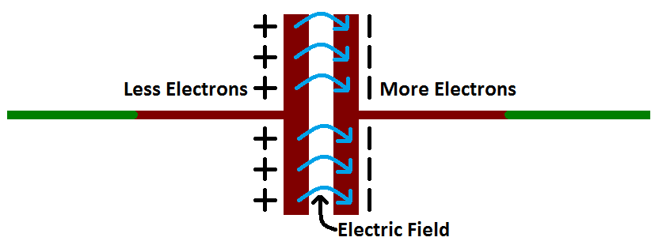

それぞれの板の正負の電荷は、異符号どうしなので互いに引き合う。
しかし、あいだに誘電体が挟まっているため、どれだけ引き合いたくても、電荷は（他に行き場が見つかるまで）その板の上に永遠に留まり続ける。
これらの板の上で静止した電荷は[電場](./what-is-electricity.md)を作り出し、それが[電気的な位置エネルギー](./what-is-electricity.md)や[電圧](./voltage-current-resistance-and-ohms-law.md)に影響を与える。
このように電荷がコンデンサの上に集まると、電池が化学エネルギーを蓄えるのとちょうど同じように、コンデンサは電気エネルギーを蓄えていることになる。

#### 充電と放電

正負の電荷がコンデンサの金属板の上にそれぞれ集まると、そのコンデンサは**充電された**状態になる。
コンデンサが電場を保持し、電荷を保ち続けられるのは、それぞれの板の正負の電荷が互いに引き合いながらも、決して触れ合うことがないからである。

やがて、コンデンサの金属板は電荷でいっぱいになり、それ以上受け入れられなくなる。
一方の板に集まった負の電荷が十分に多くなると、新たに加わろうとする負の電荷を押し返すようになる。
ここで関係してくるのが、コンデンサの**静電容量**（ファラド）であり、これがそのコンデンサに蓄えられる電荷の最大量を表している。

回路の中に、電荷どうしが互いに向かうための別の道筋ができると、電荷はコンデンサから出ていき、コンデンサは**放電**する。

たとえば下の回路では、電池を使ってコンデンサの両端に電位差を作り出せる。
これにより、それぞれの板に等しく符号の異なる電荷が蓄積していき、それ以上の電流の流入を押し返すほどいっぱいになる。
コンデンサに直列にLEDを配置すれば、電流の通り道ができ、コンデンサに蓄えられたエネルギーを使ってLEDを一瞬だけ点灯させられる。

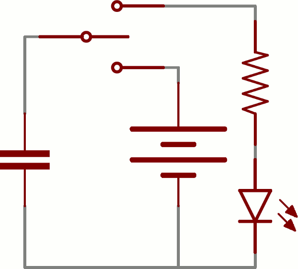

### 電荷、電圧、電流の計算

コンデンサの静電容量、つまり何ファラドあるかを見れば、どれだけの電荷を蓄えられるかがわかる。
そのコンデンサが*現在*どれだけの電荷を蓄えているかは、板のあいだの電位差（電圧）によって決まる。
電荷、静電容量、電圧のこの関係は、次の式でモデル化できる。

\\[ Q = C \times V \\]

コンデンサに蓄えられる電荷（Q）は、その静電容量（C）と、かかっている電圧（V）の積である。

コンデンサの静電容量は、常に一定の既知の値であるはずのものである。
そのため、電圧を調整することで、コンデンサの電荷を増減できる。
電圧が高いほど電荷は多くなり、電圧が低いほど電荷は少なくなる。

この式は、1ファラドの定義を考えるうえでも役に立つ。
1ファラド（F）とは、1ボルトあたり1単位のエネルギー（クーロン）を蓄えられる容量のことである。

#### 電流の計算

電荷、電圧、静電容量の式をもう一歩進めれば、静電容量と電圧が電流にどう影響するかもわかる。
なぜなら、電流とは電荷が流れる*速さ*だからである。
コンデンサと電圧、電流の関係を要約すると次のようになる。
**コンデンサを流れる電流**の大きさは、静電容量と、**電圧がどれだけ速く上下しているか**の両方によって決まる。
コンデンサの両端の電圧が急激に上昇すると、大きな正の電流がコンデンサを流れる。
電圧の上昇がゆるやかであれば、コンデンサを流れる電流も小さくなる。
コンデンサの両端の電圧が一定で変化していなければ、電流はまったく流れない。

（ここから先は微分が絡んでくるやや込み入った話であり、時間領域の解析やフィルタ設計のような込み入った話に踏み込むまでは特に必要ないので、この式に抵抗があれば次の節まで読み飛ばしてかまわない。）
コンデンサを流れる電流を計算する式は次のとおりである。

\\[ i(t) = C \, \frac{dV}{dt} \\]

この式の *dV/dt* の部分は、電圧の時間に関する微分（もう少し噛み砕けば*瞬間的な変化の速さ*）であり、「まさに今この瞬間、電圧がどれだけ速く上下しているか」を表している。
この式からわかる重要な点は、**電圧が一定であれば**その微分はゼロになり、つまり**電流もゼロになる**ということである。
これが、一定の直流電圧がかかったコンデンサに電流が流れない理由である。

## コンデンサの種類

コンデンサにはさまざまな種類があり、種類によって得意な用途と不得意な用途がある。

コンデンサの種類を選ぶときに考慮すべき要素がいくつかある。

- **大きさ**：物理的な体積と静電容量の両方の意味での大きさである。回路の中でコンデンサがもっとも大きな部品になることも珍しくない一方、非常に小さなものもある。一般に、静電容量が大きいほど、より大きなコンデンサが必要になる。
- **最大電圧**：それぞれのコンデンサには、かけられる電圧の上限が定められている。1.5V定格のものもあれば、100V定格のものもある。この上限を超えると、たいていコンデンサは壊れてしまう。
- **漏れ電流**：コンデンサは完璧な部品ではない。どのコンデンサも、誘電体を通してわずかな電流が一方の端子からもう一方へ漏れ出す性質を持っている。このわずかな電流の損失（たいていナノアンペア程度かそれ以下）を漏れ電流と呼ぶ。漏れ電流があると、コンデンサに蓄えられたエネルギーは少しずつ、しかし確実に失われていく。
- **等価直列抵抗（ESR）**：コンデンサの端子は100%導電性というわけではなく、常にごくわずかな抵抗（たいてい0.01Ω未満）を持っている。この抵抗は、コンデンサに大きな電流が流れたときに熱や電力損失を生む原因になる。
- **誤差（許容差）**：コンデンサも、正確に狙った静電容量ちょうどに作ることはできない。それぞれのコンデンサには公称の静電容量が定められているが、種類によっては実際の値が目的の値の±1%から±20%程度まで変動することがある。

### セラミックコンデンサ

もっとも広く使われ、もっとも多く生産されているコンデンサがセラミックコンデンサである。
この名前は、誘電体に使われている材料に由来する。

セラミックコンデンサは、物理的な大きさも静電容量も**小さい**ことが多い。
10µFを大きく超えるセラミックコンデンサを見つけるのは難しい。
表面実装型のセラミックコンデンサは、0402（0.4mm×0.2mm）、0603（0.6mm×0.3mm）、0805といった小さなパッケージでよく見られる。
スルーホール型のセラミックコンデンサは、たいてい小さな（黄色や赤色が多い）球根のような形をしていて、2本の端子が飛び出している。

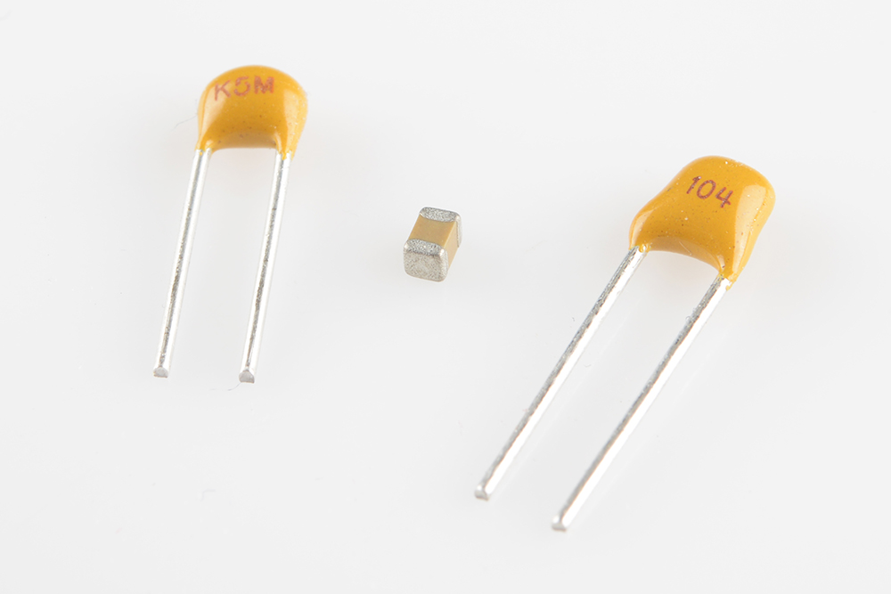

同じくらい人気のある電解コンデンサと比べると、セラミックコンデンサはより理想的なコンデンサに近い（ESRも漏れ電流もずっと小さい）が、静電容量が小さい点が制約になる。
たいてい、もっとも安価な選択肢でもある。
高周波のカップリングやデカップリングの用途によく合う。

### アルミニウム電解コンデンサとタンタル電解コンデンサ

電解コンデンサの優れた点は、比較的小さな体積に*大量*の静電容量を詰め込めることである。
1µFから1mF程度の静電容量が必要なら、たいていは電解コンデンサの形で見つかる。
最大電圧の定格が比較的高いため、高電圧の用途にも特に向いている。

電解コンデンサの中でもっとも一般的なアルミニウム電解コンデンサは、たいてい小さな缶のような外観をしていて、両方のリード線が底面から伸びている。

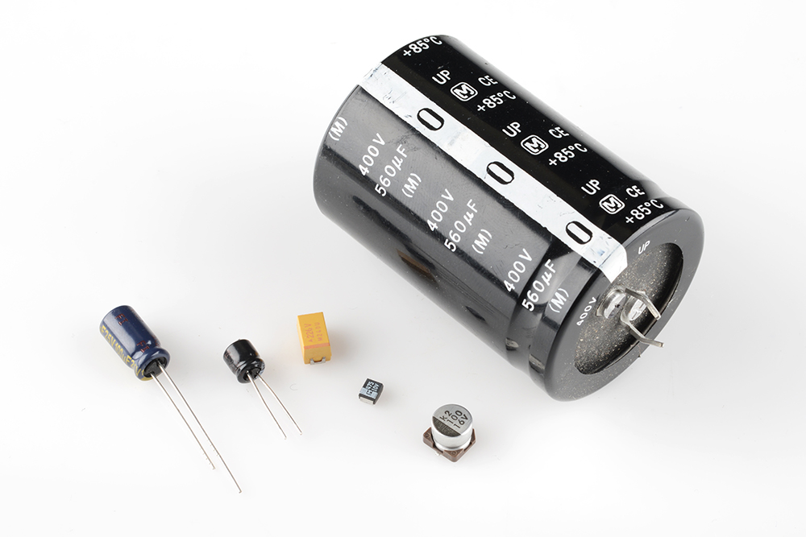

残念ながら、電解コンデンサはたいてい[極性を持つ](https://learn.sparkfun.com/tutorials/polarity)。
正極のピン（アノード）と、負極のピン（カソード）と呼ばれるピンがある。
電解コンデンサに電圧をかけるときは、アノードがカソードより高い電圧になっていなければならない。
電解コンデンサのカソードは、たいてい「-」の表示や、外装のカラーストライプで示されており、アノード側のリードがわずかに長くなっていることでも見分けられる。
電解コンデンサに逆向きの電圧をかけてしまうと、派手に（「ポン」という音とともに）破裂し、二度と使えなくなる。
一度破裂した電解コンデンサは、ショート回路のようにふるまうようになる。

電解コンデンサは**漏れ電流**でも知られている。
つまり、誘電体を通してわずかな電流（nAのオーダー）が一方の端子からもう一方へ流れてしまう。
そのため、大きな静電容量と高い電圧定格を持ちながらも、エネルギー貯蔵用としては理想的とは言えない側面がある。

### スーパーキャパシタ

エネルギーを蓄えるためのコンデンサを探しているなら、スーパーキャパシタが最適である。
このコンデンサは、ファラド単位という*非常に*大きな静電容量を持つように特別に設計されている。

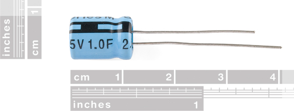

スーパーキャパシタは大量の電荷を蓄えられる一方で、高い電圧には対応できない。
たとえばこの10Fのスーパーキャパシタは、最大定格電圧がわずか2.5Vである。
これを超える電圧をかけると壊れてしまう。
スーパーキャパシタは、より高い電圧定格を得るために（その代わり合成静電容量は小さくなるが）直列に接続されることが多い。

スーパーキャパシタの主な用途は、電池と同じように**エネルギーを蓄えて放出する**ことであり、電池はスーパーキャパシタにとって最大の競合相手でもある。
同じ体積の電池ほど多くのエネルギーは蓄えられないものの、スーパーキャパシタはずっと速くエネルギーを放出でき、寿命もたいてい電池よりずっと長い。

### その他の種類

電解コンデンサとセラミックコンデンサだけで、世の中のコンデンサの種類のおよそ80%を占める（スーパーキャパシタはわずか2%程度だが、その名のとおりスーパーな存在である）。
もう1つよく使われる種類が**フィルムコンデンサ**であり、寄生損失（ESR）が非常に小さいため、大電流を扱う用途に適している。

このほかにも、あまり一般的でないコンデンサが数多く存在する。
**可変コンデンサ**は静電容量を変化させられるため、同調回路において可変抵抗の代わりに使うのに適している。
より合わせた電線やプリント基板も、それぞれ絶縁体を挟んだ2つの導体からなるため、（望まない形であることも多いが）静電容量を生み出すことがある。
[ライデン瓶](https://ja.wikipedia.org/wiki/ライデン瓶)（導体で満たされ、導体に囲まれたガラス瓶）は、コンデンサ一族の元祖ともいえる存在である。
そして、[フラックスキャパシタ](https://www.youtube.com/watch?v=Or7P9jfhcZ0)（インダクタとコンデンサを組み合わせた奇妙な部品）は、いつか栄光の過去へ時間を遡ろうと計画しているなら欠かせない部品である。

## コンデンサの直列接続と並列接続

[抵抗器](./resistors.md)と同じように、複数のコンデンサを[直列や並列](./series-and-parallel-circuits.md)に組み合わせて、合成静電容量を作り出せる。
ただし、コンデンサが合成される様子は、抵抗の場合とは**まったく逆**になる。

### コンデンサの並列接続

コンデンサを互いに並列につなぐと、合成静電容量は単純にすべての静電容量の**総和**になる。
これは、抵抗を直列につないだときの合成の仕方に対応する。

たとえば10µF、1µF、0.1µFの3つのコンデンサを並列につなぐと、合成静電容量は11.1µF（10+1+0.1）になる。

### コンデンサの直列接続

抵抗を並列に合成する計算が面倒なのと同じように、コンデンサを*直列*につなぐ場合も少し癖のある計算になる。
*N*個のコンデンサを直列につないだときの合成静電容量は、それぞれの静電容量の逆数の和の、さらに逆数になる。

\\[ \frac{1}{C_{合成}} = \frac{1}{C_1} + \frac{1}{C_2} + \cdots + \frac{1}{C_N} \\]

コンデンサが**2個**だけの場合は、「和分の積」の方法で合成静電容量を計算できる。

\\[ C_{合成} = \frac{C_1 \times C_2}{C_1 + C_2} \\]

さらに、**同じ値のコンデンサが2個**直列につながっている場合、合成静電容量はその値のちょうど半分になる。
たとえば[10Fのスーパーキャパシタ](https://www.sparkfun.com/products/746)を2個直列につなぐと、合成静電容量は5Fになる（副次的な効果として、全体の耐圧が2.5Vから5Vへと倍増する）。

## 応用例

この気の利いた（実際には物理的にかなり大きいこともある）受動部品には、無数の応用例がある。
その用途の広さがわかるように、いくつか例を挙げる。

### デカップリング（バイパス）コンデンサ

回路の中で見かけるコンデンサの多くは、特に[集積回路](https://learn.sparkfun.com/tutorials/integrated-circuits)を使った回路では、デカップリング用である。
**デカップリングコンデンサ**の役割は、電源信号に含まれる高周波ノイズを抑えることである。
繊細なICにとって有害になりかねない小さな電圧のリップルを、電源電圧から取り除いてくれる。

いわば、デカップリングコンデンサはICのための非常に小さな、局所的な電源のような働きをする（パソコンにとっての[無停電電源装置（UPS）](https://ja.wikipedia.org/wiki/無停電電源装置)に近い）。
電源電圧がごく一瞬だけ落ち込んだとき（回路の負荷が絶えず切り替わるような場合、これは実はよくあることである）、デカップリングコンデンサが一瞬だけ正しい電圧で電力を供給してくれる。
これが、この種のコンデンサが**バイパス**コンデンサとも呼ばれる理由であり、一時的に電源の役割を「肩代わり（バイパス）」してくれるからである。

デカップリングコンデンサは、電源（5Vや3.3Vなど）とグラウンドのあいだに接続する。
特定の周波数帯のノイズを取り除くのに向き不向きがあるため、値の異なる、あるいは種類の異なる複数のコンデンサを組み合わせて電源をバイパスするのも珍しくない。

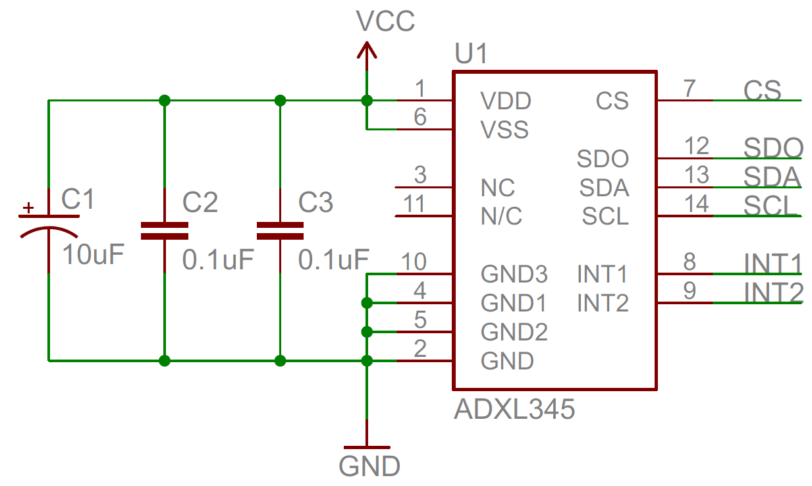

電源からグラウンドへの短絡のように見えるかもしれないが、実際にはコンデンサを通ってグラウンドへ流れるのは高周波の信号だけである。
直流信号はそのままICへ向かう。
これらのコンデンサがバイパスコンデンサと呼ばれるもう1つの理由は、高周波（kHzからMHzの範囲）の信号がICを迂回（バイパス）し、代わりにコンデンサを通ってグラウンドへ抜けていくためである。

デカップリングコンデンサを物理的に配置するときは、できる限りICの近くに置くべきである。
ICから離れるほど、その効果は弱くなる。

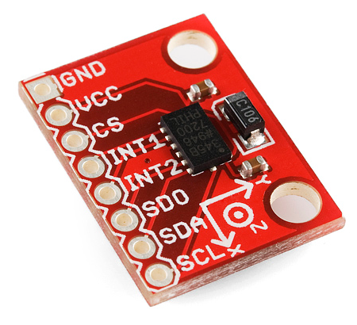

良い設計の基本として、すべてのICには少なくとも1つのデカップリングコンデンサを添えるべきである。
たいていは0.1µFがよい選択であり、1µFや10µFのコンデンサをあわせて追加してもよい。
安価な部品であり、ICが大きな電圧の落ち込みやスパイクにさらされずに済むようにしてくれる。

### 電源のフィルタリング

[ダイオードによる整流回路](https://learn.sparkfun.com/tutorials/diodes)は、壁のコンセントから来る交流電圧を、ほとんどの電子機器が必要とする直流電圧に変換するのに使える。
しかし、ダイオードだけでは交流信号をきれいな直流信号に変えることはできず、コンデンサの助けが必要になる。
ブリッジ整流回路に**並列コンデンサ**を追加すると、次のような整流された信号を、

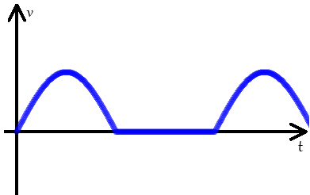

次のような、ほぼ一定の直流信号に変えられる。

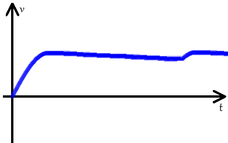

コンデンサは頑固な部品であり、電圧の急な変化に常に抵抗しようとする。
整流された電圧が上昇していくあいだ、このフィルタコンデンサは充電されていく。
整流電圧が急に下がり始めると、コンデンサは蓄えたエネルギーを取り崩し、非常にゆっくりと放電しながら負荷にエネルギーを供給する。
入力側の整流信号が再び上昇し始めてコンデンサが再充電されるまでに、コンデンサが完全に放電しきってしまうことはないようにする必要がある。
この駆け引きは、電源が使われている限り、1秒間に何度も繰り返される。

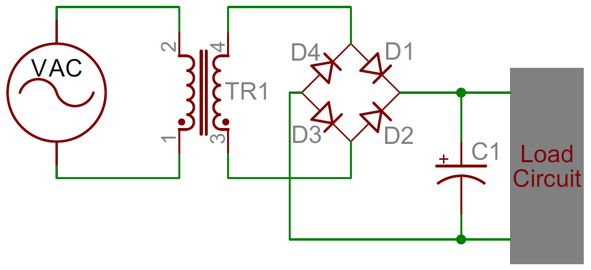

AC-DC電源アダプターを分解してみれば、必ずと言っていいほど比較的大きなコンデンサが少なくとも1つは見つかる。
下の写真は、[9VのDC用ACアダプター](https://www.sparkfun.com/products/298)の中身である。
コンデンサがいくつ見つかるだろうか。

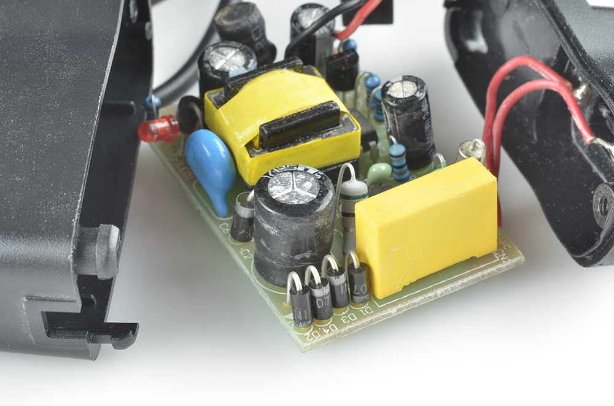

思っていたより多くのコンデンサが見つかるかもしれない。
47µFから1000µFまでの、缶のような外観の電解コンデンサが4個ある。
手前にある大きな黄色い四角形は、高電圧用の0.1µFポリプロピレンフィルムコンデンサである。
青い円盤状のコンデンサと、中央の小さな緑色のコンデンサは、どちらもセラミックコンデンサである。

### エネルギーの蓄積と供給

コンデンサがエネルギーを蓄えられるなら、電池と同じように、そのエネルギーを回路に供給する用途に使えるのは当然のことのように思える。
問題は、コンデンサの**エネルギー密度**が電池よりずっと低いことであり、同じ大きさの化学電池ほど多くのエネルギーを詰め込むことができない（もっとも、その差は年々縮まってきている）。

コンデンサの利点は、たいてい電池より長寿命であることであり、環境面でも優れた選択肢になりうる。
また、電池よりずっと速くエネルギーを放出できるため、短時間だけ大きな電力が必要な用途にも向いている。
カメラのフラッシュは、コンデンサから電力を得ていることが多い（そのコンデンサ自体は、電池によって充電されていることが多い）。

**電池かコンデンサか**

| | 電池 | コンデンサ |
| --- | --- | --- |
| 容量 | ✓ | |
| エネルギー密度 | ✓ | |
| 充放電の速さ | | ✓ |
| 寿命 | | ✓ |

### 信号のフィルタリング

コンデンサは、周波数の異なる信号に対して独特の応答を示す。
低周波や直流の成分を遮断しながら、より高い周波数だけを通すことができる。
まるで、高周波の信号だけを通す、選り好みの激しいクラブの用心棒のような存在である。

信号のフィルタリングは、あらゆる信号処理の用途で役立つ。
ラジオの受信機では、（他の部品とあわせて）コンデンサを使って不要な周波数を取り除いていることがある。

コンデンサによる信号フィルタリングのもう1つの例が、スピーカー内部にある受動的な**クロスオーバー**回路であり、1つの音声信号を複数の帯域に分割する役割を持つ。
直列に入れたコンデンサは低周波を遮断し、残った高周波成分だけがスピーカーのツイーターへ送られる。
低周波を通すサブウーファー側の回路では、並列に入れたコンデンサを通して高周波の大部分がグラウンドへ逃がされる。

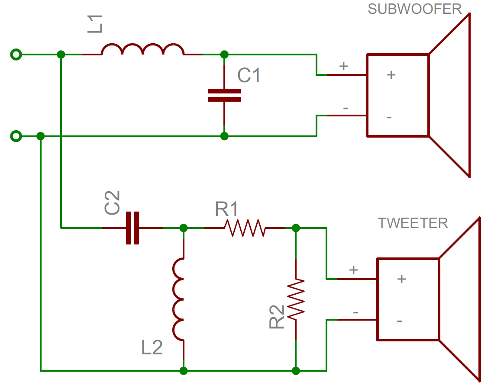

### ディレーティング

コンデンサを扱うときは、システム内で起こりうる最大の電圧スパイクより、十分に高い耐圧を持つコンデンサを選んで設計することが重要である。

コンデンサの耐圧に十分な余裕（ディレーティング）を持たせずに定格電圧を超えてしまうと、コンデンサの種類ごとにどんなことが起きるかを紹介した、SparkFunのエンジニアによる実験動画もある。

## まとめ

これで、コンデンサについての基礎知識がひととおり身についたはずである。
電子工作の基礎をさらに学びたいなら、他のよく使われる部品についても読んでみてほしい。

- [抵抗器](./resistors.md)
- [ダイオード](./diodes.md)
- [スイッチ](./button-and-switch-basics.md)
- [集積回路](./integrated-circuits.md)
- [トランジスタ](./transistors.md)

次のようなチュートリアルにも興味があるかもしれない。

- [電池の技術](./battery-technologies.md)
- [プロジェクトへの電源供給](./how-to-power-a-project.md)
- [電力](./electric-power.md)

タグ: 部品、電気工学、技術

---

出典：[Capacitors](https://learn.sparkfun.com/tutorials/capacitors)（SparkFun Learn）を日本語に翻訳し、再構成した。
原文は [CC BY-SA 4.0](https://creativecommons.org/licenses/by-sa/4.0/) ライセンスで公開されており、本ページも同ライセンスの下で提供する。
