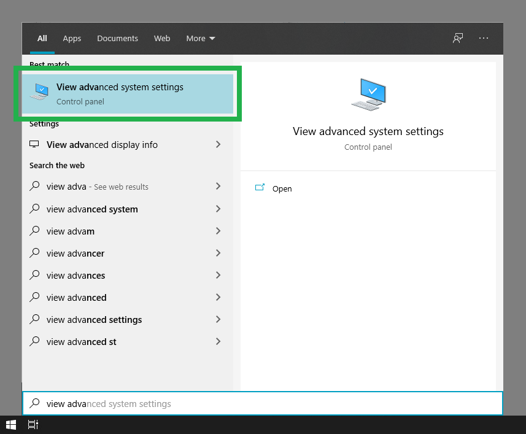
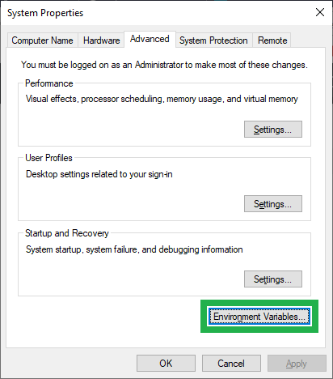
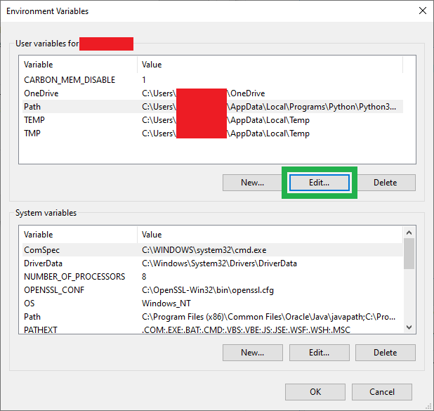
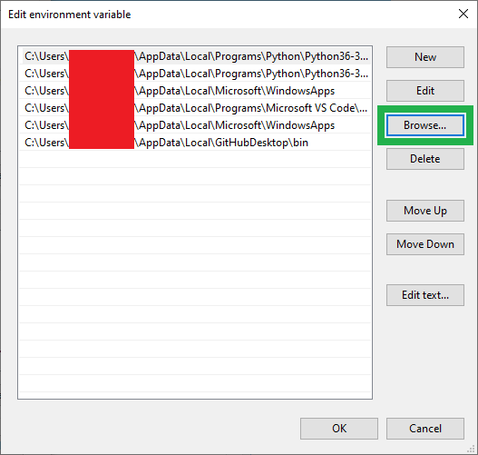
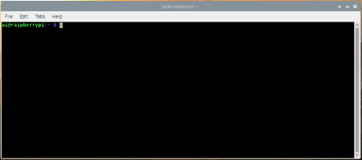

# PATH環境変数の設定

## はじめに

[パス](https://ja.wikipedia.org/wiki/Path_(computing))とは、ファイルシステム上の特定の場所を示す、ファイルのディレクトリ名のことである。
一方、[PATH環境変数](https://ja.wikipedia.org/wiki/PATH_%28%E5%A4%89%E6%95%B0%29))（`$PATH`）は、実行可能なプログラムが置かれているディレクトリの集合を指定する変数である。
これによって、ソフトウェアはよく使われるプログラムに、いちいちフルパスを指定しなくてもアクセスできるようになる。

`PATH`（`$`付き）変数を変更する方法は、OSによって異なる。
以下の手順は、それぞれのOSでもっとも一般的な方法に基づいている。
より詳しい情報が必要な場合は、お好みの検索エンジンで「path system variable」と「使用しているOSの名前」を組み合わせて検索してみてほしい。

## Windows 10の場合

Windows 10では、`PATH`環境変数は**システムのプロパティ**ウィンドウから設定する。
このウィンドウを開く方法はいくつかあるが、たとえばタスクバーの<kbd>⊞ スタート</kbd>メニューから「システムの詳細設定の表示」を検索する方法がある。

タスクバーの<kbd>⊞ スタート</kbd>メニューから「システムの詳細設定」を検索し、**システムのプロパティ**ウィンドウを開く。（クリックで拡大）

**システムのプロパティ**ウィンドウが開いたら、`詳細設定`タブから<kbd>環境変数...</kbd>ボタンを選択する。

**環境変数**ウィンドウを開く。（クリックで拡大）

**環境変数**ウィンドウの中で、**ユーザー環境変数（ユーザー名）**の欄から`Path`変数を選び、<kbd>編集...</kbd>ボタンを選択して`PATH`環境変数を設定する。

> [!NOTE]
> 注：**ユーザー環境変数**は、そのコンピュータの特定のユーザーアカウントに限定される変数である。一方、**システム環境変数**は、そのコンピュータのすべてのアカウントで利用できる。

`PATH`の**環境変数の編集**ウィンドウを開く。（クリックで拡大）

`PATH`の**環境変数の編集**ウィンドウから、<kbd>参照...</kbd>ボタンを選択する。
ポップアップダイアログが表示されたら、`PATH`環境変数に追加したい実行ファイルが入っているフォルダに移動する。

> [!NOTE]
> 注：以前に設定したファイルパスを選択して上書きしないよう注意すること。何もない黒い領域をクリックすれば、既存のファイルパスが選択された状態になっておらず、誤って上書きされる心配がないことを確認できる。

`PATH`環境変数にディレクトリを追加する。（クリックで拡大）

## Mac OSXおよびLinux系OSの場合

Mac OSXやLinux系OSでは、ターミナルに`echo $PATH`と入力することで、`$PATH`環境変数に設定されているパスを表示できる。

> [!NOTE]
> 注：以下のコマンドでは[GNU nano](https://ja.wikipedia.org/wiki/Nano_%28%E3%83%86%E3%82%AD%E3%82%B9%E3%83%88%E3%82%A8%E3%83%87%E3%82%A3%E3%82%BF%29)テキストエディタを使用している。好みの別のテキストエディタ（[Vim](https://ja.wikipedia.org/wiki/Vim))の`vi`など）を使ってもかまわない。

変数を変更する手順は次のとおりである。

1. ターミナルを開き、次のコマンドを実行してパスの設定ファイルを編集する：`sudo nano <ファイルパスの場所>`
   - `$PATH`環境変数を変更できる場所としては、次のようなものがある。
     - `/etc/paths`（Mac OSX - Mountain Lion）
     - `/usr/bin`
     - `/usr/local/bin`
     - `/usr/local/sbin`
     - `/usr/sbin`
     - `~/.bash_profile`
     - `~/.bashrc`
     - `~/.profile`
2. 管理者パスワードの入力を求められたら入力する。
3. 追加したいパスの記述を入力する。
   - 入力欄は、たいていファイルの末尾付近にある。
4. <kbd>Ctrl</kbd>+<kbd>X</kbd>を押して終了する。
5. 入力を促されたら<kbd>Y</kbd>を入力し、<kbd>Enter</kbd>（または<kbd>Return</kbd>）を押して変更内容を保存する。

`$PATH`変数のパスを表示し、`~/.profile`ファイルを開いて変更する様子。（クリックで拡大）

これで完了である。変更が反映されたかを確認するには、ターミナルで`echo $PATH`と入力する。

> [!NOTE]
> 注：もう一つよく使われる方法として、ターミナルで`export`コマンドを使う方法がある。
>
> 例：`export PATH=$PATH:<追加したいファイルパス>`

## まとめ

プログラミング関連のチュートリアルをさらに探しているなら、次のガイドも参考にしてほしい（いずれも英語）。

- [LilyPad Development Board Hookup Guide](https://learn.sparkfun.com/tutorials/lilypad-development-board-hookup-guide)：LilyPad Development Boardは、Arduinoを使った回路とプログラミングの学習に使える縫い付け可能な試作用ボードで、切り離してインタラクティブな布製品やウェアラブルプロジェクトにも使える。
- [Papa Soundie Audio Player Hookup Guide](https://learn.sparkfun.com/tutorials/papa-soundie-audio-player-hookup-guide)：Papa Soundie Audio Playerを使って、プロジェクトや小道具、衣装に効果音を追加する方法。
- [Adapting LilyPad Development Board Projects to the LilyPad ProtoSnap Plus](https://learn.sparkfun.com/tutorials/adapting-lilypad-development-board-projects-to-the-lilypad-protosnap-plus)：LilyPad Development BoardからLilyPad ProtoSnap Plusへの改良点の概要と、旧基板向けに書かれたコードを新基板に適応させる方法。
- [WiFi経由でセンサーデータを送信する](./sending-sensor-data-over-wifi.md)：2枚のESP32 WiFiボード間で、センサーデータを送受信する単純なピアツーピア接続を設定する方法。

タグ: 概念、プログラミング

---

出典：[Configuring the PATH System Variable](https://learn.sparkfun.com/tutorials/configuring-the-path-system-variable)（SparkFun Learn）を日本語に翻訳し、再構成した。
原文は [CC BY-SA 4.0](https://creativecommons.org/licenses/by-sa/4.0/) ライセンスで公開されており、本ページも同ライセンスの下で提供する。
