# IoTのための通信プロトコル

## はじめに

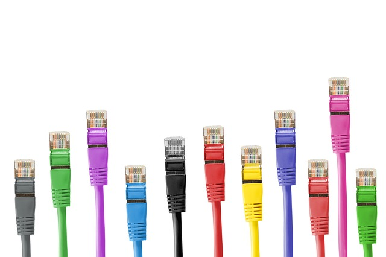

画像提供：[Pixabay](https://pixabay.com/)

接続性は、IoT（モノのインターネット）プロジェクトを開発するうえで、常に意識しておくべき主要な要素の一つである。

新しいIoTプロジェクトに着手するとき、筆者の頭にまず浮かぶ疑問は次のようなものである。

- どうやって接続させたいか。
- 電力や到達距離に制約はあるか。
- データレートはどれくらい必要か。
- 現在利用できるネットワークインフラは何か。

IoTプロジェクトを始めるとき、多くの人が同じような疑問を抱くはずである。
どの通信プロトコルを使いたいか、すでにイメージが固まっていることもあるだろうが、それでもきちんと調べて、自分の用途にもっとも適したものかどうかを確認しておいて損はない。

幸い、利用できるネットワークインフラと通信プロトコルは数多く存在する。しかし不幸なことに、その数があまりに多く、かえって混乱してしまうこともある。

このチュートリアルでは、よく使われる**通信プロトコル**の（すべてではないが）大部分を取り上げ、プロジェクトにもっとも適したものをどう選べばよいかを扱う。それぞれの長所と短所についても詳しく見ていく。

1. WiFi
2. Thread
3. ZigBee
4. Bluetooth
5. RFIDとNFC

これは接続方式の完全な一覧ではないが、たいていのIoTプロジェクトを始めるうえで十分な助けになるはずである。

## ネットワークトポロジー

これから取り上げるさまざまなネットワークプロトコルを理解するには、まずネットワークトポロジーを理解しておくことが重要である。

ネットワークトポロジーとは、ネットワーク上のさまざまな要素がどう配置されているかを表すものである。
物理的、あるいは論理的にネットワークの構造を定義する。
筆者は、これをネットワークの要素とその間をデータがどう移動するかを描いた図のようなものだと捉えている。

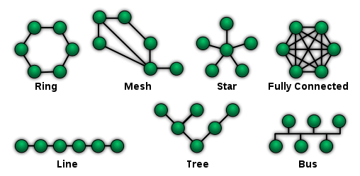

出典：[www.wikipedia.com](https://ja.wikipedia.org/wiki/%E3%83%8D%E3%83%83%E3%83%88%E3%83%AF%E3%83%BC%E3%82%AF%E3%83%BB%E3%83%88%E3%83%9D%E3%83%AD%E3%82%B8%E3%83%BC)

ネットワークトポロジーには数多くの種類があるが、ここではIoT向けの通信プロトコルを扱う際によく見かけるものに絞って紹介する。

- ポイントツーポイント（P2P）
- スター型
- メッシュ型
- ハイブリッド型

#### ポイントツーポイント


P2Pはもっとも単純なトポロジーで、2つのエンドポイントの間に恒久的なリンクを持つ。
P2Pのもっとも単純な例は、子どもの頃に遊んだ紙コップと糸で作った電話である。2つのノード（エンドポイント）が、通信専用の1本のチャンネルを持っている。
交換技術を使えば、P2Pを動的に構築することもできる。
初期の電話網は、この交換型P2Pトポロジーを基盤にしていた。

#### スター型


出典：[www.wikipedia.com](https://ja.wikipedia.org/wiki/%E3%83%8D%E3%83%83%E3%83%88%E3%83%AF%E3%83%BC%E3%82%AF%E3%83%BB%E3%83%88%E3%83%9D%E3%83%AD%E3%82%B8%E3%83%BC)

スター型のネットワーク構成では、それぞれのノード（エンドポイント）が、単一の中央デバイスに接続する。
ノードどうしが直接通信することはできず、中央デバイスを介して通信する。
中央デバイスがサーバーとして振る舞い、ノードはクライアントとして振る舞う。
これはもっとも一般的な構成の一つであり、もっとも構築しやすい構成でもある。
ネットワークを乱すことなく、デバイスの追加や削除が簡単に行える。
この種のネットワークにおける最大の課題は、単一障害点（つまり中央のコンピュータ）を持つことである。中央のコンピュータが故障すれば、ネットワーク全体が機能しなくなる。

#### メッシュ型

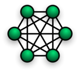 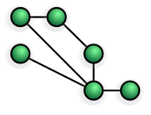

出典：[www.wikipedia.com](https://ja.wikipedia.org/wiki/%E3%83%8D%E3%83%83%E3%83%88%E3%83%AF%E3%83%BC%E3%82%AF%E3%83%BB%E3%83%88%E3%83%9D%E3%83%AD%E3%82%B8%E3%83%BC)

メッシュ型は、それぞれのノードが他のすべてのノードと接続されているタイプのネットワークである。
メッシュネットワークは、ネットワークのリンクに関して非常に高い冗長性を持つ。
1本のリンクが失われても、ノードは別のリンクを使って通信を続けられる。
冗長なリンクを構築するコストの増加と、ネットワークの構造が複雑になるという、当然の理由から、それほど一般的に使われているトポロジーではない。

#### ハイブリッド型

ハイブリッドネットワークは、その名のとおり、2つ以上の基本的なネットワークトポロジーを組み合わせたものである。
スター・メッシュ型のネットワークもあれば、スター・リング型のネットワークもある。
ハイブリッドネットワークは、両方の長所を兼ね備えているため、より柔軟で信頼性が高いものになる。
しかしその一方で、複雑さも増すため、構築のコストが高く、管理も難しくなる。
とはいえ、複数のネットワークトポロジーの機能を必要とする場合には、ハイブリッド型ならではの利点がある。

## インフラストラクチャ型ネットワークとアドホック型ネットワーク

今回はワイヤレスネットワークについて扱うので、ワイヤレスネットワークが動作する2つの基本モード（トポロジーと呼ばれることもある）について説明しておく必要がある。

**インフラストラクチャ型ネットワークとアドホック型ネットワーク**である。

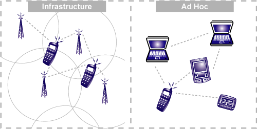

[出典](http://www.e-cartouche.ch/content_reg/cartouche/LBStech/en/html/LBStechU2_wlantopo.html)

**インフラストラクチャモード**とは、ワイヤレスネットワークを支えるために物理的な構造を必要とする方式である。
これは基本的に、ネットワークの機能を扱う何らかの媒体があり、その周りにネットワークを維持するインフラが構築されているということを意味する。

このモードは、たいてい次のような**機能**を果たす。

- 他のネットワークへのアクセスの提供
- 転送
- 媒体アクセス制御

インフラストラクチャ型のワイヤレスネットワークでは、通信はワイヤレスノード（パソコンやスマートフォンなど、ネットワーク上のエンドポイント）とアクセスポイント（ルーター）の間だけで行われる。

同じネットワーク上に複数のアクセスポイントがあり、それぞれが異なるワイヤレスノードを扱っていることもある。

インフラストラクチャ型ネットワークの典型例は、携帯電話網である。これは、機能させるために決まったインフラ（通信塔）を必要とする。

**インフラストラクチャ型ネットワーク**を使うべき場面は、次のとおりである。

- 到達距離を広げるためにアクセスポイントを簡単に追加できる場合
- より恒久的なネットワークを構築したい場合
- 他の種類のネットワークへブリッジする必要がある場合（たとえば必要に応じて有線ネットワークに接続できる場合）

> [!NOTE]
> インフラストラクチャ型ネットワークの大きな欠点の一つは、一度構築するのにコストと時間がかかるという点である。そのため、インフラが弱い、あるいは存在しない遠隔地でデバイスを動作させたい場合には、インフラストラクチャ型ネットワークに頼ることはできない。

一方、**アドホック型ワイヤレスネットワーク**は、動作させるために決まったインフラを必要としない。
アドホックネットワークでは、それぞれのノードが他のノードと直接通信できるため、アクセス制御を提供するアクセスポイントは不要である。

インフラストラクチャ型ネットワークではアクセスポイントが経路制御を担うのに対し、アドホックネットワークではネットワーク内のノード自身が**ルーティング**を担う。

> ルーティングとは、送信元ノードと宛先ノードの間で、データを転送するための最善の経路を見つけることである。

アドホックネットワーク内のすべての個々のノードは、他のノードに関する情報を含むルーティングテーブルを保持している。
アドホックネットワークの性質上、動的であるため、このルーティングテーブルは常に変化し続けることになる。
一つ注意しておきたいのは、アドホックネットワークは本質的に非対称であるという点である。つまり、ネットワーク内の2つのノード間で、データのアップロードとダウンロードの経路が異なることがありうる。

アドホックネットワークの典型例は、中央のアクセスポイントを介さずに、2台以上のノートパソコン（あるいは対応する他のデバイス）を、ワイヤレスまたはケーブルで直接互いに接続する場合である。

**アドホック型ネットワーク**を使うべき場面は、次のとおりである。

- 2台のデバイスの間で、素早くピアツーピア（P2P）ネットワークを構築したい場合
- すぐに使える一時的なネットワークを作りたい場合
- その地域にネットワークインフラが構築されていない場合（このような場所で使える唯一のネットワークモードがアドホックである）

> [!NOTE]
> ルーティングはネットワーク内のそれぞれのノードが担うため、より多くのリソースを消費する。アドホックネットワークに接続されるデバイスの数が増えるほど、ネットワークの干渉が増え、ネットワークが遅くなることがある。

## WiFi

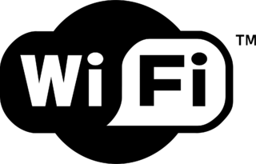

出典：[commons.wikimedia.org](https://commons.wikimedia.org/wiki/Main_Page)

WiFiは、もっともよく使われる通信プロトコルの一つである。
おそらく、WiFiのない生活は想像もつかないだろう。
自宅のくつろいだ空間から、教室、カフェ、空港まで、私たちはあらゆる場所でWiFiを目にする。
WiFiが私たちの生活に及ぼす影響はあまりに大きく、今ではこんなSSIDのダジャレのネタにもなっている（**たいてい**は、あまり出来のよくないダジャレだが）。

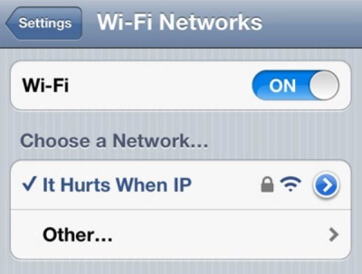

WiFiは基本的にインフラストラクチャ型ネットワークを使用しているが、インフラストラクチャモードの中でアドホック的なネットワーキングもサポートしている。

ワイヤレス通信の**インフラストラクチャモード**は、他のネットワークへのブリッジ、媒体アクセス制御、転送を提供する。
ネットワークを扱う機能はアクセスポイント（ルーター）側に置かれ、クライアント側は（ネットワークの文脈では）単純なままでいられる。

また、WiFiはスター型のネットワークでもある。通信は、ワイヤレスノード（デバイス）からワイヤレスアクセスポイント（ルーターやネットワークコントローラー）へと向かう。

現在使われている標準規格は、2013年にリリースされた802.11acだが、2009年にリリースされた802.11nも依然として広く使われている。
802.11acは最大800Mbit/sの速度を提供するのに対し、802.11nは最大150Mbit/sだった。

さらに古い802.11a/b/gという規格のデバイスを見かけることもあるだろう。これらは今ではレガシーデバイスと呼ばれている。
とはいえ、WiFiには下位互換性があるため、古いデバイスも新しい規格のデバイスとそのまま通信できる。

デバイスのWiFiの到達距離は、いくつかの要因によって決まる。

- そのデバイスがどのWiFi規格で動作しているか。当然、最新の規格ほど古いバージョンより広い到達距離を提供する。
- 壁のような物理的な障害物も、到達距離を左右する重要な要因である。したがって、開けた空間でのWiFiネットワークの到達距離は、壁やその他の干渉物のある閉じた空間よりも広くなる。

> [!NOTE]
> 他の低電力技術に対するWiFiの弱点に対処するため、低電力WiFi（IEEE 802.11ah）を標準化する取り組みが始まっている。このプロトコルの開発は進められているが、世界規模での普及については疑問が残る。主な理由の一つは、既存の802.11bgnネットワークとの下位互換性がないことである。

#### WiFiの利点

- WiFiはそれなりに広い到達範囲を持ち、壁やその他の障害物を透過できる。
- WiFiネットワークへのデバイスの追加・削除は非常に簡単である。

#### WiFiの欠点

- 当然ながら、配線がないことの代償として帯域幅は低くなる。ネットワークの電波は他の機器と干渉することもある。
- もっとも重要な点として、WiFiのセキュリティは有線接続よりも弱い。

自分のプロジェクトについて考えるなら、WiFi対応のデバイスとインターネットの間で素早く接続を確立したい場合には、WiFiが理想的である。
WiFiは消費電力を抑えることを目標に設計されているため、専用の電池でプロジェクトを動かすこともできる。
デバイスがサーバーとどのタイミングでどう接続・通信するかをそれほど気にせず、ただ手間なくインターネットに接続したいだけの場合には、WiFiを使うとよい。

SparkFunでも、WiFiベースの開発ボードを数多く扱っている。

以下は、WiFiを通信プロトコルとして使うIoTプロジェクトの開発を紹介する、いくつかのプロジェクトチュートリアルである（いずれも英語）。

- [SparkFun Inventor's Kit for Photon Experiment Guide](https://learn.sparkfun.com/tutorials/sparkfun-inventors-kit-for-photon-experiment-guide)
- [ESP8266 WiFi Shield Hookup Guide](https://learn.sparkfun.com/tutorials/esp8266-wifi-shield-hookup-guide)
- [Getting Started with the SparkFun Blynk Board](https://learn.sparkfun.com/tutorials/getting-started-with-the-sparkfun-blynk-board)

## Thread

Threadは、信頼性が高くコスト効率のよい、低電力のD2D（デバイス間）ワイヤレス通信のためのオープン標準である。特にスマートホーム向けの用途を念頭に設計されている。

2014年にThread Groupが結成されたことで誕生した。現在では、Google、Samsung、Qualcomm、ARMといった大企業がThreadプロトコルの設計・開発に関わっている。

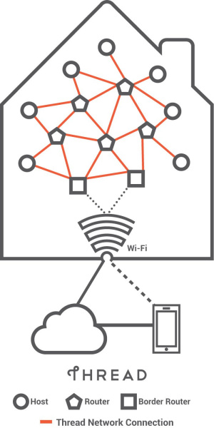

出典：thread.org

[Nest](https://nest.com)は、サーモスタットやNest Cam製品にThreadネットワークを採用している。
Threadは、ホームオートメーション分野を念頭に設計されている。デバイスを簡単にセットアップ・接続でき、電池寿命を延ばすために消費電力を低く抑え、しかも安全である。

標準規格である802.15.4（6LoWPAN）アーキテクチャを基盤としている。
Threadの優れた点は、IPv6（インターネットプロトコルバージョン6）を組み込んだオープンプロトコルであることである。

### Threadにおけるデバイス

Threadプロトコルは、ネットワーク上の主要なデバイスとして3種類を定義している。

- ボーダールーター
- ルーターとルーター対応可能なエンドデバイス
- スリーピーエンドデバイス

これらの役割の関係については、[Thread Stack Fundamentals 2015](https://www.silabs.com/SiteDocs/white-papers/Thread-Stack-Fundamentals.pdf)に詳しい図解がある。

#### ボーダールーター

Threadには、ボーダールーターと呼ばれる特殊なタイプのルーターを持つ仕組みがあり、802.15.4ネットワークと、異なる物理層を持つ隣接ネットワーク（WiFiやイーサネットなど）との間の接続性を提供する。
1台のボーダールーターが故障しても、ネットワーク内の別のルーターがボーダールーターの役割を引き継ぐことができ、Threadプロトコルの堅牢性が保たれる。

#### ルーター

ルーターは、その名のとおり、ネットワーク上のデバイスにルーティングサービスを提供する。
新しいデバイスをネットワークに組み込む際にも使われる。
通常、ルーターは常にアクティブな状態にあるが、REED（ルーター対応可能なエンドデバイス）に格下げされることもある。
これらのデバイスは、Threadネットワークにおけるルーティングやデータ転送には使われないが、必要に応じてルーターの役割を引き受けられる冗長なエンドポイントとして機能する。

#### スリーピーエンドデバイス

これらはThreadネットワークのエンドポイントであり、ホストデバイスとも呼ばれる。
ホストデバイスは、サーモスタット、防犯カメラ、ヒーターなど、それぞれIPアドレスを持つ個別の機能デバイスである。
これらのデバイスは、スリーピーチャイルドやスリーピーノードとも呼ばれる。
スリーピーデバイスに直接ペアリングされたルーターは、親と呼ばれる。
スリーピーデバイス（エンドポイント）は、ほとんどの時間をスリープモードで過ごし、データを送信するときだけ起動する。
これらは親デバイスを通じてのみ通信する（たとえば、Nestサーモスタットはスリーピーエンドデバイスである）。

デバイスの典型的な送信サイクルは、次のようになる。

- スリープモードから目覚める。
- 必要な起動処理と無線の初期化を行う。
- 受信モードに入り、送信可能な状態か確認する。
- 送信モードに入る。
- データを送信する。
- 必要に応じて確認応答を受け取る。
- スリープする。

インフラストラクチャモードを使うWiFiとは対照的に、Threadはアドホックモードのネットワーキングを使用する。

#### 利点

- IPベースであるため、他のIPベースのネットワークに接続しやすい。802.15.4を基盤としているため、ZigBeeや6LoWPANのような既存のデバイスも簡単にThreadへ移行できる。
- ネットワークの状況に応じて適応できるため、アーキテクチャ上の単一障害点を持たない。完全なメッシュ型のネットワークトポロジーをサポートしている。
- スリープするデバイスに対応しているため、低電力で動作する。
- 安全である。

注：Threadネットワークにはアーキテクチャ上の単一障害点は存在しないが、不適切なネットワーク設計によって単一障害点が生まれてしまうことはありうる。

#### 欠点

- 複雑さゆえに、あまりDIYフレンドリーなプロトコルとは言えない。大規模なホームオートメーション市場を主なターゲットとしている。
- まだ非常に新しいネットワークプロトコルであり、確立されるにはもう少し時間が必要である。

[Silicon Labs](http://www.silabs.com/products/wireless/mesh-networking/thread/Pages/thread.aspx)や[NXP](http://www.nxp.com/pages/thread-networking-protocol:THREAD-NETWORKING-PROTOCOL)はThread Allianceの一員であるため、Threadプロトコルに対応した開発ボードを積極的に展開している。

## ZigBee


出典：[Zigbee.org](http://www.zigbee.org/)

ZigBeeもThreadと同様、200社以上が参加する連合であり、家庭・産業用オートメーションのための堅牢かつシンプルなネットワークの開発に協力している。

### ZigBeeの設計目標

ZigBeeは家庭・産業用オートメーションに役立つことだけを目的として作られており、設計目標もそれに沿ったものになっている。

- 低電力
- セキュリティ
- ISMバンドを使う他の無線ネットワークとの共存
- 標準化
- 低コスト

Threadと同様、ZigBeeもIEEE 802.15.4規格を土台にしている。

ZigBeeの仕様は、802.15.4に欠けていた部分を補い、真のメッシュネットワークを実現するとともに、スター型やツリー型のような他のトポロジーもサポートしている。

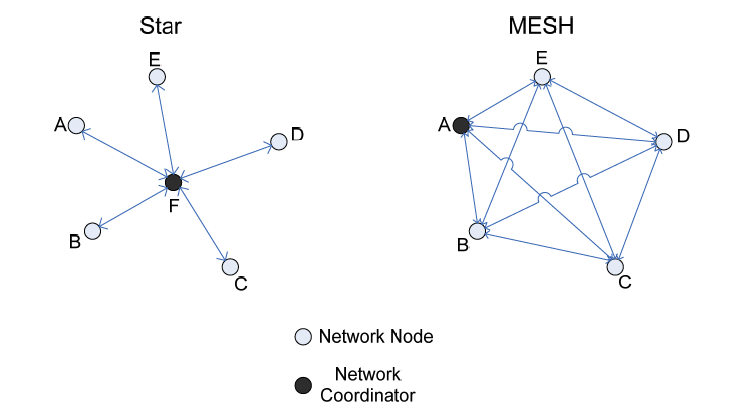

出典：AMX - Zigbee White Paper

### ZigBeeネットワークにおけるデバイス

ZigBeeプロトコルでは、3種類のデバイスが定義されている。

- ZigBeeコーディネータ
- ZigBeeルーター
- ZigBeeエンドデバイス（ノード）

#### ZigBeeコーディネータ

コーディネータは、ZigBeeネットワークの頭脳にあたる。デバイスをネットワークに組み込み、セキュリティキーを保存し、他のネットワークへのブリッジも担う。1つのネットワークに存在できるZigBeeコーディネータは1台だけである。

#### ZigBeeルーター

ZigBeeネットワークには、中継ルーターとして、あるいはネットワーク内でデータを送信するために、複数のルーターが存在することがある。

#### ZigBeeエンドデバイス

エンドデバイスは、親ノード（ルーターまたはコーディネータ）としか通信できない。他のエンドデバイスと直接通信することはできない。
Threadと同様、これらのデバイスはほとんどの時間をスリープモードで過ごし、親にデータを送信するときだけ起動するように設計されている。

ZigBeeは、多くの無線機器が使用する2.4GHz帯のうち、チャネル11〜26を使用する。
ZigBeeのチャネルは、両方のネットワークのチャネル割り当てが適切に行われていれば、干渉なくWiFiのチャネルと共存できるよう、特別に間隔が調整されている。

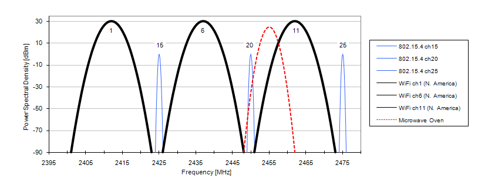

出典：eetimes.com

注：両者にとって最良のスペクトル利用は、WiFiのチャネルを1、6、11に、ZigBeeのチャネルを15、20、25に設定することで実現できる。

#### ZigBee対Thread

ZigBee標準は、2014年にThreadが登場したことで大きな課題に直面した。
これを受けてZigBee Allianceは、**ZigBee 3.0**という最新プロトコルの導入を推し進めた。
ThreadをはじめとするネットワークがホームオートメーションでZigBeeより優れていた部分に対処しようとしたのである。


ZigBee 3.0では、ZigBee RF4CEやZigBee Green Powerといった機能が追加された。

**ZigBee RF4CE**：赤外線リモコンを無線ベースのリモコンに置き換えるために開発された。リモコンだけでなく、照明やランプなども制御できる、汎用リモコンを実現することを目的としている。また、赤外線特有の「向けて操作する」という制約もなくなる。

**ZigBee Green Power**：エネルギーハーベスティングデバイスをサポートする、超低電力の規格として開発された。これらのデバイスがほとんどの時間オフの状態でいられるようネットワークを管理することで、非常に低い消費電力を実現している。

*ZigBeeがThreadに後れを取っていた大きな要因の一つが、IP互換性だった。一方、ZigBee 3.0は完全にIP互換になっている。そのため、ルーターを介してZigBeeデバイスをインターネットに接続できるようになった。*

利点：おおむねThreadと同様である。

欠点：到達距離が短く、データ速度が低い。

[Digi International](http://www.digi.com/lp/xbee)のXbeeは、ZigBeeプロトコルに対応した無線通信モジュールである。ファームウェアを書き換えることで、ZigBee ProやDigiMeshにも対応できる。

Xbeeを手早く体験したい場合は、次のチュートリアルを参考にしてほしい（いずれも英語）。

- [XBee Shield Hookup Guide](https://learn.sparkfun.com/tutorials/xbee-shield-hookup-guide)
- [Exploring XBees and XCTU](https://learn.sparkfun.com/tutorials/exploring-xbees-and-xctu)
- [Teensy XBee Adapter Hookup Guide](https://learn.sparkfun.com/tutorials/teensy-xbee-adapter-hookup-guide)

## Bluetooth

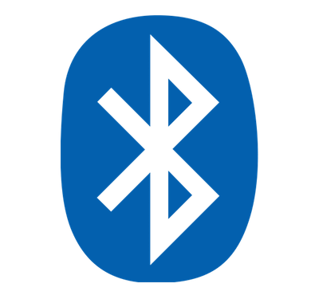

出典：[wikimedia.org](https://www.wikimedia.org/)

ここでは、昔から使われているBluetooth Classicの無線技術と、IoTで使われる低電力デバイス向けに特化して設計された新しいBluetooth Low Energy（BLE）の両方を扱う。

議論の中心はBLEに置く。Bluetooth Classicの一般的な概要については、この技術の基礎を扱った次のチュートリアルを参照してほしい。

- [Bluetooth Basics](https://learn.sparkfun.com/tutorials/bluetooth-basics)

他の無線技術と同様、Bluetoothも2.4GHz帯のISMバンドを使用する。
到達距離は10mから100m（送信出力を上げた場合。ただしそれだけ消費電力も増える）である。
Bluetoothもアドホック型のネットワークであり、ポイントツーポイント（P2P）接続を提供する。

Bluetooth Classicは、1つのピコネットに最大1台のマスターと7台のスレーブを収容できる。
これもスター型のネットワークトポロジーに従っており、周辺機器どうしが互いに通信することはできない。

いくつか押さえておくべき点として、あるピコネットにおけるマスターは、別のピコネットのマスターになることはできないが、あるピコネットのマスターが別のピコネットではスレーブになることはできる。
Bluetooth Classicは、音声とデータの伝送はできるが、映像は伝送できない。

ここからは、BLEプロトコルと、この技術によってBluetoothがどう進化してきたかに焦点を当てて見ていく。

#### 3種類のBluetooth

Bluetooth Low Energyは、Bluetooth Classicの無線技術とはまったく異なるものである。
新しいプロトコルスタック、新しいプロファイルアーキテクチャで設計されており、コイン電池のような低電力の電源でも動作できることを目的としている。

この無線技術は、既存のBluetooth Classicに取って代わったわけでも、置き換えたわけでもないことを理解しておく必要がある。
その結果、互いに関連し合う、異なる種類のBluetoothが生まれることになった。

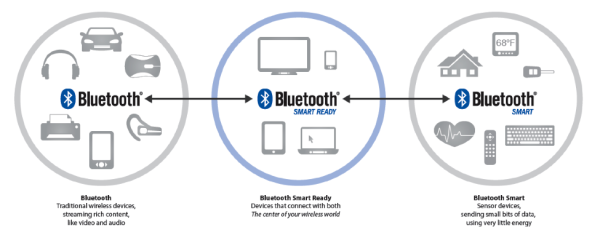

出典：[Bluetooth SIG](https://www.bluetooth.com/)

Bluetooth技術は、3種類のデバイスに分類できる。

- **Bluetooth Classic**：従来からあるBluetoothで、スループットが高く、主にワイヤレスオーディオやファイル転送に使われる。この「クラシック」無線は、Bluetooth Smartにも対応している。
- **Bluetooth Smart**：Bluetooth Low Energyはこの名前でブランド化されており、状態情報のみを送信する。低デューティサイクルの用途（つまり、無線が実際にオンになっている時間が短い用途）向けに特化して設計されている。Bluetooth SmartデバイスはBluetooth Classicデバイスと通信できない。
- **Bluetooth SmartReady**：これらは基本的に、パソコンやスマートフォンのような「ハブ」デバイスである。「クラシック」と「スマート」の両方のデバイスに対応しており、スマートフォンがBluetoothスピーカーに音声を送信しつつ、フィットネストラッカーとも通信できるのはこのためである。

#### クラシックと低電力の違い

BLEは、他のワイヤレスプロトコルと同じ2.4GHzのISMバンドを使用する。
Bluetooth Classicの79個の1MHz幅チャンネルに対し、Bluetooth Low Energyはわずか40個の2MHz幅チャンネルしか持たない。

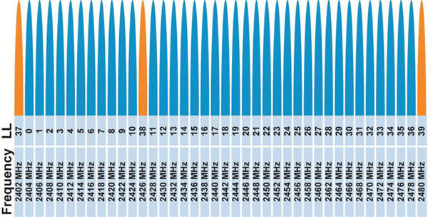

[出典](http://www.connectblue.com/press/articles/shaping-the-wireless-future-with-low-energy-applications-and-systems/)

BLEはまた1Mbpsの GFSK変調を使用しており、これによってBluetooth Classicよりも広い到達距離を実現している。

BLEは適応型周波数ホッピングアルゴリズムを使い、利用可能なチャンネルの一部だけを使ってホッピングを行う。これにより、状態の悪いチャンネルによるパケットロスから素早く回復できる。
この手法によって、無線の消費電力を抑えることができる。
Bluetooth Classicは疑似ランダムなホッピングシーケンスを使い、1秒間に1,600回送信周波数を切り替える。

もう一つ押さえておきたい点として、BLEは1台のマスターに最大128台のデバイスを接続できるが、Classicではわずか7台にとどまる。

**BLEを他の無線プロトコルと、無線アプリケーションの観点から比較する**

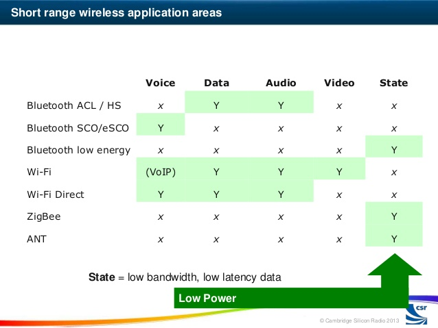

出典：[Cambridge Silicon Radio](http://www.csr.com/)

#### BLEスタック

BLEのスタックは、低電力の用途を念頭に特化して設計されている。

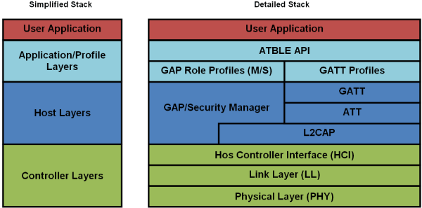

出典：[blueradios.com](http://blueradios.com/)

BLEの核となるのは、GAPとGATTというプロファイルである。今回は、この2つに絞って扱う。

Generic Access Profile（GAP）とGeneric Attribute Profile（GATT）は、私たちが周囲の人と基本的にどうコミュニケーションを取り、関わりを持つかに似ていると考えるとわかりやすい。
誰かと出会ったとき、まず自己紹介をし、自分についての基本的な情報を伝える。
その相手とつながりたい場合は、電話番号やメールアドレスのような個人情報を交換し、以降やり取りできるようにする。
一度そうすれば、次にその人と会ったとき、改めて自己紹介する必要はなく、他の情報のやり取りをすぐに始められる。
GAPは、自己紹介をする最初の出会いの段階にあたり、GATTは、その相手との接続を確立し、実際の通信を始める段階にあたる。

#### Generic Access Profile（GAP）

GAPは、BLEデバイスが外部と通信するために使う仕組みを定義している。

**アドバタイジング**

この段階では、デバイスは次の2つの状態のいずれかを取ることができる。

- **ブロードキャスト段階**：デバイスがデバイス名、信号強度、製造情報など、公開のアドバタイジングデータパケットをブロードキャストする段階。
- **観測段階**：デバイスがアドバタイジングパケットを受信する段階。この時点ではまだデバイス間の接続は確立されていない。同じアドバタイザーを複数のデバイスが観測していることもある。

接続を確立する過程で、デバイスはそれぞれ次のような役割を担うことになる。

- **ペリフェラル**：ブロードキャストするデバイスがペリフェラルの役割を担う。デバイスとの疑似的な接続を形成し、接続が確立される前に、セントラルデバイスからの接続要求に応じてより多くの情報を提供する。
- **セントラル**：観測側のデバイスが、アドバタイズしているデバイスへの接続を開始すると、セントラルデバイスの役割を担う。マスターと考えることもでき、一度に複数のペリフェラルに接続できる。

ペリフェラルとセントラルの間で接続が確立されると、アドバタイジングパケットはそれ以降送信されなくなる。
ここからは、双方向の通信にGATTプロファイルが使われることになる。

#### Generic Attribute（GATT）プロファイル

GATTプロファイルは、属性プロトコルで定義されているサービスやキャラクタリスティックといった属性を使って、2台のBLEデバイスがどう通信するかを定義している。

GAPと同様、通信するデバイスにはそれぞれ決まった役割が割り当てられる。

- **クライアント**：たいてい、セントラルデバイスがクライアントの役割を担う。GATTサーバーへリクエストを送り、サーバー上の属性を読み書きできる。
- **サーバー**：たいてい、ペリフェラルがサーバーの役割を担う。これらの属性を保存しているため「サーバー」と呼ばれる。サーバーはクライアントからのリクエストに応じ、必要な属性を送り返す。

ペリフェラルもセントラルも、データの流れによってサーバーにもクライアントにもなりうる。

接続を確立する際、セントラルとペリフェラルは「接続間隔」を決める。これは、それぞれの接続イベントの間の時間を指す。

さらに詳しい情報は、以下のBluetooth SIGのページで確認できる。

- [Bluetooth Low Energy Core Specifications](https://www.bluetooth.com/specifications/adopted-specifications)
- [Bluetooth Low Energy Developer Resources](https://developer.bluetooth.org/TechnologyOverview/Pages/BLE.aspx)

BluetoothやBLEをBluetoothベースのIoTプロジェクトに直接活用する際の理解を深めるため、次のチュートリアルやブログ記事も確認してみてほしい（いずれも英語）。

- [Enginursday: First Impressions of the ESP32](https://news.sparkfun.com/2017)
- [The Fellowship of the Things: Episode 6 - Bluetooth Fitness Bracer](https://news.sparkfun.com/2062)
- [RN-52 Bluetooth Hookup Guide](https://learn.sparkfun.com/tutorials/rn-52-bluetooth-hookup-guide)
- [Understanding the BC127 Bluetooth Module](https://learn.sparkfun.com/tutorials/understanding-the-bc127-bluetooth-module)

## RFIDとNFC

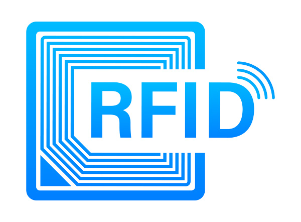

無線周波数識別（RFID）は、物体をワイヤレスで追跡・識別するために使われる通信方式である。

複雑に見えるかもしれないが、実際にはもっとも単純な通信方式の一つであり、それこそが、いたるところに存在しながらも目立たない理由になっている。
世界中で消費財の追跡に使われているだけでなく、料金収受のための車両追跡にも使われている。病院では患者の追跡に、農家では家畜の追跡に使われている。
RFID技術は私たちの生活の一部になっており、それがどう影響しているかにすら気づいていないことも多い。

単純に言えば、RFIDタグはユニバーサル・プロダクト・コード（バーコード）に近い代替品と考えることができる。ただし、より効率的である。

RFIDタグは、従来のバーコードにはない読み書き機能を持つ。更新したり、変更したり、ロックしたりできる。

RFID技術は、タグとリーダーから構成される。

### タグ

タグは、RFIDシステムにおけるエンドポイントである。
タグの用途に応じて、識別情報とその他の情報を保存する。タグには2種類ある。

- **アクティブタグ**：何らかのオンボード電源（たいていは電池）を持つタグで、より強い信号を送信できるため、より広い到達距離を持つ。この種のタグは、リーダーの有無にかかわらず定期的に信号を送信できる。
- **パッシブタグ**：内蔵の電源を持たず、リーダーの近くにあるときだけ起動するタグである。地下鉄やバスの定期券はたいていパッシブタグで、リーダーに触れると起動する。これらのタグは、リーダーが送信する電波エネルギーを収集して動作する。

**アクティブRFIDタグの内部――オンボードの電池に注目**

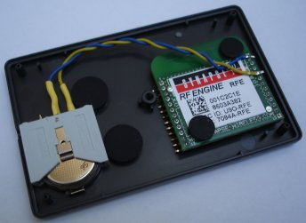

[出典](http://www.ns-tech.co.uk/blog/2010/02/active-rfid-tracking-system/)

**パッシブタグ――比較すると非常に小さいことに注目**

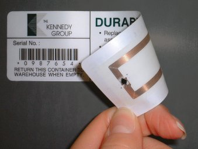

出典：http://www.harlandsimon.co.uk

パッシブRFIDタグは、主に次の3つの周波数帯で動作する。

```
* 低周波（LF）125〜134kHz
* 高周波（HF）13.56MHz
* 極超短波（UHF）856MHz〜960MHz
```

### リーダー

リーダーは、RFIDタグと似たような構造をしている。
タグとの間で信号を送受信するためのアンテナを備えている。
リーダーは電池で動くこともあれば、コンセントに接続されることもある。パッシブタグをリーダーの近くで起動させるには、強いRF信号が必要になるからである。
リーダーはリーダーコントローラーに接続されており、リーダーが読み取った情報を管理する。
用途によっては、リーダーがタグへの書き込みや更新を行うこともある。
たとえば、地下鉄の改札にあるリーダーは入口にあり、乗客がカード（タグ）をリーダーにかざすと、カード内の残高を読み取って入場を許可する。乗客が出るときには、運賃を計算してカードの残高を更新する。

RFIDタグには、主に次の3つの構成要素がある。

- 識別情報の保存、処理、RF信号の変調・復調を行う集積回路（IC）
- 電波を送受信するアンテナ
- （アクティブタグの場合）電源（電池）

リーダーとタグを合わせて、RFIDシステムを構成する。

**基本的なRFIDシステム**

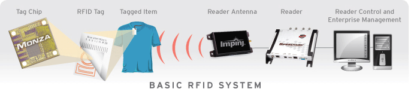

出典：[www.impinj.com](http://www.impinj.com/)

上の画像は、非常に基本的なRFIDシステムを示している。
タグチップはRFIDタグの中の集積回路である。このICが、タグに演算、メモリ、その他の拡張機能を提供する。
タグチップにはアンテナがあり、タグ付けされた物体の情報を送受信する。
受信側のアンテナはRF信号を受信し、パッシブRFIDタグに励起エネルギーを与えることもある。
読み取られた情報は、リーダーの制御・管理ソフトウェアへと送られる。

## NFC

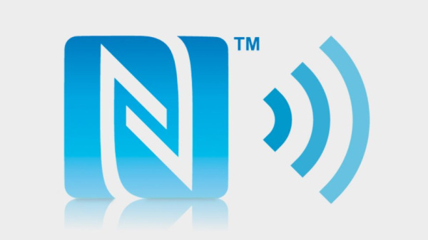

出典：[techradar.com](http://www.techradar.com/us)

近距離無線通信（NFC）は、RFベースの通信プロトコルである。
RFIDプロトコルのサブセットにあたるため、RFIDに似ているが、重要な違いもある。
NFCも非常に人気の高い技術になっており、現在のスマートフォンの10台中9台がNFC機能を搭載して出荷されている。
これによって、Apple PayやGoogle Walletのような非接触決済が可能になっている。

NFC対応のスマートフォンは、2台を触れ合わせるだけで、連絡先情報や写真のようなデータのやり取りを簡単な操作で行える。
Android Beamのようなアプリがこれを実現しているが、Appleの端末では、現時点でNFCはApple Payにしか使われていない。

BMWのような自動車メーカーは、NFC対応の車のキーで車のドアを開けるためにNFCを使っている。
広告やマーケティングコンテンツの中には、NFC対応のスマートフォンをタップしたりかざしたりして、アプリをダウンロードしたり、製品についてのより詳しい情報を得たりするものも見かけたことがあるだろう。

NFCは、非常に短い距離（数センチメートル）での通信を想定して設計されている。
もっとも電力効率のよい通信プロトコルの一つである。
NFCは、高周波RFIDと同じ13.56MHz帯で動作するため、NFCデバイスはHF RFIDタグを読み取ることもできる。

NFCには2種類のデバイスがある（NFCでは、デバイス自体がタグにもリーダーにもなりうる点に注意してほしい）。

- **イニシエーター**：通信を開始するデバイスをイニシエーターと呼ぶ。パッシブなターゲットに電力を供給できるRF場を能動的に生成する。
- **ターゲット**：イニシエーターから情報を受け取るデバイスである。ターゲットは（単純なNFCタグの場合のように）パッシブであることもあれば、スマートフォンどうしのピアツーピア通信のようにアクティブであることもある。

### RFID対NFC

この2つの通信プロトコルには本質的な類似点があるため、その違いはよく話題になる。

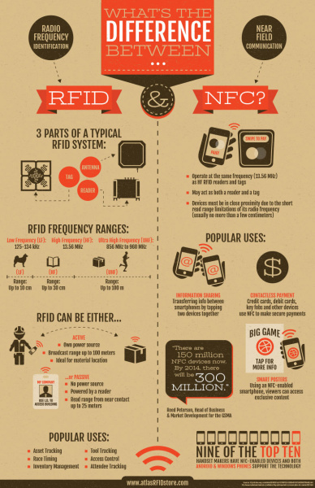

出典：[RFIDinsider](http://blog.atlasrfidstore.com/rfid-vs-nfc)

NFCとRFIDはどちらも、私たちの身の回りにあるさまざまな物やデバイスで使われている、遍在する技術であるため、IoTにおいてもどちらも有用なプロトコルである。
これらのプロトコルは、タグとリーダーの間だけでなく、それらすべてをインターネットに接続することで、身の回りのさまざまな物への橋渡しを提供してくれる。

さらに詳しく学びたい場合は、次のチュートリアルやブログ記事も参考にしてほしい（いずれも英語）。

- [Circuit Bending RFID](https://news.sparkfun.com/227)
- [Engineering Roundtable - RFID Garage Door "Open Sesame!"](https://news.sparkfun.com/1114)
- [Enginursday - RFID technology](https://news.sparkfun.com/1284)
- [We are the Borg](https://news.sparkfun.com/1998)
- [SparkFun RFID Starter Kit Hookup Guide](https://learn.sparkfun.com/tutorials/sparkfun-rfid-starter-kit-hookup-guide)

## まとめ

私たちは、インターネットがコミュニケーションと協働のあり方をどう変革してきたかを目の当たりにしてきた。
インターネットの新しい時代は、単に人と人だけの話ではない。私たちを取り巻く世界、そして知能を持ち互いにつながったデバイスについての話でもある。

ここまで見てきたプロトコルは、必ずしもすべてがIoTを念頭に設計されたものではないが、それでもIoT向けの用途にうまく適応してきた。

IoTの成長に伴い、IoTネットワークに特化した新しいプロトコルの開発が今後も進んでいくのは避けられない。
これらのつながったスマートデバイスには、今日の人間中心のインターネットとは異なる要件がある。

これらのプロトコルには、3種類の異なる接続形態がある。

- **デバイス間**（D2D）：デバイスどうしが直接通信する必要がある場合
- **デバイス・サーバー間**（D2S）：デバイスのデータが収集され、サーバーへ送られる場合
- **サーバー間**（S2S）：サーバーのデータが、分析やデバイスへの返送のために他のサーバーと共有される場合

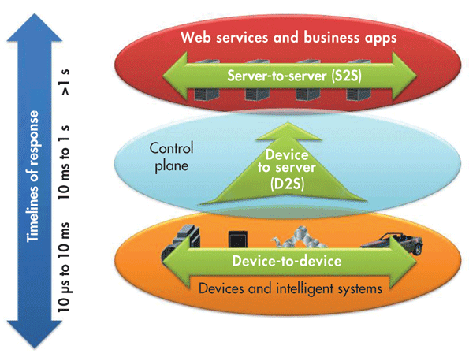

出典：[electronicdesign.com](http://electronicdesign.com/)

ここでは、上記のさまざまな接続形態に触れながら、次の4つのプロトコルについて紹介する。

- **MQTT**（Message Queue Telemetry Transport）：デバイスのデータを収集し、サーバーへ送信するためのプロトコル
- **XMPP**（Extensible Messaging and Presence Protocol）：サーバーに接続された人とデバイスをつなぐためのプロトコル
- **DDS**（Data Distribution Service）：インテリジェントなデバイス間の高速通信のためのプロトコル
- **AMQP**（Advanced Message Queuing Protocol）：異なるサーバー間の効果的な通信のために設計されたプロトコル

### MQTT


[MQTT.org](http://mqtt.org/)は、MQTTを次のように定義している。M2M（機械間通信）のためのIoT接続プロトコルである。
非常に軽量なパブリッシュ／サブスクライブ型のメッセージング伝送方式として設計されている。
小さなコードフットプリントが求められる、あるいはネットワーク帯域が貴重なリモート環境との接続に役立つ。
たとえば、衛星回線経由でブローカーと通信するセンサーや、医療機関との断続的なダイヤルアップ接続、さまざまなホームオートメーションや小型デバイスのシナリオで使われてきた。
サイズが小さく、消費電力が低く、データパケットが最小限に抑えられ、1つまたは複数の受信者へ効率的に情報を配信できることから、モバイルアプリケーションにも最適である。

MQTTの目的は、多数のデバイスからデータを収集し、そのデータをITインフラへ運ぶことである。
何千ものセンサーからのデータを1か所に集めて分析する必要がある場合、もっとも優れた解決策の一つになりうる。

MQTTプロトコルについてのさらに詳しい情報は、[こちら](https://zoetrope.io/tech-blog/brief-practical-introduction-mqtt-protocol-and-its-application-iot)で確認できる。

### XMPP


[XMPP.org](http://xmpp.org/)は、これを次のように説明している。Extensible Messaging and Presence Protocolは、インスタントメッセージング、プレゼンス、複数人でのチャット、音声・映像通話、コラボレーション、軽量なミドルウェア、コンテンツ配信、そしてXMLデータの汎用的なルーティングのためのオープンな技術群である。

XMPPは、つながったデバイスどうしが互いを発見し、会話を始める、つまり私たちがそうするように情報のやり取りを始めるための手段だと考えるとよい。

XMPP-IoTについてのさらに詳しい情報は、[こちら](http://wiki.xmpp.org/web/InternetOfThings)で確認できる。

### DDS


デバイス・サーバー間のプロトコルであるMQTTやXMPPとは異なり、DDSはデバイスのデータを直接利用するデバイスどうしを使う。
これは、あるデバイスのデータを別のデバイスへ配信するためのプロトコルである。
DDSは、1秒間に何百万ものメッセージを、多数の受信者へ同時に効果的に配信できる。

DDSはピアツーピア型の通信である。サーバーやメッセージブローカーを排除することで、通信が単純化され、遅延が最小限に抑えられ、複雑さも軽減される。
信頼性が高く高性能なアーキテクチャを必要とするIoTの用途において、信頼できる選択肢である。

DDSについてのさらに詳しい情報は、[こちら](https://info.rti.com/hubfs/whitepapers/Right_Middleware_for_IIoT.pdf)で確認できる。

### AMQP


AMQPは、サーバー間のプロトコルである。サーバー間でトランザクションメッセージを送信する。
AMQPの主な特徴は信頼性であり、データを失うことなく何千ものキューに入ったトランザクションを送信できる。

[AMQP.org](http://www.amqp.org/)は、このプロトコルを次のように定義している。アプリケーションや組織間でビジネスメッセージをやり取りするためのオープンな標準である。
システムどうしを接続し、必要な情報をビジネスプロセスへ供給し、その目標を達成するための指示を確実に先へと伝える。

AMQPはもともと、重要なメッセージを追跡・配信するためのミドルウェアとして、銀行業界向けに開発されたものである。
IoTの文脈では、異なるサーバーからのデータを効果的な分析のためにやり取りする必要がある、サーバーベースの分析機能に最適である。

結論として、IoT向けの決定的な最良のプロトコルというものは存在しない。IoTはまだ標準化できる段階になく、この先も永遠に標準化できないかもしれない。
その用途の多様さと、無数の異なる種類のつながったデバイスこそが、IoTを唯一無二のものにしている。

したがって、最良のプロトコルは用途によって決まるということになる。
IoT向けのMQTTとCoAPプロトコルについてより詳しく掘り下げた、次のブログ記事も参考になるかもしれない。

- [Exploring the Protocols of IoT](https://news.sparkfun.com/1705)

タグ: Bluetooth、概念、IoT、MQTT、WiFi、無線、XBee

---

出典：[Connectivity of the Internet of Things](https://learn.sparkfun.com/tutorials/connectivity-of-the-internet-of-things)（SparkFun Learn）を日本語に翻訳し、再構成した。
原文は [CC BY-SA 4.0](https://creativecommons.org/licenses/by-sa/4.0/) ライセンスで公開されており、本ページも同ライセンスの下で提供する。
