# コネクタの基礎

**コネクタ**は、回路のさまざまな部分をつなぎ合わせるために使われる。
たいていコネクタが使われるのは、電源の入力、周辺機器との接続、交換する可能性のある基板など、将来その部分を切り離せるようにしておきたい場面である。

このチュートリアルで扱う内容:

- コネクタの基本的な用語
- コネクタをいくつかのカテゴリに分類する
- カテゴリの中でのコネクタどうしの違い
- 極性を持つコネクタの見分け方
- 用途に応じてどのコネクタが適しているか

参考になるチュートリアル:

- [回路とは何か](./what-is-a-circuit.md)
- [電圧、電流、抵抗とオームの法則](./voltage-current-resistance-and-ohms-law.md)
- [配線の基本](./working-with-wire.md)
- [極性](./polarity.md)
- [プロジェクトへの電源供給](./how-to-power-a-project.md)

## コネクタの用語

よく使われるコネクタの話に入る前に、コネクタを説明するときに使われる用語を確認しておこう。

### ジェンダー（性別）

**ジェンダー**とは、コネクタが差し込む側か、差し込まれる側かを表す言葉であり、それぞれ「オス」「メス」と呼ばれる。
ただし、見た目はメスなのに「オス」と呼ばれる例外的なコネクタもあり、個々の部品を説明する中でそうした例といくつかの理由にも触れていく。

### 極性

**極性**：ほとんどのコネクタは、決まった1つの向きでしか接続できない。
この性質を極性と呼び、間違った向きで挿さらないようになっているコネクタは**極性を持つ**、あるいは**キー付き**であるという。

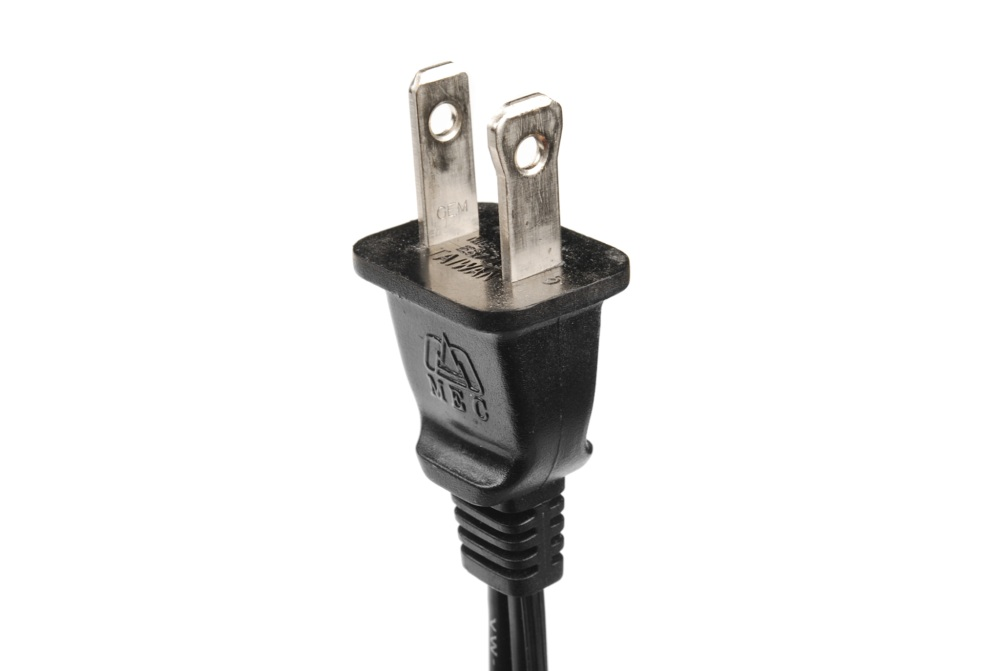

### 接点

**接点**：接点はコネクタの本体にあたる部分であり、互いに触れ合って電気的な接続を作る金属部品である。
問題が起きやすいのもこの部分であり、接点が汚れたり酸化したりすることや、接点どうしを押さえつけるばねの力が時間とともに弱まることがある。

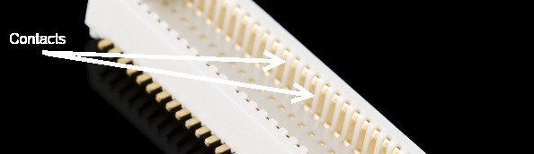

### ピッチ

**ピッチ**：多くのコネクタは、規則的な間隔で並んだ接点の配列でできている。
コネクタのピッチとは、ある接点の中心から隣の接点の中心までの距離のことである。
見た目がよく似ていてもピッチが異なるコネクタの系列がいくつもあるため、正しい相手方のコネクタを購入するのが難しくなることがあり、この点は重要である。

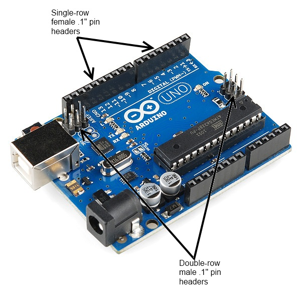

### 嵌合回数（メイティングサイクル）

**嵌合回数**：コネクタの寿命には限りがあり、抜き差しを繰り返すことで摩耗していく。
データシートでは、たいていこの寿命を**嵌合回数**として表しており、技術によって大きく差がある。
USBコネクタは数千から数万回の寿命を持つこともあるが、民生機器の内部で使われる基板間コネクタは数十回程度に限られることもある。
用途に見合った寿命のコネクタを選ぶことが重要である。

### 実装方法（マウント）

**マウント**：この言葉は紛らわしい場合がある。
「マウント」は、実際にどう取り付けられているか（パネル取り付け、宙づり、基板取り付け）、取り付け対象に対してどんな角度になっているか（ストレートかライトアングルか）、機械的にどう固定されているか（はんだ付けタブ、表面実装、スルーホール）など、いくつもの意味で使われる。
それぞれのコネクタの解説の中で、もう少し詳しく触れていく。

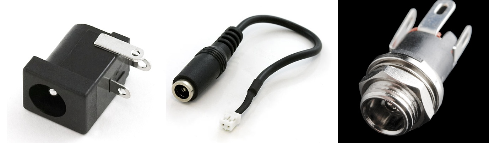

### ストレインリリーフ

**ストレインリリーフ**：コネクタが基板やケーブルに取り付けられているとき、その電気的な接続部分は壊れやすいことが多い。
そこで、コネクタにかかる力を、壊れやすい電気接続部分ではなく、より頑丈な部分に逃がすための仕組みを設けるのが一般的である。
これについても、後ほど良い例をいくつか紹介する。

## USBコネクタ

**USBコネクタ**には、ホスト用と周辺機器用の2種類がある。
USB規格の中ではこの2つは区別されており、ケーブルや機器のコネクタもそれを反映した形になっている。
ただし、すべてのUSBコネクタには次のような共通点がある。

- **極性がある**：USBコネクタは、原則として一方向にしか挿せない。無理に逆向きに挿すこともできてしまうが、その場合は機器を壊すことになる。
- **4本の接点**：すべてのUSBコネクタには少なくとも4本の接点がある（5本のものや、[USB 3.0以降](https://ja.wikipedia.org/wiki/USB_3.0)ではさらに多くの接点を持つものもある）。これらは電源、グラウンド、2本のデータ線（D+とD-）用である。USBコネクタは5V、最大500mAを伝送するように設計されている。
- **シールド**：USBコネクタには、回路の一部ではない金属製のシェルによるシールドが施されている。電気的なノイズの多い環境で信号を保つために重要である。
- **確実な電源接続**：データ線を通して機器に電源を供給してしまわないよう、電源ピンはデータ線より先に接続される必要がある。すべてのUSBコネクタはこれを踏まえて設計されている。
- **モールド成形のストレインリリーフ**：すべてのUSBケーブルは、コネクタ部分にプラスチックのモールドが施されており、ケーブルにかかる力が電気的な接続部分を傷めないようになっている。

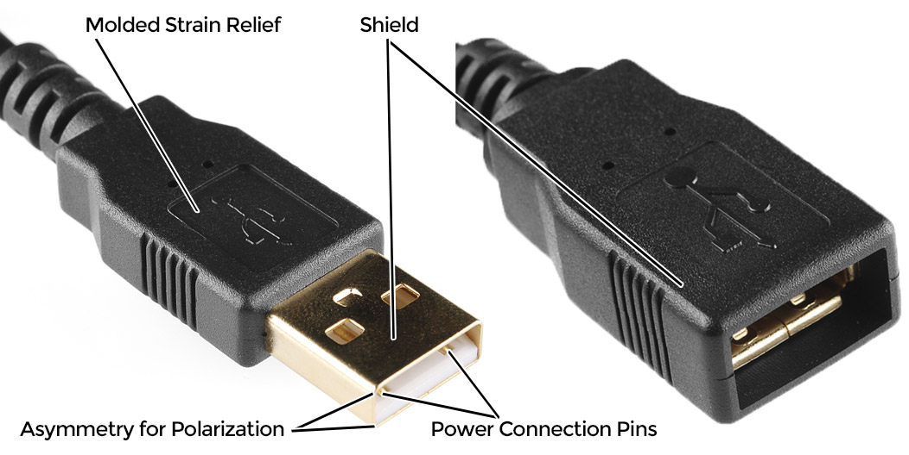

### USB-Aコネクタ

**USB-Aメス**は、標準的な「ホスト」側のコネクタである。
パソコンやハブなど、周辺機器を接続する側の機器に見られる。
メスのA端子とオスのA端子を両端に持つ延長ケーブルもある。

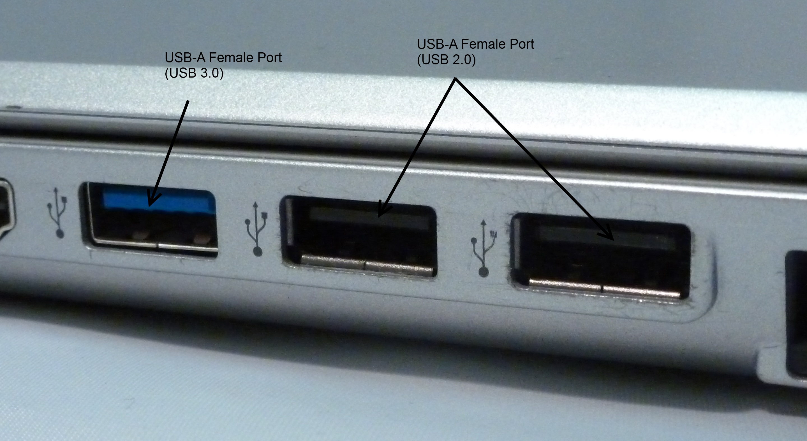

**USB-Aオス**は、標準的な「周辺機器」側のコネクタである。
たいていのUSBケーブルの片方の端はUSB-Aオスになっており、キーボードやマウスのような機器には、あらかじめこの端子が付いたケーブルが内蔵されていることも多い。
USBメモリのように、基板取り付け型のUSB-Aオスコネクタもある。

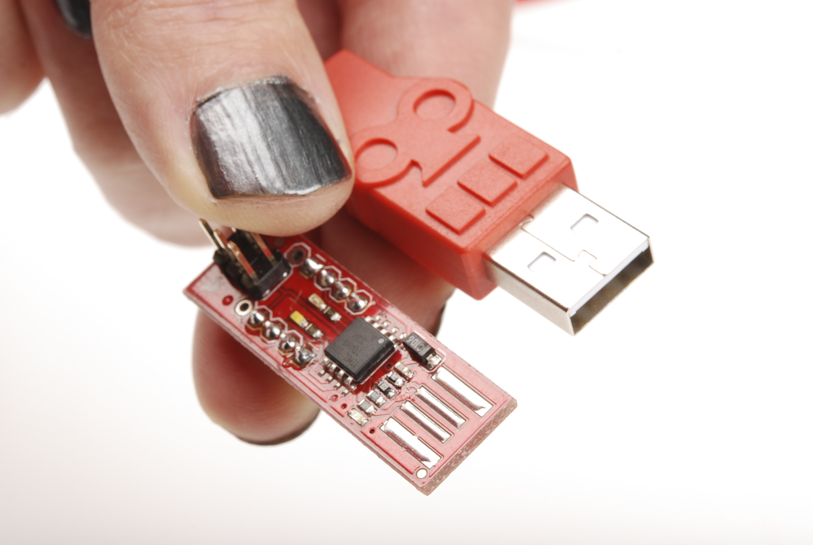

### USB-Bコネクタ

**USB-Bメス**は周辺機器向けの規格である。
かさばるが頑丈であるため、サイズが問題にならない用途では、取り外し可能なUSB接続を提供する手段として好まれる。
たいていはスルーホールの基板取り付け型で信頼性が高いが、パネル取り付け型もある。

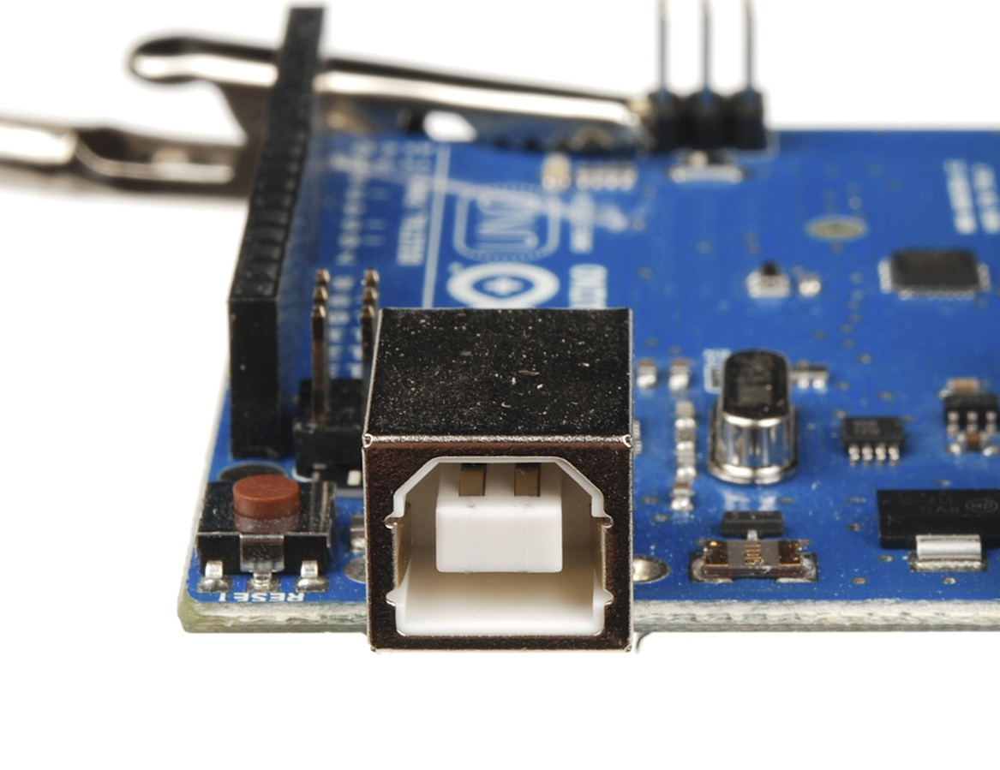

**USB-Bオス**は、ほぼケーブルの先端にしか見られない。
USB-Bケーブルはどこにでもあり安価なため、USB-B接続の普及にも一役買っている。

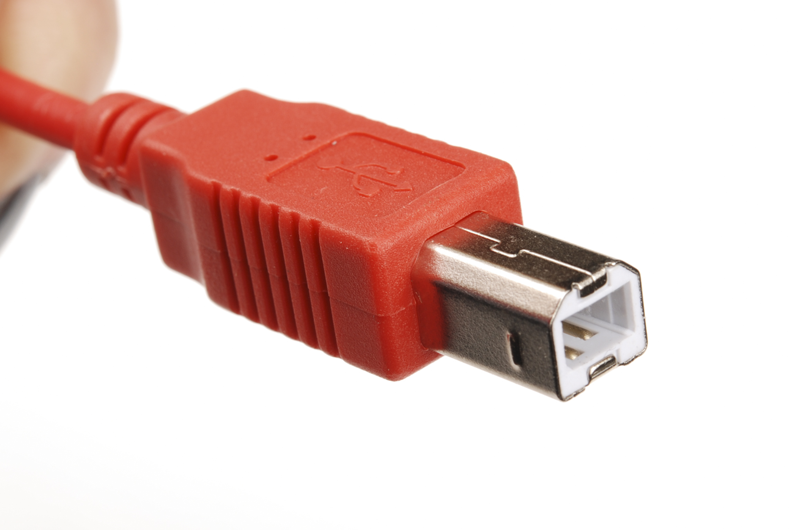

### USB-Miniコネクタ

**USB-Mini**は、小型機器向けにUSBコネクタを小型化しようとした最初の標準的な試みだった。
USB-Miniメスは、MP3プレーヤーや旧型の携帯電話、小型の外付けハードディスクなど、比較的小さな周辺機器に使われることが多く、たいてい表面実装型で、頑丈さよりも小型化を優先している。
USB-Miniは、USB-Microコネクタに徐々に置き換えられつつある。

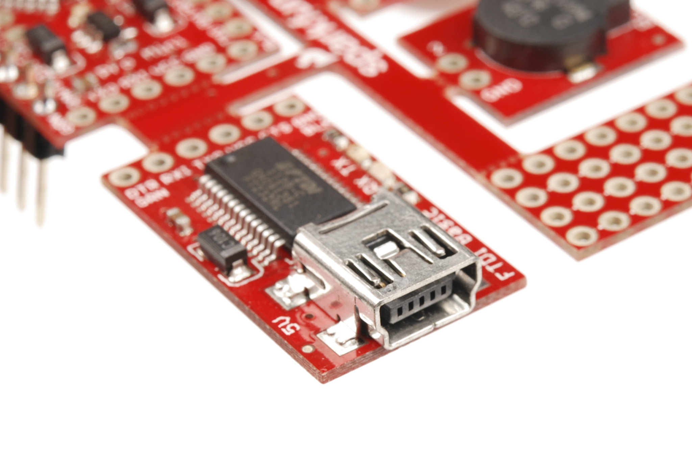

**USB-Miniオス**も、ケーブル専用のコネクタである。
USB-Bと同じく非常に一般的で、どこでも安価に手に入る。

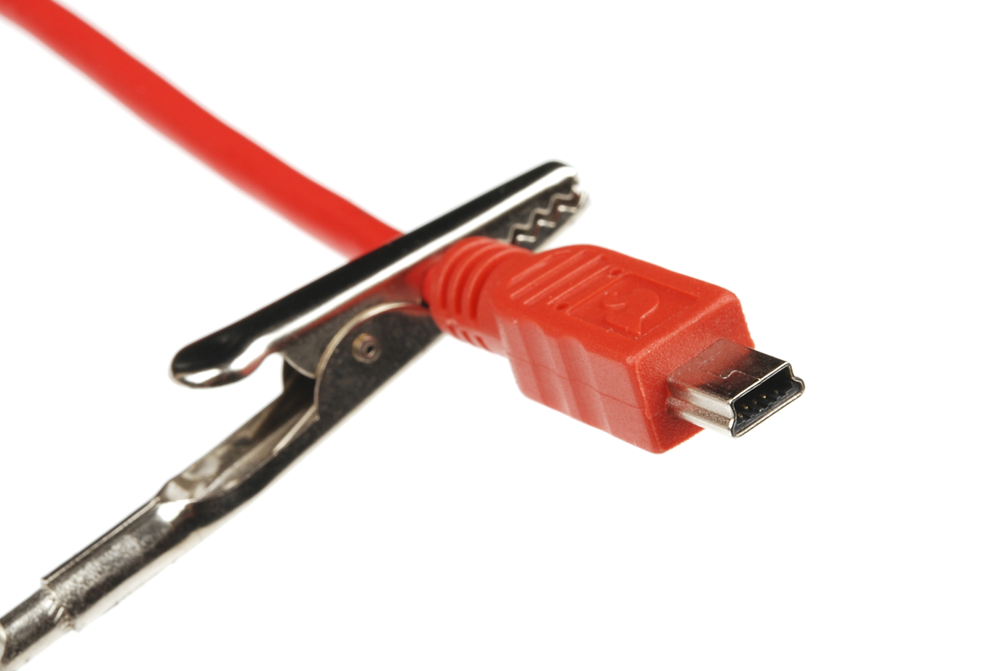

### USB-Microコネクタ

**USB-Micro**は、USBコネクタの中でも比較的新しい規格である。
USB-Miniと同じく小型化が主眼だが、USB-Microには低速信号用の5本目のピンが追加されており、状況に応じてホストにも周辺機器にもなれるUSB-OTG（オンザゴー）用途に対応できる。

**USB-Microメス**は、デジタルカメラやMP3プレーヤーなど、比較的新しい周辺機器に多く見られる。
すべての新しい携帯電話やタブレットの標準的な充電ポートとしてUSB-Microが採用されたことで、充電器やデータケーブルもますます一般的になっており、今後はUSB-Miniに代わって小型USBコネクタの主流になっていくと見られる。

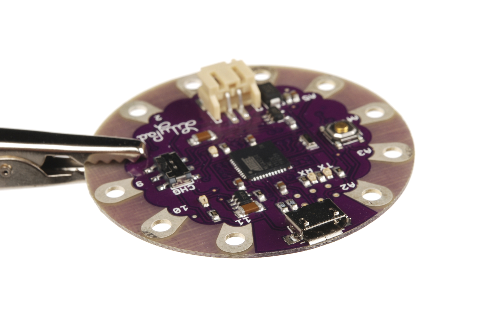

**USB-Microオス**も、ケーブル専用のコネクタである。
USB-Microオス端子を持つケーブルには、USB-Microポートを持つ機器を周辺機器としてUSBホストに接続するためのものと、USB-Microメスポートをアダプターとして通常のUSB-Aメスポートに変換し、USB-OTG対応機器で使うためのものの、大きく2種類がある。

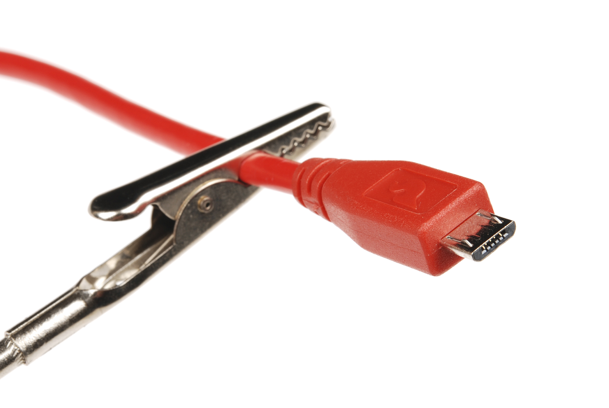

その後継として、**USB 3.0 Micro-B**（差動ペア2組とグラウンドのための追加ピンを持つ）や、上下どちら向きにも挿せる24ピンの**USB Type-C**も登場している。
USB Type-Cは500mAを超える電流にも対応できるため、電力を多く必要とする機器にも向いている。

> [!NOTE]
> ケーブルによっては、USB-Cのすべてのピンが使われているとは限らない。USB 3.1のフル規格ではなく、USB 2.0相当の4ピンしか配線されていないケーブルもある。使用するUSBポートによっては、機器に供給できる電流量が制限されることもある。

## オーディオ用コネクタ

もう1つよく知られたコネクタ群が、RCAや「フォン」といったオーディオビジュアル機器用のコネクタである。
USBの各規格ほど厳密に同じ系統とは言えないが、ここでは便宜上まとめて扱う。

### 「フォン」型コネクタ

1/8インチサイズのこのコネクタは、ヘッドホンの先端に付いているものとしてすぐにわかるだろう。
このコネクタには1/4インチ（6.35mm）、1/8インチ（3.5mm）、2.5mmという3つの一般的なサイズがある。
1/4インチサイズは主にプロ向けの音響機器や音楽業界で使われ、多くのエレキギターやアンプに1/4インチのTS（チップとスリーブ）ジャックが付いている。
1/8インチのTRS（チップ、リング、スリーブ）は、ヘッドホンや、MP3プレーヤーやパソコンの音声出力用コネクタとしてよく使われる。
携帯電話の中には、マイク付きのハンズフリー用ヘッドホンをつなぐために、2.5mmのTRRS（チップ、リング、リング、スリーブ）ジャックを備えているものもある。

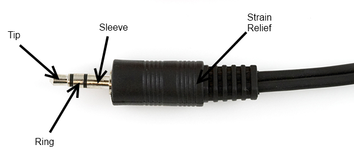

こうしたコネクタやケーブルは広く出回っているため、汎用の接続用途にも適している。
たとえばUSBが登場するはるか以前、[テキサス・インスツルメンツのグラフ電卓](https://ja.wikipedia.org/wiki/TI-85)は、シリアル通信用のコネクタとして2.5mmのTRSを使っていた。
TS型のコネクタは電源の伝送を想定した設計ではないことに注意してほしい。
挿し込む際にチップとスリーブが一瞬ショートすることがあり、電源を痛める可能性がある。
シールドがないため高速なデータ通信には向かないが、低速なシリアルデータであれば問題なく通せる。

### RCAコネクタ

何十年ものあいだ、家庭用オーディオの定番コネクタとして親しまれてきたRCAコネクタは、1940年代にRCA社が家庭用の蓄音機向けに導入したものである。
音響や映像の分野ではHDMIのような規格に徐々に取って代わられつつあるが、コネクタとケーブルの普及ぶりから、自作システムには今なお適した選択肢である。
廃れるまでには、まだしばらく時間がかかるだろう。

メスのRCAコネクタはたいてい機器側にあるが、延長用や変換用のケーブルにメス端子が付いていることもある。
RCAコネクタは、コンポーネント映像（販売地域によってPALかNTSC）、コンポジット映像、ステレオ音声、S/PDIF音声のいずれかの信号に使われることが多い。

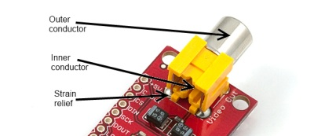

オスのRCAコネクタはたいていケーブル側にある。

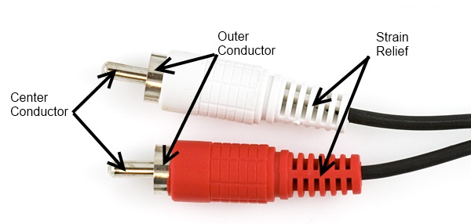

## 電源用コネクタ

多くのコネクタはデータと一緒に電源も伝送するが、中には電源の接続専用として使われるコネクタもある。
用途やサイズによってさまざまだが、ここではもっとも代表的なものだけを取り上げる。

### バレルコネクタ

**バレルコネクタ**は、かさばる[ACアダプター](https://www.sparkfun.com/products/8269)経由でコンセントにつなぐ、低価格の民生機器でよく見られる。
ACアダプターはさまざまな定格電力や電圧のものが広く出回っており、そのためバレルコネクタは小規模なプロジェクトへの電源供給によく使われる。

メス側のバレルコネクタ、いわゆる「ジャック」には、基板取り付け型（表面実装またはスルーホール）、ケーブル取り付け型、パネル取り付け型など、いくつかの種類がある。
中には、電源が差し込まれているかどうかを検出できる追加の接点を持つものもあり、外部電源で動作しているときに電池をバイパスして電池寿命を延ばすといった使い方ができる。

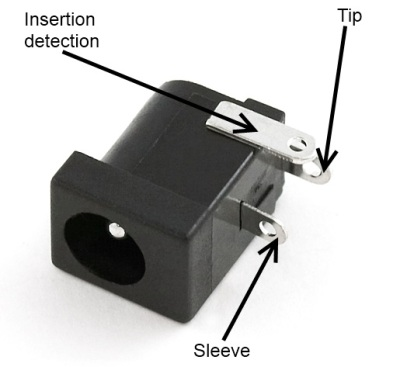

オス側のバレルコネクタ、いわゆる「プラグ」は、たいてい電線への取り付け用としてのみ販売されているが、電線への固定方法にはいくつかの種類がある。
あらかじめケーブルに取り付けられたプラグを購入することもできる。

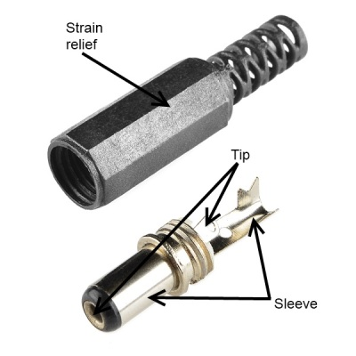

> [!NOTE]
> こうした低電力の同軸コネクタのジャックとプラグのどちらを「オス」と呼ぶかについては、意見が分かれることがある。
> 入手先によっては、中心にピンがあることを理由にジャック側を「オス」バレルコネクタと呼ぶこともあり、その場合プラグ側は逆になる。
> 目的のものが見つかったかどうかは、必ず商品写真と仕様を確認してほしい。

バレルコネクタは2本の接続、いわゆる「ピン（チップ）」と「スリーブ」しか持たない。
注文する際に区別すべき特性は3つあり、内径（ジャック内部のピンの直径）、外径（プラグ外側のスリーブの直径）、そして極性（スリーブの電圧がチップより高いか低いか）である。

**スリーブの直径**は、多くの場合5.5mmか3.5mmである。

**ピンの直径**はスリーブの直径によって決まり、5.5mmのスリーブには2.5mmまたは2.1mmのピンが組み合わされる。
残念ながら、これは2.5mmピン用のプラグが2.1mmのジャックにも物理的に挿さってしまうことを意味し、その場合の接続はよくても不安定なものになる。
3.5mmスリーブのプラグは、たいてい1.3mmピンのジャックと組み合わされる。

**極性**は最後に確認すべき要素であり、たいていスリーブが0V、チップがスリーブに対して正の電圧になる。
多くの機器には、その機器が想定する極性を示す小さな図が記載されており、これに従うことが重要である。
極性が違う電源を使うと、機器を壊してしまうことがある。

どちらのスリーブサイズのプラグも、たいてい長さ9.5mmだが、それより長いものや短いものもある。
SparkFunのすべての製品は、負極が5.5mmスリーブ、正極が2.1mmピンという組み合わせを採用しており、これが世の中でもっとも一般的な仕様と思われるため、できる限りこの標準に従うことをおすすめする。

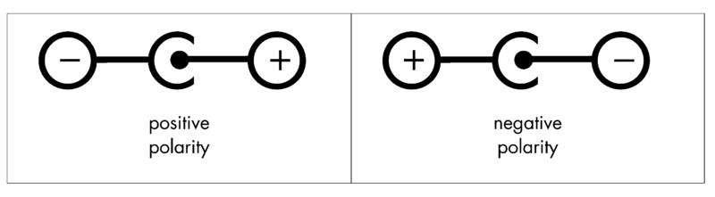

### 「Molex」コネクタ

パソコンのハードディスクや光学ドライブなど、内蔵の周辺機器の多くは、一般に「Molex」コネクタと呼ばれるコネクタから電源を得ている。
正確にはMolexシリーズ8981コネクタと言い、Molexとは1950年代にこのコネクタを最初に設計した会社の名前だが、いつしかその区別はあいまいになった。

Molexコネクタは大電流を流せるように設計されており、1ピンあたり最大11Aまで対応する。
CNCマシンや3Dプリンタのように大きな電力が必要なプロジェクトでは、デスクトップパソコン用の電源ユニットを使い、Molexコネクタを介して各回路に電力を供給する方法がよく使われる。

Molexコネクタは、オスとメスの呼び方が少し独特である。
メスコネクタはたいていケーブルの先端にあり、オスコネクタのピンを囲むプラスチックのシェルの中に差し込む形になっている。
たいていのMolexコネクタは圧入式で非常にきつく、数回程度の抜き差ししか想定されていないため、頻繁に接続を変える用途には向かない。

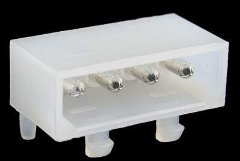

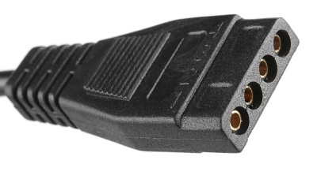

### IECコネクタ

Molexコネクタと同じく、これも一般名がある特定の部品を指す言葉として定着した例である。
IECコネクタは、たいていデスクトップパソコンの電源ユニットに見られる電源入力口を指す。
厳密には[IEC 60320-1](https://ja.wikipedia.org/wiki/IEC_60320)のC13（メス）およびC14（オス）コネクタである。

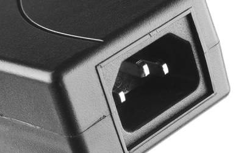

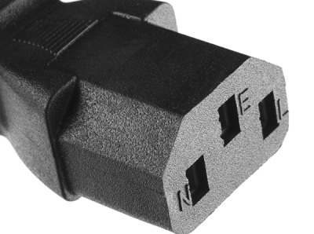

IECコネクタは、ほぼ交流電源の入力専用として使われる。
プロジェクトにこのコネクタを使う利点は、IECから壁コンセントまでのケーブルが非常に一般的であり、世界各国のコンセント形状に合わせたものが手に入りやすいことである。

### JSTコネクタ

SparkFunでは「2.0mm JSTコネクタ」という呼び方をよく使う。
これもまた、特定の製品を指す一般化された名称であり、JSTは高品質なコネクタを作る日本の会社の名前で、私たちがよく使う2.0mm JSTコネクタは、PHシリーズの2極極性付きコネクタである。

SparkFunのシングルセルのリチウムポリマー電池はすべて、標準でこのタイプのJSTコネクタを備えており、多くの基板もこのコネクタ（またはそのフットプリント）を電源入力として採用している。
コンパクトで頑丈、そして逆向きに接続しにくいという利点がある。
もう1つの特徴として、いったん接続すると外すのがかなり大変（丁寧に扱えばニッパーで外すこともできる）という点があり、これは見方によって長所にも短所にもなる。
使用中に外れにくい反面、充電のために電池を外そうとすると、コネクタを傷めてしまうこともある。

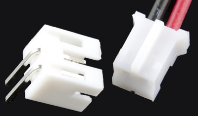

3極以上のPHシリーズコネクタもあり、SparkFunでも扱っているが、もっともよく使われるのは2極の電池用コネクタである。

## SMAアンテナコネクタ

[SMAコネクタ](https://ja.wikipedia.org/wiki/SMA_connector)の紛らわしい命名規則についても簡単に触れておく。

SparkFunでは、[GPS](https://www.sparkfun.com/categories/17)、[Bluetooth](https://www.sparkfun.com/categories/115)、セルラー通信、[Nordic](https://www.sparkfun.com/products/705)、[XBee](https://www.sparkfun.com/categories/111)など、外部アンテナへ50Ω系のインピーダンス接続が必要な基板の一部にSMA系コネクタを使っている。
ただし、基板によってSMAコネクタのジェンダーや極性が異なるため、それぞれの基板のRFコネクタに合ったアンテナを選ぶ必要がある。

もともとのSMA規格では、オス（中心にピン、内側にねじ）とメス（中心に穴、外側にねじ）という組み合わせが定義されていた。
しかしこの構成には問題があり、FCC（アメリカ連邦通信委員会）がPart 15への準拠を進める中で、SMA系のRFコネクタのジェンダー（中心ピン）を入れ替える方向に動いた。
これは、家庭用の無線機器（家庭用Wi-Fiなど）にアンテナをねじ込むときに、一般ユーザーがRF機器を壊してしまうのを防ぐための変更である。
すべてのアンテナがメスであれば、中心の接点を壊す心配がなくなる。

このPart 15対応で変わったのは中心ピンだけであり、これによって極性が逆転した「新しい」規格、**RP-SMA**（リバースポーラリティSMA）が生まれた。
「RP（リバースポーラリティ）」という名前は、そのねじ山側のジェンダーに由来しており、ピン側は通常と逆のジェンダーになる。

外部アンテナ用にu.FLコネクタを備えていないSparkFunのRF基板やアンテナでは、旧規格（SMA）と新規格（RP-SMA）が次のように使い分けられている。

- それぞれ900/1700/1800MHz帯、1.57542GHz帯は、たいてい旧規格を使う：アンテナがSMAオス、モジュールがSMAメス。
- Bluetooth、ZigBee、Wi-Fi、Nordicは、たいてい新規格を使う：アンテナがRP-SMAオス、モジュールがRP-SMAメス。

実際のところ、ジェンダーの表記自体はあまり気にしなくてよい。
RP-SMAの基板やモジュールにはRP-SMAのアンテナを、SMAにはSMAのアンテナを合わせればよいだけである。
アンテナの対応周波数を基板に合わせることだけ忘れないようにしたい。

## ピンヘッダーコネクタ

ピンヘッダーコネクタには、いくつかの接続方式が含まれる。
一般には、片側がPCBにはんだ付けされたピンの列になっており、基板面に対して垂直（「ストレート」と呼ばれる）か、平行（紛らわしいことに「ライトアングル」と呼ばれる）に取り付けられる。
こうしたコネクタにはさまざまなピッチがあり、ピンの列数もいろいろである。

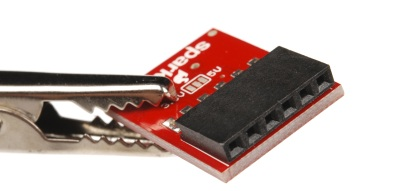

もっともよく見かけるピンヘッダーは、0.1インチ（2.54mm）ピッチの単列または複列のコネクタである。
これは[標準的なブレッドボード](./how-to-use-a-breadboard.md)と互換性のあるピッチであり、[オス](https://www.sparkfun.com/products/116)と[メス](https://www.sparkfun.com/products/115)の両方があり、Arduinoボードとシールドをつなぐのもこのタイプのコネクタである。
ブレッドボードへのジャンパー線の接続も簡単に行える。

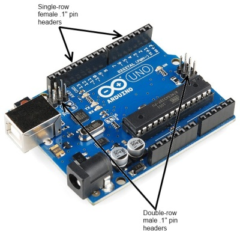

これ以外のピッチも珍しくなく、たとえば[XBee無線モジュール](https://www.sparkfun.com/products/8664)は同じ系統のコネクタの[2.0mmピッチ](https://www.sparkfun.com/products/8272)版を使っている。

この部品にはよくある派生形として「マシンピン」版がある。
通常版が金属板を打ち抜いて折り曲げて作られるのに対し、マシンピン版は金属を削り出して成形されるため、より頑丈で接触も良く長寿命になる分、価格も高くなる。

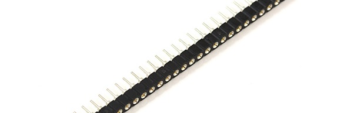

こうしたピンヘッダーに接続するケーブルには、たいてい**圧着**コネクタ付きの個別の電線か、**絶縁貫通接続**（IDC）コネクタ付きのリボンケーブルのどちらかが使われる。
IDCコネクタはリボンケーブルの端に単純にクランプするだけで、ケーブル内のすべての導体に接続できる。
一般に、ケーブル側はメスのみで、相手側にオスのピンがある構成が前提になっている。

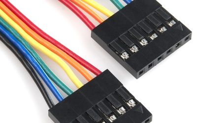

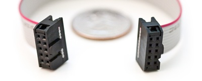

## 一時的な接続用のコネクタ

### ねじ端子

被覆のない裸の電線を回路に接続したい場合には、**ねじ端子**が便利である。
複数の異なる機器を切り替えて接続したい場面にも向いている。

ねじ端子の欠点は、比較的簡単に緩んでしまい、裸の電線が回路の中でぶらつく状態になりかねないことである。
少量のホットグルーを使えば、後で外すことにそれほど苦労せずにこれを防げる。

ねじ端子は、対応する電線の太さの範囲が狭いことが多く、細すぎる電線も太すぎる電線も同じくらい問題になりうる。
SparkFunでは2.54mm（0.1インチのブレッドボード標準）、3.5mm、5mm、10mmピッチの4種類のねじ端子を扱っている。

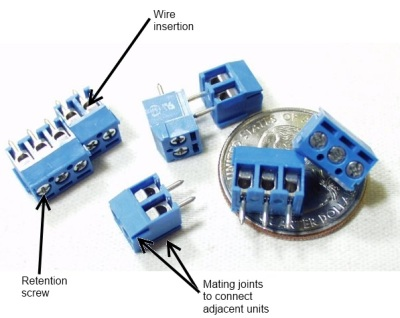

たいていのねじ端子は高い拡張性を持ち、同じピッチの小さな単位をいくつも連結することで簡単に極数を増やせる。

### スプリング端子

ねじ端子の代わりとして、**スプリング端子**（「プッシュイン」「ケージクランプ」「ポークホーム」コネクタとも呼ばれる）がある。
スプリング端子はねじ端子と似た働きをするが、ねじを締めて電線を固定する代わりに、ばねが金属片どうしを挟み込んで固定する。

スプリング端子は、振動の多い環境（自動車用途など）や、温度サイクルによって電線が伸縮するような環境でより優れた性能を発揮する。
また、ユーザーがねじを締める強さにばらつきが出るねじ端子と違い、対応する太さの範囲内であれば、電線の太さに応じて自動的に締め付ける力が調整される。

gamer:bit、LumiDrive、Qwiic MP3 Triggerなど、一部の基板にはI/Oピンへの簡単なアクセス手段としてスプリング端子が搭載されている。
ポークホーム式のコネクタには、ボールペンの先や[プラスドライバー](https://www.sparkfun.com/products/9146)でタブを押し下げて配線できるものもある。

### バナナコネクタ

たいていの電源系測定機器（テスターや電源装置）には、「バナナジャック」と呼ばれる非常に単純なコネクタが付いている。
これは、圧着式でばねを仕込んだ金属プラグである「バナナプラグ」と組み合わせて使い、単純な電源接続を作るためのものである。
複数を重ねて接続できるスタッカブルタイプも多く、どんな種類の電線にも簡単に接続できる。
数アンペア程度の電流を扱え、安価でもある。

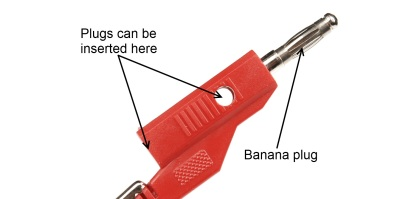

### ワニ口クリップ

その見た目からそう呼ばれるワニ口クリップは、端子や裸の電線へのテスト用接続に適している。
かさばりがちで、近くの露出した金属部分と簡単にショートしてしまうこともあり、グリップ力もそれほど強くない。
主にデバッグ中の低コストな接続手段として使われる。

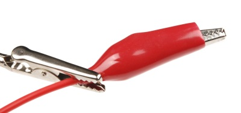

### ICクリップ（ICフック）

より繊細な計測作業のために、さまざまなICクリップが市販されている。
これらはICのピンにクリップを挟んでも隣のピンに触れないよう小さく作られており、中には表面実装部品の細かいピッチの足にも挟めるほど精巧なものもある。
[ロジックアナライザー](https://www.sparkfun.com/products/8938)や[テストリード](https://www.sparkfun.com/products/501)に使われることも多く、試作やトラブルシューティングに重宝する。

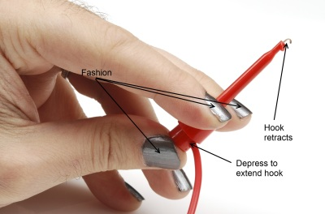

## その他のコネクタ

### RJ型モジュラーコネクタ

**レジスタードジャック**コネクタは、通信機器を電話局の交換機に接続するための標準的なコネクタである。
一般に「RJ45」「RJ12」などと呼ばれるが、これらの呼び方は必ずしも正確ではなく、RJという記号は、極数、実際に配線されている導体数、配線パターンを組み合わせたものである。
たとえば標準的なイーサネットケーブルの両端は一般に「RJ45」と呼ばれるが、本来のRJ45は8極8導体のモジュラージャックであることに加え、イーサネット用に配線されていることまでを意味する。

こうしたモジュラーコネクタは、入手しやすさ、複数の導体、ある程度の柔軟性、低コスト、そこそこの電流容量を兼ね備えており、非常に便利である。
本来大きな電力を伝送する目的では作られていないが、データと数百ミリアンペア程度の電力を機器間で送るのに使うこともできる。
ただし、こうした用途向けに配線したジャックを通常のイーサネットポートに接続しないよう注意が必要であり、接続すると故障の原因になる。

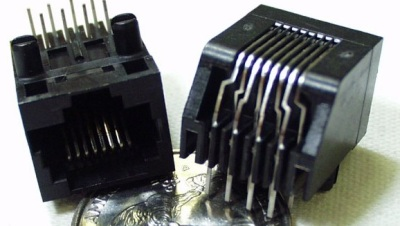

### D-sub型コネクタ

シェルの形状にちなんで名付けられたD-subminiatureコネクタは、コンピュータの世界で古くから使われてきた定番のコネクタである。
DA-15、DB-25、DE-15、DE-9という4種類が特によく使われる。
数字はそのコネクタが持つ接続数を、アルファベットの組み合わせはシェルのサイズを表す。
そのため、DE-15とDE-9は同じシェルサイズだが、接続数は異なる。

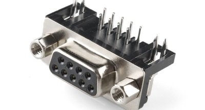

ハードウェアをいじる人にとって特に馴染み深いのはDB-25とDE-9である。
今でも多くのデスクトップパソコンには少なくとも1つのDE-9シリアルポートがあり、DB-25パラレルポートを備えていることも多い。
[DE-9](https://www.sparkfun.com/products/65)や[DB-25](https://www.sparkfun.com/products/64)のコネクタが付いたケーブルも広く出回っている。
先のモジュラーコネクタと同様、これらを2つの機器間の電源供給や通信に転用することもできるが、本来これらのケーブルの一般的な用途には電源伝送は含まれていないため、標準規格ではない機器を標準ポートに接続すると簡単に故障につながりかねず、転用は慎重に行う必要がある。

## まとめ

これで、どのコネクタがどんな用途に適しているか、次のプロジェクトでどのコネクタが役立ちそうか、おおよその見当がついたはずである。
コネクタについてさらに学べる、次のようなチュートリアルもあわせて参照してほしい。

- [電力](./electric-power.md)
- [交流と直流の違い](./alternating-current-ac-vs-direct-current-dc.md)
- [論理レベル](./logic-levels.md)
- [Arduinoとは何か](./what-is-an-arduino.md)
- [シリアル通信](./serial-communication.md)
- [SPI通信](./serial-peripheral-interface-spi.md)
- [I2C通信](./i2c.md)

タグ: 部品、入力デバイス、電力、技術

---

出典：[Connector Basics](https://learn.sparkfun.com/tutorials/connector-basics)（SparkFun Learn）を日本語に翻訳し、再構成した。
原文は [CC BY-SA 4.0](https://creativecommons.org/licenses/by-sa/4.0/) ライセンスで公開されており、本ページも同ライセンスの下で提供する。
