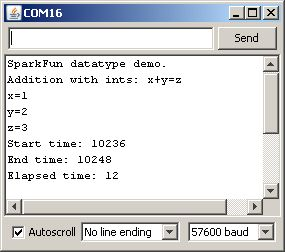
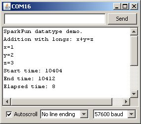
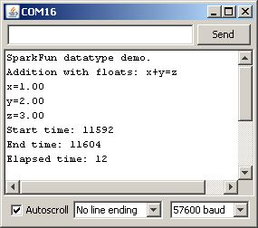
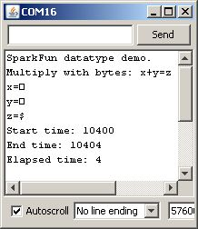
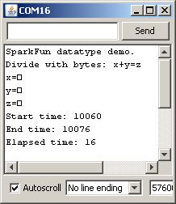
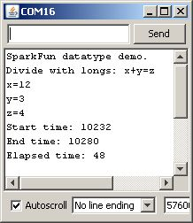
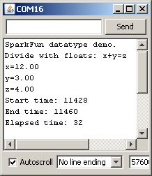

# Arduinoにおけるデータ型

## はじめに

Arduinoを含むコンピュータは、扱うデータの種類にかなり無頓着にできている。
その中心にあるのは[算術論理演算装置（ALU）](https://ja.wikipedia.org/wiki/%E6%BC%94%E7%AE%97%E8%A3%85%E7%BD%AE)であり、これはメモリ上の値に対して（比較的）単純な演算、たとえばR1+R2、R3×R7、R4&R5のような処理を行う。
ALUにとって、そのデータがユーザーにとって何を表しているか（テキストなのか、整数値なのか、浮動小数点数なのか、あるいはプログラムコードの一部なのか）はどうでもよいことである。

こうした演算に文脈を与えているのは[コンパイラ](https://ja.wikipedia.org/wiki/%E3%82%B3%E3%83%B3%E3%83%91%E3%82%A4%E3%83%A9)であり、その文脈の指示はユーザーからコンパイラへと伝えられる。
プログラマーであるあなたが、コンパイラに対して「*この*値は[整数](https://ja.wikipedia.org/wiki/%E6%95%B4%E6%95%B0%E5%9E%8B)であり、*あの*値は[浮動小数点数](https://ja.wikipedia.org/wiki/%E6%B5%AE%E5%8B%95%E5%B0%8F%E6%95%B0%E7%82%B9%E6%95%B0)である」と伝えるのである。
そしてコンパイラは、「この整数とあの浮動小数点数を足す」という指示が何を意味するのかを解釈しなければならなくなる。
これは簡単な場合もあれば、そうでない場合もある。
そして、簡単な*はず*だと*思える*場合でも、予想外の結果になることがある。

このチュートリアルでは、Arduinoで使える基本的なデータ型と、それぞれの典型的な用途を扱い、データ型の違いがプログラムのサイズと実行速度に与える影響を明らかにしていく。

参考になるチュートリアル:

始める前に、次の概念に馴染んでおくとよいだろう。

- [Arduinoとは何か](./what-is-an-arduino.md)
- Arduinoのインストール
- [2進数](./binary.md)
- [シリアル通信](./serial-communication.md)

## データ型を定義する

Arduinoの開発環境は、実のところライブラリのサポートと対象環境に関する組み込みの前提を備えた[C++](https://ja.wikipedia.org/wiki/C%2B%2B)にすぎない。
C++にはさまざまなデータ型が定義されているが、ここではArduinoで使われるものだけを扱い、油断しているArduinoプログラマーを待ち受ける落とし穴に重点を置いて説明する。

以下は、Arduinoでよく見かけるデータ型の一覧であり、型名の後ろの括弧内にそれぞれのメモリサイズを示している。
なお、**符号付き**（signed）変数は正負両方の値を扱えるのに対し、**符号なし**（unsigned）変数は正の値しか扱えない。

- **boolean**（8ビット）：単純な論理値、真か偽か
- **byte**（8ビット）：0〜255の符号なし数値
- **char**（8ビット）：-128〜127の符号付き数値。状況によっては、コンパイラがこのデータ型を文字として解釈しようとするため、予期しない結果になることがある
- **unsigned char**（8ビット）：byteと同じ。この用途で使いたい場合は、わかりやすさのためbyteを使うべきである
- **word**（16ビット）：0〜65535の符号なし数値
- **unsigned int**（16ビット）：wordと同じ。わかりやすさと簡潔さのためwordを使うべきである
- **int**（16ビット）：-32768〜32767の符号付き数値。IDEに付属するArduinoのサンプルコードで、汎用の変数としてもっともよく使われている型である
- **unsigned long**（32ビット）：0〜4,294,967,295の符号なし数値。もっともよく使われる用途は、`millis()`関数の戻り値（現在のコードが実行されてからのミリ秒数）を保存することである
- **long**（32ビット）：-2,147,483,648〜2,147,483,647の符号付き数値
- **float**（32ビット）：-3.4028235E38〜3.4028235E38の符号付き数値。Arduinoには浮動小数点数のネイティブサポートがなく、コンパイラがあれこれ工夫してようやく動作させている。避けられるなら避けるべきであり、この点については後で触れる。

このチュートリアルでは、配列、ポインタ、文字列は**扱わない**。これらはより特殊なデータ型であり、より込み入った概念を伴うため、別の機会に扱う。

## 時間と容量

Arduinoボードの中枢を担うプロセッサ、[Atmel ATmega328P](http://www.atmel.com/dyn/products/product_card.asp?part_id=4198)は、ネイティブな8ビットプロセッサであり、浮動小数点数の組み込みサポートを持たない。
8ビットより大きいデータ型を扱うには、コンパイラは大きなデータの塊を少しずつ処理し、その結果を適切な場所に格納するようなコードの並びを生成する必要がある。

つまり、8ビットの値を処理するときにもっとも効率がよく、浮動小数点数を処理するときにもっとも効率が悪いということである。
この事実を確かめるため、[簡単なArduinoスケッチ](https://cdn.sparkfun.com/tutorialimages/datatypes/DataTypes.pde)を用意した。ごく単純な計算を行うだけのコードで、データ型を変えるだけで同じ計算を異なる型で試せるようになっている。

```cpp
unsigned long start_time = 0;
unsigned long end_time = 0;

#define test_type byte
test_type x = 1;
test_type y = 2;
test_type z = 3;

void setup()
{
  Serial.begin(57600);
  Serial.println("SparkFun datatype demo.");
  Serial.println("Addition with bytes: x+y=z");
  Serial.print("x=");
  Serial.println(x);
  Serial.print("y=");
  Serial.println(y);
}

void loop()
{
  start_time = micros();
  z=x+y;
  end_time = micros();
  Serial.print("z=");
  Serial.println(z);
  Serial.print("Start time: ");
  Serial.println(start_time);
  Serial.print("End time: ");
  Serial.println(end_time);
  Serial.print("Elapsed time: ");
  Serial.println(end_time - start_time);
  while(1);
}
```

まずはこのコードをそのままArduino Unoに書き込み、シリアルコンソールにどんな結果が出るか見てみよう。


いろいろな情報が表示されている。1つずつ見ていこう。

まず、実際に試している場合は、コードのコンパイル後のサイズを確認してほしい。
**byte**での加算では、コードサイズは2458バイトになった。それほど大きくはなく、実のところ、そのほとんどはシリアル出力関連のコードが占めている。
とはいえ、この数字は後で重要になってくる。

次に、シリアルポートの出力を見てみよう。
表示された変数の値が数字ではなく四角い記号になっているのはなぜだろうか。
これは、`Serial.print()`関数が渡されたデータの型によって動作を変えるために起こる。
8ビットの値（`char`でも`byte`でも）の場合、その値をそのまま[2進数](./binary.md)としてパイプ出力する。
するとシリアルコンソール側は、そのデータを[ASCII](https://ja.wikipedia.org/wiki/ASCII)文字として解釈しようとし、1、2、3に対応するASCII文字はそれぞれ「START OF HEADING」「START OF TEXT」「END OF TEXT」になる。
これでは特に役に立たないし、1文字で表示するのも難しい。だから四角い記号になるのである。シリアルコンソールは「これをどう表示すればいいかわからないので、代わりに四角を出しておきます」と言っているようなものである。
というわけで、Arduinoのデータ型に関する教訓その1：`Serial.print()`から8ビットの値を10進数表記で得るには、次のように`DEC`指定をつけて呼び出す必要がある。

```cpp
Serial.print(x, DEC);
```

最後に、「Elapsed time」（経過時間）の測定値に注目してほしい。
`micros()`関数を使って経過時間を測定していることによる誤差は、これから行うすべてのテストで共通して生じるものなので、絶対的な測定値としては不正確でも、相対的な測定値としてはかなり良い比較ができるはずである。それを踏まえたうえで、8ビットの値2つを加算するには、プロセッサの時間がおよそ4マイクロ秒かかっていることがわかる。

## データ型のテスト（加算）

ここからは、他のデータ型もいくつか試してみよう。
実際に手元で試している場合は、コードを次のように変更する。

```cpp
#define test_type int
```

Arduinoボードにコードを書き込み、コンパイルサイズを確認しよう。`int`では2488バイト、`byte`では2458バイトだった。
差はそれほど大きくないが、確かに大きくなっている。
これも、8ビットを超える記憶容量を必要とするデータ型（`int`、`long`、`float`など）を使うと、加算を実現するためにコンパイラがより多くの機械語コードを生成する必要があるためである。プロセッサ自体には、そもそもより大きなデータをネイティブにサポートする能力がない。
シリアルコンソールを開くと、次のような結果が表示されるはずである。



次に気づくのは、今回は値が正しく表示されている点である。
これは、新しく導入したデータ型`int`がコンパイラによって正しく数値型として解釈され、`Serial.print()`もそれに応じて出力データを正しくフォーマットしているためである。
というわけで、Arduinoのデータ型に関する教訓その2：もし数値型のデータをそのままバイナリとして送りたい場合（コンソールで人間が見るためではなく、別のコンピュータ機器とデータをやり取りする手段として）は、`Serial.write()`関数を使うとよい。

続いて、「Elapsed time」を再び確認してみよう。
今度は12マイクロ秒になっている。およそ3倍の時間である。
これはまだかなり短いが、先ほど触れたとおり、このプロセッサが8ビットプロセッサであるために、`int`変数どうしの加算に必要な16ビットの演算を行うにはひと工夫必要になるからである。

次に進もう。今度は`long`型を試してみる。
先ほどと同様にコードを変更し、`int`だった箇所を2か所とも`long`に置き換える。
コードを書き込み、シリアルコンソールを開いて何が起こるか見てみよう。



シリアル出力の内容に入る前に、コンパイルサイズを振り返っておこう。
今回は2516バイトで、`int`より28バイト、`byte`より58バイト大きい。
まだかなり小さな差ではあるが、確かに差はあり、`int`や`byte`の代わりに`long`で大量の計算を行えば、この差は積み重なっていくだろう。

さて、シリアル出力の結果に話を戻そう。
またしても経過時間が変化している。しかし今回は、12マイクロ秒から8マイクロ秒へと*短く*なっている。
これはどういうことだろうか。これがArduinoのデータ型に関する教訓その3である。自分が「起きているはず」と思っていることが、実際に起きていることとは限らない。
なぜこうなるのかは筆者にもはっきりとはわからない。コンパイラの最適化によるものかもしれないし、`int`のコードにはない、小さな値の加算を高速化する実行時の最適化が働いているのかもしれない。
いずれにせよ、「`long`は`int`より速い」という結論をここから安易に導くのは早計である。乗算や除算を見ていくとわかるように、必ずしもそうとは限らないからである。

最後に、浮動小数点数の演算を見てみよう。
Arduinoにおける浮動小数点演算は厄介である。というのも、Arduinoには浮動小数点演算ユニット（小数点以下の桁数が任意の数値を扱う専用のプロセッサ部分を指す専門用語）が搭載されていないからである。
浮動小数点演算はまた、扱いにくい概念でもある。人間は小数点以下に任意の桁の0が続く数を難なく扱えるが、コンピュータはそうはいかない。
これが、初期のPentiumプロセッサの一部を悩ませた悪名高い「[1が1でないバグ](https://ja.wikipedia.org/wiki/Pentium_FDIV_%E3%83%90%E3%82%B0)」の原因である。

先ほどと同様にコードを変更し、今度は該当する2か所を`long`から`float`に置き換える。
コードを書き込み、コンパイルサイズを確認してみよう。3864バイトである。
浮動小数点数のデータ型を含めたことで、コンパイラは浮動小数点演算を処理するコードを含めざるを得なくなった。
これはかなり大きなコードのかたまりであり、サイズをかなり増加させていることがわかる。
データ型に関する教訓その4：本当にどうしても必要な場合を除いて、浮動小数点演算は使うべきではない。
たいていの場合、浮動小数点数が必要になるのは、任意の整数値のままではあまり意味をなさない情報をユーザーに提示するときに限られる。たとえば、ADCが返す536という値は意味がわかりにくいが、これを浮動小数点数に変換して2.62Vとすれば、はるかに役立つ情報になる。



このコードの実行時間を見ると、12マイクロ秒に戻っている。
また、表示される値には小数点以下2桁の0が含まれるようになった点にも注目してほしい。
小数点以下の桁数を増やしたい（あるいは減らしたい）場合は、print命令に桁数を指定できる。

```cpp
Serial.print(x, 3); // 変数xの浮動小数点数を小数点以下3桁まで表示する
```

## データ型のテスト（乗算・除算）

ここからは、もう少し「重い」計算、つまり乗算と除算で何が起こるかを見ていこう。

まずは乗算のスクリーンショットである。




経過時間を確認してみよう。`byte`で4µs、`int`または`long`で8µs、`float`で12µsである。
データ型が大きくなるほど時間がかかっており、「重い」計算ほど時間がかかるという予想どおりの結果になっている。
とはいえ、乗算はまだハードウェアでサポートされている。プロセッサにはネイティブの乗算命令があり、乗算そのものは比較的容易に行える。
では、除算はどうだろうか。






なんということだろう。`byte`の除算は16µsとそれほど悪くないが、`long`では48µsにもなる。
この原因は、Atmegaの命令セットには除算のネイティブ命令が存在しないため、コンパイラが四苦八苦して除算を組み立てる必要があるからである。
というわけで、最後の教訓である。すべての数学演算が同じように作られているわけではない。
除算は乗算や加算（減算も、実質的にはマイナス符号をつけた加算にすぎない）よりもはるかに時間がかかり、平方根や正弦のような計算はさらに時間がかかる。
実際、非常に時間がかかるため、平方根や正弦・余弦・正接の値をその場で計算するよりも、あらかじめ値の一覧を用意しておいて必要な値を参照するほうが簡単なことも多い。

## まとめ

ひとまずここまでにしておく。
変数に適したデータ型を使うことの利点を、はっきりと示せていたらうれしい。
次のチュートリアルでは、データ型を混在させたり、不適切なデータ型（扱う可能性のある最大の数値に対して小さすぎるデータ型など）を使ったりすることで潜んでいる、本当に厄介な落とし穴のいくつかを扱う予定である。

データ型についての新しい知識を踏まえて、さらに学びたい場合は次のチュートリアルも参考にしてほしい。

- [デジタルロジック](./digital-logic.md)
- [回路図の読み方](./how-to-read-a-schematic.md)
- [ロジックレベル](./logic-levels.md)
- [2進数](./binary.md)

タグ: Arduino、コンピュータ工学、概念、プログラミング

---

出典：[Data Types in Arduino](https://learn.sparkfun.com/tutorials/data-types-in-arduino)（SparkFun Learn）を日本語に翻訳し、再構成した。
原文は [CC BY-SA 4.0](https://creativecommons.org/licenses/by-sa/4.0/) ライセンスで公開されており、本ページも同ライセンスの下で提供する。
