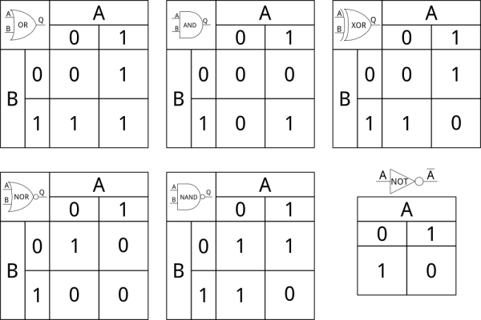
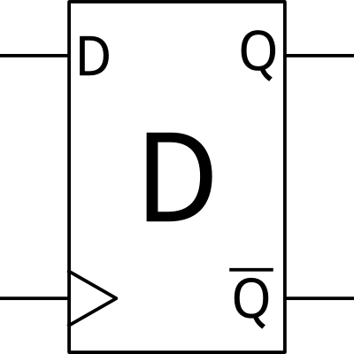
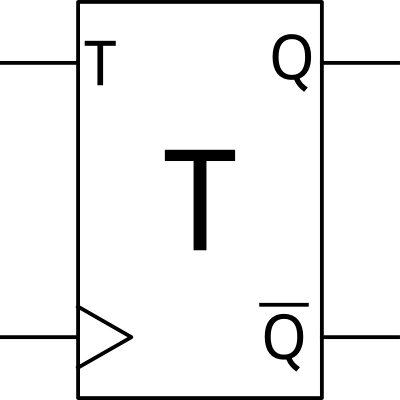

# デジタルロジック

デジタルロジック、あるいはブール論理は、現代のあらゆるコンピュータシステムを支える基本的な概念である。
簡単に言えば、比較的単純な「はい/いいえ」の質問を組み合わせて、非常に複雑な判断を下せるようにするルールの体系である。

このチュートリアルでは、次のようなことを学ぶ。

### デジタル回路

デジタルロジック回路は、**組み合わせ回路**と**順序回路**という2つのカテゴリーに分けられる。
組み合わせ回路は「即座に」変化する。入力が変化した瞬間、回路の出力もそれに応じて変化する（もちろん、信号が回路素子の中を伝わるのに多少の時間がかかるため、実際にはわずかな遅延がある）。
一方、順序回路にはクロック信号があり、変化はクロックのエッジ（立ち上がりや立ち下がり）に合わせて回路の各段階を伝わっていく。

一般に、順序回路は、クロック信号によって動作するメモリ素子で区切られた、組み合わせ論理のブロックの集まりとして構成される。

### プログラミング

デジタルロジックはプログラミングにおいても重要である。
デジタルロジックを理解することで、プログラムの中で複雑な意思決定が可能になる。

プログラミングには理解しておくべき細かな注意点もいくつかあるが、それについては基本を押さえたあとで扱う。

参考になるチュートリアル:

まだ読んでいなければ、[2進数のチュートリアル](./binary.md)に目を通しておくとよい。
その中にもブール論理について少し触れている部分があるが、ここではその話題をさらに深く掘り下げていく。
このほかにも、始める前に理解しておくとよい話題がいくつかある。

- [電気とは何か](./what-is-electricity.md)
- [2進数](./binary.md)
- [アナログとデジタルの違い](./analog-vs-digital.md)
- [ロジックレベル](./logic-levels.md)

## 組み合わせ論理


組み合わせ回路は、5種類の基本的な論理ゲートから構成される。

- ANDゲート：両方の入力が1のときに出力が1になる
- ORゲート：少なくとも一方の入力が1のときに出力が1になる
- XORゲート：どちらか一方だけの入力が1のときに出力が1になる
- NANDゲート：少なくとも一方の入力が0のときに出力が1になる
- NORゲート：両方の入力が0のときに出力が1になる

デジタルロジックにはもうひとつ、6番目の要素としてインバータ（NOTゲートと呼ばれることもある）がある。
インバータは何の判断も下さないため、厳密にはゲートとは言えない。
インバータの出力は、入力が0であれば1に、入力が1であれば0になる。

先ほどの図について、いくつか補足しておく。

- ゲートの名前自体は印字されないことが多い。記号だけで識別できると考えられているためである。
- A、B、Qのような端子表記は標準的なものだが、システム全体の入出力に関わらない信号については、論理回路図ではたいてい省略される。
- 入力が2つの素子が標準的だが、まれに3つ以上の入力を持つ素子も見かける。ただし出力は常に1つだけである。

デジタルロジック回路は、たいていこの6つの記号を使って表され、入力は左側、出力は右側に配置される。
入力どうしを結線することはできるが、出力どうしを結線してはならない。出力は必ず他の入力に接続する。
ただし、1つの出力を複数の入力に接続することは可能である。

### 真理値表

先ほどの説明だけでも個々のブロックの機能を表すには十分だが、もっと便利な道具がある。真理値表である。
真理値表とは、ある回路に入力しうる値の組み合わせに対して、その出力がどうなるかを説明する単純な表である。
先ほどの6つの主要な素子について、真理値表を示す。



真理値表は、頭が痛くなるほど多くの入力や出力があっても、いくらでも拡張できる。
4入力の回路とその真理値表は、次のようになる。


### ブール論理の記法

論理演算を表す式を、簡潔な数学的表記で書けると便利である。
そのために、AND、OR、XOR、NOTという固有の演算にはそれぞれ数学的な記号が用意されている。

- AとBのANDは、ABと書く（A・Bと書かれることもある）
- AとBのORは、A + Bと書く
- AとBのXORは、A ⊕ Bと書く
- Aの否定（NOT）は、A′あるいはAの上に横線を引いて表す

このリストには2つ、NANDとNORが抜けていることに気づいただろうか。
これらはたいてい、対応する表記全体を否定することで表す。

- AとBのNANDは、(AB)′、あるいは(A・B)′と書く
- AとBのNORは、(A + B)′と書く

## 順序論理

組み合わせ論理は便利だが、順序回路を組み合わせなければ、現代のコンピューティングは成り立たない。

順序回路は、論理システムに「記憶」を持たせるものである。
先ほど触れたように、組み合わせ論理は遅延を伴って結果を出す。
その遅延の大きさは、部品の製造プロセス、シリコンの温度、回路の複雑さなど、非常に多くの要因によって変わってくる。
もしある回路の出力が、別の2つの組み合わせ回路の結果に依存していて、その結果が異なるタイミングで届いた場合（実際の世界ではよく起こることである）、その組み合わせ回路は一瞬「グリッチ」を起こし、意図した動作とは異なる結果を一時的に出力してしまうことがある。

一方、順序回路は特定のタイミングでのみ出力をサンプリングし、伝搬させる。
そのタイミングの間に入力が変化しても、それは無視される。
このサンプリングのタイミングは、たいてい回路全体で同期されており、「クロック」と呼ばれる。
コンピュータの「速度」として語られる数値は、まさにこのクロックの値である。
グローバルな同期クロックに頼らない「非同期」の順序回路を設計することも可能ではあるが、そうしたシステムには大きな難しさが伴うため、ここでは扱わない。

余談だが、デジタルロジックのどの部分にも、最小遅延時間と最大遅延時間という2つの特性値がある。
回路が最小遅延時間を満たせない場合（つまり本来より速く動作してしまう場合）、その回路は修復不可能な形で故障する。
その回路がコンピュータのCPUのようなより大きな装置の一部であれば、装置全体が使い物にならなくなる。
最大遅延時間を満たせない場合（つまり本来より遅く動作する場合）は、システム内でもっとも遅い回路に合わせてクロック速度を落とすことで対応できる。
最大遅延時間は、回路を構成するシリコンの温度が上がるにつれて増加する傾向があり、これがコンピュータが過熱したときや、オーバークロックのようにクロック速度を上げすぎたときに不安定になる理由である。

### 順序回路の素子

組み合わせ論理と同じく、順序回路にもその構成要素となるいくつかの基本的な回路素子がある。
これらのブロックは、出力からのフィードバックを使って入力を安定させることで、基本的な組み合わせ素子から構成されている。
これには「ラッチ」と「フリップフロップ」という2つの「種類」がある。
これらの用語はしばしば同じ意味で使われるが、ラッチはクロックによる制御がないため一般的にはあまり実用性が高くなく、ここではフリップフロップに焦点を当てる。

#### D型フリップフロップ



もっとも単純なタイプのフリップフロップがD型である。
D型フリップフロップの動作は単純で、クロックのエッジ（通常は立ち上がりだが、内蔵のインバータによって立ち下がりでクロックされるものもある）が来ると、入力の値が出力にラッチされる。

たいてい、クロック入力は記号に食い込む小さな三角形で示される。
たいていのフリップフロップは、「通常」の出力と、その反転出力という2つの出力を持つ。

#### T型フリップフロップ



D型よりもわずかに複雑なのがT型である。
「T」は「トグル（toggle）」の頭文字である。
クロックのエッジが来たとき、入力Tが1であれば出力の状態が反転する。
入力が0であれば、出力はそのまま変わらない。
D型と同じく、出力の反転出力もたいてい用意されている。

T型フリップフロップの便利な使い道のひとつが、クロック分周回路である。
Tを常に1にしておくと、出力はクロック周波数を2で割ったものになる。
T型フリップフロップを連ねることで、装置のマスタークロックからより遅いクロックを作り出すことができる。

#### JK型フリップフロップ


最後に紹介するのがJK型である。
JK型は、3つのうち唯一、真理値表がないと説明が難しいタイプである。
J、Kという2つの入力を持ち、その組み合わせに応じて、出力をそのまま維持したり、セットしたり、クリアしたり、反転させたりできる。
もちろん、どのフリップフロップでも同じだが、重要なのはクロックが来た瞬間の入力の値だけである。

### セットアップ時間、ホールド時間、伝搬遅延

すべての順序回路には、**セットアップ時間**と**ホールド時間**、そして**伝搬遅延**と呼ばれる値がある。
この3つを理解することは、期待どおりに動作する順序回路を設計するうえで欠かせない。

セットアップ時間とは、クロックの立ち上がりエッジが発生する前に、フリップフロップが正しくデータをラッチするために信号が入力に到達していなければならない最小の時間のことである。
同様に、ホールド時間とは、クロックの立ち上がりエッジが発生したあと、信号が変化するまでに安定した状態を保っていなければならない最小の時間のことである。

セットアップ時間とホールド時間は最小値として示されるのに対し、伝搬遅延は最大値として示される。
簡単に言えば、伝搬遅延とは、クロックの立ち下がりエッジのあと、出力に信号が現れるまでにかかりうる最大の時間のことである。
次の図はこれらの関係を示したものである。


上の図では、信号の遷移がわずかに斜めに描かれていることに注目してほしい。
これには2つの意味がある。ひとつは、クロックやデータのエッジは実際には決して直角にはならず、常にいくらかの立ち上がり時間や立ち下がり時間を持つことを思い出させるためであり、もうひとつは、各時間を示す垂直線が信号のどこと交わっているかを見やすくするためである。

この3つの値の組み合わせによって、その装置が使用できる最高のクロック速度が決まる。
ある部品の伝搬遅延と、回路内の次の部品のセットアップ時間の合計が、あるクロックパルスの立ち下がりエッジから次のクロックパルスの立ち上がりエッジまでの時間を超えてしまうと、2番目の部品の入力でデータが安定せず、予期しない動作を引き起こすことになる。

### メタステーブル状態

セットアップ時間とホールド時間を守らないと、「メタステーブル状態」と呼ばれる問題が発生することがある。
回路がメタステーブル状態にあるとき、フリップフロップの出力は2つの正常な状態の間を、回路のクロック速度よりもはるかに速い速度で激しく振動することがある。


メタステーブル状態の問題は、動作の誤りから、消費電流の増加によるチップの損傷にまで及ぶことがある。
メタステーブル状態はたいてい自然に解消するが、解消するころにはシステムが完全に未知の状態になっていることがあり、正常な動作を取り戻すには完全なリセットが必要になる場合もある。

メタステーブル状態がよく発生するのは、信号がクロックドメインをまたぐとき、つまり異なるクロック源で動作している装置間で信号がやり取りされるときである。
クロックが同期していないため（たとえ公称の周波数が同じであっても、現実にはわずかな違いがある）、いずれクロックのエッジとデータのエッジが危険なほど近づいてしまい、セットアップ時間違反を引き起こすことになる。
この問題に対する簡単な対策は、システムへのすべての入力を、2段に連ねたD型フリップフロップに通すことである。
たとえ最初のフリップフロップがメタステーブル状態に陥っても、次のクロックパルスが来るまでには（望むらくは）安定した状態に落ち着いているはずであり、2番目のフリップフロップは正しいデータを読み取れる。
これにより、入力されるデータのエッジに1クロック分の遅延が生じるが、メタステーブル状態のリスクに比べれば、ほとんどの場合は無視できるほど小さな代償である。

## プログラミングにおけるブール論理

ここまでの内容は、プログラミングの世界にもそのまま応用できる。
たいていのプログラムは単なる決定木であり、「これが真であれば、これを行う」という形をしている。
これを説明するために、ここではArduinoの文脈でC言語のコードを使う。

### ビット単位の論理演算

「ビット単位」の論理と言うとき、実際に意味しているのは、値を返す論理演算のことである。
たとえば、次のようなコードを考えてみよう。

```cpp
byte a = 0b01010101;
byte b = 0b10101010;
byte c;
```

`a`と`b`に対してビット単位の演算を行い、その結果を`c`に入れることができる。
次のようになる。

```cpp
c = a & b;  // aとbのビット単位AND。結果は0b00000000
c = a | b;  // aとbのビット単位OR。結果は0b11111111
c = a ^ b;  // aとbのビット単位XOR。結果は0b11111111
c = ~a;     // aのビット単位補数。結果は0b10101010
```

言い換えると、結果の各ビットは、対応する2つのオペランドの各ビットに演算を適用した結果に等しい。

なるほど、それは分かった。しかしそれが何の役に立つのだろうか。
実は、ビット単位の演算子を使ってレジスタを操作することで、いろいろと便利なことができる。
特定の1ビットだけを選んでクリアしたり、セットしたり、反転させたりできるほか、あるビット（あるいは複数のビット）がセットされているかクリアされているかを調べることもできる。
これらの演算の例をいくつか見てみよう。

```cpp
c = 0b00001111 & a; // aの上位ニブルをクリアし、下位ニブルはそのまま残す
                     // 結果は0b00000101
c = 0b11110000 | a; // aの上位ニブルをセットし、下位ニブルはそのまま残す
                     // 結果は0b11110101
c = 0b11110000 ^ a; // aの上位ニブルのすべてのビットを反転させる
                     // 結果は0b10100101
```

ビット単位の演算はすべて、等号と組み合わせることで自己代入の形にできる。

```cpp
a ^= 0b11110000; // aを0b11110000とXORし、結果をaに書き戻す
b |= 0b00111100; // bを0b00111100とORし、結果をbに書き戻す
```

### ビットシフト

データに対して行えるもうひとつの便利なビット単位の演算がビットシフトである。
これは単に、データを左または右へ指定した桁数だけずらす操作であり、シフトによってはみ出したデータは消え、反対側からは0が入ってくる。

```cpp
byte d = 0b11010110;
byte e = d >> 2;  // dを右に2ビットシフト。e = 0b00110101
e = e << 3;       // eを左に3ビットシフト。e = 0b10101000
```

ビットシフトの使い道については後ほど紹介するが、非常に便利な応用のひとつが掛け算と割り算である。
右に1ビットシフトするごとに2で割ったことになり（ただし余りの情報は失われる）、左に1ビットシフトするごとに2倍したことになる。
これが便利なのは、Arduinoのような小さなプロセッサでは掛け算や割り算はたいてい時間のかかる処理だが、ビットシフトはたいてい非常に高速に実行できるためである。

### 比較演算子と関係演算子

2つの値を比較する方法も必要になる。
それを行うのが、比較の結果に応じて「真」または「偽」を返す一群の演算子である。

- `==` 「等しい」（値が等しければ真、そうでなければ偽）
- `!=` 「等しくない」（値が異なれば真）
- `>` 「より大きい」（左のオペランドが右のオペランドより大きければ真）
- `<` 「より小さい」（左のオペランドが右のオペランドより小さければ真）
- `>=` 「以上」（左のオペランドが右のオペランド以上であれば真）
- `<=` 「以下」（左のオペランドが右のオペランド以下であれば真）

比較する値どうしが同じデータ型であることは、一般に非常に重要である。
たとえば「byte」型と「int」型を比較すると、予期しない挙動が起きることがある。

### 論理演算子

論理演算子は、同じ型の新しい値を作るのではなく、「真」か「偽」を生み出す演算子である。
これは私たちが普段考えるような接続詞に近い。「雨が降っていなくて、風があれば、凧あげに行こう」というような文である。
これをC言語に翻訳すると、次のようになる。

```cpp
if ( (raining != true) && (windy == true) ) flyKite();
```

2つの副節を囲むかっこに注目してほしい。
厳密には必要ないが、副節をまとめてグループ化しておくことは、コードをできるだけ読みやすく保つためのよい習慣である。

また、論理AND演算子（&&）は、それぞれの副節が真か偽かに基づいて、真偽の答えを生み出すことにも注目してほしい。
副節のひとつに数値を使った条件を入れることも同じように簡単にできる。

```cpp
if ( (raining != true) && ( (windSpeed >= 5) || (reallyBusy != true) ) ) flyKite();
```

この条件は、雨が降っていなければ、そして風が十分にある場合、あるいはそれほど忙しくない場合に、凧あげに行くというものである（風がなくても、暇であれば一応挑戦はしてみる）。

ここでもかっこに注目してほしい。
もし「(windSpeed >= 5) || (reallyBusy != true)」のかっこを取り除いてしまうと（`||`はOR演算子を表す）、意図したとおりに動くかどうかがあいまいな文になってしまう。

### フロー制御

複雑な論理式を組み立てられるようになったところで、その答えを使って何ができるかを見ていこう。

#### if/else if/else文

もっとも単純な判断が「if/else」である。
if/else if/elseを使うと、一連のテストを設定でき、そのうちどれか1つだけが実行される。

```cpp
if ( reallyBusy == true ) workHarder();
else if ( (raining != true) && (windy == true) ) flyKite();
else work();
```

この3つの文により、本当に忙しいときは決して凧あげをせず、忙しくなくても凧あげ日和でなければ、ただ仕事を続けることになる。
ここで、2つ目の`else if()`を`if()`に変えてみよう。

```cpp
if ( reallyBusy == true ) workHarder();
if ( (raining != true) && (windy == true) ) flyKite();
else work();
```

こうすると、たとえ本当に忙しくても、凧あげ日和であれば、ほんの一瞬だけ「もっと頑張って働く」状態になり、天気がよいことに気づいた瞬間に凧あげに切り替わってしまう。
さらに、凧あげ日和でなければ、「もっと頑張って働く」状態から、最初のif文が実行された直後にただの「働く」状態へと即座に格下げされてしまう。

「workHarder()」を「turnLEDOn()」に、「work()」を「turnLEDOff()」に置き換えたらどうなるか、想像してみてほしい。
最初の例では、LEDはしばらく点灯したまま、あるいは消灯したままになる。
しかし2つ目の例では、「reallyBusy」の状態にかかわらず、最初のif文でLEDが点灯した直後にほぼ即座に消灯してしまい、「reallyBusy」を示すはずのランプが一向に点かないと首をかしげることになるだろう。

#### switch/case/default文

if/elseの長い連鎖よりも強力さでは劣るが読みやすいのが、switch/case/default文である。
これは、ある変数の値に基づいて判断を行うものである。

```cpp
switch (menuSelection) {
  case '1':
    doMenuOne();
    break;
  case '2':
    doMenuTwo();
    break;
  case '3':
    doMenuThree();
    break;
  default:
    flyKite();
    break;
}
```

switch()文は、値が等しいかどうかの判定しかできないが、それはよくある用途であるため十分に役立つ。
ここで注目してほしいのは、「break;」文と「default:」のケースという2つの重要な要素である。

「default:」は、他のどのケースにも一致しなかった場合に実行される。
これは厳密には必須ではなく、default節がなければ、すべてのケースが一致しなかった場合に何も起こらない。
とはいえ、たいていは何かを実行させたいはずであり、すべてのケースが一致しない可能性はないと決めつけないほうがよい。

「break;」は現在の条件分岐から抜け出す。
これはどの種類の条件分岐の中でも使えるが、この場合、各caseの末尾にbreakを入れ忘れると、後続のcaseに一致しなくても、その後のコードが実行され続けてしまう。

#### while/do...whileループ

ここまでは、一度だけ判断を行うコードを見てきた。
では、ある条件が成り立つ限り、動作を何度も繰り返したい場合はどうすればよいだろうか。
そこで登場するのがwhile()とdo...while()である。

```cpp
while (windy == true) flyKite();
```

コードがwhile()文に到達すると、プログラムはまず条件（「風はあるか」）を評価し、それが「真」であればコードを実行する。
コードの実行が終わると、条件が再び評価される。
条件がまだ「真」であれば、コードは再び実行される。
これは、条件が「偽」になるか、break文に出会うまで繰り返される。

while()ループの中には、if()文（あるいはswitch()や別のwhile()、その他何でも）を入れ子にすることができる。

```cpp
while (windy == true) {
  flyKite();
  if (bossIsMad == true) break;
}
```

このループでは、風がやむか、上司の機嫌が悪くなるまで凧あげを続けることになる。

while()ループの変種として、do...while()ループがある。

```cpp
do {
  flyKite();
} while (windy == true);
```

この場合、かっこの中のコードは、たとえ条件が偽であっても**1回は必ず実行される**。
つまり、風の状態にかかわらず、とりあえず外に出て凧を引っ張ってはみるが、風がなければすぐにあきらめる、ということになる。

最後に、条件式に「true」を直接指定することで、永遠に実行され続けるコードを作ることもできる。

```cpp
while (true) {
  flyKite();
}
```

このコードでは、風の有無、上司の満足度、空腹、猛獣の存在などに関係なく、ひたすら凧を引きずり続けることになる。
もちろん、break文を使えばこのコードから抜け出すことは可能だが、自分から実行を止めることは決してない。

#### for()ループ

最後に紹介する繰り返しの種類がfor()ループである。
for()ループを使うと、特定の回数だけコードのかたまりを実行できる。
for文の構文は次のようになる。

```cpp
for (byte i = 0; i < 10; i++) {
  Serial.print("Hello, world!");
}
```

for()ループのかっこの中には、セミコロンで区切られた3つの文がある。
1つ目はイテレータ（繰り返しのたびに変化させる変数）であり、その初期値もここで設定する。
2つ目は、1回実行するたびに行う比較であり、この比較が偽になった時点でループを抜ける。
最後の文は、ループを1回実行するたびに行いたい処理であり、この場合はイテレータを1ずつ増やしている。

for()ループでもっともよくある間違いは、いわゆる「off-by-one（1つずれ）」エラーである。
コードを10回実行させたいつもりが、実際には9回や11回実行されてしまうというもので、たいていは「<=」と「<」を取り違えたことが原因である。

## まとめ

デジタルロジックを理解することは、電子工学において欠かせないスキルである。
さらに詳しく知りたい場合は、次のような情報源も参考になる。

- [ブール代数](https://ja.wikipedia.org/wiki/ブール代数)：この分野の土台となっている、ブール代数についてのWikipediaの記事
- [クワイン・マクラスキー法](https://ja.wikipedia.org/wiki/クワイン・マクラスキー法)：与えられた入力数と望む出力の対応表に対して、デジタル回路を必要最小限のゲートの集合に単純化するための手法
- [LogicBlocks and an Introduction to Digital Logic（LogicBlocksとデジタルロジック入門）](./logicblocks--digital-logic-introduction.md)

タグ: コンピュータ工学、概念、電気工学、プログラミング

---

出典：[Digital Logic](https://learn.sparkfun.com/tutorials/digital-logic)（SparkFun Learn）を日本語に翻訳し、再構成した。
原文は [CC BY-SA 4.0](https://creativecommons.org/licenses/by-sa/4.0/) ライセンスで公開されており、本ページも同ライセンスの下で提供する。
