# ダイオード

[抵抗器](./resistors.md)や[コンデンサ](./capacitors.md)、インダクタといった単純な受動部品を卒業したら、次は半導体という素晴らしい世界に踏み出す番である。
半導体部品の中でもっとも広く使われているものの1つが**ダイオード**である。

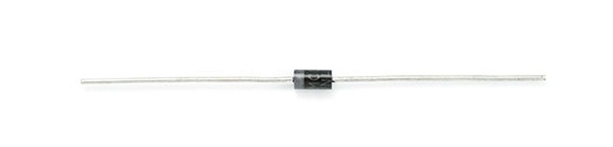

このチュートリアルで扱う内容:

- ダイオードとは何か
- ダイオードが動作する仕組み
- ダイオードの重要な特性
- ダイオードのさまざまな種類
- ダイオードの見た目
- ダイオードの代表的な応用例

参考になるチュートリアル:

- [回路とは何か](./what-is-a-circuit.md)
- [電圧、電流、抵抗とオームの法則](./voltage-current-resistance-and-ohms-law.md)
- [電気とは何か](./what-is-electricity.md)
- [直列回路と並列回路](./series-and-parallel-circuits.md)
- [テスターの使い方](./how-to-use-a-multimeter.md)

## 理想的なダイオード

**理想的な**ダイオードの重要な働きは、電流が流れる*向き*を制御することである。
ダイオードを流れる電流は一方向、いわゆる順方向にしか流れない。
逆方向に流れようとする電流は遮断される。
いわば、電子回路における一方向弁のような部品である。

ダイオードにかかる電圧が負であれば電流は流れず、理想的なダイオードは開放回路のようにふるまう。
このとき、ダイオードは*オフ*、あるいは**逆バイアス**の状態にあるという。

ダイオードにかかる電圧が負でない限り、ダイオードは「オン」になって電流を通す。
理想的には、電流が流れているダイオードは短絡回路（両端の電圧が0V）のようにふるまう。
ダイオードに電流が流れているとき、それは**順バイアス**の状態にある（電子工学の用語で「オン」を意味する）。

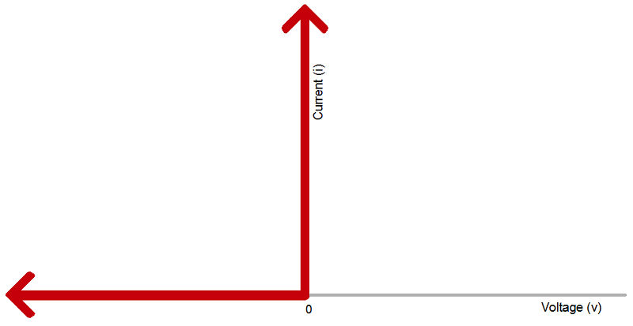

| 理想的なダイオードの特性 | オン（順バイアス） | オフ（逆バイアス） |
| --- | --- | --- |
| 流れる電流 | I>0 | I=0 |
| かかる電圧 | V=0 | V<0 |
| ダイオードの状態 | 短絡回路 | 開放回路 |

### 回路記号

すべてのダイオードには**2つの端子**（部品の両端の接続点）があり、その2つの端子は**極性を持つ**、つまり明確に異なる役割を持つ。
ダイオードの接続を間違えないことが重要である。
正極側の端子は**アノード**、負極側の端子は**カソード**と呼ばれる。
電流はアノード側からカソード側へは流れるが、その逆には流れない。
電流の向きを忘れてしまったときは、「ACID」（*anode current in diode*、「アノードから電流がダイオードに入る」）という語呂合わせを思い出すとよい。

標準的なダイオードの**回路記号**は、線に押し当てられた三角形である。
このチュートリアルの後半で扱うように、ダイオードにはさまざまな種類があるが、たいていの回路記号はこの形を基本としている。

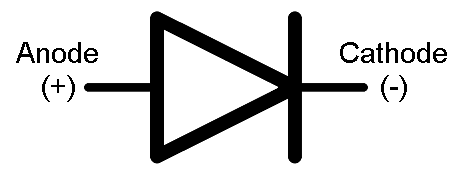

三角形の平らな辺に入っている端子がアノードを表す。
電流は三角形（矢印）が指す方向にしか流れない。

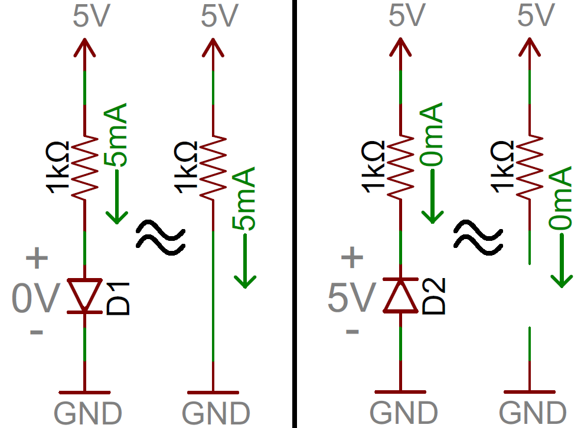

上の例では、左側のダイオードD1は順バイアスがかかっており、回路に電流を流している。
これは実質的に短絡回路のように見える。
右側のダイオードD2は逆バイアスがかかっている。
この回路には電流が流れず、実質的に開放回路のように見える。

もちろん、*理想的な*ダイオードというものは実際には存在しない。
しかし心配は無用で、現実のダイオードはこの理想モデルから少し外れた、いくつかの固有の特性を持っているだけである。

## 現実のダイオードの特性

*理想的には*、ダイオードは逆方向の電流をすべて遮断し、順方向であれば単なる短絡回路のようにふるまうはずである。
しかし残念ながら、実際のダイオードの動作はそこまで理想的ではない。
ダイオードは順方向に電流を流しているときにもいくらかの電力を消費し、逆方向の電流もすべてを遮断できるわけではない。
現実のダイオードはもう少し複雑で、それぞれが実際の動作を決める固有の特性を持っている。

### 電流電圧特性

もっとも重要なダイオードの特性は、その**電流電圧（i-v）特性**である。
これは、ある部品にかかる電圧に対して、そこを流れる電流がどうなるかを定義するものである。
たとえば抵抗器は、単純な線形の電流電圧特性（[オームの法則](./voltage-current-resistance-and-ohms-law.md)）を持つ。
しかし、ダイオードのi-v曲線はまったくの非線形であり、次のような形になる。

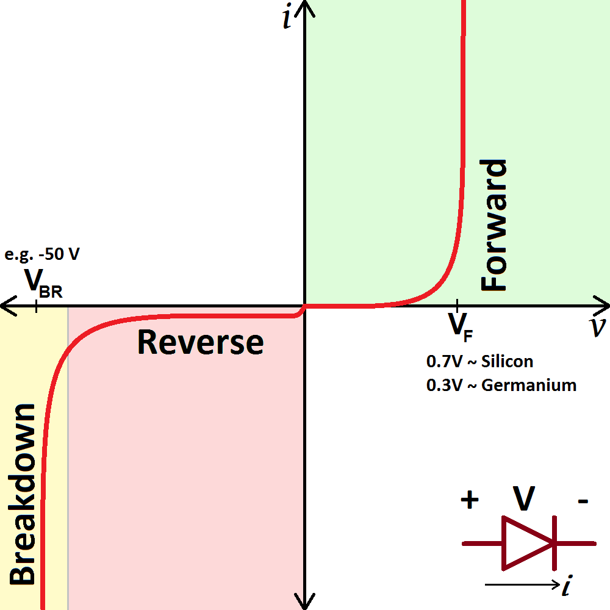

かかる電圧に応じて、ダイオードは次の3つの領域のいずれかで動作する。

1. **順バイアス**：ダイオードにかかる電圧が正のとき、ダイオードは「オン」になり電流が流れる。有意な電流を流すには、電圧が順方向電圧（VF）を上回っている必要がある。
2. **逆バイアス**：ダイオードの「オフ」の状態であり、電圧がVFより低く、-VBRより高い範囲にある。この領域では電流の流れはほぼ遮断され、ダイオードはオフの状態にある。逆飽和電流と呼ばれる*非常に*小さな電流（nAのオーダー）だけは、逆方向に流れることができる。
3. **降伏（ブレークダウン）**：ダイオードにかかる電圧が非常に大きな負の値になると、カソードからアノードへ向かって大きな電流が逆方向に流れられるようになる。

### 順方向電圧

順方向に「オン」になって電流を通すには、ダイオードに一定以上の正の電圧をかける必要がある。
ダイオードをオンにするのに必要な標準的な電圧を**順方向電圧**（VF）と呼ぶ。
「カットイン電圧」や「オン電圧」と呼ばれることもある。

i-v曲線からわかるように、ダイオードを流れる電流とかかる電圧は互いに依存し合っている。
電流が多いほど電圧も高く、電圧が低いほど電流も少ない。
ただし、電圧がおおよそ順方向電圧の定格に達すると、それ以降は電流が大きく増えても電圧の増加はごくわずかにとどまる。
ダイオードが十分に導通しているとき、かかっている電圧は順方向電圧の定格にほぼ等しいとみなしてよい。

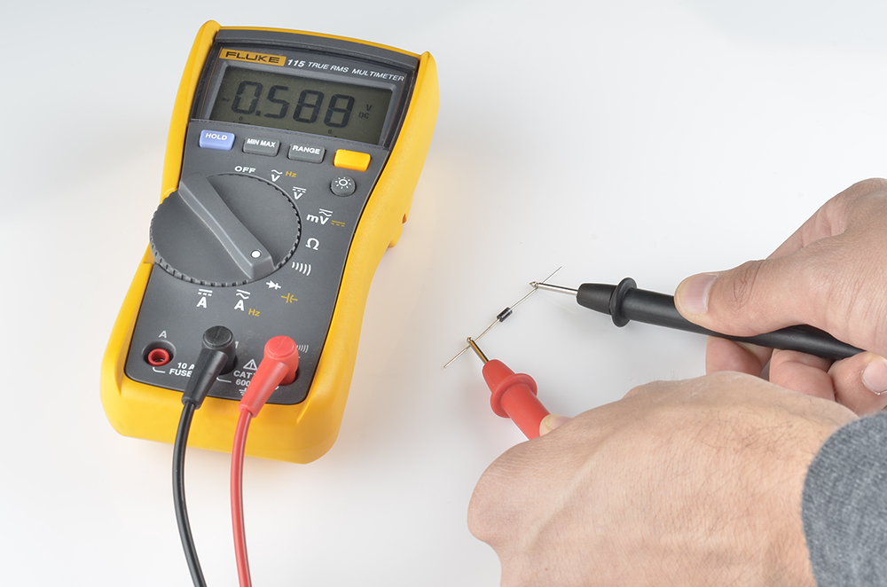

ダイオードのVFの値は、使われている半導体材料によって決まる。
一般に、シリコン系のダイオードのVFはおよそ**0.6〜1V**である。
ゲルマニウム系のダイオードはそれより低く、およそ0.3V程度になることが多い。
ダイオードの*種類*も順方向電圧降下に影響し、発光ダイオードはVFがかなり大きくなる一方、ショットキーダイオードは通常より低い順方向電圧になるよう特別に設計されている。

### 降伏電圧

十分に大きな負の電圧をダイオードにかけると、ダイオードは耐えきれずに逆方向へ電流を流し始める。
この大きな負の電圧を**降伏電圧**（ブレークダウン電圧）と呼ぶ。
降伏領域で動作するよう意図的に設計されたダイオードもあるが、一般的なダイオードにとって大きな負の電圧にさらされることはあまり好ましくない。

一般的なダイオードの降伏電圧は、およそ-50Vから-100V、あるいはそれ以上の負の値になることが多い。

## ダイオードのデータシート

ここまでに挙げた特性は、すべてそれぞれのダイオードのデータシートに記載されている。
たとえば1N4148ダイオードの[データシート](http://www.vishay.com/docs/81857/1n4148.pdf)には、最大順方向電圧（1V）と降伏電圧（100V）が、他の多くの情報とあわせて記載されている。

データシートには、ダイオードの動作をさらに詳しく示すために、見慣れたi-vグラフが載っていることもある。
このグラフでは、i-v曲線の順方向領域のカーブした部分が拡大されている。
電流が多いほど、より高い電圧が必要になっている様子に注目してほしい。

このグラフからは、もう1つの重要なダイオードの特性、**最大順方向電流**も読み取れる。
どんな部品とも同じく、ダイオードにも耐えられる電力には限りがあり、それを超えると壊れてしまう。
すべてのダイオードには最大電流、逆電圧、消費電力の定格が記載されているはずである。
定格を超える電圧や電流にさらされたダイオードは、発熱したり、最悪の場合は溶けたり煙を上げたりすることになる。

1Aかそれ以上の大電流に適したダイオードもあれば、上で紹介した1N4148のような小信号ダイオードは200mA程度にしか対応していないこともある。

1N4148は、数あるダイオードのほんの一例にすぎない。
次は、実に多様なダイオードの種類と、それぞれの役割を見ていこう。

## ダイオードの種類

### 標準的なダイオード

#### 信号用ダイオード

標準的な**信号用ダイオード**は、ダイオードの中でももっとも基本的で、飾り気のない部類に入る。
たいてい中〜高程度の順方向電圧降下と、低めの最大電流定格を持つ。
信号用ダイオードの代表例が[1N4148](http://www.sparkfun.com/products/8588)である。
非常に汎用性が高く、標準的な順方向電圧降下は0.72V、最大順方向電流は300mAである。

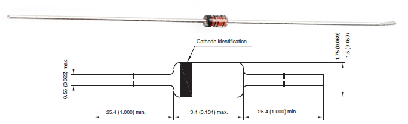

#### 電力用ダイオード

**整流ダイオード**（電力用ダイオード）は、はるかに高い最大電流定格を持つ標準的なダイオードである。
この高い電流定格は、たいてい順方向電圧が大きくなることと引き換えになっている。
[1N4001](http://www.sparkfun.com/products/8589)が電力用ダイオードの一例である。
1N4001の電流定格は1A、順方向電圧は1.1Vである。

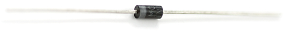

もちろん、たいていのダイオードには表面実装型のバリエーションもある。
どのダイオードにも（どれほど小さく見づらくても）どちらのピンがカソードかを示す何らかの目印があることに気づくはずである。

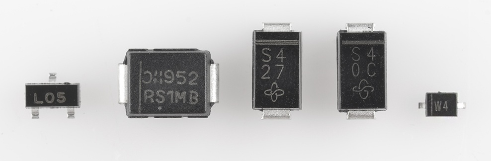

### 発光ダイオード（LED）

ダイオード一族の中でもっとも華やかなのが、[発光ダイオード（LED）](./light-emitting-diodes-leds.md)である。
その名のとおり、正の電圧をかけると文字どおり光る。

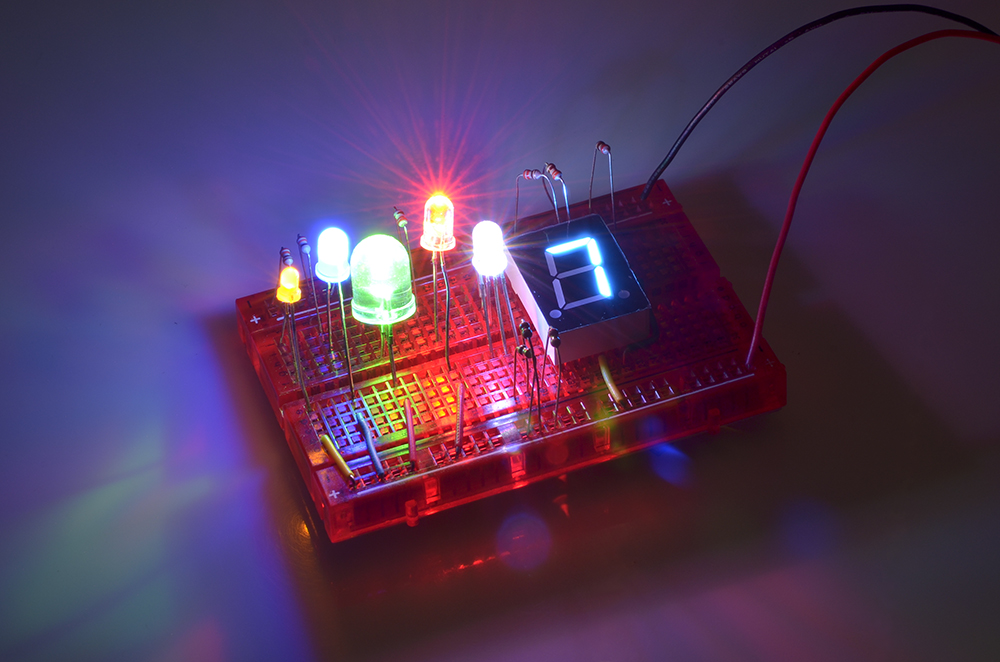

通常のダイオードと同じく、LEDも一方向にしか電流を通さない。
LEDにも点灯に必要な順方向電圧の定格があり、その値は通常のダイオードより大きく（1.2〜3V程度）、発光する色によっても異なる。
たとえば[超高輝度青色LED](http://www.sparkfun.com/products/529)の順方向電圧はおよそ3.3Vだが、同じサイズの[超高輝度赤色LED](http://www.sparkfun.com/products/528)ではわずか2.2Vである。

LEDは照明用途でよく見かけるものだが、それだけではない。
高効率であることから、街灯やディスプレイ、バックライトなど、幅広い用途で使われている。
赤外線LEDのように、人の目には見えない光を発するLEDもあり、これはほとんどのリモコンの心臓部となっている。
LEDのもう1つのよくある用途が、危険な高電圧系統を低電圧の回路から光学的に絶縁することである。
フォトカプラ（オプトアイソレータ）は、赤外線LEDとフォトセンサーを組み合わせた部品で、LEDからの光を検知すると電流が流れる仕組みになっている。
下は、フォトカプラを使った回路の例である。
LEDの回路記号が通常のダイオードとは異なり、記号から外側へ向かう矢印がいくつか追加されていることに注目してほしい。

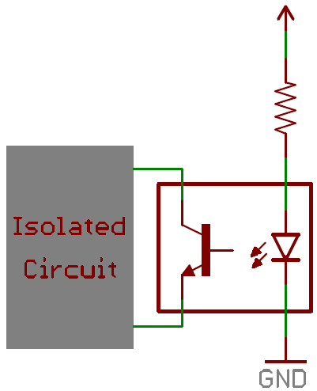

### ショットキーダイオード

もう1つよく使われるダイオードが[ショットキーダイオード](https://www.sparkfun.com/products/10926)である。
ショットキーダイオードの半導体構造は通常のダイオードと少し異なり、そのため**順方向電圧降下がかなり小さく**、たいてい0.15Vから0.45V程度になる。
それでいて、降伏電圧は通常どおり大きい。

ショットキーダイオードは、わずかな電圧損失も惜しいような場面で特に有用である。
独自の回路記号が与えられており、カソード側の線の両端が少し折れ曲がった形をしている。

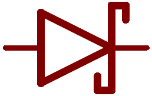

### ツェナーダイオード

[ツェナーダイオード](https://www.sparkfun.com/products/10301)は、ダイオード一族の中でも少し変わった存在である。
意図的に**逆方向電流を流す**ために使われることが多い。

ツェナーダイオードは、非常に精密な降伏電圧（**ツェナー降伏電圧**、あるいは**ツェナー電圧**）を持つように設計されている。
ツェナーダイオードに十分な電流が逆方向に流れると、その両端の電圧降下はツェナー電圧のところで一定に保たれる。

この降伏特性を利用して、ツェナーダイオードはそのツェナー電圧ちょうどの、既知の基準電圧を作るためによく使われる。
小さな負荷に対する電圧レギュレータとして使うこともできるが、大きな電流を引く回路に対する電圧の安定化には向いていない。

ツェナーダイオードにも独自の回路記号があり、カソード側の線の両端が波打った形をしている。
記号自体に、そのダイオードのツェナー電圧の値が示されていることもある。
下は、3.3Vのツェナーダイオードを使って安定した3.3Vの基準電圧を作る回路の例である。

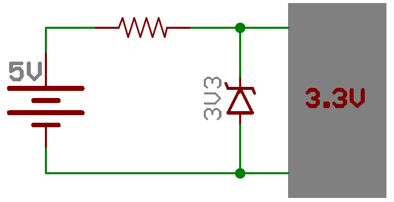

### フォトダイオード

**フォトダイオード**は、光子（光の粒子）のエネルギーを捉えて電流を生み出すように特別に作られたダイオードであり、いわばLEDの逆の働きをする部品である。

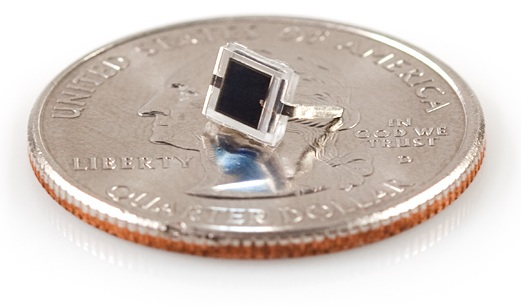

太陽電池はフォトダイオードの技術をもっとも活用している存在だが、フォトダイオードは光の検出や、光を使った通信にも使われる。

## ダイオードの応用例

これほど単純な部品でありながら、ダイオードの用途は非常に幅広い。
ほぼすべての回路に、何らかの形でダイオードが使われている。
小信号のデジタル論理回路から、高電圧の電力変換回路まで、その応用範囲は多岐にわたる。
ここでは、そうした応用例のいくつかを紹介する。

### 整流回路

**整流回路**は、[交流（AC）を直流（DC）に変換する](https://learn.sparkfun.com/tutorials/alternating-current-ac-vs-direct-current-dc)回路である。
この変換は、あらゆる家庭用電子機器にとって欠かせないものである。
壁のコンセントから来るのは交流信号だが、パソコンをはじめとする多くの電子機器を動かしているのは直流である。

交流回路の電流は文字どおり*交互に*、つまり正の方向と負の方向をすばやく切り替えながら流れるが、直流信号の電流は一方向にしか流れない。
そのため、交流を直流に変換するには、電流が負の方向に流れないようにするだけでよい。
これはまさに、ダイオードの出番である。

**半波整流回路**は、たった1本のダイオードで作れる。
正弦波のような交流信号をダイオードに通すと、信号の負の部分が切り取られる。

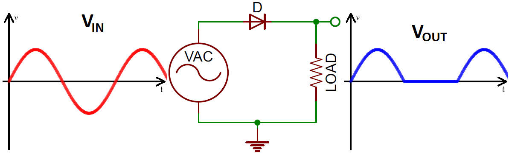

**全波ブリッジ整流回路**は、4本のダイオードを使って、交流信号の負の山を正の山に変換する。

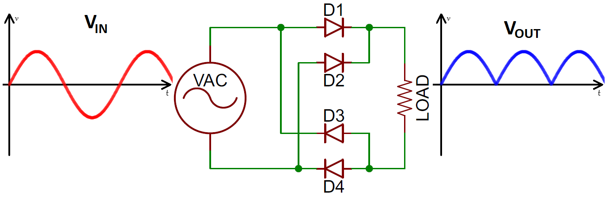

こうした回路は、壁のコンセントの120/240VACの信号を3.3V、5V、12Vなどの直流信号に変換するAC-DC電源にとって欠かせない部品である。
[ACアダプター](https://www.sparkfun.com/products/8269)を分解してみれば、たいてい中に何本かのダイオードが整流のために使われているのが見つかるはずである。

### 逆接保護

電池を逆向きに入れてしまったり、赤と黒の電源配線を入れ替えてしまったりしたことはないだろうか。
もしそれでも回路が無事だったなら、それはダイオードのおかげかもしれない。
電源の正極側に直列に入れたダイオードは、逆接保護ダイオードと呼ばれる。
これにより、電流は正の方向にしか流れず、電源が回路に加える電圧は常に正になる。

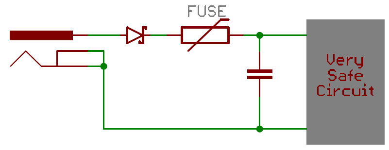

この応用は、電源コネクタに極性がなく、うっかり負極側を入力回路の正極側につないでしまいやすい場合に特に役立つ。

逆接保護ダイオードの欠点は、順方向電圧降下によっていくらかの電圧損失が生じることである。
そのため、**ショットキーダイオード**は逆接保護用のダイオードとして優れた選択肢になる。

### 論理ゲート

トランジスタを使わなくても、ANDやORのような単純な[デジタル論理ゲート](https://learn.sparkfun.com/tutorials/digital-logic/combinational-logic)をダイオードだけで作ることができる。

たとえば、2入力のORゲートは、カソードを共有する2本のダイオードで作れる。
この論理回路の出力も、そのカソードの共有点から取り出す。
どちらか一方（あるいは両方）の入力が論理1（ハイ、5V）のとき、出力も論理1になる。
両方の入力が論理0（ロー、0V）のときは、出力は抵抗を通してローに引かれる。

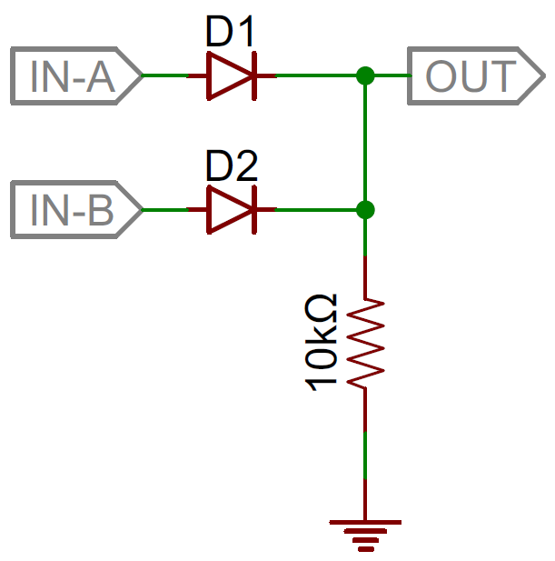

ANDゲートも同様の考え方で作れる。
今度は2本のダイオードの*アノード*どうしをつなぎ、そこから回路の出力を取り出す。
両方の入力が論理1のときにだけ、電流が出力ピンへ向かって流れてそこをハイに引き上げる。
どちらかの入力がローのときは、5V電源からの電流がそのダイオードを通って流れてしまう。

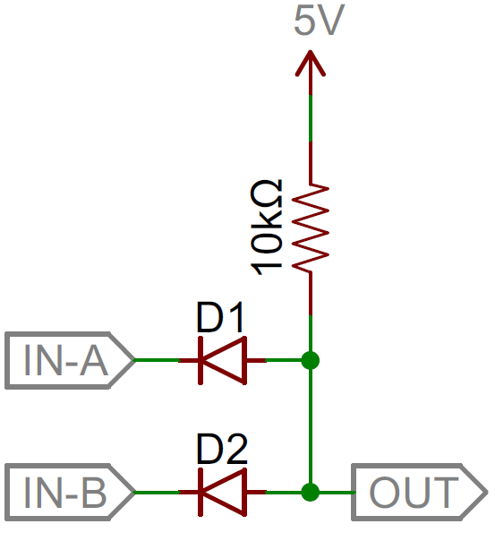

どちらの論理ゲートも、ダイオードを1本追加するだけで入力を増やせる。

### フライバックダイオードと電圧サージの抑制

ダイオードは、予期しない大きな電圧サージによる損傷を防ぐためにもよく使われる。
TVS（過渡電圧抑制）ダイオードは、ツェナーダイオードに似た比較的低い降伏電圧（たいてい20V前後）を持ちながら、非常に大きな電力定格（キロワット単位のこともある）を備えた特殊なダイオードである。
電圧が降伏電圧を超えたときに電流を逃がし、エネルギーを吸収するように設計されている。

**フライバックダイオード**も同じように電圧サージを抑える働きをするが、こちらはモーターのようなインダクタ性の部品によって引き起こされる電圧サージを対象にしている。
インダクタを流れる電流が急激に変化すると電圧サージが発生し、非常に大きな負のスパイクになることもある。
インダクタ性の負荷に並列にフライバックダイオードを入れておくと、その負の電圧信号を安全に逃がす経路ができ、インダクタとダイオードのあいだをぐるぐると循環しながら、やがて減衰していく。

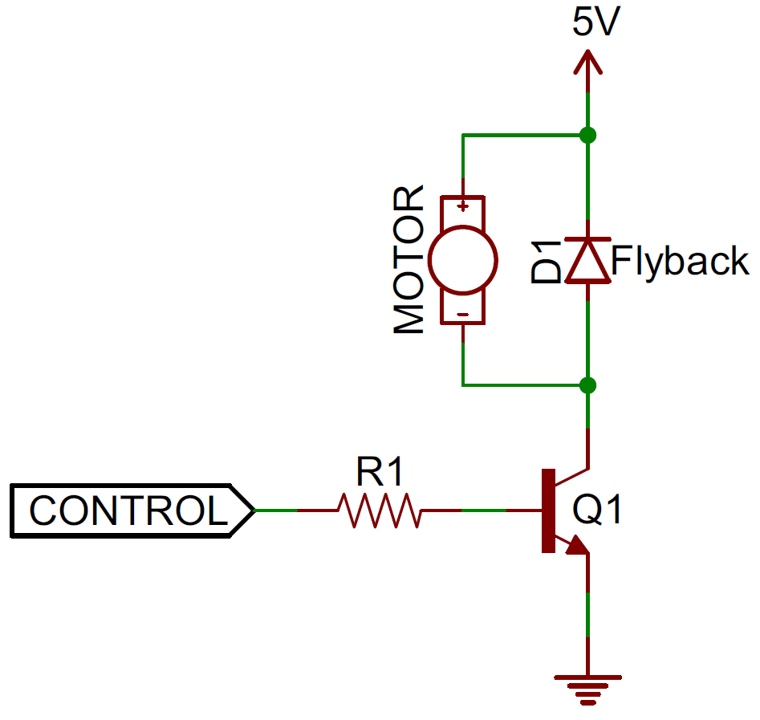

これらは、この小さな半導体部品が持つ応用例のほんの一部にすぎない。

## まとめ

これでダイオードについて理解できたところで、他の半導体部品にも目を向けてみてほしい。

- [トランジスタ](./transistors.md)
- [発光ダイオード](./light-emitting-diodes-leds.md)
- あるいは、集積回路について学ぶのもよい：555タイマー、オペアンプ、[シフトレジスタ](https://learn.sparkfun.com/tutorials/shift-registers)

他のよく使われる電子部品についても、ぜひ調べてみてほしい。

- [抵抗器](./resistors.md)
- [コンデンサ](./capacitors.md)
- インダクタ
- 電圧レギュレータ

タグ: 部品、電気工学、技術

---

出典：[Diodes](https://learn.sparkfun.com/tutorials/diodes)（SparkFun Learn）を日本語に翻訳し、再構成した。
原文は [CC BY-SA 4.0](https://creativecommons.org/licenses/by-sa/4.0/) ライセンスで公開されており、本ページも同ライセンスの下で提供する。
