# ELワイヤーで光るズボンを作る

> このプロジェクトの設計・製作にかかる時間は、手縫いの経験、使うELワイヤーの長さ、どこに縫い付けるかによって変わる。ズボンの側面に沿って縫う場合、おおよそ1〜3時間程度である。

> **注意：** このチュートリアルで使ったズボンは**キッズMサイズ**で、標準的なELワイヤーを脚の側面に縫い付けている。使用したワイヤーの長さは3メートルである。ズボンのサイズによっては、以下で説明するとおり、必要なELワイヤーの長さが変わってくる。あらかじめ計画を立てておくとよい。

このチュートリアルでは、標準的なELワイヤーをズボンに縫い付ける。

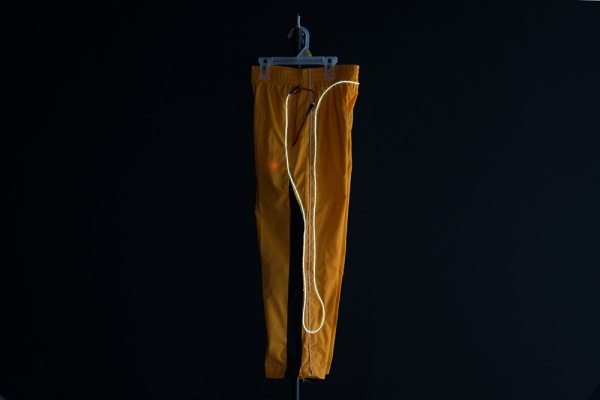

## 必要な部品

このチュートリアルを進めるには、次の材料が必要になる。
ズボンには標準的なELワイヤーを使う。
手元にあるものや自分の環境によっては、すべてが必要とは限らない。
カートに入れてガイドを読み進め、必要に応じて調整してほしい。

- 単三形アルカリ電池
- ELワイヤー（白 3m）
- ELインバータ（電池パック式）

> **注意：** ELワイヤーにはさまざまな色がある。標準的なELワイヤーの色の選択肢には、赤、黄、オレンジ、緑、青、紫、白、青緑、蛍光グリーンなどがある。
>
> チェイシング（流れるように光る）タイプや曲げやすいタイプのELワイヤーを探している場合は、SparkFunのカタログでさらに多くの色・種類のELワイヤーを確認できる。

### 道具

最低限、針が必要になる。
延長ケーブルを作る場合は、はんだごて、はんだ、一般的なはんだ付け用アクセサリーも必要になる。

- 針セット

### その他に必要なもの

- ズボン
- [透明糸](https://www.joann.com/sulky-premium-invisible-thread-440-yards-clear/3076106.html)またはテグス
- ダブルクリップ、まち針、あるいはテープ
- はさみ

## 参考になるチュートリアル

以下の概念に馴染みがない場合は、先に次のチュートリアルを読んでおくとよい。

- [Getting Started with Electroluminescent (EL) Wire](https://learn.sparkfun.com/tutorials/getting-started-with-electroluminescent-el-wire) — ELワイヤー、テープ、パネル、チェイシングワイヤー、曲げやすいワイヤーを使ってプロジェクトを光らせる入門ガイド
- [Planning a Wearable Electronics Project](https://learn.sparkfun.com/tutorials/planning-a-wearable-electronics-project) — ウェアラブルプロジェクトのブレインストーミングと制作のコツ
- [How to Make a Custom EL Wire Extension Cable](https://learn.sparkfun.com/tutorials/how-to-make-a-custom-el-wire-extension-cable) — ワイヤーの継ぎ足しの代わりに、自作のELワイヤー延長ケーブルを作る方法

## ELワイヤーの準備

> **注意：** 以下の画像は、**キッズサイズ**のズボンに標準的なELワイヤーを使用している。使用したワイヤーの長さは3メートルである。ズボンのサイズによっては、以下で説明するとおり、必要なELワイヤーの長さが変わってくる。あらかじめ計画を立てておくとよい。

### ELワイヤーとELインバータをテストする

ELワイヤーを衣類に縫い付ける前に、正常に動作するか必ずテストしておくこと。
テストするには、ELワイヤーをインバータに接続する。
今回は、単三形電池と3VのELインバータ電池パックを使用する。

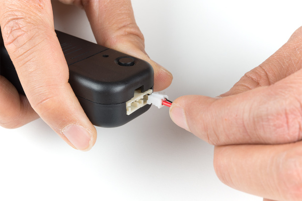

ELインバータ電池パックに電池を入れた状態で、ボタンを押してテストする。
ELワイヤーが光れば、ELワイヤーとELインバータの両方とも問題なく使える。

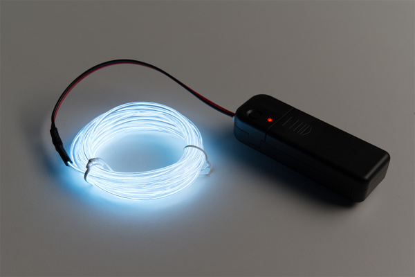

### 経路を計画する

ELワイヤーをどこに取り付けるか計画する。
縫っている間ELワイヤーを固定するため、ダブルクリップを使う。
手元にあるものによっては、まち針やテープを試してもよい。
ELワイヤーをダブルクリップに挟み、生地に押さえつけて固定する。
ダブルクリップが挟む部分にELワイヤーを挟まないよう注意すること。コロナワイヤー（芯線を覆う細い導線）を傷める恐れがある。

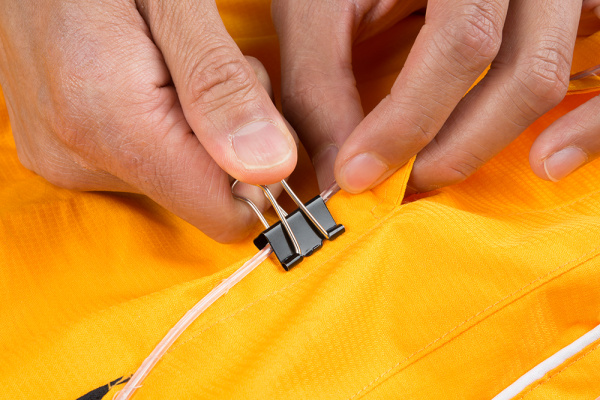

今回は、3メートルのELワイヤーすべてを使い、左のポケットから始めて脚の側面を下り、ウエストまで戻ってくる経路にした。
続いてELワイヤーは背面のウエストに沿って進み、右脚の側面を下ってから再び右のポケットまで戻ってくる。
左右対称になるよう、各側の長さを調整した。

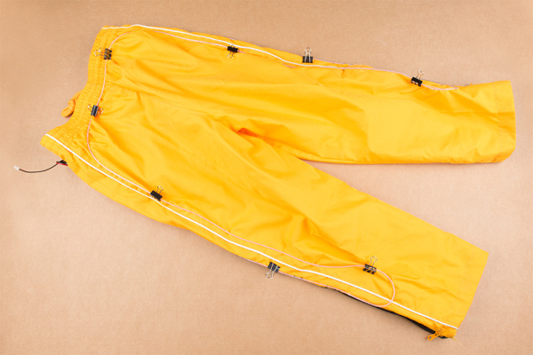

> **注意：** コットンのような緩い生地は、糸を押さえる何かがないと縫いにくいことがある。このチュートリアルで使ったズボンはポリエステル製で、扱いやすかった。素材はよく考えて選ぶこと。

### 針と糸を用意する

このチュートリアルでは、透明糸を二重にして使う。
透明糸の端を針の穴（目）に通し、引き抜いて針と糸を用意する。
作業しやすい長さ（両腕を広げたくらい、約60cm）に糸を切る。
テグスの両端を結んで玉止めする。
糸の端近くまで結び目を寄せるのに、針を使うとやりやすいことがある。

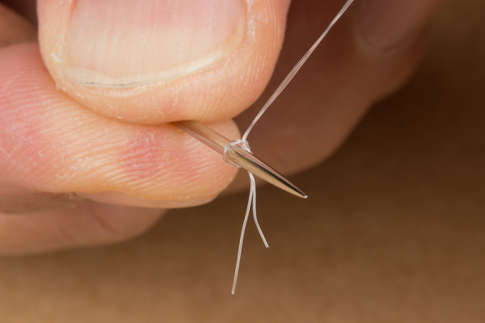

同じ手順をもう一度繰り返し、2つ目の結び目を作る。
余った糸の端は切り落とす。

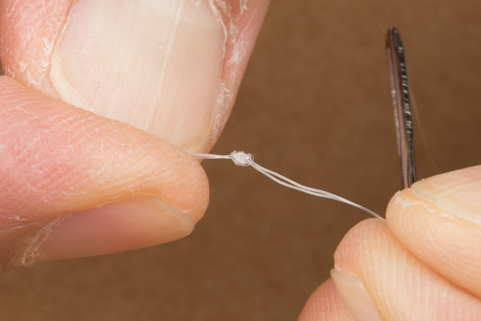

> **ヒント：** 透明糸は非導電性である。結び目の作り方について他の選択肢を知りたい場合は、導電性の糸で縫うの節も参考になる。

## ELワイヤーを縫い付ける

> **注意：** 以下の画像は、**キッズサイズ**のズボンに標準的なELワイヤーを使用している。使用したワイヤーの長さは3メートルである。ズボンのサイズによっては、以下で説明するとおり、必要なELワイヤーの長さが変わってくる。あらかじめ計画を立てておくとよい。

> **⚡ 注意：** 縫っている間は、ELワイヤーが電源から外れていることを必ず確認すること。また、縫っている最中に自分自身やELワイヤーを針で刺さないよう注意すること。

ELワイヤーの熱収縮チューブの近くから縫い始め、ELワイヤーの周りに結び目を作る。
ELワイヤーを固定するため、ワイヤーの周りにループを作り続ける。
透明糸で縫う際は、生地によっては糸が滑りやすいため、糸を最後までしっかり引き抜くこと。
ズボンの前面と背面を一緒に縫い合わせてしまわないよう注意すること。
また、各縫い目の間隔を空けすぎないようにする。0.5〜1インチ（約1.3〜2.5cm）程度がちょうどよい間隔である。
縫い目の間隔が長すぎると、ELズボンを着用した際にELワイヤーが引っかかったり緩んだりする原因になる。

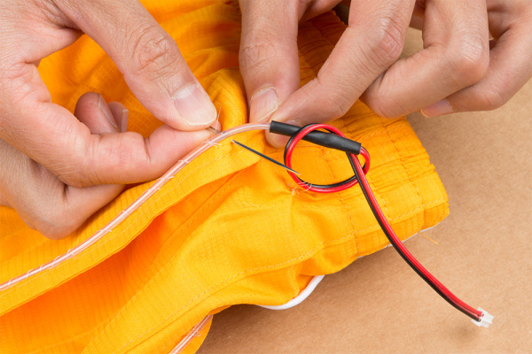

5回ほど縫ったら、最後の縫い目に糸をくぐらせて片結びを作り、糸を固定して滑らないようにする。

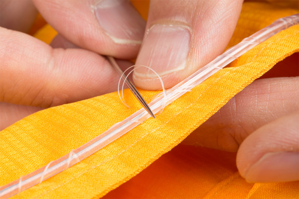

糸が残り少なくなってきたら、透明糸を生地に結びつけて固定する。
続いて、別の透明糸で上記の手順を繰り返す。

ELワイヤーを縫い終えたら、ワイヤーの端でループを作り、ひずみ防止のためにそのワイヤーも縫い付ける。
このループは、熱収縮チューブより先の位置にすること。熱収縮チューブのある接続部分は曲げに弱いためである。

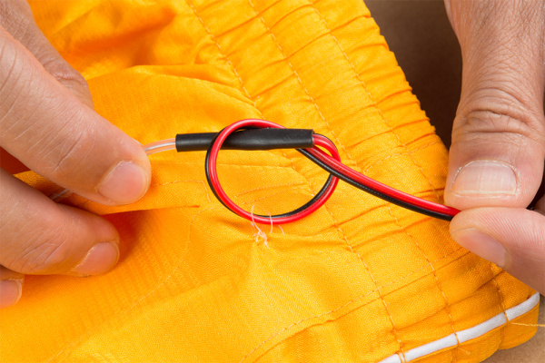

ELワイヤーをELインバータに再び接続してテストする。
点灯すれば準備は完了である。
ELインバータをポケットに入れるか、ベルトにクリップで留めて楽しんでほしい。
ELインバータの電池パックを使っている場合は、延長ケーブルを自作するのもよいだろう。

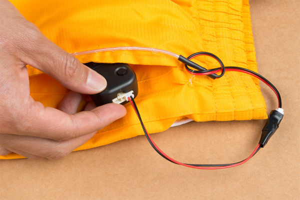

ELワイヤーは、暗い場所で最もよく映えることを覚えておいてほしい。
日中や、光源のある部屋では見えにくいことがある。

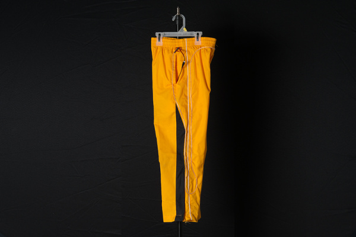

*明るい場所でのEL*

*暗い場所でのEL*

### ズボンのサイズによる違い

先ほど触れた、ズボンのサイズについての話を思い出してほしい。
ズボンのサイズが変われば、必要なELワイヤーの長さも変わる。この違いにより、ELワイヤーの始点・終点が想定した位置にならないことがある。
キッズサイズのズボンと比較した画像の違いに注目してほしい。
ELワイヤーの始点は脚のさらに下の方に縫い付けられており、ウエストに向かって戻る際も細い経路をたどっている。

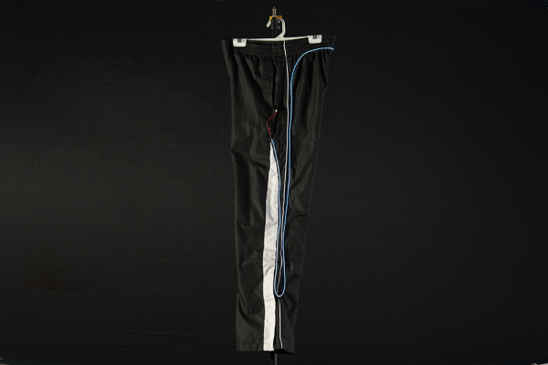

## まとめ・参考資料

次のプロジェクトのヒントとして、次のような関連チュートリアルも参考になる。

- [EL Wire Light-Up Dog Harness](https://learn.sparkfun.com/tutorials/el-wire-light-up-dog-harness) — 暗い中で愛犬を散歩に連れて行くときのために、ELワイヤーで光る犬用ハーネスを作る方法
- [Heartbeat Straight Jacket](https://learn.sparkfun.com/tutorials/heartbeat-straight-jacket) — ある人の心拍を、別の人の衣装に表示するELプロジェクト
- [Sound Reactive EL Wire Costume](https://learn.sparkfun.com/tutorials/sound-reactive-el-wire-costume) — ELワイヤーの衣装を音に反応させる方法を学ぶプロジェクトチュートリアル
- [Prototype Wearable LED Dance Harness](https://learn.sparkfun.com/tutorials/prototype-wearable-led-dance-harness) — 振り付けを踊るダンサーに追加の演出効果を加えるプロジェクトチュートリアル。衣装の下に手早く装着できるハーネス
- [EL Wire Hoodie](https://learn.sparkfun.com/tutorials/el-wire-hoodie) — 標準的なEL（エレクトロルミネセンス）ワイヤーをパーカーに縫い付ける

さらにアイデアが欲しい場合は、次の関連ブログ記事も参考になる。

- [SparkFun Live Preview - EL Sweatshirt](https://news.sparkfun.com/1607) — 「SparkFun Live!」の次回のエピソードに備えよう
- [SparkFun Live - Halloween Hackery](https://news.sparkfun.com/1623) — ハロウィンをテーマにしたプロジェクトを一緒に楽しもう
- [ElectriCute - EL Products](https://news.sparkfun.com/1701) — エレクトロルミネセンスを試してみたいと思ったことはないだろうか
- [Pokémon Go EL projects](https://news.sparkfun.com/2160) — 夜遅くのポケモン探しのために、光る衣装アイテムを作る
- [Hardware Hump Day: 3 Easy EL Wire Projects](https://news.sparkfun.com/2358) — プロジェクトに光の要素を手早く簡単に加える
- [EL Wire Lab Coat](https://news.sparkfun.com/2562) — はんだ付けもコーディングも開発も専門ではないが、プラグを挿して電源ボタンを押すことならわかる

タグ: ELワイヤー、E-Textiles、ハロウィン、光、プロジェクト、ウェアラブル

---

出典：[EL Wire Pants](https://learn.sparkfun.com/tutorials/el-wire-pants)（SparkFun Learn）を日本語に翻訳し、再構成した。
原文は [CC BY-SA 4.0](https://creativecommons.org/licenses/by-sa/4.0/) ライセンスで公開されており、本ページも同ライセンスの下で提供する。
