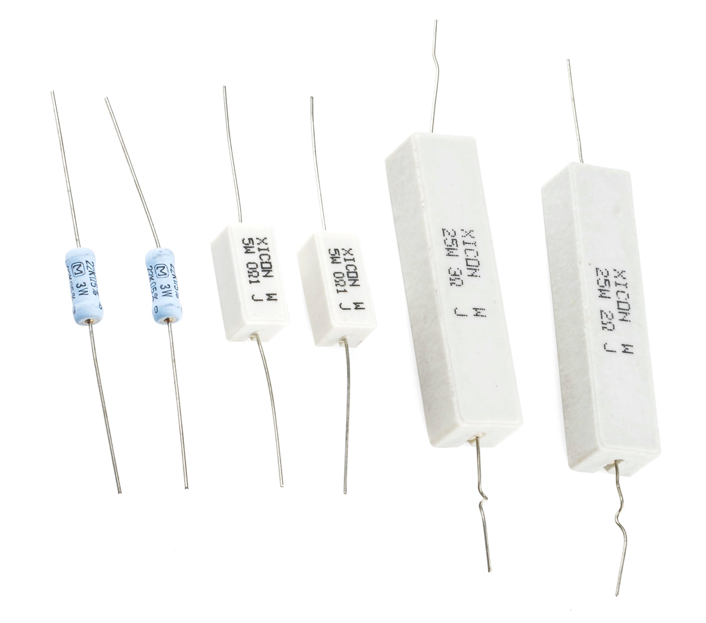
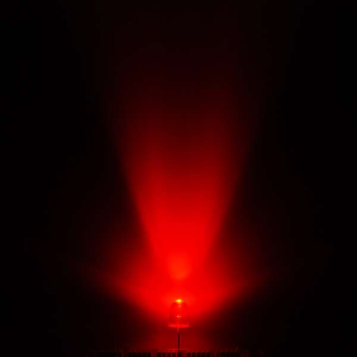

# 電力

なぜ電力を気にする必要があるのか。
**電力**とはエネルギーが変換される速さの尺度であり、エネルギーにはお金がかかる。
電池はただでは手に入らないし、コンセントから得られる電気もそうである。
つまり電力は、財布からどれだけの速さでお金が出ていっているかを測っているとも言える。

エネルギーは、熱、放射線、音、原子力など、さまざまな形をとり、その一部は人体に害を及ぼしうる。
電力が大きいほど、扱うエネルギーも大きくなる。
そのため、電子工作をするときは、自分がどれくらいの電力を扱っているのかを把握しておくことが重要である。
幸い、[Arduino](https://learn.sparkfun.com/tutorials/what-is-an-arduino)で遊んだり、LEDを光らせたり、小さなモーターを回したりする程度であれば、電力を見誤ったとしても、抵抗を焦がすかICを溶かす程度で済むことが多い。

このチュートリアルで扱う内容:

- 電力の定義
- 電気エネルギーが変換される例
- 電力のSI単位であるワット
- 電圧、電流、抵抗を使った電力の計算
- 最大定格電力

参考になるチュートリアル:

- [電気とは何か](./what-is-electricity.md)
- [電圧、電流、抵抗とオームの法則](./voltage-current-resistance-and-ohms-law.md)
- [回路とは何か](./what-is-a-circuit.md)
- [テスターの使い方](./how-to-use-a-multimeter.md)

## 電力とは何か

このチュートリアルでは、電気の力、つまり**電力**に絞って説明する。

一般的な物理の言葉で言えば、**電力**とは**エネルギーが変換（あるいは移動）する速さ**として定義される。

では、エネルギーとは何であり、どのように移動するのか。
簡潔に言い表すのは難しいが、エネルギーとは基本的に、*何か*が別の*何か*を*動かす*能力のことである。
エネルギーには、力学的、電気的、化学的、電磁的、熱的など、さまざまな形がある。

エネルギーは決して生み出されたり消えたりすることはなく、ただ別の形に変換されるだけである。
電子工作でしていることの多くは、さまざまな形のエネルギーを**電気エネルギー**との間で変換することである。
LEDを光らせることは電気エネルギーを電磁エネルギーに変え、モーターを回すことは電気エネルギーを力学的エネルギーに変える。
ブザーを鳴らせば音のエネルギーが生まれ、9Vのアルカリ電池で回路を動かせば化学エネルギーが電気エネルギーに変わる。
これらはすべて**エネルギーの変換**の一種である。

| 変換されるエネルギーの種類 | 変換する部品 |
| --- | --- |
| 力学的エネルギー | モーター |
| 電磁エネルギー | LED |
| 熱エネルギー | 抵抗器 |
| 化学エネルギー | 電池 |
| 風のエネルギー | 風車 |

電気エネルギーは、もとをたどれば電気的な**位置**エネルギー、つまり親しみを込めて[電圧](./voltage-current-resistance-and-ohms-law.md)と呼んでいるものから始まる。
その位置エネルギーの中を[電子が流れる](./what-is-electricity.md)と、それが電気エネルギーに変わる。
実用的な回路のほとんどでは、その電気エネルギーがさらに別の形のエネルギーへと変換される。
電力は、**どれだけの量**の電気エネルギーが**どれだけ速く**移動しているかを組み合わせて測られる。

### 電力の生産者と消費者

回路の中のそれぞれの部品は、電気エネルギーを**消費**するか**生産**するかのどちらかである。
消費する部品は、電気エネルギーを別の形に変換する。
たとえばLEDが光るとき、電気エネルギーは電磁エネルギーに変換されており、この場合LEDは電力を**消費**している。
逆に、他の形のエネルギーから電気エネルギーへの変換が起きるとき、電力は**生産**されている。
回路に電力を供給する電池は、**電力の生産者**の一例である。

## ワット数

エネルギーはジュール（J）という単位で測られる。
電力はある決まった時間あたりのエネルギー量を表すので、**1秒あたりのジュール数**として測れる。
1秒あたりのジュール数を表すSI単位が**ワット**（記号 *W*）である。

\\[ 1\,\text{W} = 1\,\text{J/s} \\]

「ワット」という単位には、標準的な[SI接頭辞](./metric-prefixes-and-si-units.md)が付くことがよくある。
マイクロワット（µW）、ミリワット（mW）、キロワット（kW）、メガワット（MW）、ギガワット（GW）などが、場面に応じてよく使われる。

| 接頭辞名 | 接頭辞記号 | 倍率 |
| --- | --- | --- |
| ナノワット | nW | 10⁻⁹ |
| マイクロワット | µW | 10⁻⁶ |
| ミリワット | mW | 10⁻³ |
| ワット | W | 10⁰ |
| キロワット | kW | 10³ |
| メガワット | MW | 10⁶ |
| ギガワット | GW | 10⁹ |

[Arduino](https://learn.sparkfun.com/tutorials/what-is-an-arduino)のようなマイコンは、たいていµWからmWの範囲で動作する。
ノートパソコンやデスクトップパソコンは、標準的なワットの範囲で動作する。
一般家庭の電力消費は、たいていキロワットの範囲になる。
大きなスタジアムはメガワットの規模になることもある。
そしてギガワットは、大規模な発電所やタイムマシンの世界の話になる。

## 電力を計算する

電力とはエネルギーが移動する速さであり、1秒あたりのジュール数（J/s）、つまりワット（W）で測られる。
[電気に関する基本的な用語](./voltage-current-resistance-and-ohms-law.md)を踏まえると、回路の中の電力はどう計算できるだろうか。
位置エネルギーを表す標準的な量であるボルト（V）は、電荷1単位（クーロン）あたりのジュール数（J/C）として定義されている。
もう1つの電気の基本用語である電流は、電荷の流れる速さをアンペア（A）、つまり1秒あたりのクーロン数（C/s）で表す。
この2つを掛け合わせると、電力が得られる。

\\[ \text{V} \times \text{A} = \left(\frac{\text{J}}{\text{C}}\right) \times \left(\frac{\text{C}}{\text{s}}\right) = \text{J/s} = \text{W} \\]

回路の中のある部品の電力を計算するには、その部品にかかる電圧降下と、そこを流れる電流を掛け合わせればよい。

\\[ P = V \times I \\]

### 例

下に示すのは、9Vの電池を10Ωの抵抗につないだだけの、単純な（実用的とは言えない）回路である。

抵抗にかかる電力はどう計算すればよいか。
まず、そこを流れる電流を求める必要がある。
これは簡単で、[オームの法則](./voltage-current-resistance-and-ohms-law.md)を使えばよい。

\\[ I = \frac{V}{R} = \frac{9\,\text{V}}{10\,\Omega} = 0.9\,\text{A} \\]

これで、抵抗には900mA（0.9A）の電流が流れ、9Vの電圧がかかっていることがわかった。
このとき、抵抗にはどれだけの電力がかかっているか。

\\[ P = V \times I = 9\,\text{V} \times 0.9\,\text{A} = 8.1\,\text{W} \\]

抵抗は電気エネルギーを熱に変換する部品である。
つまりこの回路は、1秒ごとに8.1ジュールの電気エネルギーを熱に変換していることになる。

### 抵抗性回路の電力を計算する

純粋に抵抗だけの回路であれば、電圧、電流、抵抗の3つのうち2つさえわかれば電力を計算できる。

オームの法則（V = IR、あるいは I = V/R）をこれまでの電力の式に代入すると、2つの新しい式が得られる。
1つ目は、電圧と抵抗だけで表したものである。

\\[ P = \frac{V^2}{R} \\]

先ほどの例で言えば、9²/10（V²/R）は8.1Wであり、抵抗を流れる電流をあらためて計算する必要はない。

2つ目の式は、電流と抵抗だけで表したものである。

\\[ P = I^2 \times R \\]

抵抗にかかる電力を気にする理由は何か。
他の部品についても同じことが言える。
電力とは、あるエネルギーが別の種類のエネルギーへ変換される速さであることを思い出してほしい。
電源から流れてきた電気エネルギーが抵抗に達すると、そのエネルギーは熱に変換される。
場合によっては、その抵抗が処理しきれないほどの熱になることもある。
そこで重要になってくるのが、定格電力である。

## 定格電力

すべての電子部品は、あるエネルギーを別の種類のエネルギーに変換している。
LEDが光を放つ、モーターが回る、電池が充電されるといった変換は、望ましいものである。
一方で、望ましくない、しかし避けられないエネルギー変換もある。
こうした望ましくないエネルギーの変換は**電力損失**と呼ばれ、たいていは熱として現れる。
電力損失が大きすぎる、つまり部品の発熱が大きすぎると、それは*非常に*望ましくない事態になりうる。

エネルギーの変換自体が部品の主目的である場合でも、他の形のエネルギーへの損失は必ず生じる。
たとえばLEDやモーターも、目的の変換とは別に、副産物として熱を発生させる。

ほとんどの部品には、放散できる最大の電力についての定格が定められており、その値を超えないように動作させることが重要である。
そうすることで、いわゆる「魔法の煙を逃がしてしまう」事態を避けられる。

### 抵抗器の定格電力

抵抗器は、電力損失の代表格ともいえる部品である。
抵抗器に電圧をかけると、そこには必ず電流が流れる。
電圧が高いほど電流も大きくなり、電流が大きいほど電力も大きくなる。

先ほどの電力計算の例を思い出してほしい。
9Vを10Ωの抵抗にかけると、その抵抗は8.1Wを消費することになる。
8.1Wというのは、たいていの抵抗器にとって*非常に*大きな値である。
一般的な抵抗器の定格は⅛W（0.125W）から½W（0.5W）程度であり、標準的な½W抵抗器に8Wをかけようものなら、消火器を用意しておいたほうがよい。

大きな電力を扱えるように作られた抵抗器もあり、これは特に**パワー抵抗器**と呼ばれる。

抵抗値を選ぶときは、定格電力にも気を配る必要がある。
何かを温めることが目的（ヒーターの発熱体は、実質的に非常に高出力の抵抗器である）でない限り、抵抗器での電力損失はできるだけ小さく抑えるようにしたい。

#### 例

抵抗器の定格電力は、LEDの電流制限抵抗の値を決めるときにも関わってくる。
たとえば、[10mmの超高輝度赤色LED](https://www.sparkfun.com/products/8862)を9Vの電池で最大の明るさで光らせたいとする。

このLEDの最大順方向電流は80mA、順方向電圧はおよそ2.2Vである。
LEDに80mAを流すには、85Ωの抵抗が必要になる。

抵抗には6.8Vがかかり、そこに80mAが流れるということは、抵抗での電力損失は0.544W（6.8V×0.08A）になる。
これは½Wの抵抗にとってはあまり嬉しくない値である。
溶けることはなくても、かなり**熱く**なるはずである。
安全のため、1Wの抵抗に切り替えるとよい（あるいは、電力を節約したいなら専用のLEDドライバを使うという手もある）。

最大定格電力を考慮すべきなのは抵抗器だけではない。
何らかの抵抗成分を持つ部品はすべて、熱による電力損失を生む。
電圧レギュレータ、[ダイオード](https://learn.sparkfun.com/tutorials/diodes)、増幅回路、モータードライバなど、大きな電力にさらされることの多い部品を扱うときは、電力損失と熱によるストレスに特に注意を払う必要がある。

## まとめ

電力という概念について理解できたところで、関連するチュートリアルにも目を通してみてほしい。

- [プロジェクトへの電源供給](./how-to-power-a-project.md)：電力とは何かはもうわかった。では、それをどうやってプロジェクトに届けるのか。
- [光](./light.md)：光は電気工学者にとって役立つ道具である。光と電子工学の関係を理解することは、多くのプロジェクトに欠かせないスキルである。
- [Arduinoとは何か](./what-is-an-arduino.md)：このチュートリアルでもArduinoについて何度も触れた。まだよくわからない場合は、このチュートリアルを確認してほしい。
- [ダイオード](./diodes.md)：交流を直流に変換する場合でも、単に電源インジケータ用のLEDを光らせる場合でも、ダイオードはプロジェクトに電力を供給するうえで特に便利な部品である。
- [抵抗器](./resistors.md)：もっとも基本的な電子部品であり、ほぼすべての回路に欠かせない。

タグ: 概念、電気工学、LED、物理学、電力

---

出典：[Electric Power](https://learn.sparkfun.com/tutorials/electric-power)（SparkFun Learn）を日本語に翻訳し、再構成した。
原文は [CC BY-SA 4.0](https://creativecommons.org/licenses/by-sa/4.0/) ライセンスで公開されており、本ページも同ライセンスの下で提供する。
