# 電子部品の組み立て

SparkFunでは、電子機器を組み立てるにあたって、かなり型破りな方法を採用している。
DIYによるPCBA（プリント基板の組み立て）に取り組んできたこの10年間で得られたステップと教訓の一部をここにまとめた。
今では自宅の地下室でやるようなことではなくなった部分もあるが、私たちがどうやって（毎月8万個以上のガジェットを）作っているのか気になるなら、ぜひ読み進めてほしい。

まずは生産の最初の段階から見ていこう。
つまり、設計はすでに検証、試作、レビューを経て「赤い基板に進む」段階にある（緑色の試作基板が量産の準備が整うと、赤色でPCBを作る）ことを前提としている。
あとは実際に作るだけである。

電子工作にまったく初めて触れるなら、まず[PCB基板の基礎](./pcb-basics.md)を確認しておくとよい。

参考になるチュートリアル:

- [PCB基板の基礎](./pcb-basics.md)

SparkFunでの電子部品の組み立ては、たいてい次の7つの工程を経る。

- ペーストステンシリング
- 部品の配置
- リフロー
- 手作業でのはんだ付け
- 検査とテスト
- 洗浄
- パッケージング

それでは、それぞれの工程を順番に見ていこう。

## ステンシリング

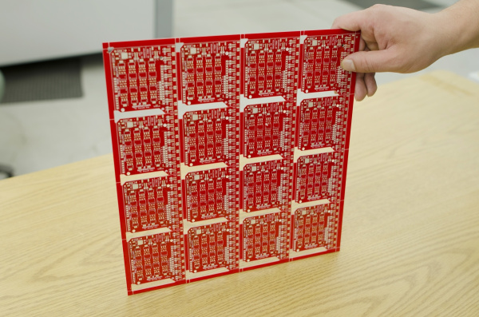

はんだペーストのステンシリングは、Tシャツにシルクスクリーンで印刷するのとよく似ている。
インクを塗りたいものの上にマスクを重ねるのと同じように、私たちはPCB（プリント基板）の特定の部分にだけペーストを塗るために、金属製のステンシルを使う。

SparkFunでは、まずPCBパネルから作業を始める。
パネルとは、同じ設計を何枚も繰り返し並べた、扱いやすくするための大きな基板である。
この例では、[EL Escudo Dos](https://www.sparkfun.com/products/10878)を16枚まとめている。
このような大きなパネルを使うのは、複数の基板を同時にステンシリングできるようにするためである。
もちろん、1枚ずつステンシリングすることも同じように可能である。

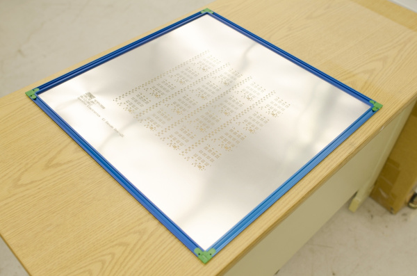

部品が乗る予定のそれぞれのパッドに、少量のはんだペーストを乗せていく。
この作業を速くするため、基板の上にステンシルを重ね、金属製のスキージーでステンシルの上からペーストを塗り広げる。

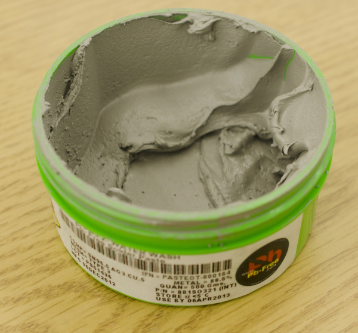

これが実際のはんだペーストの姿である。
金属合金の混合物であり、スズ（Sn）96.5%、銀（Ag）3%、銅（Cu）0.5%で構成されている。
たいていのペーストには使用期限があり、涼しい場所で保管する必要がある。
これは、ペーストの粘度を作り出すために金属に加えられているフラックスに関係している。
フラックスは、金属が液体になったときの表面張力を変化させ、接合部への流れ込みを助ける役割を持つ。

SparkFunでは[鉛フリーのはんだペースト](https://www.sparkfun.com/products/10605)を使っているが、ヨーロッパで製品を販売する予定がないのであれば、[鉛入りのペースト](https://www.sparkfun.com/products/10448)のほうが多少扱いやすく、失敗にも寛容である。

すべての基板はEagle PCBで設計している。
このソフトウェアは、PCBメーカーが実際の基板を作るために使うさまざまなレイヤーファイルを出力する。
このほかにも（表面用と裏面用の）2つのペーストレイヤーがあり、これをステンシル製造業者に送っている。
彼らは高出力のCO2レーザーを使い、薄いステンレス板からステンシルを切り出している。

ステンシリングは手作業でも行える。
ペーストをぐいっと塗りつけるのに魔法のようなコツがあるわけではない。
市販のパテナイフをそのまま使うことが多い。

SparkFunにはステンシリング用の機械もある。
機械を設定するのはかなり手間がかかるが、非常に大量（500個以上）に生産する場合には、ステンシリングがいくらか楽になる。

## ピックアンドプレース

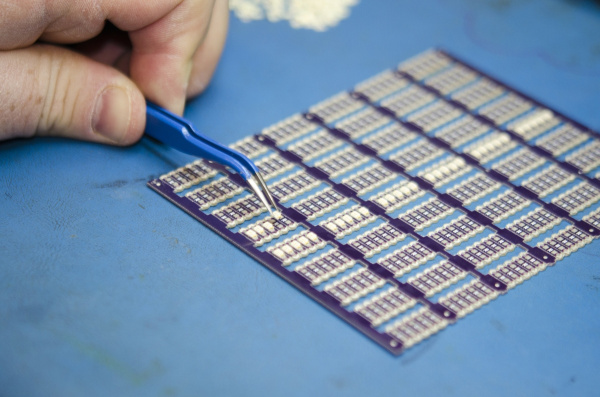

基板にペーストを塗り終えたら、その上に部品を配置していく。
これは手作業でも機械でも行える。
[ピンセット](https://www.sparkfun.com/products/10602)を使うのは、部品を配置するのによい方法である。
電子機器を作るには大きくて高価な機械が必要だという思い込みがよくあるが、それは事実ではない。
人間は部品の配置がかなり速く、液体金属の表面張力のおかげで、たいていの部品はリフローの過程で正しい位置に収まっていく。
とはいえ、人間には体力の限界がある。
数時間もすると、部品を素早く配置するのが難しくなってくる。
部品の小ささは目にも負担をかける。

**電子機器を作るのにピックアンドプレース機は必要ないが、大量の電子機器を作るにはピックアンドプレース機が必要になる。**

SparkFunは、すべての部品を手作業で配置することから始まり、今もそれは変わっていない。
とはいえ、100個以上作る必要がある場合は、ピックアンドプレース機を使って大量の基板を組み立てている。

ピックアンドプレース（PNP）機とは、真空を使ってテープから部品を持ち上げ、正しい向きに回転させてから基板に配置する、ロボット式の組み立て装置である。
組み立てのために機械をセットアップするのには数時間かかるが、いったん動き出せば非常に速い。

大きな工場では、コンベアベルトが自動ペースト塗布機から直接ピックアンドプレース機へと基板を運ぶことが多いが、SparkFunでは生産フロアの中を基板を手作業で運んでいる。

## リフロー

ピックアンドプレースのあとは、しっかりしたはんだ接合を作るためにペーストをリフローする必要がある。
基板はコンベアベルトに乗せられ、大きなオーブンの中をゆっくりと通過しながら、はんだを溶かすのに十分な熱（およそ250℃）にさらされる。
基板がオーブンの中を進むにつれて、さまざまな温度ゾーンを通過し、制御された速度で温度が上下する。

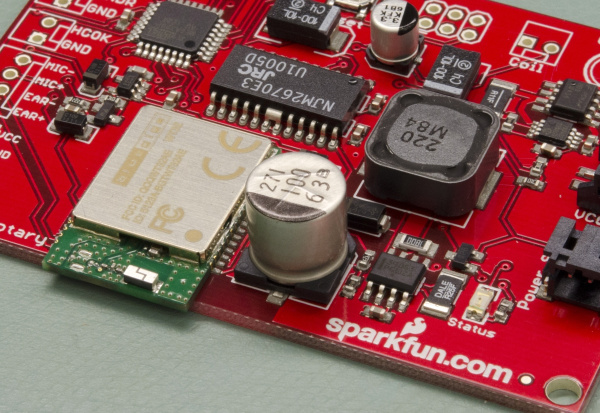

ペーストは、お皿にくっついたバターのように、ねばつく質感をしている。
基板がリフロー炉の中をゆっくり通過する間、部品はその場に固定されたままになる。

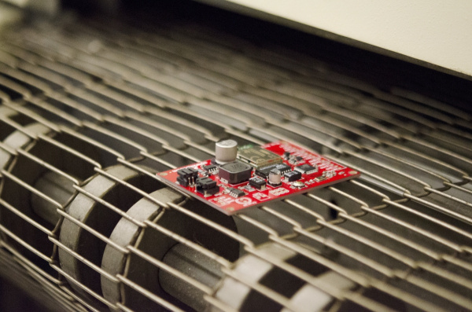

リフロー炉は、いわばピザ窯のようなものである。
基板の温度はおよそ250℃（約480°F）まで上げられ、その時点でペーストは液体状の金属に変わる。
基板がリフロー炉から出てくると急速に冷え、すべての部品がその場ではんだ付けされる。

DIYのトースターオーブンを使ったリフローの各段階の様子を見てみると分かりやすい。
最初は、さまざまなパッドの上に灰色のはんだペーストの小さな塊が見える。
このペーストはステンシルではなく手作業で塗られたものと思われるが、この程度の雑さがあとになってもさほど問題にならないことがすぐに分かるはずである。
やがて最初の節目が訪れる。ペースト内のフラックスがサラサラになり、水たまりのように広がり始める。
金属のはんだはまだ溶けていない。
そのあと、はんだが溶け始め、溶けたはんだの表面張力によって、パッドの中心にできるだけ小さな塊にまとまろうとする。

部品がリフローの過程でどれほど動かされるかも見て取れる。
一部の部品は位置がずれてしまい、あとでやり直しが必要になる。
とはいえ、この収縮して動こうとする性質のおかげで、わずかな位置ずれやはみ出したはんだは、たいてい自然と修正される。
ただし、非常に小さな部品では、片側だけが強く引っ張られると、部品が縦に立ち上がってしまうことがある。
これは「トゥームストーニング（墓石現象）」と呼ばれ、基板の機能的な不良の原因になる。

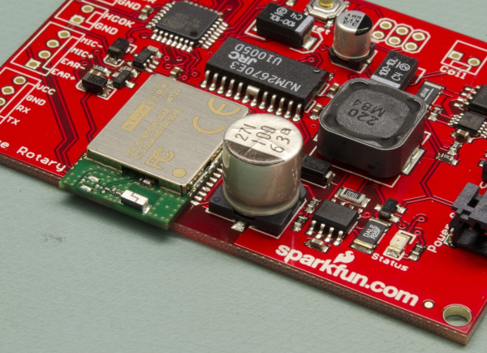

触っても冷たいこの基板には、すべてのSMD部品がPCBに完全にはんだ付けされている。
これで次の工程に進む準備が整った。

### 両面基板はどう作るのか

一部の組み立て品（たとえばArduino Fio）は、基板の両面に部品を持つ。
このような場合、まず部品数が少なく、部品も小さいほうの面にステンシリングとリフローを行う。
リフロー炉から出てきたら、反対側にもステンシリングと部品配置、リフローを行う。
金属の表面張力は非常に高く、すべてをその場に固定してくれる。
より複雑な組み立て品を扱う大規模な工場では、リフローの間に部品が動かないよう、ピックアンドプレースの段階で基板の各部を接着剤で固定することもある。

## 手作業でのはんだ付け

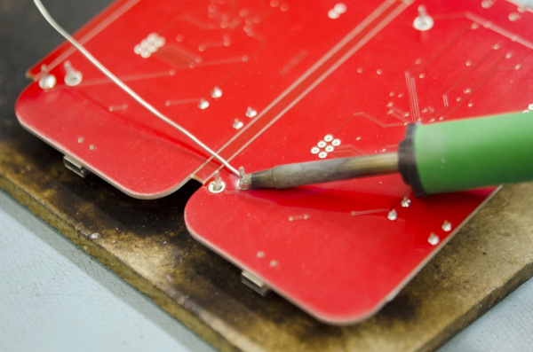

リフローのあと、技術者が基板を受け取り、PTH（めっきスルーホール）部品を手作業ではんだ付けする。
より大規模な生産施設では、スルーホール部品のはんだ付けに「波はんだ付け」と呼ばれる技法が使われることもある。
これは、溶けたはんだの定常波の上に基板を通過させ、部品のリード線や基板上の露出した金属にはんだを付着させる方法である。

SparkFunでは、設計や数量が非常に多岐にわたるため、できるだけ多くの部品をSMD（表面実装部品）に寄せ、PTH部品は手作業ではんだ付けするほうが効率的だと分かった。
生産フロアでは[Hakko FX-888D](https://www.sparkfun.com/products/11704)のはんだごてを使っている。
これは非常によく機能するが、より低価格な[Atten 937b](https://www.sparkfun.com/products/10707)も、はんだ付けを始めたばかりの人にはちょうどよい。

## 検査とテスト

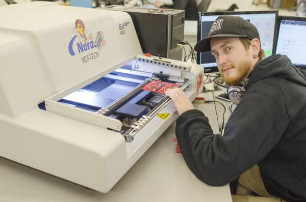

次の工程は*光学検査*である。
光学検査では、部品に関する問題（間違った抵抗値、コンデンサの欠品など）を見つけ出す。
AOI（自動光学検査）機は非常に高速で、ほぼリアルタイムに近い速度で動作する。
AOIは、異なる角度から複数の高性能カメラを使い、はんだ接続部（「フィレット」と呼ばれることもある）のさまざまな部分を確認する。
良好なはんだフィレットと不良なはんだフィレットとでは光の反射のしかたが異なるため、AOIは異なる色のLEDで照らしながら、すべての接続を高い精度と速度で検査している。

自分の基板にも光学検査が必要かというと、おそらくそうではない。
SparkFunでも、月に3万枚を超える基板を生産するようになり、すべてのエラーを見つけるのがだんだん難しくなってきてから、ようやく導入した。

たいていの基板は、自動光学検査（AOI）機に通される。
光学検査では、正しい部品が正しい位置に配置されているか、はんだフィレットが正しいか、隣接するピンの間にはんだブリッジがないかを確認する。

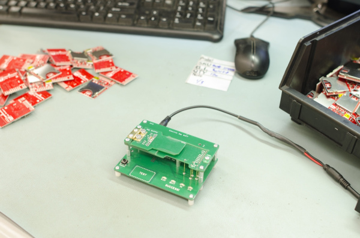

基板の検査が終わったら、次はそれが意図どおりに動作するかをテストする。

1枚の基板をテストするのに15秒かかると想像してみてほしい。
10枚テストするなら、およそ3分である。
1500枚だとしたら、6時間を超える気の遠くなるようなテスト作業になる。
私たちは、テスト手順とプログラムをできるだけ迅速にするために、多大な時間を費やしている。

この工程を速くするため、技術者たちは「ポゴベッド」と呼ばれることもあるテスト治具を使っている。
[ポゴピン](https://www.sparkfun.com/products/8870)は、バネ仕掛けの先端を使って、基板上のさまざまな電源やデータのポイントに一時的な電気的接続を作る。
基板やパネルがポゴベッドに載せられると、基板が電気的に完全に機能しているかを確認するためのさまざまなテストが行われる。
これには、レギュレータの出力電圧のテスト、特定のピンで期待される電圧の確認、テスト対象の基板にさまざまなコマンドを送って正しく応答するかを確かめる作業などが含まれる。
プログラム書き込みや校正が必要な基板では、コードを書き込んで出力を検証する追加の手順も行われる。

より大規模な施設では、電源を入れる前に基板上のすべての接続の導通をテストするために、フライングプローブやベッドオブネイルズと呼ばれる治具が使われることもある。
これらのより大がかりな治具は、より複雑で高価な製品に向いているが、製作には数万ドルかかることも珍しくない。

## 洗浄

製造工程のさまざまな段階で、基板には残留物が残る。
SparkFunのはんだ付けキットを組み立てたことがあれば、はんだ付けによって基板にわずかなフラックスが残ることを知っているはずである。
数か月が経過すると、このフラックスの残留物はべたつき、見た目も悪くなり、わずかに酸性になってはんだ接合を弱めてしまうことがある。
これを防ぐため（そしてお客様に一番きれいな基板を届けるため）、SparkFunでは生産するすべての基板を洗浄している。

基板をきれいにするため、私たちは「食器洗い機」と呼んでいる装置にまとめて基板を入れる。
この高温かつ高圧のオールステンレス製食器洗い機は、脱イオン水を使って製造工程で付着した残留物を取り除く。

この洗浄機は閉じたループのシステムを採用している。
洗浄が終わると、排水はいったん洗浄機の下にある槽に集められ、自動的に電気伝導度がテストされる。
電気伝導度が非常に低ければ（つまり抵抗が非常に高ければ）、洗浄工程は完了しており、排水は非常に高品質なフィルターを通して再利用される。

そう、私たちは高価な電子機器を丸ごと水に浸けているのである。
秘密は水の種類にある。
脱イオン水は、イオンをまったく含まない非常に純粋な水である。
携帯電話をトイレに落としても壊れないのは水そのもののせいではなく、機器のさまざまな部分をショートさせるのはイオンのほうである。
DI水（脱イオン水）にはイオンが含まれていないため、実は人体にとってはかなり有害である。
DI水を扱うこと自体は安全だが、DI水を飲んでしまうと、体内に取り込む過程で体からイオンを奪ってしまい、深刻な害を及ぼすことがある。
DI水はイオンに対する「渇き」が非常に強いため（うまいことを言ったつもりである）、食器洗い機の内部はすべてステンレス製になっている。
他の金属ではあっという間に腐食してしまうだろう。

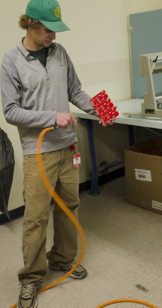

高価な洗浄機を持っていない場合はどうすればよいだろうか。
脱イオン水を入れた安価なスロークッカーと歯ブラシがあれば、十分にうまくいく。
数枚の基板だけを洗浄したいなら、イソプロピルアルコールを含ませた綿棒でもよく機能する。

扇風機や圧縮空気を使えば、残った水分をうまく取り除ける。

## パッケージング

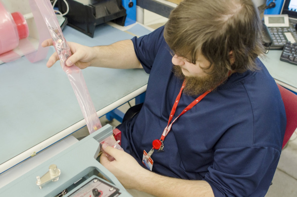

基板は、その旅の終わりに近づいている。

洗浄が終わり乾燥したバッチの基板は、パッケージング工程へと進み、それぞれの基板が個別にESD対応のプラスチックに熱圧着される。

ピッキングや注文の梱包作業をできるだけ速く行えるようにするため、すべての製品が出荷部門にとって「すぐ取り出せる」状態になるようにしている。
たいていの製品では、両端にバーコードラベルを付けた10個1組の連なりを作る。
このバーコードラベルには、製品名、SKU、そして問題が起きたときに追跡できるようにするためのバッチ識別子が含まれている。

製品の梱包が完全に終わると、出荷フロアへと送られる。
出荷される在庫を記録し、「仕掛品」の数量をすべて差し引き、新しい数量を店頭の在庫に加える。
そこから製品は、あなたの手元へと届くまったく新しい旅を始めることになる。
そのチュートリアルはまた別の機会に譲ろう。

## まとめ

SparkFunでの電子機器の作り方を紹介した。
ここまで読んでくれたなら、次のようなチュートリアルもおすすめである。

- [Stenciling Curriculum（ステンシリングのカリキュラム）](https://learn.sparkfun.com/resources/48)
- [コネクタの基礎](./connector-basics.md)
- [テスターの使い方](./how-to-use-a-multimeter.md)
- [導電糸で縫う](./lilypad-basics-e-sewing.md)

タグ: 記事、はんだ付け、道具

---

出典：[Electronics Assembly](https://learn.sparkfun.com/tutorials/electronics-assembly)（SparkFun Learn）を日本語に翻訳し、再構成した。
原文は [CC BY-SA 4.0](https://creativecommons.org/licenses/by-sa/4.0/) ライセンスで公開されており、本ページも同ライセンスの下で提供する。
