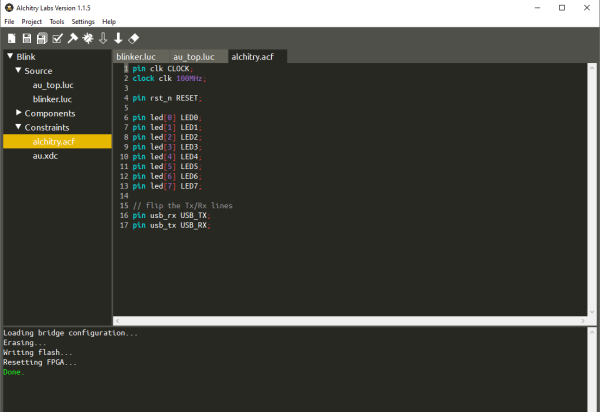
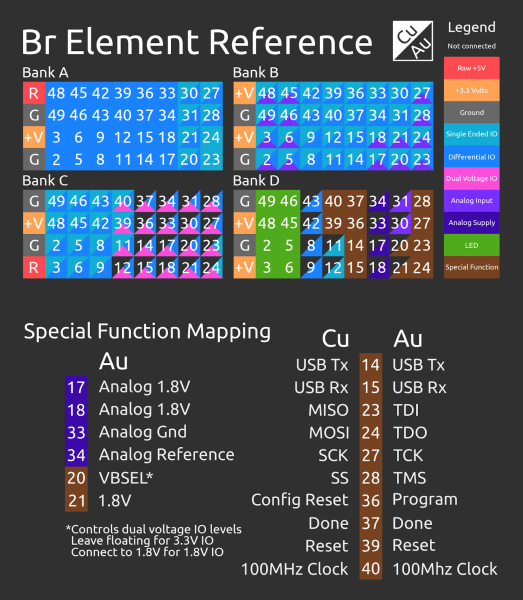
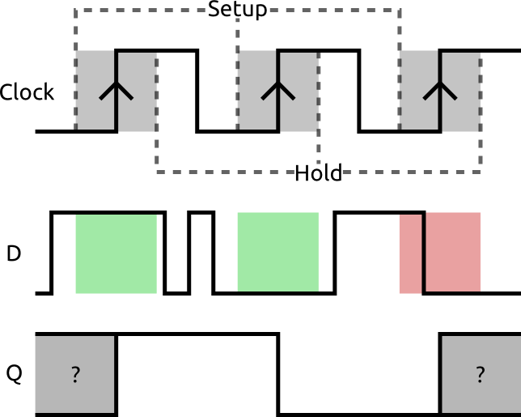

# 外部IOとメタ安定性

## はじめに

Alchitryの最初の数本のチュートリアルをすでに読んでいれば、トップレベルモジュールの入出力が、基板上のどこに接続されるのかをどうやって知るのか、疑問に思ったかもしれない。
LEDという名前のどこに、[FPGA](https://www.sparkfun.com/fpga)のどのピンを使うべきかという情報が含まれているのだろうか。
もう疑問に思う必要はない。このチュートリアルでは、制約ファイルの基本を説明し、設計の中で外部信号を使うことに潜む危険についても掘り下げていく。

### 必要な部品

このチュートリアルは主に概念的な内容だが、実際に手を動かしたい場合は、AlchitryのFPGA開発ボード（Alchitry CuまたはAlchitry Au／Au+）が必要になる。

参考になるチュートリアル:

以下の概念に馴染みがなければ、続きを読む前にこれらのチュートリアルを確認しておくことをおすすめする。

- [FPGAをプログラムする](./programming-an-fpga.md)
- [FPGAはどうやって動いているのか](./how-does-an-fpga-work.md)
- [最初のFPGAプロジェクト：PWMを使いこなす](./first-fpga-project---getting-fancy-with-pwm.md)

> [!NOTE]
> 注意：Alchitryの基板を扱ったことがない場合は、このチュートリアルを続ける前に、[Alchitryの公式サイト](https://alchitry.com/tutorials/)でセットアップを済ませておく必要がある。

## 制約ファイル

制約ファイルは、FPGA固有の特定の設計制約を指定するために使う。
制約ファイルの扱い方には現時点で標準規格がなく、FPGAメーカーごとに異なる機能を提供したいという事情がある。

### ピンの割り当て

制約ファイルのもっとも一般的な用途は、トップレベルの入力や出力を物理的なピンに割り当てることであり、これを簡単に行えるよう、Alchitry Labsは*Alchitry Constraint File*（*ACF*）という形式をサポートしている。
これらは非常にシンプルな構文で、AuでもCuでも同じように使える。

どちらの基板でも新しいプロジェクトを作ると、プロジェクトナビゲータの*Constraints*という見出しの下に、*alchitry.acf*というファイルが見つかる。
このファイルには、基板の基本的なピン配置の定義が含まれている。
これは、Alchitry PWMチュートリアルで作成したプロジェクトのAlchitry Constraint Fileである。



*PWM Blinkerプロジェクトのacfファイル*

このファイルの中身を詳しく見ると、次のような内容（あるいはそれによく似た内容）が確認できる。

```
pin clk CLOCK;
clock clk 100MHz;

pin rst_n RESET;

pin led[0] LED0;
pin led[1] LED1;
pin led[2] LED2;
pin led[3] LED3;
pin led[4] LED4;
pin led[5] LED5;
pin led[6] LED6;
pin led[7] LED7;

// Tx/Rxのラインを入れ替える
pin usb_rx USB_TX;
pin usb_tx USB_RX;
```

ピンの割り当てを定義する構文は`pin signal PIN;`であり、*signal*はトップレベルモジュールにおける入力または出力の名前、*PIN*は接続する物理ピンを指す。
ピン名の後、セミコロンの前に任意で*pullup*または*pulldown*というキーワードを付け加えることもでき、オンチップのプルアップ抵抗またはプルダウン抵抗を有効にするかどうかを指定できる。これらは入力に対してのみ有効である。
なお、Cuはプルダウンをサポートしておらず、このキーワードは無視される点にも注意してほしい。

Alchitry Labsは、**RESET**や**LED0**のような、基板上の信号を表す特別なピン名をいくつか定義している。
これらは、AuとCuで異なる物理ピンに対応しているにもかかわらず、ツール側が使うべきピンを把握してくれるため便利である。

外部に引き出されているすべてのIOピンにも、バンクの文字とピン番号を組み合わせた形式の、わかりやすい名前が付けられている。

Br Elementのピン配置は、次のようになっている。



*Br Elementのピン配置。PDFは[こちら](https://cdn.alchitry.com/docs/Br%20Element%20Reference.pdf)からダウンロードできる。*

USBポートを左側にして基板を見たとき、バンクAは左上のコネクタ、バンクDは右下のコネクタにあたる。基本的に、リファレンスシートと同じレイアウトになっている。

たとえば、バンクAのピン2を使いたい場合、ピン名には*A2*を使う。
この名前は、AuでもCuでも同じである。
これらの名前は、ツールによってFPGAチップの物理ピンへとマッピングされる。

各四角形の左上部分はCuのピンの機能、右下部分はAuのピンの機能に対応している。
1つのピンに複数の用途がある場合、これらの半分がさらに分割されて表示されることもある。

たとえば、ピンA20はAuでは差動信号として使えるが、Cuではシングルエンド信号としてしか使えない。
ピンB2は、Auではアナログ入力または差動信号として使えるが、Cuではシングルエンド信号としてしか使えない。

なお、差動IOはすべて、シングルエンドIOとしても使うことができる。

バンクAとBは、AuでもCuでもすべてのピンが実装されているが、バンクCはCuでは一部のピンしか実装されておらず、バンクDはほとんどが特殊信号用になっている。

リファレンスシートの後半は、バンクDの信号マッピングを示している。
たとえば、D14はAuとCuの両方でUSB Tx信号にあたる。

アナログ信号とデュアル電圧セレクト信号はすべてAuにのみ存在し、Cuでは何にも接続されていない（四角形の左上が黒く表示されていることで示されている）。

### クロックの定義

設計の中にクロック入力がある場合、そのクロックがどれだけの速さで動作するかをツールに伝える必要がある。
これも*Alchitry Constraint File*の中で、`clock signal frequency;`という構文で指定できる。

基板に内蔵されたクロックについては、`clock clk 100MHz;`という記述で100MHzであることを指定している。

これは、設計がどれだけの速さで動作する必要があるかをツールに伝えるために重要である。
これがなければ、ツールは設計を配置する際にどのようなタイミング要件を満たせばよいのか把握できない。

### その他の制約ファイル形式

さらに高度な制約を指定したい場合は、Au向けにはXilinx固有、Cu向けにはLattice固有の制約ファイルをプロジェクトに追加することもできる。

Auのプロジェクトを作ると、実際には*au.xdc*という*Xilinx Design Constraint*ファイルがすでにプロジェクトに含まれている。
このファイルには、使用する電圧に関する情報や、FPGAの設定を保持するフラッシュメモリに関する情報が記載されている。

本格的に踏み込んで理解したい場合は、[Xilinxのドキュメント](https://www.xilinx.com/support/documentation/sw_manuals/xilinx2014_1/ug903-vivado-using-constraints.pdf)を参照するか、次のリンクからダウンロードできる。

[Vivado Design Suite User Guide - Using Constraints](https://www.xilinx.com/support/documentation/sw_manuals/xilinx2014_1/ug903-vivado-using-constraints.pdf)

通常、本当に高度なことをしない限り、これらを直接いじる必要はない。

Latticeの制約は、PCFファイルとSDCファイルに分かれている。
PCFはphysical constraint file（物理制約ファイル）の略でピン配置の定義に使い、SDCはclock design constraint（クロック設計制約）の略でクロック周波数の定義に使う。

詳しくは、[iCEcube2 User Guide](http://www.latticesemi.com/-/media/LatticeSemi/Documents/UserManuals/EI/iCEcube2UserGuide.ashx?document_id=44569)、特に5章と6章を参照してほしい。

> [!NOTE]
> 注意：Lattice Semiconductors社の[iCEcube2](https://alchitry.com/tutorials/setup/icecube2/)は、現在は無料のツールセットではなくなっている。代わりに、[Alchitry Labs 2](https://alchitry.com/alchitry-labs/)にバンドルされているオープンソースのツールセット[Yosys](https://github.com/YosysHQ)を使うことをおすすめする。

繰り返しになるが、Alchitryの制約ファイルを使っている限り、これらを自分で書く必要はないはずである。

## メタ安定性

これで設計のピン配置を定義する方法がわかったので、次は外部信号を使うことに潜む危険について見ていこう。

設計の大部分では、信号はFPGAの内部で始まり、内部で終わる。
このような場合、ツールはタイミングを正確に管理し、すべてが期待どおりに動作することを保証してくれる。
しかし外部信号は制御できないため、特別な配慮をしないと、設計全体が予期しない振る舞いをすることがある。

これは、**メタ安定性（metastability）**と呼ばれる現象によって起こる。

メタ安定性とは、きちんとした0と1で動作しているはずのデジタルシステムが、その中間のどこかで止まってしまったり、値の間を発振してしまったりする状態のことである。

これは、DFF（[Programming an FPGA](https://learn.sparkfun.com/tutorials/programming-an-fpga#sequential-logic-and-dffs)チュートリアルで扱った）が前提としている特定の条件に違反したときに起こりうる。

その主な前提は、DFFのD入力が、クロックの立ち上がりエッジの前後、一定時間にわたって安定しているというものである。
立ち上がりエッジの前に必要な時間を*セットアップ時間*、後に必要な時間を*ホールド時間*と呼ぶ。

このウィンドウの間にD入力が変化すると、DFFはその値を正しく取り込めず、不安定な状態になることがある。

これを図示すると、次のようになる。



クロックの最初の2つのエッジの周辺ではDの遷移が起きていないため、Dの値は正しく保存され、Qに出力される。
しかし最後のエッジでは、立ち上がりエッジの近くで遷移が起きているため、出力が予測できなくなっている。

この問題への一番簡単な解決策は、単純にセットアップ時間とホールド時間のウィンドウを守ることである。
これは、SPIのようなクロック同期のバスを使う場合には実現できる。
しかし、クロックに同期していない信号では、いつ信号が変化するかを予測したり制御したりすることはできない。

ユーザーにボタンを押してもらう際、1秒間に1億回訪れるごく小さなウィンドウを避けてもらおうとするようなものだと想像してみてほしい。それは不可能である。

この問題への回避策は、2個以上のDFFを鎖状につなぐことである。


これによって、2段目のDFFの出力が不安定になる可能性は大幅に減る。
ただし、入力にわずかな遅延が加わることにはなる。
重要なのは、これによってメタ安定性の問題そのものが解決するわけではないという点である。あくまで、問題が実際に発生する確率を劇的に減らしているにすぎない。
チェーンにさらにDFFを追加すれば発生確率はさらに下がるが、その効果はすぐに小さくなっていくため、たいてい2段あれば十分である。

コンポーネントライブラリには、入力を同期させるために使えるpipelineというコンポーネントがある。
Miscellaneousのカテゴリの中にある。
これは、入力をパラメータで指定した段数のDFFに通してから出力するだけのものである。

```lucid
module pipeline #(
    DEPTH = 1 : DEPTH > 0 // ステージ数
  )(
    input clk,  // クロック
    input in,   // 入力
    output out  // 出力
  ) {

  dff pipe[DEPTH] (.clk(clk));
  var i;

  always {
    // inはパイプの先頭に入る
    pipe.d[0] = in;

    // outはパイプの末尾
    out = pipe.q[pipe.WIDTH-1];

    // それぞれの中間ステージについて
    for (i = 1; i < DEPTH; i++)
      pipe.d[i] = pipe.q[i-1]; // 前段の値をコピーする
  }
}
```

これまでのチュートリアルで、リセット信号を整える（当然そうだろう）ために*reset_conditioner*というコンポーネントが使われていたことに気づいたかもしれない。

このコンポーネントは、2つのことを担っている。
1つ目は、リセットボタンの信号をクロックに同期させること。
2つ目は、リセット信号が最低限の時間ハイの状態を保つようにすることである。
この2つの条件は、信号がクリーンであることと、FPGA全体が同じタイミングでリセットから抜け出すことを保証するために重要である。

```lucid
module reset_conditioner #(
    STAGES = 4 : STAGES > 1 // ステージ数
  )(
    input clk,  // クロック
    input in,   // 非同期リセット
    output out  // 同期済みリセット
  ) {

  dff stage[STAGES] (.clk(clk), .rst(in), #INIT(STAGESx{1}));

  always {
    stage.d = c{stage.q[STAGES-2:0],0};
    out = stage.q[STAGES-1];
  }
}
```

この仕組みはなかなか巧妙である。
4個のDFFを鎖状に接続し、最初のDFFのD入力には常に0を与えておく。
生のリセット信号を使って、これら4個のDFFを1にリセットする。
リセットによって強制的に1にされていない間は、最初の4クロックサイクルの間は1を出力し、その後は出力をローに落として、設計の残りの部分が通常どおり動作できるようにする。
つまり、リセット信号は少なくとも4クロックサイクルの長さを持ち、クロックに同期した形で終わることになる。

この設計は、Xilinxのホワイトペーパー[Get Smart About Reset: Think Local, Not Global](https://www.xilinx.com/support/documentation/white_papers/wp272.pdf)によるものである。
これは一読の価値がある資料で、リセットの設計について論じているだけでなく、リセットを使うことの*コスト*についても触れている。
基本的に、あるDFFをリセットする必要がないなら、そのDFFにリセット信号を接続すべきではない。
余計な配線リソースを消費し、設計を複雑にするだけである。
設計がリセットされたとき、ほとんどすぐに既知の値が代入されるため、値そのものが問題にならないDFFも多い。

### 複数のクロック

メタ安定性の問題に遭遇するもう一つの場面は、クロックドメインをまたぐときである。
これは、設計の中に周波数の異なる複数のクロックがある場合に起こる。
33MHzで駆動されているDFFの出力を、100MHzで駆動されているDFFへ単純に接続することはできない。
タイミング条件に違反する瞬間が必ず生じ、悪い結果を招く。

クロックドメインをまたぐには、いくつかの方法がある。
1つ目は、先ほどと同じようにチェーンを使う方法である。
これはもっとも簡単な方法だが、複数ビットの信号や急速に変化する信号には向いていない。
単一ビットのフラグに使うのがもっとも適している。

より堅牢だが複雑な解決策は、非同期FIFOを使う方法である。
これは、独立したクロックで動作する読み出しポートと書き込みポートを持つFIFOである。
あるクロックドメインからFIFOに値を書き込み、別のクロックドメインからそれを読み出すことができる。

これはコンポーネントライブラリの*Memory/Asynchronous FIFO*にある。

これらはクロックドメイン間でデータをやり取りするのに非常に有効だが、オーバーフローしないよう、書き込みと同じくらいの速さでデータを読み出す必要がある。

可能であれば、もっとも良い方法は複数のクロックを使わないことである。
設計の一部を意図的に遅く動作させたい場合、たいていはカウンタを使って何かを行うタイミングを刻めばよいだけである。
これなら、タイミング要件の管理はすべてツールに任せたままにできる。

とはいえ、これが常に可能とは限らず、クロックドメインをまたぐ必要がある場合は、多少の追加の配慮が必要になる。

## まとめ

[Alchitryのウェブサイト](https://alchitry.com/)には、チュートリアルやプロジェクト、Alchitryフォーラムなど、さらに役立つ資料がそろっている。

- [Alchitry](https://alchitry.com/)
  - [チュートリアル](https://alchitry.com/tutorials/)
  - [フォーラム](https://forum.alchitry.com/)
- [Alchitry Au+ 回路図（PDF）](https://cdn.sparkfun.com/assets/a/2/2/0/a/alchitry_au_sch_update-2.pdf)
- [Alchitry Au 回路図（PDF）](https://cdn.sparkfun.com/assets/a/2/2/0/a/alchitry_au_sch_update-2.pdf)
- [Alchitry Cu 回路図（PDF）](https://cdn.sparkfun.com/assets/d/5/d/b/a/alchitry_cu_sch_update-2.pdf)
- [Xilinx Artix 7 User Guide](https://www.xilinx.com/support/documentation/user_guides/ug474_7Series_CLB.pdf)

ユーザーガイドとホワイトペーパー:

- [Vivado Design Suite User Guide - Using Constraints](https://www.xilinx.com/support/documentation/sw_manuals/xilinx2014_1/ug903-vivado-using-constraints.pdf)
- [iCEcube2 User Guide](http://www.latticesemi.com/-/media/LatticeSemi/Documents/UserManuals/EI/iCEcube2UserGuide.ashx?document_id=44569)
- [Get Smart About Reset: Think Local, Not Global](https://www.xilinx.com/support/documentation/white_papers/wp272.pdf)

FPGAとLucidの世界にさらに深く踏み込みたい場合は、Justin Rajewski氏による["Learning FPGAs: Digital Design for Beginners with Mojo and Lucid HDL"](https://www.amazon.com/dp/1491965495/ref=cm_sw_em_r_mt_dp_U_GZ75EbYT1Q4M2)もおすすめである。

FPGA関連のチュートリアルや製品は今後も充実させていく予定である。次のようなチュートリアルもぜひ確認してほしい（いずれも英語）。

- [FPGAをプログラムする](./programming-an-fpga.md)：フィールドプログラマブルゲートアレイを扱う基礎を紹介する。
- [How Does an FPGA Work?](https://learn.sparkfun.com/tutorials/how-does-an-fpga-work)：FPGAとは何か、どう動作するのか、なぜ、そしていつ使うのか。
- [最初のFPGAプロジェクト：PWMを使いこなす](./first-fpga-project---getting-fancy-with-pwm.md)：AlchitryのオンボードFPGAを使ってPWMを操作する最初のプロジェクト。

タグ: Alchitry、概念、FPGA

---

出典：[External IO and Metastability](https://learn.sparkfun.com/tutorials/external-io-and-metastability)（SparkFun Learn）を日本語に翻訳し、再構成した。
原文は [CC BY-SA 4.0](https://creativecommons.org/licenses/by-sa/4.0/) ライセンスで公開されており、本ページも同ライセンスの下で提供する。
