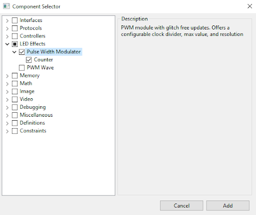
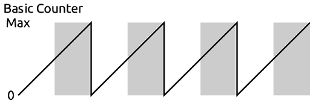

# 最初のFPGAプロジェクト：PWMを使いこなす

## はじめに

[Alchitry Au+](https://www.sparkfun.com/products/17514)、[Alchitry Au](https://www.sparkfun.com/products/16527)、[Alchitry Cu](https://www.sparkfun.com/products/16526)のいずれかの基板を初めて購入すると、デフォルトの[FPGA](https://www.sparkfun.com/fpga)構成によって、LEDに洒落た波のようなエフェクトが表示される。
このチュートリアルでは、これと似たようなものを作るための手順を、一つずつたどっていく。
設計へどう取り組むか、そしてハードウェアを扱ううえで考慮すべきさまざまな点について、素晴らしい概観になるはずである。

さっそく、これがどう動作しているのか見ていこう。

Alchitry LabsですでにLucidを使ってAlchitry AuまたはCuで作業するためのツールをセットアップ済みであることを前提として進める。
また、基礎を押さえるため、前回のチュートリアル[FPGAをプログラムする](./programming-an-fpga.md)にも目を通しておいてほしい。

### 必要な部品

このチュートリアルの内容を試すには、AlchitryのFPGA開発ボード（Alchitry CuまたはAlchitry Au／Au+）が必要になる。手元にあるものによっては、すべてが必要になるとは限らない。

参考になるチュートリアル:

以下の概念に馴染みがなければ、続きを読む前にこれらのチュートリアルを確認しておくことをおすすめする。

- [FPGAをプログラムする](./programming-an-fpga.md)
- [FPGAはどうやって動いているのか](./how-does-an-fpga-work.md)

## パルス幅変調

FPGA固有の話に入る前に、パルス幅変調（PWM）とは何かを手早く確認しておく必要がある。

PWMは、デジタルシステムがアナログ値を近似するために使う手法である。
特定のデューティ比を持つパルスの列を作ることで、これを実現する。
デューティ比とは、単純に信号がハイである時間の割合のことである。
デューティ比100%は、完全にオンの信号にあたる。デューティ比50%は、ハイとローがちょうど半々になる。

以下は、デューティ比33%のPWM信号の例である。


これらのパルスの周波数が十分に高ければ、用途によっては、ハイとローの中間の値を出力しているかのように見えることがある。
これは、LEDの明るさを変化させるのに便利である。

LEDは実際には非常に高速にオン・オフを切り替えられるため、PWM信号を与えるとちらついて見える。
幸い、十分な速さでちらつかせれば、人間の目はそれを平均化し、暗いながらも点灯し続けているように見える。
この効果は残像現象（persistence of vision）と呼ばれる。

### パルスを作る

入力値を受け取り、その値に比例したデューティ比を持つPWM信号を生成するモジュールを作る必要がある。

これは、カウンタを使えば比較的簡単に実現できる。

自由に動作し続けるカウンタ、つまり常にインクリメントし続けるカウンタがあれば、そのカウンタの状態に応じて出力を設定するのに使うことができる。

カウンタと比較しているしきい値がカウンタの現在の値より大きければ1を、そうでなければ0を出力すればよい。図にすると、次のようになる。


ここでは、比較値がカウンタの最大値の1/3になっているため、デューティ比は33%である。

比較値を変えれば、デューティ比も変わる。


比較値を増やしたことで、デューティ比が66%になった。

これを実現する単純なモジュールを作ることができる。

```lucid
module pwm #(
    COMP_LENGTH = 8 : COMP_LENGTH > 0
  )(
    input clk,  // クロック
    input rst,  // リセット
    input compare[COMP_LENGTH],
    output pwm
  ) {

  .clk(clk) {
    .rst(rst) {
      dff counter[COMP_LENGTH];
    }
  }

  always {
    counter.d = counter.q + 1; // 自由に動作し続けるカウンタ
    pwm = counter.q < compare;
  }
}
```

このモジュールを使ってLEDの明るさを制御することもでき、それなりにうまく動作するはずである。
とはいえ、いくつか問題がある。

### グリッチ

まず、このモジュールはグリッチフリーではない。
LEDの場合、これは問題にならない。
しかし、サーボのように各パルスの幅そのものが重要になる用途では、これは重要な問題になる。

グリッチフリーとはどういう意味だろうか。
現在のカウンタの値が25で、現在の比較値が10だとしよう。
カウンタが比較値より大きいため、出力は現在ローになっている。
では、ここで比較値を30に変更したらどうなるだろうか。5サイクル分の長さのパルスが出力されてしまう。

しかし、5サイクル分のパルスなど、一度も要求していない。要求していたのは、10サイクルのパルス、そして30サイクルのパルスだけである。

これを修正するには、カウンタが最大値に達したときにだけ比較値を更新するようにする必要がある。
それまでは、現在の比較値をDFFに保存しておく必要がある。

```lucid
 module pwm #(
    COMP_LENGTH = 8 : COMP_LENGTH > 0
  )(
    input clk,  // クロック
    input rst,  // リセット
    input compare[COMP_LENGTH],
    output pwm
  ) {

  .clk(clk) {
    .rst(rst) {
      dff counter[COMP_LENGTH];
      dff last_comp[COMP_LENGTH];
    }
  }

  always {
    counter.d = counter.q + 1; // 自由に動作し続けるカウンタ
    pwm = counter.q < last_comp.q;
    if (&counter.q)
      last_comp.d = compare;
  }
}
```

見てのとおり、今度は生の入力である比較値ではなく、*last_comp.q*とカウンタを比較している。
*last_comp*の値は、*counter.q*がすべて1、つまり最大値になったときにだけ、入力の比較値で更新される。

*counter.q*が最大値かどうかを確認するために、リダクション演算子と呼ばれるものを使っている。
ここではAND演算のリダクション演算子を使っている。
値の前に`&`を付けると、その値のすべてのビットが互いにANDされる。
これは、すべてのビットが1のときにだけ1を返す。

同様に、パイプ記号`|`を使えばOR演算にもできる。これは、いずれかのビットが1であれば1を返す。

XOR版はキャレット`^`を使い、1の数が奇数個であれば1を返す。

`==`による比較の代わりにリダクション演算子を使うのが便利なのは、このような場合、`counter.q`の幅がパラメータとして指定されているためである。
その最大値は幅によって変わるが、最大値は常に「すべてのビットが1」のときになる。

これで、*compare*をいつどんな値に変更しても、このモジュールは要求どおりの幅のパルスしか出力しなくなる。

### プリスケーラ

次の問題は、パルスの周波数を調整できないという点に関わる。
周波数は単純に、クロックの速さとカウンタの幅によって決まってしまう。

これはLEDにとって実際に問題になる。オン・オフを切り替えるたびに、配線上の寄生容量を充放電するのにわずかな電力が無駄になるからである。
周波数が高すぎると、この寄生損失が支配的になり、LEDの明るさが落ちてしまう。
パルスの周波数は、目に見えない程度に十分速くしつつ、必要以上に速くしすぎないようにしたい。
200Hz程度がちょうどよい。

8ビットのカウンタでは、現在の動作周波数は100MHz/256 = 390.6kHzであり、目標よりおよそ2000倍も速い。

これを調整するには、プリスケーラを追加すればよい。
これは、一定の周期数ごとにメインのカウンタをインクリメントさせるための、2つ目のカウンタである。

もっとも単純で効率的な方法は、メインのカウンタに余分なビットをいくつか追加し、その最上位ビットだけを見るようにすることである。
末尾に1ビット追加するだけで、実質的にレートが2分の1になる。2ビットなら4分の1、というように2のべき乗で下がっていく。

```lucid
module pwm #(
    PRESCALER = 11 : PRESCALER >= 0,
    COMP_LENGTH = 8 : COMP_LENGTH > 0
  )(
    input clk,  // クロック
    input rst,  // リセット
    input compare[COMP_LENGTH],
    output pwm
  ) {

  .clk(clk) {
    .rst(rst) {
      dff counter[COMP_LENGTH+PRESCALER];
      dff last_comp[COMP_LENGTH];
    }
  }

  always {
    counter.d = counter.q + 1; // 自由に動作し続けるカウンタ
    pwm = counter.q[PRESCALER+:COMP_LENGTH] < last_comp.q;
    if (&counter.q)
      last_comp.d = compare;
  }
}
```

プリスケーラとして使うビット数を表す*PRESCALER*というパラメータを追加した。
これは*COMP_LENGTH*に加算され、カウンタの幅になる。

比較の部分では、start-width形式のビットインデックス構文を使い、*PRESCALER*から上に向かって*COMP_LENGTH*ビットを選択している。
*PRESCALER*が0、*COMP_LENGTH*が8であれば、これは`[0+:8]`となり、ビット0〜7が選択される。
*PRESCALER*が11であれば、`[11+:8]`となり、ビット11〜18が選択される。

### トップ値

プリスケーラを追加することで、周波数を大まかに調整する手段が手に入り、LEDの制御には十分である。
しかし、用途によってはより具体的な周波数が必要になることもある。
そのためには、カスタムのトップ値を設定できるようにする必要がある。

トップ値とは、単純に、カウンタがリセットされる値のことである。
これまでの例では、この値はカウンタが保持できる最大値であり、自動的にリセットされていた。

if文を追加してカウンタの値を確認し、手動でリセットすることで、周波数を上げることができる。

```lucid
module pwm #(
    PRESCALER = 11 : PRESCALER >= 0,
    COMP_LENGTH = 8 : COMP_LENGTH > 0,
    TOP = $pow(2,COMP_LENGTH)-1 : TOP >= 0 && TOP < $pow(2,COMP_LENGTH)
  )(
    input clk,  // クロック
    input rst,  // リセット
    input compare[COMP_LENGTH],
    output pwm
  ) {

  .clk(clk) {
    .rst(rst) {
      dff counter[COMP_LENGTH+PRESCALER];
      dff last_comp[COMP_LENGTH];
    }
  }

  always {
    counter.d = counter.q + 1; // 自由に動作し続けるカウンタ
    if (counter.q == TOP) {    // TOPに達したら
      counter.d = 0;           // カウンタをリセットする
      last_comp.d = compare;   // そして比較値を保存する
    }

    pwm = counter.q[PRESCALER+:COMP_LENGTH] < last_comp.q;
  }
}
```

このバージョンでは、*TOP*というパラメータを追加し、そのデフォルト値を最大値に設定した。

2^COMP_LENGTHの値を計算するために、*$pow()*関数を使った。
前回のチュートリアルで使った*$clog2()*と同様、この関数は論理合成の際に計算され、実際の設計には含まれない。
そのため、既知の定数値に対してしか使うことができない。

また、*last_comp*の更新タイミングも、「すべて1」のときではなく、カウンタが*TOP*に達したときに変更した。

これで、本格的なPWMモジュールが完成したが、実のところ、これをわざわざ自分で書く必要はなかった。

### コンポーネントライブラリ

Alchitry Labsには、PWMのようなよくある処理を行うための、プロジェクトに追加できる組み込みコンポーネントが数多く用意されている。

> [!NOTE]
> 注意：Alchitryの基板を扱ったことがない場合は、このチュートリアルを続ける前に、[Alchitryの公式サイト](https://alchitry.com/tutorials/)でセットアップを済ませておく必要がある。

**Project→Add Components**を選び、コンポーネントライブラリを開く。

ここから、LED EffectsのカテゴリでPWMを選択できる。



**Add**をクリックして、プロジェクトにこのコンポーネントを追加する。

プロジェクトツリーのComponentsの下に見つかるはずである。

```lucid
module pwm #(
    WIDTH = 8 : WIDTH > 0, // PWMカウンタの分解能
    TOP = 0   : TOP >= 0,  // カウンタの最大値
    DIV = 0   : DIV >= 0   // クロックのプリスケーラ
  )(
    input clk,          // クロック
    input rst,          // リセット
    input value[WIDTH], // デューティ比の値
    input update,       // 新しい値であることを示すフラグ
    output pulse        // PWM出力
  ){

  .clk(clk) {
    .rst(rst) {
      counter ctr(#SIZE(WIDTH), #DIV(DIV), #TOP(TOP));
      dff curValue[WIDTH];
      dff needUpdate;
    }
    // nextValueにはリセットは不要
    dff nextValue[WIDTH];
  }

  always {
    // ctr.valueが0で、更新が必要な場合
    if (!|ctr.value && needUpdate.q) {
      curValue.d = nextValue.q; // 新しい値を設定する
      needUpdate.d = 0;         // これで更新は不要になる
    }

    // valueが有効な場合
    if (update) {
      nextValue.d = value; // 保存しておく
      needUpdate.d = 1;    // 更新が必要というフラグを立てる
    }

    // カウンタが設定された値未満なら1を、
    // そうでなければ0を出力する
    pulse = ctr.value < curValue.q;
  }
}
```

このバージョンは、一点を除いて、これまで作ってきたものと非常によく似ている。
比較値として使われる入力valueは、updateが1のときにのみ有効であることを前提としている。

これによって、いつでも新しい値を指定できるようになり、その値は、実際に比較値として使えるようになるまで保存される。

このコンポーネントは実際には別のコンポーネント、つまりカウンタを利用しているという点でも、いくつか違いがある。
このcounterコンポーネントが、プリスケーリングとトップ値でのリセットを代わりに処理してくれている。

## LEDをパルス点灯させる

コンポーネントライブラリのPWMモジュールを手に入れたので、LEDをパルス状に点灯させる新しいモジュールを作ることができる。

LEDをパルス点灯させるには、PWMモジュールに与える値を、最小値と最大値の間でゆっくりと振動させる必要がある。
話を単純にするため、三角波を使うことにする。サイン波のような凝った波形を使うこともできるが、はるかに複雑になってしまう。

三角波というのは、最大値まで直線的に増加し、その後最小値まで直線的に減少する、という繰り返しのカウンタ値を生成することを意味する。

では、どうすれば効率よく三角波を作れるだろうか。
自由に動作し続けるカウンタは、鋸歯状波、つまり最大値まで直線的に増加し、そこから一気に最小値へ飛ぶ波形を生成する。



このカウンタを少し手を加えるだけで、目的の波形を作るのに利用できる。
まず、上の画像でグレーに塗られた領域に注目してほしい。これは、カウンタのMSBが1になっている部分である。

カウンタからMSBを取り除くと、次のような波形になる。


周波数が2倍になり、最大値が半分になっていることに注目してほしい。

しかし、この塗られた領域を反転させることができれば、目的の三角波が得られる。


これで理想的な形にはなったが、カウンタの値をどうやって反転させればよいだろうか。
一つの方法は、単純にカウンタの値を最大値/2から差し引くことである。
しかし、これには非常に効率の良い、2進数ならではの近道がある。

値を差し引く代わりに、カウンタのビットを単純に反転させるだけで、同じ結果が得られる。
たとえば0〜7を数えているとき、最初の3つの数は000、001、010である。
ビットを反転させると、これらは111、110、101、つまり7、6、5になる。
各ビットを反転させるだけで、カウントアップからカウントダウンへと変えることができる。

これをモジュールとしてまとめると、次のようになる。

```lucid
module pulse (
    input clk,  // クロック
    input rst,  // リセット
    output led  // LEDへの出力
  ) {

  .clk(clk) {
    .rst(rst) {
      pwm pwm(#WIDTH(8), #DIV(11));  // PWMコンポーネント
      dff ctr[27];                   // カウンタ
    }
  }

  always {
    led = pwm.pulse;    // PWMの出力をLEDに接続する

    ctr.d = ctr.q + 1;  // カウンタをインクリメントする

    pwm.update = 1;     // 常に更新する

    // 三角波をPWMモジュールに接続する
    pwm.value = ctr.q[ctr.WIDTH-2-:pwm.value.WIDTH] ^ pwm.value.WIDTHx{ctr.q[ctr.WIDTH-1]};
  }
}
```

反転を行っている行には新しい構文が使われているので、詳しく見ていこう。

まず、PWMの値として使うカウンタのビットを選ぶ必要がある。
これはカウンタの上位8ビットだが、値を反転させるかどうかの判定に使っている最初の1ビットは除く。

Lucidのすべての信号には、*WIDTH*という定数が関連付けられている。
これを使えば、その信号が何ビットで構成されているかを取得できる。
つまり、この場合`ctr.WIDTH`は27である。
`ctr.WIDTH-2`を使えば、2番目のMSBを取得できる。

そして`pwm.value.WIDTH`を使えば、pwmのvalue入力の幅を取得できる。
down-to構文を使い、`ctr.WIDTH-2`から下に向かって`pwm.value.WIDTH`ビット分の*ctr.q*を選択できる。

そして、`^`演算子を使ってビット単位のXORを行っている。
この演算子は、同じ次元を持つ2つの信号を受け取り、対応するビットどうしをXORする。
これを使う理由は、ある値を0とXORすればその値がそのまま返るが、1とXORすればその値が反転するからである。

カウンタのMSBを、pwm.valueと同じビット数だけ複製する必要がある。
これには複製演算子を使う。これは`num x{ value }`という形式を取り、*num*はvalueを複製する回数である。

*num*と*x*の間の空白は省略可能だが、たいてい省略して書かれる。

この行は、WIDTHの定数を使わずに、数値を使って次のように書くこともできた。

```lucid
pwm.value = ctr.q[25-:8] ^ 8x{ctr.q[26]};
```

しかし、WIDTHの定数を使うことで、コードの他の部分を変更することなく、カウンタやpwmコンポーネントの長さを変更できるようになる。

このモジュールをトップレベルモジュールに追加すれば、LEDを駆動できる。

```lucid
module au_top (
    input clk,              // 100MHzクロック
    input rst_n,            // リセットボタン（負論理）
    output led [8],         // ユーザーが制御できる8個のLED
    input usb_rx,           // USB→シリアル入力
    output usb_tx           // USB→シリアル出力
  ) {

  sig rst;                  // リセット信号

  .clk(clk) {
    // reset_conditionerは、リセット信号をFPGAのクロックに同期させるために使う。
    // これにより、FPGA全体が同じタイミングでリセットから抜け出せる。
    reset_conditioner reset_cond;

    .rst(rst) {
      pulse pulse;
    }
  }

  always {
    reset_cond.in = ~rst_n; // 反転させた生のリセット信号を入力する
    rst = reset_cond.out;   // 整えられたリセット信号

    led = pulse.led;        // LEDをpulseモジュールに接続する

    usb_tx = usb_rx;        // シリアルデータをそのまま返す
  }
}
```

これをビルドして基板に書き込むと、最初のLEDがゆっくりとパルス点灯しているはずである。

## 波を作る

ここからは、8個すべてのLEDを互いにタイミングをずらしてパルス点灯させ、波のエフェクトを作る必要がある。
これは、それぞれのカウンタの初期値を異なる値に設定することで実現できる。

DFFには*INIT*という名前のパラメータがある。
このパラメータを使うと、FPGAの設定時、あるいはDFFにリセット信号がある場合はリセット時に、DFFへ代入される値を設定できる。
デフォルトでは、*INIT*は0に設定されている。

pulseモジュールに*INITIAL_VALUE*というパラメータを作り、これをDFFへ渡すことができる。

```lucid
module pulse #(
    INITIAL_VALUE = 0 : INITIAL_VALUE >= 0 && INITIAL_VALUE < $pow(2,9)
  )(
    input clk,  // クロック
    input rst,  // リセット
    output led  // LEDへの出力
  ) {

  .clk(clk) {
    .rst(rst) {
      pwm pwm(#WIDTH(8), #DIV(11));  // PWMコンポーネント
      dff ctr[27](#INIT(c{INITIAL_VALUE, 18b0}));  // カウンタ
    }
  }

  always {
    led = pwm.pulse;    // PWMの出力をLEDに接続する

    ctr.d = ctr.q + 1;  // カウンタをインクリメントする

    pwm.update = 1;     // 常に更新する

    // 三角波をPWMモジュールに接続する
    pwm.value = ctr.q[ctr.WIDTH-2-:pwm.value.WIDTH] ^ pwm.value.WIDTHx{ctr.q[ctr.WIDTH-1]};
  }
}
```

PWMのデューティ比を決めるのに9ビットしか使っていないため、*INITIAL_VALUE*パラメータは9ビットの値しか受け付けないようにした。
そのため、カウンタの27ビット全体に合わせるため、値の後ろに18個の0を埋める必要があった。

8個のLEDに均等にオフセットを与えたいので、それぞれ512/8 = 64ずつ間隔を空けることになる。

トップレベルモジュールを変更し、異なるINITIAL_VALUEを持つ8個のインスタンスを作ることができる。

```lucid
module au_top (
    input clk,              // 100MHzクロック
    input rst_n,            // リセットボタン（負論理）
    output led [8],         // ユーザーが制御できる8個のLED
    input usb_rx,           // USB→シリアル入力
    output usb_tx           // USB→シリアル出力
  ) {

  sig rst;                  // リセット信号

  .clk(clk) {
    // reset_conditionerは、リセット信号をFPGAのクロックに同期させるために使う。
    // これにより、FPGA全体が同じタイミングでリセットから抜け出せる。
    reset_conditioner reset_cond;

    .rst(rst) {
      pulse pulse1(#INITIAL_VALUE(0));
      pulse pulse2(#INITIAL_VALUE(64));
      pulse pulse3(#INITIAL_VALUE(64*2));
      pulse pulse4(#INITIAL_VALUE(64*3));
      pulse pulse5(#INITIAL_VALUE(64*4));
      pulse pulse6(#INITIAL_VALUE(64*5));
      pulse pulse7(#INITIAL_VALUE(64*6));
      pulse pulse8(#INITIAL_VALUE(64*7));
    }
  }

  always {
    reset_cond.in = ~rst_n; // 反転させた生のリセット信号を入力する
    rst = reset_cond.out;   // 整えられたリセット信号

    led = c{pulse8.led, pulse7.led, pulse6.led, pulse5.led,
      pulse4.led, pulse3.led, pulse2.led, pulse1.led};

    usb_tx = usb_rx;        // シリアルデータをそのまま返す
  }
}
```

これをビルドして基板に書き込むと、これまで目指してきたLEDの波パターンが現れるはずである。

しかし、まだ終わりではない。この設計にはまだ多くの最適化の余地がある。

まず、動作しているカウンタの数を数えてみよう。
それぞれのPWMコンポーネントは独自のカウンタを持ち、それぞれのpulseモジュールも別のカウンタを持っている。
つまり、合計で16個のカウンタがあることになる。

8個のPWMカウンタは、それぞれまったく同一である。すべて同じサイズ、同じ初期値を持ち、すべて自由に動作し続けている。
pulse側のカウンタも同様だが、初期値だけが異なる。

しかし実は、これも2進数の持つ循環的な性質を利用すれば回避できる。
自由に動作し続けるカウンタに一定の定数値を加えれば、あたかもその値だけオフセットされた別のカウンタであるかのように見える。
つまり、8個のカウンタを、1個のカウンタと7個の加算器で置き換えられるということである。
どのカウンタにもすでに加算器が内蔵されていることを踏まえると、これによって余分なDFFがすべて節約できる。

すべてのカウンタを、1つの自由に動作し続けるカウンタへとまとめることができる。

最後に、PWMコンポーネントのグリッチフリー動作も不要になる。
比較値が更新されるのは、同じカウンタ（より上位のビットを使っているだけ）のPWM用カウンタがオーバーフローするときだけになるよう保証できるからである。

これらすべてが、コンポーネントライブラリの*LED Effects*にある*PWM Wave*コンポーネントに、きれいにまとめられている。

```lucid
module wave #(
    CTR_LEN = 25 : CTR_LEN >= 9
  )(
    input clk,     // クロック
    input rst,     // リセット
    output out[8]  // LED出力
  ) {

  // カウンタ
  dff ctr[CTR_LEN](.clk(clk),.rst(rst));

  var i;         // forループ用の変数
  sig acmp[8];   // 中間値
  sig result[9]; // 中間値

  always {
    // カウンタをインクリメントする
    ctr.d = ctr.q +1;

    // 各出力について
    for (i = 0; i < 8; i++) {
      // カウンタの上位ビットを取り出し、
      // それぞれの出力ごとに異なるオフセットを与える
      result = ctr.q[CTR_LEN-1-:9] + i * 8d64;

      // MSBが1なら
      if (result[8])
        // 反転させてカウントダウンにする
        acmp = ~result[7:0];
      else // そうでなければ
        // そのままカウントアップにしておく
        acmp = result[7:0];

      // PWM出力
      out[i] = acmp > ctr.q[7:0];
    }
  }
}
```

このモジュールは、ここまでコンパクトにするためにいくつかの高度な機能、具体的には*sig*、*var*、*for*ループを使っている。

*var*型は変数を保持するために使う。
これは実際には設計そのものには現れない値であり、ほとんどの場合forループのインデックス値を保持するためだけに使われる。

*sig*型は信号を保持するために使う。
基本的には、他の何らかの値に別名を付けているだけである。
*dff*のようにデータを保存することはできないが、コードを整理するための値のプレースホルダーとして使うことができる。

forループは、多くのプログラミング言語で見かけるのと同じ形、`for (initialization; check; operation) {...}`を取る。
initializationはループ変数を初期値に設定する。
checkは継続条件を設定するために使い、operationは各繰り返しのたびに「実行」される。
なお、インクリメント・デクリメント用の`++`と`--`という構文は、この文脈ではvar型に対してのみ使える点に注意してほしい。

forループは、繰り返しの多い処理をコンパクトに書くための手段にすぎないということを思い出してほしい。
ツールは**必ず**これを展開できなければならないため、繰り返し回数は定数でなければならない。

forループの最初の行は、先ほど触れた循環的な性質を利用し、カウンタの値に*i * 64*を加えて*result*という名前を付けている。

alwaysブロックの中の*sig*型は読み書きでき、その値は最後に代入された値になる。
つまり、オフセットされたカウンタの値を*result*に代入した後は、それを使うことができる。

*sig acmp*は、PWM信号のためにカウンタと比較する値を保持するために使う。

このモジュールでも、先ほどと同じXORのトリックを使うこともできたが、代わりに*if else*文を使って同じことを実現している。
実際には、ツールによってどちらも同じように実装されるはずであり、*if else*形式のほうが読みやすいとも言える。
先ほどXORのトリックを使ったのは、新しい構文を紹介するのにちょうどよかったからである。

最後に、outの各ビットは、カウンタの最初の8ビットとの比較結果に応じて代入される。
このモジュールでは、PWM信号のプリスケーラも省略されているため、先ほどまでほど電力効率は良くないが、その違いはおそらくごくわずかなものだろう。

これをトップレベルモジュールに組み込めば、LEDを波打たせることができる。

```lucid
module au_top (
    input clk,              // 100MHzクロック
    input rst_n,            // リセットボタン（負論理）
    output led [8],         // ユーザーが制御できる8個のLED
    input usb_rx,           // USB→シリアル入力
    output usb_tx           // USB→シリアル出力
  ) {

  sig rst;                  // リセット信号

  .clk(clk) {
    // reset_conditionerは、リセット信号をFPGAのクロックに同期させるために使う。
    // これにより、FPGA全体が同じタイミングでリセットから抜け出せる。
    reset_conditioner reset_cond;

    .rst(rst) {
      wave wave;
    }
  }

  always {
    reset_cond.in = ~rst_n; // 反転させた生のリセット信号を入力する
    rst = reset_cond.out;   // 整えられたリセット信号

    led = wave.out;         // LEDを波打たせる

    usb_tx = usb_rx;        // シリアルデータをそのまま返す
  }
}
```

これはまさに、基板に出荷時から入っているデモファイルで使われているパターンそのものである。

このチュートリアルの結末は、少し拍子抜けに感じられるかもしれない。結局のところ、waveコンポーネントをプロジェクトに追加し、それをインスタンス化して接続する2行を書くだけでも、同じことが実現できてしまうからである。
とはいえ、この道のりを通じて、FPGAプロジェクトを作ることについて、もう少し理解が深まっていたら幸いである。

まだまだ扱うべきことはたくさんあるが、ここまでで、いろいろと自分で試してみるための基礎には十分慣れたはずである。

## まとめ

[Alchitryのウェブサイト](https://alchitry.com/)には、チュートリアルやプロジェクト、Alchitryフォーラムなど、さらに役立つ資料がそろっている。

- [Alchitry](https://alchitry.com/)
  - [チュートリアル](https://alchitry.com/tutorials/)
  - [フォーラム](https://forum.alchitry.com/)
- [Alchitry Au+ 回路図（PDF）](https://cdn.sparkfun.com/assets/a/2/2/0/a/alchitry_au_sch_update-2.pdf)
- [Alchitry Au 回路図（PDF）](https://cdn.sparkfun.com/assets/a/2/2/0/a/alchitry_au_sch_update-2.pdf)
- [Alchitry Cu 回路図（PDF）](https://cdn.sparkfun.com/assets/d/5/d/b/a/alchitry_cu_sch_update-2.pdf)
- [Xilinx Artix 7 User Guide](https://www.xilinx.com/support/documentation/user_guides/ug474_7Series_CLB.pdf)

FPGAとLucidの世界にさらに深く踏み込みたい場合は、Justin Rajewski氏による["Learning FPGAs: Digital Design for Beginners with Mojo and Lucid HDL"](https://www.amazon.com/dp/1491965495/ref=cm_sw_em_r_mt_dp_U_GZ75EbYT1Q4M2)もおすすめである。

FPGA関連のチュートリアルや製品は今後も充実させていく予定である。次のようなチュートリアルもぜひ確認してほしい（いずれも英語）。

- [Programming an FPGA](https://learn.sparkfun.com/tutorials/programming-an-fpga)：フィールドプログラマブルゲートアレイを扱う基礎を紹介する。
- [How Does an FPGA Work?](https://learn.sparkfun.com/tutorials/how-does-an-fpga-work)：FPGAとは何か、どう動作するのか、なぜ、そしていつ使うのか。
- [外部IOとメタ安定性](./external-io-and-metastability.md)：外部信号がメタ安定性を引き起こす理由と、制約ファイルを使ってこれを管理する方法。

タグ: Alchitry、概念、FPGA

---

出典：[First FPGA Project - Getting Fancy with PWM](https://learn.sparkfun.com/tutorials/first-fpga-project---getting-fancy-with-pwm)（SparkFun Learn）を日本語に翻訳し、再構成した。
原文は [CC BY-SA 4.0](https://creativecommons.org/licenses/by-sa/4.0/) ライセンスで公開されており、本ページも同ライセンスの下で提供する。
