# ヒューズブレイクアウトボードの使い方

## はじめに

このチュートリアルでは、2種類のヒューズを見ていき、[ヒューズブレイクアウトボード](https://www.sparkfun.com/products/15697)を組み立て、回路に保護素子として追加する。

### 必要な部品

このチュートリアルの内容を試すには、ブレイクアウトボードと組み合わせるヒューズが必要である。手元にあるものによっては、すべてが必要になるとは限らない。ガラス管ヒューズを使う場合の最小限の部品はキット版に含まれているが、試作やテストの際に交換できるよう、ガラスヒューズは複数個入手しておくことをおすすめする。

個別にブレイクアウトボードを注文する場合は、SparkFunの[ヒューズのカテゴリ](https://www.sparkfun.com/categories/320)から、自分のプロジェクトに合ったヒューズを選ぶことができる。必要なヒューズクリップとコネクタも忘れずに入手すること。

### 工具

はんだごて、はんだ、そして[一般的なはんだ付け用品](https://www.sparkfun.com/categories/49)が必要である。

参考になるチュートリアル:

以下の概念に馴染みがなければ、続きを読む前にこれらのチュートリアルを確認しておくことをおすすめする。

- [コネクタの基礎](./connector-basics.md)
- [回路とは何か](./what-is-a-circuit.md)
- [電力](./electric-power.md)
- [極性](./polarity.md)

## ヒューズはどうやって動作するのか

[ヒューズ](https://ja.wikipedia.org/wiki/%E3%83%92%E3%83%A5%E3%83%BC%E3%82%BA))は、プロジェクトを過電流から保護するための電子部品である。
メーカーや用途によって、電流や電圧の定格はさまざまである。
ヒューズが切れる速さにも、**スローブロー（別名タイムディレイ）**、**ノーマルブロー**、**ファストブロー**、**ウルトラファスト**といった種類がある。
ヒューズにはさまざまな種類があるが、ここでは次の2種類に絞って扱う。

- ガラス管ヒューズ
- 自己復帰型ヒューズ（別名、正温度係数（PTC）ヒューズ）

> [!NOTE]
> ヒューズについてさらに知りたい場合：Digi-Keyによる、ヒューズの不具合をテスト・特定する方法についての優れた記事と動画を、[こちら](https://www.digikey.com/en/blog/testing-and-identifying-fuse-problems)で見ることができる。

### ガラス管ヒューズ

「ヒューズ」と聞いてまず思い浮かぶのは、たいていガラス管ヒューズだろう。仕組みはいたって単純である。
電流がヒューズの定格を超えると、ヒューズ内部の細いフィラメントが発熱して切れる（電球が切れるのと同じ原理である）。
これによって回路が遮断され、うまくいけば回路が溶解による破壊から救われる。
ガラス管は、ヒューズが切れているかどうかを目視で確認できるという利点があるが、セラミック管に比べると対応できる電流の故障は小さめである。

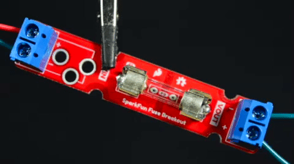

仕様によっては、フィラメントが光りながら派手に飛び散るように切れることもあれば、しばらく光ってから溶けるだけのこともある。
また、切断される前に曲がったり、小さな金属の球状に溶けたりすることもある（こちらはそれほど派手ではない）。

### 自己復帰型ヒューズ（別名PTC）

正温度係数（PTC）素子（マルチヒューズ、ポリヒューズ、ポリスイッチ、あるいは[サーミスタ](https://ja.wikipedia.org/wiki/%E3%82%B5%E3%83%BC%E3%83%9F%E3%82%B9%E3%82%BF)とも呼ばれる）は、電流が流れるにつれて抵抗が増加していくデバイスである。
左側のPTCはスルーホール実装用、右側はSMD実装用である。

| 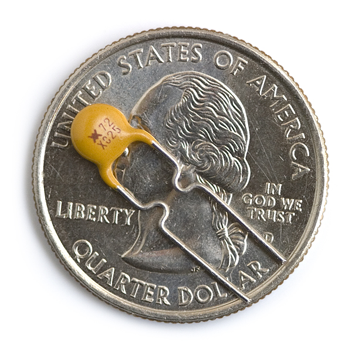 | 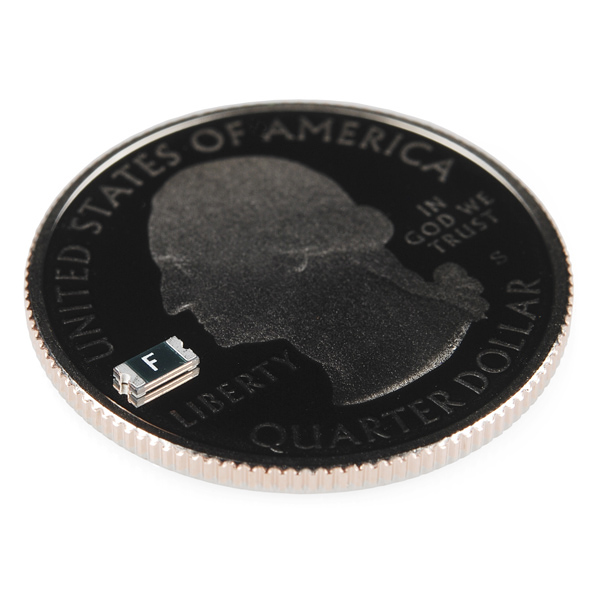 |
| --- | --- |
| *スルーホールタイプのPTC* | *SMDタイプのPTC* |

PTCは頼りになる存在である。電子工作の初心者は、しばしば短絡を起こしたり、うっかり配線を逆につないでしまったりする。
これらのPTCは、ある一定の電流（たとえば500mAまでを保護する250mAのPTCだとする）に達すると抵抗値が劇的に増加し、電流の流れを制限するよう設計できる。
このような自己復帰型ヒューズは、以下の画像のように、USBポートに接続するタイプのモータードライバ基板やマイクロコントローラの一部で見つけることができる。

| 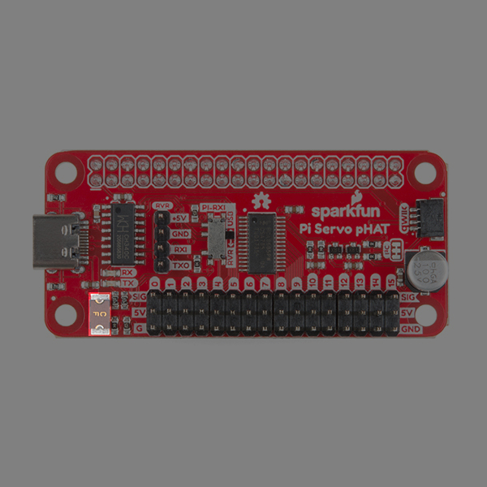 | 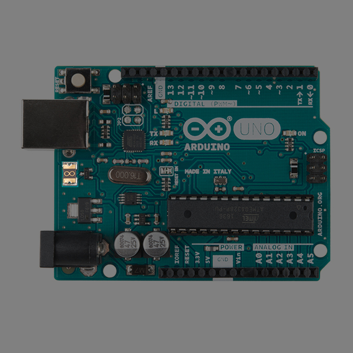 | 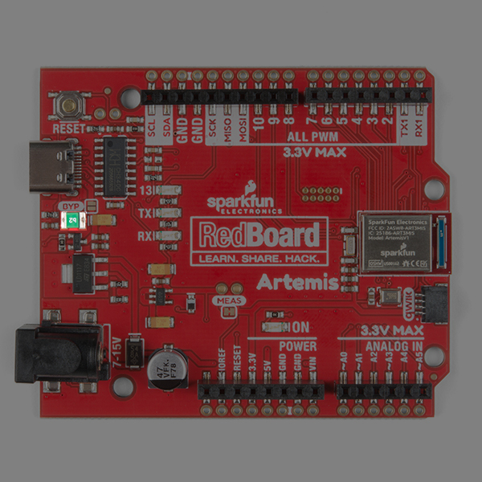 |
| --- | --- | --- |
| *[Raspberry Pi用Servo Hat](https://www.sparkfun.com/products/14328)の自己復帰型ヒューズ* | *[Arduino Uno](https://www.sparkfun.com/products/11021)用のカスタム自己復帰型ヒューズ* | *[RedBoard Artemis](https://www.sparkfun.com/products/15444)の自己復帰型ヒューズ* |

基本的に、PTCは[自己復帰型ヒューズ](https://ja.wikipedia.org/wiki/Resettable_fuse)として機能する。
このデバイスは、電圧レギュレータの手前、直列につなぐのがよい。
回路が500mAを超える電流を引き込むと（たとえば電源をグラウンドへ短絡させてしまった場合など）、250mAのPTCが発熱し、電流を250mAに制限する。
短絡状態を取り除くと、電流は元の水準まで下がり、PTCは冷えて、回路は通常どおり動作を再開する。
これは、多くの設計を発煙から救ってくれる、実に頼もしい小さな部品である。

*[Beginning Embedded Electronics Tutorial Series](https://www.sparkfun.com/tutorials/57)の設計に組み込まれた自己復帰型ヒューズ。*

以下のスルーホールタイプPTCの熱画像は、PTCが動作したときに何が起きるかをよく示している。
左の熱画像は、電圧レギュレータ回路が通常の状態にあるときのものである。
右の画像は、回路が短絡したときのものである。
回路に流れる危険な電流を制限しようとするにつれ、PTCがどれだけ熱くなっているか（なんと213°F！）に注目してほしい。
この見事な熱画像を提供してくれたJoshua Weaver氏に、心から感謝する。

| 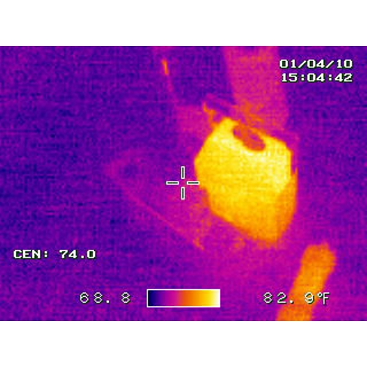 | 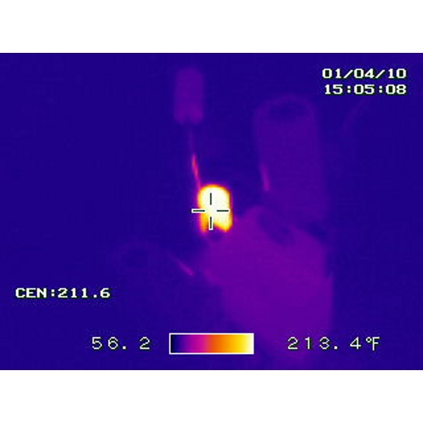 |
| --- | --- |
| *通常の条件下で動作する電圧レギュレータ* | *回路の損傷を防ぐために動作したPTCヒューズ* |

## ハードウェアの概要

### VIN

左側には、入力であるVINがある。
入力側（黄色でハイライトした部分）には2ピンのねじ端子（5mm）をはんだ付けできる。
あるいは、（センタープラスのバレルジャックを持つ）ACアダプタを極性を保ったまま簡単に接続したい場合は、（黒色でハイライトした部分に）バレルジャックをはんだ付けすることもできる。

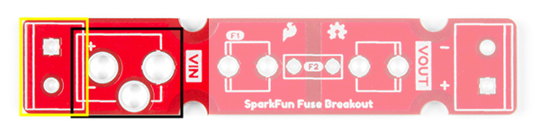

[5mmねじ端子](https://www.sparkfun.com/datasheets/Prototyping/Screw-Terminal-5mm.pdf)は、[バレルジャック](https://www.sparkfun.com/datasheets/Prototyping/Barrel-Connector-PJ-202A.pdf)の接点と比べて、より大きな電流に対応できる点に注意してほしい。
とはいえ、[SparkFunのカタログで扱っているDC用ACアダプタ](https://www.sparkfun.com/categories/308)は、電源供給にバレルジャックを使っている。
プロジェクトに応じて[適切な太さのもの](./working-with-wire.md)であれば、ブレイクアウトボードに配線を直接はんだ付けすることもできる。

### ガラスヒューズ

> [!NOTE]
> 注意：この基板は**直流電源**用に設計されている。交流電源用には設計されていない。保護用のガラスヒューズは、必ず直流側で使用すること。
>
> ヒューズブレイクアウトボードは、5Aのガラス管ヒューズまでテスト済みである。

ガラス管ヒューズを使う場合、基板にはんだ付けする必要のあるクリップが2つある。
クリップの向きを間違えないようにはんだ付けすること。

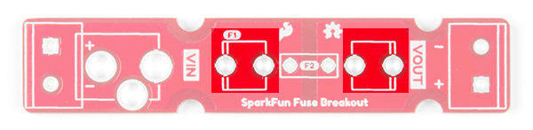

### PTCヒューズ

自己復帰型のPTCヒューズを使いたい場合に備えて、PTCヒューズ用のスルーホールも用意されている。
この基板はスルーホールタイプのPTC向けに設計されているが、試作段階であれば、このパッドにSMDタイプのPTCヒューズをはんだ付けすることもできる。SMDヒューズのサイズによっては、ぴったりとは収まらないかもしれない。

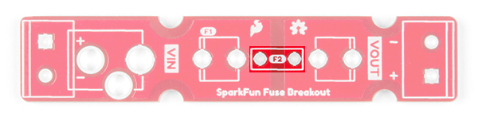

### VOUT

右側には、出力であるVOUTがある。ここには2ピンのねじ端子（5mm）をはんだ付けできる。

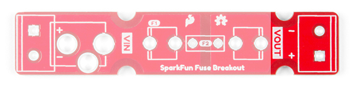

### 取り付け穴

基板をパネルや筐体に取り付けたい場合のために、4つの取り付け穴が用意されている。
基板のサイズを最小限に抑えるため、半円形の取り付け穴が採用されている。

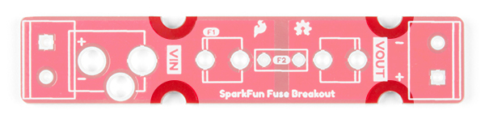

### 基板の寸法

基板のサイズは0.50インチ×2.56インチである。
基板を取り付けたり複数枚を並べて配置したりする場合のために、半円形の取り付け穴が4つ用意されている。

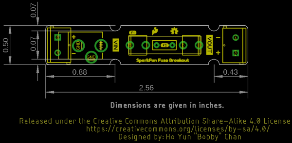

## ハードウェアの組み立て

コネクタとヒューズクリップを、ブレイクアウトボードにはんだ付けする必要がある。部品をはんだ付けする順序は自由に決めてよい。
はんだ付けをしたことがない場合は、[はんだ付けの基本（スルーホール編）](./how-to-solder-through-hole-soldering.md)のチュートリアルにコツがまとまっている。

### 入出力コネクタをはんだ付けする

VIN側には2つの選択肢がある。センタープラスのバレルジャックを持つACアダプタと組み合わせて使う場合は、バレルジャックコネクタを使うとよい。それ以外の場合は、VIN側に5mmのねじ端子をはんだ付けすればよい。

| 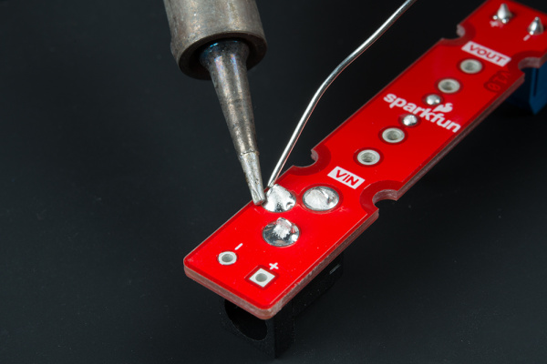 | 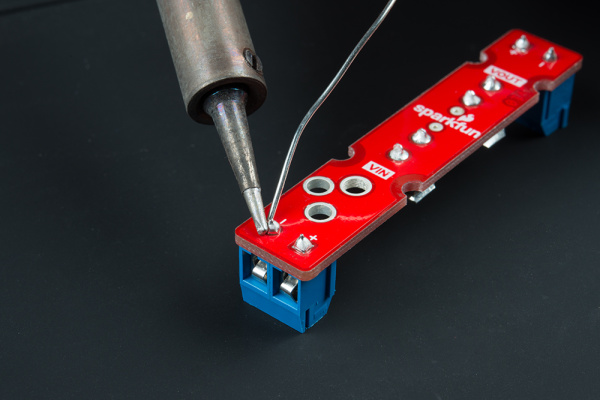 |
| --- | --- |
| *VIN用のバレルジャック* | *VIN用の5mmねじ端子* |

入力側のはんだ付けが終わったら、VOUT側にもねじ端子を取り付ける。

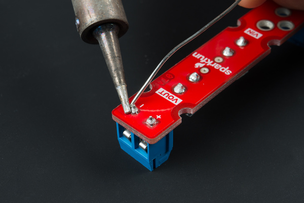

> [!NOTE]
> 注：キットを注文した場合、基板に部品をはんだ付けした後、コネクタが1つ余るはずである。プロジェクトの必要に応じて選べるよう、余分に同梱している。部品箱にしまっておき、必要になったら取り出して使ってほしい。

### 5mmヒューズクリップをはんだ付けする

次のステップは、ガラスヒューズ用のクリップを基板にはんだ付けすることである。
両側にクリップを挿入する。
各脚を基板に仮止めする前に、クリップの向きが正しいことを確認しておく必要がある。
それぞれのヒューズクリップのシルク印刷をよく見ると、四角形の一辺に補助線が引かれているのがわかる。
これが、湾曲した部分を向けるべき側である。
各脚を仮止めしたら、もう一方の脚もはんだ付けする。
はんだ付け中はクリップが熱くなることがあるので、テープで基板に固定するか、小さな厚紙片でクリップを基板に押さえておくとよい。

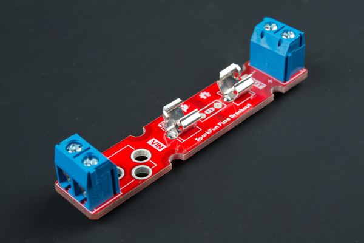

*ヒューズクリップをより詳しく見たい場合は、画像をクリックしてほしい。*

> [!NOTE]
> 注：ブレイクアウトボードをPTCヒューズと組み合わせて使う場合は、ヒューズクリップをはんだ付けする必要はなく、スルーホールタイプのPTCヒューズをそのままはんだ付けするだけでよい。スルーホールタイプのPTCから余ったリード線は、フラッシュカッターで切り落とす必要がある。上級者向けとしては、スルーホール用のパッドにSMDタイプのPTCヒューズをはんだ付けすることもできる。
>
> 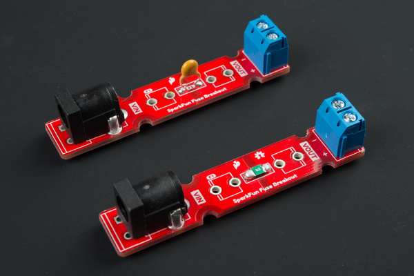

### システムにヒューズを組み込む

ガラスヒューズを使う場合は、これでガラス管をクリップに挿入できる。
ヒューズが切れてしまった場合は、[マイナスドライバー](https://www.sparkfun.com/products/9146)を使って慎重にこじ開けて取り出せばよい。

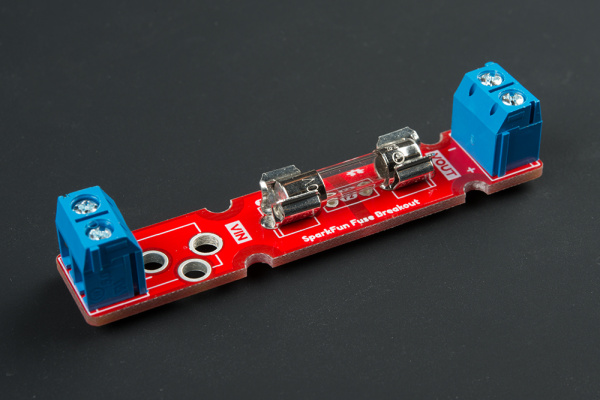

それ以外の場合は、VIN側にバレルジャックを挿入するか、電源と負荷の間の[被覆を剥いた配線](./working-with-wire.md)をねじ止めして固定する。
電圧線とグラウンド線については、シルク印刷を必ず確認しておくこと。

### 取り付け

設計には、半円形の取り付け穴が含まれている。
これは、基板をパネルや筐体に取り付けたい場合に便利である。
取り付けるには、次の手順が必要である。

- スペーサー（あるいはネジとスペーサー）を締める。
  - 基板をハードウェアの間に滑り込ませるための隙間を確保しておくこと。
- スペーサーの間に基板を挟んで締める。
  - 複数枚のヒューズブレイクアウトを使う場合は、締める前に2枚の基板の間にスペーサーを配置すること。
- 各スペーサーについて同じ手順を繰り返す。

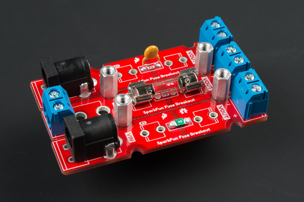

## ヒューズを選ぶ際の考慮事項

どのヒューズを選ぶかは、プロジェクトによって異なる。
電源や電池の後段にヒューズを配置する際に考慮すべき点をいくつか紹介する。

### プロジェクトの電圧・電流の要件

まず、負荷の電圧と電流に耐えられるヒューズを選ぶ必要がある。
ヒューズの[データシート](https://www.sparkfun.com/tutorials/223)に、その情報が記載されているはずである。
次に、回路を損傷させることなく、プロジェクトが電源から引き込むと想定される[最大電力を測定する](./how-to-use-a-multimeter.md)。
プロジェクトがある程度の時間にわたって過剰な熱を発生させる場合は、それも考慮に入れる必要がある。
測定結果をもとに、ヒューズが切れる、あるいは動作する電流を決める必要がある。
この値は、たいてい動作電流以下で、かつ電源の許容電流の範囲内に収める（つまり、20Aの大電流電源を使っていて、負荷の一部が1Aを引き込んだ時点でヒューズを動作させたい、というような場合である）。
モーターを使うロボットのように、短時間の電流スパイクが発生するプロジェクトには、スローブロー（タイムディレイ）タイプが必要になる。
即座にヒューズを切りたい他のプロジェクトには、ファストタイプやウルトラファストタイプが必要になるだろう。
ここでは、室温での使用を前提とする。

### ガラス管ヒューズかPTCか

大電流の電源には、プロジェクトから完全に切り離してヒューズが切れるガラス管ヒューズを検討するとよいだろう。
低電流の電源には、自己復帰型ヒューズを検討するとよい。
ただし、自己復帰型ヒューズは動作時に発熱することがあり、動作中も負荷側にわずかに電流が漏れ続ける点には注意しておく必要がある。

### 負荷試験

試作に使うヒューズを決めたら、必ず実際にテストしておくこと。
そう、それはガラス管ヒューズを犠牲にするということだが、回路が予想外の挙動を始めたときに、この部品が期待どおりに機能することを確認しておく必要がある。

## 例

### 大電流の電源

この基板を設計するきっかけになったのは、Hackadayの記事「[The Engineering Case for Fusing Your LED Strips](https://hackaday.com/2018/01/29/the-engineering-case-for-fusing-your-led-strips/)」を読んだことだった。
大電流を出力する電源は、負荷にひたすら電流を流し続けてしまう。
これによって回路が損傷したり、火災の危険が生じたりすることもある。
電源の出力の近くにヒューズを配置しておけば、この先で何が起きても回路を保護できる。
この場合、ヒューズが切れて、残りのLEDへの電源供給を遮断してほしいということになる。
1つの大電流電源から複数のLEDストリップを駆動する場合は、それぞれのLEDストリップの区間ごとに電流を分割すればよい。

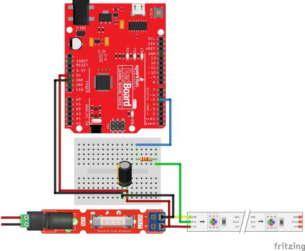

### 低電流の電源

低電流の電源で自己復帰型のPTCヒューズを使う場合は、入力電圧のすぐ後段に配置するとよい。
以下は、ACアダプタと電圧レギュレータの間にPTCを配置した[回路図](./how-to-read-a-schematic.md)の例である。
試作段階でブレイクアウトボードにPTCヒューズを組み込んでおくと、最終設計に組み込む前に、セットアップを手早くテストするのに役立つ。

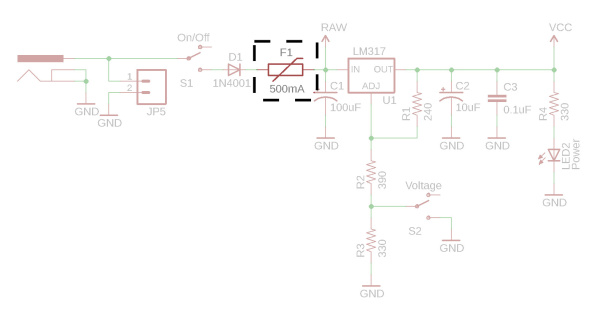

*[Breadboard Power Supply Kit](https://www.sparkfun.com/products/114)の設計で使われているPTCヒューズ。*

以下は、USBコネクタとマイクロコントローラの間にPTCヒューズを配置した例である。

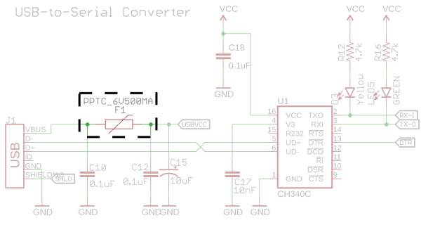

*[RedBoard Qwiic](https://www.sparkfun.com/products/15123)の設計で使われているPTCヒューズ。*

> [!NOTE]
> ヒント：さらに回路を保護したい場合は、逆電流保護用にヒューズとショットキーダイオードを組み合わせて追加するとよい。
>
> 
>
> *[ダイオードのチュートリアル](./diodes.md)にある逆電流保護の回路。*

## まとめ

ヒューズブレイクアウトボードを無事に動かせるようになったところで、いよいよ自分のプロジェクトに組み込む番である。さらに詳しい情報は、次のリンクを参考にしてほしい。

- [回路図（PDF）](https://cdn.sparkfun.com/assets/3/9/6/0/5/SparkFun_Fuse_Breakout_Board-Schematic.pdf)
- [Eagleファイル（ZIP）](https://cdn.sparkfun.com/assets/2/1/d/a/4/SparkFun_Fuse_Breakout_Board.zip)
- [基板の寸法](https://cdn.sparkfun.com/assets/learn_tutorials/9/6/6/SparkFun_Fuse_Breakout_Board_Dimensions.png)
- 関連記事
  - [Digi-Key: Testing and Identifying Fuse Problems](https://www.digikey.com/en/blog/testing-and-identifying-fuse-problems)
  - [Hackaday: The Engineering Case for Fusing Your LED Strips](https://hackaday.com/2018/01/29/the-engineering-case-for-fusing-your-led-strips/)
- [GitHub](https://github.com/sparkfun/SparkFun-Fuse-Breakout-Board)
- [SFE Product Showcase](https://youtu.be/peHeryRQKW8)

さらにアイデアが欲しい場合は、次の関連チュートリアルも参考にしてほしい（いずれも英語）。

- [Benchtop Power Board Kit Hookup Guide](https://learn.sparkfun.com/tutorials/benchtop-power-board-kit-hookup-guide)：もっと電力が必要なら、このBenchtop ATX Power Supply Kitが役立つはずである。
- [電力](./electric-power.md)
- [12V/5V Power Supply Hookup Guide](https://learn.sparkfun.com/tutorials/12v5v-power-supply-hookup-guide)
- [熱抵抗を理解する](./understanding-thermal-resistance.md)
- [smôl Power Board AAA Hookup Guide](https://learn.sparkfun.com/tutorials/sml-power-board-aaa-hookup-guide)

タグ: 部品、概念、接続ガイド、電力、プロジェクト、プロトタイピング、はんだ付け

---

出典：[Fuse Breakout Board Hookup Guide](https://learn.sparkfun.com/tutorials/fuse-breakout-board-hookup-guide)（SparkFun Learn）を日本語に翻訳し、再構成した。
原文は [CC BY-SA 4.0](https://creativecommons.org/licenses/by-sa/4.0/) ライセンスで公開されており、本ページも同ライセンスの下で提供する。
