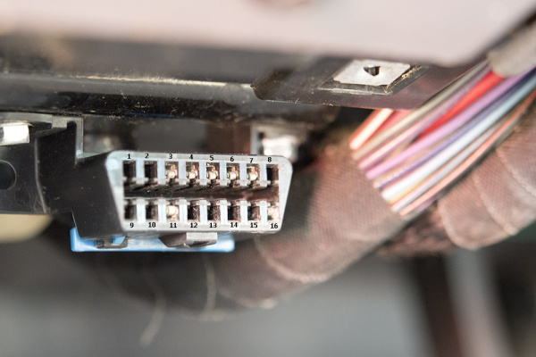
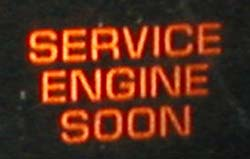
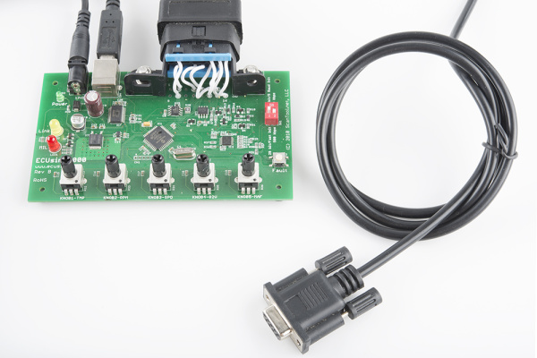
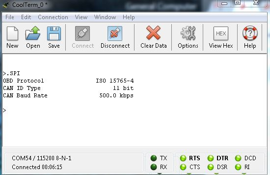
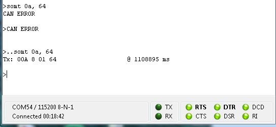

# OBD-II入門

## はじめに

組み込み電子工作の世界を歩んでいくと、いずれ車両からデータを「ハック」したくなる場面が出てくる。
他の多くの統合システムと同様、車両との対話にも専用の「言語」がある。
このチュートリアルでは、車両やその他の産業機械が外部と通信するために使う*On-Board Diagnostics（OBD）*仕様の基本を紹介する。

> [!NOTE]
> 警告：OBD-IIシステムを認証されていない状態に改造することは、[連邦法違反](http://www.epa.gov/obd/questions.htm#9)とみなされる。ここで提供する情報は、あくまでOBD-II仕様からの読み取りを目的としたものである。ハックは自己責任で行うこと。

### OBDとは何か

OBD仕様とは実際のところ何であり、なぜ気にする必要があるのだろうか。
米国環境保護庁（EPA）の[Webサイト](http://www.epa.gov/obd/)には、次のように説明されている。

> On-Board Diagnostics、通称「OBD」は、1990年のClean Air Act Amendments（大気浄化法改正）で義務付けられた、1996年以降のすべての小型車・トラックに搭載されているコンピュータベースのシステムである。OBDシステムは、排出ガスを制御する部品を含む、エンジンの主要部品の性能を監視するように設計されている。

言い換えれば、OBDは**エンジン制御ユニット（ECU）**の言語であり、排出ガスとエンジン故障への対策を助けるために設計されたものである。

地球を守ることは素晴らしいが（市民科学者のみなさんに拍手を）、これは同時に、車の他の機能にもアクセスし、それらの部品から情報を収集できるということでもある。
これらのプロトコルの扱い方を学べば、ダッシュボードの**故障表示灯（MIL）**（いわゆるチェックエンジンランプ）がエンジンの問題を知らせているとき、それが何を指しているのかを自分で判断できるようになる。
自分やメカニックが車両の**DTC（診断トラブルコード）**を読み取ったことがあるなら、それはOBD-IIを使っているということである。

残念ながら、プロトコルそのものは一般に公開されていないが（オープンソースであればよかったのだが）、できる限りの情報を集めて整理してみた。

### ハードウェア

1996年以降に製造されたすべての車両は、法律によりOBD-IIコンピュータシステムの搭載が義務付けられている。
このシステムには、**データリンクコネクタ（DLC）**を通じてアクセスできる。
これは16ピンのコネクタで、どのピンが実装されているかによって、その車がどのプロトコルで通信しているかがわかる。

*1998年式Jeep Cherokeeのデータリンクコネクタに、ピン番号のラベルを付けたもの。*

車内では、ダッシュボードの下、運転席の近く、灰皿の周辺など、運転席から工具なしで（つまりパネルを外すためのドライバーなどを使わずに）簡単にアクセスできる場所に設置されている。

## 用語

先に進む前に、これらのプロトコルで使われる用語をひととおり確認しておこう。

### エンジン制御ユニット／電子制御ユニット（ECU）

ECUは、単一のモジュールを指すこともあれば、複数のモジュールの集合を指すこともある。
これらは車両の頭脳にあたり、車のさまざまな機能を監視・制御している。
メーカー標準のものもあれば、再プログラム可能なもの、複数の機能のために数珠つなぎにできるものもある。
ECUのチューニング機能を使えば、エンジンをさまざまな性能レベルや燃費レベルで動作させることができる。
新しい車では、これらはたいていマイクロコントローラとして実装されている。

代表的なECUの種類には、次のようなものがある。

- **Engine Control Module（ECM）**：エンジンのアクチュエータを制御し、点火タイミング、空燃比、アイドル回転数などに影響する。
- **Vehicle Control Module（VCM）**：エンジンと車両の性能を制御する、別名のモジュール。
- **Transmission Control Module（TCM）**：トランスミッションを扱い、トランスミッションフルードの温度、スロットル開度、車輪速度などを処理する。
- **Powertrain Control Module（PCM）**：たいていECMとTCMを組み合わせたもの。パワートレインを制御する。
- **Electronic Brake Control Module（EBCM）**：アンチロックブレーキシステム（ABS）を制御し、データを読み取る。
- **Body Control Module（BCM）**：パワーウィンドウやパワーシートなど、車体側の機能を制御するモジュール。

### 診断トラブルコード（DTC）

これらのコードは、車両のどこに問題が発生しているかを示すために使われ、SAE（Society of Automotive Engineers）によって定義されている（[完全な仕様](http://standards.sae.org/j2012_201303/)は有料で入手できる）。
これらのコードは、汎用のものと、車両メーカー固有のものがある。

コードは次のような形式になっている。

XXXXX

- 1文字目は、エラーコードの種類を示す。
  - **P**xxxx：パワートレイン
  - **B**xxxx：ボディ
  - **C**xxxx：シャシー
  - **U**xxxx：クラス2ネットワーク
- 2文字目は、そのコードがメーカー固有かどうかを示す。
  - x**0**xxx：政府が定めた標準コード
  - x**1**xxx：メーカー固有のコード
- 3文字目は、そのトラブルコードがどのシステムを指すかを示す。
  - xx**1**xx／xx**2**xx：空気・燃料の測定系
  - xx**3**xx：点火系
  - xx**4**xx：排出ガス系
  - xx**5**xx：速度・アイドル制御系
  - xx**6**xx：コンピュータ系
  - xx**7**xx／xx**8**xx：トランスミッション系
  - xx**9**xx：入出力信号・制御系
- 4〜5文字目は、具体的な故障コードを示す。
  - xxx**00**〜xxx**99**：3文字目で定義されたシステムに応じたコード

DTCの一覧（不完全なもの）は、[こちら](http://www.dmv.de.gov/services/Vehicle_Services/dtc_list.pdf)と[こちら](http://www.fastfieros.com/tech/diagnostic_trouble_codes_for_obdii.htm)で確認できる。

### パラメータID（PID）

これこそが、OBD-IIシステムから実際に取り出せる情報の本体である。
PIDは、確認したいさまざまなパラメータを定義したものであり、DTCにおける3文字目のような役割に近い。

すべてのPIDがすべてのプロトコルでサポートされているわけではなく、メーカーごとに独自のPIDが多数存在することもある。
残念ながら、これらもたいてい公開されていないため、各PIDがどのシステムに対応しているかを調べるには、多くの調査や逆解析が必要になることがある。

複数のモードが用意されており、それぞれのモードには、そのモードで使えるいくつかのPIDの選択肢がある。
より一般的な情報については、[PIDのWikiページ](https://ja.wikipedia.org/wiki/OBD-II_PIDs)を参照してほしい。

### 故障表示灯（MIL）

MILは、車に問題があることを示す、ダッシュボードのあの嫌な小さいランプのことである。
いくつかのバリエーションがあるが、いずれもOBD-IIプロトコルによって検出されたエラーを示している。

["Check-Engine-Light" by IFCAR - Own work. Licensed under Public Domain via Commons](https://commons.wikimedia.org/wiki/File:Check-Engine-Light.jpg#/media/File:Check-Engine-Light.jpg)

ダッシュボードで見かける可能性のある、もう一つのパターンを紹介する。

["Motorkontrollleuchte" by Benutzer:chris828 - Own work by the original uploader. Licensed under Public Domain via Commons](https://commons.wikimedia.org/wiki/File:Motorkontrollleuchte.svg#/media/File:Motorkontrollleuchte.svg)

どちらのランプであっても、ハックしたい気分でもない限り、目にして嬉しいものではない。

## OBD-IIのプロトコル

OBD-II仕様には、5種類の通信プロトコルが用意されている。
多くのものごとがそうであるように、メーカーにはそれぞれ好みがあり、自社のプロトコルが最良だと考えている。それがこの種類の多さにつながっている。
それぞれについて簡単に紹介し、DLC上で使われるピンの説明も示す。

### SAE J1850 PWM

この信号は[パルス幅変調](./pulse-width-modulation.md)で、41.6kbpsで動作する。
このプロトコルは、主にFord車で使われている。

**SAE J1850 PWM**

| 項目 | 説明 |
| --- | --- |
| BUS + | ピン2 |
| BUS - | ピン10 |
| 12V | ピン16 |
| GND | ピン4、5 |
| バスの状態 | BUS +がハイ、BUS -がローに駆動されているときアクティブ |
| 最大信号電圧 | 5V |
| 最小信号電圧 | 0V |
| バイト数 | 12 |
| ビットタイミング | 「1」ビット：8µs、「0」ビット：16µs、フレーム開始：48µs |

### SAE J1850 VPW

このプロトコルはVariable Pulse Width（可変パルス幅）で、10.4kbpsで動作する。
GM車では、たいていこちらの方式が使われる。

**SAE J1850 VPW**

| 項目 | 説明 |
| --- | --- |
| BUS + | ピン2 |
| 12V | ピン16 |
| GND | ピン4、5 |
| バスの状態 | アイドル時はロー |
| 最大信号電圧 | +7V |
| 判定電圧 | +3.5V |
| 最小信号電圧 | 0V |
| バイト数 | 12 |
| ビットタイミング | 「1」ビット：ハイ64µs、「0」ビット：ハイ128µs、フレーム開始：ハイ200µs |

### ISO 9141-2

Chrysler車や欧州車、アジア車を使っているなら、これがそのプロトコルである。
10.4kbpsで動作する非同期シリアル通信である。

**ISO 9141-2**

| 項目 | 説明 |
| --- | --- |
| Kライン（双方向） | ピン7 |
| Lライン（単方向、オプション） | ピン15 |
| 12V | ピン16 |
| GND | ピン4、5 |
| バスの状態 | Kラインはアイドル時ハイ。ローに駆動されるとアクティブ |
| 最大信号電圧 | +12V |
| 最小信号電圧 | 0V |
| バイト数 | メッセージ：260、データ：255 |
| ビットタイミング | UART：10400bps、8-N-1 |

### ISO 14230 KWP2000

これはKeyword Protocol 2000と呼ばれ、こちらも最大10.4kbpsで動作する非同期シリアル通信方式である。
こちらも、Chrysler車や欧州車、アジア車で使われている。

**ISO 14230 KWP2000**

| 項目 | 説明 |
| --- | --- |
| Kライン（双方向） | ピン7 |
| Lライン（単方向、オプション） | ピン15 |
| 12V | ピン16 |
| GND | ピン4、5 |
| バスの状態 | ローに駆動されるとアクティブ |
| 最大信号電圧 | +12V |
| 最小信号電圧 | 0V |
| バイト数 | データ：255 |
| ビットタイミング | UART：10400bps、8-N-1 |

### ISO 15765 CAN

このプロトコルは、2008年以降に米国で販売されるすべての車両で義務化されている。
ただし、2003年以降の欧州車であれば、CANを搭載している場合もある。
2線式の通信方式で、最大1Mbpsで動作する。

**ISO 15765 CAN**

| 項目 | 説明 |
| --- | --- |
| CAN HIGH（CAN H） | ピン6 |
| CAN LOW（CAN L） | ピン14 |
| 12V | ピン16 |
| GND | ピン4、5 |
| バスの状態 | CANHがハイ、CANLがローに駆動されるとアクティブ。信号がフローティングのときはアイドル |
| CANH信号電圧 | +3.5V |
| CANL信号電圧 | +1.5V |
| 最大信号電圧 | CANH = +4.5V、CANL = +2.25V |
| 最小信号電圧 | CANH = +2.75V、CANL = +0.5V |
| ビットタイミング | 250kbit/秒 または 500kbit/秒 |

## シミュレータを使う

これらのプロトコルは車両からデータを収集するのに役立つが、試作段階でパソコンやさまざまな電子部品、車の前であちこちに這わせたケーブルに囲まれて作業するのは、かなり面倒である。
幸い、OBD-IIシステムの基本的な試作やテストを行えるシミュレータが数多く存在する。

こうしたプロトコルを扱うのに便利なシミュレータをいくつか手元にそろえている。
新しいものを入手したら、このセクションを随時更新していく。

### ECUsim 2000

このECUシミュレータは、[ScanTool](https://www.scantool.net/)社によって設計・製造されている。
すべての製品情報は、[こちらの製品ページ](https://www.scantool.net/dev-tools/ecusim-family/ecusim-2000.html)で確認できる。

このシミュレータを使い始めるには、次の接続作業が必要である。

1. USBケーブルをシミュレータとパソコンに接続し、必要なドライバをインストールする。
2. OBD-IIケーブルをシミュレータに接続する。
3. 付属の12V電源でシミュレータに電源を入れる。
4. シミュレータが設定されているシリアルポートに対して、`115200bps、8、N、1`で[シリアルターミナル](./terminal-basics.md)を開く。
5. テストしたいプロトコルにシミュレータを設定する。
6. ECUデバイス（OBD-IIボード、CAN-Busシールド、Raspberry Piなど）を接続する。

これで、バス上で送信されているデータが、ECUリーダー側で受信しているデータと一致しているか（またその逆も）を、シミュレータを使って検証できる。

シミュレータの設定には、さまざまなプログラミングオプションが用意されている。
詳しくは[プログラミングマニュアル](https://cdn.sparkfun.com/assets/learn_tutorials/4/1/5/ecusim-programmingmanual2015.pdf)を参照してほしい。
現在手元にあるバージョンのファームウェアは複数のOBD-IIプロトコルに対応しており、注文内容によって対応状況が変わる。

プログラミングマニュアルには、シミュレータで使えるすべてのコマンドも記載されている。

たとえば、シミュレータが現在どのプロトコルに設定されているかを調べたい場合は、`SPI`コマンドを使う。
ターミナルでは、次のようになる。

*ECUsim 2000のプロトコル設定を読み取る様子。*

これは、シミュレータが現在ISO 15765-4プロトコル（別名CAN）に設定されており、IDタイプは11ビット、動作速度は500kbpsであることを示している。

続いて、シミュレータから[SparkFun OBD-II UARTボード](https://www.sparkfun.com/products/9555)や[CAN-Busシールド](https://www.sparkfun.com/products/10039)のようなデバイスへテスト用のデータを送りたい場合は、送信コマンド`SOMT <header>, <data>`を使う。
たとえば、エンジンの燃圧が100kPaであるというコマンドを送りたい場合、`SOMT`に続けて燃圧のパラメータID（PID）である`0A`を指定し、続けて100の16進値（この場合`64`）を送信する。

*ECUsim 2000経由で燃圧データを送信する様子。*

接続に問題がある状態をシミュレートするため、あえてDB9コネクタの固定ネジを締め忘れて接続をフローティングにしたままコマンドを送ると、最初の送信で`CAN ERROR`というメッセージを受け取る。
このシミュレータでは、これはシミュレータとCANリーダーの間に問題があることを意味する。
しかし接続を直せば、シミュレータはデータを送信できるようになり、何を送信したのかを正確に教えてくれる。なかなか気の利いた仕組みである。

## まとめ

OBD-IIプロトコルの基礎と、さまざまな通信ツールの扱い方について理解できたところで、いよいよ自分のプロジェクトを作る番である。

さらに参考になる資料を紹介する（いずれも英語）。

- [OBD-II UART Board Hookup Guide](https://learn.sparkfun.com/tutorials/obd-ii-uart-hookup-guide)
- [CAN-Bus Shield Hookup Guide](https://learn.sparkfun.com/tutorials/can-bus-shield-hookup-guide)
- [OBD-II forum](http://www.obdii.com/)
- [Environmental Protection Agency's OBD Site](http://www.epa.gov/obd/)
- [SAE Standards](http://standards.sae.org/j2012_201303/)
- [National OBD Clearinghouse](http://obdclearinghouse.com/index.php?body=can)
- [OBD Trouble Codes](http://www.obd-codes.com/trouble_codes/)
- [Parsing OBD-II Data Out](https://theksmith.com/software/hack-vehicle-bus-cheap-easy-part-2/)
- [freediag: Vehicle Diagnostics Suite](http://sourceforge.net/projects/freediag/)
- [pyOBD: Open-source OBD-II Diagnostics](http://www.obdtester.com/pyobd-download)
- [Windows-based Diagnostics software](http://www.ross-tech.com/vag-com/)
- [OBD Diags](http://pages.infinit.net/jsenk/obd.htm)

タグ: 通信、概念、ツール

---

出典：[Getting Started with OBD-II](https://learn.sparkfun.com/tutorials/getting-started-with-obd-ii)（SparkFun Learn）を日本語に翻訳し、再構成した。
原文は [CC BY-SA 4.0](https://creativecommons.org/licenses/by-sa/4.0/) ライセンスで公開されており、本ページも同ライセンスの下で提供する。
