# micro:bitを始める

[micro:bit](https://www.sparkfun.com/products/14208)というものを買った、あるいはさらによいことに、更新版の[micro:bit v2](https://www.sparkfun.com/products/17287)を買ったとしよう。
しかし、これは一体何なのだろうか。

BBC micro:bitは、デジタル技術を使ってクリエイティブなものを作れる、ポケットサイズのコンピュータである。
どこからでもmicro:bitをコード化し、カスタマイズし、制御できる。
micro:bitは、ロボットから楽器まで、あらゆるユニークな作品作りに使える。

micro:bitは、コンピュータサイエンス教育とSTEM分野を英国のすべての生徒に届けることを目指した、BBCによるプロジェクトである。
オンボードのハードウェアコンポーネントと連携して動作するオープンな開発ボードであり、ハードウェアのプログラミングという道を歩み始めるきっかけになる。

クレジットカードの半分ほどのサイズしかないが、各ボードに搭載されているハードウェアの量には驚かされるはずである。
メッセージを点滅表示できる25個の赤色LEDライトもその一つである。
ゲームの制御や、プレイリストの一時停止・スキップに使える、プログラム可能な2つのボタンもある。
micro:bitはモーションを検知し、自分がどの方向を向いているかを教えてくれることさえできる。
Bluetooth Low Energy（BLE）を使い、他のデバイスやインターネットとやり取りすることもできる。

micro:bitには、内蔵のコンパス、加速度センサー、モバイル・Webベースのプログラミング機能が備わっている。
micro:bit v2では、オンボードスピーカーとMEMSマイクロホン、そしてタッチセンシティブなロゴが追加されている。
どちらのボードも、さまざまな言語に対応した多数のオンラインコードエディタと互換性がある。
このガイドでは、Microsoftが開発したブロックまたはJavaScriptベースの環境である[MakeCode](https://makecode.com)を扱う。

## 必要な部品

このチュートリアルに沿って進めるには、micro:bitと[micro USBケーブル](https://www.sparkfun.com/products/10215)だけが必要になる。
とてもシンプルである。

### おすすめの読み物

以下のチュートリアルも確認しておくことを推奨する。

- [I2C](./i2c.md) — 現在広く使われている主要な組み込み用通信プロトコルの一つ、I2Cの入門
- micro:bit Breakout Board Hookup Guide — micro:bitブレイクアウトボードの使い始め方

## ハードウェア概要

BBC micro:bitには2つのバージョンがあり、どちらもオンボードの入出力に関して多くの機能を備えている。
実際、これらの小さなボードには非常に多くの機能が詰め込まれているため、プログラミングとハードウェアの基礎を探求するだけであれば、他にはほとんど何も必要とならないはずである。

### 表面

ボードの表面には、一目で見てわかる部品がいくつも搭載されている。

#### LEDアレイ

micro:bitには、小さな画面として使い、絵を描いたり、単語・数字・その他の情報を表示したりできる5×5のLEDアレイが搭載されている。

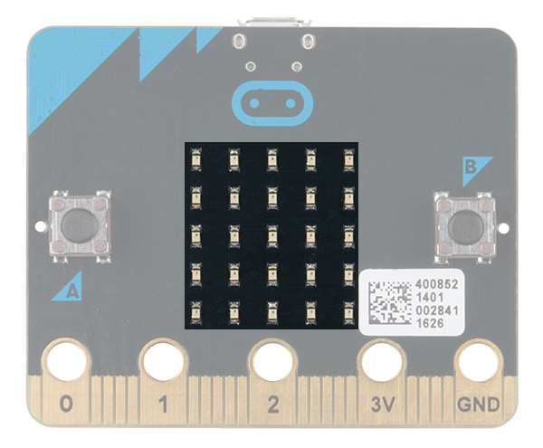
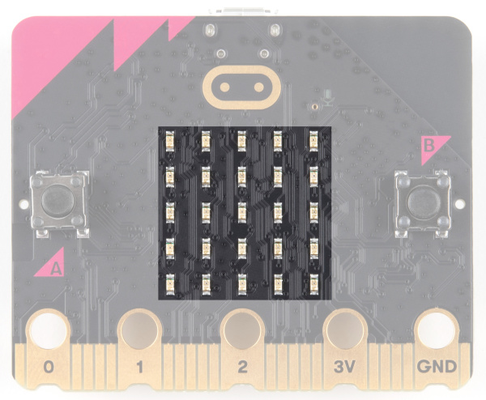

*左：micro:bitのLEDアレイ　右：micro:bit V2のLEDアレイ*

#### A/Bボタン

カチッと押せる2つのボタンがある。Aは左側、Bは右側にあり、どちらも自分で設計したゲームの操作にぴったりである。

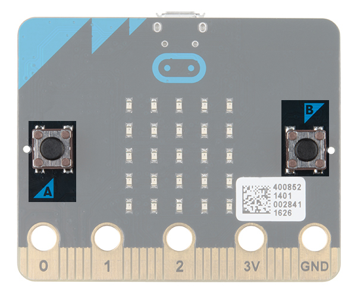
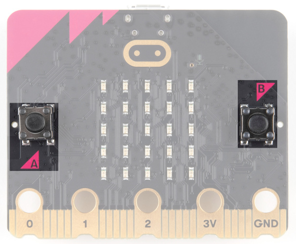

*左：micro:bitのA/Bボタン　右：micro:bit V2のA/Bボタン*

#### エッジ「ピン」

ボードの下部にある金色のタブは、外部部品を接続するためのものである。
穴が大きいタブは[ワニ口クリップ](https://www.sparkfun.com/products/12978)を使えば手早くプロトタイピングできる。
すべてのピンにアクセスするには、エッジコネクタ付きのボードが必要になる。
ブレッドボードでのプロトタイピングには、[ヘッダー付きのmicro:bitブレイクアウト](https://www.sparkfun.com/products/16446)が向いている。
micro:bit v2では、ワニ口クリップで接続しやすいよう切り欠きが追加されていることにも気づくはずである。

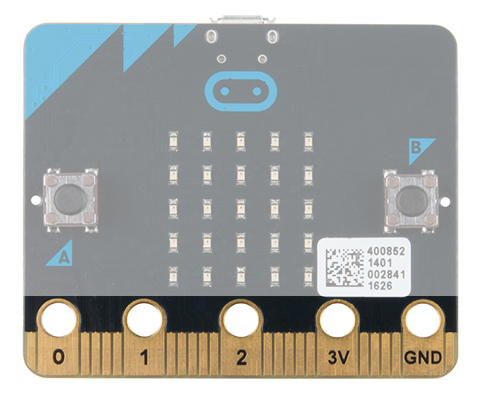
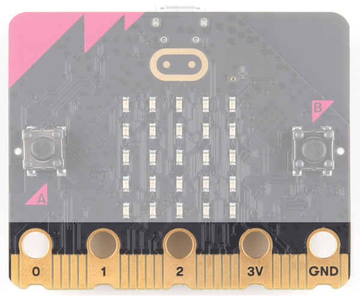

*左：micro:bitのエッジピン　右：micro:bit V2のエッジピン*

> **注意：** 大きめのスルーホールへの接続方法は、自由な発想で工夫できる。
> 一部のボードでは、シャフトに沿ってテーパーのかかった皿ねじやトラスねじ、ナイロンスペーサー、六角ナットを使ってスルーホールにアクセスできる。
> 下の画像は、皿ねじを使ってmicro:bitを[Kitronik MI:power Board V2](https://www.sparkfun.com/products/17852)に接続した様子である。
>
> 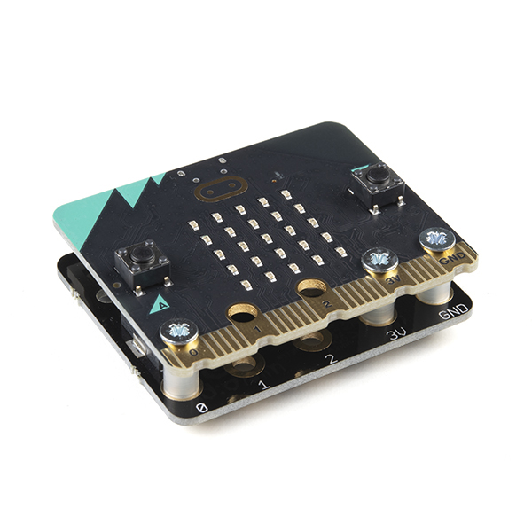
>
> 皿ねじを使う方法は、ワニ口クリップの代わりにしっかりとした接続を得られる代替手段でもある。
> 詳しくは、次のブログ記事を確認してほしい：[micro:bit - Hacking the GPIO - Updated!](https://bigl.es/micro-bit-hacking-the-gpio/)

#### 光センサー

ちょっとした隠れた宝である。LEDアレイは光センサーも兼ねている。

（画像はLEDアレイの節と同じである）

#### V2限定：マイク入力とLEDインジケーター

マイク入力とLEDインジケーターは、ボード上部にあるタッチセンシティブなロゴの右側にある。

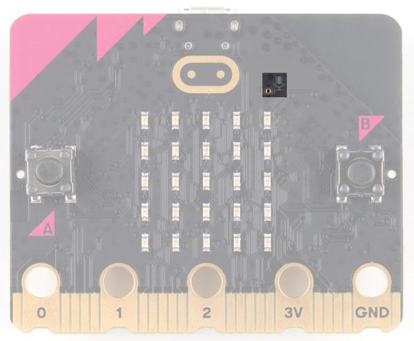

#### V2限定：タッチセンシティブなロゴ

金色のロゴは静電容量式タッチセンサーであり、携帯電話のタッチスクリーンのように、電気のわずかな変化を測定して動作する。

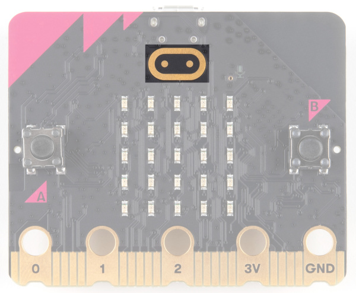

### 裏面

裏面では、多くの魔法が起きている。見てみよう。

#### マイクロコントローラー

このボードの頭脳である。

micro:bitは、256KBのフラッシュメモリと16KBのRAMを備えた16MHzのARM Cortex-M0マイクロコントローラーで動作する。

micro:bit v2は、Nordic SemiconductorのnRF52833チップ（FPU付き64MHzのARM Cortex-M4マイクロコントローラー、512KBのフラッシュメモリ、128KBのRAM）で動作する。

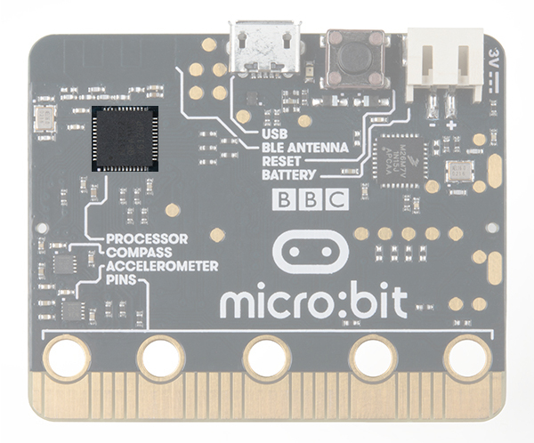
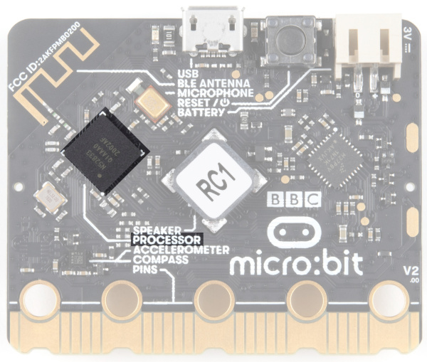

*左：micro:bitのnRF51822プロセッサ　右：micro:bit V2のnRF52833プロセッサ*

#### 加速度センサー・コンパス

micro:bitには、重力を測定するオンボードの加速度センサーに加え、地球の磁場を使って自身の向きを検出できるコンパス（磁力計）が搭載されている。

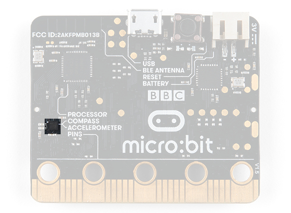
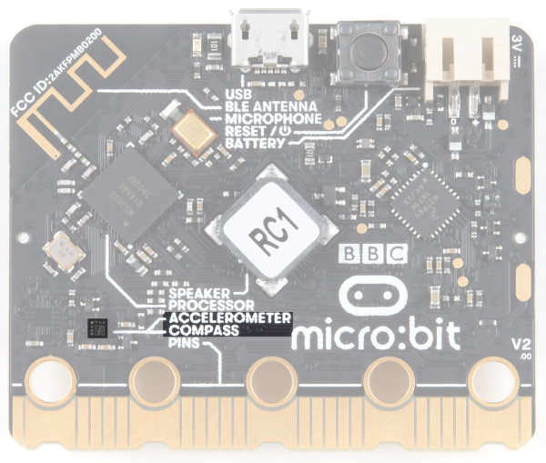

*左：micro:bitの加速度センサーと磁力計　右：micro:bit v2の加速度センサーと磁力計*

#### Bluetooth・無線

micro:bitにとって通信は非常に重要な機能である。
Bluetooth Low Energy（BLE）を使ってスマートフォンやタブレットと通信したり、標準の2.4GHz「無線」を使って2台以上のmicro:bit同士で通信したりできる。
なお、micro:bit v1はBLE Bluetooth v4.0を、micro:bit v2はBLE Bluetooth v5.0を使う。

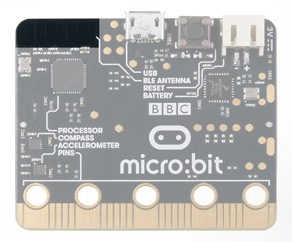
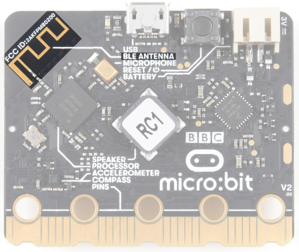

*左：micro:bitのBluetooth・無線アンテナ　右：micro:bit v2のBluetooth・無線アンテナ*

#### 温度センサー

いや、この図の強調表示は間違っていない。マイクロコントローラーは温度センサーも兼ねている。

（画像はマイクロコントローラーの節と同じである）

#### USBポート

micro:bitへのコードのアップロードや、コンピュータ・ラップトップからの給電に使う。
MakeCodeのシリアルコンソールやシリアルターミナルを使い、シリアルデータの送受信もできる。

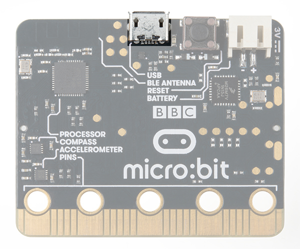
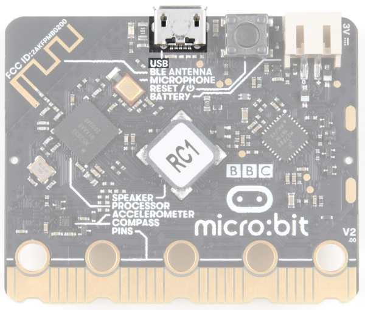

*左：micro:bitのUSBポート　右：micro:bit v2のUSBポート*

#### USBアクティビティLEDインジケーター

USBピンに通信が発生すると、右側のLEDが点灯する。

#### V2限定：電源LED

micro:bitのV2には、USBコネクタの隣に、電源が供給されていることを示す電源LEDも搭載されている。

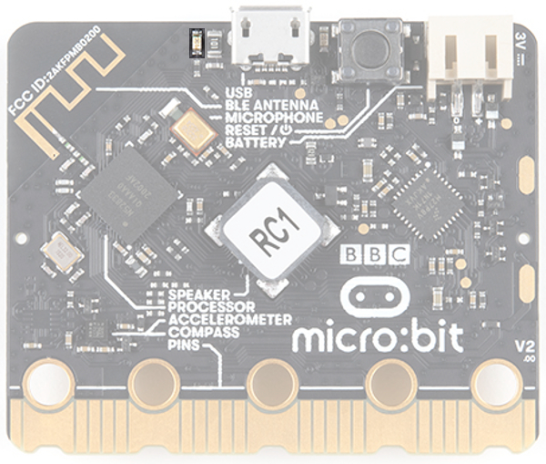

#### リセットボタン

micro:bitをリセットし、コードを最初からやり直すためのボタンである。

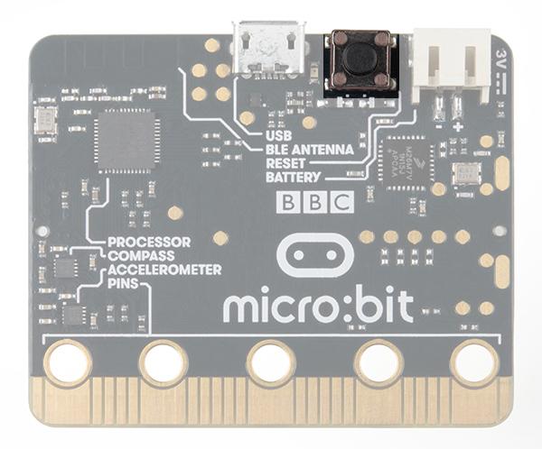
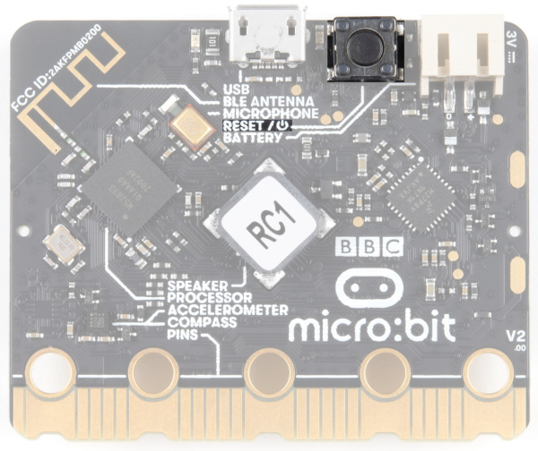

*左：micro:bitのリセットボタン　右：micro:bit v2のリセット・電源ボタン*

> **注意：** micro:bit V2のリセットボタンは、micro:bitを「オフ」にする電源ボタンとしても機能する。
> 厳密には、ボタンを5秒間押し続けると、ディープスリープモードになる。
> 詳しくは、[micro:bit V2のリセットボタンに関するMakeCodeの記事](https://support.microbit.org/support/solutions/articles/19000106820-reset-the-micro-bit)を確認してほしい。

#### JSTバッテリーコネクタ

外部のバッテリーパックをmicro:bitに接続するためのコネクタである。

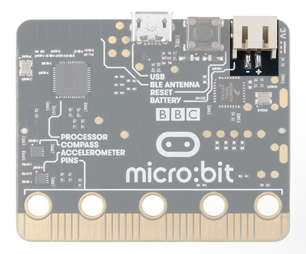
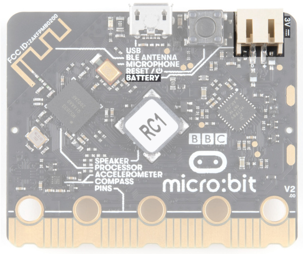

*左：micro:bitのJSTコネクタ　右：micro:bit v2のJSTコネクタ*

> **警告：** JST-PHコネクタは通常LiPoバッテリーで使われる。
> LiPoバッテリーは、2xAAや2xAAAのバッテリーパックで使う電池とは電池化学・電圧が異なる。
> LiPoバッテリーの電圧を調整する電圧レギュレータを持っていない限り、micro:bitのJST-PHコネクタにはAAまたはAAA電池のみを使うこと。

#### V2限定：マイクロホン

micro:bitのV2には、別のデバイスを接続しなくても音を検知できるMEMSマイクロホンが搭載されている。
ボードの表面をもう一度見ると、マイク入力が裏面のこの部品につながっていることに気づくはずである。

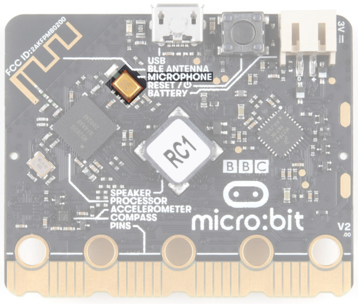

#### V2限定：スピーカー

micro:bitのV2には、ボード裏面に内蔵スピーカーも搭載されている。
エッジピンに接続した外部スピーカーを使いたい場合は、使用するプログラミング言語で内蔵スピーカーの設定を行う必要がある。

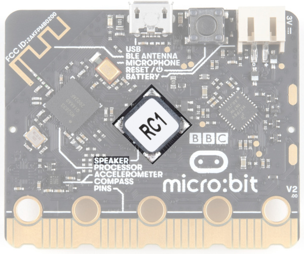

これだけの機能が詰まっている。まさに万能ナイフである。

> **注意：** より詳しいハードウェア情報については、micro:bit Foundationによる公式のHardware Overviewも確認してほしい。
> [micro:bit Foundation: Hardware Overview](https://tech.microbit.org/hardware/)

## 接続する

micro:bitは、コンピュータやChromebookに接続するのにmicro USBケーブルを使う。
ケーブルをmicro:bitに差し込み、もう一方の端を空いているUSBポートに差し込むだけでよい。

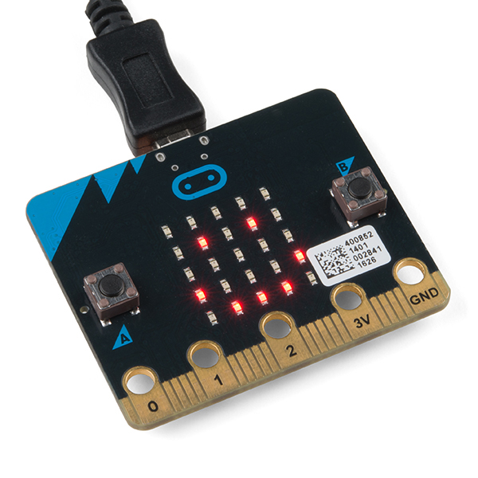

ボードを接続すると、micro:bitの裏面にある小さな黄色のLEDが点灯し、数回点滅することがある。
続いて、micro:bitにすでに書き込まれているプログラムが実行され始める。
初めてmicro:bitを接続した場合は、しばらく触ってみてほしい。ボタンを押したり、振ったりすると、ちょっとした隠し要素に出会えるはずである。

micro:bitが起動したら、Macの場合は**Finder**を、PCの場合は**マイコンピュータ**を確認してほしい。
micro:bitは、2つのファイルが保存された外部ストレージデバイスとして表示されるはずである。

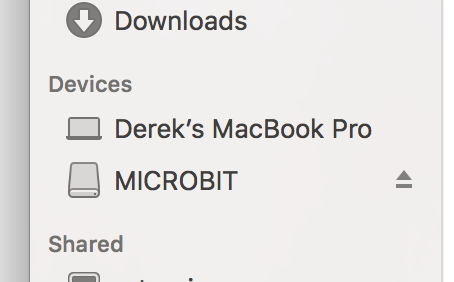

Chromebookを使っている場合は、micro:bitを接続するとドライブを開くダイアログボックスが表示される。
遠慮なく開いて、動作を確認してみてほしい。

さあ、プログラミングを始めよう。

## MakeCodeを使う

このガイドと、SparkFunが提供するmicro:bit関連コンテンツのほとんどは、Microsoftによる[MakeCode](https://makecode.microbit.org/)を使ってプログラミングを行う。

### MakeCodeとは何か

MakeCodeは、micro:bit向けに、そして[他のボード](https://makecode.com)向けにもMicrosoftが構築したオープンなプログラミング環境である。
次のリンクから、micro:bit用のMakeCodeへ移動できる。

[MakeCodeを起動する](https://makecode.microbit.org/)

MakeCodeを起動すると、ブラウザのウィンドウを最大化した状態では、左側にシミュレータ、右側にブロックベースの環境が配置された基本レイアウトが表示される。

MakeCodeには、次のような機能が用意されている。

- **プロジェクト**：アカウントの設定不要で、コンピュータに接続されたクラウドストレージシステム
- **シェア**：さまざまな方法でプロジェクトのコードを友人と共有できる
- **Blocks/JavaScript/Python**：ブロック（デフォルト）とJavaScriptのどちらでプログラミングするか、自分で選べる。Microsoftは、後にコードをMicroPythonへ変換する追加オプションも用意した
- **プログラム領域**：魔法が起きる場所、プログラムを組み立てる場所、つまり「コードを作る（make code）」場所である
- **ズーム／元に戻す・やり直す**：元に戻したり、ズームアウトして全体を見渡したりするためのボタン
- **名前を付けて保存**：プログラムに名前を付けて保存（コンピュータにダウンロード）する
- **ダウンロード**：保存と似ているが、プログラムを.hexファイルとしてダウンロードし、micro:bitへドラッグする
- **シミュレータの表示/非表示**：好みに応じてシミュレータを表示・非表示にできる
- **ブロックライブラリ**：プログラムを組み立てるためのブロックの選択肢一覧。機能ごとに色分けされている
- **シミュレータ**：ハードウェアは不要である。MakeCodeにはリアルタイムのシミュレータが用意されている。プログラムを変更すると、この仮想micro:bit上でその動作を確認できる

さて、これで選択肢ができた。ブロックにするか、テキストベースのプログラミングにするか。

### ブロックかテキストか

このガイドと、SparkFunが提供するmicro:bit関連コンテンツの大部分では、ブロックベースのプログラミングによるサンプルを使う。

ただし、選びたければJavaScript（およびMicroPython）のオプションも使える。
選択は自由であり、うれしいことに同じプログラムの中で両者を行き来できる。片方を変更するともう片方にも反映されるため、プログラミングに慣れていない場合には特にありがたい機能である。

### シミュレータ

MakeCodeにはmicro:bit用のシミュレータが用意されている。
つまり、手元にmicro:bitがなくてもコードを書ける。
あるいは、micro:bitにアップロードする前にアイデアを試してみたい場合にも使える。

コードを組み立てるにつれてシミュレータも更新される。
最初から実行し直したい場合は、停止ボタンと実行ボタンをクリックすればやり直せる。

コードの話が出たところで、さっそく簡単なプログラムを書いてmicro:bitに書き込んでみよう。

## Hello, World!

いよいよ本番である。MakeCodeプログラミング環境で、micro:bit向けの最初のプログラムを書いていく。

*「Hello World」*とは、あるプログラミング言語や新しいハードウェアで最初に書くプログラムを指す言葉である。
本質的には、学習の第一歩として、（うまくいけばだが）ちょっとした達成感を与えてくれるシンプルなコードのことである。
また、すべてが正しく動作しているかを確認する機会にもなる。

最初の「Hello World」として、LEDアレイ上に、永遠に繰り返されるシンプルなアニメーションを作成する。
完成したプログラムだけが欲しい場合は、こちらで確認できる。
プログラムをどう組み立てたか、その手順を1つずつ確認したい場合はこのまま読み進めてほしい。

### 「Hello World」を組み立てる

micro:bitでの「Hello World」は、Arduinoなどのボードでよくあるようなふつうのマイクロコントローラーとは少し違う。
micro:bitには、単体で点滅させられるような単一のLEDはない。
その代わりにmicro:bitが持っているのは、LEDアレイである。
そのため、micro:bitでの「Hello World」は、LEDアレイを使って何かを描くことになる。

MakeCodeを開くと、`On Start`ブロックと`forever`ブロックという2つのブロックが表示される。
`On Start`ブロックは、プログラムの一番最初に一度だけ実行されるコードすべてを収める。
`forever`ブロックは、何度も何度も、永遠にループするコードである。

この「Hello World」を組み立てるには、`forever`ブロックを使う。
ここから、`forever`にブロックを追加していく必要がある。

まず、「Basics」のカテゴリをクリックする。
これらのブロックは、MakeCodeプログラムの基本的な構成要素である。
クリックすると、いくつかの選択肢が展開される。
`show leds`ブロックをクリックしてドラッグし、`forever`ブロックの中に配置する。
このブロックは`forever`ブロックの中にぴったりはまるようになっており、コンピュータの音量を上げていれば、ブロックを離したときに気持ちのよい「カチッ」という音が聞こえるはずである。

`show leds`ブロックには、LEDアレイを表す四角形の並びがある。
四角をクリックすると赤くなり、これはそのLEDが「点灯」していることを意味する。
LEDを個別にオン・オフしてシンプルなピクセルアートの形を描いてみよう。ウィンドウ左側にあるシミュレータで、その結果を確認できるはずである。

この静止画像をアニメーションに変えるには、最初のブロックのすぐ下にもう一つの`show leds`ブロックを配置する必要がある。
続いて、この四角形の並びで2枚目の絵を作る。
シミュレータでは、画像が非常に速く切り替わる様子が見られるはずである。これを遅くする必要がある。

アニメーションを遅くするには、Basicのブロックセットにある`pause`ブロックを使う。
`pause`ブロックは、その名前のとおりの働きをする。micro:bitに、一時停止して指定した時間だけ待つよう指示する。
図のように、プログラム内に2つの`pause`ブロックを配置する。

このプログラムはループになっているため、`pause`ブロックを2つ使い、そのうち1つを末尾に配置している。
末尾にこのブロックがないと、アニメーションの画像が非常に速く切り替わってしまう。

次の節では、このサンプルを組み立てているので、ファイルをダウンロードして自分のmicro:bitで試すことも、シミュレータを使うこともできる。
コードをいじって変更を加えたい場合は、ウィジェット内のEditボタンをクリックすれば、「Hello World」を改造できるMakeCodeエディタが開く。楽しんでほしい。

## プログラムをmicro:bitに書き込む

MakeCodeで最初のプログラムを組み立て、シミュレータでも動作した。
では、これをどうやってmicro:bitに書き込めばよいのだろうか。

### プログラムをダウンロードする

プログラムに満足したら、MakeCodeのDownloadボタンをクリックする。

これにより、プログラムファイルが、標準のダウンロード先（おそらくコンピュータの**Downloads**フォルダか、ダウンロード設定で指定した場所）にダウンロードされる。

あとは、ダウンロードしたプログラムファイルを、外部デバイスとして表示されているmicro:bitのドライブへクリック＆ドラッグするだけでよい。

これで完了である。

micro:bitは数秒間点滅し、その後プログラムが自動的に開始する。よし、成功である。

> **注意：** シミュレートされた回路を表示するには、広告・ポップアップブロッカーを無効化する必要がある場合がある。

## MakeCodeエクステンション

> **注意：** 以前、これらのライブラリはMakeCodeパッケージと呼ばれていた。現在は[MakeCodeエクステンション](https://makecode.com/extensions)と呼ばれている。

以前Arduinoを使ったことがあれば、ライブラリと呼ばれるものをご存じだろう。これは、コアとなるプログラミング言語の機能を拡張するコード群のことである。
MakeCodeエクステンションも同じような働きをする。

ArduinoライブラリとMakeCodeエクステンションには、いくつか大きな違いがある。
その一つが、MakeCodeエクステンションにはJavaScript関数が含まれており、テキストでプログラミングする際にも使える点である。もちろん、ブロック方式でプログラミングするために必要なブロックもすべて揃っている。
これにより、新しいエクステンションの学習・利用が簡単になり、思い描いたプロジェクトを組み立てるまでの時間を短縮できる。

利用可能なMakeCodeエクステンションはいくつもある。
以下の手順では、Controller:bitのMakeCodeエクステンションを例にしているが、他のエクステンションを追加する場合も同じ手順で進められる。

### MakeCodeエクステンションをインストールする

MakeCodeのツールボックス（さまざまなブロックグループの一覧）に新しいエクステンションをインストール・追加するには、「**Advanced**」をクリックし、続いて「**Add Extension**」をクリックする。

そこから「**SparkFun**」または「**SparkFun gamer-bit**」を検索すると、一覧に公開エクステンションとして表示されるはずである。
それをクリックする。

> **注意：** 特定のエクステンションが見つからない場合は、そのエクステンションがまだ承認・公開されていない可能性がある。
> エクステンションが名前で検索できるようになるまでには、micro:bit Educational Foundationによる承認に時間がかかる。
> この承認プロセスの要件の一部には、稼働中の製品ページが必要という条件も含まれる。
> そのため、一部の製品のローンチ時点では、エクステンションがまだ承認されていないことがあり、その場合エクステンションを追加する唯一の方法は、pxt-packageのGitHubリポジトリへのリンクを使い、そのURLをエクステンション検索ボックスに貼り付けることである。
> MakeCodeエディタはそれを見つけ出し、誰でもプロジェクトに追加できるようにする。

これで、ツールボックスにすべてのブロックが追加される。
一般に、これはエクステンションがどう書かれているかによって、独自のツールボックスを持つ場合と、既存のツールボックスにブロックを追加するだけの場合があり、少しわかりにくいことがある。
ツールボックスを確認してみよう。gamer:bitの場合は、次のように表示されるはずである。

これで、gamer:bitエクステンションのインストールが完了した。
micro:arcadeキットを購入した場合は、これでボードとキット付属の部品を使う準備が整った。
なお、新しいMakeCodeプロジェクトを作るたびに、エクステンションを毎回読み込み直す必要がある。大した手間ではないが、覚えておく価値はある。

### エクステンションを更新する

公開されているサンプルコードや保存された**\*.hex**ファイルは、アーカイブされたバージョンのエクステンションを使っている。
時折、MakeCodeエディタ側にもエクステンション側にも更新が入ることがある。
コンパイルエラーや新機能のためにエクステンションを最新版に更新する必要がある場合、更新方法は2通りある。
一つは、エクステンションが提供するすべてのブロックを削除し、上で説明した手順どおりにエクステンションを再インストールする方法である。
コードの長さや、ブロックがいくつも組み合わさっている場合には、この方法は面倒になることがある。
もう一つの方法は、JavaScriptビューでバージョン番号を更新することである。
この方法には、組み合わさったブロックを手作業で削除する必要がないという利点がある。

以下は、以前のgamer:bitエクステンションでコンパイルできていた公開サンプルの例である。
MakeCodeエディタの更新により、以前のバージョンのMakeCodeエディタでは見過ごされていたgamer:bitエクステンションのバグが原因で、エラーが発生するようになった。
その後gamer:bitエクステンションにパッチが適用されたため、このエラーを修正するには、サンプルを最新版に更新する必要がある。

上部の**JavaScript**ボタンを切り替えて、JavaScriptビューに切り替える。
左側には**Explorer**メニューが表示される。矢印をクリックしてメニューを展開する。

MakeCodeエクステンションのバージョン番号までスクロールする。
ここで、エクステンションのバージョンを削除したり更新したりできる。
コードがgamer:bitエクステンションに依存しているため、バージョン番号を更新する必要がある。
更新記号とバージョン番号が書かれたボタンをクリックする。

この時点で、クラウドから最新のバージョン番号を取得するまで数秒待つ。
その後、Explorerメニューを再度開く。
更新があれば、エクステンションが更新され、最新版が使われるようになる。
この例では更新があったため、v0.0.8が取得された。
コードの問題数を示す赤いボックスの数字も消えていることに気づくはずである。

すべてが問題なく進んでいるか確認しよう。
**Blocks**ビューに戻ると、三角形で示されていたエラーが消えている。
これで、MakeCodeエクステンションの更新が完了し、コーディングを再開できる。

> #### エクステンションを作る
>
> 自分だけのカスタムエクステンションを作ることに興味がある開発者・上級プログラマーは、[以下のチュートリアル](./how-to-create-a-makecode-package-for-microbit.md)でさらに詳しい情報を確認してほしい。
>
> - [micro:bit用のMakeCodeパッケージを作る](./how-to-create-a-makecode-package-for-microbit.md) — Microsoft MakeCodeでmicro:bit用のコードブロックを開発する方法を学ぶ

## micro:bitに電源を供給する

micro:bit上でプログラムが動いているが、まだコンピュータに接続されたままである。
これを解決する方法はいくつもある。電池、電池、そしてさらに電池である。

> **micro:bitへのリモート電源の追加について、さらに詳しく知りたいだろうか？micro:bit Foundationによるこれらのアプリケーションノートを確認してほしい。**
>
> [micro:bit Foundation: Power Supply](https://tech.microbit.org/hardware/powersupply/)

### USBバッテリーパック

USBバッテリーパックは、今やごく一般的なものになってきている。
これを使えば、micro:bitプロジェクトをかなり長時間動かし続けられる。

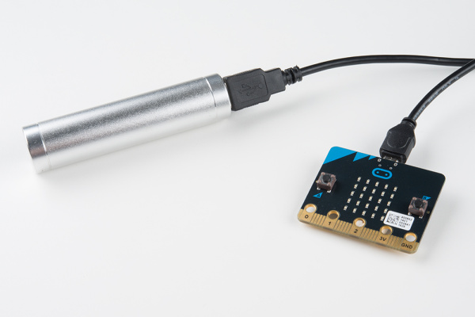

長いケーブルを引きずり回さずに済むよう、[短めのUSBケーブル](https://www.sparkfun.com/products/13244)を用意しておくと便利である。

### 2xAAバッテリーパック

> **警告：** JST-PHコネクタは通常LiPoバッテリーで使われる。
> LiPoバッテリーは、2xAAのバッテリーパックで使うAA電池とは電池化学・電圧が異なる。
> LiPoバッテリーの電圧を調整する電圧レギュレータを持っていない限り、micro:bitのJST-PHコネクタにはAA電池のみを使うこと。

教室での利用など、多数のmicro:bitに長時間にわたって電力を供給したい場合には、JST-PHコネクタ付きの2xAAバッテリーホルダーが優れた解決策になる。

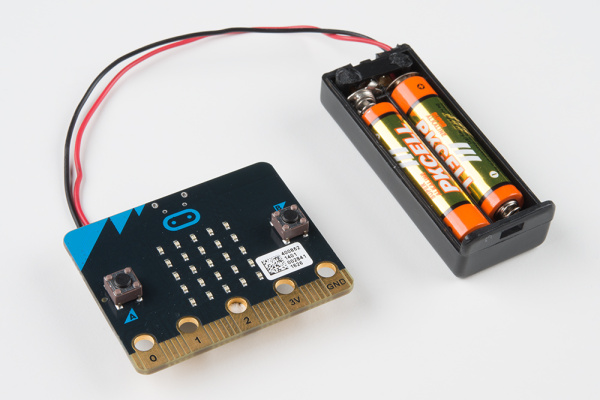

これらの電池は、まとめ買いすればかなり安価に購入できる。

### 2xAAAバッテリーパック

> **警告：** JST-PHコネクタは通常LiPoバッテリーで使われる。
> LiPoバッテリーは、2xAAAのバッテリーパックで使うAAA電池とは電池化学・電圧が異なる。
> LiPoバッテリーの電圧を調整する電圧レギュレータを持っていない限り、micro:bitのJST-PHコネクタにはAA電池のみを使うこと。

もっと小さなバッテリーホルダーが欲しい場合は、JST-PHコネクタ付きの2xAAAバッテリーホルダーを探してみてほしい。
micro:bit Go bundleにも1つ付属している。

もう一つ、スイッチ付きのJST-PHコネクタ2xAAAバッテリーホルダーもある。
このスイッチが追加されていることで、micro:bitからJST-PHコネクタを揺さぶって外す必要なく、micro:bitプロジェクトの電源を簡単にオン・オフできる。

## まとめ・参考資料

> **注意：** micro:bitのファームウェアを改造していて、MakeCodeでコードのアップロードに問題がある場合は、[ファームウェアの再インストール](https://microbit.org/guide/firmware/)を試してみてほしい。
>
> [micro:bit Foundation: Updating your micro:bit firmware](https://microbit.org/guide/firmware/)

micro:bitの基礎に慣れてきたら、さらなるインスピレーションのために以下のリソースも確認してほしい。

- [microbit.org](http://microbit.org/)
  - [About micro:bit](http://microbit.org/about/) — micro:bit foundationに関する情報
  - [Hardware](http://microbit.org/hardware/) — 技術情報と適合性情報
  - [Quickstart Guide](http://microbit.org/guide/) — micro:bit foundationによる追加の入門ガイド
  - [Activities](http://microbit.org/ideas/) — micro:bitのウェブサイトで公開されているプロジェクト
  - [Projects](https://makecode.microbit.org/projects) — micro:bitで作れるプロジェクト
  - [Apps](http://microbit.org/code/) — micro:bitアプリを使うと、Bluetoothでワイヤレスにコードをmicro:bitへ送信できる。ケーブルは不要である。micro:bit向けの他のプログラミング環境の一覧も含まれる
  - [Educator Teaching Resources](http://microbit.org/teach/#resources-section) — 教育者向けのリソース。micro:bitを使った授業向けアクティビティ
- [Code Club Activities](https://www.codeclubprojects.org/en-GB/microbit/) — Code Clubによる6つのアクティビティ
- [BBC micro:bit - Kitronik University](https://www.kitronik.co.uk/blog/bbc-microbit-kitronik-university/) — さらなるmicro:bitチュートリアル
- [Kitronik's Guide to micro:bit vs micro:bit v2](https://kitronik.co.uk/blogs/resources/explore-micro-bit-v1-microbit-v2-differences)
- [Fritzing Part](https://github.com/microbit-foundation/dev-docs/issues/36#issuecomment-292777097) — チュートリアルで使われている赤色のFritzingパーツについては、このリポジトリでリンクされているユーザー投稿パーツを確認してほしい
- [SparkFun micro:bit Landing Page](https://www.sparkfun.com/pages/microbit)

micro:bit単体を使った追加のプロジェクトアイデアが欲しければ、micro:climateキットの光量読み取り実験も確認してみてほしい。

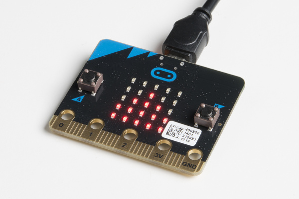

*micro:climate Experiment 2 - Reading Light Level*

その他のSparkFunチュートリアルとして、関連するmicro:bitチュートリアルもいくつか紹介する。

- Gator:color ProtoSnap Hookup Guide — gator:bitにgator:colorでLEDをクリップ接続する
- SparkFun gator:environment Hookup Guide — 温度、湿度、気圧、eCO2、eTVOCの値を測定する2つのI2Cセンサーを組み合わせたgator:environment。micro:bitプラットフォームでの使い始め方を解説する
- [micro:bit用のMakeCodeパッケージを作る](./how-to-create-a-makecode-package-for-microbit.md) — Microsoft MakeCodeでmicro:bit用のコードブロックを開発する方法を学ぶ
- SparkFun gator:log Hookup Guide — シリアル通信ベースのデータロガーであるgator:log。micro:bitプラットフォームでの使い始め方を解説する

タグ: Bluetooth、教育、Hookup、MakeCode、microbit、micro:bit、モーション、pxt、センサー

---

出典：[Getting Started with the micro:bit](https://learn.sparkfun.com/tutorials/getting-started-with-the-microbit)（SparkFun Learn）を日本語に翻訳し、再構成した。
原文は [CC BY-SA 4.0](https://creativecommons.org/licenses/by-sa/4.0/) ライセンスで公開されており、本ページも同ライセンスの下で提供する。
