# MyoWare 2.0筋電センサー・エコシステムを始める

> **注意：** このチュートリアルは、MyoWare 2筋電センサーとそのエコシステムを対象にしている。MyoWare 2筋電センサーは、MyoWare 2.0筋電センサーと完全な後方互換性がある。スナップが2つしかない「V1」バージョンを使っている場合は、古いMyoWare Muscle Sensor V1のチュートリアルを参照してほしい。

筋肉を使って何かを操作するというのは、私たちの多くにとって馴染み深いやり方である。
ボタンを押し、レバーを引き、ジョイスティックを動かす。
しかし、そのボタンやレバーやジョイスティックを取り払い、筋肉そのもので操作できたらどうだろうか。
[MyoWare 2.0筋電センサー](https://www.sparkfun.com/products/21265)は、Advancer Technologies社によるArduino互換のオールインワン筋電図（EMG）センサーであり、まさにそれを可能にする。
MyoWare 2.0筋電センサーはゼロから設計し直され、使いやすくコンパクトなデザインに一新されているほか、最新かつ最良のチップセットにアップグレードされ、センサーの性能と信頼性が向上した。
革新的なスナップコネクタシステムにより、[MyoWare 2.0エコシステム](https://www.sparkfun.com/myoware)の接続に、はんだ付けは一切不要になった。
使い方はとても簡単で、電極パッド（別売）を貼り、出力電圧を読み取り、筋肉を動かすだけでよい。
このチュートリアルでは、センサーの機能と関連するシールドについて紹介し、筋群への接続方法を解説する。

> **注意：** このセンサーは、人間や動物の疾患やその他の症状の診断、あるいは疾患の治療・緩和・予防を目的とした使用は意図していない。

- MyoWare 2筋電センサー
- MyoWare 2.0 Link Shield
- MyoWare 2.0 Cable Shield
- MyoWare 2.0 Arduino Shield
- MyoWare 2.0 Power Shield
- MyoWare 2.0 LED Shield（廃盤）

> **注意：** MyoWare 2.0エコシステムは、[Advancer Technologies, LLC](http://myoware.com/)の筋電計測の専門家によって設計され、[SparkFun Electronics](https://www.sparkfun.com/)が基板の製造・販売を担当している。

## 必要な部品

このチュートリアルに沿って進めるには、以下の部品が必要になる。
持っているものによっては、すべてが必要になるとは限らない。
カートに追加し、ガイドを読み進めながら、必要に応じてカートを調整してほしい。
筋群に接続するたびに、筋電センサー1台につき最低でも3枚の生体医療用センサーパッドが必要になる。

> **注意：** EMGパッドは使い捨てである。筋群に接続するたびに、予備のパッドを用意しておくこと。

### 最小限の部品構成

筋電センサーを接続・給電するには、最低限次の部品が必要になる。筋肉の信号はENV LEDで確認できる。

- MyoWare 2筋電センサー
- Disposable Surface EMG/ECG/EKG Electrode - 24mm（10個入り）
- MyoWare 2.0 Power Shield
- Reversible USB A to C Cable - 2m

### LEDセグメントで筋肉信号の大きさを表示する

筋電センサーを接続・給電するには、以下の部品が必要になる。筋肉信号の大きさはLEDセグメントで確認できる。

- MyoWare 2筋電センサー
- Disposable Surface EMG/ECG/EKG Electrode - 24mm（10個入り）
- Reversible USB A to C Cable - 2m
- MyoWare 2.0 LED Shield（廃盤）

> **注意：** これらの部品は[Basic Kit](https://www.sparkfun.com/products/21267)としてもまとめて入手できる。こちらにはReference Cableとドライバーも含まれている（廃盤）。

### Arduinoへの接続

基板同士をはんだ付けせずに5V Arduinoへ接続するには、以下が必要になる。Arduinoに接続すると、センサーデータを処理してデバイスを制御したり、Arduino Serial Plotterで信号を確認したりできる。

- MyoWare 2筋電センサー
- Disposable Surface EMG/ECG/EKG Electrode - 24mm（10個入り）
- MyoWare 2.0 Link Shield
- SparkFun RedBoard Plus
- MyoWare 2.0 Arduino Shield
- Reversible USB A to C Cable - 2m
- Audio Cable TRS - 1m

> **注意：** RedBoard Plusの代わりにArduino Unoを使うこともできる。その場合は、RedBoard PlusとUSBケーブルを次のものに置き換える。
>
> - Arduino Uno - R3
> - USB Cable A to B - 6 Foot

これらの部品は[Development Kit](https://www.sparkfun.com/products/21269)としてもまとめて入手できる。このキットには、筋電センサー、Cable Shield、Power Shield、LED Shield、Link Shield、Arduino Shield、RedBoard Plus、それぞれのケーブルが含まれる（廃盤）。

### ワイヤレスで送信する

Arduino経由でセンサーデータをワイヤレス送信するには、以下が必要になる。
ワイヤレス送信の選択肢の一つがArtemisである。
もちろん、最低でもRedBoard Artemis 2台とUSBケーブル2本が必要になる。
電池で駆動するRedBoard Artemisごとに、電池ホルダー1個と単三電池4本も必要になる。
Example 3に沿って進めるには、以下の部品を推奨する。

- MyoWare 2筋電センサー
- Disposable Surface EMG/ECG/EKG Electrode - 24mm（10個入り）
- MyoWare 2.0 Link Shield
- MyoWare 2.0 Arduino Shield
- Battery Holder - 4xAA to Barrel Jack Connector
- Reversible USB A to C Cable - 2m
- SparkFun RedBoard Artemis
- Audio Cable TRS - 1m
- Panasonic Alkaline Battery - AA

> **注意：** 充電式電池を使いたい場合は、アルカリ電池の代わりにNiMH電池も使える（Tenergy T4s Intelligent Universal Charger - 4-Bay、2500 mAh NiMH Battery - AA〔廃盤〕）。

Artemisの代わりにESP32を使うこともできる。この場合はESP32ボードと電池が必要になる。
ありがたいことに、必要なものがすべて揃った[MyoWare 2.0 Muscle Sensor Wireless Kit](https://www.sparkfun.com/products/25332)も用意されている（廃盤）。

### アクセサリー

セットアップによっては、ハードウェアと筋群の間を延長するために以下のアクセサリーが必要になることがある。

- Sensor Cable - Electrode Pads（3コネクタ）
- MyoWare 2.0 Cable Shield
- MyoWare 2.0 Reference Cable

### 道具

基板同士を簡単に取り外すには、マイナスドライバーの使用を推奨する。
次のドライバーは、積み重ねた基板を互いに取り外すのに使える。
使用するArduinoによっては、ロジックレベル用のジャンパーパッドを変更する際にホビーナイフ、はんだ、はんだごても用意しておくとよい。

- SparkFun Mini Screwdriver
- Solder Lead Free - 15-gram Tube
- Hobby Knife
- Soldering Iron - 30W (US, 110V)

### その他に必要なもの

以下も必要になる。

- アルコール綿（イソプロピルアルコールと綿球）
- USBアイソレータ回路（任意）

### おすすめの読み物

以下の概念に馴染みがない場合は、続ける前にこれらのチュートリアルを確認しておくことを推奨する。
使用するArduino開発ボードによっては、ドライバーのインストールが必要になることがある。
RedBoardシリーズは、Arduino Unoとは異なるUSB-シリアル変換チップを使っている。
Arduino UnoとRedBoard Plusは、どちらもロジックレベルに5Vを使う。

- アナログ-デジタル変換 (ADC) — 世界はアナログである。デジタルデバイスが世界を解釈できるよう、アナログ-デジタル変換を活用する
- [ロジックレベル](./logic-levels.md) — 3.3Vデバイスと5Vデバイス、それぞれのロジックレベルの違いを学ぶ
- How to Install CH340 Drivers — Windows、Mac OS X、Linuxで（必要であれば）CH340ドライバをインストールする方法
- RedBoard Plus Hookup Guide — RedBoard Plusの基本的な機能を扱うチュートリアル。LEDを点滅させる基本的な使い方や、Qwiicシステムの使い方も解説する

センサーデータをBluetooth®接続でワイヤレス送信したいユーザーには、RedBoard Artemisを入手し、ボード定義をインストールすることを推奨する。RedBoard Artemisは、ロジックレベルに3.3Vを使う点に注意してほしい。

- Hookup Guide for the SparkFun RedBoard Artemis — RedBoard Artemisの使い始め方。おなじみのUno R3のフォームファクタに、SparkFun Artemisモジュールのすべての機能を詰め込んでいる
- Installing Board Definitions in the Arduino IDE — カスタムのArduinoボード・コアはどうやってインストールするのか。とても簡単である。このチュートリアルでは、Arduino Board Managerを使ってArduinoボード定義をインストールする方法を扱う。SparkFunの開発ボードの多くに必要となるボード定義など、サードパーティ製コアを手動でインストールする方法も扱う

## 新機能

MyoWare 2.0エコシステムは、これまでの筋電センサーの設計をさらに発展させたものである。エコシステムに加えられた主な変更点は次のとおりである。

- **回路の刷新**：MyoWare 2.0筋電センサーはゼロから設計し直された。回路は最新かつ最良のチップセットに刷新され、センサーの性能と信頼性が向上している。
- **革新的なスナップコネクタシステム**：センサーとそのシールドに内蔵されたオス・メスのスナップコネクタにより、はんだ付けが一切不要になった。表側のコネクタはシールドを電源とセンサーのEMGエンベロープ出力に接続し、裏側のコネクタはCable Shieldの入力電極に接続する。
- **コンパクト**：スナップコネクタにより、シールドをMyoWare 2.0筋電センサーに積み重ねたときの高さも低く抑えられている。
- **キー構造**：基板上のグラウンドおよびリファレンスのスナップコネクタはわずかにオフセットされ、「キー」として機能するよう設計されている。筋電センサーとシールドにはこのキー構造があるため、基板同士を接続する方法は1通りしかない。
- **新しいシールド**：MyoWare 2.0 LinkとArduino Shieldは、Arduino Uno R3のフォームファクタを持つ開発ボードに、最大6台のMyoWare 2.0筋電センサーを簡単に接続できるよう設計されている。これにより、筋電センサーをArduinoに接続する際のはんだ付けも不要になる。必要なのは、筋電センサーごとに1本のTRS-TRSケーブルだけである。
- **MyoWare Power Shield**：以前のバージョンのPower Shieldはコイン電池を使っていた。刷新されたMyoWare 2.0 Power Shieldには、内蔵の充電式LiPoバッテリーが搭載されている。
- **MyoWare Proto Shield（非推奨）**：はんだ付け不要のシステムを目指したことで、MyoWare Proto ShieldはMyoWare 2.0エコシステムでは非推奨となった。

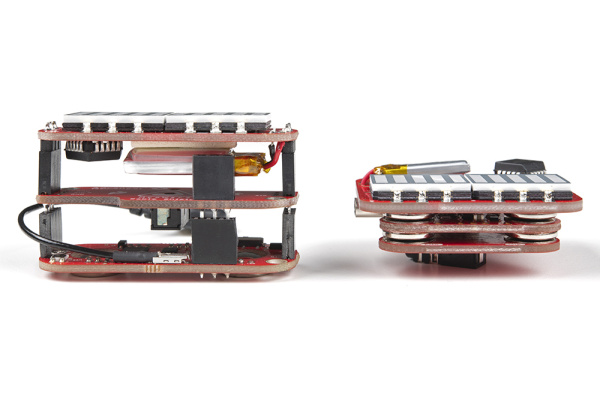
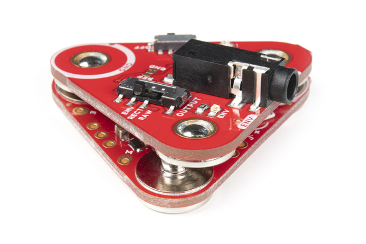

*左：比較のため積み重ねたV1とV2のシールド　右：キー構造により基板の誤った積み重ねを防止できる*

## 筋電図（EMG）とは何か

> 「MyoWareは、筋肉の電位を通じて筋活動を測定する。これは一般に表面筋電図（EMGまたはsEMGと略される）と呼ばれる。脳が筋肉を収縮させるよう指示すると、電気信号が筋肉に送られ、運動単位（筋肉が発生させる力の元となる筋線維の束）が動員され始める。
>
> 強く収縮させるほど、より多くの運動単位が動員され、より大きな筋力が発生する。運動単位の数が増えるほど、筋肉の電気的活動も増加する。MyoWareはこの電気的活動を解析し、筋肉がどれだけ強く収縮しているかを表すアナログ信号を出力する。強く収縮させるほど、MyoWareの出力電圧は高くなる。」――Advancer Technologies

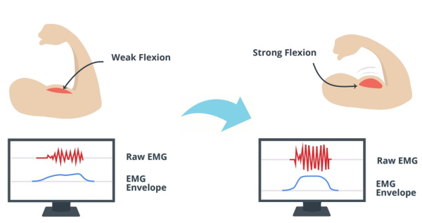

*画像提供：Advancer Technologies（MyoWare 2.0 Advanced Guideより）*

## MyoWare 2.0筋電センサー

> **注意：** このチュートリアルは、MyoWare 2筋電センサーとそのエコシステムを対象にしている。MyoWare 2筋電センサーは、MyoWare 2.0筋電センサーと完全な後方互換性がある。スナップが2つしかない「V1」バージョンを使っている場合は、古いMyoWare Muscle Sensor V1のチュートリアルを参照してほしい。

MyoWare 2.0筋電センサーは、Advancer Technologiesが手がけるArduino互換のオールインワン筋電図（EMG）センサーである。
革新的なスナップコネクタシステムにより、MyoWare 2.0エコシステムの接続にはんだ付けは一切不要になった。
使い方はとても簡単で、電極パッド（別売）を貼り、出力電圧を読み取り、筋肉を動かすだけでよい。
筋電センサーのスナップコネクタシステムにより、シールドを積み重ねるのも簡単になっている。
表側のコネクタは電源とセンサーのEMGエンベロープ出力に接続し、裏側のコネクタは入力電極に接続する。
筋肉の電位を検出して筋活動を測定する手法は、伝統的に医学研究で使われてきた。
しかし、より小型でより高性能なマイクロコントローラーや集積回路の登場に伴い、EMG回路やセンサーはビデオゲーム、ロボット工学、義肢といったさまざまな制御システムにも活用されるようになった。

> **注意：** このチュートリアルは、MyoWare 2筋電センサー（V2.1.0）とMyoWare 2.0筋電センサー（V2.0.1およびV2.0.4）の両方に適用される。

内蔵のスナップコネクタは、[生体医療用センサーパッド（10個入り）](https://www.sparkfun.com/products/12969)とよく合う。

### ハードウェア概要

> **注意：** 基板の表側にあるオスのスナップコネクタは「スタッド」コネクタ、裏側にあるメスのスナップコネクタは「ソケット」コネクタと呼ばれる。これらのスナップコネクタを扱う技術仕様書やガイドでは、この用語を目にすることがある。

基板の表側には回路とオスのスナップコネクタが配置されている。基板の裏側にはメスのスナップコネクタがある。

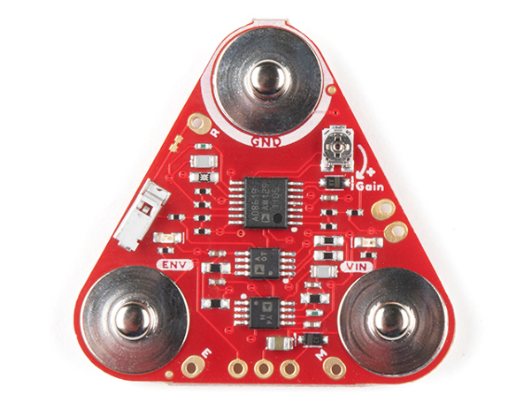
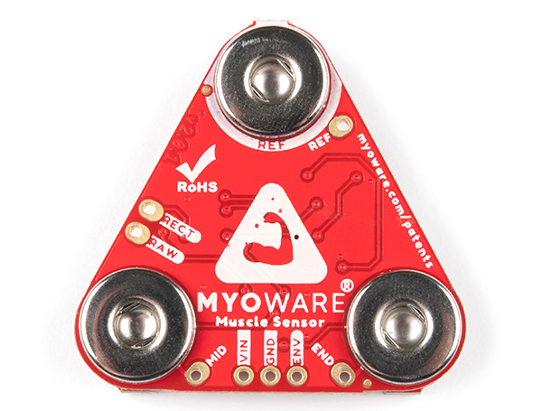

*左：表側　右：裏側*

#### アンプと可変ゲイン

MyoWare 2.0筋電センサーは、筋群からの微弱なEMG信号を測定する。
この信号はアンプ、バンドパスフィルタ、整流器、エンベロープ検出器を経由するため、ユーザーはマイクロコントローラーのADCピンを通じて筋活動を簡単に読み取れる。

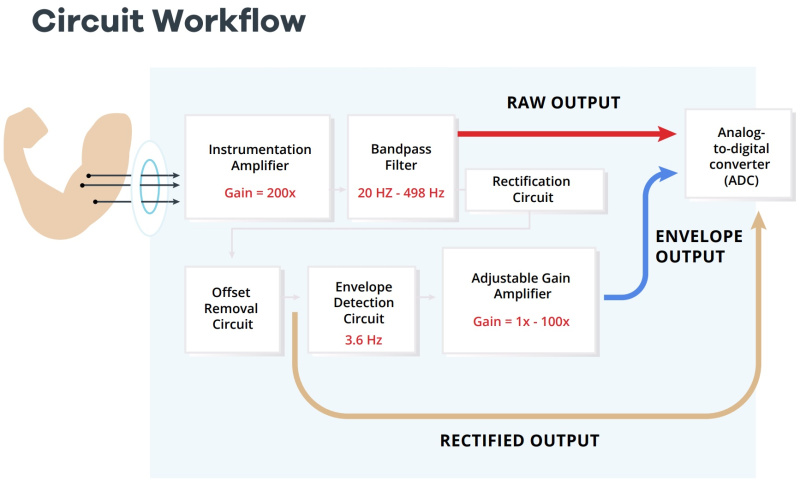

*画像提供：Advancer Technologies（MyoWare 2.0 Advanced Guideより）*

下の画像で強調表示されているICは、生のEMG信号の処理を助けるアンプである。
MyoWare 2.0 Advanced Guideによると、筋電センサーの技術仕様の一部は次のとおりである。

- **入力電圧**
  - 最小：+2.27V
  - 標準：+3.3Vまたは+5V
  - 最大：+5.47V
- **入力バイアス電流**：250pA、最大1nA
- **入力インピーダンス**：800
- **同相除去比（CMRR）**：140dB
- **フィルタ**
  - **ハイパスフィルタ**：アクティブ1次、fc = 20.8Hz、-20dB
  - **ローパスフィルタ**：アクティブ1次、fc = 498.4Hz、-20dB
- **整流方式**：全波整流
- **エンベロープ検出**：リニア、パッシブ1次、fc = 3.6Hz、-20dB

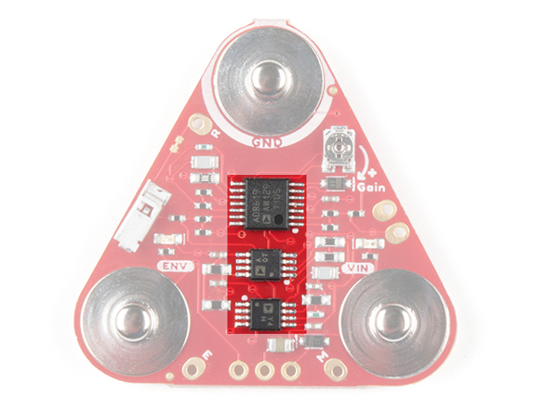

基板には、エンベロープ信号のゲインを手動で調整するためのポテンショメータ（トリムポット）が搭載されている。
調整にはドライバーが必要である。
もちろん、ポテンショメータにアクセスするには上に重ねたシールドを取り外す必要がある。
それぞれの信号のゲイン（G）は次のとおりである。

- **生信号（RAW）：** G = 200
- **整流信号（RECT）：** G = 200
- **エンベロープ（ENV）：** G = 200 × (R / 1kΩ)（Rはゲインポテンショメータの抵抗値・kΩ単位）

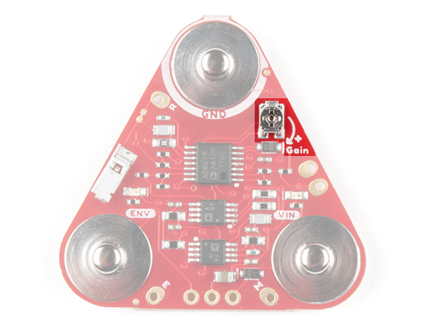

> **注意：** デフォルトのゲインは、ほとんどの用途で十分なはずである。とはいえ、上級ユーザーはドライバーを使い、ENV出力のトリムポットを希望のゲイン設定に調整できる。トリムポットを時計回りに回すとゲインが上がり、反時計回りに回すとゲインが下がる。トリムポットは回しすぎたり力をかけすぎたりすると破損することがあるため、回すときは注意すること。

下の画像は、生信号・整流信号・エンベロープ出力それぞれの波形を示している。
出力の右側のグラフは、生信号のパワースペクトルを示している。
MyoWare 2.0筋電センサーは、20Hz〜500Hzの範囲を持つ1次バンドパスフィルタを備えている。
この範囲は、生のEMG信号を捉えつつ、モーションアーチファクトのような不要な信号を除去するのに適している。
なお、表示されているデータはあくまで説明用であり、実際のデータではない。

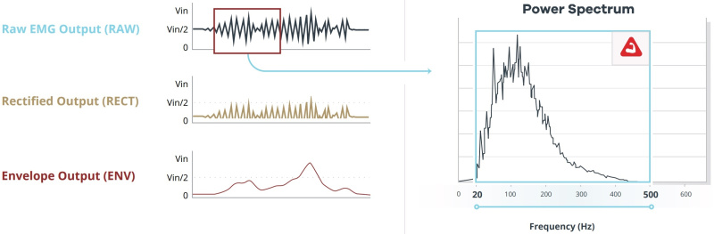

*画像提供：Advancer Technologies（MyoWare 2.0 Advanced Guideより）*

#### PTHパッド

基板を裏返すと、ラベル付けされたPTHパッドが見つかる。
[配線をはんだ付け](./how-to-solder-through-hole-soldering.md)してVIN、GND、ENVを接続する必要があるユーザー向けに、基板には0.1インチ間隔の1×3列のPTHパッドが用意されている。
さらに、RAW、RECT、REF、MID、ENDの各ピンも基板全体に引き出されている。
REF、RECT、RAWピンに配線をはんだ付けする際は、はんだを盛りすぎないよう注意すること。盛りすぎると、MyoWare 2.0 Link ShieldのポゴピンがPTHパッドに正しく接続できなくなることがある。

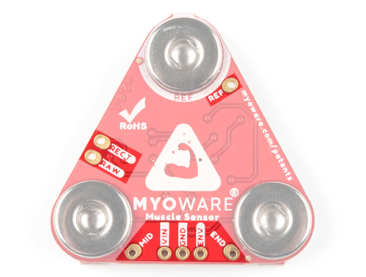

#### LED

基板には2つのステータスLEDが搭載されている。

- **VIN**：電源スイッチがONの位置に切り替わったときに点灯し、VINスナップピンを通じてMyoWare 2.0筋電センサーに電力が供給されていることを示す。
- **ENV**：MyoWare 2.0筋電センサーのENVピンに活動があるときに点灯する。

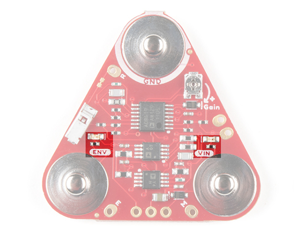

#### スナップコネクタ

基板には、MyoWare 2.0筋電センサーの上にシールドを簡単に積み重ねられるスナップコネクタが搭載されている。
基板の上部はわずかにオフセットされており、キーのように働くよう設計されているため、基板同士を接続する方法は1通りしかない。
基板同士を積み重ねる前に、GNDまたはREFのスナップコネクタの位置を揃えること。そうしないと、3つのスナップコネクタがうまく接続できない。

以下のオスのスナップコネクタが基板の表側にある。これらは基板裏側の1×3ヘッダーにも引き出されている。ピンのラベルを確認するには基板をひっくり返す。

- **GND**：MyoWare 2.0筋電センサーのグラウンド。
- **VIN**：MyoWare 2.0筋電センサーの電圧入力。この電圧は、スナップコネクタを使う際にどのシールドを上に重ねるかによって異なる。2つの電源から矛盾した電圧が加わらないよう、シールドを上に重ねる際はVINピンのPTHパッドを未接続のままにしておくこと。
  - MyoWare 2.0 Power ShieldまたはLED Shieldと組み合わせて使う場合、この電圧はLiPoバッテリーの充電状態によって変わる。充電用の電源に接続すると、充電ICがLiPoバッテリーの充電を開始し、システム電圧はおよそ4.2Vになることがある。安全上の理由から、バッテリーを充電する際は、常にこのシールドをセンサーから取り外しておくことを推奨する。
  - MyoWare 2.0 Link ShieldとMyoWare 2.0 Arduino Shieldと組み合わせて使う場合、この電圧はMyoWare 2.0 Arduino ShieldのPower Jumperの位置によって決まる。これにより、VINは5V（デフォルト）または3.3Vに設定される。
- **ENV**：0〜VINの範囲のエンベロープ信号。マイクロコントローラーのADCに接続する。

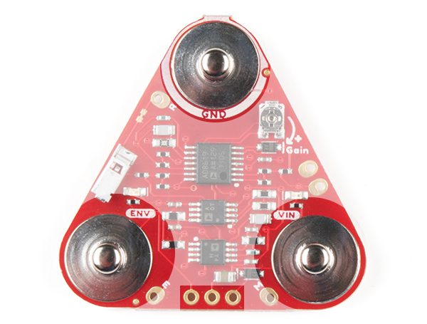

> **注意：** 上の写真で「E」とラベル付けされたPTHパッドは、END筋肉用スナップコネクタに接続されており、ENVスナップコネクタでは**ない**点に注意してほしい。

以下のメスのスナップコネクタが基板の裏側にある。これらは、それぞれのスナップコネクタの隣にあるPTHパッドに引き出されている。

- **REF**：リファレンス電極用スナップコネクタ。肘の骨の部分など、筋群に隣接しない体の別の部位に接続する。
- **MID**：筋肉中間電極用スナップコネクタ。筋群の中間部分に接続する。
- **END**：筋肉端部電極用スナップコネクタ。筋群の端部分に接続する。

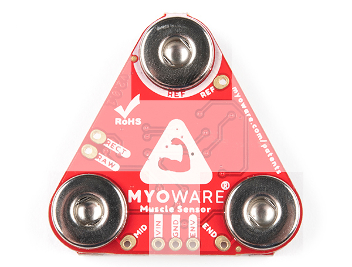

> **注意：** REF電極パッドが皮膚にしっかりと安定して接触しているか確認すること。接触が不十分だと動作に問題が生じることがある。

#### リファレンス電極ポート

> **注意：** 内蔵のリファレンススナップコネクタは、ほとんどの用途で十分なはずである。とはいえ、筋群への接続が難しい場合は、リファレンスケーブルの入手を推奨する。これは主に、大腿四頭筋やハムストリングスなど大きな筋群向けに用意されている。

基板には、リファレンスケーブルのかしめピンを挿入するためのハウジングがある。
このピンをハウジングに挿入し、生体医療用センサーパッドを電極スナップに取り付けることで、内蔵のリファレンスピンが届かない場合に、肘の骨の部分や対象の筋肉に隣接しない体の別の部位にリファレンスケーブルを貼り付けられる。

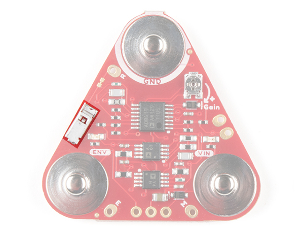

> **注意：** 基板上のリファレンススナップコネクタは、ケーブルを挿入していても有効なままである。ソケットを無効化するには、センサー表側のジャンパートレースを切断する。ソケットを再度有効化するには、ジャンパーパッドをはんだでブリッジする。ジャンパーの変更について詳しくは、ジャンパーパッドとPCBトレースの扱い方のチュートリアルを確認してほしい。

#### ジャンパー

リファレンスピンの隣に、「R」とラベル付けされた小さなジャンパーがある。
このジャンパーはデフォルトで閉じており、リファレンス電極コネクタに接続されている。
リファレンスケーブルを使う場合は、このトレースを必ず切断すること。
ジャンパーの変更について詳しくは、ジャンパーパッドとPCBトレースの扱い方のチュートリアルを確認してほしい。

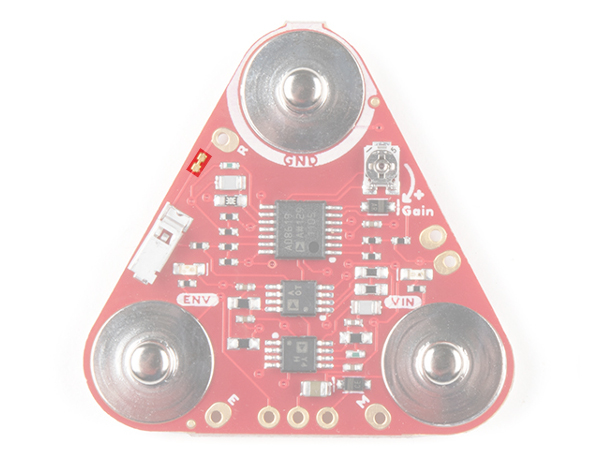

#### 基板寸法

MyoWare 2.0筋電センサーの基板寸法は37.57mm × 35.90mm（1.48インチ × 1.41インチ）である。

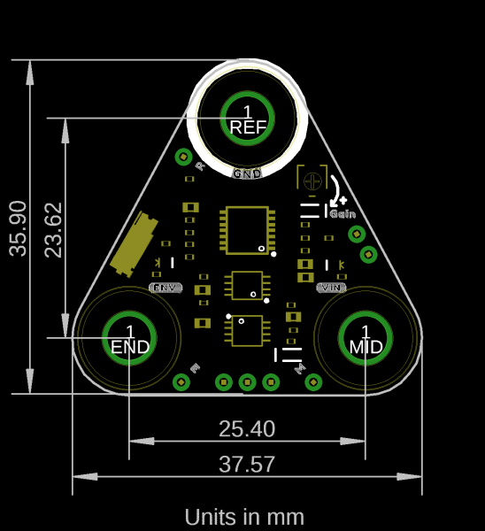

## MyoWare 2.0 Sensor Cover

MyoWare 2.0 Sensor Coverは、各MyoWare 2.0筋電センサーにあらかじめ取り付けられている。
シールドを上に積み重ねない限り、回路を保護するためこのカバーはセンサーに付けたままにしておくこと。

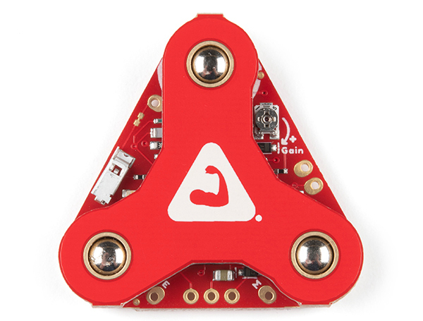

### ハードウェア概要

しゃれたデザイン以外、この基板にはあまり多くの要素はない。
[フィジェットスピナー](https://www.sparkfun.com/news/2402)によく似ている。もっとも、基板に組み込まれた圧入式スケートボードベアリングはないが。
基板には回路は実装されていない。
基板の表側にはAdvancer TechnologiesのMyoWareロゴが、裏側にはQRコードがある。
スマートフォンを取り出して[QRコードをスキャンし、MyoWareの公式サイト](http://myoware.com)を訪れてみるのも一興である。

### 基板寸法

Sensor CoverはMyoWare 2.0筋電センサーと同じフォームファクタを使っており、基板寸法は37.57mm × 35.90mm（1.48インチ × 1.41インチ）である。

## MyoWare 2.0 Reference Cable

MyoWare 2.0 Reference Cableは、MyoWare 2.0筋電センサーのリファレンスピンを延長するためのものである。
このピンをハウジングに挿入し、生体医療用センサーパッドを電極スナップに取り付けることで、内蔵のリファレンスピンが届かない場合に、肘の骨の部分や対象の筋肉に隣接しない体の別の部位にリファレンスケーブルを貼り付けられる。

- MyoWare 2.0 Reference Cable
- MyoWare 2.0 Reference Cable - 10 pack

### ハードウェア概要

> **注意：** 内蔵のリファレンススナップコネクタは、ほとんどの用途で十分なはずである。とはいえ、筋群への接続が難しい場合は、リファレンスケーブルの入手を推奨する。これは主に、大腿四頭筋やハムストリングスなど大きな筋群向けに用意されている。

MyoWare 2.0 Reference Cableの一方の端には、タブ付きのかしめピンがある。
これは、MyoWare 2.0筋電センサー上の対応するピンハウジングに挿入するためのものである。
タブによってピンがしっかりと固定される。
もう一方の端には、生体医療用センサーパッドに接続するためのスナップピンがある。
ケーブルの長さはおよそ3インチである。

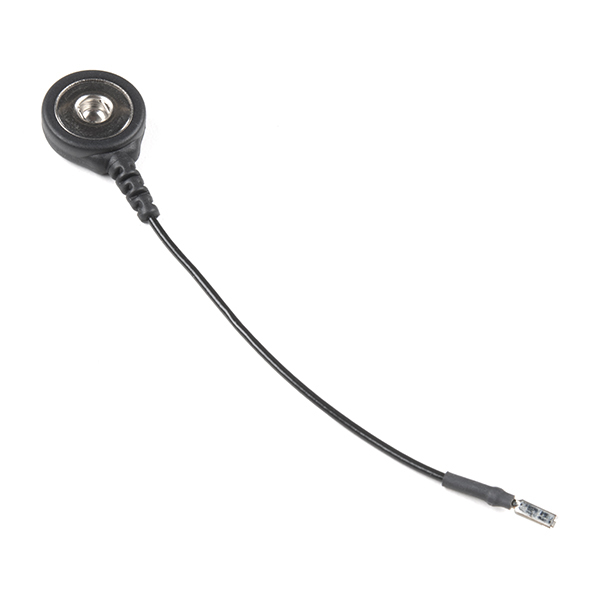

> **注意：** 基板上のリファレンススナップコネクタは、ケーブルを挿入していても有効なままである。ソケットを無効化するには、センサー表側のジャンパートレースを切断する。ソケットを再度有効化するには、ジャンパーパッドをはんだでブリッジする。

## MyoWare 2.0 Cable Shield

[MyoWare 2.0 Cable Shield](https://www.sparkfun.com/products/18386)は、センサーパッドをMyoWare 2.0筋電センサーから離れた場所に取り付けたい場合を想定して設計されている。
これにより、対象の筋肉に基板そのものを取り付けなくても、筋電センサーをテスト・使用できる。
このシールドには、従来型の3電極センサーケーブルを接続できる3.5mmのTRSジャックが用意されている。
基板にはスナップコネクタも搭載されており、簡単に積み重ねられる。
MyoWare 2.0エコシステムの他のシールドとは異なり、このシールドはMyoWare 2.0筋電センサーの裏側にスナップする。
このシールドは、ケースに収めるウェアラブルでないプロジェクトや、内蔵の電極ソケットが適さないほど小さい・配置の難しい筋肉を対象にする場合に使う。

3.5mmのTRSコネクタで中間・端・リファレンスグラウンドの各ピンにアクセスするには、TRSコネクタと、生体医療用センサーパッドが数枚必要になる。
まだ持っていない場合は、次の製品を用意すること。

- Sensor Cable - Electrode Pads（3コネクタ）
- Disposable Surface EMG/ECG/EKG Electrode - 24mm（10個入り）

導電性素材でアダプタを自作したい場合は、TRSプラグを入手するという方法もある（TRS Audio Plug - 3.5mm〔Metal〕、廃盤）。

> **注意：** アダプタを作りたい場合は、Advancer Technologiesによる[導電性ファブリック電極の作り方のチュートリアル](http://www.myoware.com/project/conductive-fabric-electrodes/)を参考にしてみてほしい。

### ハードウェア概要

> **注意：** 基板の表側にあるオスのスナップコネクタは「スタッド」コネクタと呼ばれる。これらのスナップコネクタを扱う技術仕様書やガイドでは、この用語を目にすることがある。

MyoWare 2.0 Cable Shieldの製品ページのデフォルト画像は3.5mm TRSコネクタのある面を最初に表示しているが、この基板の「表側」はオスのスナップコネクタがある面である。
MyoWare 2.0エコシステムの他のシールドと比べ、このシールドだけがMyoWare 2.0筋電センサーの裏側に積み重ねる。

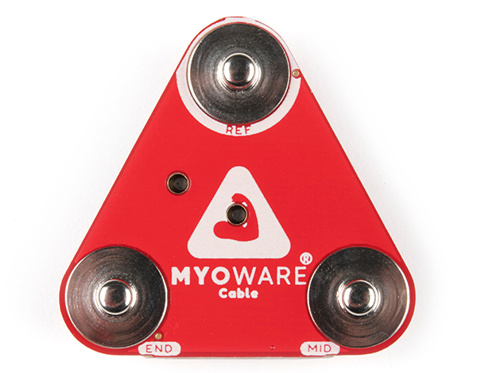
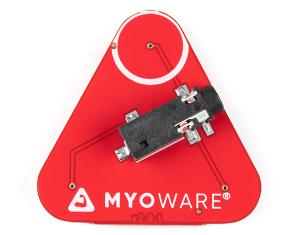

*左：表側　右：裏側*

ケーブルの配色は、メーカーによって異なることがある。
センサーの読み取り値がおかしい、あるいは筋電センサーが筋群に反応しない場合は、[導通測定に設定したテスター](./how-to-use-a-multimeter.md)でピン配置をテストしてみてほしい。
以下は、オスのスナップピン、TRSコネクタ、ケーブルの間の接続関係をまとめた表である。
オスのスナップピンにより、MyoWare 2.0筋電センサーの裏側に簡単に積み重ねられる。

| スナップコネクタ | TRSピン配置 | 電極ピンの色（CAB-12970） | 備考 |
| --- | --- | --- | --- |
| リファレンス [REF] | スリーブ | 黒 | リファレンス電極の接続。肘の骨の部分など、筋群に隣接しない体の別の部位に接続する。 |
| 端部 [END] | リング | 青 | 筋肉端部電極の接続。筋群の端部分に接続する。 |
| 中間 [MID] | チップ | 赤 | 筋肉中間電極の接続。筋群の中間部分に接続する。 |

> **注意：** REF電極パッドが皮膚にしっかりと安定して接触しているか確認すること。接触が不十分だと動作に問題が生じることがある。

> **⚠ 警告：** MyoWare 2.0 Arduino ShieldまたはMyoWare 2.0 Link ShieldからのTRSケーブルを、MyoWare 2.0 Cable Shieldに挿入しないこと。

### 基板寸法

このシールドはMyoWare 2.0筋電センサーと同じフォームファクタを使っており、基板寸法は37.57mm × 35.90mm（1.48インチ × 1.41インチ）である。

## MyoWare 2.0 Power Shield

> **改訂内容：** 改訂版のMyoWare 2.0 LED Shield v2.0.3には、2ピン、1.00mmピッチのJST-SHコネクタが搭載されている。全体的な機能は同じである。

MyoWare 2.0 Power Shieldは、[MyoWare 2.0筋電センサー](https://www.sparkfun.com/products/18977)にリモートで簡単に給電できるよう設計されている。
MyoWare Power Shieldには基板上にスナップコネクタが搭載されており、筋電センサーの表側に簡単に積み重ねられる。
スイッチをONの位置に切り替えると、筋電計測の魔法を働かせるのに必要な電力がセンサーに供給される。
MyoWare 2.0筋電センサーをバッテリー電源に接続すると、よりクリーンな信号が得られると同時に、電力網への危険な電流経路が生まれる可能性を排除できる。
携帯用途でのセンサーの給電に利用してほしい。

### ハードウェア概要

> **注意：** 基板の裏側にあるメスのスナップコネクタは「ソケット」コネクタと呼ばれる。これらのスナップコネクタを扱う技術仕様書やガイドでは、この用語を目にすることがある。

基板の表側にはLiPoバッテリーとUSBコネクタがある。基板の裏側にはメスのスナップコネクタと電源スイッチがある。

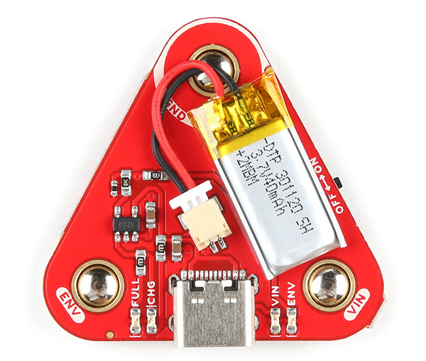
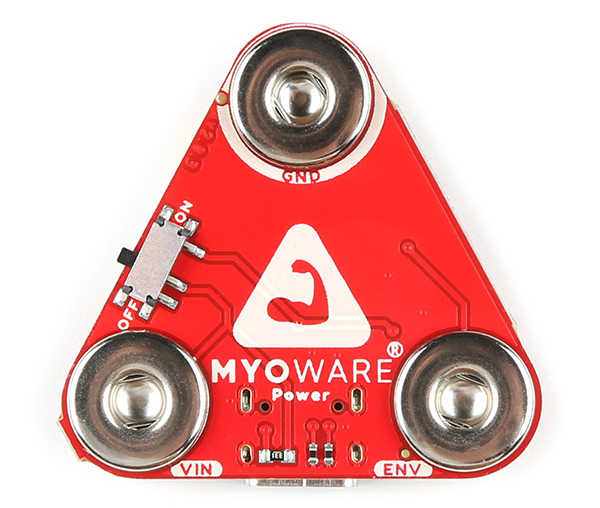

*左：表側　右：裏側*

#### USB Cコネクタ

基板にはUSB Type Cコネクタが搭載されている。
USB Cケーブルを5Vの電源に接続すると、単セルのLiPoバッテリーを充電できる。

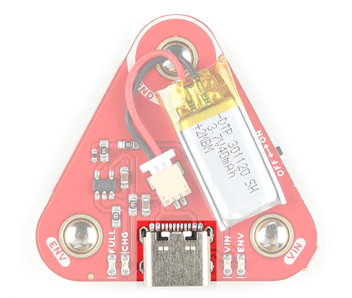

> **⚡ 危険：** コンピュータやUSB充電器でLiPoバッテリーを充電する際は、必ずMyoWare 2.0 Power ShieldをMyoWare 2.0筋電センサーから取り外すことを推奨する。MyoWare 2.0 Power Shieldは、充電中にMyoWare 2.0筋電センサーと組み合わせて使うようには設計されていない。充電中に電源スイッチがONの位置にあると、出力信号の完全性が損なわれる。シールドがセンサーの上に積み重なった状態でユーザーに装着したまま、LiPoバッテリーを充電しないこと。これにより、ユーザーが電力網（コンピュータの電源装置や、コンセントに接続されたUSB充電器など）に接続された状態にならないようにし、感電を防止する。

#### 電源スイッチ

基板には電源スイッチが搭載されている。
スイッチをONの位置に切り替えると、VINのメススナップコネクタを通じてMyoWare 2.0筋電センサーに電力が供給される。
使わないときは、スイッチをOFFの位置に切り替えること。

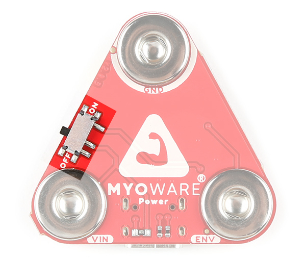

#### LiPo充電回路

基板には、単セルのLiPoバッテリーを安全に充電するMCP73831 LiPo充電IC（5ピンの小さな黒いIC）が搭載されている。
この場合、**充電レートは40mAに設定**されており、内蔵の40mAh LiPoバッテリーを充電する。
バッテリーの**充電状態**は、充電中（CHG）と満充電（FULL）のLEDで確認できる。

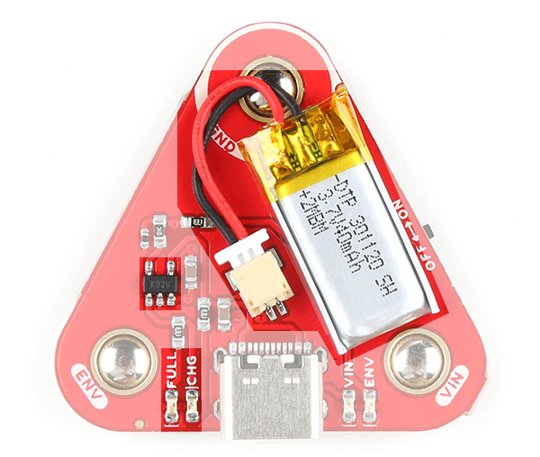

> **注意：** LiPoバッテリーの適切な取り扱いについては、LilyPad Basics: Powering Your Project - LiPo Battery Safety Careを確認してほしい。

#### スナップコネクタ

基板には、MyoWare 2.0筋電センサーの上に簡単に積み重ねられる3つのメススナップコネクタが搭載されている。

- **GND**：電源用グラウンド。
- **VIN**：電源用の電圧入力。この電圧は、LiPoバッテリーがどれだけ充電されているかによって異なる。充電用の電源に接続すると、充電ICがLiPoバッテリーの充電を開始し、電圧はおよそ4.2Vになることがある。安全上の理由から、バッテリーを充電する際は、常にこのシールドをセンサーから取り外しておくことを推奨する。
- **ENV**：0〜VINの範囲のエンベロープ信号。マイクロコントローラーのADCに接続する。

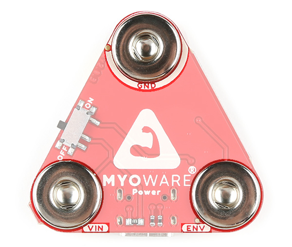

#### LED

基板の表側には4つのLEDが搭載されている。

- **FULL**：バッテリーが満充電になったことを示すために点灯する。LiPoが充電中でない場合や充電器が基板に接続されていない場合は消灯する。
- **CHG**：LiPoバッテリーが充電中であることを示すために点灯する。LiPoが満充電の場合や充電器が基板に接続されていない場合は消灯する。
- **VIN**：電源スイッチがONの位置に切り替わったときに点灯し、VINスナップピンを通じてMyoWare 2.0筋電センサーに電力が供給されていることを示す。
- **ENV**：MyoWare 2.0筋電センサーのENVピンに活動があるときに点灯する。

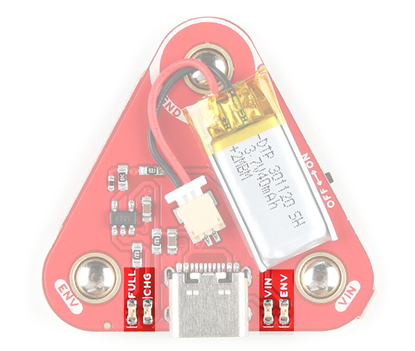

### 基板寸法

このシールドはMyoWare 2.0筋電センサーと同じフォームファクタを使っており、基板寸法は37.57mm × 35.90mm（1.48インチ × 1.41インチ）である。

## MyoWare 2.0 LED Shield

MyoWare 2.0 LED Shieldは、対象の筋肉の信号の大きさを表示すると同時に、内蔵バッテリーで[MyoWare 2.0筋電センサー](https://www.sparkfun.com/products/18977)に給電できるよう設計されている。
青色の10セグメントバーグラフは、測定された信号の大きさを示す。
筋肉の活動が大きいほど、より高い位置までLEDが点灯する。
このシールドにより、MyoWare 2.0筋電センサーが提供する信号を視覚的に確認できるようになる。
LED Shieldには基板上にスナップコネクタが搭載されており、MyoWare 2.0筋電センサーの表側に簡単に積み重ねられる。
スイッチをONの位置に切り替えれば、筋電計測の魔法を働かせるのに必要な電力がセンサーに供給される。
MyoWare 2.0筋電センサーをバッテリー電源に接続すると、よりクリーンな信号が得られると同時に、電力網への危険な電流経路が生まれる可能性を排除できる。
トレーニング中に筋肉をどれだけ使えているかを測ったり、教材として使ったり、ハロウィンの衣装に筋電計測の演出を加えたりするのに活用してほしい。

> **注意：** LiPoバッテリーの適切な取り扱いについては、LilyPad Basics: Powering Your Project - LiPo Battery Safety Careを確認してほしい。

### ハードウェア概要

> **注意：** 基板の裏側にあるメスのスナップコネクタは「ソケット」コネクタと呼ばれる。これらのスナップコネクタを扱う技術仕様書やガイドでは、この用語を目にすることがある。

基板の表側にはLEDとLiPoバッテリーがある。基板の裏側にはメスのスナップピン、電源スイッチ、USBコネクタがある。

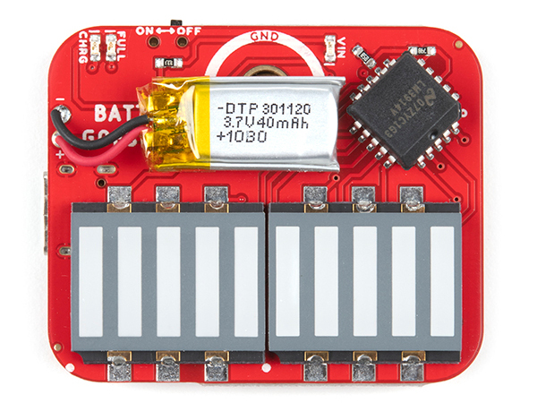
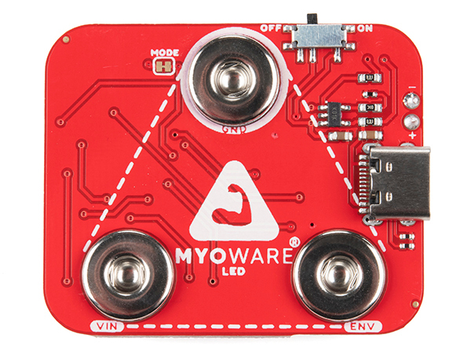

*左：表側　右：裏側*

#### USB Cコネクタ

基板にはUSB Type Cコネクタが搭載されている。
USB Cケーブルを5Vの電源に接続すると、単セルのLiPoバッテリーを充電できる。

> **⚡ 危険：** コンピュータやUSB充電器でLiPoバッテリーを充電する際は、必ずMyoWare 2.0 LED ShieldをMyoWare 2.0筋電センサーから取り外すことを推奨する。MyoWare 2.0 LED Shieldは、充電中にMyoWare 2.0筋電センサーと組み合わせて使うようには設計されていない。充電中に電源スイッチがONの位置にあると、すべてのLEDセグメントが最大値まで点灯し、出力信号の完全性が損なわれる。シールドがセンサーの上に積み重なった状態でユーザーに装着したまま、LiPoバッテリーを充電しないこと。これにより、ユーザーが電力網（コンピュータの電源装置や、コンセントに接続されたUSB充電器など）に接続された状態にならないようにし、感電を防止する。

#### 電源スイッチ

基板には電源スイッチが搭載されている。
スイッチをONの位置に切り替えると、VINのメススナップコネクタを通じてMyoWare 2.0筋電センサーに電力が供給される。
使わないときは、スイッチをOFFの位置に切り替えること。

#### LiPo充電回路

基板には、単セルのLiPoバッテリーを安全に充電するMCP73831 LiPo充電ICが搭載されている。
この場合、**充電レートは40mAに設定**されており、基板上の40mAh LiPoバッテリーを充電する。
バッテリーの**充電状態**は、充電中（CHRG）と満充電（FULL）のLEDで確認できる。

#### LM3914ドット・バードライバー

黒い正方形のICはLM3914ドット・バードライバーである。このICは筋電センサーからの出力を受け取り、2×5セグメントのLEDに出力する。

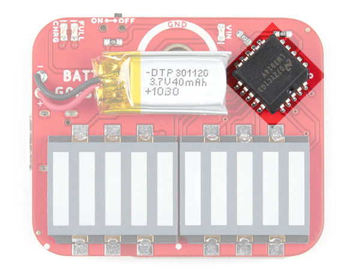

#### LED

基板には3つのステータスLEDが搭載されている。

- **FULL**：バッテリーが満充電になったことを示すために点灯する。LiPoが充電中でない場合や充電器が基板に接続されていない場合は消灯する。
- **CHRG**：LiPoバッテリーが充電中であることを示すために点灯する。LiPoが満充電の場合や充電器が基板に接続されていない場合は消灯する。
- **VIN**：電源スイッチがONの位置に切り替わったときに点灯し、VINスナップピンを通じてMyoWare 2.0筋電センサーに電力が供給されていることを示す。

このシールドが「MyoWare 2.0 LED Shield」と呼ばれるのは、もちろん大きなセグメントLEDを搭載しているからである。
バーグラフは、測定された筋肉信号のレベルに応じて点灯する。
最小値はドット・バードライバーICに最も近い位置に対応する。
筋肉の活動が増えるほど、ENVピンからの電圧が上昇する。
その結果、反対側の最後のLEDが点灯するまで、LEDは次々と点灯し続ける。
LEDは明るい場所でも十分視認できるが、暗い場所では特に美しく光る。

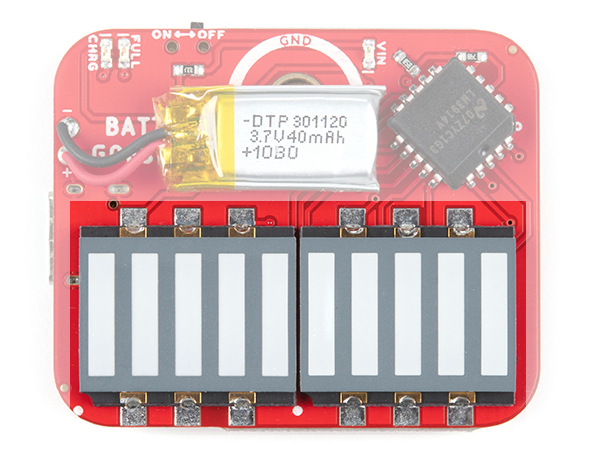

#### スナップコネクタ

基板には、MyoWare 2.0筋電センサーの上に簡単に積み重ねられる3つのメススナップコネクタが搭載されている。

- **GND**：電源用グラウンド。
- **VIN**：電源用の電圧入力。この電圧は、LiPoバッテリーがどれだけ充電されているかによって異なる。充電用の電源に接続すると、充電ICがLiPoバッテリーの充電を開始し、電圧はおよそ4.2Vになることがある。安全上の理由から、バッテリーを充電する際は、常にこのシールドをセンサーから取り外しておくことを推奨する。
- **ENV**：0〜VINの範囲のエンベロープ信号。マイクロコントローラーのADCに接続する。

#### ジャンパー

基板には、デフォルトで閉じている**MODE**用のジャンパーが1つある。
MODEはLM3914ドット・バードライバーのV+ピンに直接配線されており、*バーグラフモード*として動作する。
このモードでは、反対側の最後のLEDが点灯するまで、筋肉信号の大きさに応じてLEDセグメントが次々と点灯し続ける。
MODEジャンパーを切断すると、基板は*ドットモード*になる。
ドットモードが有効な場合、先頭のLEDバー（「ドット」）が点灯しながらセグメントを移動する。
それより後ろのLEDは、光で埋まる代わりに消灯する。
ジャンパーの変更について詳しくは、ジャンパーパッドとPCBトレースの扱い方のチュートリアルを確認してほしい。

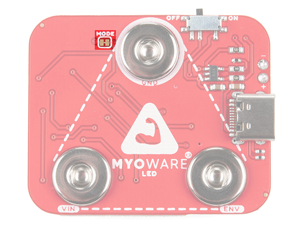

### 基板寸法

このシールドはMyoWare 2.0筋電センサーと同じフォームファクタを使っているが、基板寸法は他の基板とは異なり、46.15mm × 38.00mm（1.82インチ × 1.50インチ）である。

## MyoWare 2.0 Link Shield

MyoWare 2.0 Link Shieldは、[MyoWare 2.0筋電センサー](https://www.sparkfun.com/products/18429)をArduinoマイクロコントローラーに簡単に接続できるよう設計されている。
このシールドには3.5mmのTRSジャックが用意されており、3.5mmのTRS-TRSケーブルを使って基板同士を接続できる。
MyoWare 2.0 Link Shieldには基板上にスナップコネクタが搭載されており、MyoWare 2.0筋電センサーの表側に簡単に積み重ねられる。
MyoWare 2.0筋電センサーとLink Shieldのスタックをそれぞれリンクするには、[MyoWare 2.0 Arduino Shield](https://www.sparkfun.com/products/18426)と、Arduino Uno R3のフォームファクタを持つ開発ボードが必要になる。

### ハードウェア概要

> **注意：** 基板の裏側にあるメスのスナップコネクタは「ソケット」コネクタと呼ばれる。これらのスナップコネクタを扱う技術仕様書やガイドでは、この用語を目にすることがある。

基板の表側にはTRSコネクタ、電源スイッチ、出力スイッチがある。基板の裏側にはメスのスナップコネクタがある。

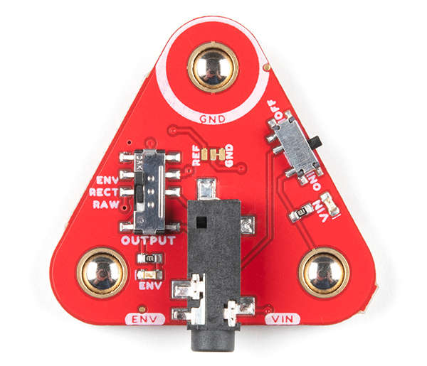
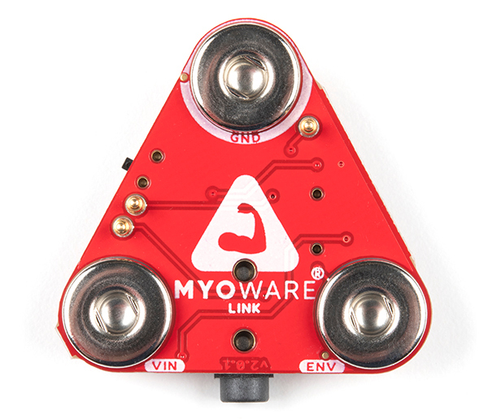

*左：表側　右：裏側*

#### 電源スイッチ

電源スイッチは、MyoWare 2.0筋電センサーのオン・オフを切り替える。
電力はArduinoとArduino Shieldから供給される。
デフォルトでは、Arduino Shieldの電源は5Vに設定されている。
スイッチがONの位置に切り替わると、TRS-TRSケーブルのリングピンが5VとVINを接続する。

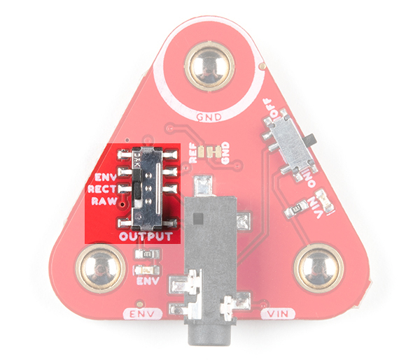

#### 出力スイッチ

OUTPUTスイッチは、Arduinoのアナログ入力に供給する信号を選択する。

- **ENV**：エンベロープ出力
- **REC**：整流出力
- **RAW**：生出力

#### 3.5mm TRSコネクタ

3.5mmのTRSコネクタは、以下のピンに接続されている。

| ピン配置 | TRSピン |
| --- | --- |
| グラウンド [GND] | スリーブ |
| 電圧入力 [VIN] | リング |
| ENV/RECT/RAW [OUTPUT] | チップ |

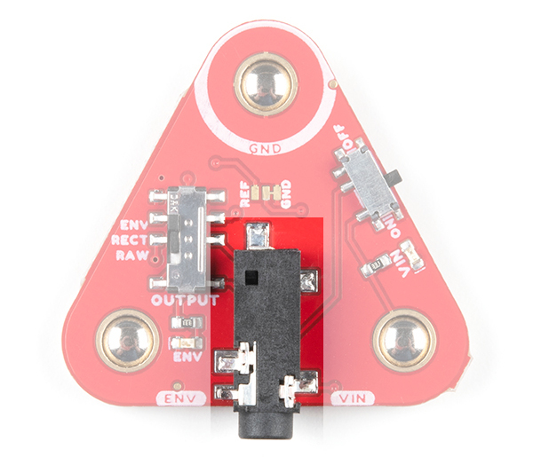

#### LED

基板には2つのLEDが搭載されている。

- **VIN**：電源スイッチがONの位置に切り替わったときに点灯し、VINスナップピンを通じてMyoWare 2.0筋電センサーに電力が供給されていることを示す。
- **ENV**：MyoWare 2.0筋電センサーのENVピンに活動があるときに点灯する。

#### スナップコネクタ

基板には、MyoWare 2.0筋電センサーの上に簡単に積み重ねられる3つのメススナップコネクタが搭載されている。

- **GND**：電源用グラウンド。
- **VIN**：電源用の電圧入力。この電圧は、MyoWare 2.0 Arduino Shieldで設定したジャンパーに応じて決まる。この電圧は、MyoWare 2.0 Arduino ShieldのPWRジャンパーの位置に応じて5V（デフォルト）または3.3Vになる。
- **ENV**：0〜VINの範囲のエンベロープ信号。マイクロコントローラーのADCに接続する。

#### ポゴピン

基板の裏側には3つのポゴピンがある。
これらは、SparkFunの店頭で見かける他のポゴピンよりもかなり低い高さになっている。
これらはMyoWare 2.0筋電センサーのPTHパッドに接続される。
MyoWare 2.0 Link Shieldにはこれらのピンにラベルが付いていない点に注意してほしい。
GNDスナップコネクタに最も近いポゴピンがリファレンスピン、スイッチのすぐ隣にあるポゴピンが整流出力ピン、VINスナップコネクタのすぐ上にあるポゴピンが生出力である。

- **REF**：リファレンスピン
- **RECT**：整流出力ピン
- **RAW**：生出力ピン

#### ジャンパー

基板の表側には3方向ジャンパーが搭載されている。
このジャンパーは、出力とArduinoの相対的なグラウンド基準点を変更できるようにするためのものである。
デフォルトでは、RAW出力はREFと同じであるVIN/2を中心に振れる。
これを0Vを中心とするよう変更したいユーザーもいるかもしれず、その場合は相対的なグラウンド基準点をREFに変更する必要がある。
GNDに接続されたトレースを切断し、REFと中央パッドの間にはんだジャンパーを追加すると、REFポゴピンが筋電センサーのREFに接続される。
ジャンパーの変更について詳しくは、ジャンパーパッドとPCBトレースの扱い方のチュートリアルを確認してほしい。

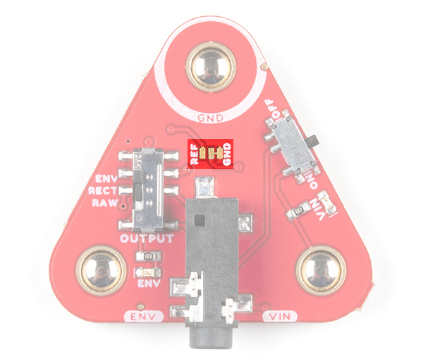

### 基板寸法

このシールドはMyoWare 2.0筋電センサーと同じフォームファクタを使っており、基板寸法は37.57mm × 35.90mm（1.48インチ × 1.41インチ）である。

## MyoWare 2.0 Arduino Shield

MyoWare 2.0 Arduino Shieldは、3.5mmのTRS-TRSオーディオケーブルを使い、最大6台の[MyoWare 2.0筋電センサー](https://www.sparkfun.com/products/18977)と[Link Shield](https://www.sparkfun.com/products/18425)を簡単に接続できるよう設計されている。
基板にはあらかじめオスヘッダーが実装されているため、あとはArduinoに重ねてセンサーを接続すれば、最大6つの筋群を読み取れる。
Arduino Shieldのフォームファクタは、Arduino Uno R3の標準フォームファクタを持つ開発ボードにそのまま接続できる。
MyoWare 2.0筋電センサーごとに、MyoWare 2.0 Link ShieldとTRS-TRSケーブルが1つずつ必要になる。

基板同士をリンクするにはTRS-TRSケーブルが必要になる。
もちろん、TRSコネクタに配線をはんだ付けして自作することもできる。
その場合は、正しいピンに配線をはんだ付けすることを忘れないでほしい。

- Audio Cable TRS - 1m
- TRS Audio Plug - 3.5mm（Metal、廃盤）

### ハードウェア概要

基板の表側にはTRSコネクタとQRコードがある。
スマートフォンを取り出して[QRコードをスキャンし、MyoWareの公式サイト](http://myoware.com)を訪れてみるのも一興である。
基板の裏側には、R3フォームファクタを持つArduino開発ボードのメスヘッダーと合わせるためのオスヘッダーがある。

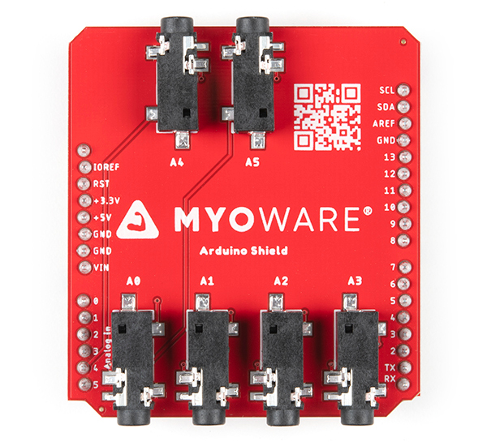
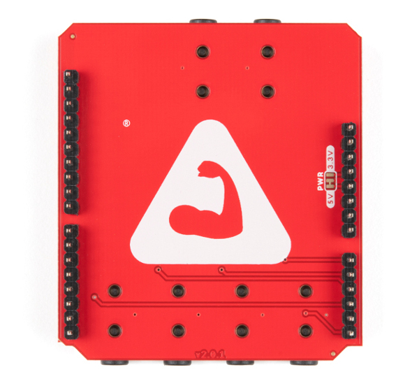

*左：表側　右：裏側*

#### 3.5mm TRSコネクタ

基板の表側には、6個の3.5mm TRSジャックがある。
それぞれのコネクタは電源と、Arduinoの`A0`から`A5`までのアナログピンに接続されている。

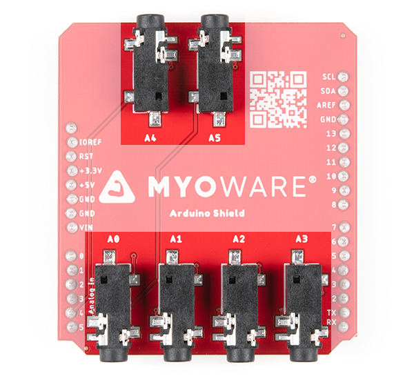

3.5mm TRSコネクタは、以下の電極ピンに接続されている。

| 電極ピン | TRSピン |
| --- | --- |
| グラウンド [GND] | スリーブ |
| 電圧 [VIN] | リング |
| ENV/RECT/RAW [OUTPUT] | チップ |

> **⚠ 警告：** TRSケーブルをコネクタに挿抜する前に、Arduinoの電源を切ることを推奨する。

#### 予約ピン

5V、3.3V、GNDネット、そしてアナログピン（`A0`〜`A5`）は、このシールド用に予約されている。

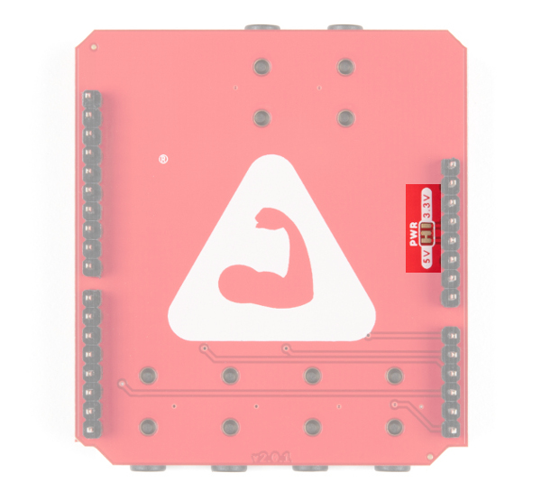

> **注意：** Qwiicコネクタが有効なATmega328P搭載のSparkFun RedBoardは、I²C用にアナログピンA4とA5を使う。A4とA5ピンでアナログ値を読み取るには、Qwiicコネクタ用のジャンパーを切断する必要がある。切断しないと、ロジックレベルコンバータのプルアップ抵抗が分圧回路として働いてしまい、低い電圧ではピンが正しい値を読み取れなくなる。ジャンパーの変更について詳しくは、ジャンパーパッドとPCBトレースの扱い方のチュートリアルを確認してほしい。

> **注意：** PTHピンが互い違いのパターンになっていることに気づくはずである。心配は無用で、これは工夫を凝らしたフットプリントを使ったEagle設計の一部である。この千鳥状のPTHホールにより、製造部門ではヘッダーを基板にはんだ付けしやすくなっている。

#### ジャンパー

基板の裏側にはそれほど多くの要素はない。
裏面には`PWR`とラベル付けされたジャンパーがある。
デフォルトでは、この3方向ジャンパーは5Vピンと基板裏面の5Vプレーンを接続している。
中央のパッドはTRSコネクタに接続されており、Link Shield経由でMyoWare 2.0筋電センサーに電力を供給する。
別の電圧を使いたい場合は、トレースを切断し、中央パッドと3.3Vの間にはんだを盛る。
ジャンパーの変更について詳しくは、ジャンパーパッドとPCBトレースの扱い方のチュートリアルを確認してほしい。

### 基板寸法

このシールドはArduino Uno R3のフォームファクタを使っており、基板寸法は53.34mm × 59.69mm（2.10インチ × 2.35インチ）である。

## MyoWare 2.0 Wireless Shield

[MyoWare® 2.0 Wireless Shield](https://www.sparkfun.com/products/23387)は、[MyoWare 2.0筋電センサー](https://www.sparkfun.com/products/18977)からの読み取り値を取り込み、[ESP32-WROOM](https://www.sparkfun.com/products/17830)でセンサーデータをワイヤレス送信できるよう設計されている。
このシールドには内蔵のLiPoバッテリーも搭載されており、筋電センサーとESP32モジュールの両方にリモートで給電できる。
Wireless Shieldには、スナップコネクタと低背のポゴピンが基板上に搭載されており、MyoWare 2.0筋電センサーの表側に簡単に積み重ねられる。
電源の供給元を選び、電源スイッチをONの位置に切り替えるだけで、筋電計測の魔法を働かせるのに必要な電力がセンサーに供給される。

### ハードウェア概要

> **注意：** 基板の裏側にあるメスのスナップコネクタは「ソケット」コネクタと呼ばれる。これらのスナップコネクタを扱う技術仕様書やガイドでは、この用語を目にすることがある。

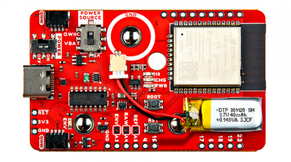
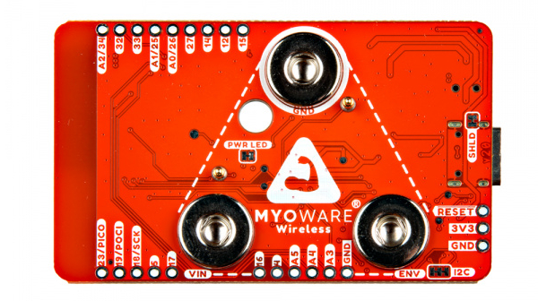

*左：表側　右：裏側*

#### 電源

コネクタとスルーホールパッドには、さまざまな電源関連のネットが引き出されている。
Wireless Shieldがどのように給電されるかは、スイッチの設定によって決まる。以下の選択肢を見ていこう。

##### 電源（USB）

USB Type Cコネクタが搭載されており、ESP32への給電とプログラム書き込みに使える。
USBのデータラインにはESD保護ダイオードが接続されており、リセッタブルヒューズと、USB・バッテリーのネット向けの逆極性保護用理想ダイオードも搭載されている。
マイクロコントローラーとコンピュータの間のシリアルデータを確認することもできる。
ただし、MyoWare 2.0筋電センサーに接続する場合は、システムへのノイズの混入を減らし、電力網からの感電を防ぐため、データはワイヤレスで送信することを推奨する。
USBコネクタは、LiPoバッテリーの充電にも使われる。

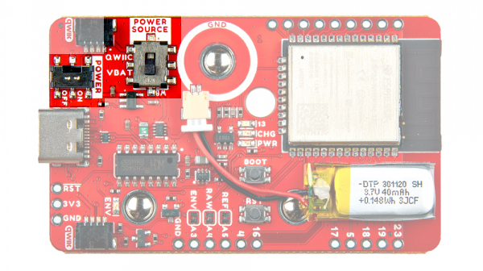

ESP32に給電するには、スイッチが正しい側に切り替わっていることを確認する必要がある。詳しくは下記のスイッチの節を確認してほしい。

> **⚡ 危険：** コンピュータやUSB充電器でLiPoバッテリーを充電する際や、ESP32へのプログラム書き込み時は、必ずMyoWare 2.0 Wireless ShieldをMyoWare 2.0筋電センサーから取り外すことを推奨する。MyoWare 2.0 Wireless Shieldは、充電中にMyoWare 2.0筋電センサーと組み合わせて使うようには設計されていない。シールドがセンサーの上に積み重なった状態でユーザーに装着したまま、LiPoバッテリーを充電しないこと。これにより、ユーザーが電力網（コンピュータの電源装置や、コンセントに接続されたUSB充電器など）に接続された状態にならないようにし、感電を防止する。

> **注意：** SparkFunのカタログにある電源やコンピュータのUSBポートは、LiPoバッテリーの充電に使えることをテスト済みである。一部の5V電源では、LiPoバッテリーの充電がうまくいかない場合があることもわかっている。

##### 電源（LiPoバッテリー）

基板には、単セルのLiPoバッテリーを安全に充電するMCP73831 LiPo充電IC（5ピンの小さな黒いIC）が搭載されている。
この場合、充電レートは内蔵の40mAh LiPoバッテリーを充電するためおよそ40mAに設定されている。
SparkFunのカタログにある他のLiPoバッテリーと比べ、こちらはより小型の2ピン、1.00mmピッチのJST-SHコネクタを使っている。

> **注意：** LiPoバッテリーの適切な取り扱いについては、Single Cell LiPo Battery Careのチュートリアルを確認してほしい。

##### スイッチ

基板には2つのスイッチが搭載されている。

- 電源の供給元（Power Source）
- 電源のオン・オフ（Power ON/OFF）

**Power Source**は3極双投（TPDT）スイッチである。
スイッチを*VBAT*の位置に切り替えると、電源ネットが3.3Vレギュレータの出力に接続される。
これにより、3.3Vレギュレータの出力がQwiicの3.3Vピンにも接続される。
この位置にスイッチを設定すると、レギュレータの入力が上流の電源（USBまたはLiPoバッテリーからの電圧）に接続される。

スイッチを*QWIIC*の位置に切り替えると、電源ネットがQwiicの3.3Vピンに接続される。
これにより、3.3Vレギュレータの出力はすべてから切り離される。
これにより、Qwiicコネクタ経由でMyoWare 2.0 Wireless Shieldに給電できるようになる。
さらに、レギュレータの入力も上流の電源（USBまたはLiPoバッテリーからの電圧）から切り離される。

> **注意：** POWER SOURCEをQWIICの位置に設定した場合、これだけではLiPoバッテリーを充電できない。LiPoバッテリーを充電する唯一の方法は、USB-Cケーブルを接続することである。

**Power ON/OFF**とラベル付けされたスイッチは単極単投（SPST）スイッチである。
スイッチをONの位置に切り替えると、電源ネットが3.3Vネットに接続される。

> **注意：** MyoWare 2.0 Wireless Shieldと筋電センサーに初めて電力を入れる際は、対象の筋肉をリラックスさせておくことを推奨する。

スイッチをOFFの位置に切り替えると、電源ネットが3.3Vから切り離される。
これにより、VREGの入力もすべての上流電源から切り離される。
これは、TPDTスイッチの位置にかかわらず、3.3Vレギュレータへの電力を取り除く。

> **注意：** コードをアップロードする際は、POWER SOURCEをVBATの位置に、POWERスイッチをONの位置に切り替えることを推奨する。

##### 3.3V

USBコネクタとLiPoバッテリーからの電圧は、低消費電力のレギュレータ（RT9080）で3.3Vに降圧される。
このレギュレータは、システムに最大600mAの出力電流を供給できる。
Power SourceがVBATTの位置に切り替わっていると、このレギュレータの出力は3.3VのPTHに接続される。
Qwiicコネクタ経由やPTH経由で基板に給電したいユーザーは、Power Sourceのスイッチを必ずQWIICの位置に切り替え、3.3Vに調整された電圧を供給する必要がある。
基板裏側のスナップコネクタも3.3Vに接続されている。これにより、MyoWare 2.0筋電センサーに電力が供給される。

##### CH340 USB-シリアル変換チップ

基板にはCH340 USB-シリアル変換チップが搭載されている。
このチップは、マイクロコントローラーのハードウェアシリアルUARTとコンピュータのUSBポートの間でシリアルデータを送受信するのに使える。
このチップは、Arduino IDEを使ってESP32にコードをアップロードする際にも使われる。

ほとんどのオペレーティングシステムでは、ドライバが自動的にインストールされるはずである。
とはいえ、オペレーティングシステムには実にさまざまな種類があるため、初めてこのチップをコンピュータのUSBポートに接続する際や、OSの更新後には、ドライバのインストールが必要になることがある。
詳しくは、How to Install CH340 Drivers Tutorialを確認してほしい。

#### スナップコネクタ

基板には、MyoWare 2.0筋電センサーの上に簡単に積み重ねられる3つのメススナップコネクタが搭載されている。

- **GND**：電源用グラウンド。
- **VIN**：MyoWare 2.0筋電センサー向けの電圧「出力」。シールドを積み重ねる際に、筋電センサーのシルク印刷にあるVINと一致させるためのものである。この電圧は、スイッチの位置に応じて3.3Vに接続される。安全上の理由から、バッテリーを充電する際は、常にこのシールドをセンサーから取り外しておくことを推奨する。
- **ENV**：MyoWare 2.0筋電センサーからの0〜VINの範囲のエンベロープ信号。ESP32のピン`39` / `A3`に接続されている。

#### ポゴピン

基板の裏側には2つのポゴピンがある。
これらは、SparkFunのカタログで見かける他のポゴピンよりも低背である。
これらはMyoWare 2.0筋電センサーのPTHパッドに接続される。
MyoWare 2.0 Wireless Shieldにはこれらのポゴピンにラベルが付いていない点に注意してほしい。
GNDコネクタに最も近いポゴピンがリファレンスピン、VINの近くのポゴピンが生出力である。

- **REF**：MyoWare 2.0筋電センサーからのリファレンスピン。このポゴピンはESP32のピン`35` / `A5`に接続される。
- **RAW**：MyoWare 2.0筋電センサーからの生出力ピン。このポゴピンはESP32のピン`36` / `A4`に接続される。

#### ESP32モジュール

基板の「頭脳」はESP32-WROOMモジュールである。
そのピンは、基板上のさまざまな部品、基板端のPTH、低背のポゴピン、スナップコネクタに引き出されている。

#### リセットボタンとブートボタン

各基板には2つのモーメンタリボタンが搭載されている。1つはRESET用、もう1つはブートローダーモード（BOOT）用である。
リセットボタンを押すと、ESP32プロセッサが再起動する。
BOOTボタンは、基板をブートローダーモードにするために使う。
基板の起動時やリセット時にこのボタンを押し続けると、基板がブートローダーモードになる。
BOOTボタンは、ユーザー入力用の汎用ボタンとしても機能し、ESP32のピン`0`に接続されている。
このボタンを使う場合は、ボタン押下後に何らかの処理を行う条件文を書く必要がある。

> **注意：** 汎用ボタンにはプルアップ抵抗が接続されていない。`setup()`に必ず次のコードを含めること。
>
> ```c
> pinMode(10, INPUT_PULLUP);
> ```

#### QwiicとI²C

Qwiic接続システムに馴染みがない場合は、[こちらの概要](https://www.sparkfun.com/qwiic)を確認しておくことを推奨する。

基板には2つの水平方向のQwiicコネクタが搭載されている。
これらは4ピン、1mmピッチのJST-SHタイプのコネクタである。
これらはESP32モジュールのI²Cピンに接続されている。
I²Cのデータ・クロックラインには、2.2kΩのプルアップ抵抗（画像では強調表示していない）と、絶縁用のトランジスタも接続されている。
「Power Source」スイッチを使い、Qwiic対応デバイス用の電源を必ず選択すること。
これにより、Qwiic対応デバイスを基板に接続できるようになる。
Qwiic対応デバイスを追加して、腕の向きをモニタリングしてみるのもよい。

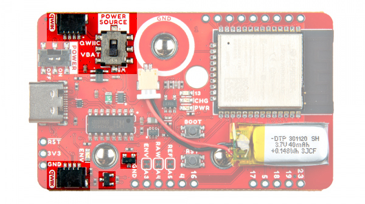

> **⚠ 警告：** Qwiic対応デバイスを基板にさらに追加すると、LiPoバッテリーの消費が早まり、稼働時間が短くなる。より大きな電源でこれらのデバイスを別途給電することも検討してほしい。その場合、電圧の競合を避けるため、Qwiic対応デバイスとMyoWare 2.0 Wireless Shieldの間の3.3Vを必ず切り離すこと。

#### LED

基板には4つのLEDがある。

- **PWR**：基板に電力が供給されていることを示す。このLEDは3.3Vネットに接続されている。基板裏側のPWRジャンパーを切断すると、このLEDを無効化できる。
- **CHG**：バッテリーの充電状態を示すのに使える。充電ICの状態に応じたインジケータの一覧は次のとおりである。

| 充電状態 | LEDの状態 |
| --- | --- |
| バッテリーなし | フローティング（通常はOFFだが、点滅することがある） |
| シャットダウン | フローティング（通常はOFFだが、点滅することがある） |
| 充電中 | ON |
| 充電完了 | OFF |

- **13**：汎用LEDであり、ピン`13`に接続されている。デフォルトのファームウェアを使っている場合、Bluetoothデバイスに接続されていないときは点滅し、MyoWare 2.0 Wireless ShieldがBluetoothデバイスに接続されると点灯し続ける。
- **ENV**：MyoWare 2.0筋電センサーのENVピンに活動があるときに点灯する。

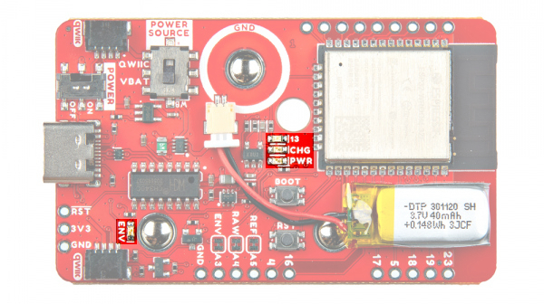

#### ジャンパー

> **注意：** ジャンパーの扱いが初めての場合は、How to Work with Jumper Pads and PCB Tracesのチュートリアルを確認してほしい。

基板の表側と裏側にジャンパーが用意されている。以下の3つのジャンパーは基板の表側にある。

- **REF**：デフォルトでは、このジャンパーはリファレンスピンをESP32のピン`35` / `A5`に接続する。切断すると、リファレンスピンとGPIOピンの接続を断てる。
- **RAW**：デフォルトでは、このジャンパーは生のEMG出力をESP32のピン`36` / `A4`に接続する。切断すると、生出力ピンとGPIOピンの接続を断てる。
- **ENV**：デフォルトでは、このジャンパーはエンベロープ検出器の出力をESP32のピン`39` / `A3`に接続する。切断すると、エンベロープピンとGPIOピンの接続を断てる。

基板の裏側には3組のジャンパーがある。

- **SHLD**：デフォルトで閉じており、基板の裏側にある。このジャンパーは、USB Type CコネクタのシールドピンをGNDに接続する。切断すると、USB Type Cコネクタのシールドを絶縁できる。
- **PWR**：デフォルトで閉じており、基板の裏側にある。このトレースを切断すると、3.3Vレギュレータの出力に接続された電源LEDを無効化できる。
- **I2C**：デフォルトで閉じている3パッドのジャンパーで、基板の裏側にある。これらは2.2kΩのプルアップ抵抗をI²Cバスに接続する。プルアップ抵抗を有効にした複数のデバイスをバスに接続すると、並列合成抵抗が強すぎるプルアップになり、バスが正しく動作しなくなる。一般的な目安として、複数のデバイスをバスに接続する場合は、1組を除くすべてのプルアップ抵抗を無効化すること。

#### スルーホール

MyoWare Wireless Shieldには、精密プラスドライバー用の小さなスルーホールがある。
これは、エンベロープ信号のゲインを変更するポテンショメータ（トリムポット）を手動で調整するためのものである。
MyoWare 2.0筋電センサーのハードウェア概要で先述したとおり、デフォルトのゲインはほとんどの用途で十分なはずである。
トリムポットは回しすぎたり力をかけすぎたりすると破損することがあるため、回すときは注意すること。

筋群に合わせてデフォルトのゲインを調整する必要があるユーザーには、シールドのPOWERスイッチをOFFの位置に切り替え、最大努力での筋収縮のピークがVIN / 3.3Vのわずかに下になるようゲインを下げて調整することを推奨する。
その後、シールドを再びオンにし、Bluetoothデバイスを接続し、シリアルデータをワイヤレスでBLEセントラルデバイスに送信してデータを確認する。

### 基板寸法

基板寸法は63.5mm × 38.000mm（2.50インチ × 1.50インチ）である。

## ハードウェアの接続

Advancer Technologiesは、MyoWare 2.0筋電センサー向けにQuick Start GuideとAdvanced Guideを提供している。このガイドと合わせて確認してみてほしい。

- [MyoWare 2.0 Quick Start Guide](https://cdn.sparkfun.com/assets/learn_tutorials/1/9/5/6/MyoWare_v2_QuickStartGuide.pdf)
- [MyoWare 2.0 Advanced Guide](https://cdn.sparkfun.com/assets/learn_tutorials/1/9/5/6/MyoWare_v2_AdvancedGuide-Updated.pdf)

### 筋群を選ぶ

MyoWare 2.0筋電センサーを取り付ける筋群を選ぶ。
筋活動を測定する上で、センサーの配置は非常に重要である。
MID電極を筋腹の中央に、END電極を筋肉の長さの方向に沿うよう位置合わせして接続する必要がある。
REF電極は筋腹に隣接する位置に配置する。

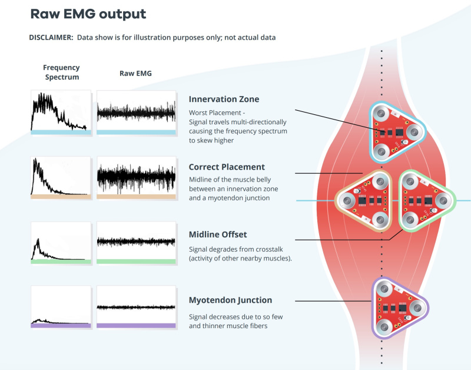

*画像提供：Advancer Technologies（MyoWare 2.0 Advanced Guideより）*

ここでは前腕を例に使う。
上記のとおり、対象の筋肉に対してセンサーの電極を正しい向きに配置できていれば、どの筋群にもセンサーを接続できる。
下の画像に示す筋群は、実際の縮尺どおりではない点に注意してほしい。

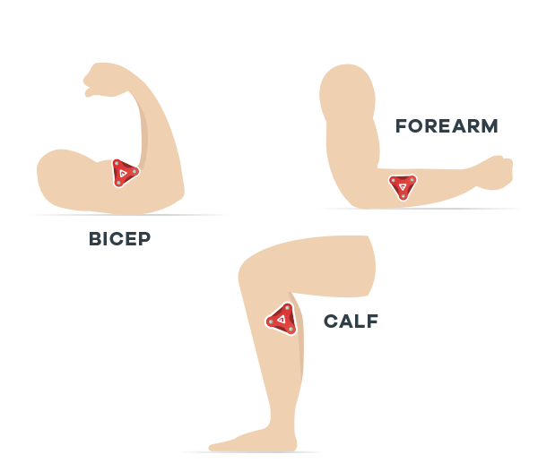

*画像提供：Advancer Technologies（MyoWare 2.0 Quick Start Guideより）*

他の筋群については、MyoWare 2.0 Advanced Guideを確認してほしい。
筋群をよく確認するには、画像を拡大してほしい。
画像に示されている位置はあくまで目安である。

### 皮膚の準備

> **注意：** EMGパッドを貼る皮膚に体毛がほとんど、あるいはまったくない状態にしておくこと。必要であれば、余分な体毛を取り除いておく。体毛があると接触不良の原因になるため避けること。

アルコール綿を使い、MyoWare 2.0筋電センサーを取り付ける部分の皮膚を清潔にする。
石けんで皮膚を洗うと皮膚に残留物が残ることがあるため避けること。

EMGパッドを貼る部分の皮膚を、アルコール綿で清潔にする。
イソプロピルアルコールを染み込ませた綿球でも、皮膚の油分や表面の汚れを取り除くのに十分である。
イソプロピルアルコールが蒸発してから、EMGパッドを皮膚に貼ること。

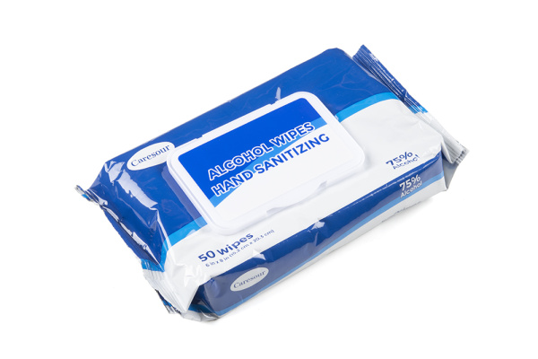

> **注意：** アルコール綿を顔に使うことは推奨しない。皮膚を清潔にする際は、手早く拭き取るだけで十分である。消毒用アルコールを使いすぎると皮膚が乾燥し、皮膚との接触不良によって読み取り値が断続的になることがある。

### シールドを積み重ねる

シールドにはキー構造があるため、基板同士を積み重ねる方法は1通りしかない。
GNDまたはREFとラベル付けされたスナップコネクタを探し、位置を揃えるだけでよい。
シールドの電源スイッチが必ずOFFの位置になっていることを確認すること。

親指と人差し指でスナップコネクタを押し込む。
内蔵のLiPoバッテリーを押さないよう注意すること。

### 筋群への接続

EMGパッドをMyoWare 2.0筋電センサーの裏側にスナップで取り付ける。
MyoWare 2.0 Cable Shieldを使うユーザーは、センサーケーブルのスナップコネクタに取り付けることになる。

電極の裏面を慎重に剥がし、粘着面を露出させる。

対象の筋肉にパッドを取り付ける。ここでは右の前腕を使う。

> **注意：** MyoWare 2.0 Quick Start Guideにあるとおり、皮膚に貼り付けた電極に後からMyoWare 2.0筋電センサーをスナップで取り付けるのは推奨しない。あざの原因になることがある。

> **注意：** デフォルトのゲインは、ほとんどの用途で十分なはずである。とはいえ、上級ユーザーはドライバーを使い、ENV出力のトリムポットを希望のゲイン設定に調整できる。トリムポットを時計回りに回すとゲインが上がり、反時計回りに回すとゲインが下がる。トリムポットは回しすぎや使いすぎで破損することがあるため、回すときは注意すること。

MyoWare 2.0筋電センサーの表側にシールドを積み重ねる際は、電源が切断されていることを確認すること。
すべての接続が終わったら、Power ShieldまたはLED Shieldの電源スイッチをONの位置に切り替える。
センサーをArduinoとコンピュータに接続するユーザーは、コンピュータがコンセントに接続されていないことを確認してから、Link Shieldの電源スイッチをONの位置に切り替える。

### シールドをArduino R3開発ボードに接続する

> **⚡ 危険：** MyoWare 2.0筋電センサーをコンピュータに接続してシリアルデバッグを行う際は、入力へのノイズを防ぎ、電力網（コンピュータの電源装置、コンピュータのドック、コンセントに接続された外部モニタなど）に接続された際の感電を防ぐため、**USBアイソレータ**をMyoWare 2.0筋電センサーと組み合わせて使うことを推奨する。下の図は、デスクトップとArduinoのUSBポートの間に接続されたUSBアイソレータ（青い基板として示されている）を示している。
>
> 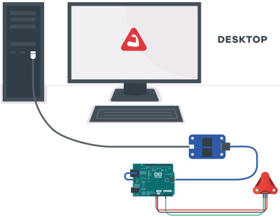
>
> *画像提供：Advancer Technologies（MyoWare 2.0 Quick Start Guideより）*
>
> USBアイソレータを持っていない場合は、バッテリー駆動のラップトップを使い、コンセントに接続していない状態を確認すること。
>
> ワイヤレスのキーボード・マウスを使うことも推奨する。
> 筋電センサーは非常に高感度であるため、電源につながった状態のラップトップのトラックパッドやキーボードからの信号を拾ってしまうことがある。
> その結果、筋電センサーに誤った読み取り値が生じ、Arduinoのアナログピンが高い値を読み取ってしまうことがある。

3.3VのArduinoを使うユーザーには、デフォルトのトレースを切断し、中央パッドと3.3V側の間にはんだジャンパーを追加してPWRジャンパーを調整することを推奨する。
5VのArduinoを使うユーザーは、ジャンパーを5V側に接続したままにしておいてよい。
ジャンパーの変更について詳しくは、ジャンパーパッドとPCBトレースの扱い方のチュートリアルを確認してほしい。

Arduino Uno R3のフォームファクタを持つ、選んだ開発ボードにArduino Shieldを積み重ねる。

MyoWare 2.0 Link ShieldとArduino ShieldのTRSコネクタの間にTRSケーブルを挿入する。
ここでは`A0`とラベル付けされたコネクタを使う。他のチャンネルを使う場合は、コードを調整することを忘れないでほしい。

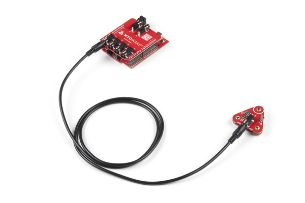

リモート用途には、電池パックの使用を推奨する。
ここでは、単三電池（NiMH）と4本用の電池パックでシステムに給電した。

コンピュータに接続する電源を取り外してから、MyoWare 2.0筋電センサーを接続したArduinoをUSBポートに接続すること。
これは、電力網に接続された際のノイズと感電を防ぐためである。これには、コンピュータのドックや外部モニタも含まれる。

準備ができたら、ArduinoとコンピュータのUSBポートの間にUSBケーブルを挿入する。

Bluetooth経由でセンサーデータを送信するユーザーは、Bluetoothペリフェラルデバイスとして動作するRedBoard Artemisに電池パックを取り付ける。
これは、Bluetoothペリフェラル用のサンプルコードがすでにアップロードされている前提である。
Bluetoothセントラルデバイスとして動作するRedBoard Artemisを、コンピュータのUSBポートに接続する。
Bluetoothペリフェラルデバイスは切断されているため、MyoWare 2.0筋電センサーはコンセントに接続されていないので、ラップトップは電源に接続してもよい。
ペリフェラルとして動作するRedBoard Artemisに再度プログラムを書き込む必要があるたびに、電源を必ず抜くようにするだけでよい。

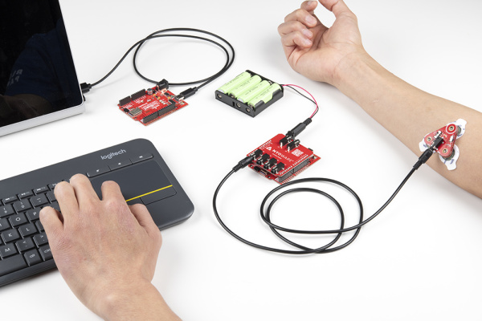

> **注意：** どちらの基板にコードをアップロードしているかわからなくなったら、付箋を用意して、それぞれのRedBoard Artemisに「peripheral」「central」とラベル付けしてみるとよい。

> **注意：** はんだ付けをするユーザーは、筋電センサーのPTHパッドに配線をはんだ付けし、マイクロコントローラーのアナログ入力に接続することもできる。次の画像は、MyoWare 2.0筋電センサーをArduino Uno R3に接続した例を示している。とはいえ、Raspberry PiのRP2040や、アナログ入力を持つ他のマイクロコントローラーに接続することもできる。マイクロコントローラーのシステム電圧が3.3Vの場合は、筋電センサーのVINに3.3Vを接続することを忘れないでほしい。

### Wireless Shieldを筋電センサーに接続する

> **注意：** デフォルトでは、MyoWare 2.0 Wireless Shieldにはペリフェラルデバイスとして動作するファームウェアが含まれている。MyoWare 2.0 Wireless Shieldを1台だけ接続するユーザーは、セントラルデバイス側にコードをアップロードするだけでよい。

> **注意：** BLEペリフェラルまたはセントラルデバイスのどちらにファームウェアをアップロードする場合も、MyoWare Arduino Libraryを必ずインストールすること。詳しくは、MyoWare Arduino Libraryの節を確認してほしい。

Wireless Shieldに新しいコードをアップロードする際は、MyoWare 2.0 Wireless Shieldとコンピュータの USBポートの間にUSBケーブルを接続する必要がある。
Wireless ShieldのPOWER SOURCEを選択する（この場合は内蔵のLiPoバッテリーを使うため、スイッチをVBAT側に切り替えた）。
準備ができたら、POWERスイッチをONの位置に切り替え、Arduino IDEを使って改造版のペリフェラルコード（すなわち**MyoWareBLEPeripheral.ino**）のアップロードを開始する。
これは、内蔵のLiPoバッテリーを充電する方法でもある。

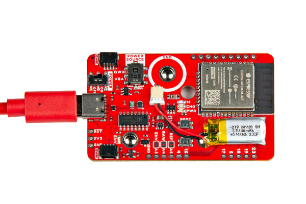

コードのアップロード後、POWERスイッチをOFFの位置に切り替える。
Power ShieldやLED Shieldのときと同様に、MyoWare 2.0筋電センサーの上にシールドを積み重ねる。
続いて、EMGパッドを基板の裏側に取り付ける。

> **注意：** 筋活動を測定するには、Wireless ShieldをMyoWare 2.0 Sensorの上に積み重ねる必要がある。Wireless Shield単体では筋活動を測定できない。

互換性のあるESP32開発ボードをコンピュータのUSBポートに接続する。
これがBluetoothセントラルデバイスとして動作する。
準備ができたら、セントラルデバイス用のコード（すなわち**MyoWareBLECentral.ino**）をESP32にアップロードする。
ここでは、IoT RedBoard - ESP32を使用した。

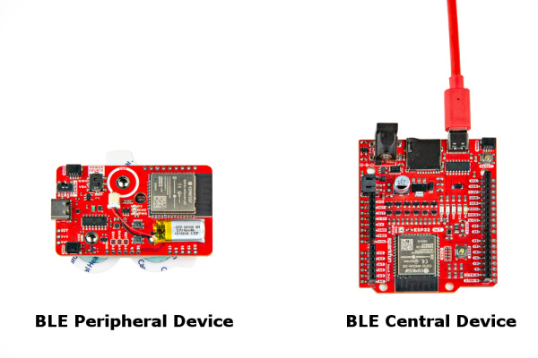

この時点で、筋電センサーを筋群に取り付ける前のセットアップは、下の画像のようになっているはずである。
どちらの基板がペリフェラルでどちらがセントラルかを把握しておくため、油性ペンやラベルメーカーで基板にラベルを付けておくとよい。

筋群を選んだら、アルコール綿で皮膚を準備し、電極の裏面を剥がし、スタックを筋群に取り付ける。
ここでは前腕を使用した。

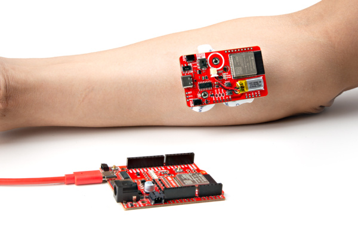

### Qwiic対応デバイスをWireless Shieldに接続する

他のQwiic対応デバイスを接続したい場合は、2枚の基板の間にQwiicケーブルを挿入するだけでよい。
あとは、Qwiic対応デバイスを収めるケースを用意するか、取り付ける方法を工夫すればよい。

### 外部ケーブル

センサーパッドをセンサーから離れた場所に取り付ける必要がある筋肉の場合は、MyoWare 2.0 Cable ShieldをMyoWare 2.0筋電センサーの裏側にスナップで取り付ける。
続いて、センサーケーブルを3.5mmのTRSコネクタに挿入する。

EMGパッドをスナップコネクタに取り付ける。
皮膚を清潔にし、筋肉を選んだら、電極の裏面を剥がして粘着面を露出させる。
続いて、MID、END、REFに応じて対象の筋群にパッドを取り付ける。

| スナップコネクタ | TRSピン | 電極ピン（CAB-12970） |
| --- | --- | --- |
| リファレンス [REF] | スリーブ | 黒 |
| 端部 [END] | リング | 青 |
| 中間 [MID] | チップ | 赤 |

### リファレンスケーブル

> **注意：** 内蔵のリファレンススナップコネクタは、ほとんどの用途で十分なはずである。とはいえ、筋群への接続が難しい場合は、リファレンスケーブルの入手を推奨する。これは主に、大腿四頭筋やハムストリングスなど大きな筋群向けに用意されている。

ホビーナイフを使い、GNDピンに最も近いリファレンスジャンパーパッドを切断する。
ジャンパーの近くにトレースがあるため、隣接するトレースを誤って切断しないよう注意すること。
ジャンパーの変更について詳しくは、ジャンパーパッドとPCBトレースの扱い方のチュートリアルを確認してほしい。

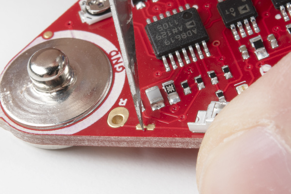

続いて、リファレンスケーブルをMyoWare 2.0筋電センサーに挿入する。タブが基板から離れる向きになるよう、ピンをハウジングにスライドさせる。

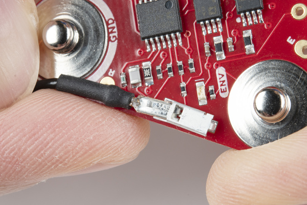

MyoWare 2.0筋電センサーの上にシールドを積み重ねる際は、ケーブルをシールドのスナップピンから慎重に離しておくこと。

> **注意：** リファレンスケーブルの配線が、MyoWare 2.0 Link Shieldのリファレンスポゴピンの上に重なることに気づくはずである。許容範囲が小さいため、シールドを上に積み重ねる際はケーブルをそっと引き離す必要がある。

リファレンスケーブルを取り外すには、マイナスドライバーの先端でタブをハウジングに押し込み、ピンをそっとハウジングから引き抜く。

ジャンパーパッドを閉じるには、ジャンパーパッドに少量のはんだを加える。

### MyoWareシールドの取り外し

プロトタイピングの際には、異なるシールドを試したり、トリムポットを調整したりしたくなることがある。
基板を取り外すには、マイナスドライバーが必要になる。
電源を切った状態で、マイナスドライバーをスナップコネクタの間に挿入し、ドライバーの妨げになる部品がないことを確認する。
マイナスドライバーをスナップコネクタの間にそっと滑り込ませる。

コネクタに対してドライバーを傾け、基板が外れるまで動かす。

片側が外れたら、基板同士を引き離し、残る2つのスナップコネクタも外す。

## スタンドアロンExample 0：LED

Arduinoなしで MyoWare 2.0筋電センサーをテストするには、MyoWare 2.0 Power ShieldまたはLED Shieldを使う方法がある。
どちらのシールドにも内蔵バッテリーがあるため、センサーに電源をはんだ付けする必要がない。
基板同士を積み重ねて筋群に貼り付けたら、電源スイッチをONの位置に切り替える。
筋肉を動かし始めて、Power ShieldのENV LEDやLED ShieldのLEDセグメントを点灯させられるか試してみてほしい。

MyoWare 2.0 Power Shieldを使っている場合は、ENV LEDを観察してほしい。
LEDは消灯しているはずである。
筋肉を収縮させると、ENVピンからの電圧が上昇する。
その結果、収縮するにつれてENV LEDが点灯し始め、明るさが増していく。
積み重ねた基板の間をよく見ると、MyoWare 2.0筋電センサー上のENV LEDが点灯していることにも気づくはずである。

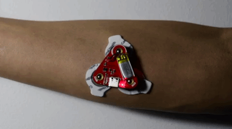

MyoWare 2.0 LED Shieldを使っている場合は、LEDセグメントを観察してほしい。
LEDセグメントは消灯しているはずである。
筋肉を収縮させると、ENVピンからの電圧が上昇する。
その結果、LEDセグメントが点灯し始める。
筋肉を収縮させるほど、より多くのLEDセグメントが点灯する。
完全に収縮させると、10個すべてのLEDセグメントが点灯する。

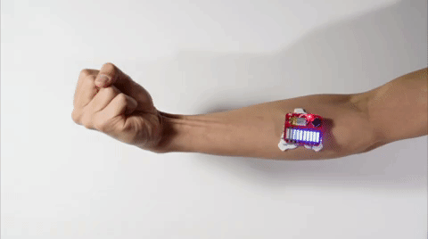

MyoWare 2.0 LED ShieldでMODEとラベル付けされたジャンパーを切断した（すなわちドットモードを有効にした）ユーザーは、異なる効果を目にするはずである。
先頭のLEDバー（「ドット」）が点灯しながらセグメントを移動する。
それより後ろのLEDは、光で埋まる代わりに消灯する。
完全に収縮させると、1つのLEDセグメントだけが点灯するはずである。

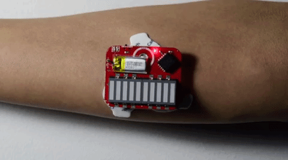

## Arduino Example 1：アナログ読み取り（単一センサー）

> **⚡ 危険：** MyoWare 2.0筋電センサーをコンピュータに接続してシリアルデバッグを行う際は、入力へのノイズを防ぎ、電力網（コンピュータの電源装置、コンピュータのドック、コンセントに接続された外部モニタなど）に接続された際の感電を防ぐため、**USBアイソレータ**をMyoWare 2.0筋電センサーと組み合わせて使うことを推奨する。USBアイソレータを持っていない場合は、バッテリー駆動のラップトップを使い、コンセントに接続していない状態を確認すること。ワイヤレスのキーボード・マウスを使うことも推奨する。筋電センサーは非常に高感度であるため、電源につながった状態のラップトップのトラックパッドやキーボードからの信号を拾ってしまうことがある。

> **注意：** このサンプルは、デスクトップで最新版のArduino IDEを使っている前提である。Arduinoを初めて使う場合は、Arduino IDEのインストールに関するチュートリアルを確認してほしい。RedBoard Artemisを使う場合は、ボード定義のインストールに関するガイドを確認してほしい。

### Example 1：アナログ読み取り（単一）

> **⚠ 警告：** 基板に電源が入っている間は、MyoWare 2.0 Link Shieldの出力（RAW、RECT、ENVの間）を切り替えないこと。出力スイッチを切り替えると電圧スパイクが発生し、筋電センサーを損傷することがある。

以下のサンプルは、Atmega328P搭載のRedBoard Plus上のアナログ入力を使い、筋電センサーのアナログ信号を読み取る。
ただし、Arduino Uno R3のフォームファクタを持つマイクロコントローラーであれば、どれでも使える。


まだであれば、ボード（この場合は**Arduino Uno**）と、対応するCOMポートを選択する。基板にコードをアップロードする。

```c
/*
  MyoWare Example_01_analogRead_SINGLE
  SparkFun Electronics
  Pete Lewis
  3/24/2022
  License: This code is public domain but you buy me a beverage if you use this and we meet someday.
  This code was adapted from the MyoWare analogReadValue.ino example found here:
  https://github.com/AdvancerTechnologies/MyoWare_MuscleSensor

  This example streams the data from a single MyoWare sensor attached to ADC A0.
  Graphical representation is available using Serial Plotter (Tools > Serial Plotter menu).

  *Only run on a laptop using its battery. Do not plug in laptop charger/dock/monitor.

  *Do not touch your laptop trackpad or keyboard while the MyoWare sensor is powered.

  Hardware:
  SparkFun RedBoard Artemis (or Arduino of choice)
  USB from Artemis to Computer.
  Output from sensor connected to your Arduino pin A0

  This example code is in the public domain.
*/

void setup() 
{
  Serial.begin(115200);
  while (!Serial); // optionally wait for serial terminal to open
  Serial.println("MyoWare Example_01_analogRead_SINGLE");
}

void loop() 
{  
  int sensorValue = analogRead(A0); // read the input on analog pin A0

  Serial.println(sensorValue); // print out the value you read

  delay(50); // to avoid overloading the serial terminal
}
```

アップロードが終わったら、Arduino Serial Plotter（**Tools** > **Serial Plotter**）を開き、ボーレートを**115200**に設定する。
MyoWare 2.0 Link Shieldの電源スイッチを切り替えて給電し、筋肉を収縮させ始めてみよう。
下のようなエンベロープ信号の出力が見られるはずである。
ここでは、MyoWare 2.0筋電センサーを右の前腕に取り付けた。
シリアル出力を確認したい場合は、Arduino Serial Monitorを開いて値を確認することもできる。

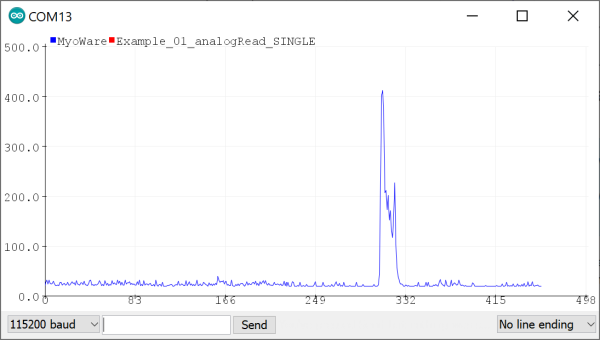

*エンベロープ信号のシリアルプロッター*

整流信号や生信号を確認するには、Link Shieldの電源スイッチをOFFの位置に切り替え、OUTPUTスイッチを整流または生の位置に調整してから、電源スイッチを再びONの位置に切り替える。
Serial Plotterを開き直すと、前腕を収縮させたときに、より小さな信号出力が見られるはずである。

以下の画像は、およそ300msの時点で前腕を収縮させ、整流出力ではおよそ22、生出力ではおよそ20の値だけ信号が増加している様子を示している。
なお、生信号はおよそ+VIN/2の電圧オフセットを中心に振れる。
波形の正・負の両方の部分が確認できるよう、+VINをマイクロコントローラーのADCの最大電圧に合わせておくこと。
グラフに示されている出力は値であり、電圧に変換されたものではない。

## Arduino Example 2：Bluetooth®経由でセンサーデータを送信する（単一センサー）

> **注意：** コードをアップロードする際は、コンピュータで2台のRedBoard Artemisを使うことになるため、正しいCOMポートを必ず選択すること。混乱を避けるため、アップロードしない側の基板を切断しておくか、テープでラベルを付けておくとよい。時間を節約するには、Arduino IDEを2つ起動し、それぞれの基板に対応するCOMポートを選ぶこともできる。

> **注意：** このサンプルは、デスクトップで最新版のArduino IDEを使っている前提である。Arduinoを初めて使う場合は、Arduino IDEのインストールに関するチュートリアルを確認してほしい。このサンプルではBluetoothにRedBoard Artemisを使うため、ボード定義のインストールに関するガイドを確認してほしい。

以下のサンプルは、1台の筋電センサーからのセンサーデータを送受信するために2台のRedBoard Artemisを必要とする。
これは、クリーンな信号が必要な場合や、センサーデータをワイヤレスで送信したい場合に役立つ。


Bluetoothのペリフェラルデバイスとセントラルデバイスがどのように動作するかについては、[ArduinoBLEライブラリのArduinoリファレンス](https://www.arduino.cc/reference/en/libraries/arduinoble/)で簡単に確認できる。

### Example 2a：Bluetoothペリフェラル「送信」

以下のサンプルは、RedBoard Artemisを使い、アナログ読み取り値をBluetooth経由でワイヤレス送信する。
まだであれば、ボード（この場合は**RedBoard Artemis**）と、対応するCOMポートを選択する。
下のコードをコピーし、Arduino IDEに貼り付ける。続いて、コードを基板にアップロードする。

```c
/*
  MyoWare Sensor BLE Peripheral SINGLE SENSOR Example
  SparkFun Electronics
  Pete Lewis
  3/17/2022

  This example reads a single MyoWare Muscle Sensor, and then gets that data from this RedBoard Artemis 
  (the peripheral) to a second RedBoard Artemis (the central) over BLE.

  This Artemis, aka the "BLE Peripheral", will read the sensor on A0.
  It will then update the value to the "bluetooth bulletin board."

  Note, in BLE, you have services, characteristics and values.
  Read more about it here:

  https://www.arduino.cc/reference/en/libraries/arduinoble/

  Note, before it begins reading the ADC and updating the data,
  It first sets up some BLE stuff:
    1. sets up as a peripheral
    2. sets up a service and characteristic (the data)
        -Note, Services and characteristics have custom 128-bit UUID,
        -These must match the UUIDs in the code on the central device.
    3. advertises itself

  In order for this example to work, you will need a second Artemis, and it will
  need to be programmed with the provided code specific to being a central device, 
  looking for this specific peripheral/service/characteristic.

  Note, both the service and the characteristic get unique UUIDs 
  (even though they are extremely close to being the same thing in this example)

  The second Artemis, aka the "BLE Central," will subscribe to the first board's 
  characteristic, and check to see if the value has been updated. When it has been 
  updated, it will print the value to the serial terminal.

  Hardware:
  MyoWare Sensor with Link Shield snapped on top.
  TRS cable from Link Shield to A0 port of Arduino Shield.
  Arduino Shield pressed into RedBoard Artemis.
  USB from Artemis to Computer.

  ** For consistent BT connection follow these steps:
  ** 1. Reset Peripheral
  ** 2. Wait 5 seconds
  ** 3. Reset Central
  ** 4. Enjoy BT connection
  **
  ** ArduinoBLE does not support RE-connecting two devices.
  ** If you loose connection, you must follow this hardware reset sequence again.

  This example code is in the public domain.
*/

#include <ArduinoBLE.h>

BLEService sensorDataService("19b10000-e8f2-537e-4f6c-d104768a1214"); // BLE Service named "sensorDataService"

// BLE Data Characteristic - custom 128-bit UUID, readable, writable and subscribable by central
// Note, "BLENotify" is what makes it subscribable
BLEByteCharacteristic dataCharacteristic("19b10001-e8f2-537e-4f6c-d104768a1214", BLERead | BLEWrite | BLENotify); 

const int ledPin = LED_BUILTIN; // pin to use for the LED

void setup() 
{
  Serial.begin(115200);
  while (!Serial); // optionally wait for serial terminal to open, useful with micros that have native USB
  Serial.println("MyoWare Single Sensor Example - BLE Peripheral");

  pinMode(ledPin, OUTPUT); // set LED pin to output mode

  if (!BLE.begin()) { // begin initialization
    Serial.println("starting BLE failed!");
    while (1);
  }
  Serial.println("BLE initiallized successfully");

  BLE.setLocalName("MYOWARE1"); // set advertised local name
  BLE.setAdvertisedService(sensorDataService); // set advertised service UUID
  sensorDataService.addCharacteristic(dataCharacteristic); // add the characteristic to the service
  BLE.addService(sensorDataService); // add service
  dataCharacteristic.writeValue(0); // set the initial value for the characeristic
  BLE.advertise(); // start advertising
}

void loop() 
{
  BLEDevice central = BLE.central(); // listen for BLE peripherals to connect

  if (central) // if a central is connected to peripheral
  {
    Serial.print("Connected to central: ");
    Serial.println(central.address()); // print the central's MAC address

    Serial.println("Reading Sensor and writing BLE characteristic values now...");

    // while the central is still connected to peripheral:
    while (central.connected()) 
    {
      int val_int = analogRead(A0); // Read the sensor attached to Analog Pin A0
      byte val_byte = map(val_int, 0, 1023, 0, 255); // map the int to a byte
      delay(10);
      dataCharacteristic.writeValue(val_byte); // "post" to "BLE bulletin board"
      // Note, because our second Artemis in this example (the central) is subscribed to this characteristic,
      // it can simply call Characteristic.valueUpdated() to see if it has been updated.
      // valueUpdated() will return True if updated, or false if no update has happened.
      // If it has been updated, the central Artemis can read the latest value using Characteristic.readValue();
    }
    Serial.print(F("Disconnected from central: ")); // when the central disconnects, print it out
    Serial.println(central.address());
  }
}
```

### Example 2b：Bluetoothセントラル「受信」

以下のサンプルは、RedBoard Artemisを使い、ペリフェラル側のRedBoard Artemisからアナログ読み取り値をBluetooth経由でワイヤレス受信する。
まだであれば、ボード（この場合は**RedBoard Artemis**）と、対応するCOMポートを選択する。
下のコードをコピーし、Arduino IDEに貼り付ける。続いて、コードを基板にアップロードする。

```c
/*
  MyoWare Receiver BLE Central SINGLE SENSOR Example
  SparkFun Electronics
  Pete Lewis
  3/17/2022

  This example sets up a SparkFun RedBoard Artemis as a BLE central device,
  Then, it connects to a second Artemis peripheral device that is reading a single MyoWare
  Muscle sensor. It then streams the data on the Serial Terminal.

  Note, in BLE, you have services, characteristics and values.
  Read more about it here:

  https://www.arduino.cc/reference/en/libraries/arduinoble/

  Note, before it begins checking the data and printing it,
  It first sets up some BLE stuff:
    1. sets up as a central
    2. scans for any peripherals
    3. Connects to the device named "MYOWARE1"
    4. Subscribes MYOWARE1's data characteristic

  In order for this example to work, you will need a second Artemis, and it will
  need to be programmed with the provided code specific to being a peripheral device, 
  and advertising as MYOWARE1 with the specific characteristic UUID.

  Note, both the service and the characteristic get unique UUIDs 
  (even though they are extremely close to being the same thing in this example)

  This Artemis, aka the "BLE Central," will subscribe to the peripheral board's 
  characteristic, and check to see if the value has been updated. When it has been 
  updated, it will print the value to the serial terminal.

  Hardware:
  SparkFun RedBoard Artemis
  USB from Artemis to Computer.

  ** For consistent BT connection follow these steps:
  ** 1. Reset Peripheral
  ** 2. Wait 5 seconds
  ** 3. Reset Central
  ** 4. Enjoy BT connection
  **
  ** ArduinoBLE does not support RE-connecting two devices.
  ** If you loose connection, you must follow this hardware reset sequence again.

  This example code is in the public domain.
*/

#include <ArduinoBLE.h>

void setup() 
{
  Serial.begin(115200);
  while (!Serial); // optionally wait for serial terminal to open, useful with micros that have native USB
  Serial.println("MyoWare Single Sensor Example - BLE Central");

  if (!BLE.begin()) // initialize the BLE hardware
  { 
    Serial.println("starting BLE failed!");
    while (1);
  }
  Serial.println("BLE initiallized successfully");

  BLE.scanForUuid("19b10000-e8f2-537e-4f6c-d104768a1214"); // start scanning for peripherals
}

void loop() 
{
  BLEDevice peripheral = BLE.available(); // check if a peripheral has been discovered

  if (peripheral) // discovered a peripheral, print out its info
  {
    Serial.print("Found ");
    Serial.print(peripheral.address());
    Serial.print(" '");
    Serial.print(peripheral.localName());
    Serial.print("' ");
    Serial.print(peripheral.advertisedServiceUuid());
    Serial.println();

    if (peripheral.localName() != "MYOWARE1")
    {
      return;
    }

    BLE.stopScan();

    checkUpdate(peripheral);

    Serial.println("Starting to scan for new peripherals again...");
    BLE.scanForUuid("19b10000-e8f2-537e-4f6c-d104768a1214"); // peripheral disconnected, scan again
    Serial.println("Scan has begun...");
  }
}

// Connect to peripheral
// Then continue to check if the data has been updated,
// If so, print it to terminal
void checkUpdate(BLEDevice peripheral) 
{
  Serial.println("Connecting ..."); // connect to the peripheral

  if (peripheral.connect()) 
  {
    Serial.println("Connected");
  } else {
    Serial.println("Failed to connect!");
    return;
  }

  Serial.println("Discovering attributes ..."); // discover peripheral attributes
  if (peripheral.discoverAttributes()) 
  {
    Serial.println("Attributes discovered");
  } else {
    Serial.println("Attribute discovery failed!");
    peripheral.disconnect();
    return;
  }

  // retrieve the data characteristic
  BLECharacteristic dataCharacteristic = peripheral.characteristic("19b10001-e8f2-537e-4f6c-d104768a1214");

  if (!dataCharacteristic) 
  {
    Serial.println("Peripheral does not have that characteristic!");
    peripheral.disconnect();
    return;
  } else if (!dataCharacteristic.canWrite()) 
  {
    Serial.println("Peripheral does not have a writable characteristic!");
    peripheral.disconnect();
    return;
  } else if (!dataCharacteristic.canRead()) 
  {
    Serial.println("Peripheral does not have a readable characteristic!");
    peripheral.disconnect();
    return;
  } else if (!dataCharacteristic.canSubscribe()) 
  {
    Serial.println("Characteristic is not subscribable!");
    peripheral.disconnect();
    return;
  } else if (!dataCharacteristic.subscribe()) 
  {
    Serial.println("subscription failed!");
    peripheral.disconnect();
    return;
  }

  while (peripheral.connected()) // while the peripheral is connected
  {
    if (dataCharacteristic.valueUpdated()) // Check to see if the value of the characteristic has been updated
    {
      byte received_val = 0;
      dataCharacteristic.readValue(received_val); // note, readValue returns nothing, and needs the variable to be passed by reference
      Serial.println(received_val);
    }
    delay(1);
  }
  Serial.println("Peripheral disconnected");
}
```

### 実際に確認できること

それぞれの基板に対応するCOMポートを選んだ2つのArduino IDEを開いた状態で、**115200**ボーに設定したSerial Monitorに次のような出力が見られるはずである。
Bluetoothの接続がうまくいかない場合は、まずペリフェラル側のリセットボタンを押し、5秒ほど待ってから、セントラル側のリセットボタンを押してみてほしい。
接続できたら、筋電センサーの読み取り値がセントラルへワイヤレス送信される。
腕を収縮させて、値が増加する様子を確認してみてほしい。

グラフィカルな出力を確認したい場合は、セントラルデバイス（センサーデータを受信するRedBoard Artemis）用のArduino Serial Monitorを閉じる。
続いて、Arduino Serial Plotterを開く。
下のような出力が見られるはずである。
ここでは、前腕の筋肉を収縮させると値が増加し、筋肉をリラックスさせると値が減少した。

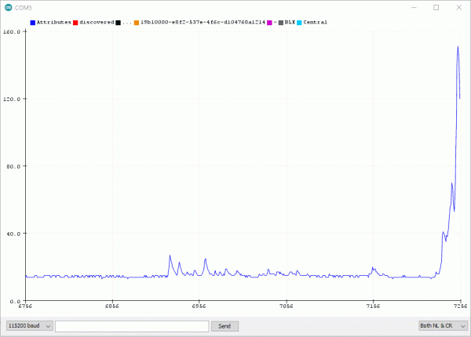

## さらなるサンプル

もっとサンプルを探しているだろうか。
BLE経由で複数のアナログチャンネルを使うGitHubリポジトリも確認してみてほしい。
[Tsunami Super WAV Trigger（Qwiic）](https://www.sparkfun.com/products/18159)とスピーカーに接続するプロジェクトのサンプルもある。

[GitHubリポジトリ：SparkFun MyoWare Code Examples](https://github.com/sparkfun/SparkFun_MyoWare_Arduino_Examples)

異なるマイクロコントローラーを使っているだろうか。
MakeCode_ExamplesフォルダーからMakeCodeとmicro:bitでもこのセンサーを使える。
Python_ExamplesフォルダーにあるRP2040向けのMicroPythonのサンプルも確認してみてほしい。

## MyoWare Arduinoライブラリ

> **注意：** このサンプルは、デスクトップで最新版のArduino IDEを使っている前提である。Arduino IDE、ライブラリ、ボードアドオンを初めて使う場合は、以下のチュートリアルを確認してほしい。
>
> - Installing the Arduino IDE
> - Installing an Arduino Library
> - Installing Board Definitions in the Arduino IDE

> **注意：** CH340デバイスをコンピュータに接続したことがない場合は、USB-シリアル変換チップ用のドライバのインストールが必要になることがある。インストールについては、How to Install CH340 Driversの節を確認してほしい。

Advancer Technologiesは、MyoWare 2.0筋電センサーとそのエコシステム向けのArduinoライブラリを作成している。
このライブラリは、MyoWare 2.0筋電センサーやMyoWare 2.0 Wireless Shieldなどとのやり取りをユーザーが行いやすくする。
MyoWare Arduinoライブラリは、Arduino Library Managerで「**MyoWare Arduino Library**」と検索してダウンロードできるほか、[GitHubリポジトリ](https://github.com/AdvancerTechnologies/MyoWare-Arduino-Library)からZIPファイルを入手して手動でインストールすることもできる。

[AdvancerTechnologies / MyoWare Arduino Library（ZIP）](https://github.com/AdvancerTechnologies/MyoWare-Arduino-Library/archive/main.zip)

## Arduino Example 3：Wireless Shield（ESP32）を使ってBluetooth®経由でセンサーデータを送信する

> **注意：** コードをアップロードする際は、コンピュータでIoT RedBoard - ESP32とMyoware 2.0 Wireless Shieldを使うことになるため、正しいCOMポートを必ず選択すること。混乱を避けるため、アップロードしない側の基板を切断しておくか、テープでラベルを付けておくとよい。時間を節約するには、Arduino IDEを2つ起動し、それぞれの基板に対応するCOMポートを選ぶこともできる。

> **注意：** このサンプルは、デスクトップで最新版のArduino IDEを使っている前提である。Arduinoを初めて使う場合は、Arduino IDEのインストールに関するチュートリアルを確認してほしい。このサンプルではBluetoothにIoT RedBoard - ESP32とMyoWare 2.0 Wireless Shieldを使うため、ボード定義のインストールに関するガイドを確認してほしい。

以下のサンプルは、1台の筋電センサーからのセンサーデータを送受信するために、Wireless ShieldとBLEモジュールを必要とする。
これは、クリーンな信号が必要な場合や、センサーデータをワイヤレスで送信したい場合に役立つ。

Bluetoothのペリフェラルデバイスとセントラルデバイスがどのように動作するかについては、[ArduinoBLEライブラリのArduinoリファレンス](https://www.arduino.cc/reference/en/libraries/arduinoble/)で簡単に確認できる。

> **注意：** 執筆時点では、Arduino IDE、ESP32ボード定義、ArduinoBLE Arduinoライブラリについて、次のバージョンを使用した。
>
> - **Arduino IDE v2.3.2**
> - **esp32 by Espressif Systems v2.0.14**
> - **ArduinoBLE by Arduino v1.3.6**
> - **MyoWare Arduino Library v1.0.0**

### Example 3a：Bluetoothペリフェラル「送信」

このサンプルは、MyoWare 2.0 Wireless Shieldのファームウェアを改造しているユーザー向けである。
ペリフェラルデバイスを複数使う場合に便利である。
このサンプルコードは、MyoWare 2.0 Wireless Shieldを使ってアナログ読み取り値をBluetooth経由でワイヤレス送信する。
まだであれば、MyoWare 2.0 Wireless Shieldをコンピュータに接続する。
Power Sourceを選び、電源スイッチをONの位置に切り替える。

このサンプルは、別のGitHubリポジトリにあるMyoWare Arduinoライブラリのコードを使用している。
ライブラリをインストールしたら、メニューから**File** > **Examples** > **MyoWare Arduino Library** > **[MyoWareBLEPeripheral](https://github.com/AdvancerTechnologies/MyoWare-Arduino-Library/blob/main/examples/MyoWareBLEPeripheral/MyoWareBLEPeripheral.ino)**を選択する。

デフォルトでは、Wireless Shieldにはペリフェラルデバイスとして動作するファームウェアが含まれている。
複数のWireless Shieldをセントラルデバイスに接続するユーザーは、それぞれ固有の名前にBLEペリフェラルデバイス名を変更することを推奨する。
このサンプルでは、追加のペリフェラルデバイスごとに、**MyoWareBLEPeripheral.ino**内の次の行の番号を変更する。

```c
const String localName = "MyoWareSensor1";  // recommend making this unique for 
                                            // each Wireless shield (e.g. MyoWareSensor1,
                                            // MyoWareSensor2, ...)
```

2台目のWireless Shieldでは、`localname`を`MyoWareSensor2`に変更する必要がある。

```c
const String localName = "MyoWareSensor2";  // recommend making this unique for 
                                                // each Wireless shield (e.g. MyoWareSensor1,
                                                // MyoWareSensor2, ...)
```

まだであれば、ボードと対応するCOMポート（この場合はCOM10の**ESP32 Dev Module**）を選択する。続いて、改造したコードを基板にアップロードする。

### Example 3b：Bluetoothセントラル「受信」

以下のサンプルは、IoT RedBoard - ESP32を使い、ペリフェラル側のMyoWare 2.0 Wireless Shieldからアナログ読み取り値を受信する。
もちろん、Arduino BLEに対応する他のArduinoボードも使える。
まだであれば、IoT RedBoard - ESP32をコンピュータに接続する。

このサンプルも、MyoWare Arduinoライブラリのコードを使用している。
ライブラリをインストールしたら、メニューから**File** > **Examples** > **MyoWare Arduino Library** > **[MyoWareBLECentral](https://github.com/AdvancerTechnologies/MyoWare-Arduino-Library/blob/main/examples/MyoWareBLECentral/MyoWareBLECentral.ino)**を選択する。

まだであれば、ボードと対応するCOMポート（この場合はCOM10の**SparkFun ESP32 IoT RedBoard**）を選択する。続いて、コードを基板にアップロードする。

### 実際に確認できること

> **注意：** MyoWare 2.0 Wireless Shieldと筋電センサーに初めて電力を入れる際は、対象の筋肉をリラックスさせておくことを推奨する。

対象の筋群を選び、アルコール綿で皮膚を準備し、電極の裏面を剥がし、スタックを筋群に取り付ける。
ここでは前腕を使用した。POWERスイッチをONの位置に切り替える。


IoT RedBoard - ESP32をコンピュータに接続したまま、Arduino Serial Monitorを開き、ボーレートを**115200**に設定する。
Bluetoothの接続がうまくいかない場合は、まずペリフェラル側のリセットボタンを押し、5秒ほど待ってから、セントラル側のリセットボタンを押してみてほしい。

- ペリフェラルをリセットする
- 5秒待つ
- セントラルをリセットする
- Bluetooth接続を楽しむ

> **注意：** ArduinoBLEは、2台のデバイスの再接続に対応していない。接続が切れた場合は、このハードウェアリセットの手順を再び行う必要がある。

> **注意：** ArduinoBLEは、4台以上のペリフェラルデバイスの接続には対応していない。

接続できたら、筋電センサーの読み取り値がセントラルデバイスへワイヤレス送信される。
筋肉を収縮させて、値が増加する様子を確認してみてほしい。
以下は、前腕の筋肉を収縮させ、その後リラックスさせたときのSerial MonitorとSerial Plotterでの読み取り値である。

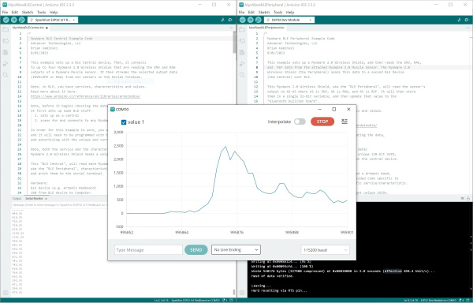

グラフィカルな出力を確認したい場合は、セントラルデバイス（センサーデータを受信するIoT RedBoard - ESP32）用のArduino Serial Monitorを閉じる。
続いて、Arduino Serial Plotterを開く。
上記と同様の出力が見られるはずである。
ここでは、前腕の筋肉を収縮させると値が増加し、筋肉をリラックスさせると値が減少した。

## さらに多くのサンプル

もっとサンプルを探しているだろうか。
[MyoWare Arduinoライブラリの他のサンプル](https://github.com/AdvancerTechnologies/MyoWare-Arduino-Library/tree/main/examples)も確認してみてほしい。

[GitHubリポジトリ：AdvancerTechnologies / MyoWare Arduino Library](https://github.com/AdvancerTechnologies/MyoWare-Arduino-Library/tree/main/examples)

## トラブルシューティング

期待どおりに動作せず、助けが必要だろうか。
製品が期待どおりに動作しない場合や、技術的なサポートや情報が必要な場合は、[SparkFun Technical Assistance](https://www.sparkfun.com/technical_assistance)のページで初期のトラブルシューティングを確認してみてほしい。

そこで解決しない場合は、[MyoWareのRedditフォーラム](https://www.reddit.com/r/myoware)や、[Biometrics部門のSparkFunフォーラム](https://forum.sparkfun.com/viewforum.php?f=143)がヘルプを探したり質問したりするのに適した場所である。

参考までに、MyoWare 2.0 Quick Start Guideに掲載されているMyoWare 2.0筋電センサーのトラブルシューティングのヒントを以下に示す。

- センサーに電力が供給されている限り、Vin LEDは常に点灯し続けるはずである。
- 電源を入れると、ENV LEDが一瞬点灯することがあるが、1〜2秒後には消灯するはずである。それ以降は、センサーが筋肉の収縮を検知したときにだけ点灯するはずである。
- センサー（あるいは外部ケーブル）が皮膚の電極に接続されていない場合、ENV LEDが不規則に点灯・消灯したり、点灯したままになったりすることがある。これは正常な動作である。
- 皮膚の電極に接続されている状態でENV LEDが一見無作為に点灯する場合は、通常、電極と皮膚の接触不良を示している。その部分を清潔にし、新しい電極を貼ってみてほしい。
- 収縮させてもENV LEDが点灯しない場合は、センサーのセットアップにさまざまな問題が考えられる。このガイドの手順とヒントを再確認し、正しくセットアップできているか確認してほしい。
- ほとんどの場合、センサーのゲインを調整する必要はまったくない。
- センサーから一貫した高品質の信号が得られるようになるまでは、センサーのゲインを調整しないことを推奨する。

### MyoWare Wireless Shield

- Bluetoothが最初の接続に失敗する場合、ペリフェラルとセントラルが互いを発見できていない可能性がある。まずペリフェラル側のリセットボタンを押し、5秒ほど待ってから、セントラル側のリセットボタンを押すという手順で、2つのBluetoothを再接続してみてほしい。
- MyoWare 2.0 Wireless Shieldがセントラルデバイスに接続されている際、青色のLEDが点滅していたり、完全には点灯していなかったりするだろうか。LiPoバッテリーを確認し、充電されているか確認してみてほしい。

## まとめ・参考資料

MyoWare 2.0筋電センサーの立ち上げに成功したら、いよいよ自分のプロジェクトに組み込む番である。
義肢に組み込んだり、サーボを制御して何かを掴んだり、ハロウィンの衣装やビデオゲームに使ったり、ダンスパフォーマンスでLEDを点灯させたりしてみてほしい。
より詳しい情報は、以下のリソースを確認してほしい。

- 基板寸法
  - [筋電センサー（PNG）](https://cdn.sparkfun.com/assets/learn_tutorials/1/9/5/6/MyoWare_v2_Muscle_Sensor_Board_Dimensions.png)
  - [Sensor Cover（PNG）](https://cdn.sparkfun.com/assets/learn_tutorials/1/9/5/6/MyoWare_v2_Sensor_Cover_Board_Dimensions.png)
  - [Cable Shield（PNG）](https://cdn.sparkfun.com/assets/learn_tutorials/1/9/5/6/MyoWare_V2_Cable_Shield_Board_Dimensions.png)
  - [Power Shield（PNG）](https://cdn.sparkfun.com/assets/learn_tutorials/1/9/5/6/21868-MyoWare_v2_Power_Shield_Board_Dimensions.png) v2.0.3
  - [LED Shield（PNG）](https://cdn.sparkfun.com/assets/learn_tutorials/1/9/5/6/MyoWare_v2_LED_Shield_Board_Dimensions.png)
  - [Link Shield（PNG）](https://cdn.sparkfun.com/assets/learn_tutorials/1/9/5/6/MyoWare_v2_Link_Shield_Board_Dimensions.png)
  - [Arduino Shield（PNG）](https://cdn.sparkfun.com/assets/learn_tutorials/1/9/5/6/MyoWare_v2_Arduino_Shield_Board_Dimensions.png)
  - [Wireless Shield（PNG）](https://cdn.sparkfun.com/assets/learn_tutorials/1/9/5/6/MyoWare_v20_Wireless_Shield_Board_Dimensions_1.png)
- [Advancer Technologies](http://myoware.com/)：MyoWare 2.0
  - [Quickstart Guide（PDF、4.37MB）](https://cdn.sparkfun.com/assets/learn_tutorials/1/9/5/6/MyoWare_v2_QuickStartGuide.pdf)
  - [Advanced Guide（PDF、9.00MB）](https://cdn.sparkfun.com/assets/learn_tutorials/1/9/5/6/MyoWare_v2_AdvancedGuide-Updated.pdf)
  - [特許情報](http://myoware.com/patents)
- [MCP73831データシート（PDF）](https://cdn.sparkfun.com/assets/learn_tutorials/6/9/5/MCP738312.pdf)
- ポリマーリチウムイオンバッテリー（40mAh）
  - [データシート（PDF）](http://cdn.sparkfun.com/datasheets/Prototyping/SPE-00-301120-40mah-en-1.0ver.pdf)
  - [MSDS（PDF）](https://cdn.sparkfun.com/datasheets/Prototyping/DTP301120%20MSDS.PDF)
- [Arduinoリファレンス：ArduinoBLEライブラリ](https://www.arduino.cc/reference/en/libraries/arduinoble/)
- GitHub
  - [SparkFun MyoWare Code Examples](https://github.com/sparkfun/SparkFun_MyoWare_BLE_Arduino_Examples) — Arduino、MicroPython、MakeCodeを使ったサンプルコードのリポジトリ
  - [MyoWare Arduino Library](https://github.com/AdvancerTechnologies/MyoWare-Arduino-Library) — MyoWare 2.0筋電センサーやMyoWare 2.0 Wireless Shieldなどとのやり取りを助けるMyoWare Arduinoライブラリのリポジトリ
- [MyoWare 2.0 Ecosystem Page](https://www.sparkfun.com/myoware)
- [SFE Product Showcase](https://youtu.be/d1oUHqPa35I)

> 注：この製品は[特許で保護](http://myoware.com/patents)されている。模造基板を防ぐため、MyoWare 2.0エコシステムの基板についてはEagle設計ファイルとGitHubのハードウェアリポジトリは公開されていない。

次のプロジェクトのヒントが欲しければ、[Biometricsタグの付いた関連チュートリアル](https://learn.sparkfun.com/tutorials/tags/biometrics)も確認してみてほしい。

- [Hackers in Residence - Hacking MindWave Mobile](https://learn.sparkfun.com/tutorials/hackers-in-residence---hacking-mindwave-mobile) — 99ドルの商用グレードEEGセンサー、MindWave Mobileのレビュー・分解・改造チュートリアル
- [AD8232 Heart Rate Monitor Hookup Guide](https://learn.sparkfun.com/tutorials/ad8232-heart-rate-monitor-hookup-guide) — 自分だけの心拍数モニターを作る方法を学ぶ
- [MyoWare Muscle Sensor Kit](https://learn.sparkfun.com/tutorials/myoware-muscle-sensor-kit) — Advancer Technologies社のMyoWare筋電センサーと組み合わせて使う製品ライン
- [SparkFun Photodetector (MAX30101) Hookup Guide](https://learn.sparkfun.com/tutorials/sparkfun-photodetector-max30101-hookup-guide) — MAX30105パーティクルセンサーの後継となる、高感度な光学センサーSparkFun Photodetector - MAX30101（Qwiic）。MAX30101センサーから生データを取得する方法を学べるチュートリアル

タグ: Arduino、Artemis、生体計測、BLE、Bluetooth、ESP32、Hookup、LED、電源、センサー、シールド、ウェアラブル、ワイヤレス

---

出典：[Getting Started with the MyoWare® 2.0 Muscle Sensor Ecosystem](https://learn.sparkfun.com/tutorials/getting-started-with-the-myoware-20-muscle-sensor-ecosystem)（SparkFun Learn）を日本語に翻訳し、再構成した。
原文は [CC BY-SA 4.0](https://creativecommons.org/licenses/by-sa/4.0/) ライセンスで公開されており、本ページも同ライセンスの下で提供する。
