# Raspberry Pi Zero 2 Wを始める

絶大な人気を誇るRaspberry Piのシングルボードコンピュータ（SBC）カタログにおける最新モデル、[Raspberry Pi Zero 2 W](https://www.sparkfun.com/products/18713)は、クアッドコアの64ビットArm Cortex-A53 CPUを搭載し、[Pi Zero W](https://www.sparkfun.com/products/14277)をそのまま置き換えられるアップグレード版として登場した。
このガイドでは、Pi Zero 2 Wのハードウェア面での改良点、デスクトップ構成でのセットアップ方法、Raspberry Pi OSのインストールと基本的な使い方を紹介する。

- Raspberry Pi Zero 2 W
- Raspberry Pi Zero 2 W（ヘッダー付き）

> **注意：** 「Raspberry Pi Zero 2 WH」は、ボードにヘッダーがあらかじめ実装されている点を除けば「Raspberry Pi Zero 2 W」と機能的に同じである。

SparkFun Raspberry Pi Zero 2 W Basic Kitは、Pi Zero 2 Wのセットアップに必要な最小限の構成を提供する。
このキットには、Pi Zero 2 W本体、Raspberry Pi 12.5W micro-USB電源アダプタ、mini HDMIケーブル、USB OTGケーブル、64GBのmicroSDカード（アダプタ付き）が含まれる。

- SparkFun Raspberry Pi Zero 2 W Basic Kit（廃盤）

## 必要な部品

このガイドは、ユーザーがPi Zero 2 W Basic Kitを持っている前提で進める。
キットを持っていない場合は、必要なアクセサリー（電源アダプタ、mini HDMIケーブル、USB OTGケーブルまたはUSBハブ、microSDカード）を用意しておくこと。
Basic Kitに加えて、このチュートリアルを進めるにはモニタ（またはテレビ）、キーボード、マウス、USBハブ（複数のUSBデバイスを接続する場合）が必要になる。
キーボード・マウスのセットが必要な場合は、[Logitech K400 Plus Wireless Touch Keyboard](https://www.sparkfun.com/products/16300)を検討してみるとよい。

### おすすめの読み物

以下のチュートリアルで扱われている概念に馴染みがない場合は、このガイドを続ける前に目を通しておくとよい。

- Single Board Computer Benchmarks — シングルボードコンピュータやコンピューティングモジュール上でさまざまなベンチマークプログラムをセットアップし、実行する方法。各世代の結果は以降のページに掲載されている
- SD Cards and Writing Images — Raspberry Pi、PCDuino、お気に入りのSBC向けに、SDカードへイメージをアップロードする方法
- [Raspberry PiのGPIO](./raspberry-gpio.md) — PythonまたはC++を使い、Raspberry PiのI/Oラインを制御する方法
- [Raspberry PiのSPIとI2C](./raspberry-pi-spi-and-i2c-tutorial.md) — C/C++用のwiringPi I/OライブラリとPython用のspidev/smbusを使い、Raspberry PiのシリアルI2CバスとSPIバスを利用する方法

## ハードウェア概要

この節では、Pi Zero 2 Wに搭載されているハードウェアを見ていき、関連する箇所では前バージョンや他のRaspberry Pi SBCとの比較も行う。

### Raspberry Pi RP3A0 SiP

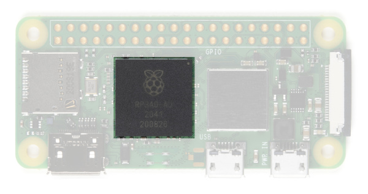

Pi Zero 2 Wには、クアッドコアの64ビットArm Cortex-A53 CPU（クロック周波数1GHz）を内蔵した、アップグレード版のRP3A0システムインパッケージ（SiP）が搭載されている。
このSiPは、Broadcom BCM2710A1ダイと512MBのLPDDR2 SDRAMを統合している。
このプロセッサにより、Raspberry Pi Zero 2 Wは、オリジナルのシングルコアRaspberry Pi Zeroと比べてシングルスレッド性能が40%向上し、マルチスレッド性能は5倍に向上している。

### Mini HDMI

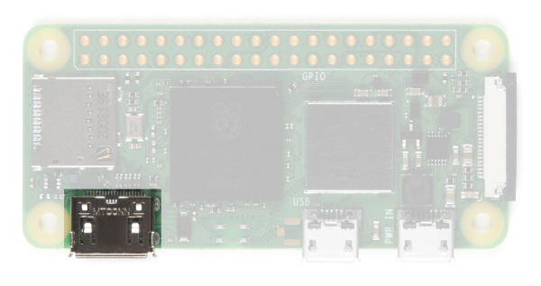

標準サイズのHDMIコネクタを使う従来のRaspberry Piモデルとは異なり、Zeroはスペースを節約するためmini HDMIコネクタを採用している。
Zeroをモニタやテレビに接続するには、mini HDMIからHDMIへの変換アダプタ、または[ケーブル](https://www.sparkfun.com/products/14274)が必要になる。

### USB On-the-Go

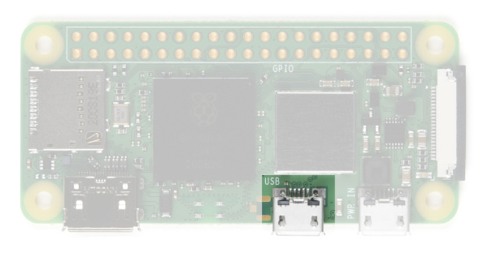

Raspberry Pi 3や他のモデルでは、従来2〜4個の標準サイズのメスUSBコネクタが搭載されており、マウス、キーボード、WiFiドングルなどさまざまなデバイスを接続できた。
Zeroはここでもスペースを節約するため、[USB On-the-Go（OTG）](https://en.wikipedia.org/wiki/USB_On-The-Go)接続を採用している。
Pi Zeroは、オリジナルのRaspberry Pi AおよびA+モデルで使われていたのと同じBroadcom ICを使っている。
このICはUSBポートに直接接続されてOTG機能を提供する。これは、オンボードのUSBハブを使って複数のUSB接続を可能にしているPi B、B+、2、3モデルとは異なる点である。

標準的なオスのUSBコネクタを持つデバイスを接続するには、Basic Kitに含まれる[USB OTGケーブル](https://www.sparkfun.com/products/14276)を使う。
micro USB側の端をPi Zeroに差し込み、USBデバイスを標準的なメスのUSB入力に差し込む。

他の標準的なUSBデバイスと組み合わせて使う場合は、電源付きのUSBハブを使うことを推奨する。
ワイヤレスのキーボード・マウスセットは、両方のデバイスに対して1つのUSBドングルで済むため、最も相性がよい。

### 電源

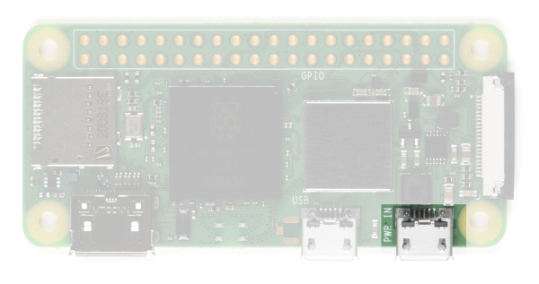

他のPiと同様、電源はmicro USBコネクタから供給される。
電源用USBに供給する電圧は**5〜5.25V**の範囲にすること。

### microSDカードスロット

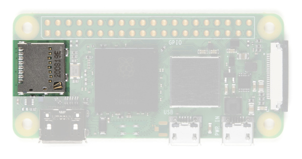

もう一つのおなじみのインターフェースが、microSDカードスロットである。
Raspberry Piのイメージファイルを収めたmicroSDカードをここに挿入する。

### WiFiとBluetooth

Raspberry Pi Zero 2 Wは、2.4GHzの802.11 b/g/nワイヤレスLANとBluetooth 4.2を搭載しており、Bluetooth Low Energy（BLE）にも対応し、モジュラー適合認証も取得している。
これにより、WiFiドングルや、Bluetoothキーボード・マウスに置き換えた場合のUSBキーボード・マウスなど、USB経由で必要になっていた接続の多くを解放できる。

### カメラコネクタ

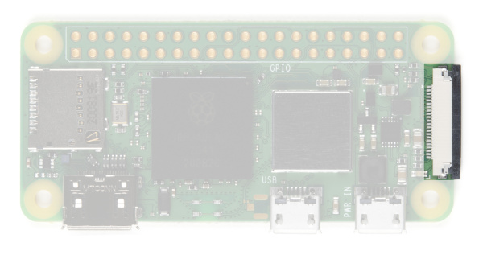

Raspberry Pi Zero V1.3以降とすべてのZero Wには、オンボードのカメラコネクタが搭載されている。
これを使い、[Raspberry Pi Cameraモジュール](https://www.sparkfun.com/products/14028)を接続できる。
ただし、このコネクタは22ピン0.5mmピッチであり、標準的なPiとは異なる。
カメラをPi Zero Wに接続するには、別の[ケーブル](https://www.sparkfun.com/products/14272)が必要になる。

### GPIO

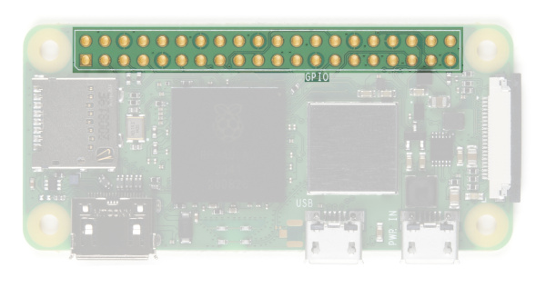

他のすべてのRaspberry Piモデルと同様、Pi Zero 2 Wには2×20のGPIOピンが引き出されており、SPI、I²C、デジタルI/O、PWMなどの機能を利用できる。
GPIOヘッダーを使う場合は、[ヘッダー](https://www.sparkfun.com/products/14275)をはんだ付けしておくとよい。

## OSの選択とインストール

Pi Zero 2 Wの電源を入れる前に、Basic Kitに付属のmicroSDカードにRaspberry Pi OS（あるいは好みであれば、Raspberry Piで動作するサードパーティ製OS）のイメージを書き込む必要がある。
Raspberry Pi Foundationは、OSイメージのダウンロードとmicroSDカードへの書き込みを簡単にする、Raspberry Pi Imagerという優れたツールを開発した。
この節では、このツールを使ってRaspberry Pi OSのイメージをmicroSDカードに書き込む方法を簡単に説明する。

### Raspberry Pi Imager

Raspberry Pi Imagerツールを使うと、Raspberry Pi対応OSのイメージを選択してmicroSDカードに書き込む作業が、以前よりずっと簡単になる。
必要なのは、OSとストレージデバイスを選択するだけで、あとはツールが処理してくれる。
以下のリンクから、Raspberry Piのソフトウェアページでツールをダウンロードできる。

[Raspberry Pi Imagerツールをここから入手する](https://www.raspberrypi.com/software/)

ツールをダウンロードしてコンピュータにインストールしたら、以下の手順でイメージのインストールを完了させる。

- microSDカードとSDアダプタを、コンピュータの適切なポートに**挿入**する。
- **Raspberry Pi Imager**を開く。
- **Choose OS**ボタンをクリックし、使用したいOSを選択する（このチュートリアルではデフォルトのRaspberry Pi OSを使う）。
- **Choose Storage**ボタンをクリックし、microSDカードのドライブの場所を選択する。
- **Write**をクリックする。

OSをmicroSDカードに書き込むには、選択したバージョンやポート・microSDカードの速度によって数分かかることがある。
書き込みが終わると、ツールは自動的にmicroSDカードのソフトウェア的な取り出し処理を行うので、処理が完了したら取り外せる。

> **注意：** ソフトウェアページには、手動でダウンロード・インストールしたいユーザー向けに、他のさまざまなOSへのリンクも掲載されている。
> イメージの手動書き込み・インストールについて助けが必要な場合は、SD Cards and Writing Imagesのチュートリアルを確認してほしい。

## ハードウェアの組み立て

OSをmicroSDカードに書き込んだら、すべてを接続していこう。
このチュートリアルでは、すべての入力デバイスを単一のUSB接続にまとめるため、[Logitech K400 Plus Wireless Touch Keyboard](https://www.sparkfun.com/products/16300)を使用した。
なお、このキーボードはSparkFun Raspberry Pi Zero 2 W Basic Kitには**含まれていない**。

### microSDカードを挿入する

microSDカードを、Pi Zero 2 WのmicroSDソケットに差し込む。

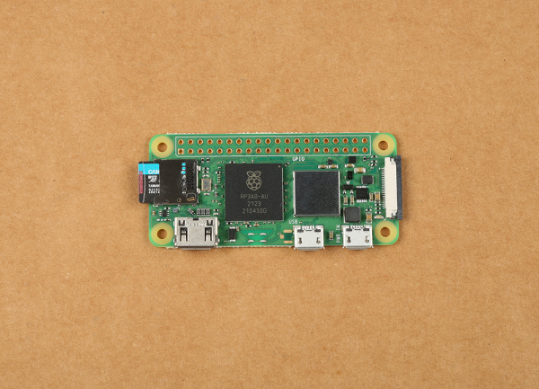

### 周辺機器を接続する

次に、周辺機器をPiに接続する。
ほとんどのユーザーは、Piを使い始めるのに少なくともモニタとキーボード・マウスが必要になる。

#### USB OTGケーブル

USB OTGケーブルを、Piの**USB**とラベル付けされたmicro USBコネクタに差し込む。
これにより、キーボードやマウスなどのデバイス用に標準的なUSB接続が提供される。
Pi Zero 2 Wに複数のUSBデバイスを接続する必要がある場合は、USBハブまたは延長ケーブルが必要になる。

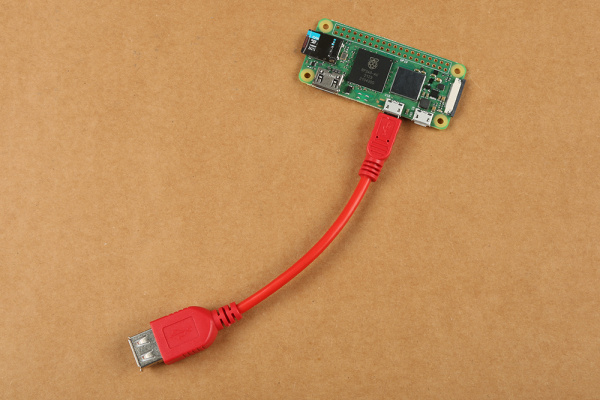

#### キーボードとマウス

USB OTGケーブルを使い、キーボード・マウスを差し込める。
このチュートリアルでは、両方のデバイスに1つのUSBドングルで対応できる[Logitech K400 Plus Wireless Touch Keyboard](https://www.sparkfun.com/products/16300)を使用した。
他の標準的なUSBデバイスと組み合わせて使う場合は、電源付きのUSBハブを使うことを推奨する。

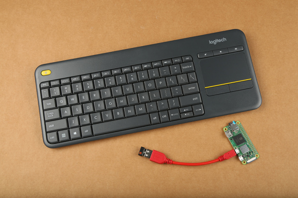

*注意：ここに写っているLogitech K400 Plus Wireless Touch Keyboardは、Basic Kitには含まれていない*

#### モニタ

Basic Kitに含まれるmini HDMIケーブルを、Pi Zero 2 Wのmini HDMIコネクタに接続する。
ケーブルのもう一方の端を、モニタやテレビのHDMIポートに接続する。

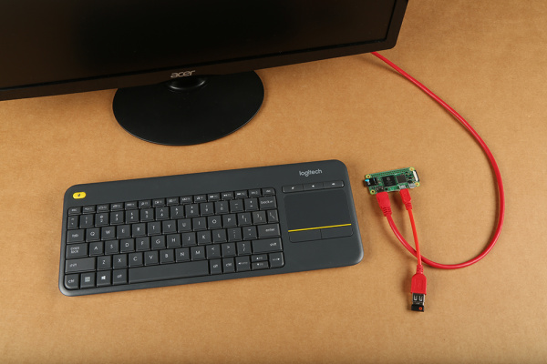

### 電源

すべてを接続し、microSDカードを挿入したら、電源を**PWR IN**とラベル付けされたmicro USBコネクタに接続する。これでPiが起動を始めるはずである。

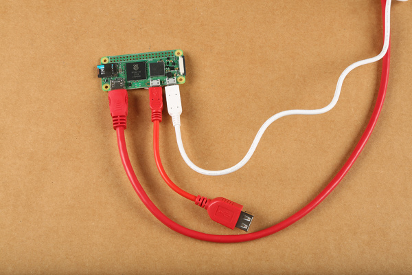

### セットアップの完成形

すべてを接続すると、下の写真のようなセットアップになるはずである。

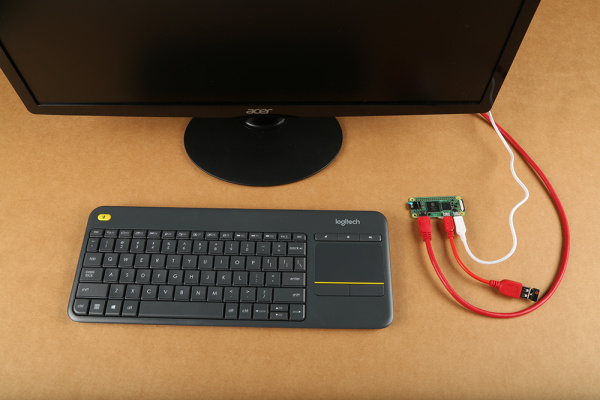

### ハードウェアの接続を広げる

上記の手順は、Pi Zero 2 Wを立ち上げて動かすための基本にすぎず、この小さなコンピュータの可能性のごく一部しか使っていない。
Pi上の2×20のGPIOヘッダーには、さらに多くの追加機能へのアクセスが用意されているため、それを活用したいユーザーは[こちら](https://www.sparkfun.com/products/14275)のようなヘッダーをはんだ付けしておくとよい。

Pi Zero 2 Wでブレッドボードプロトタイピングをしたいユーザーは、[Pi Wedge](https://www.sparkfun.com/products/13717)や、GPIOピンを使うための以下のチュートリアルを活用するとよい。

- Preassembled 40-pin Pi Wedge Hookup Guide — Preassembled Pi Wedgeを使い、Raspberry Pi B+でプロトタイピングする方法
- [Raspberry PiのGPIO](./raspberry-gpio.md) — PythonまたはC++を使い、Raspberry PiのI/Oラインを制御する方法
- Headless Raspberry Pi Setup — キーボード、マウス、モニタなしでRaspberry Piを設定する方法

Pi Zero 2 WでSparkFunのQwiicデバイスを使いたい場合は、SparkFun Qwiic SHIM、Qwiic SHIM Kit、あるいはQwiic Starter Kit for Raspberry Piを確認してみてほしい。

- Qwiic SHIM for Raspberry Pi Hookup Guide — PiでI2C部品をプロトタイピングしたいと思ったことはないだろうか。これでできるようになる
- Qwiic SHIM Kit for Raspberry Pi Hookup Guide — QwiicシステムとPythonを使い、Raspberry Pi上でRGBバックライト付きシリアルLCDと9DoF IMU（ICM-20948）をI2C経由で使い始める。センサーの値を取得し、シリアルターミナルやSerLCDに表示する

最後に、カメラコネクタを使えば[Raspberry Pi camera](https://www.sparkfun.com/products/14028)を接続できる。
ただし、このコネクタは22ピン0.5mmピッチであり、標準的なPiとは異なる。
カメラをPi Zero 2 Wに接続するには、別の[ケーブル](https://www.sparkfun.com/products/14272)が必要になる。

### ヘッドレス

モニタ、キーボード、マウスを使わない「ヘッドレス」なセットアップを好む場合は、以下のチュートリアルが助けになる（ヘッドレスセットアップは通常のセットアップよりかなり高度である点に注意してほしい）。

- Headless Raspberry Pi Setup — キーボード、マウス、モニタなしでRaspberry Piを設定する方法
- Raspberry PiでVNCによるリモートデスクトップを使う — RealVNCを使ってRaspberry Piに接続し、ネットワーク越しにグラフィカルデスクトップをリモート操作する方法

## Raspberry Pi OSを使う

これでボードが立ち上がり動作するようになったので、Raspberry Pi OSの基本をいくつか紹介する。
この節では、HDMI出力でモニタに接続してPiを使う方法を扱う。

### Raspberry Pi OS

Raspberry Pi OSはLinuxベースである（正確には、Raspberry Pi DesktopのDebian Bullseye移植版である）。
それほど身構える必要はない。
多くのコマンドを覚えたり、テキストエディタの保存・終了に`:wq`と入力したりする必要があった時代は終わった。
このOSは、WindowsやMacOSに似たデスクトップのグラフィカルユーザーインターフェース（GUI）で動作しており、いくつか基本的なコマンドやショートカットを覚えておいたほうがよいことは確かだが、たいていはそれらを使わなくても済ませられる。

#### 初回起動

OSを新規インストールした状態でのPiの初回起動には数分かかり、Piはおそらく少なくとも一度は再起動する。
OSが初期セットアップを終えると、下の画像のようなデスクトップのセットアップ画面が表示されるはずである。

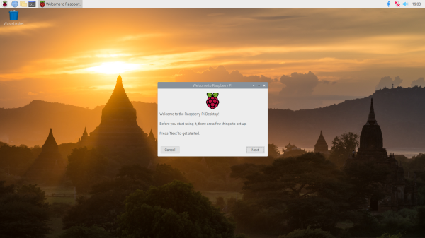

セットアップウィザードに従い、地域設定の構成、新しいパスワードの設定、WiFiへの接続、システムやパッケージの更新など、Pi上のさまざまな設定を行う。
これらの手順の一部は飛ばすこともできるが、少なくとも地域設定と新しいパスワードの設定は強く推奨する。
後で設定を見直したい場合は、**Raspberry Pi Start Menu** > **Preferences** > **Raspberry Pi Configuration**から開ける。

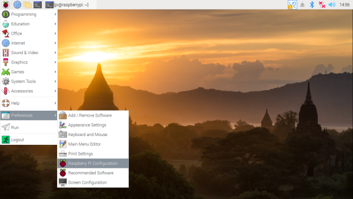

これにより、地域、モニタ、キーボード、パスワードを更新したり、SPIやI²Cといった各種周辺機器インターフェースを有効化したりできるポップアップが開く。

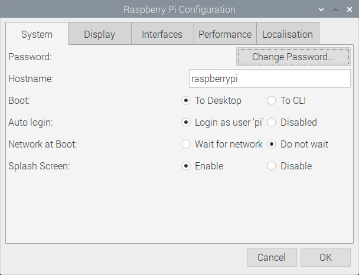

> **警告：** Raspberry Piのセキュリティを確保するため、デフォルトのパスワードは変更することを推奨する。
> 保存する前に、パスワードを必ず安全な場所に控えておくこと。ユーザー名も変更できる。

#### ソフトウェアを更新する

セットアップウィザードでこの手順を飛ばした場合や、後でソフトウェアパッケージを更新する必要が出てきた場合は、コマンドラインインターフェース（CLI）を使ってPi上のソフトウェアパッケージを更新できる。
ターミナルを開き、次を入力して`Enter`を押す。

```bash
sudo apt-get update
```

このコマンドは、Piに最新のパッケージ情報を取得するよう指示し、パッケージマネージャーに何を更新する必要があるかを伝える。

- `sudo`（スーパーユーザーとも呼ばれる）は、特にセキュリティレベルの高いコマンドでよく目にするコマンドである。
  ユーザー名が特定のユーザー一覧（「sudoers」）に含まれていれば、（まだrootとしてログインしていない場合でも）一時的にこれらのコマンドを実行できるようになる。
- `apt-get`はパッケージマネージャーであり、`update`はそこに与えているコマンドである。

これにより、システム上のすべてのパッケージがダウンロード・更新される。時間がかかることがある。

### シャットダウン・再起動

デスクトップのメインメニューには標準的なシャットダウンボタンが用意されているが、次のコマンドを使いCLI経由でPiにシャットダウンを指示することもできる。

```bash
sudo shutdown -h now
```

- `shutdown`は、推測できるとおりマシンをシャットダウンする。`now`は、その動作を即座に実行するよう指示する（`15`と指定すれば、15分後にシャットダウンするよう指示できる）。

CLI経由でPiを再起動するには、次のコマンドを送る。

```bash
sudo shutdown -r now
```

> **⚡ 警告：** 正しくシャットダウンする前に電源を取り外すと、Raspberry Piのイメージが壊れてしまう。
> Piの電源を取り外す前に、必ず正しくシャットダウンすること。
> あるいは、[GPIOを使ってPiの電源を切るPythonスクリプト](./raspberry-pi-safe-reboot-and-shutdown-button.md)を書くという方法もある。
>
> - [Raspberry Piの安全な再起動・シャットダウンボタン](./raspberry-pi-safe-reboot-and-shutdown-button.md) — Qwiic pHAT v2.0に内蔵された汎用ボタンを使い、microSDカードの破損を防ぎながらRaspberry Piを安全に再起動・シャットダウンする方法

### その他の便利なLinuxコマンド

ターミナルのコマンドラインで使える、他にも便利なコマンドをいくつか紹介する。

- `pwd`：Print Working Directoryの略。今どのフォルダにいるかわからないときに、ファイルシステム上の現在位置を教えてくれる
- `ls`：List。フォルダの中身を表示する。隠しファイルを含むすべてのファイルを表示するには`ls -a`と入力する。`ls -al`と入力すると、すべてのファイル・フォルダに加えてその権限設定も表示される
- `cd`：ディレクトリを変更するコマンド。`cd foldername`でそのフォルダへ移動する。`cd ..`で1階層上に戻る。`cd ~`でホームディレクトリへ戻る
- `passwd`：パスワードを変更できる
- `man`：manualの略。コマンドの前にmanと入力すると、その使い方の概要が表示される
- `nano`：比較的使いやすいシンプルなテキストエディタが開く

## トラブルシューティング

Raspberry Piの動作に問題があるだろうか。
基本的なトラブルシューティングについては、[Raspberry Pi Foundationのフォーラム](https://www.raspberrypi.org/forums/index.php)にあるこの付箋を確認してみてほしい。

[Pi Foundation Forums: Basic Troubleshooting with the Raspberry Pi](https://www.raspberrypi.org/forums/viewtopic.php?t=58151)

Raspberry Pi向けに設計されたSparkFunのハードウェアとのインターフェースで問題が発生しているだろうか。
[SparkFunフォーラム](https://forum.sparkfun.com/)を確認し、力になれるかどうか見てみてほしい。

[SparkFun Forums](https://forum.sparkfun.com/)

## まとめ・参考資料

ここまでくれば、Pi Zero 2 Wは他のコンピュータと同じように動作しているはずである。
ここから先は、Linuxの細かい使い方を独学で学んだり、Pythonを学んだり、GPIOピンをプログラムしたり、Minecraft™サーバーを立てたり、ネットワークストレージシステム、ゲームコンソール、メディアセンターを構築したり、あるいは単にウェブを閲覧したりすることもできる。

Pi Zero 2 WやRaspberry Pi全般について、より詳しい情報は以下のリソースを確認してほしい。

- [Raspberry Pi Zero 2 W Product Brief](https://cdn.sparkfun.com/assets/f/8/d/a/c/Raspberry_Pi_Zero_2_W_Product_Brief.pdf)
- [Raspberry Pi Software](https://www.raspberrypi.com/software/)
- [Raspberry Pi Resource Page](https://www.sparkfun.com/raspberry_pi)
- [Raspberry Pi Foundation](https://www.raspberrypi.org/)
- [Getting Started with the Raspberry Pi](https://projects.raspberrypi.org/en/projects/raspberry-pi-getting-started)
- [Raspberry Pi Documentation](https://www.raspberrypi.org/documentation/)
- [Raspberry Pi Projects](https://projects.raspberrypi.org/en/projects)
- [Pi Foundation Forums](https://www.raspberrypi.org/forums/)

Raspberry Pi Zero Wをドングルのように使いたいだろうか。[Pi Zero USB Stem](https://www.sparkfun.com/products/14526)を確認してみてほしい。

インスピレーションが欲しければ、次のようなチュートリアルやプロジェクトも参考になる。

- Raspberry Pi 3 Starter Kit Hookup Guide — Raspberry Pi 3 Model BおよびRaspberry Pi 3 Model B+スターターキットの使い始め方ガイド
- Setting Up the Pi Zero Wireless Pan-Tilt Camera — Raspberry Pi Zeroをヘッドレスなワイヤレスパン・チルトカメラとして組み立て、プログラムし、アクセスする方法
- Raspberry Pi Stand-Alone Programmer — ヘッドレスのRaspberry Piを使い、スタンドアロンのプログラマーとしてAVRマイクロコントローラーにHEXファイルを書き込む方法。プロダクションプログラミングの課題や、SparkFunがこの解決策にたどり着いた経緯、そこで得られた教訓についても紹介する
- Graph Sensor Data with Python and Matplotlib — matplotlibを使い、Raspberry Piに接続したTMP102センサーの温度データをリアルタイムにグラフ表示する

タグ: Bluetooth、Hookup、IoT（モノのインターネット）、Raspberry Pi、シングルボードコンピュータ、WiFi、ワイヤレス

---

出典：[Getting Started with the Raspberry Pi Zero 2 W](https://learn.sparkfun.com/tutorials/getting-started-with-the-raspberry-pi-zero-2-w)（SparkFun Learn）を日本語に翻訳し、再構成した。
原文は [CC BY-SA 4.0](https://creativecommons.org/licenses/by-sa/4.0/) ライセンスで公開されており、本ページも同ライセンスの下で提供する。
