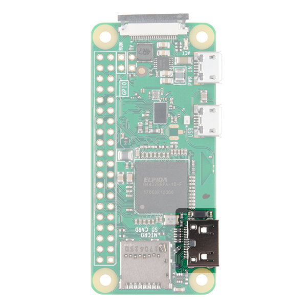
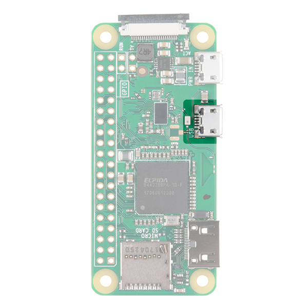
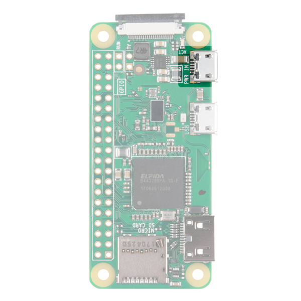
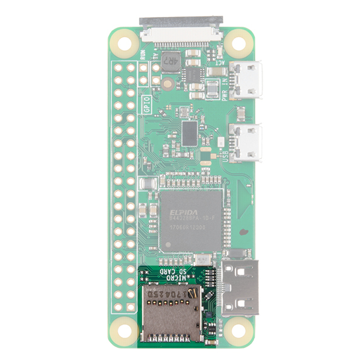
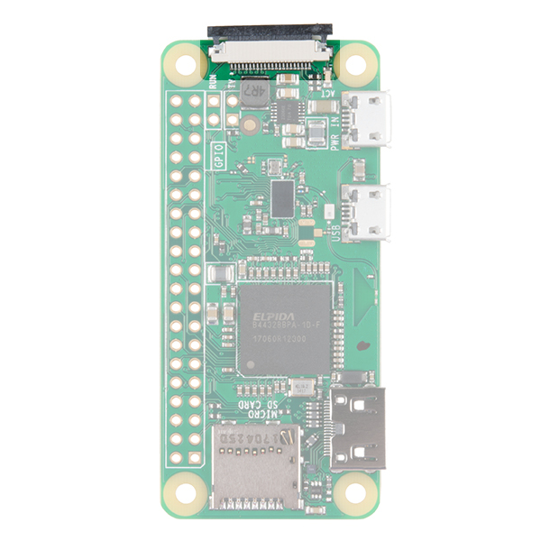
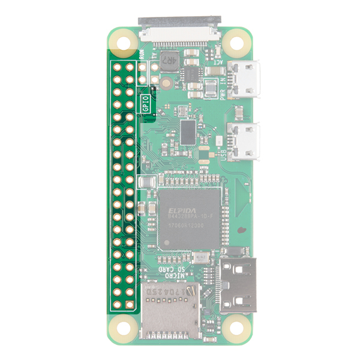
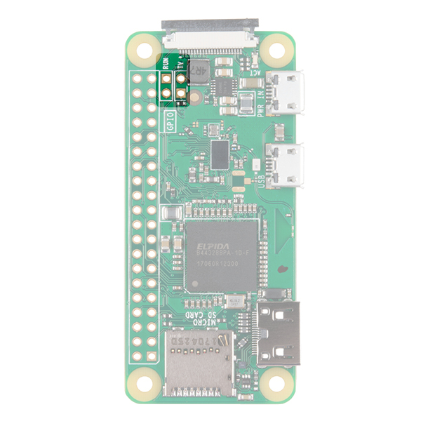
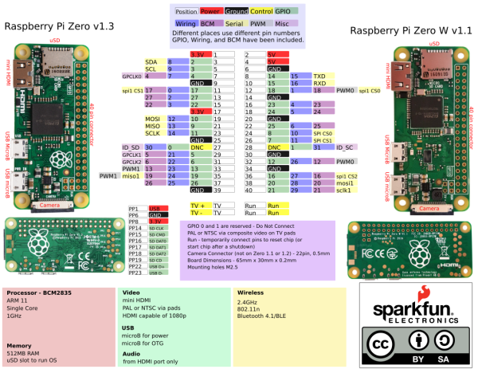
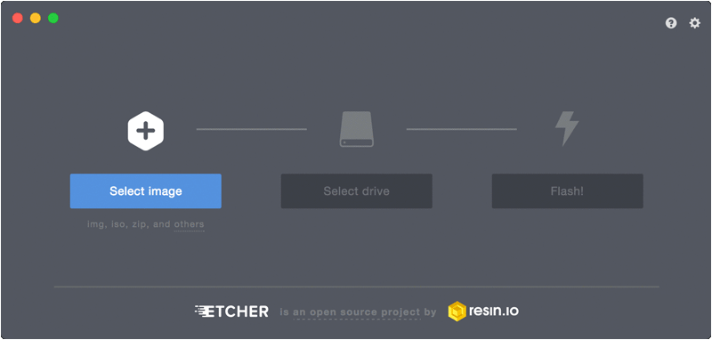
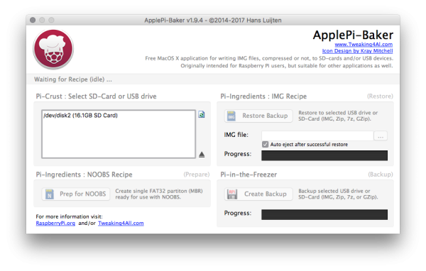

# Raspberry Pi Zero Wirelessを始める

Raspberry Piは、1枚の基板にコンピュータ一式を詰め込んだ、人気の高いシングルボードコンピュータ（SBC）である。
[Raspberry Pi 3](https://www.sparkfun.com/products/13825)とその前身のモデルは、すっかりおなじみのフォームファクタとしてすでに広く知られているだろう。
Raspberry Piには、さらに小さなフォームファクタのモデルもある。
Raspberry Pi Zeroの登場により、コンピュータ一式をさらに小さなプロジェクトに組み込めるようになった。
このガイドでは、オンボードのWiFiモジュールを備えたZero製品ラインの最新版、[Raspberry Pi Zero - Wireless](https://www.sparkfun.com/products/14277)を扱う。
ここで説明する内容はほとんどのRaspberry Piのバージョン・フォームファクタに当てはまるが、基本的にはPi Zero Wを軸に進める。

スターターパックを探しているなら、Pi Zero Wを使い始めるのに必要なものがすべて揃ったキットもある。

## 必要な部品

このチュートリアルを進めるには、次のものが必要になる。

- Raspberry Pi Zero W Basic Kit
- モニタ
- キーボード
- マウス（任意だが推奨）
- USBハブ（複数のUSBデバイスを使う場合）

## 参考になるチュートリアル

このチュートリアルを読み進める前に、次のチュートリアルにも興味があるかもしれない。

- [Single Board Computer Benchmarks](https://learn.sparkfun.com/tutorials/single-board-computer-benchmarks) — シングルボードコンピュータやコンピューティングモジュール上でさまざまなベンチマークプログラムをセットアップし、実行する方法。世代ごとの結果も掲載している
- [SD Cards and Writing Images](https://learn.sparkfun.com/tutorials/sd-cards-and-writing-images) — Raspberry Pi、PCDuino、その他好みのSBC向けにSDカードへイメージを書き込む方法
- [Raspberry PiのGPIO](./raspberry-gpio.md) — PythonまたはC++でRaspberry PiのI/Oラインを駆動する方法
- [Raspberry PiのSPIとI2C](./raspberry-pi-spi-and-i2c-tutorial.md) — C/C++用のwiringPi I/OライブラリとPython用のspidev/smbusを使い、Raspberry PiのシリアルI2CバスとSPIバスを利用する方法

## ハードウェア概要

Raspberry Pi Zero（およびPi Zero W）とRaspberry Pi 3との間で、特に目立つ違いをいくつか見ていく。

両者は、WがWiFiとBluetoothを内蔵している点を除けば、機能面ではまったく同じである。
Pi Zeroの多くのコネクタは、標準サイズのコネクタに接続するためにアダプタが必要になるため、Pi 3と比べるとセットアップがやや面倒に感じることがある。
とはいえ、始めるのに必要なのは基本的に、Raspberry Piのイメージを書き込んだmicroSDカードと電源だけである。

### Mini HDMI

標準的なHDMIコネクタを使っていた従来のRaspberry Piのモデルとは異なり、Zeroはスペースを節約するためミニHDMIコネクタを採用している。
Zeroをモニタやテレビに接続するには、ミニHDMIからHDMIへの変換アダプタか[ケーブル](https://www.sparkfun.com/products/14274)が必要になる。



### USB On-the-Go

Raspberry Pi 3やその他のモデルには、従来、標準サイズのメスUSBコネクタが2〜4個備わっており、マウス、キーボード、WiFiドングルなど、さまざまなデバイスを接続できた。
Zeroでは、こちらもスペースを節約するため、[USB On-the-Go（OTG）](https://en.wikipedia.org/wiki/USB_On-The-Go)接続を採用している。
Pi Zeroは、初代Raspberry Pi AおよびA+モデルで使われていたのと同じBroadcom製ICを使っている。
このICはUSBポートに直接接続されており、OTG機能を実現している。
一方Pi B、B+、2、3の各モデルは、オンボードのUSBハブを介して複数のUSB接続を可能にする方式を採っており、この点が異なる。

標準的なオスのUSBコネクタを持つデバイスを接続するには、[USB OTGケーブル](https://www.sparkfun.com/products/14276)が必要になる。
マイクロUSB側の端をPi Zeroに差し込み、標準サイズのメスUSB側の端にUSBデバイスを接続する。



その他の標準的なUSBデバイスを使う場合は、電源付きのUSBハブを使うことを推奨する。
ワイヤレスのキーボード・マウスのセットは、1つのUSBドングルで両方に対応できるため、特に相性がよい。

> **注意：** Pi ZeroのUSBポートにアクセスする必要がある場合は、[USB-microB変換アダプタ](https://www.sparkfun.com/products/14567)を使うこともできる。

### 電源

他のPiと同様に、電源はマイクロUSBコネクタから供給する。
電源用USBに供給する電圧は**5〜5.25V**の範囲にすること。



### microSDカードスロット

もう一つのおなじみのインターフェースがmicroSDカードスロットである。
Raspberry Piのイメージファイルが入ったmicroSDカードをここに挿入する。



### WiFiとBluetooth

Raspberry Pi 3と同様に、Zero Wも802.11n無線LANとBluetooth 4.0の両方の接続に対応している。
これにより、WiFiドングルや（Bluetoothのキーボード・マウスに置き換えた場合の）USBキーボード・マウスなど、USB経由での接続の多くが不要になる。

### カメラコネクタ

Raspberry Pi Zero V1.3以降とすべてのZero Wには、オンボードのカメラコネクタが搭載されている。
これを使って[Raspberry Pi Cameraモジュール](https://www.sparkfun.com/products/14028)を接続できる。
ただし、このコネクタは22ピン0.5mmピッチで、標準のPiとは異なる。
Pi Zero Wにカメラを接続するには、専用の[ケーブル](https://www.sparkfun.com/products/14272)が必要になる。



### GPIO

他のすべてのRaspberry Piモデルと同様に、数多くのGPIOピンが引き出されており、その多くはI2Cなど他の機能も兼ねている。
GPIOヘッダーを使う場合は、[ヘッダー](https://www.sparkfun.com/products/14275)をはんだ付けしておくことを検討するとよい。



### その他の接続

最後に、TVとRunという2組のスルーホールパッドがあることに気づくかもしれない。
TVパッドを使うと、HDMI出力の代わりにRCAジャックをボードに接続できる。
RunピンはチップのリセットピンにつながっておりRunピンを短絡させると、ボードの電源を切ったり、シャットダウン後に再び起動させたりできる。
ここにボタンを接続しておくと、ボードの電源を入れ直すよい方法になる。



---

GPIOヘッダーの各ピンとPi Zero上のすべてのコネクタについての完全な説明は、下記のグラフィカルデータシートを参照してほしい。



*画像をクリックするとPDFが表示される。*

## ハードウェアの組み立て

用途によっては、Pi Zeroのセットアップは最小限で済むこともあれば、Zeroの小型コネクタとマウス・キーボード・モニタといった標準的なデバイスを接続するためのアダプタが必要になり、やや面倒になることもある。

### モニタ

1. HDMI入力のあるモニタやテレビにPi Zeroを接続するには、Pi ZeroのミニHDMIコネクタにミニHDMI-HDMIケーブルまたはアダプタを取り付ける。もう一方の端をモニタやテレビのHDMIポートに接続する。
2. USB OTGケーブルを、マイクロUSBコネクタ経由でPi Zeroに接続する。キーボード・マウスのコンボセットを使う場合は、そのドングルを標準サイズのメスUSB端に取り付ける。別々のマウスとキーボードを使う場合は、両方をUSB OTGケーブルに接続するためのUSBハブが必要になる。
3. microSDカードに有効なRaspberry Piのイメージが入っていることを確認する（詳しくは後述する）。microSDカードをmicroSDスロットに挿入する。
4. マイクロUSBの電源入力からPi Zeroに給電する。

---

他にも、このチュートリアルでは使わないが触れておくべきコネクタがいくつかある。
Pi Zeroには、標準のPi 3と同じピン配置の40ピンGPIOコネクタが基板上にある。
このコネクタにワイヤー、ヘッダー、あるいはPi Hatをはんだ付けすれば、GPIOピンや電源にアクセスできる。
カメラコネクタを使えばRaspberry Pi Cameraを接続できるが、このコネクタは22ピン0.5mmピッチで標準のPiとは異なり、カメラをPiに接続するには専用の[ケーブル](https://www.sparkfun.com/products/14272)が必要になる点に注意してほしい。

## OSのインストール

Pi Zero Wの電源を入れる前に、Basic Kitに付属するmicroSDカードにRaspberry Pi OS（あるいは好みであれば、Raspberry Piに対応したサードパーティ製OS）のイメージを書き込んでおく必要がある。
Raspberry Pi Foundationは、OSイメージのダウンロードとmicroSDカードへの書き込みを簡単にする、Raspberry Pi Imagerという優れたツールを作っている。
このセクションでは、このツールを使ってmicroSDカードにRaspberry Pi OSのイメージを書き込む方法を簡単に説明する。

### 方法1：Raspberry Pi Imager

Raspberry Pi Imagerツールを使えば、Raspberry Pi対応OSのイメージの選択とmicroSDカードへの書き込みが、以前よりずっと簡単に行える。
必要なのはOSと保存先デバイスを選ぶことだけで、残りはツールが処理してくれる。
ツールはRaspberry Piのソフトウェアページからダウンロードできる。

ツールをダウンロードしてコンピュータにインストールしたら、次の手順でイメージのインストールを完了させる。

- microSDカードとSDアダプタを、コンピュータの適切なポートに**挿入**する。
- **Raspberry Pi Imager**を開く。
- **Choose OS**ボタンをクリックし、好みのOSを選択する（このチュートリアルではデフォルトのRaspberry Pi OSを使う）。
- **Choose Storage**ボタンをクリックし、microSDカードのドライブの場所を選択する。
- **Write**をクリックする。

OSをmicroSDカードに書き込むには、選択したバージョンやポート・microSDカードの速度によって数分かかることがある。
書き込みが完了すると、ツールが自動的にmicroSDカードのソフトウェア的な取り出し処理を行うため、処理が終わったらそのまま取り外せる。

> **注意：** ソフトウェアページには、手動でダウンロード・インストールしたいユーザー向けに、さまざまな代替OSへのリンクも掲載されている。イメージを手動で書き込み・インストールする方法については、[SD Cards and Writing Images](https://learn.sparkfun.com/tutorials/sd-cards-and-writing-images)のチュートリアルを参照してほしい。

> **注意：** 執筆時点では、当初NOOBSの使用を推奨していた。しかし現在、このソフトウェアはサポートされていない。Raspberry Pi Foundationによれば次のとおりである。
>
> > NOOBS（New Out Of the Box Softwareの略）は、Raspberry Pi向けのSDカードベースのインストーラーだったが、現在はNOOBSの使用を推奨・サポートしていない。今後はRaspberry Pi Imagerを使ってほしい。
>
> それでもNOOBSに関心がある場合は、[GitHubリポジトリ](https://github.com/raspberrypi/noobs)を確認してほしい。

### 方法2：.imgファイル

基本的なRaspbianのインストールやNOOBSにある選択肢以外のものを使いたい場合は、自分でuSDカードにイメージをインストールする必要がある。
この方法は少し手間がかかる。単にファイルをカードに置くだけでなく、カードをブート可能にするなどの設定も行う特別な`*.img`ファイルが必要になるためである。
Raspberry Pi Foundationは、Ubuntu、OSMC（Open Source Media Center）、さらにはWindows 10 IoT Coreといった[イメージ](https://www.raspberrypi.org/downloads/)をいくつか提供している。
Googleで検索すれば、特定の用途向けの専用イメージも含め、さらに多くが見つかるはずである。
Raspberry Piを使うのが初めてであれば、Raspbianを推奨する。
最新版は下記のリンクからダウンロードできる。

> **注意：** Raspbianをインストールする際、使っているRaspberry Piのモデルを気にする必要はない。
> ただし、OSMCやRetroPieなど他のRaspberry Piのイメージファイルには、モデルごとに（多くの場合Pi 2・3と、それより古いモデルを区別して）設計されたイメージがある。
> それらのPiはZeroとはわずかに異なるプロセッサを使っているため、こうしたイメージは動作しない。
> 幸い、Zeroシリーズは古いRaspberry Pi A/A+/B/B+モデルと同じチップを使っているため、Zero向けに使えるイメージはまだ数多くある。
> 各Piモデルの詳細は[こちらのリンク](https://en.wikipedia.org/wiki/Raspberry_Pi#Specifications)を参照してほしい。

カードに自分でイメージをインストールする際は、[Etcher](https://etcher.io/)というソフトウェアを推奨する。
Etcherは、必要な手順をすべて一つのソフトウェアにまとめてくれている。
イメージをダウンロードし、プログラムを実行して、イメージを選択し、uSDカードのドライブを選択して、Flashを押すだけでよい。
完了したらカードを取り外せば準備完了である。
イメージのインストールが終わったら、カードをボードに挿入して電源を入れる。



Macユーザーには、[ApplePi Baker](https://www.tweaking4all.com/software/macosx-software/macosx-apple-pi-baker/)というソフトウェアがSDカードへの新しいイメージのアップロードに便利である。
起動時に管理者パスワードを求められる。
左側のペインでSDカードを選択し、「Pi Ingredients: IMG Recipe」のセクションで自分のイメージをアップロードする。
「Restore Backup」をクリックし、進行状況バーが完了するまで待てば完了である。
このプログラムはカードの取り出し処理も自動で行ってくれるため、そのままカードを引き抜いてPiに挿入できる。



このチュートリアルの残りの部分では、イメージを直接インストールする方法かNoobsのどちらかでRaspbianをインストールした前提で進める。
このチュートリアルは、グラフィカルユーザーインターフェースを備えたほとんどのLinuxベースのシステムでも問題なく動作するはずだが、項目の場所が多少異なることがある。

## Raspberry Pi OSを使う

ボードが起動して動くようになったところで、Raspberry Pi OSの基本をいくつか見ていく。
このセクションでは、HDMI出力でモニタに接続してPiを使う方法を扱う。

### Raspberry Pi OS

Raspberry Pi OSはLinuxベースである（正確には、Raspberry Pi Desktopを組み込んだDebian Bullseyeの移植版にあたる）。
とはいえ、あまり身構える必要はない。
数多くのコマンドを覚える必要があったり、テキストエディタを保存して終了するために`:wq`と入力しなければならなかったりした時代はもう終わっている。
このOSは、WindowsやMacOSに似たデスクトップのグラフィカルユーザーインターフェース（GUI）で動作し、いくつかの基本的なコマンドやショートカットは覚えておきたくなるだろうが、使わなくてもたいてい問題なくやっていける。

#### 初回起動

OSを新規インストールした状態でPiを初めて起動すると数分かかり、Piは少なくとも1回は再起動するはずである。
OSの初期設定が終わると、次の画像のようなデスクトップの設定画面が表示される。


セットアップウィザードの指示に従い、Pi上の地域設定、新しいパスワード、WiFi接続、システムとパッケージの更新など、各種設定を行う。
一部の手順は省略してもよいが、少なくとも地域設定と新しいパスワードの設定は強く推奨する。
設定を後から見直したり更新したりしたい場合は、**Raspberry Piのスタートメニュー > Preferences > Raspberry Pi Configuration**から開ける。


これにより、地域、モニタ、キーボード、パスワードの更新に加え、SPIやI2Cといった各種周辺機器インターフェースのオン・オフを設定できるポップアップが開く。


> **警告：** Raspberry Piのセキュリティを確保するため、パスワードはデフォルトから変更することを推奨する。保存する前に、パスワードを安全な場所に必ず控えておくこと。ユーザー名も変更できる。

#### ソフトウェアの更新

セットアップウィザードでこの手順を省略した場合や、今後ソフトウェアパッケージを更新する必要が生じた場合は、コマンドラインインターフェース（CLI）を通じてPi上のソフトウェアパッケージを更新できる。
ターミナルを開き、次のように入力して`Enter`キーを押す。

```bash
sudo apt-get update
```

このコマンドは、最新のパッケージ情報を取得し、何を更新する必要があるかをパッケージマネージャーに伝えるようPiに指示する。

- `sudo`（スーパーユーザーとも呼ばれる）は、特にセキュリティレベルの高いコマンドでよく目にするコマンドである。ユーザー名が（'sudoers'と呼ばれる）許可されたユーザーの一覧に含まれていれば、（まだrootとしてログインしていない場合でも）一時的にそのコマンドを実行する権限をユーザーに与える。
- `apt-get`はパッケージマネージャーであり、`update`はそれに与えているコマンドである。

これにより、システム上のすべてのパッケージがダウンロードされ、アップグレードされる。しばらく時間がかかることがある。

### シャットダウン・再起動

デスクトップのメインメニューには標準のシャットダウンボタンがあるが、CLIから次のコマンドでPiをシャットダウンさせることもできる。

```bash
sudo shutdown -h now
```

- `shutdown`は文字どおりマシンをシャットダウンする。`now`はその操作をすぐに実行するよう指示するものである（`15`と指定すれば15分後にシャットダウンするよう指示できる）。

CLIからPiを再起動するには、次のコマンドを送る。

```bash
sudo shutdown -r now
```

> **⚡ 警告：** 適切にシャットダウンする前に電源を切ると、Raspberry Piのイメージが破損する恐れがある。Piから電源を取り外す前には、必ず正しくシャットダウンすること。あるいは、[GPIOを使ってPiの電源を切るPythonスクリプト](./raspberry-pi-safe-reboot-and-shutdown-button.md)を書くという方法もある。

### その他の便利なLinuxコマンド

ターミナルのコマンドラインで使える、その他の便利なコマンドをいくつか紹介する。

- `pwd` — Print Working Directoryの略。今どのフォルダにいるかわからない場合、ファイルシステム上の現在位置を教えてくれる。
- `ls` — Listの略。フォルダの中身を表示する。隠しファイルを含むすべてのファイルを表示するには`ls -a`と入力する。`ls -al`と入力すれば、すべてのファイル・フォルダとその権限設定も表示される。
- `cd` — ディレクトリを移動するコマンド。`cd foldername`でそのフォルダに移動する。`cd ..`で一段階上に戻る。`cd ~`でホームディレクトリに戻る。
- `passwd` — パスワードを変更できる。
- `man` — manualの略。コマンドの前に`man`と付けて入力すると、その使い方の概要が表示される。
- `nano` — 使いやすいシンプルなテキストエディタが開く。

## トラブルシューティング

Raspberry Piがうまく動かない場合は、[Raspberry Pi Foundationのフォーラム](https://www.raspberrypi.org/forums/index.php)にある、基本的なトラブルシューティングについてのこちらの記事を確認してほしい。

Raspberry Pi向けに設計されたSparkFunのハードウェアの接続で困っている場合は、[SparkFunフォーラム](https://forum.sparkfun.com/)で力になれないか確認してみてほしい。

## まとめ・参考資料

### Raspberry Piの参考資料

- [Raspberry Piホームページ](https://www.raspberrypi.org/)
- [Raspberry Piのイメージ](https://www.raspberrypi.org/downloads/)
- [Raspberry Pi ZeroおよびZero Wのグラフィカルデータシート](https://cdn.sparkfun.com/assets/learn_tutorials/6/7/6/PiZero_1.pdf)
- [Etcher](https://etcher.io/) — .imgファイルをSDカードに書き込むための、MacOS・Windows・Linux対応アプリケーション
- [ApplePi Baker](https://www.tweaking4all.com/software/macosx-software/macosx-apple-pi-baker/) — .imgファイルをSDカードに書き込むためのMacOSアプリケーション

Raspberry Pi Zero Wをドングルのように使いたい場合は、Pi Zero USB Stemも確認してみてほしい。

Raspberry Piをさらに楽しみたい場合は、次のSparkFunのチュートリアルも参考になる。

- [FLIR Lepton Hookup Guide](https://learn.sparkfun.com/tutorials/flir-lepton-hookup-guide) — FLIR Dev KitとRaspberry Piを使い、赤外線放射という目に見えない世界を見る
- [Bark Back Interactive Pet Monitor](https://learn.sparkfun.com/tutorials/bark-back-interactive-pet-monitor) — Raspberry Piをベースにした犬の鳴き声検出プロジェクトでペットを監視・やり取りする
- [Preassembled 40-pin Pi Wedge Hookup Guide](https://learn.sparkfun.com/tutorials/preassembled-40-pin-pi-wedgehookup-guide) — 組み立て済みのPi Wedgeを使い、Raspberry Pi B+でプロトタイピングする
- [PiRetrocade Assembly Guide](https://learn.sparkfun.com/tutorials/piretrocade-assembly-guide-/) — SparkFun PiRetrocadeキットを使い、Raspberry Piで自分だけのレトロゲームコントローラーを作る

タグ: Bluetooth、Hookup、IoT、Raspberry Pi、シングルボードコンピュータ、WiFi、ワイヤレス

---

出典：[Getting Started with the Raspberry Pi Zero Wireless](https://learn.sparkfun.com/tutorials/getting-started-with-the-raspberry-pi-zero-wireless)（SparkFun Learn）を日本語に翻訳し、再構成した。
原文は [CC BY-SA 4.0](https://creativecommons.org/licenses/by-sa/4.0/) ライセンスで公開されており、本ページも同ライセンスの下で提供する。
