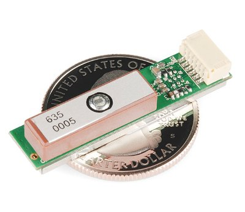
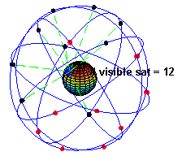
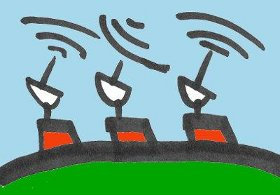
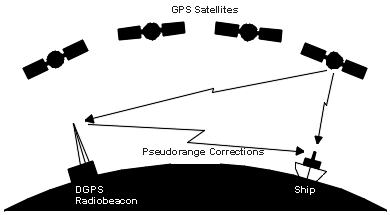
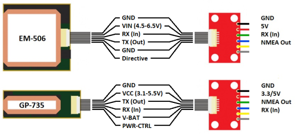
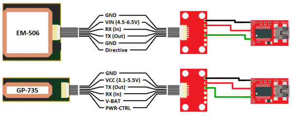
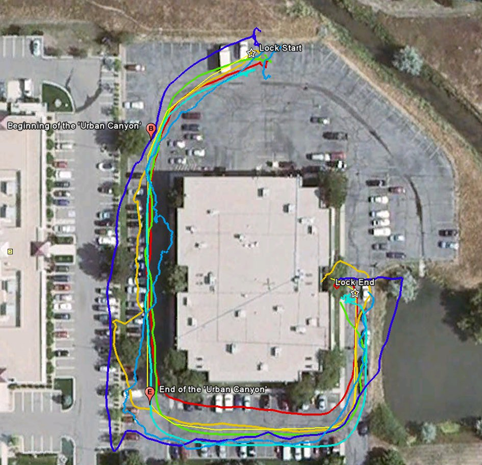
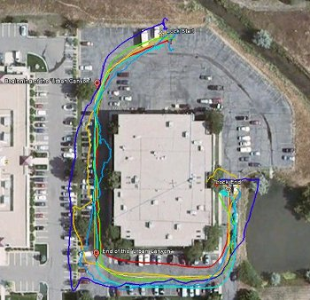
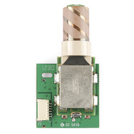
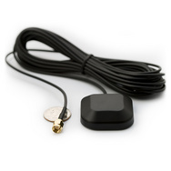

# GPSの基礎

## GPSの基本

おそらく誰もが、GPS受信機を使ったり、その恩恵を受けたりしたことがあるだろう。
GPSはほとんどのスマートフォンや多くの新しい自動車に搭載されており、世界中の物流の追跡にも利用されている。
この小さな装置は、地球上のほぼどこにいても、瞬時に無料で正確な位置情報と時刻を教えてくれる。
必要なのは[GPS受信機](https://www.sparkfun.com/categories/4)だけであり、しかも受信機は日に日に安く小さくなっている。



*一般的なGPS受信機、あるいはGPSモジュール。*

このように小さく安価なモジュールを、当たり前のものだと思わないでほしい。
いつでもどこでも正確な位置を提供できるようになるまでには、何十年にもわたる工学の積み重ねがある。
1970年代後半から、非常に正確な原子時計を搭載したGPS衛星が数十機打ち上げられ、現在も打ち上げは続いている。
これらの衛星は、専用の無線周波数を使って絶えずデータを地球に送り続けている。
私たちのポケットサイズのGPS受信機は、小さなプロセッサとアンテナを使って衛星から送られてくるデータを直接受信し、その場で位置と時刻を計算している。
実に驚くべきことである。

### 参考になるチュートリアル

このチュートリアルは、いくつかの概念の上に成り立っている。
始める前に、次のトピックを知っておくとよい。

- [ロジックレベル](./logic-levels.md)
- [コネクタの基礎](./connector-basics.md)
- [2進数](./binary.md)（設定の項で使用する）
- [シリアル通信](./serial-communication.md)：パケット、信号レベル、ボーレート、UARTなど、非同期シリアル通信の概念を扱う。
- [シリアルターミナルの基礎](./terminal-basics.md)：さまざまなターミナルエミュレータアプリケーションを使って、シリアル機器と通信する方法を紹介する。

## GPSはどうやって動作するのか

GPS受信機は、衛星と地上局からなる測位システムを利用して、地球上のほぼどこでも位置と時刻を計算する。



*地球上を動く点と、見える衛星の数に注目してほしい。*

どの瞬間においても、地球の上空12,000マイル以上を周回する、少なくとも24機の稼働中の衛星が存在する。
これらの衛星の配置は、地球上のどの地点からでも、上空に常に最大12機の衛星が見えるように設計されている。
見える12機の衛星の主な役割は、無線周波数（1.1〜1.5GHz程度）を使って地球へ情報を*送信*することである。
この情報といくらかの計算があれば、地上の*受信機*であるGPSモジュールは、自分の位置と時刻を計算できる。

### GPS受信機はどうやって位置と時刻を計算するのか

それぞれの衛星から地球に送られるデータには、GPS受信機が位置と時刻を正確に計算するために必要な、いくつかの情報が含まれている。
各GPS衛星に搭載されている重要な機器の1つが、非常に正確な原子時計である。
原子時計の時刻は、その衛星の軌道上の位置や、空の中でのさまざまな地点への到達時刻とともに、地球へ送信される。
言い換えれば、GPSモジュールは見えている衛星それぞれからタイムスタンプを受信し、あわせて各衛星が空のどこに位置しているかというデータ（その他のデータとともに）も受信する。
この情報から、GPS受信機は見えている各衛星までの距離を知ることができる。
**GPS受信機のアンテナが少なくとも4機の衛星を捉えられれば、正確な位置と時刻を計算できる。**
これは[ロック（lock）あるいはフィックス（fix）](https://learn.sparkfun.com/tutorials/gps-basics/gps-glossary)とも呼ばれる。

ここまでの内容をすべて理解できただろうか。
もし理解できなかった場合や、さらに詳しく知りたい場合は、Dan Doberstein著『GPS Fundamentals』の第1巻に、はるかに詳細な説明が載っている。
第1巻は無料で公開されているが、第2巻を読むには著者を支援する必要がある。



*コントロールセグメントを描いたイラスト。*

測位システムには、もう1つ説明していない要素がある。
衛星とGPS受信機に加えて、衛星ネットワークや一部のGPS受信機と通信できる地上局が存在する。
このシステムは正式にはコントロールセグメントと呼ばれ、GPS受信機の精度を向上させる役割を持つ。
コントロールセグメントを利用して精度を高める一般的なシステムには、[WAAS](http://www8.garmin.com/aboutGPS/waas.html)や[DGPS](https://ja.wikipedia.org/wiki/%E3%83%87%E3%82%A3%E3%83%95%E3%82%A1%E3%83%AC%E3%83%B3%E3%82%B7%E3%83%A3%E3%83%ABGPS)がある。
WAASはほとんどのGPS受信機で利用でき、精度をおよそ5メートルまで向上させる。
DGPSは特定の種類のGPS受信機を必要とし、センチメートル単位の精度が得られる。
DGPSの機器は追加のアンテナが必要になるため、高価で大型になりがちである。

## GPSの精度

GPSの精度は、信号対雑音比（受信ノイズ）、衛星の位置、天候、建物や山などの障害物といった、さまざまな要因に左右される。
これらの要因は、実際の位置とのずれを生み出す。
信号ノイズは通常、1〜10メートル程度の誤差を生む。
山や建物など、受信機と衛星の間を遮る障害物は、信号ノイズの3倍もの誤差を生むことがある。
GPS受信機が位置を計算するには、**4機の衛星**をロックできなければならない。
最初のロックによって受信機は[アルマナック](http://gps.about.com/od/glossary/g/GPS_Almanac.htm)情報を取得し、その後どの衛星を探せばよいかが分かるようになる。
4機未満の衛星からでも位置を得ることは可能だが、その場合の誤差はかなり大きくなりうる。
もっとも正確な位置情報が得られるのは、障害物のない開けた空が見え、かつ4機を超える衛星が見えている場合である。
このような誤差に対処するため、いくつかの補助的な仕組みが作られてきた。

### アシステッドGPS

その補助的な仕組みの1つが、[Assisted GPS](https://ja.wikipedia.org/wiki/%E8%A3%9C%E5%8A%A9GPS)、通称AGPSである。
この方式は、GPS信号が弱い場合や受信できない場合に、衛星と受信機の間を中継するために無線の地上ネットワークを利用する。
AGPSが役立つ方法は2つある。
1つ目は、受信機に正しいアルマナックデータと正確な時刻を提供することである。
2つ目は、地上局の高い計算能力と良好な衛星信号を利用して、受信機が受け取った断片的な情報を補完し、より正確な位置情報を提供することである。
AGPSは主に、携帯電話の基地局に搭載されたGPS受信機によって実現されている。
これらの受信機と通信することで、GPSはより速く衛星をロックでき、より正確な情報も得られる。
この方式は携帯電話のGPSで使われており、単体のGPS受信機よりも正確になることがある理由でもある。
とはいえAGPSは携帯電話だけでなく、カメラや一部の車両など、[より多くの機器](https://ja.wikipedia.org/wiki/List_of_devices_with_Assisted_GPS)にも搭載されている。
特に、建物が密集した都市部でGPS信号が届きにくい状況で効果を発揮する。

### ディファレンシャルGPS

もう1つの方式が、[Differential GPS](https://ja.wikipedia.org/wiki/%E3%83%87%E3%82%A3%E3%83%95%E3%82%A1%E3%83%AC%E3%83%B3%E3%82%B7%E3%83%A3%E3%83%ABGPS)、通称DGPSである。
DGPSも地上の固定GPS局を使って位置を求める点はAGPSと同じだが、衛星からの読み取り値と地上局での読み取り値の差分を求める点が異なる。
これらの地上局は受信機から最大200海里ほど離れていることがあり、地上局から離れるほど精度が落ちる点に注意が必要である。
DGPSでは、実際の[疑似距離（pseudorange）](https://ja.wikipedia.org/wiki/Pseudorange)と測定された疑似距離との誤差を示す信号を、地上局が送信することで実現されている。
この値は、光速に、衛星から受信機まで信号が伝わるのにかかった時間を掛け合わせることで計算される。
一例として、DGPSの一種に[Wide Area Augmentation System](https://ja.wikipedia.org/wiki/%E5%BA%83%E5%9F%9F%E5%A2%97%E5%BC%B7%E3%82%B7%E3%82%B9%E3%83%86%E3%83%A0)、通称WAASがある。



*（画像提供：ASMA）*

もともと[FAA（アメリカ連邦航空局）](http://www.faa.gov/)によって航空機のGPSを補助するために開発されたWAASは、専用に建てられた地上局のネットワークを利用する。
WAASには、地上局の測定値が満たすべき、明確な精度基準が定められている。
水平方向と垂直方向のいずれについても、WAASは95%の確率で7.6メートル以内の精度を保証しなければならない。
これらの地上局は測定値をマスターステーションに送り、マスターステーションは5秒ごと、あるいはそれより短い間隔でWAAS衛星に補正情報を送る。
衛星から地上の受信機へ信号が送信され、その補正情報を使ってGPSの精度が向上する。
場所によっては、WAASは水平方向1メートル、垂直方向1.5メートルという精度を実現できる。
WAASは北米地域だけのシステムだが、世界の他の地域にも同様の仕組みが存在する。

> [!NOTE]
> さらに精度を高める技術を探しているなら、GPS RTKについてのチュートリアルを確認してほしい。GPS RTKとは何か。最新世代のGPS受信機やGNSS受信機を使って、14mmの位置精度を実現する方法を学べる。

## メッセージフォーマット

GPSのデータは、[シリアルインターフェース](./serial-communication.md)を通じて、さまざまなメッセージフォーマットで出力される。
標準的なフォーマットと、非標準（独自仕様）のフォーマットが存在する。
ほとんどすべてのGPS受信機は[NMEA](https://ja.wikipedia.org/wiki/NMEA_0183)形式のデータを出力する。
NMEA規格は、センテンスと呼ばれるデータの行で構成される。
それぞれのセンテンスには、カンマ区切り形式（つまりデータがカンマで区切られている形式）で、さまざまなデータが含まれている。
以下は、衛星を[ロック](https://learn.sparkfun.com/tutorials/gps-basics/gps-glossary)している（4機以上の衛星が見えており、正確な位置が得られている）GPS受信機から得られる、NMEAセンテンスの例である。

```bash
$GPRMC,235316.000,A,4003.9040,N,10512.5792,W,0.09,144.75,141112,,*19
$GPGGA,235317.000,4003.9039,N,10512.5793,W,1,08,1.6,1577.9,M,-20.7,M,,0000*5F
$GPGSA,A,3,22,18,21,06,03,09,24,15,,,,,2.5,1.6,1.9*3E
```

たとえば**GPGGA**センテンスには、次のような情報が含まれる。

- **時刻**：235317.000は、グリニッジ標準時で23時53分17.000秒を表す
- **緯度**：4003.9040,Nは度.10進分形式の緯度で、北緯を表す
- **経度**：10512.5792,Wは度.10進分形式の経度で、西経を表す
- **見えている衛星の数**：08
- **高度**：1577メートル

このデータがカンマで区切られているのは、コンピュータやマイコンが読み取ったり解析したりしやすくするためである。
このデータは、[更新レート](https://learn.sparkfun.com/tutorials/gps-basics/gps-glossary)と呼ばれる間隔でシリアルポートに送信される。
ほとんどの受信機は1秒に1回（1Hz）この情報を更新するが、より高性能な受信機は1秒間に複数回更新できる。
最新の受信機では5〜20Hzでの更新も可能である。

## GPSデータの読み取り

ほとんどのGPSモジュールには[シリアルポート](./serial-communication.md)が搭載されており、マイコンやパソコンへの接続に適している。

### マイコンへの接続



*EM-506 GPSおよびGP-735 GPSとGPS Breakout。*

GPSモジュールに電源が入ると、ロックの有無にかかわらず、シリアル送信ピン（TX）から特定の[ボーレート](./serial-communication.md)と[更新レート](https://learn.sparkfun.com/tutorials/gps-basics/gps-glossary)でNMEAデータ（あるいは別のメッセージフォーマット）が出力される。
マイコンにNMEAデータを読み取らせるには、GPSのTXピンをマイコンのRX（受信）ピンに接続するだけでよい。
GPSモジュールを[設定](https://learn.sparkfun.com/tutorials/gps-basics/configuring-a-gps-receiver)するには、GPSのRXピンもマイコンのTXピンに接続する必要がある。

マイコン側でNMEAデータを解析（パース）するのが一般的である。
パースとは、NMEAセンテンスから必要なデータの塊を取り出し、マイコンがそのデータを使って何らかの処理を行えるようにすることである。

たとえば、マイコンがGPSの高度だけを読み取りたい場合を考えてみよう。

```bash
$GPGGA,235317.000,4003.9039,N,10512.5793,W,1,08,1.6,1577.9,M,-20.7,M,,0000*5F
```

このテキスト全体を扱う代わりに、マイコンはGPGGAセンテンスを解析して、高度（メートル単位）だけを取り出せる。

```bash
1577
```

必要なデータをマイコンが取得できるようになれば、その情報を使ってマイコン上でさまざまな処理を行える。

[Arduino](./what-is-an-arduino.md)は、[Tiny GPS](http://arduiniana.org/libraries/tinygps/)ライブラリの助けを借りることで、NMEAデータを簡単に解析できる。
ArduinoとGPSモジュールを接続してNMEAセンテンスを解析する手順を実際に確認したい場合は、GPS Shield Getting Started Guideを参照してほしい。

### パソコンへの接続

NMEAデータを直接確認する簡単な方法は、GPSモジュールをパソコンに接続することである。
配線としては、FTDI Basicを使ってGPSに電源を供給し（この場合は5VとGND）、GPSのTXピンをFTDI BasicのRXピンに接続するだけでよい。



*EM-506 GPS、GPS Breakout、5V FTDI Breakoutの接続。GP-735 GPSでも同様に接続できる。*

次に、GPSモジュールと同じボーレートで[シリアルターミナルプログラム](./terminal-basics.md)を開く。
GPSがロックしていなくても、NMEAセンテンスが次々と流れてくるのが見えるはずである。

```bash
$GPRMC,235316.000,A,4003.9040,N,10512.5792,W,0.09,144.75,141112,,*19
$GPGGA,235317.000,4003.9039,N,10512.5793,W,1,08,1.6,1577.9,M,-20.7,M,,0000*5F
$GPGSA,A,3,22,18,21,06,03,09,24,15,,,,,2.5,1.6,1.9*3E
```

## GPS受信機の設定

GPS受信機を設定するには、使用している[チップセット](https://learn.sparkfun.com/tutorials/gps-basics/gps-glossary)の種類を把握しておくことが非常に重要である。
GPSのチップセットには強力なプロセッサが搭載されており、ユーザーインターフェース、各種計算処理、そしてアンテナ用のアナログ回路までを担っている。
このチップセットには、更新レートやボーレート、出力するセンテンスの選択といったパラメータを設定するためのデータを送ることもできる。

[シリアルインターフェース](./serial-communication.md)を通じてGPS受信機にコマンドを送るには、コマンド一覧やリファレンスマニュアルが必要になる。
特定のモジュール向けのコマンド体系に深入りする前に、必ずベンダーに確認すること。
多くのチップセットベンダーは、シリアルポート経由でGPSモジュールと簡単に通信し、設定を行えるソフトウェアを提供している。

以下は、代表的なチップセットのデータシートとコマンド一覧である。

- SiRFチップセット
  - SiRF NMEA Reference Manual
  - SiRF Binary Reference Manual
  - SiRF Demo Software
- U-Bloxチップセット
  - u-blox6 NMEA and UBX Reference Manual
  - u-center Demo Software
- SkyTraqチップセット
  - Skytraq Reference Manual
  - SkyTraq Demo Software

チップセットによっては、SiRFバイナリ（SiRFチップセット）やUBX（ubloxチップセット）、あるいは独自のメッセージ形式といった、別のプロトコルにも対応している。
これらのプロトコルは同じ内容の情報を含んでいるが、通信を高速化するためにASCIIではなくバイナリでやり取りする点が異なる。

GPS受信機と通信する際、ほとんどのコマンドはチェックサムで終端する必要がある。
多くの場合、送信するセンテンスの各バイトをXOR演算する必要がある。
簡単な[XORオンライン計算ツール](http://www.hhhh.org/wiml/proj/nmeaxor.html)も存在する。

## GPS用語集

**精度（Accuracy）**：GPSはどれくらい正確なのだろうか。多少のばらつきはあるが、通常は世界中どこにいても30秒以内に、±5メートル程度の誤差で自分の位置を知ることができる。
実に驚くべきことである。
「±」が付くのは、モジュールや時間帯、受信状況の良し悪しなどによって精度が変動するためである。
ほとんどのモジュールはWAASを有効にすれば±3m程度まで精度を高められるが、サブメートルやセンチメートル単位の精度が必要な場合は、非常に高価になり、DGPSと呼ばれる仕組みが必要になる。

全体として、GPSから最良の精度を得るには、空が開けた場所にいて、かつ移動していることが重要である。



*旧SparkFun本社の周辺で記録し、プロットしたGPSのウェイポイント。それぞれの軌跡は異なる種類のGPSモジュールに対応する。*

SparkFunの建物周辺の軌跡の例を見ると分かるように、「ロック開始」と「ロック終了」の地点ではGPSの位置が跳ね回っている。
これは、GPSモジュールが静止しているときに起こる現象である。
GPSにはおよそ5メートル程度の誤差があり、静止しているときにはその誤差がそのまま見えてしまう。
モジュールが動き始めると、軌跡は比較的正確になり、GPSは進行方向を「推測」できるようになる。
ただし、高い建物に挟まれた[アーバンキャニオン](https://learn.sparkfun.com/tutorials/gps-basics/gps-glossary)に近づくと、精度が悪化することに注意してほしい。
GPS信号は、必ずしも真上にあるとは限らない衛星から送信されており、地平線に近い位置にある衛星もある。
また、電波は建物や物体で反射し、[マルチパス干渉](https://ja.wikipedia.org/wiki/%E3%83%9E%E3%83%AB%E3%83%81%E3%83%91%E3%82%B9)と呼ばれる現象を引き起こすことがある。
GPSは、空が開けた場所でもっともよく機能するということを、常に覚えておいてほしい。

**アンテナ（Antenna）**：忘れてはならないのは、あの小さなGPSモジュールが、頭上だけでなく空のあらゆる方向にある、およそ12,000マイル彼方の衛星からの信号を受信しているという点である。
最良の性能を得るには、アンテナと空の大部分との間に遮るもののない経路が必要である。
天候や雲、雪嵐は信号にほとんど影響しないはずだが、木々や建物、山、頭上の屋根などは望ましくない干渉を生み、GPSの精度を低下させる。

アンテナにはさまざまな選択肢があるが、代表的なものをいくつか紹介する。



*もっとも小型で一般的な形状のアンテナが、セラミックパッチアンテナである。*

このアンテナは薄型で安価、かつコンパクトだが、他の種類のアンテナに比べると受信感度は劣る。
良好な信号を得るには、このアンテナを空に向けて上向きに設置する必要がある。つまり[利得（ゲイン）](https://learn.sparkfun.com/tutorials/gps-basics/gps-glossary)は上向きのときに最大になる。



*GPSモジュールの中には、ヘリカルアンテナを使用するものもある。*

このアンテナはセラミックパッチよりも場所を取るが、その形状のおかげでどの向きでも比較的良好な信号が得られる。ただし、特定の1方向における利得はやや低くなる。



*モジュールによっては、SMAアンテナを取り付けられるものもある。*

SMA接続を使えば、メイン基板とは別の場所にアンテナを設置できる。
これは、メインシステムが空を見渡せない場所（建物の内部や車の中など）にある場合に有用である。

**ボーレート（Baud Rate）**：GPS受信機は、送信ピン（TX）から特定のビットレートでシリアルデータを出力する。
もっとも一般的なのは1Hzの受信機で使われる9600bpsだが、57600bpsも一般的になりつつある。
詳しくは、受信機のデータシートを確認してほしい。

**チャンネル数（Channels）**：GPSモジュールが処理できるチャンネル数は、最初の測位までの時間（TTFF）に影響する。
モジュールはどの衛星が見えているかをあらかじめ知らないため、一度に確認できる周波数やチャンネルの数が多いほど、より速く測位できる。
モジュールがロックやフィックスを得たあと、消費電力を抑えるために余分なチャンネルのブロックを停止するものもある。
ロックまで多少時間がかかってもかまわないのであれば、追跡用途には12〜14チャンネルで十分である。

**チップセット（Chipset）**：GPSのチップセットは、計算処理からアンテナ用のアナログ回路の提供、電源管理、ユーザーインターフェースに至るまで、あらゆる処理を担っている。
非常に多くの仕事をこなしているが、これらの小さなGPSユニットはまさにそれをやってのけている。
チップセットはアンテナの種類とは独立しているため、特定のチップセットを搭載したGPSモジュールにさまざまな種類のアンテナを組み合わせることができる。
一般的なチップセットにはublox、SiRF、SkyTraqなどがあり、いずれも高速な測位と高い信頼性を実現する強力なプロセッサを搭載している。
チップセットごとの違いは、たいてい消費電力、測位にかかる時間、ハードウェアの入手のしやすさのバランスによって決まる。

[DGPS](https://ja.wikipedia.org/wiki/%E3%83%87%E3%82%A3%E3%83%95%E3%82%A1%E3%83%AC%E3%83%B3%E3%82%B7%E3%83%A3%E3%83%ABGPS)（ディファレンシャルGPS）：DGPSは特定の種類のGPS受信機である。
DGPS受信機には追加のアンテナが搭載されており、衛星からだけでなく、地上局からも直接信号を受信する。
DGPS機器には通常2本のアンテナが必要である。
これらは標準的なGPS機器よりもはるかに大きく高価だが、センチメートル単位の位置精度を実現できる。

**利得（Gain）**：利得とは、特定の向きにおけるアンテナの効率を表す。
これは送信用アンテナにも受信用アンテナにも当てはまる。

**ロックまたはフィックス（Lock or Fix）**：GPS受信機がロックまたはフィックスを得ている状態とは、少なくとも4機の衛星が良好に見えており、正確な位置と時刻が得られている状態を指す。

[NMEA](https://ja.wikipedia.org/wiki/NMEA_0183)：ほとんどのGPSモジュールが使用する、一般的なデータフォーマットである。
NMEAデータはセンテンスの形で表され、GPSモジュールのシリアル送信（TX）ピンから出力される。
NMEAセンテンスには、位置や時刻など、有用なデータがすべて含まれている。

**電力（Power）**：GPSモジュールは電力を大量に消費するわけではないが、衛星からのデータを計算処理し、ロックを得るためにはある程度の電力が必要である。
一般的なGPSモジュールは、ロックを得ている状態で平均して3.3Vで約30mAの電流を消費する。
また、[起動時間](https://learn.sparkfun.com/tutorials/gps-basics/gps-glossary)を短く保つことも、消費電力の節約につながる。

**PPS**：1秒あたりのパルス（Pulse per second）の略である。
一部のGPSモジュールに搭載されている出力ピンで、通常このピンが1秒に1回切り替わり、これを使ってシステムクロックをGPSのクロックに同期できる。

**起動時間（ホットスタート、ウォームスタート、コールドスタート）**：GPSモジュールの中には、電源を切ったあとも、スーパーキャパシタやバッテリーバックアップによって、以前の衛星データを揮発性メモリ上に保持できるものがある。
これにより、次回起動時のTTFFを短縮できる。
また、起動時間が短くなることは、全体としての消費電力の削減にもつながる。

**コールドスタート（Cold Start）**：モジュールの電源を長時間切ったままにし、バックアップ用のキャパシタが放電してしまうと、データは失われる。
次に電源を入れたとき、GPSは新しいアルマナックデータとエフェメリスデータをダウンロードし直す必要がある。

**ウォームスタート（Warm Start）**：バックアップ電源がどれくらい持続するかにもよるが、アルマナックデータとエフェメリスデータの一部が保持された状態で起動することもある。この場合、ロックの取得には多少余分に時間がかかることがある。

**ホットスタート（Hot Start）**：ホットスタートとは、すべての衛星のデータが最新で、前回の電源投入時とほぼ同じ位置に衛星がある状態を指す。
ホットスタートであれば、GPSはすぐにロックできる。

[トライラテレーション（Trilateration、三辺測量）](https://ja.wikipedia.org/wiki/Trilateration)：複数の基準点を使って位置を計算する数学的な手法である。
GPS受信機が正確な位置と時刻を計算するには、空にある少なくとも4機の衛星を良好に捉えられている必要がある。
この状態がGPSのロックまたはフィックスと呼ばれる。
2つの基準点（x, y）を使って対象物までの距離を計算する三角測量についてはよく知られているが、GPSの場合は緯度、経度、高度、時刻という4つの値を求める必要がある。

**TTFF**：最初の測位までの時間（Time to first fix）の略である。
電源投入後、少なくとも4機の衛星を使って正確な位置と時刻を計算するまでにかかる時間を指す。
空の見通しが悪い場所にいる場合、TTFFは非常に長くなることがある。

**更新レート（Update Rate）**：GPSモジュールの更新レートとは、位置を計算して報告する頻度のことである。
ほとんどの機器の標準は1Hz（1秒に1回）である。
[UAV（無人航空機）](https://ja.wikipedia.org/wiki/%E7%84%A1%E4%BA%BA%E8%88%AA%E7%A9%BA%E6%A9%9F)など高速で移動する機体では、より高い更新レートが必要になることがある。
低価格なモジュールでも、5Hzや10Hzといった更新レートが利用できるようになりつつある。
更新レートが高いほど、モジュールから送出されるNMEAセンテンスの量も増えることに注意してほしい。

[WAAS](https://ja.wikipedia.org/wiki/%E5%BA%83%E5%9F%9F%E5%A2%97%E5%BC%B7%E3%82%B7%E3%82%B9%E3%83%86%E3%83%A0)：WAAS（広域補強システム）は、北米にある地上局のネットワークであり、衛星に補正データを送り返す。
WAASは位置精度をおよそ5メートルまで高める。
他の国にも同様のシステムがあり、たとえばヨーロッパの[EGNOS](https://ja.wikipedia.org/wiki/%E6%AC%A7%E5%B7%9E%E9%9D%99%E6%AD%A2%E8%A1%9B%E6%98%9F%E3%83%8A%E3%83%93%E3%82%B2%E3%83%BC%E3%82%B7%E3%83%A7%E3%83%B3%E3%82%AA%E3%83%BC%E3%83%90%E3%83%BC%E3%83%AC%E3%82%A4%E3%82%B5%E3%83%BC%E3%83%93%E3%82%B9)、日本の[MSAS](https://ja.wikipedia.org/wiki/MSAS)、インドの[GAGAN](https://ja.wikipedia.org/wiki/GAGAN)などがある。
ほとんどのGPS受信機はデフォルトでWAASが有効になっており、EGNOS、MSAS、GAGANにも対応している。

## トラブルシューティング

### ロックに関する問題

Mikal Hart氏の[TinyGPS++ライブラリ](http://arduiniana.org/libraries/tinygpsplus/)は、GPSをすばやく動かし始めるのに非常に優れている。
とはいえ、アーバンキャニオンの間にいる場合や、コンクリート製の建物の中、あるいはおよそ無線信号を通さない暗闇のような場所にいる場合は、うまくいかないこともある。
実際に問題になったのは、屋内でGPSを使う場合であり、SparkFunの建物のようにコンクリートや金属の梁、大きな太陽光パネルが数多くあると、GPS信号（ついでに言えばほとんどの携帯キャリアの電波も）が大きく乱れ、GPSのロックを得るのが非常に難しくなる。

GPSモジュールのデータがライブラリを使ってもうまく見えない場合や、出力が不完全な場合は、より多くの衛星が見える別の場所に移動する必要があるかもしれない。
GPSモジュールを数歩動かしたり、建物の周辺部に移したりするだけで改善することもある。
見えている衛星数を確認するには、[GPGGAセンテンスの6番目と7番目のフィールド](http://aprs.gids.nl/nmea/#gga)を見て、ロックに問題がないか確認できる。
以下は、GPSモジュールが衛星をロックできていないときのGPGGAセンテンスの例である。
見てのとおり、GPSのフィックスがなく、見えている衛星もないため、出力は無効であることを示している。

```bash
$GPGGA,105317.709,8960.0000,N,00000.0000,E,0,0,,137.0,M,13.0,M,,*4C
```

### ボーレートの不一致

GPSモジュールのシリアルUARTから[シリアルモニタ](./terminal-basics.md)にデータを流したときに、以下の画像のような「文字化け」しか表示されない場合は、ボーレートの設定が正しいかどうかを確認してほしい。
GPSモジュールによってボーレートは異なることがあるため、使用しているGPSモジュールのデータシートを確認し、ボーレートが一致しているか確かめること。


*この節で説明したような、ボーレートの不一致（いわゆる文字化け）の例。*

## まとめ

これで、GPSユニットがどのように動作するか、そして次のプロジェクトにどう組み込めばよいかが、はっきりと理解できたはずである。
さらに優れたプロジェクトのアイデアを探しているなら、次のようなSparkFunのチュートリアルも確認してほしい。

- [ジャイロスコープとは何か](./gyroscope.md)：ジャイロスコープは軸を中心とした回転の速さを測定するもので、空間内での姿勢を判断するうえで欠かせない部品である。
- [加速度センサーの基礎](./accelerometer-basics.md)：加速度センサーとは何か、どのように動作するのか、なぜ使われるのかについての簡単な入門である。
- [プロジェクトへの電源供給](./how-to-power-a-project.md)：プロジェクトに必要な電源要件を見極めるためのチュートリアルである。
- [電力](./electric-power.md)：電力、つまりエネルギー伝達の速さについての概要である。電力の定義やワット、計算式、定格出力について解説する。
- [ブレッドボードの使い方](./how-to-use-a-breadboard.md)：ブレッドボードの世界へようこそ。ブレッドボードとは何か、それを使って最初の回路を組み立てる方法を学べる。

タグ: GPS、技術、無線

---

出典：[GPS Basics](https://learn.sparkfun.com/tutorials/gps-basics)（SparkFun Learn）を日本語に翻訳し、再構成した。
原文は [CC BY-SA 4.0](https://creativecommons.org/licenses/by-sa/4.0/) ライセンスで公開されており、本ページも同ライセンスの下で提供する。
