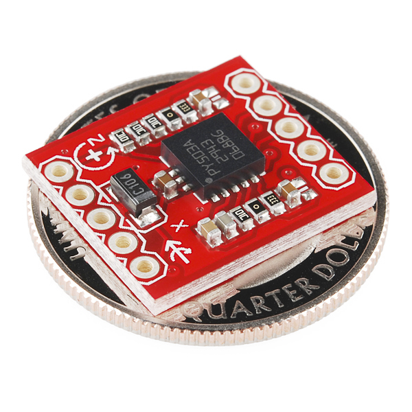
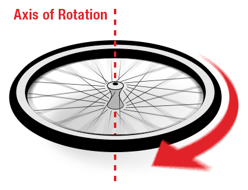
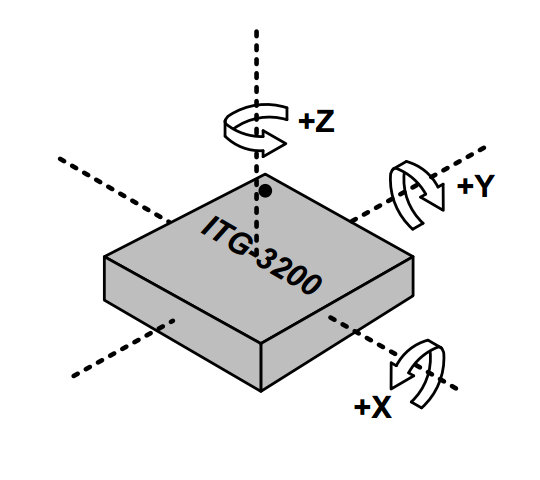
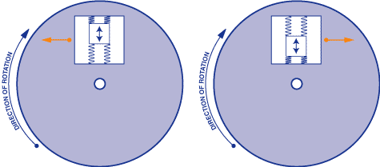
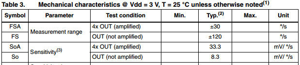

# ジャイロスコープとは何か

ジャイロスコープ（略してジャイロ）とは、回転運動を測定したり、維持したりする装置である。
[MEMS](https://ja.wikipedia.org/wiki/微小電気機械システム)（微小電気機械システム）ジャイロは、角速度を測定する小型で安価なセンサーである。
角速度の単位は、1秒あたりの角度（°/s）や1秒あたりの回転数（RPS）で表される。
角速度とは、単純に回転の速さを測ったものである。

*ブレイクアウトボードに搭載されたLPY503ジャイロ。*

上の写真のようなジャイロは、姿勢を判断するために使われ、ほとんどの自律航法システムに搭載されている。
たとえば[ロボットのバランスを取りたい](http://blog.tkjelectronics.dk/2012/03/the-balancing-robot/)場合、ジャイロスコープを使ってバランスの取れた姿勢からの回転を測定し、モーターへ補正指令を送ることができる。
[SparkFunのカタログ](https://www.sparkfun.com/categories/160)にある、いくつかの製品も確認してみてほしい。

### このチュートリアルで扱う概念

このチュートリアルを読み進める前に、なじみのない概念があれば、次のトピックに目を通しておくとよい。

- [ロジックレベル](./logic-levels.md)
- [SPI通信](./serial-peripheral-interface-spi.md)
- [I2C通信](./i2c.md)
- [アナログ-デジタル変換](./analog-to-digital-conversion.md)

## ジャイロの仕組み

物体がある軸を中心に回転しているとき、それには*角速度*と呼ばれる量がある。
回転する車輪は、1秒あたりの回転数（RPS）や1秒あたりの角度（°/s）で測定できる。

以下のジャイロのz軸が、車輪の回転軸と一致していることに注目してほしい。

上の図のようにセンサーを車輪に取り付ければ、ジャイロのz軸まわりの角速度を測定できる。
他の2つの軸では回転は測定されない。

車輪が1秒間に1回転すると想像してみよう。
その角速度は1秒あたり360度になる。
車輪の回転方向も重要な要素である。軸を中心に時計回りなのか、反時計回りなのかということである。

上の図に写っているような3軸のMEMSジャイロスコープ（[ITG-3200](https://www.sparkfun.com/products/9793)など）は、x軸、y軸、z軸という3つの軸まわりの回転を測定できる。
ジャイロには単軸や2軸のものもあるが、1つのチップに収まった3軸ジャイロは、年々小型化と低価格化が進み、普及しつつある。

ジャイロは、それほど速く回転していない物体にもよく使われる。
航空機は（願わくば）回転はしないが、代わりに各軸でわずかに数度ずつ姿勢が傾く。
ジャイロはこのようなわずかな変化を検知することで、航空機の飛行を安定させる助けになる。
また、航空機の加速度や直線方向の速度は、ジャイロの測定値に影響しないことにも注意してほしい。
ジャイロが測定するのは、あくまで角速度だけである。

では、[MEMS](https://ja.wikipedia.org/wiki/微小電気機械システム)ジャイロは、どうやって角速度を検知しているのだろうか。

*MEMSジャイロセンサーの内部の動作を示した図。*

MEMSの中にあるジャイロスコープのセンサーは非常に小さく（1〜100マイクロメートル程度で、人間の髪の毛ほどの大きさである）。
ジャイロが回転すると、角速度の変化に応じて、内部の小さな共振質量体（レゾネーター）がわずかに動く。
この動きは非常に微弱な電流の電気信号に変換され、増幅されてホストのマイコンによって読み取られる。

## ジャイロの接続方法

ジャイロを使うために必要な主なハードウェア接続は、*電源*と*通信インターフェース*である。
仕様や接続例についての詳しい情報は、必ずセンサーのデータシートを参照してほしい。

### 通信インターフェース

ジャイロには*デジタル*インターフェースと*アナログ*インターフェースのいずれかが搭載されている。

*デジタル*インターフェースを持つジャイロは、通常[SPI](./serial-peripheral-interface-spi.md)または[I2C](./i2c.md)通信プロトコルのいずれかを使用する。
これらのインターフェースを使えば、ホストのマイコンに簡単に接続できる。
デジタルインターフェースの制約の1つが、最大サンプルレートである。
I2Cの最大サンプルレートは400Hzである。
一方でSPIは、はるかに高いサンプルレートを実現できる。

*アナログ*インターフェースを持つジャイロは、回転速度を、通常はグラウンドと供給電圧の間で変化する電圧として表す。
マイコンの[ADC](./analog-to-digital-conversion.md)を使えば、この信号を読み取ることができる。
アナログジャイロは、アナログ信号の読み取り方によっては、より安価で、時にはより高精度になることもある。

### 電源

MEMSジャイロは、一般に低消費電力の部品である。
動作電流はmA、時にはμAのオーダーである。
ジャイロの供給電圧は、通常5V以下である。
デジタルジャイロには、ロジック電圧を選択できるものや、供給電圧のまま動作するものがある。
デジタルインターフェースを使う場合は、必ず[5Vラインどうし、3.3Vラインどうしを接続する](./logic-levels.md)ようにすること。
また、デジタルインターフェースを持つジャイロには低消費電力モードやスリープモードが備わっているものがあり、バッテリー駆動のアプリケーションで使いやすくなっている。
これは、アナログジャイロに対する利点になることがある。

## ジャイロの選び方

どの種類のジャイロを使うべきかを判断する際に考慮すべき仕様は数多くある。
ここでは、特に重要でよく使われるものをいくつか紹介する。

### レンジ（測定範囲）

測定範囲、つまりフルスケールレンジとは、そのジャイロが読み取れる最大の角速度のことである。
自分が何を測定したいのかを考えてみてほしい。
レコードプレーヤーのような非常に遅い回転を測定したいのか、それとも非常に速く回転する車輪を測定したいのか、ということである。

### 感度

感度は、1秒あたりの角度に対するmV数（mV/°/s）で表される。
この見慣れない単位に戸惑う必要はない。
これは、与えられた角速度に対して出力電圧がどれだけ変化するかを示す値である。
たとえば、あるジャイロの感度が30mV/°/sと指定されており、出力に300mVの変化が見られた場合、そのジャイロは10°/sで回転させられたことになる。

**覚えておくとよい原則がある。感度が上がるほど、レンジは狭くなる。**
たとえば、[LPY503ジャイロのデータシート](http://www.sparkfun.com/datasheets/Sensors/IMU/lpy503al.pdf)や、レンジを選択できる他のジャイロのデータシートを見てみるとよい。

レンジが大きくなるほど感度は低下し、得られる分解能も小さくなることが分かる。

### バイアス

どんなセンサーでも、測定値にはある程度の誤差やバイアスが含まれる。
ジャイロが静止しているときの出力を測定すれば、このバイアスを確認できる。
静止しているときは0°が出力されると思うかもしれないが、実際には常にわずかにゼロからずれた誤差が出力される。
この誤差は、バイアスドリフトやバイアス不安定性と呼ばれることもある。
センサーの温度は、このバイアスに大きな影響を与える。
この誤差の原因を最小限に抑えるため、ほとんどのジャイロには温度センサーが内蔵されている。
これにより、センサーの温度を読み取り、温度に依存する変化を補正できるようになっている。
こうした誤差を補正するには、ジャイロを較正する必要がある。
これは通常、ジャイロを静止させた状態にして、コード上ですべての読み取り値をゼロ点に合わせることで行われる。

## さらに学ぶために

ここまで読めば、ジャイロの仕組みが理解でき、自分のプロジェクトでジャイロを使い始めるための土台ができたはずである。

ジャイロを使った次のようなチュートリアルも確認してみてほしい（いずれも英語）。

- Analog Gyro + Arduino（アナログジャイロとArduino）
- Gyro Buying Guide（ジャイロの選び方ガイド）
- Balancing Robot（バランスを取るロボット）

タグ: 概念、センサー、技術

---

出典：[Gyroscope](https://learn.sparkfun.com/tutorials/gyroscope)（SparkFun Learn）を日本語に翻訳し、再構成した。
原文は [CC BY-SA 4.0](https://creativecommons.org/licenses/by-sa/4.0/) ライセンスで公開されており、本ページも同ライセンスの下で提供する。
