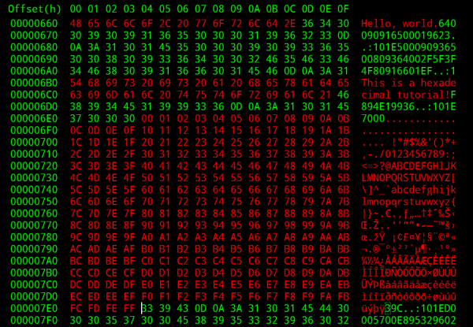
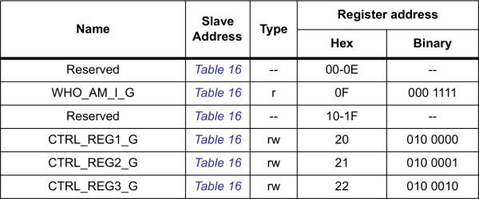

# 16進数

たった10種類の数字だけで数を表すことに、窮屈さを感じたことはないだろうか。
あるいは、大きな数をもっと少ない桁数で表したいと思ったことは。
それとも、催眠術のように続く2進数の1と0の羅列を見ずに、バイトの値をぱっと見分けたいと思ったことは。
こうした用途では、16進数がエンジニアの好んで使う数体系になることが多い。



16進数（[<ruby>Hexadecimal<rt>16進法</rt></ruby>](https://ja.wikipedia.org/wiki/%E5%8D%81%E5%85%AD%E9%80%B2%E6%B3%95)、<ruby>Hex<rt>ヘックス</rt></ruby>、Base16とも呼ばれる）は、数値を書き表し、共有するために使える数体系である。
その点では、私たちが日常的に使っているもっとも有名な数体系である10進数と何も変わらない。
10進数は基数10の数体系であり（指が10本ある私たちにはぴったりである）、10種類の固有の数字を組み合わせて、位取りによって数を表現する。

16進数も、10進数と同じように、複数の数字を組み合わせて大きな数を作る。
ただし16進数では、**16種類の固有の数字**を使う。
0から9までの標準的な数字に加えて、A、B、C、D、E、Fという、通常は数として見慣れない6つの文字も使う。

このほかにも（無限に）さまざまな数体系が存在する。
[2進数](./binary.md)（基数2）も、コンピュータの言語であることから工学の世界でよく使われる。
基数2、つまり2進数の体系は、0と1というたった2つの数字の値だけで数を表す。

16進数は、10進数や2進数と並んで、電子工学やプログラミングの世界でもっともよく出会う数体系のひとつである。
多くの場合、2進数や10進数よりも16進数で数を表すほうが理にかなっているため、16進数の仕組みを理解しておくことは重要である。

このチュートリアルで扱う内容:

- 16進数の基本：16進数で使う16種類の数字、16進数の表し方、16進数での**数え方**を扱う
- 10進数との相互変換：10進数と16進数を変換するおすすめの方法を扱う
- 2進数との相互変換：2進数と16進数の変換方法を紹介する
- 変換用の計算ツール：16進数、2進数、10進数を相互に変換できる簡単な自動計算ツールを紹介する

参考になるチュートリアル:

このチュートリアルに取り組む前に、10進数についてある程度知っておく必要がある。
筆算の割り算を覚えているだろうか。余り、商、積、和、指数といった概念は、16進数と10進数の関係を学ぶ際に、また必要になってくる。

算数のおさらいに加えて、このチュートリアルの前に（あるいは並行して）[2進数のチュートリアル](./binary.md)を読んでおくことをおすすめする。

## 16進数の基本

ここでは16進数のごく基本的な部分、つまり16進数を表すのに使う数字の一覧と、ある数が16進数であることを示すための表記方法を扱う。
また、16進数での数え方という形で、非常に単純な「10進数から16進数への」変換も扱う。

### 数字：0-9とA-F

16進数は**基数16**の数体系である。
つまり、数を表すのに使える数字が**16種類**あるということである。
そのうち10種類は10進数でおなじみの数字、0、1、2、3、4、5、6、7、8、9であり、これらはそれぞれ見慣れた値と同じ値を表す。
残りの6種類はA、B、C、D、E、Fで表され、それぞれ10、11、12、13、14、15という値に対応している。

A〜Fは大文字と小文字のどちらの表記も見かけるはずである。
どちらも問題ない。
大文字か小文字かについて、それほど厳密な標準は決まっていない。
*A3F*も*a3f*も*A3f*も、すべて同じ数を表している。

#### 下付き文字

10進数と16進数には共通する10種類の数字があるため、非常によく似た見た目の数がたくさんできてしまう。
しかし16進数の10は、10進数の10とはまったく異なる数である。
実際、16進数の10は10進数の16に相当する。
そのため、ある数が基数10なのか基数16なのか（あるいは基数8や基数2なのか）を明示する方法が必要になる。
そこで登場するのが**基数の下付き文字**である。


これから見ていくように、下付き文字だけが数の基数を明示する方法ではない。
下付き文字は、もっとも文字どおりに基数を示す方式のひとつにすぎない。

### 16進数での数え方

16進数での数え方は10進数での数え方とよく似ているが、扱う数字が6つ多い。
ある桁が「F」を超えると、その桁は「0」に戻り、左隣の桁が1つ繰り上がる。

実際に数えてみよう。

| 10進数 | 16進数 |     | 10進数 | 16進数 |
| ------ | ------ | --- | ------ | ------ |
| 0      | 0      |     | 8      | 8      |
| 1      | 1      |     | 9      | 9      |
| 2      | 2      |     | 10     | A      |
| 3      | 3      |     | 11     | B      |
| 4      | 4      |     | 12     | C      |
| 5      | 5      |     | 13     | D      |
| 6      | 6      |     | 14     | E      |
| 7      | 7      |     | 15     | F      |

16進数のF₁₆に達すると、10進数で9₁₀から10₁₀に繰り上がるのと同じように、16進数でも10₁₆に繰り上がる。

| 10進数 | 16進数 |     | 10進数 | 16進数 |
| ------ | ------ | --- | ------ | ------ |
| 16     | 10     |     | 24     | 18     |
| 17     | 11     |     | 25     | 19     |
| 18     | 12     |     | 26     | 1A     |
| 19     | 13     |     | 27     | 1B     |
| 20     | 14     |     | 28     | 1C     |
| 21     | 15     |     | 29     | 1D     |
| 22     | 16     |     | 30     | 1E     |
| 23     | 17     |     | 31     | 1F     |

そして1F₁₆に達すると20₁₆に繰り上がり、再び一番右の桁が0からFまで巡っていく。

### 16進数を表す識別子

「0x47DE」なのか「#47DE」なのか、それとも単に47,222という10進数を意味しているのか。
このような混乱を避けるため、16進数にはたいてい、それが16進数であることを示す識別子が前後に付けられる。

| 識別子             | 例            | 備考                                                                                                         |
| ------------------ | ------------- | ------------------------------------------------------------------------------------------------------------ |
| 0x                 | 0x47DE        | UNIXやC系のプログラミング言語（Arduinoも含む）でよく見かける接頭辞である                                     |
| #                  | #FF7734       | HTMLや画像編集ソフトでの色の指定によく使われる                                                               |
| %                  | %20           | URLの中で「スペース」（%20）のような文字を表すのによく使われる                                               |
| \x                 | \x0A          | 「バックスペース」（\x08）、「エスケープ」（\x1B）、「改行」（\x0A）のような制御コードを表すのによく使われる |
| &#x                | &#x3A9        | HTML、XML、XHTMLでUnicode文字を表すのに使われる（たとえば&#x3A9;はΩと表示される）                            |
| 0h                 | 0h5E          | TI-89のような、多くのプログラム可能なグラフ電卓で使われる接頭辞である                                        |
| 下付きの数字や文字 | BE37₁₆、13F₁₆ | *基数16*の数をより数学的に表す方式である。10進数は下付きの10（基数10）で、2進数は基数2で表せる               |

このほかにも、特定のプログラミング言語に固有の接頭辞や接尾辞がいくつも存在する。
たとえばアセンブリ言語では、「H」や「h」という接尾辞（7Fhなど）や、「$」という接頭辞（$6ADなど）が使われることがある。
自分が使っているプログラミング言語でどの接頭辞や接尾辞を使うべきか分からない場合は、サンプルコードを参照してほしい。

「0x」という接頭辞は、特に[Arduinoのプログラミング](./what-is-an-arduino.md)をしていると頻繁に見かけることになる。
このチュートリアルでも、以降はこの表記を使うことにする。

## 10進数との相互変換

ここまでで、16個ほどの値を10進数と16進数の間で変換する方法は分かったはずである。
もっと大きな数を変換するには、いくつかのコツがある。

### 10進数から16進数への変換

10進数から16進数への変換には、割り算と余りを多用する。
筆算の割り算をすっかり忘れてしまった場合は、Wikipediaなどでおさらいしておくとよい。

ある数（*N*とする）を10進数から16進数に変換する手順は、次のようになる。

1. *N*を16で割る。その割り算の**余り**が、求める16進数の最初の桁（最下位、つまり一番右の桁）になる。**商**（割り算の結果）を次のステップに使う。
   - 注意：余りが10、11、12、13、14、15になった場合は、それぞれ16進数の数字A、B、C、D、E、Fになる。
2. 前のステップで得た**商をさらに16で割る**。この割り算の余りが、16進数の**2桁目**（右から2番目）になる。この割り算で得た商を次のステップに使う。
3. ステップ2で得た商をさらに16で割る。この割り算の余りが、16進数の**3桁目**になる。パターンが見えてきただろうか。
4. 前のステップで得た商を16で割り続け、その余りを記録していく。これを**割り算の結果が0になるまで**続ける。その最後の割り算の余りが、16進数の**一番左、つまり最上位の桁**になる。

#### 10進数から16進数への変換例：61453を変換する

言葉での説明はこれくらいにして、実際に例を計算してみよう。
**61453₁₀**を16進数に変換してみる。

1. 61453を16で割ると、**商は3840**、**余りは13**になる。この余りが、求める16進数の一番右、つまり最下位の桁になる。13はAではなくDなので、最初の桁はDである。3840を次のステップに使う。
2. 次に3840を16で割ると、商は240、余りは0になる。2桁目は0であり、240を次の桁の計算に使う。
3. 240を16で割ると、15になり、余りはまた0になる。3桁目は0であり、15をステップ4に使う。
4. 最後に、15を16で割る。ここでようやく商が0になり、余りは15になる。この余りは、この桁の16進数がFであることを意味する。

最後に、**得られた4つの16進数の桁をすべて組み合わせる**と、求める16進数の値が得られる：**0xF00D**。

### 16進数から10進数への変換

16進数から10進数への変換を支配する、少々ややこしい数式がある。

```
値 = hn×16ⁿ + hn-1×16ⁿ⁻¹ + … + h1×16¹ + h0×16⁰
```

この式にはいくつかの重要な要素がある。
それぞれの*h*の項（_hn_、*hn-1*など）は、16進数の値の**1桁**を表している。
たとえば16進数の値が0xF00Dであれば、*h0*はD、*h1*と*h2*は0、*h3*はFである。

**16の累乗**は16進数において非常に重要な要素である。
より重要度の高い桁（数の左側にある桁）ほど、より大きな16の累乗が掛けられる。
最下位の桁である*h0*には16⁰（つまり1）が掛けられる。
16進数の値が4桁であれば、最上位の桁には16³、つまり4096が掛けられる。

**16進数を10進数に変換するには**、先ほどの式のそれぞれの*h*に値を当てはめる必要がある。
そして各桁に対応する16の累乗を掛け、それらをすべて足し合わせる。
手順は次のとおりである。

1. 16進数の値の**一番右の桁**から始める。それに16⁰、つまり**1を掛ける**。つまり、そのままの値を脇に置いておく。
   - アルファベットの16進数（A、B、C、D、E、F）は、対応する10進数の値（10、11、12、13、14、15）に変換するのを忘れないこと。
2. **1桁左に移動する**。その桁に16¹、つまり**16を掛ける**。その積を覚えておき、脇に置いておく。
3. さらに1桁左に移動する。その桁に16²（256）を掛け、その積を記録しておく。
4. 16進数の値の各桁を、増えていく**16の累乗**（4096、65536、1048576……）で掛け続け、それぞれの積を記録していく。
5. 16進数のすべての桁に対応する16の累乗を掛け終えたら、**それらをすべて足し合わせる**。その合計が、その16進数に相当する10進数の値である。

#### 16進数から10進数への変換例：0xC0DEを変換する

4桁の16進数、0xC0DEを10進数に変換する例を見てみよう。
表を作り、各桁を別々の列に並べると、変換作業がしやすくなる。

| 桁の位置（n）    | 3      | 2     | 1      | 0      |
| ---------------- | ------ | ----- | ------ | ------ |
| 並べた16進数の桁 | C      | 0     | D      | E      |
| A〜Fを変換       | 12     | 0     | 13     | 14     |
| 16ⁿを掛ける      | 12×16³ | 0×16² | 13×16¹ | 14×16⁰ |
| 得られた積       | 49152  | 0     | 208    | 14     |

これらの積をすべて足し合わせると、49152 + 0 + 208 + 14 = **49374**になる。

つまり、C0DE₁₆ = 49374₁₀である。

この表を使う方法は、16進数の各桁、位置、16の累乗を整理して把握するのに最適である。
もっと大きな16進数を変換したい場合は、左に列を追加して*n*を増やしていくだけでよい。

手計算のやり方が分かったところで、時間を節約するために計算ツールを使ってみるのもよいだろう。

## 2進数との相互変換

一安心してほしい。面倒な変換はもう終わりである。
電気工学やコンピュータ工学で16進数が使われるのは、コンピュータの言語である1と0、つまり2進数との相互変換が非常に簡単だからである。

16進数と2進数の変換が簡単なのは、16進数の各桁が2進数の**4ビット**（ビットとは1個の2進数の桁のこと）にちょうど対応しているためである。
**つまり1バイト**（8個の2進数の桁）は、常に**2桁の16進数で表せる**ということである。
これにより、16進数は1バイトやそのまとまりを表すのに、非常に簡潔で便利な方法になっている。

### 2進数から16進数への変換

まず、最初の16個の16進数の値を2進数に対応付けてみよう。

| 10進数 | 16進数 | 2進数 |     | 10進数 | 16進数 | 2進数 |
| ------ | ------ | ----- | --- | ------ | ------ | ----- |
| 00     | 0      | 0000  |     | 08     | 8      | 1000  |
| 01     | 1      | 0001  |     | 09     | 9      | 1001  |
| 02     | 2      | 0010  |     | 10     | A      | 1010  |
| 03     | 3      | 0011  |     | 11     | B      | 1011  |
| 04     | 4      | 0100  |     | 12     | C      | 1100  |
| 05     | 5      | 0101  |     | 13     | D      | 1101  |
| 06     | 6      | 0110  |     | 14     | E      | 1110  |
| 07     | 7      | 0111  |     | 15     | F      | 1111  |

16進数や2進数を使い続けるうちに、これら16個の値は自然と頭に染みついていくはずである。
これが、2進数と16進数を変換するための鍵になる。

2進数と16進数を変換するには、4つの2進数の桁（ビット）が1つの16進数の桁に対応するという性質を利用する。
2進数から16進数へ変換するには、**次の手順に従う**。

1. 2進数の値を、右端から**4桁ずつのグループ**に分割する。
2. それぞれの4桁のグループについて、先ほどの表を参照して対応する16進数の値を見つけ、**4桁の2進数のグループをその1つの16進数の値に置き換える**。

これだけである。実際にやってみよう。

#### 2進数から16進数への変換例：0b101111010100001を変換する

まず、2進数の一番右端から始めて、1と0を4桁ずつのグループに分ける。

```
0101 1110 1010 0001
```

次に、先ほどの表を参照して、それぞれの4桁のグループを16進数の桁に変換する。

```
0101 → 5
1110 → E
1010 → A
0001 → 1
```

これで完成である。0b101111010100001 = 0x5EA1となる。

### 16進数から2進数への変換

16進数から2進数への変換は、2進数から16進数への変換とよく似ている。
16進数の桁を1つずつ取り出し、それぞれを**4桁の2進数**に変換していく。
これを、数がすべて0と1で埋まるまで繰り返す。

#### 16進数から2進数への変換例：0xDEADBEEFを変換する

0xDEADBEEF（システムクラッシュを示すためによく使われるコードである）を変換するには、まず桁を1つずつ「箱」に振り分ける。

```
D E A D B E E F
```

そして、それぞれの16進数の桁を4ビットに変換する。

```
D → 1101
E → 1110
A → 1010
D → 1101
B → 1011
E → 1110
E → 1110
F → 1111
```

つまり、0xDEADBEEF = 0b11011110101011011011111011101111となる。1と0がたくさん並ぶことになる。

### バイトを表現し識別するための16進数

これまでの例は、16進数が持つ大きな強みのひとつ、**バイトの値を簡単に表せる**という点を示している。
16進数の値は、長く続く1と0の並びよりも短く覚えやすいため、扱いやすいことが多い。



たとえば上のレジスタマップは、LSM9DS0（優れた9軸センサー）のものである。
このセンサーを制御するために使われるレジスタアドレスが、16進数と2進数の両方で一覧になっている。
CTRL_REG2_Gレジスタにアクセスしたい場合、0b010001と覚えるより0x21と覚えるほうがずっと簡単であり、16進数の値のタイプミスを見つけるのも2進数の場合よりずっと簡単である。
そのため、コードの中では2進数よりも16進数の値を使うことのほうが圧倒的に多い。

## まとめ

16進数の仕組みを理解することは、電子工学やプログラミングの実に多くの分野にとって欠かせない。

16進数の新しい知識を身につけたところで、次のような関連するチュートリアルも確認してみてほしい。

- [デジタルロジック](./digital-logic.md)と[Shift registers（シフトレジスタ）](https://learn.sparkfun.com/tutorials/shift-registers)：これらのチュートリアルは、16進数をより大きく一般的な電子工学の概念の土台として使っている。デジタルロジックは、コンピュータが行うあらゆる判断の中核である。シフトレジスタは、1つの入力や出力を8個以上に分配するのに使える。
- [I2C](./i2c.md)と[SPI](./serial-peripheral-interface-spi.md)：これらの通信インターフェースは、ほぼ必ず何らかの形で16進数を使う。SPIやI2Cで通信する機器はたいてい一連のレジスタを持ち、それぞれ16進数のアドレスに対応付けられている。I2Cデバイスにはそれぞれ固有の7ビットアドレスが割り当てられており、たいてい16進数で表記される。
- [バイナリブラスターの組み立てガイド](./binary-blaster-assembly-guide.md)：16進数の変換を練習したいなら、Binary Blaster Kitが役立つ。これははんだ付けが必要なキットである。組み立てたら、それを使って2進数、16進数、10進数の関係についての理解度を試すことができる。

タグ: 通信、コンピュータ工学、概念、プログラミング

---

出典：[Hexadecimal](https://learn.sparkfun.com/tutorials/hexadecimal)（SparkFun Learn）を日本語に翻訳し、再構成した。
原文は [CC BY-SA 4.0](https://creativecommons.org/licenses/by-sa/4.0/) ライセンスで公開されており、本ページも同ライセンスの下で提供する。
