# サーボモーター入門

[サーボモーター](https://www.sparkfun.com/servos)は、電子工作プロジェクトに動きを加える手軽な方法である。
もともとはラジコンカーやラジコン飛行機で使われていたが、今ではさまざまな用途で使われるようになった。
サーボが便利なのは、モーターの位置決めを正確に制御できる点にある。
どこを指すか指示すれば、そのとおりに動いてくれる。

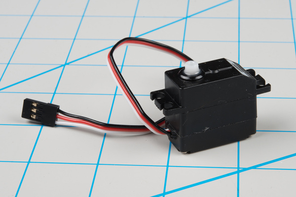

*典型的なホビーサーボ*

一般的なDCモーターには接続用のワイヤーが2本あり、電力を加えると単に回転し続ける。
逆方向に回したい場合は、電源の極性を反転させる必要がある。
どれだけ回転したかを知りたい場合は、それを測定する方法を自分で考える必要がある。

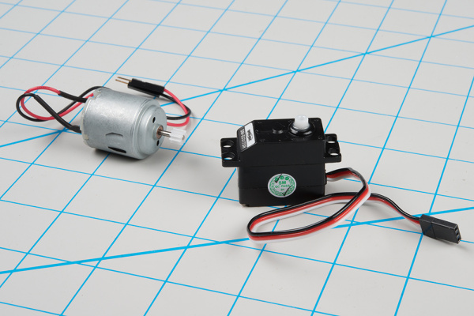

*DCモーター（左）とホビーサーボ*

対照的に、**サーボモーター**にはどこまで回転させるかを、精密にタイミングを合わせたパルスで指示する。
サーボには3本のワイヤーがあり、電源、グラウンド、そしてコマンドパルスを伝える3本目のワイヤーで構成される。

## 参考になるチュートリアル

- モーターと最適な選び方
- パルス幅変調（PWM）についての背景知識

## サーボモーターの背景

最も一般的な意味では、「[サーボメカニズム](https://en.wiktionary.org/wiki/servomechanism)」（略してサーボ）とは、フィードバックを使って望ましい結果を得るための装置である。
フィードバック制御は、速度、位置、温度など、さまざまな分野で使われている。

ここで扱っているのは、ホビー用あるいはラジコン用のサーボモーターの文脈である。
これらは、主にラジコン車両のステアリングに使われる小型モーターである。
位置決めが簡単に制御できるため、ロボット工学やアニマトロニクスにも使われる。
ただし、産業機械で使われる大型のサーボモーターなど、他の種類のサーボモーターと混同しないよう注意してほしい。

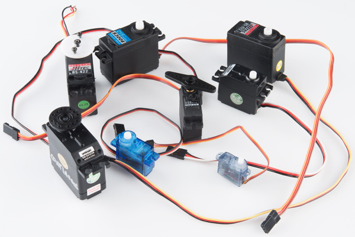

*さまざまなホビーサーボ*

RC（ラジコン）用サーボはかなり標準化されている。どれも似た形をしており、両端に取り付け用のフランジがあり、[ウルトラナノ](https://www.sparkfun.com/products/11882)から[ジャイアント](https://www.sparkfun.com/products/11881)まで、段階的なサイズで販売されている。
サーボには、車輪やレバーなど「ホーン」と呼ばれる複数の取り付けパーツが付属していることが多く、これを軸に取り付けて、動かしたい装置に合わせられる。

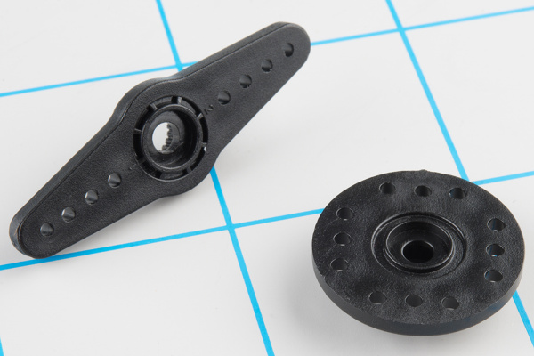

*サーボホーンの例*

### 電気的な接続

ほとんどのホビーサーボは、同じ制御信号方式を使う標準的な3ピンプラグを採用しており、これによりRC用サーボはある程度互換性がある。

コネクタは、0.1インチピッチのメス3ピンヘッダーである。
少し紛らわしいのは、配線の色分けが常に一貫しているわけではなく、いくつかの色分け方式が存在する点である。
幸い、ピンの並び順はたいてい同じで、色だけが異なることが多い。

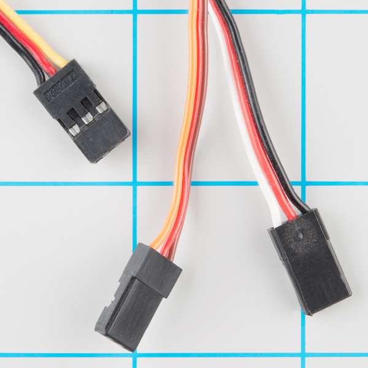

*サーボケーブル*

下の表は、よくある配色の方式をまとめたものである。
覚えやすい目安として、最も地味な色（黒や茶）はたいていグラウンド、赤はたいてい電源であることが多い。

| ピン番号 | 信号名 | 配色1（Hitec） | 配色2（JR） | 配色3（Futaba） |
| --- | --- | --- | --- | --- |
| 1 | グラウンド | 黒 | 茶 | 黒 |
| 2 | 電源 | 赤 | 赤 | 赤 |
| 3 | 制御信号 | 黄 | オレンジ | 白 |

*サーボ接続の配色*

> **注意！** 配色に確信が持てない場合は、必ずドキュメントを確認すること。逆に接続してはいけない。

### 制御信号

サーボコネクタの3番目のピンは、モーターにどこまで動くかを指示する制御信号を伝える。
この制御信号は特定の種類のパルス列である。
パルスは20msec（50Hz）間隔で発生し、パルス幅は1〜2msecの間で変化する。
マイクロコントローラーで利用できる[パルス幅変調（PWM）](./pulse-width-modulation.md)のハードウェアは、サーボの制御信号を生成するのに適した方法である。

一般的なサーボは、パルス幅が1〜2msecの間で変化するのに応じて90°の範囲で回転する。パルス幅が1.5msecのとき、可動範囲の中央に位置するはずである。

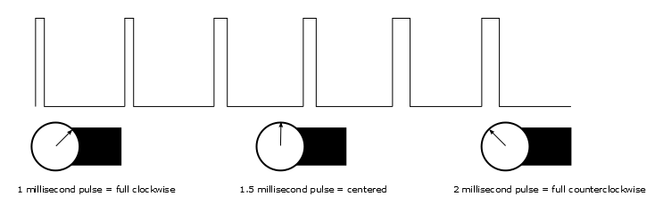

*パルスと位置*

### サーボへの給電

RC車両では、公称の電池電圧は4.8Vである。
充電直後はこれよりやや高くなり、電池が消耗するにつれて電圧は下がっていく。
電圧が下がると、得られるトルクも下がる。RC車両を運転したことがあれば、電池が弱ってくるにつれて操作性が失われていく感覚はおなじみだろう。
止まる直前には動きが鈍く感じられるようになる。

電池を使わない場合は、一般的な電源から得られる5VDCがよい選択肢になる。
Arduinoや他のマイクロコントローラー（SparkFunの[Servo Trigger](https://www.sparkfun.com/products/13118)など）でモーターを制御する場合、供給できる**絶対最大**電圧は**5.5VDC**である。

給電方法にかかわらず、モーターが消費する電流は機械的な負荷が増えるほど増加する点に注意してほしい。
軸に何も取り付けていない小型サーボはおよそ10mAしか消費しないかもしれないが、重いレバーを回す大型サーボは1アンペア以上を消費することもある。
電源がこの負荷に対応できないと、無理をしているサーボやストールしているサーボによって電源の電圧が下がり、マイクロコントローラーがリセットされるなど、予測できない影響が出ることがある。

さらに、複数のサーボを使う場合や、モーターが軽視できない負荷を動かす用途では、電源からそれぞれのサーボに直接、太めのゲージのワイヤーで配線する方がよい。あるサーボから次のサーボへ電源をデイジーチェーンでつなぐよりも確実である。
この構成は一般に「スターパワー」と呼ばれる。
それぞれが電源に直接つながっていれば、あるサーボが電源レールを下げてしまっても、他のサーボに影響が及びにくくなる。

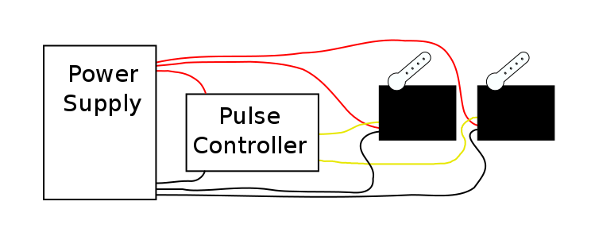

*スターパワー*

迷ったときは、マルチメータを手に取り、消費電流を測定し、サーボが動いているときにVCCが下がっていないか確認するとよい。

### 中身を見てみよう

サーボモーターの内部では、回転軸に取り付けられたポテンショメータを使って位置を検知する仕組みになっている。
入ってくるパルスの幅を測定し、ポテンショメータの示す位置が入力パルス幅に対応するまで、モーターに電流を流して軸を回転させる。
これは**フィードバック制御**の一形態である。
モーターはパルス幅から望ましい位置を受け取り、実際の軸の位置はポテンショメータを介して回路にフィードバックされる。
回路は望ましい値と実際の値を比較し、実際の値が望ましい値に一致する方向にモーターを駆動する。

分解したサーボの内部を見てみよう。
ギア、DCモーター、位置検出用のポテンショメータ、そして小さなPCBが確認できる。
PCBの片面にはチップが一つあり、おそらく小型のマイクロコントローラーか、サーボ専用のICと思われる。

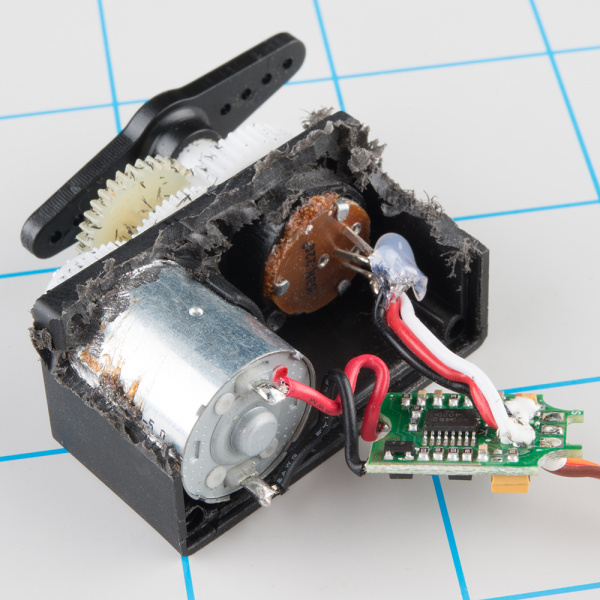

*分解したRC用サーボの内部*

PCBのもう一方の面には、個別のトランジスタがいくつかあり、おそらくHブリッジの構成になっている。これにより、コントローラーは時計回り・反時計回りのどちらの回転にも対応できるよう、モーターに流す電流の向きを切り替えられる。

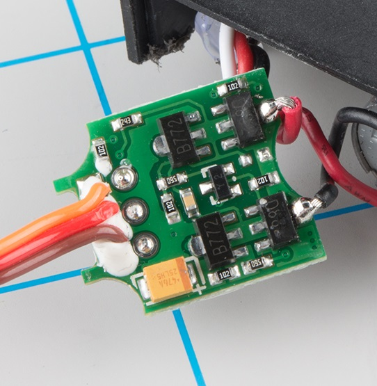

*PCBの裏面*

## いくつかの違い

プロジェクト用にサーボを探す際、いくつか意識しておきたいパラメータがある。

### 可動範囲の制約

1〜2ミリ秒というパルス範囲は、厳密な*規格*というより*慣習*に近い。
サーボによっては、さらに短い、あるいは長いパルスにも反応し、より広い可動範囲を持つものもある。

ただし注意が必要である。この拡張された可動範囲は、すべてのサーボに当てはまるわけではない。
機械的に90°の回転に制限されているサーボもある。
その限界を超えて駆動しようとすると、ギアが欠けるといった損傷を引き起こすことがある。
ここで分解したサーボも、まさにこの理由で壊れてしまったものである。

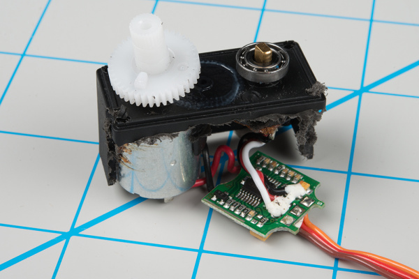

*ギアの突起が、回転範囲を制限するために使われている。*

### 位置決めと連続回転の違い

90°の範囲からさらに離れると、**フルローテーション**、**連続回転**、あるいは単に**360°**サーボと呼ばれるものもある。
その名のとおり、軸は連続的に回転し続けるため、駆動用モーターとして便利である。
見た目は通常のサーボとほとんど変わらない。

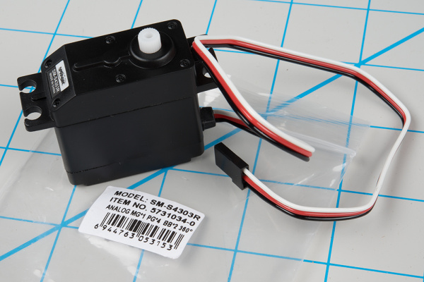

*よく見ると、パッケージに「360°」の表記があることに気づくはずである。*

連続回転サーボは、位置を制御する代わりに、20msecのパルス列信号を軸の回転速度と方向に変換する。
それ以外の点では通常のRC用サーボとよく似ている。同じ電源、同じ制御信号、同じ3ピンコネクタを使い、RC用サーボと同じサイズで販売されている。

全体の速度は比較的遅く、最大でおよそ60RPM程度が一般的である。
より速い回転速度が必要な場合、サーボは最適な選択肢ではない。[DCギアモーター](https://www.sparkfun.com/categories/247)やブラシレスDCモーターの方が適していることが多いが、これらはサーボの制御信号にそのまま対応しているわけではない。

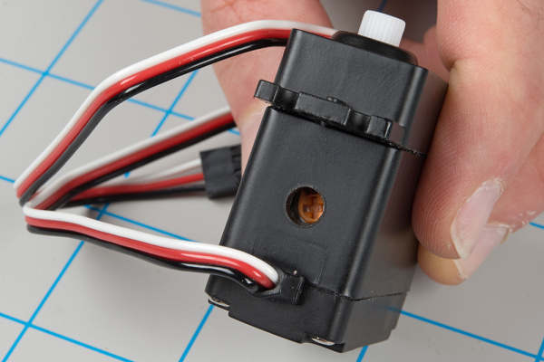

*ヌリングトリムポット*

よく見ると、連続回転サーボには通常のサーボとの小さな違いが一つある。多くの場合、制御信号への応答を調整するための「ヌリング」トリムポットを備えている。
これは通常、1.5msecのパルスでモーターが停止するように設定されている。
それより短いパルスでは反時計回りに、長いパルスでは時計回りに回転する。

### アナログとデジタルの違い

ここで扱っているパルス制御式のサーボは*アナログ*である。
高速なパルス列を使い、[シリアル通信](http://hitecrcd.com/products/servos/digital-servo-programmers-2/hfp-25-digital-servo-programmer-tester-2/product)インターフェースを介してより詳細な設定ができる、[デジタル制御](http://hitecrcd.com/faqs/servos/digital-servos)のサーボもある。こちらは通常、RC車両向けに調整されたパラメータを持つ。

### プラスチックギアと金属ギアの違い

サーボを検討する際に見ておきたい最後の点が、内蔵されているギアの種類である。

安価なサーボ（ここで分解したものもそうである）には、たいてい成形プラスチック製のギアが使われているのに対し、より高価なサーボには金属製のギアが使われている。
プラスチックギアは、モーターが詰まったり過負荷になったりした際に欠けやすい。
古くからの格言のとおり、値段相応というわけである。

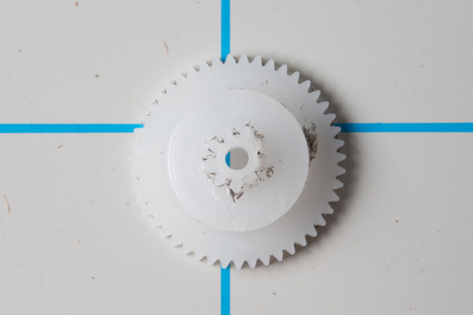

*内側のギアの3時の方向あたりに、歯が欠けているのに注目してほしい。*

## サーボの使いどころ

### 従来のRC用途

冒頭で述べたとおり、ホビーサーボモーターの一般的な用途は、ラジコン車両のステアリングである。

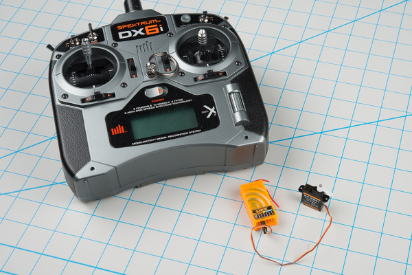

*RC送信機（左上）、受信機、ステアリング用サーボ*

RC車両は、ジョイスティックとアンテナが付いた箱である送信機ユニットで制御する。
送信機は、サーボモーターに接続された受信機モジュール（上の写真のオレンジ色の箱）へ制御情報を送る。
送信機のスティックを動かすと、受信機はそれに対応するパルスを生成し、モーターに動作を指示する。

古いRC機体の設定にはかなりの忍耐が必要だった。
サーボを調整するには、サーボホーン、機械的なリンク、送信機のトリム調整を丁寧に手作業で行う必要があったためである。
現代の送信機・受信機はマイクロコントローラーをベースにしており、送信機のLCD画面や、あるいはコンピュータのインターフェースから調整できる。

## Arduinoでサーボを制御する

サーボモーターは指示に応じて動くため、あらゆるプロジェクトに動きを加える手軽な方法である。
Arduino互換のプラットフォームを使っている場合、Arduinoの[servoライブラリ](https://www.arduino.cc/en/Reference/Servo)を使えば、サーボのパルス生成をすぐに利用できる。

### 推奨する部品

この例を作るには、次の部品が必要になる。

- SparkFun RedBoard - Programmed with Arduino
- サーボ - 汎用（サブマイクロサイズ）
- USB Micro-Bケーブル（6フィート）
- ジャンパー線
- ACアダプタ電源（5VDC、2A、USB Micro-B）

### ハードウェアの接続

サーボをRedBoardに接続するのはかなり簡単である。必要な接続はたった3つだけである。

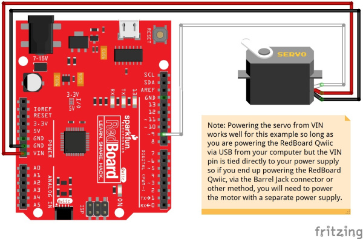

*サーボをRedBoardに接続する*

特に、サーボモーターへの電源は`VIN`ピンから供給されており、オンボードのレギュレータを経由していない点に注意してほしい。
オンボードのレギュレータでは、最も小型のサーボ以外を駆動するには力不足である。
また、このプロジェクトは5VのACアダプタで給電されていることにも気づくはずである。
筆者の作業台では、USBポートから給電した場合、性能がぎりぎりだった。

### ファームウェア

回路を接続したら、次のスケッチを読み込む。

> **注意：** この例は、デスクトップ版Arduino IDEの最新版を使っている前提で進める。Arduinoを初めて使う場合は、Arduino IDEのインストールのチュートリアルを確認してほしい。
> Arduinoライブラリを一度もインストールしたことがない場合は、インストールガイドを確認してほしい。

```cpp
/******************************************************************************
servo-skatch.ino
Example sketch for connecting a hobby servo to a sparkfun redboard
  (https://www.sparkfun.com/products/9065)
  (https://www.sparkfun.com/products/12757)
Byron Jacquot@ SparkFun Electronics
May 17, 2016

**SparkFun code, firmware, and software is released under the MIT License(http://opensource.org/licenses/MIT).**

Development environment specifics:
Arduino 1.6.5
******************************************************************************/

#include <Servo.h>

Servo testservo;

uint32_t next;

void setup()
{
  // the 1000 & 2000 set the pulse width 
  // mix & max limits, in microseconds.
  // Be careful with shorter or longer pulses.
  testservo.attach(9, 1000, 2000);

  next = millis() + 500;
}

void loop()
{
  static bool rising = true;

  if(millis() > next)
  {
    if(rising)
    {
      testservo.write(180);
      rising = false;
    }
    else
    {
      testservo.write(0);
      rising = true;
    }

    // repeat again in 3 seconds.
    next += 3000;
  }

}
```

このスケッチは、サーボを左右に動かし続ける。

26行目の`attach()`の呼び出しに特に注目してほしい。
ここでは任意の`min`と`max`パラメータを使い、パルスを1000〜2000マイクロ秒（1〜2ミリ秒）の範囲に制限している。
上記の「可動範囲の制約」の節で述べたとおり、この範囲を超えてサーボを駆動すると、サーボを損傷する恐れがある。

> Servoオブジェクトは、範囲と位置の扱いが少しわかりにくいことがある。特に`attach()`の呼び出しで最小・最大パルスを指定している場合はなおさらである。
> 最小値と最大値が定義されている状態では、`write()`メソッドに渡すパラメータ（本来は度数で表される）は、その制約された範囲に再変換される。
> この例では、`write(0)`は1ミリ秒のパルスになり、`write(180)`は2ミリ秒のパルスになる。
> 一般的なサーボでは、これはおよそ90°の動きに相当し、呼び出しのパラメータが示すような180°にはならない。

servoライブラリには他にもいくつか制約がある。
特に注意すべき点として、ピン9とピン10の`analogWrite()`を上書きしてしまう。
このライブラリについて詳しくは、[Arduinoのリファレンスページ](https://www.arduino.cc/en/Reference/Servo)を確認してほしい。

うまく動作しないようであれば、後述のトラブルシューティングの節を確認してほしい。

## Servo Triggerを使う

前のセクションではサーボの例をゼロからプログラムしたが、まったくプログラミングを必要としないサーボの使い方もある。

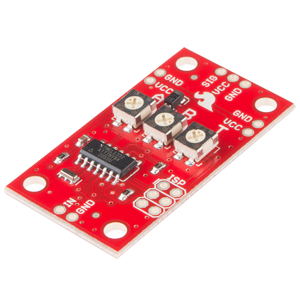

*Servo Trigger*

SparkFun Servo Triggerは、ホビーサーボの駆動に特化した小さな基板である。
トリムポットでサーボの位置を設定でき、スイッチを操作することでその位置同士を切り替えられる。
[標準](https://www.sparkfun.com/products/13118)版と[連続回転](https://www.sparkfun.com/products/13872)版が用意されている。
Servo Triggerについてさらに詳しくは、それぞれのHookup Guideを参照してほしい。

## トラブルシューティング

どんな方法でサーボを駆動している場合でも、動作させるにはちょっとした注意が必要になることがある。
いくつかトラブルシューティングのヒントを紹介する。

- 負荷がかかっていないサーボでも、かなりの電力を消費することがある。フルパワーを出すには、電源が各サーボにつき最低1アンペアを供給できることを確認する必要がある。
  - 電源がその負荷に対応できていない場合、サーボの動作は悪くなる。適切に電力を供給されたサーボよりも動きが遅くなる。
  - 電力不足のサーボは**ハンチング**（目的の位置にきれいに動かず、その位置付近で前後に揺れ続ける現象）を起こしやすい。可聴域でうなり音を発したり、繰り返しリセットしたりすることもある。
  - サーボとプロセッサが同じ電源を共有している状況では、サーボが電流を大量に消費したり（あるいはラインに大きなノイズを乗せたり）することで、プロセッサがリセットしたり誤動作したりすることがある。この問題への最も単純な解決策は、プロセッサとサーボを別々の電源で動かすことである（ただし、両者の間には共通のグラウンドを必ず用意すること）。より複雑な解決策としては電源のノイズフィルタリング技術があるので、詳しくは検索してみてほしい。
  - USB経由でプロジェクトに給電する方法は、最も小型のサーボモーターにしか向かない。中型のサーボは、USBポートから得られる100mAを簡単に超えてしまう。
  - サーボを動かそうとしたときに電源LEDがちらつく場合は、危険な状態にある。
- サーボには最大速度がある。サーボの動きが不規則な場合、ある位置から別の位置へあまりに速く切り替えようとしている可能性がある。コマンドの間に一時停止を入れることで、サーボが反応する時間を確保できる。
- 「可動範囲の制約」の節で述べたとおり、サーボによって可動範囲が異なることがある。
  - サーボを可動範囲の端を超えて駆動すると、うなり音を発したり、ギアがきしんだりすることがある。サーボがカチカチと音を立て始めたら、ギアが引っかかっているサインなので注意すること。
  - これがプロジェクトに影響する場合は、180°の回転に対応していると仕様に明記されたサーボを探すとよい。また、Servoライブラリの`attach()`コマンドでは、各サーボの最小・最大位置を細かく調整でき、限界を超えて駆動してしまうのを防ぐのに役立つ。

よいサーボライフを。

## まとめ・参考資料

### 参考資料

- [Servo Motor](https://www.sparkfun.com/categories/245)カテゴリには、さまざまなサーボが揃っている。筆者が特に調子がよいと感じたのは、[汎用金属ギアのマイクロサイズサーボ](https://www.sparkfun.com/products/10333)である。
- SparkFun Servo Triggerには、[標準](https://www.sparkfun.com/products/13118)版と[連続回転](https://www.sparkfun.com/products/13872)版がある。
- [Micro Maestro](https://www.sparkfun.com/products/9664)は、6チャンネル対応のUSB-サーボインターフェースである。

### さらに詳しく知りたい場合

- サーボの詳しい情報や歴史については、Wikipediaの[Radio control Servos](https://en.wikipedia.org/wiki/Servo_(radio_control))の記事を参照してほしい。
- [uArm](https://www.sparkfun.com/products/13663)は、サーボモーターで駆動するロボットアームである。
- 通常のサーボを[改造](http://www.instructables.com/id/How-to-hack-a-servo-for-continuous-rotation-Towe/?ALLSTEPS)して、連続回転サーボに変えることもできる。
- [制御基板を取り外して](http://www.instructables.com/id/HiTec-Servo-Hack/?ALLSTEPS)、サーボを小型のDCギアモーターに変えることもできる。

さらにサーボを楽しみたい場合は、次のようなSparkFunのチュートリアルも参考になる。

- Mario the Magician's Magical Lapel Flower — 驚異的な才能を持つマジシャンMario the Magician氏によるゲストチュートリアル。サーボ制御のラペルフラワーの作り方を紹介する
- SparkFun Blocks for Intel® Edison - PWM — PWM Blockの機能の簡単な概要
- Servo Trigger Hookup Guide — プログラミング不要で、SparkFun Servo Triggerを使いさまざまなサーボモーターを制御する方法
- Continuous Rotation Servo Trigger Hookup Guide — プログラミング不要で、SparkFun Continuous Rotation Servo Triggerを連続回転サーボと組み合わせて使う方法

タグ: Arduino、部品、機構、モーション、モーター、電源

---

出典：[Hobby Servo Tutorial](https://learn.sparkfun.com/tutorials/hobby-servo-tutorial)（SparkFun Learn）を日本語に翻訳し、再構成した。
原文は [CC BY-SA 4.0](https://creativecommons.org/licenses/by-sa/4.0/) ライセンスで公開されており、本ページも同ライセンスの下で提供する。
