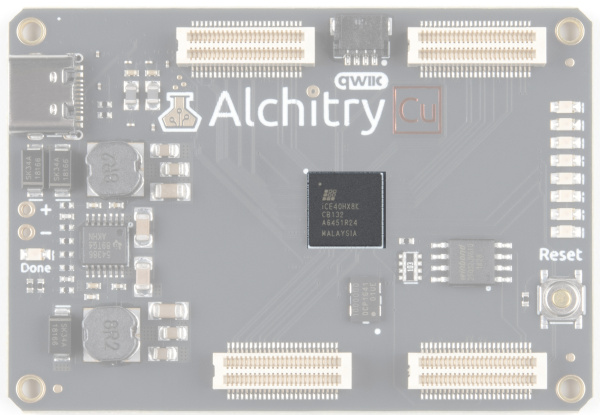
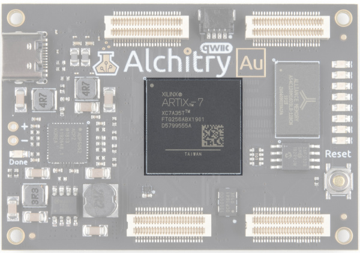
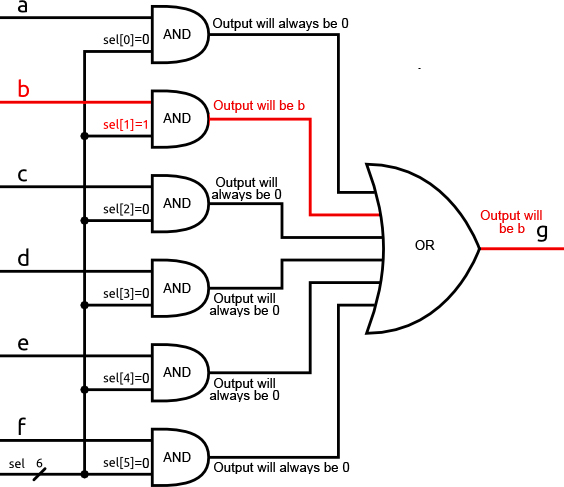

# FPGAはどうやって動いているのか

## はじめに

まずは基本から始めよう。[FPGA](https://www.sparkfun.com/fpga)とは何だろうか。
FPGAは**F**ield **P**rogrammable **G**ate **Array**（フィールドプログラマブルゲートアレイ）の略だが、これだけではFPGAが何をするものなのか理解する助けにはならない。とはいえ、まずは言葉の意味を片付けておく必要があった。

FPGAは、プログラマブルロジック（プログラマブルハードウェアと呼ばれることもある）と呼ばれる部類のデバイスに属する。
FPGAそのものは基本的には何もしないが、望みのデジタル回路であればほぼ何にでも設定（コンフィグレーション）できる。
ここでの魔法は、物理的には何も変化しないという点である。
設定をFPGAに読み込ませるだけで、望みどおりの回路のように振る舞い始める。
はんだ付けもジャンパー線も、面倒な作業は一切いらない。
FPGAはその後、また別の回路として、さらに別の回路として、何度でも再設定できる。
この設定はRAMベースであるため、実質的に無制限に再設定が可能である。

| | |
| --- | --- |
|  |  |
| *Alchitry Cu基板上のLattice iCE40 HX FPGA* | *Alchitry Au基板上のXilinx Artix 7 FPGA* |

FPGAを使ってデジタル*回路*を作ると言っても、実際に設計を回路図として描くわけではない。
FPGAに収められる回路の規模と複雑さを考えると、実際に回路図を描いていてはあまりにも扱いづらくなってしまう。
その代わりに、望む回路の振る舞いを記述すれば、ツールがその記述をもとに、その振る舞いに一致する回路を作ってくれる。

この点では、ただテキストを入力するだけという意味でプログラミングに近い感覚がある。
しかし、実際に作っているのはハードウェアであるため、その根本的な実装のされ方はまったく異なる。

テキストでハードウェアを作るというのが魔法のように感じられても、心配はいらない。
その仕組みは概念としてはとても単純であり、このチュートリアルではそれをきちんと分解して見ていく。

参考になるチュートリアル:

このチュートリアルでは、FPGAとは何か、そしてどう動作するのかを扱う。
電気（電圧、電流など）と2進数についてはある程度理解しているものとして進める。
それ以外のことは、この基礎の上にすぐに積み上げていける。
これはFPGAとは何か、その基本的な設計を概観することを目的としており、自分でFPGA設計を行うためのガイドではない。

以下の概念に馴染みがなければ、続きを読む前にこれらのチュートリアルを確認しておくことをおすすめする。

- [電圧、電流、抵抗とオームの法則](./voltage-current-resistance-and-ohms-law.md)
- [電気とは何か](./what-is-electricity.md)
- [アナログとデジタルの違い](./analog-vs-digital.md)
- [トランジスタ](./transistors.md)

## デジタル回路と論理ゲート

### デジタル回路

FPGAには、デジタル回路しか作れないという注意点がある。
新しいFPGAの中にはオンボードのアナログ-デジタル変換器を搭載しているものもあるが、それらもアナログ入力をできるだけ早くデジタル信号に変換している。
では、デジタル回路とは何だろうか。

電子工学において、*デジタル*という言葉は、連続的な電圧値を切り捨てて、離散的な1と0で表す回路を指すのに使われる。
上位レベルの設計にとっては、実際に使われる電圧やそのしきい値そのものはさして重要ではないが、FPGA内部では0Vが0、1.2Vが1として扱われるといった例をよく目にする。
実際の電圧が、たとえば0.8Vだったとしても、1.2Vに十分近ければ1とみなされ、すべて同じように動作する。

デジタル回路は電圧を極端な値へ振り切るように設計されており、そのおかげでノイズやその他の現実世界の干渉に対して驚くほど頑健になる。
*デジタル*という考え方はまた、下位レベルの設計を気にせずに回路へ複雑な振る舞いを組み込む方法も与えてくれる。理想化された世界の中で作業できるということである。
細々とした部分は、これから使う単純な構成要素の設計の中で処理されている。

この構成要素が*論理*ゲートである。

### 論理ゲート

論理ゲートにはいくつかの種類があるが、もっともよく使われるのは**AND**、**OR**、**XOR**、**NOT**である。
それぞれデジタル入力を受け取り、その論理演算を行い、デジタル値を出力する。

[**AND**](https://ja.wikipedia.org/wiki/AND%E3%82%B2%E3%83%BC%E3%83%88)ゲートは2つの入力を受け取り、1つ目の入力*かつ*2つ目の入力が1のときにのみ1を出力する。
どちらかの入力が0であれば、出力は0になる。
ANDゲートの記号は次のようになる。

[**OR**](https://ja.wikipedia.org/wiki/OR%E3%82%B2%E3%83%BC%E3%83%88)ゲートは2つの入力を受け取り、1つ目の入力*または*2つ目の入力が1であれば1を出力する。
両方が0のときだけ、出力は0になる。
ORゲートの記号は次のとおりである。

[**XOR**](https://ja.wikipedia.org/wiki/XOR%E3%82%B2%E3%83%BC%E3%83%88)ゲートはORゲートに似ているが、1つ目の入力または2つ目の入力のどちらか一方だけが1のときに1を出力し、両方が1のときは出力しない。
入力が異なるときに1を出力する、と考えることもできる。
XORのXは「exclusive（排他的）」を意味する。記号は次のとおりである。

[**NOT**](https://ja.wikipedia.org/wiki/NOT%E3%82%B2%E3%83%BC%E3%83%88))ゲートはもっとも単純なゲートである。
入力は1つだけで、その値を単純に反転させて出力する。
1は0に、0は1になる。

これらの基本ゲートには、[NAND](https://ja.wikipedia.org/wiki/NAND%E3%82%B2%E3%83%BC%E3%83%88)、[NOR](https://ja.wikipedia.org/wiki/NOR%E3%82%B2%E3%83%BC%E3%83%88)、[XNOR](https://ja.wikipedia.org/wiki/XNOR%E3%82%B2%E3%83%BC%E3%83%88)と呼ばれる派生形もある。
これらは、単に標準的なゲートの出力を反転させたものにすぎない。

参考までに、ANDゲートは他のすべての論理ゲートと同様、トランジスタを使って作ることができる。
以下の画像は、ANDゲートがどう実装されうるかの一例を示している。
この回路図では、NMOSとPMOSのMOSFETトランジスタが使われている。
この種の設計はCMOS（相補型金属酸化膜半導体）と呼ばれ、現代のほとんどの回路で使われている方式である。

上の回路図は、実際にはNANDゲートの後にNOTゲートを続けたものであることに注目してほしい。
これは、CMOS回路が出力を反転させる性質を持つためである。

## マルチプレクサ

トランジスタから論理ゲートまでの基本的な構成要素がそろったところで、これらを使ってもっと便利なものを作ることができる。
論理ゲートだけでも、あらゆるデジタル回路を記述できる。
とはいえ、2進数の演算（加算器、乗算器など）に使われるもののように、何度も繰り返し登場する高レベルな機能には、それぞれ専用の記号が与えられている。

ここでは、FPGAの基本的な構成要素の一つである、マルチプレクサを見ていこう。

マルチプレクサは、選択（select）入力の値に基づいて、複数の入力の中から1つを選び出す。
記号は次のとおりである。

*sel*の線にある「/」の記号は、それが6ビット幅であることを示している。

入力の数はさまざまだが、マルチプレクサの出力は常に1つだけである。

選択入力のエンコード方法もさまざまである。
たいていは2進数として表されるが、より単純な回路では[ワンホット（one-hot）エンコーディング](https://ja.wikipedia.org/wiki/One-hot)が使われる。
ワンホットエンコーディングとは、単純に言えば、常にちょうど1つだけ1が立っているビット列のことである。1がどの位置にあるかが重要な情報になる。

*デコーダ*は2進数の値を受け取り、ワンホット信号に変換する。
*エンコーダ*はワンホットの値を2進数に変換する。
これらを使えば、ワンホット方式のマルチプレクサに2進数の値を受け付けさせることができる。

ANDゲートとORゲートだけを使って、ワンホットエンコーディングのマルチプレクサをどう実装できるか見てみよう。

*sel*の値を000010、つまりsel[1]だけが1になるように設定したとしよう。
すると、*b*を入力に持つANDゲート以外のすべてのANDゲートでは、いずれかの入力が0になっていることがわかる。
つまり、入力*a、c、d、e、f*が何であっても、それらのゲートは常に0を出力するということである。
関係してくる入力は*b*だけである。
*b*が1のとき、1とANDされて、そのANDゲートの出力は1になる。
*b*が0のとき、1とANDされて、そのANDゲートの出力は0になる。

言い換えれば、そのANDゲートの出力は単純に*b*そのものである。

![sel[1]を1にしたときのANDゲートの結果](./assets/fpga-basics/multiplexer-circuit-highlighted.jpg)

*sel[1]を1に設定したときのANDゲートの結果*

この回路図のORゲートは、3つ以上の入力を持つ形で描かれている。
これは、2入力のORゲートを木構造に組み合わせ、2つの入力をORし、その出力どうしをさらにORするという操作を繰り返すことで作ることができる。
多入力のORゲートは、想像どおりに動作し、いずれかの入力が1であれば出力は1になる。

しかし、この回路では、出力が*b*であるANDゲートからの入力を除いて、ORゲートへのすべての入力は必ず0になる。
つまり、このORゲートは、*b*が1のときに単純に1を出力し、*b*が0のときに0を出力するということである。

言い換えれば、このORゲートの出力は単純に*b*そのものである。

*ORゲートの結果はbになる*

このロジックはどの入力についても繰り返すことができ、入力がワンホットである限り、対応する1に応じた入力がそのまま出力に伝わる。

選択（sel）入力をプログラム可能にした、マルチプレクサの大きな行列を思い浮かべてみてほしい。
これを使えば、設計の中で信号を必要な場所へどこへでも配線できる。
これがFPGAにおいて信号を必要な場所へ届ける仕組みであり、汎用配線マトリクス（general routing matrix）と呼ばれる。

もちろん、何千何万もの信号を配線する詳細はかなり込み入ったものになるが、根本的にはプログラム可能なメモリに接続された選択入力を持つ、大量のマルチプレクサを使っているにすぎない。

## ルックアップテーブル

これで信号を必要な場所へ動的に配線する方法が手に入ったので、次は任意の論理演算を行う方法が必要になる。
ここでも再びマルチプレクサ、というよりもその派生形であるLUT（ルックアップテーブル）を使う。

4つの入力と2ビットの2進数選択（ワンホットではなく）を持つマルチプレクサを考えてみよう。
主な入力を外部にそのまま出す代わりに、プログラム可能なメモリに接続してみる。
これによって、各入力を任意の定数値にプログラムできるようになる。
これをひとまとめのブロックにすれば、2入力のLUTになる。

LUTへの2つの入力は、マルチプレクサの選択入力にあたる。
マルチプレクサの各入力を望みどおりにプログラムすることで、このLUTを使って**あらゆる**2入力1出力の2値関数を実装できる。

たとえば、メモリの内容を次のように設定すれば、単純なANDゲートのように動作させることができる。

| アドレス（In[1:0]） | 値（Out） |
| --- | --- |
| 00 | 0 |
| 01 | 0 |
| 10 | 0 |
| 11 | 1 |

これは単純な例である。通常のLUTは2入力よりもずっと大きく、Alchitry Au搭載のFPGAは5入力LUTを基本としている。

Xilinxでは実際には、2つの5入力LUTを別のマルチプレクサと組み合わせて、6入力LUTとして、あるいは2つの独立した出力を持つ5入力LUTとして使えるようにしている。

FPGA内部のLUTやリソースがどう見えるか本格的に掘り下げたい場合は、Xilinxが公開しているArtix 7に関する[この資料](https://www.xilinx.com/support/documentation/user_guides/ug474_7Series_CLB.pdf)を参照してほしい。
かなり密度の高い資料なので、あらかじめ心の準備をしておくとよい。
とはいえ、20ページ目は一見の価値がある。SLICELの簡略化された回路図が示されている。
スライスはLUTのひとつ上の構成単位である。左側の4つの箱が、上で見たようなLUTである。

参考までに、Alchitry Au搭載のFPGAには20,800個のデュアルLUTが搭載されている。
これはかなりの数のLUTだが、この記事の執筆時点で入手できる最大級のFPGAと比べると、その260分の1程度にすぎない。
想像がつくとおり、これだけの数の信号を配線するだけでも、途方もなく複雑な作業になる。
幸いなことに、FPGAを使う側としては、そのすべてを自分でやる必要はない。
低レベルな配線とLUTのプログラミングはツールがすべて処理してくれる。開発者はただ、望む回路を記述すればよいだけである。

## なぜFPGAを使うのか

このチュートリアルを読んで、FPGAが実際にどう動作しているかについて、なんとなく腑に落ちる感覚を持ってもらえていたら幸いである。しかし、そもそもなぜFPGAを使うのだろうか。

たいてい、この問いが出てくるのは、プロセッサを使うかFPGAでカスタム設計を作るかを選ぶ場面である。
コードを書ける人は数多くいるが、FPGA向けの設計ができる人ははるかに少ない。
複雑な振る舞いを作ったり、実装方法を大きく変更したりするには、コードを書くほうがたいてい簡単である。

しかし、FPGAは処理時間の面でも、非常にタイトなタイミング制御の面でも、はるかに効率的になりうる。
これを示すために、ボタンを押したらLEDを点灯させるという簡単な例を見てみよう。
Arduinoのようなもので、これを行うコードを書いたとすると、プロセッサはピンの状態を読み取り、その値に基づいて別のピンの状態を更新する、という小さなループを実行することになる。

コードを最適化すれば、おそらく1秒間に数百万回はこの更新を行えるだろう。
それはすごいことのように聞こえるかもしれないが、これをFPGAで行うとどうなるか見てみよう。
FPGAでボタンとLEDを単純に接続する場合、実際にやることはボタンとLEDをつなぐだけである。
ボタンからの値は、いくつかの入力バッファを通り、配線マトリクスを経由して、出力バッファから出力される。
この処理は、常に絶え間なく続いている。
唯一の遅延は、チップ内のトランジスタのスイッチング遅延によるものであり、これは信じられないほど小さい。

これをさらに発展させて、設計にマイクロフォンを追加してみよう。
マイクロフォンからサンプルを取得し、何らかの処理を行って、収録した音声に含まれる周波数を求めるとする。
筆者自身の経験から言うと、それなりのサンプリングレートで、小さなマイクロコントローラ上でこれをリアルタイムに行うのはかなり大変である。
プロセッサは、マイクロフォンからサンプルを読み取り、何らかのバッファに保存し、大量の計算を行い、その値をLEDのディスプレイなどに出力するという作業を、うまくやりくりしなければならない。
これらのステップにはそれぞれ時間がかかり、プロセッサは実質的に一度に1つずつしか処理できない。

FPGAであれば、設計のごく一部をマイクロフォンからのサンプル読み取り専用に割り当てることができる。
それをバッファに渡し、バッファがいっぱいになったら、計算を行う回路に渡す。
その回路は、結果を別の回路に渡し、その回路がLED群に結果を表示する。

これらの各段階は、単にハードウェアとして*存在している*だけなので、互いにまったく独立して動作する。
プロセッサの処理時間を奪い合うコードの行ではないのである。

ここで、依然としてボタンとLEDもつないでおきたいとしよう。
先ほどの100万分の1秒という素晴らしい応答時間は、ボタンをそれほど頻繁に読み取るためのプロセッサ時間を割けなくなるため、今度は5分の1秒という惨めなものになってしまう。
しかしFPGAでは、ボタンとLEDは依然として単純に接続されたままであり、以前とほぼ変わらない即時の速度で応答し続ける。

この独立性のおかげで、FPGAはタイトなタイミング制御が求められるあらゆる用途の制御に最適な候補となる。
たとえば、[WS2812B](https://www.sparkfun.com/products/13282)（通称NeoPixel）LEDにデータを書き込むには、厳密にタイミングを制御されたパルスの列が必要である。
マイクロコントローラを使う場合、パルスのタイミングを十分正確にするためだけに、たいていインラインアセンブリを書く必要がある。
また、少しでも処理が止まると信号に悪影響を及ぼすため、割り込みを無効化しておく必要もある。

FPGAであれば、これらのLEDを駆動するための厳密に制御されたパルス列を作るのは簡単であり、設計内の他の何かがタイミングと衝突する心配をする必要もない。

## FPGAをいつ使うべきか

ここまでFPGAの利点をいろいろ見てきたので、「それなら何にでもFPGAを使えばいいのでは」と思うかもしれない。良い疑問である。

FPGAの動作の説明からもわかるとおり、もっとも単純な回路を動的に実装するだけでも、たくさんの余計な「仕組み」が必要になる。
これは代償なしには済まない。金銭的な意味でも、設計上のリソースという意味でもである。

FPGAはたいてい高価である。
大きなものになると、1個あたり数万ドルにもなる。
これは、製造に必要なシリコンの量、チップとツールの設計にかかる莫大な研究開発費、そして携帯電話に使われるような小型プロセッサと比べて生産量が相対的に少ないことによる。

もう一つのコストは消費電力である。
回路を直接実装するのに必要な数と比べて、LUTには非常に多くのトランジスタが使われている。
これらすべてのトランジスタは、動作するために電力を必要とする。
このため、FPGAは電池駆動の機器にはあまり向いていない候補になりがちである。
もちろん、回路を省電力に設計することはできるが、まったく何もしていない状態でも、Alchitry Au搭載のFPGAは100mAをわずかに超える電力を消費する。
チップに負荷をかけ始めると、1000mAを超えることも簡単に起こりうる。
比較として、Arduino Leonardoに使われているATmega32U4は、5Vでフルスピード動作時に27mAしか消費しない。
もちろん、Alchitry Auのほうがはるかに高い性能を持っていることは差し引いて考える必要がある。

では、そもそもなぜFPGAを使うのだろうか。
カスタムのデジタル回路を作る方法には、他に2つの主要な選択肢がある。
1つ目は、ディスクリートロジックを使って自分で組み立てる方法である。
これにはかなりの時間がかかり、コストもかなり高くなりやすく、何かを変更する必要が生じたときの柔軟性もほとんどない。

2つ目、そしてより現実的な選択肢は、回路を直接シリコンに実装することである。
これによって非常に高速で非常に効率的な回路ができるが、その代償として柔軟性はゼロになり、費用はトラック何台分にもなる。
カスタムシリコンには、ツールと初期設定にかかる莫大な初期費用がある。
チップ1個あたりの追加コストは個々のFPGAよりも低くなるだろうが、数万個単位で製造するのでない限り、全体としてはこちらのほうが高くつく。
それだけの数を作る場合でも、設計をシリコンに固定してしまうのが得策とは限らないこともある。
FPGAであれば、必要になったときにいつでもペナルティなしに変更できる。

FPGAは、他の選択肢と比べて柔軟性が高く低コストであるため、ほぼどんな設計にもカスタムのデジタル回路を組み込む道を開いてくれる。
しかし、本当にカスタム回路が必要なのだろうか。

FPGAも、他のあらゆる道具と同じだということを忘れないでほしい。
ハンマーは釘を打つのには最適だが、ネジを締めるのにはまったく向いていない。
ドライバーで釘を打とうとしても、まったく無駄な努力に終わるのと同じである。

カスタム回路を作るのは難しいことも多く、もっと良い解決策がないかを自問すべき場面もよくある。
数多くのペリフェラルを備えた非常に高性能なプロセッサがあれば、解決したい問題のほとんどに対応できる。
WiFi経由でデータを送受信するような作業をFPGAでやろうとすれば大変な作業になるが、ESP8266のような数ドルのマイクロコントローラを使えば簡単に実現できる。

筆者はよく、FPGAを組み立てライン（アセンブリライン）にたとえて説明する。
組み立てラインの各工程は互いに独立して動作し、それぞれが設計された仕事に対して驚くほど効率的である。
とはいえ、最初にラインを立ち上げるのは大変な作業になりがちで、大幅な変更を加えたい場合は、一から作り直すほうが簡単なことも多い。

一方、プロセッサは人間のようなものである。
1人の人間でも、十分な時間と訓練があれば、ほぼどんな作業でもこなすことができる。
複雑な逐次処理の作業も、人間にとってはたやすい。

昼食のサンドイッチを1つ作るためだけに、サンドイッチ製造工場をまるごと立ち上げたいと思うだろうか。

FPGAは、それが得意とする作業においては驚異的であり、多くの場合欠かせない存在だが、それでも道具箱に加えるべき道具の一つにすぎない。
非常に強力で、投資する価値のある道具ではあるが、それでもやはり一つの道具なのである。

## まとめ

ここまでで、FPGAがどう動作し、何でできているかという基礎を扱った。
[Alchitryのウェブサイト](https://alchitry.com/)には、チュートリアルやプロジェクト、Alchitryフォーラムなど、さらに役立つ資料がそろっている。

- [Alchitry](https://alchitry.com/)
  - [チュートリアル](https://alchitry.com/tutorials/)
  - [フォーラム](https://forum.alchitry.com/)
- [Alchitry Au+ 回路図（PDF）](https://cdn.sparkfun.com/assets/a/2/2/0/a/alchitry_au_sch_update-2.pdf)
- [Alchitry Au 回路図（PDF）](https://cdn.sparkfun.com/assets/a/2/2/0/a/alchitry_au_sch_update-2.pdf)
- [Alchitry Cu 回路図（PDF）](https://cdn.sparkfun.com/assets/d/5/d/b/a/alchitry_cu_sch_update-2.pdf)
- [Xilinx Artix 7 User Guide](https://www.xilinx.com/support/documentation/user_guides/ug474_7Series_CLB.pdf)

FPGAとLucidの世界にさらに深く踏み込みたい場合は、Justin Rajewski氏による["Learning FPGAs: Digital Design for Beginners with Mojo and Lucid HDL"](https://www.amazon.com/dp/1491965495/ref=cm_sw_em_r_mt_dp_U_GZ75EbYT1Q4M2)もおすすめである。Amazonで購入でき、FPGAの理解から、最終的に自分で設計するところまでを学べる優れた資料である。

FPGA関連のチュートリアルや製品は今後も充実させていく予定である。次のようなチュートリアルもぜひ確認してほしい（いずれも英語）。

- [FPGAをプログラムする](./programming-an-fpga.md)：フィールドプログラマブルゲートアレイを扱う基礎を紹介する。
- [First FPGA Project - Getting Fancy with PWM](https://learn.sparkfun.com/tutorials/first-fpga-project---getting-fancy-with-pwm)：AlchitryのオンボードFPGAを使ってPWMを操作する最初のプロジェクト。
- [外部IOとメタ安定性](./external-io-and-metastability.md)：外部信号がメタ安定性を引き起こす理由と、制約ファイルを使ってこれを管理する方法。

タグ: Alchitry、概念、FPGA

---

出典：[How Does an FPGA Work?](https://learn.sparkfun.com/tutorials/how-does-an-fpga-work)（SparkFun Learn）を日本語に翻訳し、再構成した。
原文は [CC BY-SA 4.0](https://creativecommons.org/licenses/by-sa/4.0/) ライセンスで公開されており、本ページも同ライセンスの下で提供する。
