# LEDはどうやって作られるのか

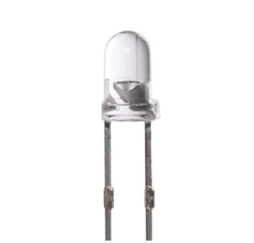

2014年に中国を訪れた際、部品の供給元であるYunSunが親切にも深圳まで迎えに来てくれて、工場を案内してくれた。

## YunSun LED

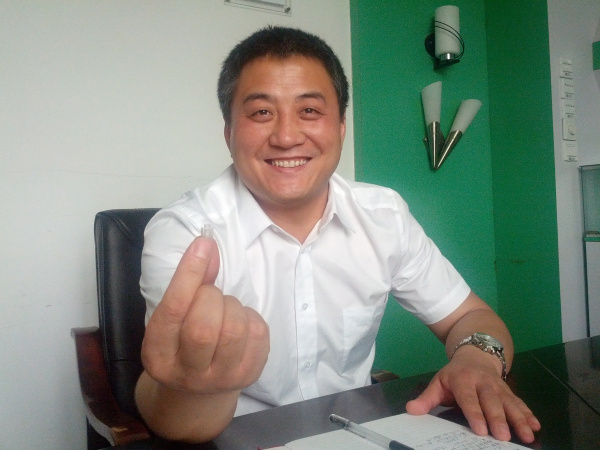

SparkFunは10年以上にわたって[LED](https://www.sparkfun.com/categories/172)を使い、販売してきたが、それがどのように作られているのか、実際に見たことも、きちんと理解したこともなかった。
そこでYunSunの主な窓口であるMerry Xiaoに、ぜひ学びたいと伝えたところ、工場が休みになる*土曜日*にわざわざ見学の機会を設けてくれた。
本当にありがたいことである。

写真に写っているのは、YunSunのオーナーであるMr. Siである。
彼は非常にユーモアのある人物で、写っているのは筆者の妻Alicia Gibbが取り組んでいたプロジェクトを手に持っているところである。
Merryも同行し、通訳を務めてくれた。

## 基本的な部品

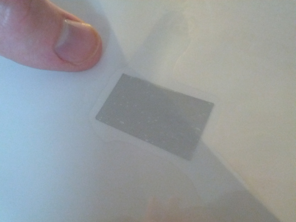

これはLEDダイ（半導体チップ）が並んだシートである。
YunSunは、品質の高い台湾企業からこのダイを仕入れている。
写真の親指の隣にあるのは、*4,000個*のダイである。
このシート1枚のコストはおよそ80元、日本円にして約200円程度である。

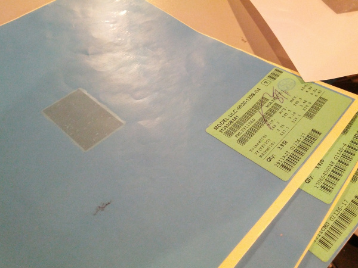

それぞれのシートの角には、そのバッチの特性が記載されている。
この特定のシートに載っているダイは波長がおよそ519nmで、緑色と青緑色のちょうど境目にあたる。
薄いシート3枚で、合計12,000個のLEDがこれから作られようとしている。

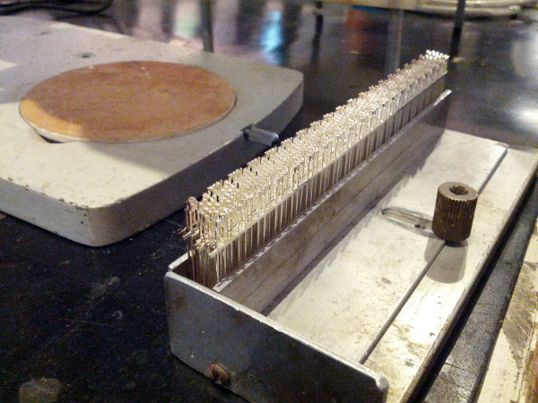

工程は、打ち抜き加工されたリードフレームから始まる。
1枚のフレームには、LED20個分の基本構造が含まれている。
上の写真にはおよそ15枚のフレーム、つまり300個分のLEDが写っている。

## 機械

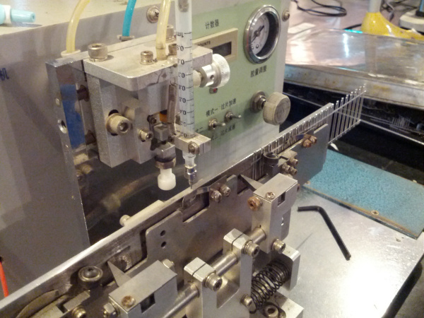

最初の機械は、リードフレームを受け取り、カソード端子の上部にあるカップそれぞれに、少量の接着剤を塗布する。

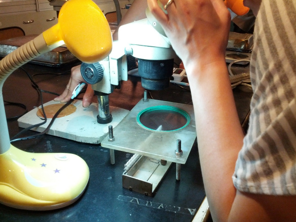

紙のシートに載って出荷されたままの状態では、LEDダイは互いに近すぎて扱うことができない。
そこで、ダイを広げて弱い粘着性を持つフィルムに貼り付ける専用の機械（写真には写っていない）が使われる。
このフィルムはリードフレームの上に吊るされ、上の写真のような状態になる。
作業者は顕微鏡を使ってダイの位置を手作業で合わせ、ピンセットでダイをリードフレームへと押し込む。
リードフレーム側の接着剤のほうが強いため、ダイはそちらに移り、作業者はすぐに次のダイへと進む。
1分間に80個以上、1日あたりおよそ40,000個を位置合わせできるという。

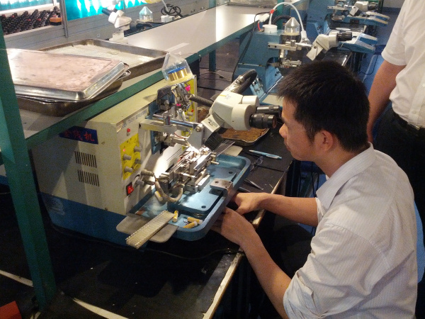

これはLEDのワイヤーボンディング機械である。
LEDダイの上部からアノードのリードへ向けて、髪の毛ほどの太さの金線を接続する。

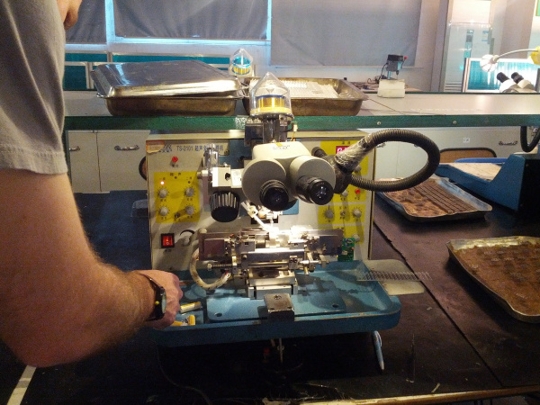

この見学でまず驚かされたことの1つは、作業全体が屋外と変わらない環境で行われていたことである。
シリコンダイの取り扱いにはクリーンルーム技術が必要だと思い込んでいたが、これなら自宅の地下室でもできそうなくらいであった。

以下は、ワイヤーボンディング機械が実際に動作している様子を撮影した動画である。

[LED Wire Bonding Machine（LEDワイヤーボンディング機械）](http://vimeo.com/95591868)

この機械はセットアップにかなりの調整と手間がかかったそうだが、いったん稼働し始めると、コンピュータによる位置合わせなしで自動的に動作する様子は見事であった。

ボンディングされるリードは1本だけであるため、カソード側の接着剤には導電性があるのだろう。
この接着剤は次の工程に進む前に、およそ30分かけて硬化する。

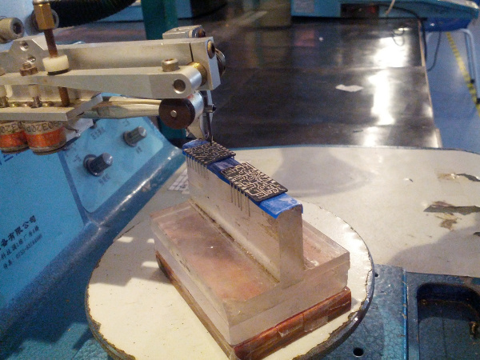

ここでもう1つ意外だったことがある。
これは7セグメントディスプレイである。
てっきり、セグメントの裏側にはそれぞれ通常サイズ（3mm程度）のLEDが入っているものと思い込んでいたが、実際には基板に直接ダイが取り付けられている7セグメント用の基板を見るまで、それが誤りだとは気づかなかった。

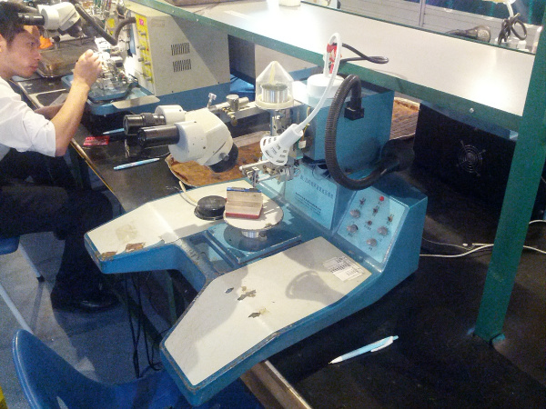

*7セグメント用ボンディング機械を大きく撮影した写真。*

## 成形と検査

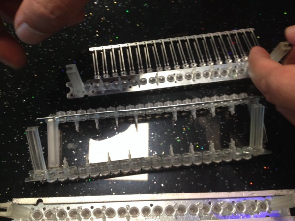

スルーホール型LEDの工程に話を戻すと、ワイヤーボンディングが完了し、接着剤が硬化したあと、リードフレームはLED用の金型にセットされ、周囲にエポキシ樹脂が注入される。

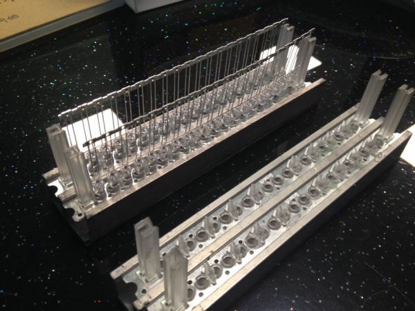

LEDの形を決めているのは、まさにこの金型である。
これも「なるほど」と思わされた瞬間だった。
これまでさまざまな形のLEDを見てきたが、それらはいつもある程度決まった寸法の範囲に収まっていた。
たとえば5mmタイプのLEDで、星形の頭を持つものをあまり見かけないのには理由がある。

1. 金型は、射出成形と同じように、LEDの頭の部分を型から外せなければならない。オーバーハング（庇状の出っ張り）を持つ形状は、型に引っかかって外れなくなってしまう。では2分割の金型ではどうかというと、それは次の理由につながる。
2. LED業界全体が、専門特化した小規模なサプライヤーの集まりによって成り立っている。つまり、シリコンの製造だけを行う会社、リードの製造だけを行う会社、金型の製造だけを行う会社、といった具合に分業されている。工程全体を1社で担っている企業はほとんど存在しないため、YunSunも各サプライヤーが用意している選択肢の中から選ばざるを得ない。筆者らはYunSunに超カスタムで格好いいLEDを作ってほしいと非常に意気込んでいたが、それはほぼ不可能に近い。YunSunだけでなく、変わったサイズのリードフレームやカスタムサイズの金型を用意し、機械のリード間隔を調整し、新しい検査治具と作業手順を作るよう、さらに5社ほどのサプライヤーを説得しなければならないからである。不可能ではないが、想像していたよりもはるかに難しいことだと分かった。

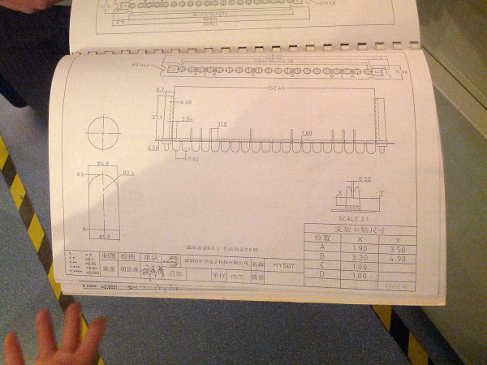

これは、ある金型メーカーのカタログで、実にさまざまな形やサイズが掲載されている。
繰り返しになるが、カスタム形状が不可能というわけではないものの、カタログに載っていない形の場合は、実現がはるかに難しくなる。

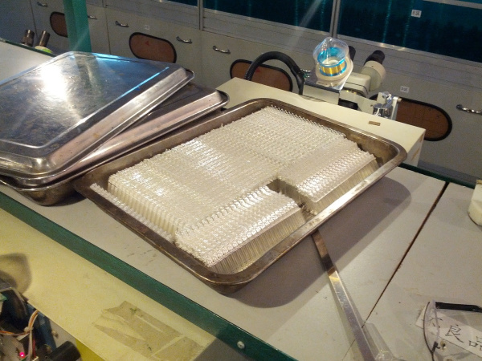

エポキシ樹脂を注入したあと、LEDは45分間焼成されるという。
この時点でLEDを金型から取り出せるようになる。
その後さらに8〜12時間焼成し、エポキシを完全に硬化させる。
硬化を終えたLEDは、上の写真のように大きなバッチにまとめられる。

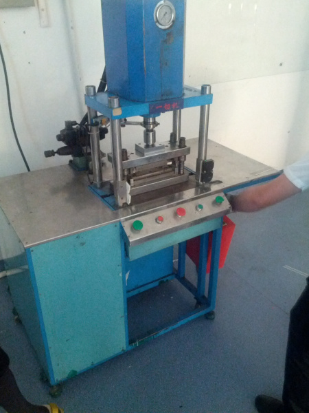

製造工程を支えるため、リードフレームにはアノードとカソードをつなぐ金属片が残されている。
検査の前に、上の写真の機械がこの余分な金属を切り離し、カソードを個別に独立させ、すべてのアノードをまとめてつなげる。
LEDの片方の脚がもう片方より短いのはなぜだろうか。
それは主に、製造工程の自動化や検査をしやすくするためである。
なぜカソード側が短く選ばれたのかといえば、検査の際にロー側（カソード側）を制御するほうが簡単だからだと考えられる。

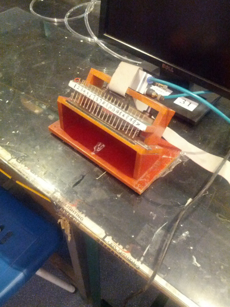

次の工程では、それぞれのLEDが適切な電流値で動作しているかどうかを検査し、確認する。
電流が少なすぎる場合（断線がある場合）や多すぎる場合（短絡がある場合）は、そのLEDは取り除かれる。
この機械は、一連のポゴピンを使ってそれぞれのLEDを個別かつ高速に検査し、結果をコンピュータの画面に表示する。
これは、SparkFunの製品検査のために設計している[ポゴピン式の検査治具](https://learn.sparkfun.com/tutorials/constant-innovation-in-quality-control/all#the-waffle-top)と非常によく似ている。

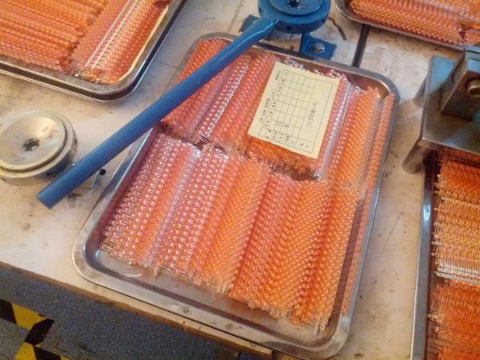

品質検査（QC）に合格したLEDは、さらに別の切断工程を経て、アノードがリードフレームから切り離される。

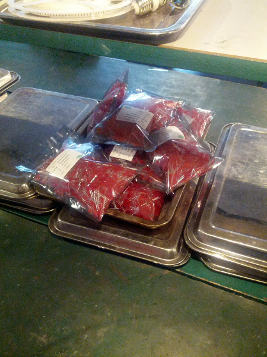

SparkFunのために作られた、大量の[5mm赤色LED](https://www.sparkfun.com/products/9590)である。

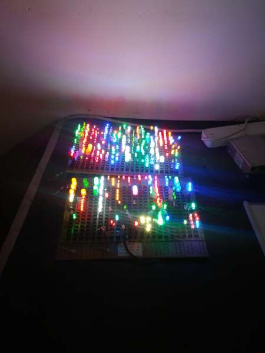

同じ工程を使って、さまざまな形、色、サイズのLEDを作ることができる。

## 工場全体の様子

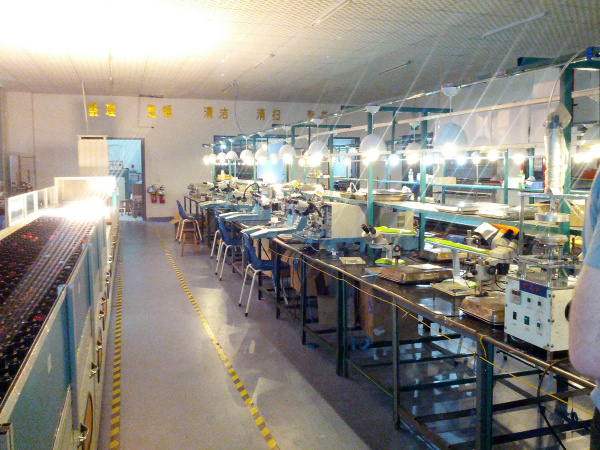

全体として、工場はコンパクトで整然としたレイアウトになっていた。
その日必要とされる形やタイプに応じて使い分けられる、4本のラインが用意されていた。

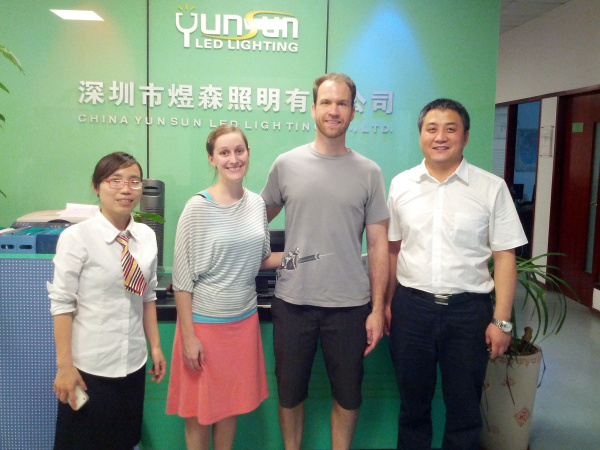

Merry、Alicia、筆者、そしてMr. Siである。
休みの日にもかかわらず工場を案内してくれたYunSunには、心から感謝している。
もしLEDやLED電球が必要になったら、ぜひMerry（merry あっと 100led.com）に連絡してみてほしい。
YunSunは、一緒に仕事をするうえで本当に素晴らしい会社である。

## まとめ

ここまで読んでいただき、ありがとうございました。
このようなチュートリアルの制作には多くの手間がかかっているので、何か学びがあったなら幸いである。

LEDで遊んでみたくなった方には、次のような製品もおすすめである。

- [LED - Assorted（20個入りアソートパック）](https://www.sparkfun.com/products/12062)
- [LED Mixed Bag - 5mm（5mm LEDの詰め合わせ）](https://www.sparkfun.com/products/9881)
- [IR Control Kit Retail（赤外線コントロールキット）](https://www.sparkfun.com/products/11761)：廃盤
- [OpenSegment Serial Display - 20mm（Red）](https://www.sparkfun.com/products/11644)：廃盤
- [NeoPixel Shield - 40 RGB LED Pixel Matrix](https://www.sparkfun.com/products/12663)：廃盤
- [1.0" Single Digit Alphanumeric Display（Red）](https://www.sparkfun.com/products/9934)：廃盤

LEDがどうやって作られているかを読んだところで、次のようなチュートリアルにも興味が湧くかもしれない。

- [発光ダイオード（LED）](./light-emitting-diodes-leds.md)
- [Interactive Hanging LED Display（吊り下げ式インタラクティブLEDディスプレイ）](https://learn.sparkfun.com/tutorials/interactive-hanging-led-array)
- [Das Blinken Top Hat（光る シルクハット）](https://learn.sparkfun.com/tutorials/das-blinken-top-hat)
- [LED Light Bar Hookup Guide（LEDライトバーの使い方）](https://learn.sparkfun.com/tutorials/led-light-bar-hookup)
- [How Lithium Polymer Batteries are Made（リチウムポリマー電池の作られ方）](https://learn.sparkfun.com/tutorials/how-lithium-polymer-batteries-are-made)

タグ: 記事、LED

---

出典：[How LEDs are Made](https://learn.sparkfun.com/tutorials/how-leds-are-made)（SparkFun Learn）を日本語に翻訳し、再構成した。
原文は [CC BY-SA 4.0](https://creativecommons.org/licenses/by-sa/4.0/) ライセンスで公開されており、本ページも同ライセンスの下で提供する。
