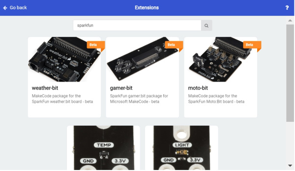
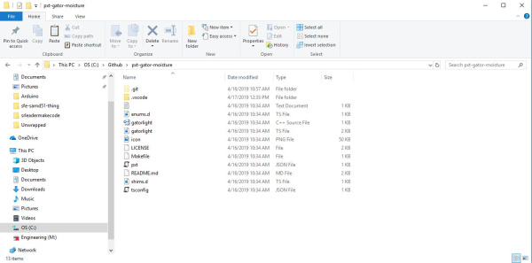
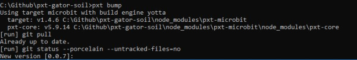
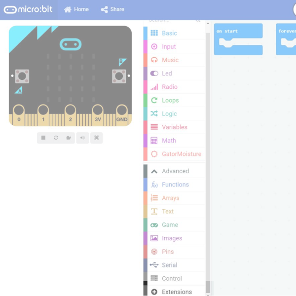
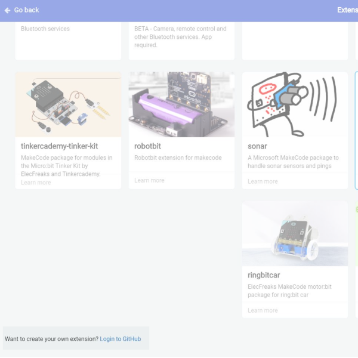

# micro:bit用のMakeCodeパッケージを作る

Microsoft MakeCodeは、コーディングの入門者向けに設計された、ブロックベースのプログラミング言語である。
MakeCodeが優れているのは、構文やデータ型を気にすることなく、アルゴリズム設計で使う基本的な構造や思考プロセスをそのまま体験できる点にある。
内部的には、MakeCodeは[静的型付けのTypeScript](https://makecode.com/language)とJavaScriptをベースにしている。
このチュートリアルでは、既存のSparkFun拡張機能をもとに、[土壌水分センサー](https://www.sparkfun.com/products/13322)用のMakeCode拡張機能を開発する。



*MakeCode for micro:bitにある既存のSparkFun拡張機能の一部*

## 必要なもの

まず、ビルド環境を整える。最初に[Node.js](https://nodejs.org/)をダウンロード・インストールする。

GitHubのアカウントも必要になる。
コマンドプロンプトを開き、GitHubのファイルを保存している場所に移動する（筆者は**C:\**ドライブにGitHubフォルダを作っているので、`C:\GitHub`になる）。
続いて、次のコマンドを実行する。これにより、使用するいくつかのnpmパッケージがインストールされる。

```bash
npm install
npm install jake
npm install typings
```

続いて、PXTのディレクトリをGitHubフォルダにクローンし、先ほどインストールしたnpmパッケージを実行する。
最後にもう一度GitHubフォルダに戻る。これは次のコマンドで行える。

```bash
git clone https://github.com/microsoft/pxt
cd pxt
git checkout
npm install
typings install
jake
cd..
```

続いて、Micro:Bitのターゲットをクローンし、そこにpxtをインストールする。

```bash
git clone https://github.com/Microsoft/pxt-microbit
cd pxt-microbit
npm install -g pxt
npm install
cd..
```

これでプロジェクトのビルドに必要なものはすべて揃ったはずである。
それでは、既存のSparkFun MakeCodeパッケージをクローンし、編集を始めよう。

```bash
git clone https://github.com/sparkfun/pxt-gator-light
```

## 何を変更するか

新しいMakeCodeパッケージ用に、新しいGitHubリポジトリを作成しよう。名前は**pxt-gator-moisture**とする。
このリポジトリをGitHubフォルダにクローンし、**pxt-gator-light**リポジトリの中身をコピーする。
主に見ていくのは、**gatorlight**という名前の2つのファイル、**pxt.JSON**ファイル、**README.MD**、そして最終的には**icon.png**である。



*これらのファイルを変更する必要がある。画像をクリックすると拡大表示できる*

まず、すべてを**gatormoisture**という名前に変更していく。
2つの**gatorlight**ファイルの名前を変更したら、**pxt.json**を開き、**light**という単語をすべて**moisture**に置き換える。
この**.json**ファイルは、MakeCodeにどのファイルを含めるかを伝えるものであり、ファイル名を変更したので、ここでもその変更を反映する必要がある。
バージョン番号を**0.0.1**に戻すことと、説明文をより適切な内容に変更することも忘れないでほしい。
続いて、**gatormoisture**という名前になった2つのファイルを開き、再びlightをmoistureにすべて置き換える。

ここで、ブロックの裏にあるコードが実際にどこにあるかを見てみよう。
ブロックは**.ts**ファイルにあり、実際の関数は**.cpp**にある。
まず**.cpp**を確認しよう。
どのパッケージでも必ず`pxt.h`をインクルードし、`pxt`という名前空間を使う。
続いて、`gatormoisture`という名前空間を作り、与えられたADC値からルクスを計算する関数を置く。
かなりシンプルな関数だが、これを**.ts**ファイルから呼び出せるようになる。これこそが本当にやりたかったことである。

```cpp
#include "pxt.h"
#include <cstdint>
#include <math.h>

using namespace pxt;

namespace gatorMoisture {
    /*
    * Calculates the light in Lux based on the ADC value passed in. 1 step in adcVal is equal to .488 uA or .976 lux at 5V
    */
    //%
    uint16_t getLux(int16_t ADCVal) {
        return ADCVal * .976;
    }

}
```

せっかくなので、`getLux`を、ルクス値ではなく0〜1の間のfloat値を返す`getMoisture`関数に変更しよう。
そのためには、渡された`ADCVal`をADCのフルスケール範囲（1023）で割るだけでよい。
最終的に、**gatormoisture.cpp**は次のようになる。

```cpp
#include "pxt.h"
#include <cstdint>
#include <math.h>

using namespace pxt;

namespace gatorMoisture {
    /*
    * Calculates the light in Lux based on the ADC value passed in. 1 step in adcVal is equal to .488 uA or .976 lux at 5V
    */
    //%
    float getMoisture(int16_t ADCVal) {
        return ADCVal / 1023.0;
    }
}
```

続いて、**.ts**ファイルの中でブロックがどう作られているかを見てみよう。
lightからmoistureへの変更をすべて終えると、次のような内容になっているはずである。

```typescript
enum gatorMoistureType{
    moisture=1,
    adcVal=2,
}

//% color=#f44242 icon="\uf185"
namespace gatorMoisture {

    // Functions for reading moisture from the gatormoisture in moisture or straight adv value

    /**
    * Reads the number
    */
    //% weight=30 blockId="gatorMoisture_moisture" block="Get moisture on pin %pin | in %gatorMoistureType"
    export function moisture(pin: AnalogPin, type: gatorMoistureType): number{
        let ADCVal = pins.analogReadPin(pin)
        switch(type){
            case gatorMoistureType.moisture: return getMoisture(ADCVal)
            case gatorMoistureType.adcVal: return ADCVal
            default: return -11111111
        }
    }

    /**
     * Function used for simulator, actual implementation is in gatormoisture.cpp
     */
    //% shim=gatorMoisture::getMoisture
    function getMoisture(ADCVal: number) {
        // Fake function for simulator
        return 0
    }
}
```

ブロックにドロップダウンで選択肢を持たせたい場合は、enumを使ってそれを作る。
今回は、moisture（0〜1の間の値）か、生のadcValのどちらかを選べるようにする。
そこで、名前空間の外側で、可能なデータ型に対応する次のようなenumを作成する。

```typescript
enum gatorMoistureType{
    moisture=1,
    adcVal=2,
}
```

続いて、この拡張機能の色とアイコンを選ぶ必要がある。これは名前空間を宣言する直前の行で行う。
色は6桁の16進数値であれば何でもよく、アイコンは[FontAwesome](https://fontawesome.com/icons?from=io)アイコンライブラリの識別子を使う。
色とアイコンの宣言は次のようになる。

```typescript
//% color=#f44242 icon="\uf185"
```

続いて、自分のブロックがどんな見た目になり、他のブロックとの相対的な位置がどうなるかを定義する必要がある。
これは**weight**、**blockId**、**block**を設定することで行う。
weightが100のブロックは、weightが100未満のブロックより上に、100より大きいブロックより下に一覧表示される。
これにより、すべてのブロックをどの順序で並べたいかを自分で決められる。
blockIdは**必ず**`mynamespacetitle_functionTitle`という形式にする必要があるため、`gatorMoisture`名前空間にある`moisture`ブロックの場合、blockIdは`gatorMoisture_moisture`になる。
最後に、`block`文字列を使って、ブロックのテキストに実際に何を表示するかを決める。
ドロップダウンにしたい変数の前には`%`を付ける。
次のコードは、ピン選択用のドロップダウンと、**moisture**と**adcVal**を選べるドロップダウンを持つブロックを作る。
このブロックは、ドロップダウンで選択された引数を使って`moisture`関数を呼び出す。

```typescript
//% weight=30 blockId="gatorMoisture_moisture" block="Get moisture on pin %pin | in %gatorMoistureType"
```

最後に、実際にピンを読み取る関数を書く必要がある。
`export`として宣言された関数は、MakeCode上でブロックとして表示される。
この関数の引数は、ドロップダウンで選択できるようにと宣言した変数になり、通常は型に応じたswitch文を用意し、選択された型ごとに適切な値を返すようにする必要がある。
型が`moisture`のとき、**.cpp**に含まれる関数である`getMoisture`をどう呼び出しているかに注目してほしい。
また、この関数が何を返すかも宣言しなければならない。今回の場合は数値である。

```typescript
export function moisture(pin: AnalogPin, type: gatorMoistureType): number{
    let ADCVal = pins.analogReadPin(pin)
    switch(type){
        case gatorMoistureType.moisture: return getMoisture(ADCVal)
        case gatorMoistureType.adcVal: return ADCVal
        default: return -11111111
    }
}
```

**.cpp**にある関数はどれも、シミュレータ用のダミー関数が必要になる。
`getMoisture`関数に対応するダミー関数は次のように作成する。
`export`されていないため、MakeCode上には表示されない点に注目してほしい。

```typescript
//% shim=gatorMoisture::getMoisture
function getMoisture(ADCVal: number) {
    // Fake function for simulator
    return 0
}
```

最後に、`README`の末尾部分（49行目）を、自分の名前空間とそれに続くGitHubのアドレスに変更する必要がある。
`gatorMoisture=github:sparkfun/pxt-gator-soil`のような形になり、これによりこのパッケージがMakeCode拡張機能として認識されるようになる。

## コードをコンパイルする

これですべてのコードを書き終えたので、いよいよコンパイルしてテストする番である。
コマンドプロンプトウィンドウを開き、自分のMakeCodeパッケージがあるディレクトリに移動する。
そこで、次のコマンドを実行し、コードをビルドするのに必要なPXTツールをリンク・インストールする。

```bash
npm install
npm install typings
npm install jake
npm link ../pxt
pxt target microbit
pxt install
```

続いて、コードをビルドし、変更内容をコミットしてGitHubにプッシュする。

```bash
pxt build
git add -A
git commit -m "changing names to gator:moisture"
pxt bump
```

`pxt bump`コマンドを実行すると、リリースにタグ付けするバージョン番号の入力を求められる。
提示されたバージョン以上の番号を入力すればよい。
このコマンドは、コミットにタグを付け、リリースとしてGitHubにプッシュする。



*PXT Bump*

## テストして、やり直して、また試す

コードをテストするため、[MakeCodeのウェブサイト](https://makecode.microbit.org/#editor)を開き、extensionsまで移動する。



*Extensions*

そこから、トークンを使ってGitHubにログインする。
`login to GitHub`をクリックした際の指示に従うだけでよい。



*GitHubにログインする*

ログインしたら、GitHubリポジトリのURLをextensionの検索バーに貼り付け、表示された結果をクリックして取り込む。
結果が表示されない場合は、リポジトリが公開（public）になっているか確認してほしい。

拡張機能を取り込んだら、そのさまざまな機能を確認し、必要に応じてコードを編集して、満足のいくまでGitHubに再アップロードしてみてほしい。

## まとめ・参考資料

最終的には、この拡張機能をMicrosoftに承認してもらいたくなるはずである。
[MakeCode extension approval checklist](https://support.microbit.org/support/solutions/articles/19000054952-makecode-extension-approval)を必ず確認してほしい。
続いて、[こちらのフォーム](https://form.jotformeu.com/90075019358357)に記入し、パッケージの承認を申請する。

その他の参考資料も紹介する。

- [Node.js](https://nodejs.org/)
- [MakeCode Docs > Technical Docs > Programming Language](https://makecode.com/language)
- [MakeCode Help & Support: MakeCode Extension approval](https://support.microbit.org/support/solutions/articles/19000054952-makecode-extension-approval)
- [MakeCode for micro:bit Extension Approval Form](https://form.jotformeu.com/90075019358357)
- [Microsoft MakeCode](https://makecode.microbit.org/#editor)

タグ: GitHub、MakeCode、micro:bit、プログラミング、pxt

---

出典：[How to Create a MakeCode Package for Micro:Bit](https://learn.sparkfun.com/tutorials/how-to-create-a-makecode-package-for-microbit)（SparkFun Learn）を日本語に翻訳し、再構成した。
原文は [CC BY-SA 4.0](https://creativecommons.org/licenses/by-sa/4.0/) ライセンスで公開されており、本ページも同ライセンスの下で提供する。
