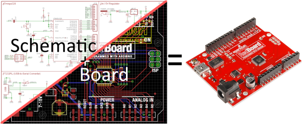
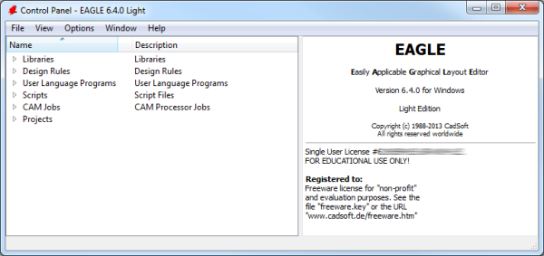
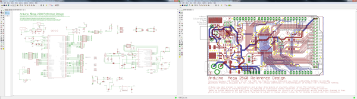
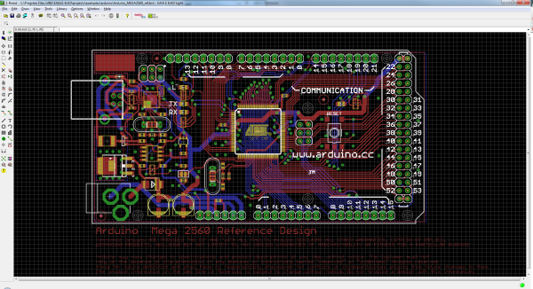

# PCB設計ツールEagleの使い方

プリント基板（PCB）は、あらゆる電子ガジェットの背骨とも言える存在である。
マイクロプロセッサのような華やかさはなく、抵抗器のようにありふれてもいないが、回路の中のすべての部品を正しくつなぎ合わせるためには欠かせない存在である。

SparkFunでは、PCBの設計が大好きである。
その愛を広めたいと思っている。
これは、あらゆるレベルの電子工作愛好家にとって役立つスキルである。
このチュートリアルとそれに続くシリーズでは、私たちがすべてのPCBを設計するのに使っているのと同じソフトウェアであるEAGLEを使って、PCBを設計する方法を解説していく。

この最初のチュートリアルでは、ソフトウェアのインストール方法と、インターフェースやサポートファイルを自分好みに調整する方法を扱う。

## なぜEAGLEなのか

EAGLEは、数あるPCB CADソフトウェアのひとつにすぎない。
では「EAGLEの何がそんなに特別なのか」と思うかもしれない。
私たちが特にEAGLEを気に入っている理由は、次のとおりである。

- **クロスプラットフォーム**：EAGLEはWindows、Mac、さらにはLinuxまで、あらゆる環境で動作する。これは、他の多くのPCB設計ソフトウェアにはあまりない特徴である。
- **軽量**：EAGLEは、PCB設計ソフトウェアの中でもかなりスリムな部類に入る。必要なディスク容量はおよそ50〜200MB程度である（より高度なツールでは10GB以上必要になることもある）。インストーラー自体もおよそ25MBしかない。そのため、ダウンロードからインストール、実際にPCBを作り始めるまで、あっという間である。
- **無料または低コスト**：EAGLEのフリーウェア版は、SparkFunのカタログにあるほぼすべてのPCBを設計できるだけの機能を備えている。上位のライセンスにアップグレードする場合（自分の設計で利益を得たい場合）も、多くのハイエンドツールに比べて2桁は安く済む。
- **コミュニティのサポート**：こうした理由から、EAGLEはホビイストのコミュニティにおけるPCB設計の定番ツールのひとつになっている。Arduino基板の設計を研究したい場合でも、人気のセンサーを自分の設計に取り込みたい場合でも、たいてい誰かがすでにEAGLEでそれを作り、共有してくれている。

もちろん、EAGLEにも弱点はある。
より高機能なPCB設計ツールの中には、より優れた自動配線機能や、シミュレータ、プログラマー、3Dビューアといった気の利いた道具を備えたものもある。
とはいえ私たちにとっては、EAGLEは初級から中級レベルのPCBを設計するのに必要なものをすべて備えている。
これまでPCBを設計したことがないなら、始めるのにうってつけのツールである。

参考になるチュートリアル:

この沼にはまる前に、次のようなチュートリアルや概念に慣れておくとよい。

- [PCB基板の基礎](./pcb-basics.md)
- [回路図の読み方](./how-to-read-a-schematic.md)
- [電圧、電流、抵抗とオームの法則](./voltage-current-resistance-and-ohms-law.md)

## ダウンロード、インストール、起動

EAGLEはAutodeskから提供されており、[Fusion 360](https://www.autodesk.com/products/fusion-360/overview)ソフトウェアパッケージの一部として、あるいはEAGLE単体の無料版として入手できる。
自分のOSに合ったバージョンを入手しよう（Windows、Mac、Linux向けが用意されている）。
ダウンロードサイズは比較的軽く、およそ125MBほどである。

EAGLEのインストールは、たいていのソフトウェアと同じである。
ダウンロードされるのは実行ファイルであり、それを開いてインストール手順に従うだけでよい。

### EAGLEのライセンスについて

EAGLEのお気に入りの点のひとつは、**無料**で使えるということである。
無料版はホビイスト向けの制限付きバージョンで、個人が*個人的*かつ*非営利*の目的で利用できる「パーソナルラーニングライセンス」となっている。
無料版を使う際に知っておくべき制限がいくつかある。

- PCBの設計面積は最大80cm²（12.4平方インチ）までに制限されているが、これでもかなり大きい。大きめのArduinoシールドを設計する場合でも、余裕でこの上限を下回るはずである。
- 使用できる信号層は2層まで。それ以上のレイヤーが必要な場合は、シングルユーザーのFusion 360ライセンスへのアップグレードを検討するとよい。
- 回路図エディタで使えるシートは2枚まで。
- パーソナルラーニングライセンスは、個人による*個人的*かつ*非営利*の利用に限られる。自分の設計を販売するつもりであれば、Fusion 360ライセンスに含まれるシングルユーザーEAGLEライセンスを確認する必要がある。

こうした制限があっても、EAGLEは依然として素晴らしいソフトウェアである。
SparkFunのエンジニアたちも、あの非営利という制約さえなければ、フリーウェア版だけで自分たちの基板の99%を設計できるだろう。
自動配線機能を含め、EAGLEソフトウェアのすべての機能に無料版でもアクセスできる。

## コントロールパネルを探索する

初めてEAGLEを開くと、**コントロールパネル**という画面が表示されるはずである。
コントロールパネルはEAGLEの「本拠地」であり、ソフトウェア内の他のすべてのモジュールをここから開くことができる。

コントロールパネルには6つのツリーがあり、それぞれソフトウェアの異なる機能を表している。

- **ライブラリ**：ライブラリには部品が保存されている。部品とは、回路図記号とPCBフットプリントの組み合わせのことである。ライブラリにはたいてい関連する部品のグループが含まれており、たとえば`atmel.lbr`にはAtmel社のAVRデバイスが数多く収められており、`74xx-us.lbr`ライブラリにはほぼすべてのTTL 74xxシリーズのICが収められている。
- **デザインルール（DRU）**：デザインルールとは、基板の設計データを製造業者に送る前に満たしておくべき一連のルールである。このツリーには、あらかじめ定義されたルールの集合であるDRUファイルが収められている。
- **ユーザー言語プログラム（ULP）**：ULPは、EAGLEのユーザー言語で書かれたスクリプトである。部品表の生成（`bom.ulp`）や、画像のインポート（`import-bmp.ulp`）といった作業を自動化するのに使える。
- **スクリプト（SCR）**：スクリプトファイルは、EAGLEのユーザーインターフェースをカスタマイズするのに使える。ワンクリックで配色やキー割り当てを設定できる。
- **CAMジョブ（CAM）**：CAMジョブは、ガーバーファイルの作成を助けるCAMプロセッサで開くことができる。
- **プロジェクト**：それぞれのプロジェクトが1つのプロジェクトフォルダにまとめられている場所である。プロジェクトには回路図、基板設計、場合によってはガーバーファイルが含まれる。

ツリーの中のファイルを選択すると、ウィンドウの右側にそのファイルについての情報が表示される。
これは、ライブラリやプロジェクトの設計例（EAGLEには楽しいサンプルがいくつか同梱されている）を探索したり、スクリプトの目的を大まかに把握したりするのに便利な方法である。

## SparkFunのライブラリを使う

EAGLEには、コントロールパネルから確認できる充実した部品ライブラリのリストが同梱されている。
何百ものライブラリがあり、抵抗器やNPNトランジスタのような特定の部品に特化したものもあれば、特定のメーカーに特化したものもある。
これは素晴らしいリソースだが、少々圧倒されてしまうこともある。
単純なスルーホール型の電解コンデンサを1つ追加したいだけでも、正しいものを見つけるために何十ものライブラリや部品をふるいにかける必要がある。

デフォルトの何百ものライブラリを使う代わりに、SparkFun EAGLEライブラリを使うという方法もある。
これは、SparkFun自身の設計で実際に使用した部品だけに絞り込んだライブラリであり、新しく見つけた部品が発見されるたびに継続的に更新されている。

デフォルトのライブラリの代わりに（あるいは追加で）SparkFunのライブラリをインストールして使う方法を紹介する。

### ステップ1：SparkFunライブラリをダウンロードする

最新版のライブラリは、常にGitHubリポジトリで公開されている。
GitHubの使い方について助けが必要な場合は、Using GitHubのチュートリアルを参考にしてほしい。
基本的には、リポジトリのメインページで**「Download ZIP」をクリックする**だけでよい。

ZIPファイルを分かりやすい場所に保存し、フォルダを展開する（場所を忘れないように）。

### ステップ2：ディレクトリウィンドウを更新する

EAGLEのコントロールパネルウィンドウに戻り、**「Options」メニュー**から**「Directories」を選択する**。
これは、EAGLEがライブラリを含む6つのツリーの内容を表示する際に参照する、コンピュータ上のディレクトリの一覧である。

「Libraries」ボックスに、SparkFun EAGLEライブラリが保存されているディレクトリへのリンクを追加する。
デフォルトのライブラリを残したままSparkFunのライブラリを追加したい場合は、「$EAGLEDIR\lbr」の後ろにセミコロン（;）を追加し、その後にSparkFun EAGLEライブラリのディレクトリのパスを貼り付ける。

> [!NOTE]
> MacとLinuxのユーザーは、セミコロンの代わりに**コロン**（:）でディレクトリを区切ること。

### ステップ3：ライブラリを「使用する」

コントロールパネルの「Libraries」ツリーに戻ると、2つのフォルダが表示されているはずで、そのうちの1つがSparkFun EAGLEライブラリになっているはずである。
最後の手順は、（少なくとも今のところは）デフォルトのライブラリを使わないようEAGLEに伝えることである。
そのためには、「lbr」フォルダを右クリックし、**「Use none」** を選択する。

次に、「SparkFun-Eagle-Libraries-master」フォルダを右クリックし、**「Use all」** を選択する。
それぞれのフォルダ内のライブラリを確認すると、隣に灰色または緑色の点が表示されているはずである。
緑色の点はそのライブラリが使用中であることを、灰色の点は使用されていないことを示す。

自分で作ったライブラリの部品をSparkFunのEAGLEライブラリに追加してもらいたい場合は、専用のチュートリアルを参照してほしい。

## プロジェクトを開いて探索する

EAGLEには、いくつかの気の利いたPCB設計のサンプルが同梱されている。
「Projects」ツリーを展開し、そこから「examples」フォルダの中の「arduino」プロジェクトを、赤いフォルダをダブルクリックして開いてみよう（あるいは右クリックして「Open project」を選択する）。
この画面では、プロジェクトフォルダは赤色で、通常のフォルダは標準の黄色で表示されることに注意してほしい。

プロジェクトを開くと、さらに2つのEAGLEウィンドウが立ち上がるはずである。基板エディタと回路図エディタである。
これらはEAGLEにおける陰と陽のような関係にあり、機能するPCB設計という完成品を作るために、両方を組み合わせて使う必要がある。

**回路図エディタ**（上の画像の左側）は、緑色のネット（配線）で相互に接続された、赤色の回路記号の集まりである。
プロジェクトの回路図は、プログラムのコードにおけるコメントのようなものである。
その基板設計が実際に何をするのかを説明するのに役立つが、最終製品そのものにはあまり影響を与えない。
回路図の中の部品は正確な寸法で配置されているわけではなく、あなたや他の人がその基板設計で何が起きているかを理解しやすいように、読みやすい形で配置され、接続されている。

**基板エディタ**では、実際の魔法が起きる。
ここでは色分けされた層が重なり合い、交差しながら、正確な寸法のPCB設計が作られていく。
2つの銅層（上が赤、下が青）は、異なる信号どうしが交差してショートしないよう、戦略的に配線される。
黄色い円（この設計では黄色だが、たいていは緑色）は「ビア」と呼ばれ、信号を片面からもう片面へと通す役割を持つ。
より大きなビアは、スルーホール部品を挿入してはんだ付けできるようにするためのものである。
このほかにも、現時点では隠れている層があり、部品をはんだ付けできるように銅を露出させている。

### 両方のウィンドウを開いたままにしておくこと

これら2つのウィンドウは、互いに連携して動作する。
回路図に加えた変更は、自動的に基板エディタにも反映される。
設計を修正する際は、**常に両方のウィンドウを開いたままにしておく**ことが重要である。

たとえば、基板ウィンドウを閉じたまま回路図を修正し続けたとしよう。
回路図に加えた変更は、基板設計には反映されない。
これはよくない事態である。
回路図と基板設計は、常に一致していなければならない。
あとから整合性を取り戻そうとして変更をさかのぼるのは、非常に骨の折れる作業である。
**常に両方のウィンドウを開いたままにしておこう**。

ウィンドウ間の整合性が取れていないかどうかを見分ける方法がいくつかある。
まず、両方のウィンドウの右下隅に「ドット」がある。
このドットが緑色であれば問題ない。
マゼンタ色であれば、閉じるべきでないウィンドウが閉じられている可能性が高い。
もうひとつ、より分かりやすいサインとして、どちらか一方のウィンドウを閉じると、もう一方に大きな警告が表示される。
この警告が表示されたら、すぐに作業を止めて、閉じてしまったウィンドウを開き直そう。
基板エディタや回路図エディタのウィンドウを再度開く簡単な方法は、「Switch to board/schematic」アイコンをクリックすることである（「File」メニューの中にもある）。

### 画面の操作方法

見過ごされがちな話題だが、これら2つのウィンドウの中をどう操作するかを知っておくことは重要である。

エディタウィンドウの中を移動するには、**スクロールホイール付きのマウス**が非常に役立つ。
ホイールを前後に回すことで拡大したり縮小したりできる。
ホイールを押し込んだままマウスを動かすと、画面をドラッグして動かせる。
3ボタンマウスがない場合は、表示オプションを使ってエディタ内を移動する必要がある。
これらのツールはツールバー上部の中央付近、あるいは「View」メニューの中にある。
拡大や縮小のツールはもちろん便利であり、選択範囲に合わせて表示を変える「Zoom select」ツールも便利である。
とはいえ、本気でEAGLEを使うつもりなら、やはりマウスを用意することをおすすめする。

## UIを設定する

EAGLEのユーザーインターフェースは非常に細かくカスタマイズできる。
背景色からレイヤーの色、キー割り当てまで、好みに合わせて変更できる。
インターフェースを自分好みに調整しておくと、PCBの設計がずっと楽になる。
ここでは、SparkFunで好んで行っているUIのカスタマイズ方法を紹介する。
これらの手順は必須ではなく、自分の好みに合わせてUIをカスタマイズしてかまわない。
あくまで私たちが慣れ親しんでいる設定にすぎない。

### 背景色を設定する

私たちがいつも最初に行うUIの調整は、基板エディタの背景色である。
標準の白い背景は、基板設計に必要なさまざまな色のレイヤーとあまり相性がよくないことが多い。
そのため、たいてい黒い背景を選んでいる。

背景色を変更するには、「Options」メニューから「User interface」を選択する。
「Layout」ボックスの中で、背景を黒、白、あるいは特定の色に設定できる。
このボックスには他にも設定項目があるが、ソフトウェアにもう少し慣れるまでは、あまり手を加えないほうがよいかもしれない。

### グリッドを調整する

基板エディタでもうひとつよく行うUI改善が、グリッドを表示することである。
PCB設計では寸法とサイズが非常に重要であるため、サイズを視覚的に確認できる目印があると非常に役立つ。
グリッド表示を有効にするには、基板ウィンドウの左上付近にあるアイコンをクリックする（あるいは「View」メニューから「Grid」を選択する）。

「Display」のラジオボタンを「On」に切り替える。
また、「Size」を100mil（0.1インチ）、「Alt」を50mil（0.05インチ）に設定して、グリッドの目を少し粗くしておくとよい。

### スクリプトを実行する

スクリプトを使えば、インターフェースをもっと手早く設定できる。
ボタンを1回クリックするだけで、色やキー割り当てをすべて自動的に設定できる。
スクリプトファイルは共有することもでき、誰でも実行できる。
SparkFunのEAGLEスクリプトを実行すれば、私たちとまったく同じUIになる。

まず、専用のスクリプト（ZIPフォルダに入っている）をダウンロードする。
`spk.scr`ファイルを、あとで分かりやすい場所に展開する。

次に、そのスクリプトを実行する。
基板ウィンドウでScriptアイコンをクリックする（あるいは「File」から「Execute Script」を選択する）。
ファイルブラウザで、先ほどダウンロードして展開した`spk.scr`ファイルを選択する。

これで、次のような配色に自動的に設定されるはずである。

このUI設定は、レイヤーを見やすく論理的に表示してくれる。
重要な銅の層は非常に見やすく、かつ区別しやすい色になっており（上が赤、下が青、ビアが緑）、シルクスクリーンはたいていのPCB設計と同じように白になっている。

これらの色分けされたレイヤーの意味は、EAGLEを使い続けて探索していくうちに、より理解が深まっていくはずである。

### SparkFunのカスタムEagle設定

SparkFunの最新のスクリプトやその他の便利なファイルは、GitHub上のEAGLE設定リポジトリで公開されている。

## まとめ

EAGLEのセットアップが終わり、いよいよPCBの設計を始めたくてうずうずしているなら、次はEAGLEの使い方を扱う2部構成のチュートリアル、[Using EAGLE: Schematic](https://learn.sparkfun.com/tutorials/using-eagle-schematic/all)と[Using EAGLE: Board Layout](https://learn.sparkfun.com/tutorials/using-eagle-board-layout/all)に進むとよい。
この2つのチュートリアルでは、回路図の設計から、基板のレイアウトと配線、ガーバーファイルの生成、製造業者への送付までの流れを説明している。

このほかにも、EAGLEシリーズの次のようなチュートリアルがある（いずれも英語）。

- [How to Create SMD PCBs](https://learn.sparkfun.com/tutorials/designing-pcbs-advanced-smd/all)（SMD PCBの作り方）：論理的にはPTH（スルーホール）のEAGLEチュートリアルの次に読むとよい内容である。もう少し高度で、テンポも速い。
- [How to Create SMD Footprints](https://learn.sparkfun.com/tutorials/designing-pcbs-smd-footprints/all)（SMDフットプリントの作り方）：ライブラリの中に独自の部品を作りたい場合は、このチュートリアルを確認してほしい。
- [Making Custom Footprints in EAGLE](https://learn.sparkfun.com/tutorials/making-custom-footprints-in-eagle/all)（EAGLEでカスタムフットプリントを作る）：もうひとつのフットプリント作成チュートリアルで、独自の1:1フットプリントを作るための特有の手順を詳しく解説している。

タグ: Eagle、スキル、プロジェクトを始める

---

出典：[How to Install and Setup EAGLE](https://learn.sparkfun.com/tutorials/how-to-install-and-setup-eagle)（SparkFun Learn）を日本語に翻訳し、再構成した。
原文は [CC BY-SA 4.0](https://creativecommons.org/licenses/by-sa/4.0/) ライセンスで公開されており、本ページも同ライセンスの下で提供する。
