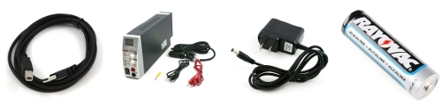
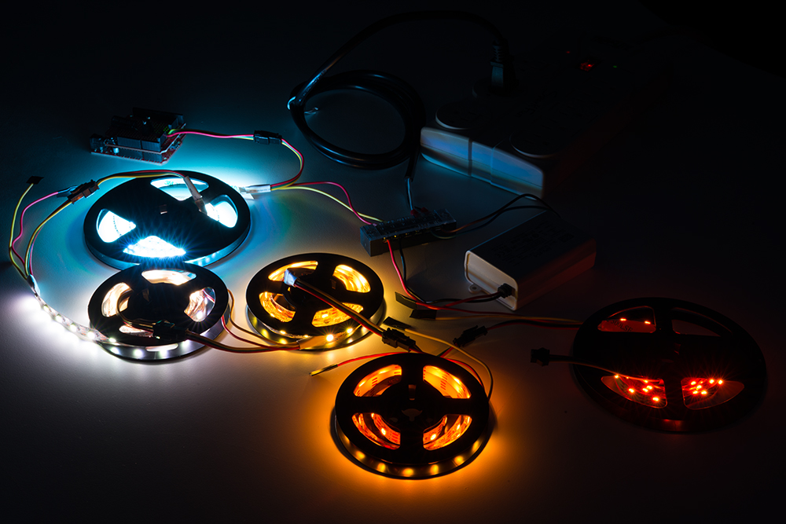
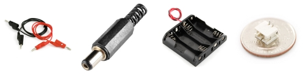
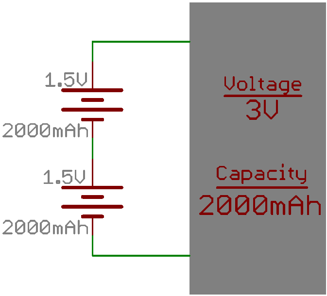
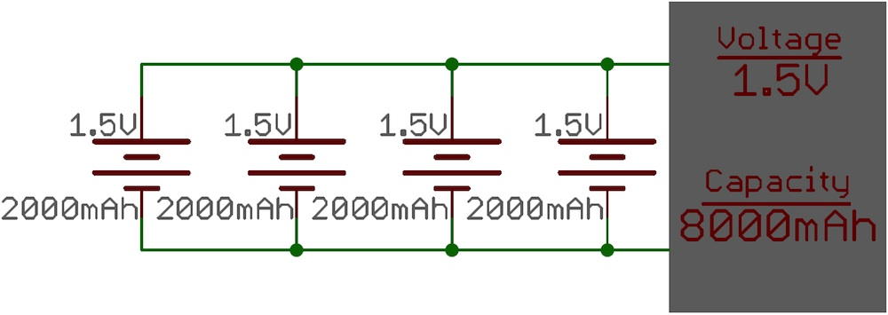
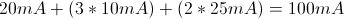
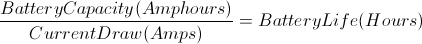
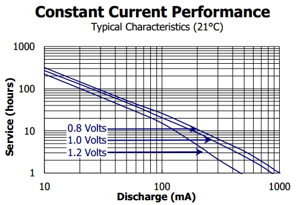

# プロジェクトへの電源供給

このチュートリアルでは、電子工作プロジェクトに電源を供給するさまざまな方法を紹介する。
検討すべき電圧や電流の考え方についても解説する。
また、プロジェクトが持ち運び可能だったり、遠隔地に置かれたりする場合、つまり壁のコンセントのそばに置けない場合に必要となる追加の検討事項についても触れる。

はじめて電子工作プロジェクトに取り組むのであれば、このチュートリアルを読み進めるか、あるいは選んだプロジェクトや開発ボードで推奨されている電源をそのまま使うという選択肢もある。
[SparkFun Inventor's Kit](http://www.sparkfun.com/products/11227)にはUSBケーブルが同梱されており、キット内のすべてのプロジェクトはもちろん、より高度なプロジェクトの多くにも十分対応できる。
迷っているなら、まずはこのキットから始めるのがよい。

参考になるチュートリアル:

- [電圧、電流、抵抗とオームの法則](./voltage-current-resistance-and-ohms-law.md)
- [電力](./electric-power.md)
- [電池の技術](./battery-technologies.md)
- [コネクタの基礎](./connector-basics.md)
- [テスターの使い方](./how-to-use-a-multimeter.md)
- [Voltage Regulators（電圧レギュレータ）](https://learn.sparkfun.com/tutorials/voltage-regulators)
- [直列回路と並列回路](./series-and-parallel-circuits.md)

## プロジェクトへの電源供給の方法

プロジェクトに電源を供給するもっとも一般的な方法には、次のようなものがある。

- USB電源
- 可変DCベンチトップ電源
- AC-DCウォールアダプタ（パソコンやノートパソコンで使われるようなもの）
- 電池



### どの方法を選べばよいか

この問いへの答えは、プロジェクトごとの要件に大きく左右される。

#### USB電源

[SparkFun Inventor's Kit](http://www.sparkfun.com/products/11227)や、その他の基本的な開発ボードから始めるのであれば、たいていはUSBケーブルだけで十分である。
[Arduino Uno](http://www.sparkfun.com/products/11021)は、キット内のサンプル回路を動かすのに[USB A-Bケーブル](http://www.sparkfun.com/products/512)しか必要としない例のひとつである。

#### 可変DCベンチトップ電源

継続的にプロジェクトを製作したり回路をテストしたりする仕事をしているなら、[可変DCベンチトップ電源](http://www.sparkfun.com/products/9291)を用意することを強くおすすめする。
プロジェクトに応じて電圧を特定の値に設定できるほか、最大許容電流も設定できるため、ある程度の保護にもなる。
プロジェクト内で[短絡（ショート）](./what-is-a-circuit.md)が起きた場合、ベンチ電源が停止することで、部品への被害を防げる可能性がある。

#### AC-DCウォールアダプタ

回路の動作確認が済んだあとは、専用の[AC-DC電源](http://www.sparkfun.com/products/298)がよく使われる。
同じ開発ボードを何度もプロジェクトで使い回す場合にも、この選択肢は優れている。
ウォールアダプタはたいてい決まった電圧と電流を出力するため、電源を供給したいプロジェクトの仕様に合ったアダプタを選び、その仕様を超えないようにすることが重要である。

#### 電池

プロジェクトを持ち運びできるようにしたい場合や、電力網から電源を取れない遠隔地に設置したい場合は、電池が解決策になる。
電池には非常に多くの種類があるため、どれを選ぶべきかはこのチュートリアルの後半で詳しく扱う。
よく選ばれるものとして、アルカリ電池、充電式のニッケル水素単3形、リチウムポリマー電池などがある。

プロジェクトに特定の電圧や、もう少し多くの電流が必要な場合は、ブーストコンバータやスイッチングレギュレータを追加するとよい。
電池から得られる変動する電圧を、5Vなどの一定の電圧に変換して出力できる。
使用するボードや部品によっては、構成次第で9Vや10Vを出力することも可能である。
5Vより高い電圧を出力するには、そのために必要な部品を揃えて回路を組む必要がある。

## 電圧と電流の検討事項

### プロジェクトXにはどのくらいの電圧が必要か

これは回路によって大きく異なるため、簡単には答えられない問いである。
とはいえ、Arduino Unoのようなたいていのマイクロプロセッサ開発ボードには、オンボードの電圧レギュレータが搭載されている。
これにより、レギュレータが出力する電圧より高い、特定の範囲内の電圧を供給できるようになっている。
開発ボード上の多くのマイクロプロセッサやICは3.3Vや5Vで動作するが、電圧レギュレータ自体は6V〜12V程度まで対応できることが多い。

電源から得られた電力は電圧レギュレータによって細かく調整され、電流の消費量が変動する場面でも各チップに一定の電圧が供給されるようになっている。
SparkFunでは、3.3V〜5V系で動作する製品の多くに[9V電源](http://www.sparkfun.com/products/298)を使っている。
ただし、どの電圧が安全かを確認するには、開発ボードに搭載されている電圧レギュレータのデータシートを見て、メーカーが推奨する電圧範囲を確認することをおすすめする。

### プロジェクトXにはどのくらいの電流が必要か

この問いも、使用する開発ボードやマイクロプロセッサ、そしてそこに接続する回路によって変わってくる。
電源がプロジェクトの必要とする電力を供給しきれない場合、回路が不安定で予測できない動作をすることがある。
これは**ブラウンアウト**とも呼ばれる。

電圧の場合と同様に、データシートを確認し、回路の各部分が必要とする電流を見積もっておくことをおすすめする。
また、必要な電流を少なめに見積もるよりも、多めに見積もっておくほうが良い習慣である。
モーターや大量の[LED](./button-and-switch-basics.md)など、大きな電流を必要とする要素が回路に含まれる場合は、大容量の電源が必要になったり、マイクロプロセッサ用とモーター用で電源を分ける必要が出てきたりすることもある。
そうしないと、電力の落ち込みによってマイクロプロセッサがリセットしてしまったり、モーターの出力が足りなくなったり、LEDが十分な明るさで点灯しなくなったりすることがある。
電流に余裕のある電源を選び、足りなくなるよりは余らせるほうが、常に得策である。



### プロジェクトが消費する電流が分からない場合

しばらく回路を扱っていれば、プロジェクトに必要な電流量を見積もるのも徐々に簡単になってくる。
とはいえ、実験的に電流を調べる一般的な方法としては、電流の読み取り機能を備えた可変DCベンチトップ電源を使うか、[テスター](./how-to-use-a-multimeter.md)を使って動作中の回路に流れる電流を測定するという方法がある。
これにより、プロジェクトにどのような電源を選べばよいか、おおまかな見当がつく。

テスターでの電流の測り方が分からない場合は、[テスターのチュートリアル](./how-to-use-a-multimeter.md)を参照してほしい。
デジタルマルチメーター（DMM）は電子工作の道具箱に必ず入れておくことをおすすめする。
電流や電圧を測定するのに非常に役立つ。

## 接続方法

### 電池や電源をどうやって回路に接続するか

電源をプロジェクトに接続する方法は数多くある。



可変ベンチトップ電源は、[バナナジャック](./connector-basics.md)や[配線](./working-with-wire.md)を使って回路に直接接続するのが一般的である。
これは[テスターのプローブケーブル](./how-to-use-a-multimeter.md)に使われているコネクタともよく似ている。

多くのプロジェクトは、まず[ブレッドボード](./how-to-use-a-breadboard.md)の上で配線を使って試作されたのち、最終的な製品になっていく。
ブレッドボード回路への電源供給には数多くの方法があり、その多くはここで紹介したコネクタを利用するものである。

プロジェクトが試作段階を終えたあとは、たいてい[PCB（プリント基板）](./how-to-read-a-schematic.md)に落とし込まれる。
一度か二度しか製作しない予定であれば、プロトタイピング基板に回路を移し、手作業で配線して固定するという方法もある。
何度も製作する予定であるか、回路全体を小型化したい場合は、Eagleのような[CADソフトウェアで回路を設計する](./how-to-install-and-setup-eagle.md)ことを検討するとよい。
配線にかかる時間を節約できる。

完成したPCBでもっともよく使われる電源コネクタのひとつが、[バレルコネクタ](./connector-basics.md)（バレルジャックとも呼ばれる）である。
バレルコネクタにはさまざまなサイズがあるが、いずれも同じ仕組みで動作し、シンプルで信頼性の高い電源供給手段を提供する。
設計によっては、パソコンやウォールアダプタのUSBポートから電源を取ることもできる。

電池は、電池を収める電池ケースに入れて使い、配線やバレルジャックを通じて回路に接続するのが一般的である。
リチウムポリマー電池のような一部の電池は、[JSTコネクタ](http://www.sparkfun.com/products/9749)を使うことが多い。

コネクタについてさらに詳しく知りたい場合は、[コネクタのチュートリアル](./connector-basics.md)を参照してほしい。

## 遠隔地や持ち運び用の電源

### どの電池を選べばよいか

遠隔地の回路に電源を供給する場合も、必要な電圧と電流を供給できる電池を見つけるという課題は変わらない。
電池の寿命、つまり容量は、電池に蓄えられている総電荷量を示す指標である。
電池の容量はたいてい**アンペア時**（Ah）またはミリアンペア時（mAh）で表され、満充電の電池が1時間にわたって供給できる電流量を示している。
たとえば2000mAhの電池であれば、2A（2000mA）を1時間供給できる。

プロジェクトを持ち運び可能にする場合、電池の大きさ、形状、重さも考慮すべき点である。
特に小型のクアッドコプターのような、空を飛ぶものに搭載する場合は重要になる。
[Wikipediaの一覧](https://ja.wikipedia.org/wiki/List_of_battery_sizes)を見れば、電池のサイズがいかに多様であるかがおおまかに分かる。
電池の種類についてさらに詳しく知りたい場合は、[電池の技術のチュートリアル](./battery-technologies.md)を参照してほしい。

### 電池の直列接続と並列接続

プロジェクトに必要な電圧や電流を得るために、電池を[直列または並列](./series-and-parallel-circuits.md)に接続することができる。
2つ以上の電池を**直列**に接続すると、電池の電圧が合算される。
たとえば鉛蓄電池を使った自動車用バッテリーは、実際には2.1Vのセル6個を直列につないだものであり、合計で12.6Vになる。
電池を直列に接続する際は、同じ化学方式の電池を組み合わせることが推奨される。
また、直列接続した電池を充電する場合は注意が必要である。
充電器の多くは単セルの充電にしか対応していない。



2つ以上の電池を**並列**に接続すると、容量が合算される。
たとえば単3形電池4本を並列に接続した場合、電圧は1.5Vのままだが、容量は4倍になる。



### プロジェクトに必要な電池容量はどのくらいか

この問いは、回路が通常どのくらいの電流を消費するかが分かれば、答えやすくなる。
以下の例では見積もりによる計算を行うが、実際には[テスター](./how-to-use-a-multimeter.md)を使って回路の消費電流を測定し、正確な値を得ることをおすすめする。

例として、ある回路を用意し、その消費電流を見積もったうえで電池を選び、電池でどのくらいの時間動かせるかを計算してみよう。
回路の頭脳として[ATmega328マイクロコントローラ](https://www.sparkfun.com/products/10524)を使うとする。
これは通常時ではおよそ20mAを消費する。
これに[赤色LED](https://www.sparkfun.com/products/9590)3個と、電流制限用の標準的な330Ω抵抗をマイクロコントローラのデジタル入出力ピンに接続する。
この構成では、LEDを1個追加するごとに、消費電流がおよそ10mA増える。
さらに、[マイクロメタルモーター](https://www.sparkfun.com/products/8910)を2個マイクロコントローラに接続するとする。
それぞれのモーターは、動作時におよそ25mAを消費する。
これらを合計すると、回路全体の消費電流は次のようになる。



ここでは標準的なアルカリ単3形電池を選ぶことにする。
十分な電流供給能力（最大1A程度）を持ち、容量もそこそこ大きく（1.5Ah〜2.5Ah程度）、非常に入手しやすいためである。
この例では平均的な容量として2Ahを想定する。
単3形の欠点は出力電圧が1.5Vしかないことであり、残りの部品はすべて5Vで動作するため、電圧を昇圧する必要がある。
これには[5V昇圧ブレイクアウト](https://www.sparkfun.com/products/10968)を使う方法もあれば、単3形電池を3本直列にしておおよそ必要な電圧に近づけるという方法もある。
単3形電池を3本直列にすると、電圧は4.5V（1.5V×3）になる。
電池をもう1本追加して合計6Vにし、必要な電圧までレギュレータで降圧するという方法もある。

回路が電池でどれくらいの時間動作するかを計算するには、次の式を使う。



単3形電池3本を並列に接続し、常に100mAの電流を消費する回路の場合、次のようになる。

```
(3 × 2Ah) / 100mA = 6000mAh / 100mA = 60h
```

この並列構成のアルカリ単3形電池3本からは、理想的には60時間の駆動時間が得られる計算になる。
とはいえ、電池は「ディレーティング」、つまり理想値より少なめに見積もっておくのがよい習慣である。
控えめに見て理想値の75%が得られると仮定すると、このプロジェクトの駆動時間はおよそ45時間になる。

電池の駆動時間は、実際の消費電流量によっても変動する。
次のグラフは、エナジャイザーの単3形電池について、一定の電流を消費し続けた場合に予想される駆動時間を示したものである。



これは、プロジェクトに遠隔から電源を供給するための、数ある構成のひとつに過ぎない。

> [!NOTE]
> LEDを使ったLilyPadプロジェクトの消費電力の計算例も、参考になるだろう。
> プロジェクトが何個のLEDをどれだけの時間点灯させられるかを見積もる方法を学べる。

## ストレステスト

電源とコネクタを選んだら、実際にプロジェクトを動かして動作を確認しておくこと。
メーカーによって電源の性能にはばらつきがある。
ウォールアダプタは、一定の期間動かし続けてもマイクロコントローラがブラウンアウトを起こさないか、電源が負荷によってリセットしないかを確認すること。
静電容量式のタッチセンサーを使うプロジェクトでは、電源のノイズによって遅延が生じていないかも確認しておくとよい。

プロジェクトを遠隔地で動かす場合は、必ず実際の電池を使ってテストすること。
電池は、接続されている負荷や電池の化学方式によって出力が変動することがある。
これによってもマイクロコントローラがブラウンアウトを起こしたり、電源供給が止まったりすることがある。

## まとめ

これで、回路への電源供給によく使われる方法と、プロジェクトの要件に応じてどの方法を選べばよいかが分かったはずである。
電流、電圧、コネクタ、持ち運びのしやすさといった観点から、プロジェクトに合った判断ができるようになったことだろう。
プロジェクトの監視、制御、電源供給についてさらに学びたいなら、次のチュートリアルもおすすめである。

- [LiPo USB充電器の使い方](./lipo-usb-charger-hookup-guide.md)
- [電池とは何か](./what-is-a-battery.md)：電池の内部の仕組みと、その発明の歴史を扱う
- [LilyPadの基礎：プロジェクトへの電源供給](./lilypad-basics-powering-your-project.md)

回路の試作についてさらに学びたいなら、[ブレッドボードのチュートリアル](./how-to-use-a-breadboard.md)を確認してほしい。
PCBの設計や製作についてさらに知りたいなら、次のチュートリアルもおすすめである。

- [PCB基板の基礎](./pcb-basics.md)
- [回路図の読み方](./how-to-read-a-schematic.md)
- [Eagleを使ったPCB設計](./how-to-install-and-setup-eagle.md)
- [はんだ付けの基本（スルーホール編）](./how-to-solder-through-hole-soldering.md)

タグ: 電気工学、LED、電力、スキル、プロジェクトを始める

---

出典：[How to Power a Project](https://learn.sparkfun.com/tutorials/how-to-power-a-project)（SparkFun Learn）を日本語に翻訳し、再構成した。
原文は [CC BY-SA 4.0](https://creativecommons.org/licenses/by-sa/4.0/) ライセンスで公開されており、本ページも同ライセンスの下で提供する。
