# 回路図の読み方

**回路図**は、回路を設計し、組み立て、トラブルシューティングするための地図である。
回路図を読み、それにしたがって配線できることは、電子工学に携わるすべての人にとって重要なスキルである。

このチュートリアルを読み終えれば、回路図をひととおり読みこなせるようになるはずである。
まずは、基本的な回路図記号をひととおり見ていく。

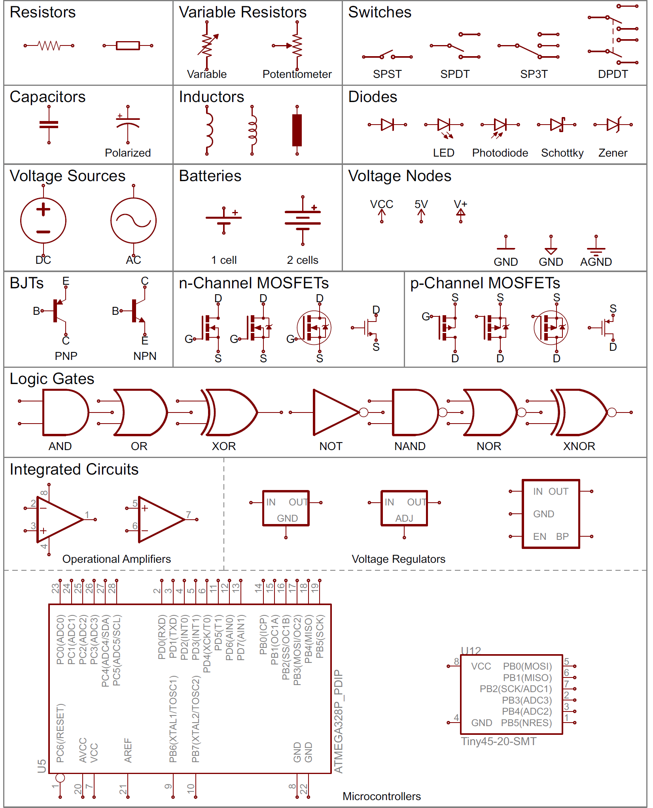

そのうえで、これらの記号が回路図の上でどのようにつながり、回路のモデルを作っているのかを説明する。
あわせて、読み解くときに気をつけたいコツもいくつか紹介する。

参考になるチュートリアル:

- [電気とは何か](./what-is-electricity.md)
- [回路とは何か](./what-is-a-circuit.md)
- [電圧、電流、抵抗とオームの法則](./voltage-current-resistance-and-ohms-law.md)

## 回路図記号（その1）

さまざまな回路部品の記号を、まとめて見ていこう。
ここでは、標準化された基本的な回路図記号を紹介する。

### 抵抗器

もっとも基本的な回路部品であり、記号でもある。
[抵抗器](./resistors.md)は、回路図の上ではたいていジグザグの線と、そこから伸びる**2つの端子**で表される。
国際規格の記号を使う回路図では、ジグザグの代わりに、何の特徴もない長方形が使われることもある。

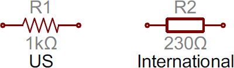

#### ポテンショメータと可変抵抗器

可変抵抗器とポテンショメータは、どちらも標準的な抵抗器の記号に矢印を加えた形で表される。
可変抵抗器は端子が2つのままなので、矢印はただ中央を斜めに横切るように描かれる。
ポテンショメータは端子が3つの部品なので、矢印そのものが3つ目の端子（ワイパー）になる。

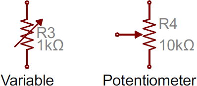

### コンデンサ

[コンデンサ](./capacitors.md)の記号としてよく使われるものが2種類ある。
一方は[極性を持つ](./polarity.md)（たいていは電解またはタンタル）コンデンサを表し、もう一方は極性を持たないコンデンサを表す。
どちらも2本の端子があり、それぞれが垂直に伸びて板につながっている。

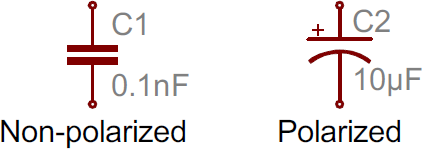

片方の板が曲線になっている記号は、そのコンデンサが極性を持つことを示している。
曲線側の板はたいていコンデンサのカソード側であり、正極であるアノード側のピンより低い電圧になっている必要がある。
極性を持つコンデンサの記号では、正極側のピンにプラス記号も添えられる。

### インダクタ

インダクタは、たいてい波打った膨らみの連続、あるいはループ状のコイルとして表される。
国際規格の記号では、単純に塗りつぶした長方形として定義されることもある。

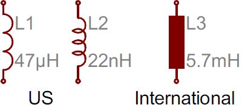

### スイッチ

[スイッチ](https://learn.sparkfun.com/tutorials/button-and-switch-basics)にはさまざまな種類がある。
もっとも基本的なスイッチである単極単投（SPST）は、2つの端子と、それらをつなぐアクチュエーター（接点を作動させる部分）を表す半分だけつながった線で構成される。

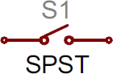

下に示すSPDTやSP3Tのように、投入先が複数あるスイッチでは、アクチュエーターの接続先がその分だけ増える。

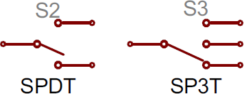

複数の極を持つスイッチは、たいてい複数の同じスイッチが並び、中央のアクチュエーターどうしを点線でつないだ形で表される。

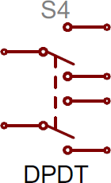

### 電源

[プロジェクトへの電源供給](./how-to-power-a-project.md)の方法にさまざまな選択肢があるのと同じように、電源を表す回路図記号にも幅広い種類がある。

#### 直流電源と交流電源

電子工作でよく使うのは、たいてい一定の電圧を供給する電源である。
供給元が直流（DC）か交流（AC）かを示すには、次の2つの記号のどちらかを使う。

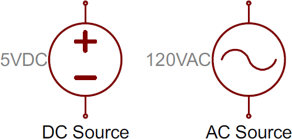

#### 電池

円筒形の[アルカリ単3電池](https://www.sparkfun.com/products/9100)であれ、充電式の[リチウムポリマー電池](https://www.sparkfun.com/products/339)であれ、[電池](https://learn.sparkfun.com/tutorials/battery-technologies)はたいてい、長さの異なる平行な線のペアとして描かれる。

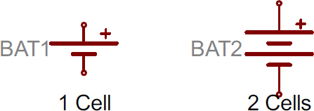

線のペアが増えるほど、電池の中で直列につながったセルの数が多いことを示す。
また、長いほうの線が正極、短いほうの線が負極を表すのが一般的である。

#### 電圧ノード

特に配線が込み入った回路図では、電圧そのものに特別な記号を割り当てることがある。
この**端子が1つだけ**の記号に部品をつなぐと、それは5V、3.3V、VCC、GND（グラウンド）に直接つながっていることを意味する。
正の電圧ノードはたいてい上向きの矢印で示され、グラウンドノードはたいてい1〜3本の水平線（あるいは下向きの矢印や三角形）で示される。

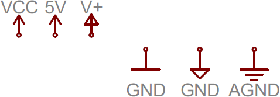

## 回路図記号（その2）

### ダイオード

基本的な[ダイオード](https://learn.sparkfun.com/tutorials/diodes)は、線に押し当てられた三角形として表されるのが一般的である。
ダイオードも[極性を持つ](./polarity.md)ため、2つの端子をそれぞれ見分けられるようにしておく必要がある。
正極であるアノードは、三角形の平らな辺につながる端子である。
負極であるカソードは、記号の線から伸びる端子である（マイナス記号だと思えばよい）。

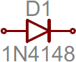

ダイオードにはさまざまな種類があり、それぞれ標準のダイオード記号に少し手を加えた独自の記号を持つ。
**発光ダイオード**（LED）は、ダイオードの記号に外側へ向かう線を数本加えた形になる。
光からエネルギーを生み出す（いわば小さな太陽電池である）**フォトダイオード**は、逆にその矢印をダイオードに向かって内向きにする。

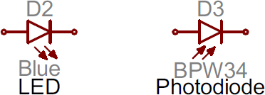

ショットキーダイオードやツェナーダイオードなど、その他の特殊なダイオードにもそれぞれ独自の記号があり、記号の線の部分に少しずつ違いがある。

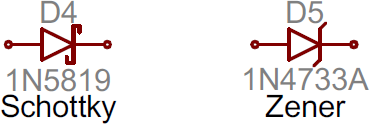

### トランジスタ

トランジスタは、BJTであれMOSFETであれ、正にドープされたものと負にドープされたものの2通りの構成がありうる。
そのため、それぞれの種類のトランジスタには、少なくとも2種類の描き方がある。

#### バイポーラ接合トランジスタ（BJT）

BJTは3端子の部品であり、コレクタ（C）、エミッタ（E）、ベース（B）を持つ。
BJTにはNPN型とPNP型の2種類があり、それぞれ固有の記号を持つ。

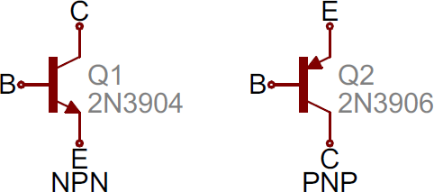

コレクタ（C）とエミッタ（E）のピンは互いに一直線上にあるが、エミッタには必ず矢印が描かれる。
矢印が内向きならPNP、外向きならNPNである。
どちらがどちらかを覚える語呂合わせとして、「NPNは中に向かってpointingしていない（not pointing in）」というものがある。

#### 金属酸化膜電界効果トランジスタ（MOSFET）

BJTと同じくMOSFETも3端子の部品だが、今度はソース（S）、ドレイン（D）、ゲート（G）と呼ばれる。
こちらもnチャンネルかpチャンネルかによって記号が2種類あり、それぞれによく使われる記号がいくつかある。

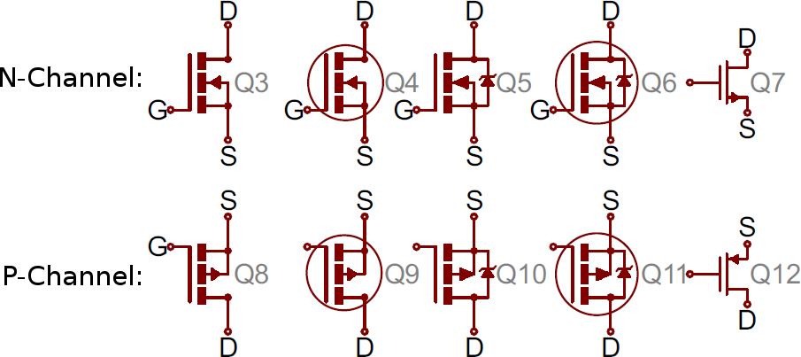

記号の中央にある矢印（バルクと呼ばれる部分）が、そのMOSFETがnチャンネルかpチャンネルかを示す。
矢印が内向きならnチャンネル、外向きならpチャンネルである。
覚え方は「nは中（n is in）」（NPNの語呂合わせとはちょうど逆になる）。

### デジタル論理ゲート

標準的な論理関数であるAND、OR、NOT、XORには、それぞれ固有の回路図記号がある。

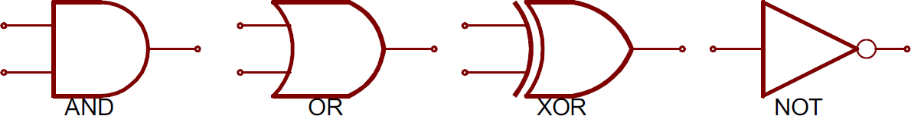

出力に丸印を加えると、その機能が**否定**され、NAND、NOR、XNORになる。

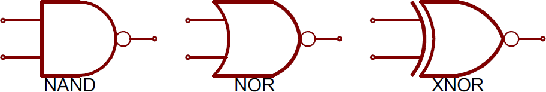

入力が2つより多いこともあるが、形自体は変わらず（多少大きくなる程度で）、出力は常に1つだけである。

### 集積回路

[集積回路](https://learn.sparkfun.com/tutorials/integrated-circuits)は非常に多様な機能を持ち、種類も膨大にあるため、固有の回路記号を持たない。
たいていは、側面にピンが伸びる長方形として表される。
それぞれのピンには、番号と機能の両方がラベルとして付けられる。

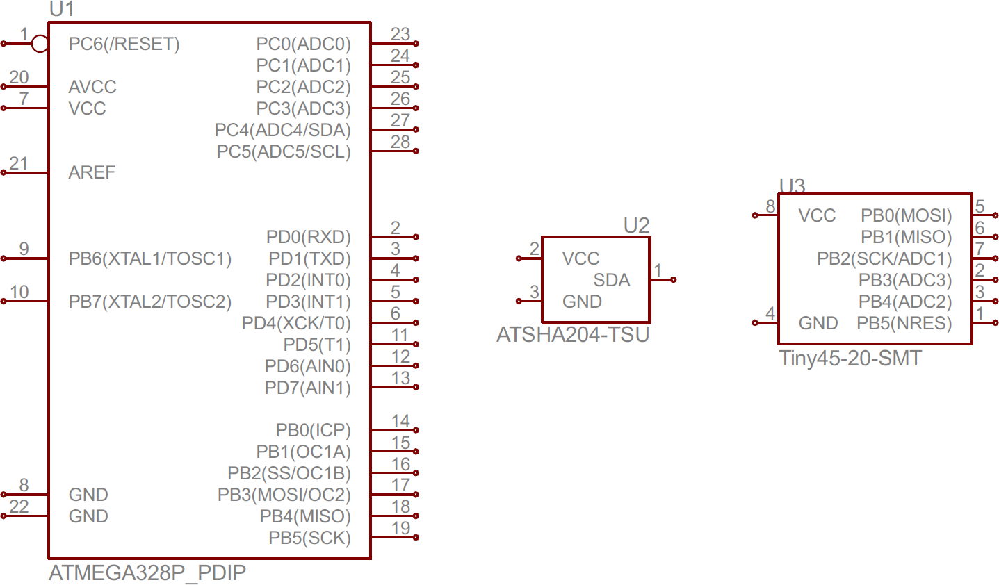

ICの回路記号は非常に汎用的であるため、名前、値、ラベルが特に重要な意味を持つ。
それぞれのICには、そのチップの名前を正確に示す値が必ず添えられる。

#### 固有の記号を持つIC：オペアンプと電圧レギュレータ

より一般的な集積回路の中には、固有の回路記号を持つものもある。
オペアンプはたいてい下のように描かれ、非反転入力（+）、反転入力（-）、出力、そして2つの電源ピンの、合計5つの端子を持つ。

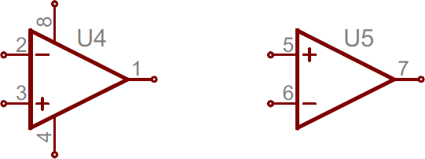

1つのICパッケージに2つのオペアンプが内蔵されていて、電源用とグラウンド用のピンをそれぞれ1本ずつ共有する構成になっていることもよくあり、そのため右側の記号はピンが3本しかない。

単純な電圧レギュレータは、たいてい入力、出力、グラウンド（または調整用）の3端子の部品である。
これらはたいてい長方形で表され、左に入力ピン、右に出力ピン、下にグラウンド（調整）ピンが描かれる。

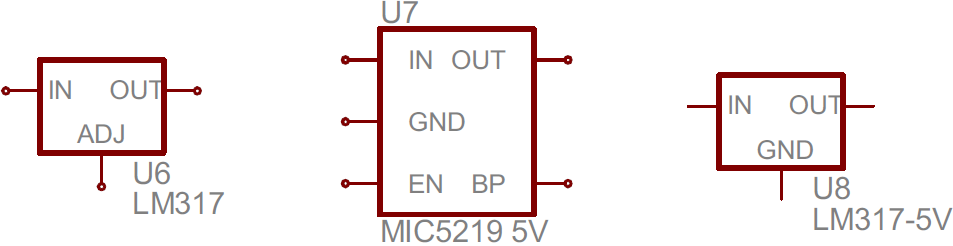

### その他いろいろ

#### 水晶振動子とセラミック発振子

水晶振動子やセラミック発振子は、マイコン回路にとって欠かせない部品であることが多い。
クロック信号を作り出す役割を担っている。
水晶振動子の記号はたいてい2端子だが、水晶にコンデンサを2つ組み合わせたセラミック発振子は、たいてい3端子になる。

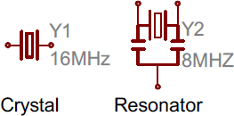

#### ヘッダーとコネクタ

電源の供給であれ、情報の送出であれ、ほとんどの回路にコネクタは欠かせない。
その記号はコネクタの見た目によってさまざまであり、いくつか例を挙げる。

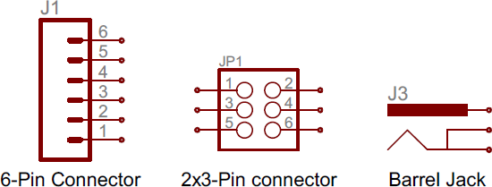

#### モーター、トランス、スピーカー、リレー

これらは、（ほとんどの場合）何らかの形でコイルを利用しているという共通点があるので、まとめて紹介する。
**トランス**（変圧器。「見た目以上の力を持つ」ロボットのことではない）は、たいてい2つのコイルが向かい合い、そのあいだを何本かの線で区切った形で表される。

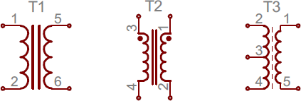

**リレー**は、たいていコイルとスイッチを組み合わせた形になる。

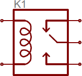

**スピーカーやブザー**は、たいてい実物に近い形で描かれる。

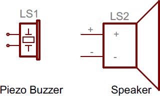

**モーター**は、一般に丸で囲んだ「M」の文字で表され、端子の周りに多少の装飾が加わることもある。

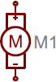

#### ヒューズとPTC

大きな突入電流を制限するために使われるヒューズやPTCには、それぞれ固有の記号がある。

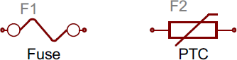

PTCの記号は、実は温度依存性を持つ抵抗である**サーミスタ**の一般的な記号でもある（国際規格の抵抗記号が中に入っているのに気づいただろうか）。

---

もちろん、この一覧に載っていない回路記号もまだまだたくさんある。
しかし、ここまでの記号を押さえておけば、回路図を読むうえで9割方は困らないはずである。
一般に、記号はそれが表す実物の部品と、見た目にも何らかの共通点を持っている。
記号に加えて、回路図上のそれぞれの部品には固有の名前と値が添えられ、それがさらに部品の識別を助けてくれる。

## 名前の識別子と値

回路図を読みこなすための大きな鍵の1つが、どの部品がどれなのかを見分けられることである。
部品記号はその情報の半分しか教えてくれず、それぞれの記号には名前と値の両方が添えられて初めて完全な情報になる。

### 名前と値

**値**は、その部品が正確には何であるかを定義する。
抵抗器やコンデンサ、インダクタといった回路図の部品では、値はそれが何オーム、何ファラド、何ヘンリーであるかを示す。
集積回路のような部品では、値は単にそのチップの名前になっていることもある。
水晶振動子であれば、発振周波数が値として記載されることもある。
つまり、回路図の部品の値は、その部品の**もっとも重要な特性**を表している。

部品の**名前**は、たいてい1〜2文字のアルファベットと数字の組み合わせでできている。
アルファベットの部分は部品の種類を示し、抵抗器なら*R*、コンデンサなら*C*、集積回路なら*U*、といった具合になる。
回路図上のそれぞれの部品名は一意でなければならず、たとえば1つの回路に複数の抵抗器があれば、R1、R2、R3のように名付けられる。
こうした部品名のおかげで、回路図の特定の場所を名指しできる。

名前の接頭辞はかなり標準化されている。
抵抗器のように、接頭辞が部品名の頭文字そのものになっているものもある。
一方で、そう単純にはいかない接頭辞もある。
たとえばインダクタは*L*で表されるが、これは電流を表す記号として*I*がすでに使われているためである（では*C*から始まる部品は何かというと……電子工学の世界とは、そういうものである）。
よく使われる部品と、その名前の接頭辞をまとめておく。

| 識別子 | 部品 |
| --- | --- |
| R | 抵抗器 |
| C | コンデンサ |
| L | インダクタ |
| S | スイッチ |
| D | ダイオード |
| Q | トランジスタ |
| U | 集積回路 |
| Y | 水晶振動子、発振器 |

これらは部品記号の「標準的な」名前ではあるが、必ずしも一律に守られているわけではない。
たとえば集積回路が*U*ではなく*IC*という接頭辞で表されていたり、水晶振動子が*Y*ではなく*XTAL*とラベル付けされていたりすることもある。
どの部品がどれなのかは、状況に応じて判断してほしい。
たいていは記号自体が十分な手がかりを与えてくれる。

## 回路図を読む

回路図上のどの部品がどれなのかを理解できれば、読み解く作業の半分以上は終わったようなものである。
残るは、それらの記号がどうつながっているのかを見分けることだけである。

### ネット、ノード、ラベル

回路図の**ネット**は、回路の中で部品がどう配線されているかを示す。
ネットは、部品の端子どうしを結ぶ線として表される。
この回路図の緑色の線のように、他とは異なる色で描かれることもある（必須ではない）。

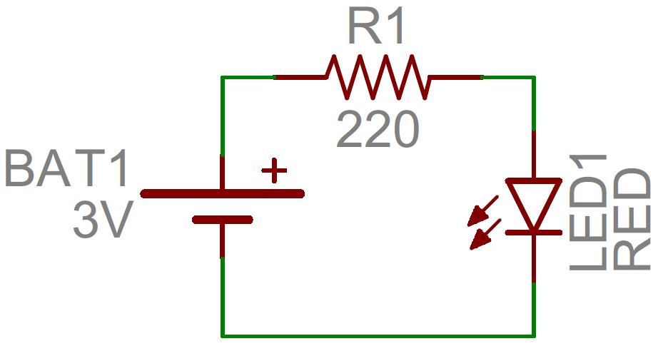

#### 接続点とノード

配線は2つの端子だけをつなぐこともあれば、何十もの端子をつなぐこともある。
配線が2方向に分かれるとき、そこに**接続点**ができる。
回路図の上では、この接続点を**ノード**、つまり配線の交点に置かれた小さな点で表す。

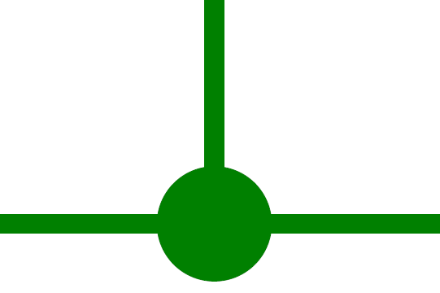

ノードがあることで、「この交点をまたぐ配線どうしは*接続されている*」ということを示せる。
逆に交点にノードがなければ、それは2本の別々の配線がただ交差しているだけで、接続はされていないことを意味する（回路図を設計するときは、こうした非接続の交差はできる限り避けるのが望ましいが、避けられないこともある）。

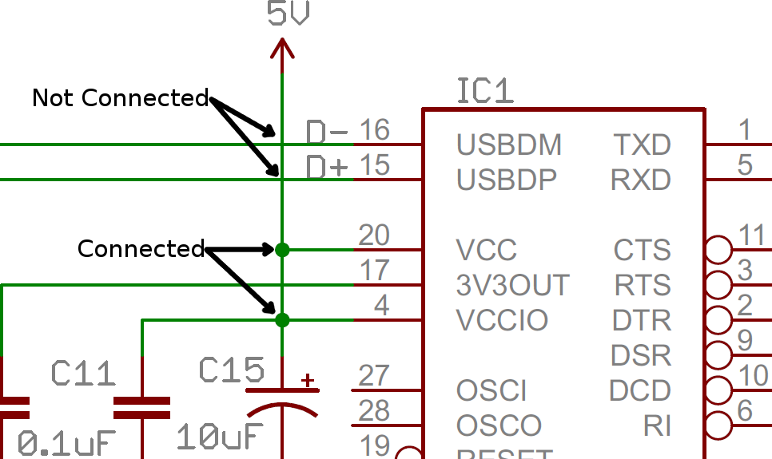

#### ネット名

回路図をより見やすくするために、配線を引き回す代わりに、ネットに名前を付けてラベルとして表示することがある。
同じ名前のネットは、たとえ配線でつながっているように見えなくても、接続されているとみなされる。
名前はネットの上に直接書かれることもあれば、配線からぶら下がった「タグ」として表示されることもある。

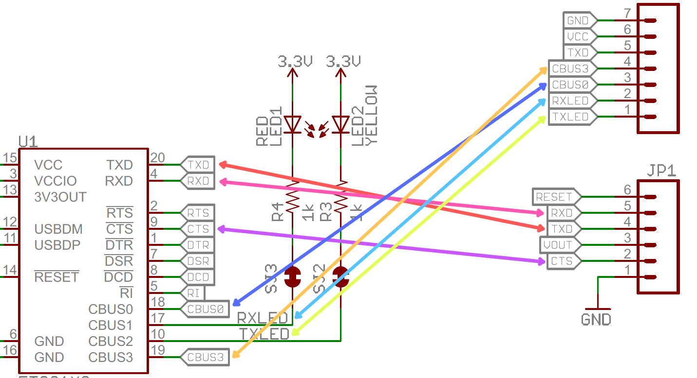

ネットの名前は、その配線上の信号の役割を具体的に表すように付けられることが多い。
たとえば電源系のネットには「VCC」や「5V」、シリアル通信のネットには「RX」や「TX」といった名前が付けられる。

### 回路図を読むコツ

#### 機能ブロックを見分ける

本当に大規模な回路図は、機能ごとのブロックに分割されているべきである。
電源入力と電圧レギュレータのセクション、マイコンのセクション、コネクタ専用のセクションなどがあるかもしれない。
どのセクションが何を担っているかを見分け、入力から出力への回路の流れを追ってみるとよい。
優れた回路図の設計者は、まるで本を読むように、入力を左側に、出力を右側に配置していることもある。

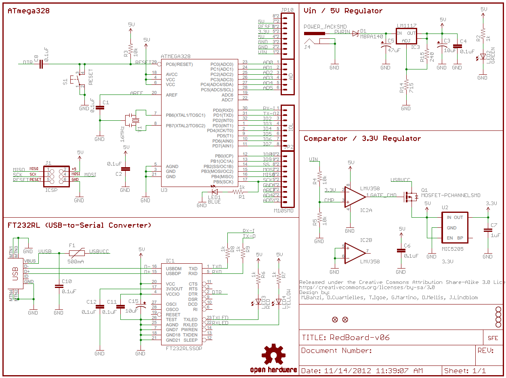

#### 電圧ノードを見分ける

電圧ノードは1端子の回路図部品であり、部品の端子をここにつなぐことで、特定の電圧レベルに割り当てられる。
これはネット名の特別な使い方であり、同じ名前の電圧ノードにつながる端子は、すべて互いに接続されているとみなされる。

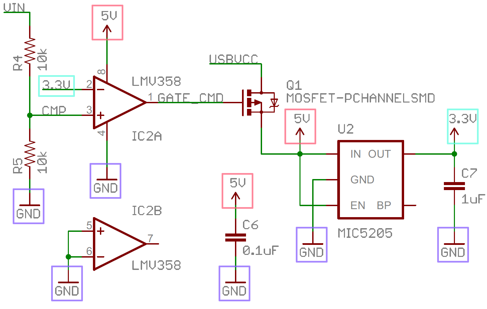

グラウンドの電圧ノードは特によく使われる。
非常に多くの部品がグラウンドへの接続を必要とするからである。

#### 部品のデータシートを参照する

回路図の中に理解できない部分があれば、その回路の中でもっとも重要な部品のデータシートを探してみるとよい。
たいてい、回路の中でもっとも多くの仕事をしているのは、マイコンやセンサーのような集積回路である。
こうした部品は回路図の中でもっとも大きく、たいてい中央付近に配置されていることが多い。

## まとめ

回路図の読み方について、これでひととおり説明できた。
部品記号を知り、ネットをたどり、よく使われるラベルを見分けられるようになれば十分である。
回路図の仕組みを理解することで、電子工作の世界全体への扉が開ける。
新しく身につけた回路図の知識を実践できる、次のようなチュートリアルもぜひ試してみてほしい。

- [分圧回路](./voltage-dividers.md)：もっとも基本的で根本的な回路の1つである。たった2本の抵抗で、大きな電圧を小さな電圧に変える方法を学べる。
- [ブレッドボードの使い方](./how-to-use-a-breadboard.md)：回路図の読み方がわかったところで、今度は実際に組んでみよう。ブレッドボードは、一時的で機能する試作回路を作るのに最適な道具である。
- [配線の基本](./working-with-wire.md)：あるいは、ブレッドボードを使わずにいきなり配線してみるのもよい。電線を切り、被覆を剥き、接続する方法を知っておくことは、電子工作の重要なスキルである。
- [直列回路と並列回路](./series-and-parallel-circuits.md)：直列や並列で回路を組むには、回路図をきちんと理解している必要がある。
- [導電糸で縫う](./lilypad-basics-e-sewing.md)：電線を使いたくないなら、導電糸を使ったE-テキスタイルの回路を作ってみるのはどうだろうか。同じ回路図から、さまざまな素材でさまざまな作り方ができるというのが、回路図の美しさである。

タグ: 電気工学、スキル

---

出典：[How to Read a Schematic](https://learn.sparkfun.com/tutorials/how-to-read-a-schematic)（SparkFun Learn）を日本語に翻訳し、再構成した。
原文は [CC BY-SA 4.0](https://creativecommons.org/licenses/by-sa/4.0/) ライセンスで公開されており、本ページも同ライセンスの下で提供する。
