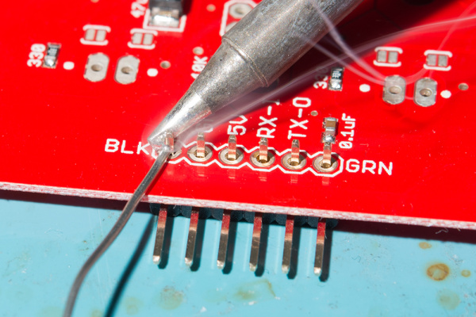
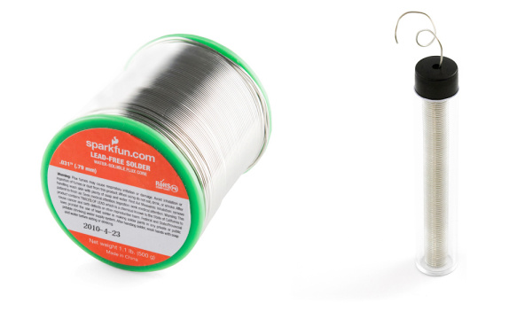
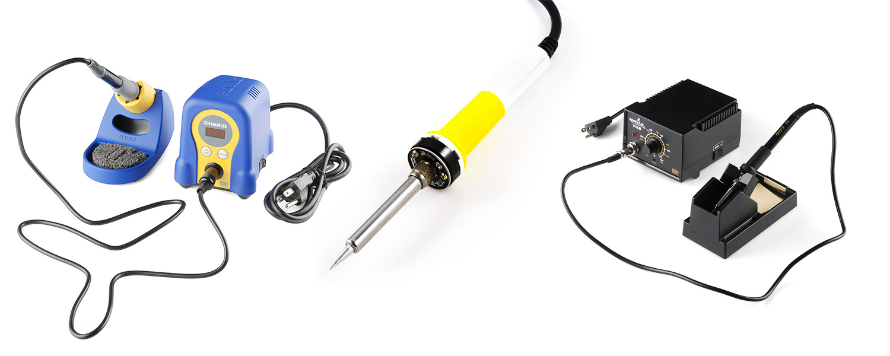
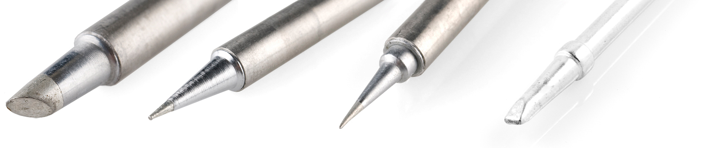
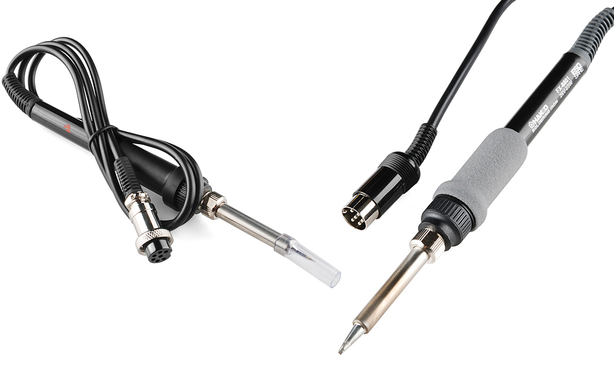
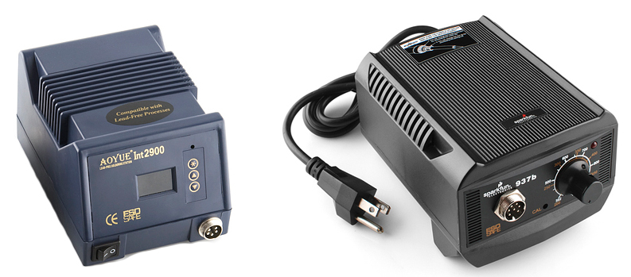
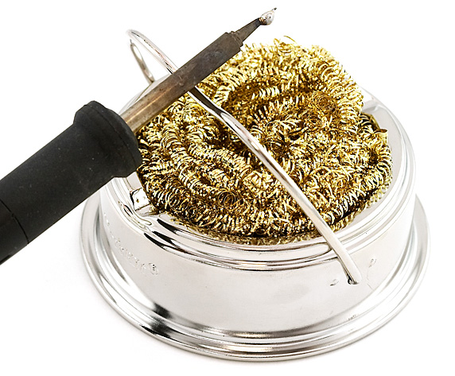
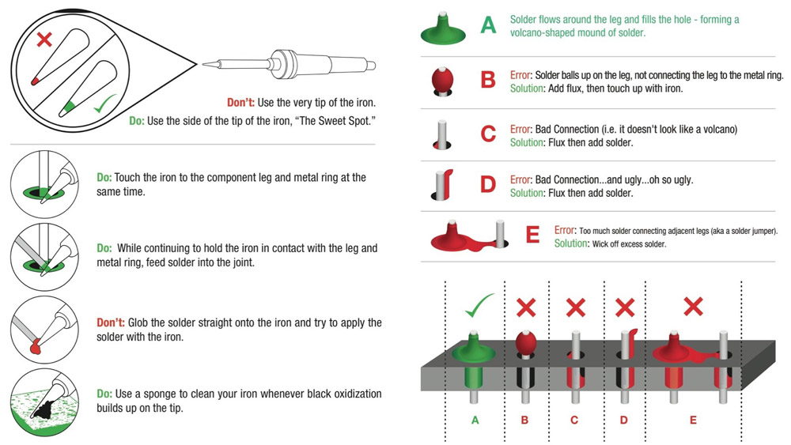
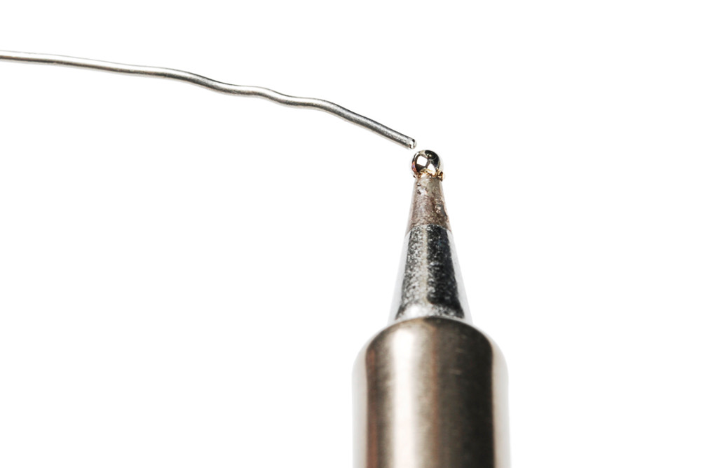

# はんだ付けの基本（スルーホール編）

はんだ付けは、電子工作の世界に足を踏み入れるうえでもっとも基本的なスキルのひとつである。
はんだごてを持たずに電子工作を学んだり作ったりすることも可能だが、このひとつのスキルを身につけるだけで、まったく新しい世界が開けることにすぐ気づくはずである。
SparkFunでは、はんだ付けはすべての人が身につけておくべきスキルだと考えている。
技術に囲まれる世界が広がるにつれて、日々使っている技術を理解するだけでなく、それを自分で作り、改造し、修理できることが重要になってきている。
はんだ付けは、それを可能にしてくれる数あるスキルのひとつである。

このチュートリアルでは、**スルーホールはんだ付け**（めっきスルーホールはんだ付け、PTHとも呼ばれる）の基本を扱い、必要な道具、正しいはんだ付けの技法を解説し、そこから先にどう進めばよいかを紹介する。
また、スルーホールはんだ付けに関するリワーク（やり直し）についても触れ、電子機器の修理を楽にするコツも紹介する。
このガイドは初心者にも熟練者にも役立つ内容になっている。

参考になるチュートリアル:

はんだごてに触れずに電子工学の理論から先に学びたい場合は、次のチュートリアルから始めることをおすすめする。

- [電気とは何か](./what-is-electricity.md)
- [回路とは何か](./what-is-a-circuit.md)
- [電圧、電流、抵抗とオームの法則](./voltage-current-resistance-and-ohms-law.md)

はんだごてを使わずに回路を組みたい場合は、[ブレッドボードのチュートリアル](./how-to-use-a-breadboard.md)を確認してほしい。

このチュートリアルはいくつかの既存のチュートリアルの内容の上に成り立っているため、先に次の話題を読んで理解しておくことをおすすめする。

- [PCB基板の基礎](./pcb-basics.md)
- [極性](./polarity.md)
- [配線の基本](./working-with-wire.md)

## はんだとは何か

はんだ付けの方法を学ぶ前に、はんだそのものについて、その歴史や用語を少し知っておくとよい。

**はんだ**（solder）という単語には2通りの使い方がある。
名詞としての「はんだ」は、スプールやチューブに入った長く細い線として売られている合金（2種類以上の金属からなる物質）を指す。
動詞としての「はんだ付けする（solder）」は、2つの金属を**はんだ接合**と呼ばれる形でつなぎ合わせることを意味する。
つまり、はんだ（を使って）はんだ付けするというわけである。

### 鉛入りはんだと鉛フリーはんだ：簡単な歴史

はんだについて知っておくべきもっとも重要なことのひとつは、伝統的なはんだの多くが、鉛（Pb）、スズ（Sn）、そのほか微量の金属でできていたという点である。
このはんだは**鉛入りはんだ**として知られている。
よく知られているように、[鉛は人体に有害](https://ja.wikipedia.org/wiki/鉛中毒)であり、大量にさらされると鉛中毒を引き起こすことがある。
とはいえ鉛は非常に有用な金属でもあり、融点が低く優れたはんだ接合を作れることから、はんだ付けの定番の金属として選ばれてきた。

鉛入りはんだの悪影響が知られるようになると、一部の団体や国は、鉛入りはんだをもう使わないほうがよいと判断した。
2006年、欧州連合は[特定有害物質使用制限指令](https://ja.wikipedia.org/wiki/特定有害物質の使用制限に関するEU指令)（**RoHS**）を採択した。
簡単に言えば、この指令は、電子機器や電気機器における鉛入りはんだ（をはじめとする一部の材料）の使用を制限するものである。
これにより、電子機器の製造では**鉛フリーはんだ**の使用が標準となった。

鉛フリーはんだは、名前のとおり鉛を含まない点を除けば、鉛入りはんだとよく似ている。
その代わりに、主にスズと、銀や銅といった微量の金属で構成されている。
このはんだには、規格に適合していることを示すRoHSマークが付けられていることが多い。

### 用途に合ったはんだの選び方

電子機器を製造する場合、製品の安全性を確保するために鉛フリーはんだを使うのが望ましい。
とはいえ、自分自身のプロジェクトで使うはんだの種類は、自分で選ぶことができる。
多くの人は、接合材としての優れた性能から今でも鉛入りはんだを好んで使う。
一方で、機能性よりも安全性を優先し、鉛フリーを選ぶ人もいる。
SparkFunでは両方の種類を扱っており、それぞれが自分で選べるようにしている。

鉛フリーはんだにも欠点がないわけではない。
先に述べたように、鉛が選ばれてきたのは、はんだ付けのような用途において最良の性能を発揮するからである。
鉛を取り除くと、2つの金属をつなぎ合わせるという目的にとって理想的だった、はんだのいくつかの特性も失われてしまう。
そのひとつが融点である。
スズは鉛より融点が高いため、流動させるにはより多くの熱が必要になる。
スズはそれでも役目を果たすが、時には少し助けが必要になる。
多くの鉛フリーはんだには**フラックスコア**と呼ばれるものが入っている。
フラックスとは、鉛フリーはんだの流動を助ける化学物質だと考えておけばよい。
フラックスなしで鉛フリーはんだを使うことも可能だが、フラックスがあれば鉛入りはんだと同じような効果をずっと簡単に得られる。
また、鉛フリーはんだは製造コストが余分にかかるため、鉛入りはんだより高価になることもある。

鉛入りか鉛フリーかを選ぶこと以外にも、はんだを選ぶ際に考慮すべき要素がいくつかある。
まず、鉛とスズ以外にも実に多くのはんだの組成が存在する。
次に、はんだにはさまざまなゲージ（太さ）がある。
小さな部品を扱うときは、細いはんだを使うほうがよいことが多い（番号が大きいほどゲージは細くなる）。
大きな部品には、太い線のほうがおすすめである。
最後に、はんだは線状以外の形でも売られている。
表面実装のはんだ付けに取り組むようになると、はんだペーストという形が主流になる。
ただしこのチュートリアルはスルーホールはんだ付けのチュートリアルであるため、はんだペーストについては詳しく扱わない。

用途に合ったはんだの選び方が分かったところで、道具とさらなる用語の話に進もう。

## はんだごて

はんだ付けを助ける道具は数多くあるが、**はんだごて**ほど重要なものはない。
最低限、作業をこなすには、こてとはんださえあればよい。
はんだごてにはさまざまな形状があり、単純なものから複雑なものまであるが、いずれもおおむね同じように機能する。
ここでは、こての各部の名称と、こての種類について見ていく。

### はんだごての構造

はんだごてを構成する基本的な部品は、次のとおりである。

- **こて先**：こて先のないはんだごては存在しない。こて先は、はんだごての中で熱くなり、接合する2つの部品の周りにはんだを流し込む部分である。はんだを当てるとこて先にくっつくため、こて先がはんだを運んでいると誤解されがちだが、実際にはこて先が伝えているのは熱であり、金属部品の温度をはんだの融点まで上げることで、はんだが溶けるのである。たいていのこては、古くなったこて先を交換したり、別の形状のこて先に切り替えたりできるようになっている。こて先にはさまざまな大きさや形があり、あらゆる部品に対応できる。

こて先の交換は簡単で、ワンド（こて本体）のネジを緩めるか、こて先を押し込んで引き抜くだけでよい。

> [!NOTE]
> こて先から接合部への熱伝達の効率は、使っているはんだごてのこて先の大きさによって左右される。一般に、はんだ付けするパッドと同じくらいの幅のこて先を使うのがよいとされる。

- **ワンド**：ワンドは、こて先を保持し、作業者が手に持つ部分である。ワンドはたいてい、こて先の熱が外側に伝わらないよう、ゴムなどの絶縁材料でできているが、内部には、ベースやコンセントからこて先へ熱を伝えるための配線や金属の接点が収められている。加熱と火傷防止という2つの役割を両立させているからこそ、質の高いワンドが重宝される。

こての中には、ワンドだけをコンセントに直接差し込むタイプもある。
これらはもっともシンプルなこてであり、温度を変える機能はない。
このタイプでは、発熱体がワンドに直接組み込まれている。

- **ベース**：はんだごてのベースは、温度を調整できるコントロールボックスである。ワンドはベースに接続され、内部の電子回路から熱を受け取る。温度をダイヤルで調整するアナログベースと、ボタンで温度を設定し、現在の温度を表示するデジタルベースがある。中には、さまざまな部品をはんだ付けする際にこて先への熱量をすばやく切り替えられる、ヒートプロファイル機能を備えたベースもある。

ベースの内部にはたいてい大きなトランスと、こて先の熱を安全に調整するための各種制御回路が収められている。

- **スタンド（クレードル）**：アイアンスタンド（クレードルとも呼ばれる）は、使っていないときにこてを置いておく場所である。些細なことのように思えるかもしれないが、加熱されたこてを机の上に放置しておくのは、やけどや、最悪の場合は火災につながる潜在的な危険がある。シンプルな金属製のスタンドから、ワンドをクレードルに置くとこて先の温度を下げて摩耗を防ぐ、自動オフ機能付きの複雑なものまでさまざまである。
- **真鍮製スポンジ**：はんだ付けをしていると、こて先は**酸化**しやすくなる。つまり黒ずんで、はんだがのりにくくなる。特に鉛フリーはんだには不純物が含まれており、それがこて先に蓄積して酸化を引き起こす。そこで登場するのがスポンジである。時々、こて先をこのスポンジで拭って汚れを落とす必要がある。伝統的には濡らした普通のスポンジが使われてきたが、これはこて先の寿命を大幅に縮めてしまう。冷たく濡れたスポンジでこて先を拭くと、温度変化によってこて先が膨張と収縮を繰り返し、それが摩耗の原因になり、時にはこて先の側面に穴があいてしまうこともある。穴があいたこて先は、もうはんだ付けには使えない。そのため、こて先の掃除には真鍮製スポンジが標準になっている。真鍮製スポンジは、こて先の現在の温度を保ちながら余分なはんだを取り除いてくれる。真鍮製スポンジがない場合は、普通のスポンジでもないよりはましである。

## はんだごての選び方

初心者であれ熟練者であれ、用途に合ったはんだごてを見つけることができる。
シンプルな固定温度タイプの安価なもの、調整可能な温度のもの、より高機能なデジタルソルダリングステーションまで、幅広い選択肢がある。
SparkFunのカタログの[はんだ付けカテゴリー](https://www.sparkfun.com/categories/49)で、自分に合った1本を探してみてほしい。

## はんだ付けの補助道具

はんだごての細部が分かったところで、はんだ付け作業を助けるそのほかの道具についても紹介する。

- **はんだ吸取り線**：はんだ付けの「消しゴム」のような存在である。ジャンパーの問題や部品の取り外し（取り外しはんだ付け）を扱うときに非常に役立つ。はんだ吸取り線は、細い銅線を編み込んで作られており、はんだを銅線に染み込ませることで、余分なはんだの塊を「消す」ことができる。
- **チップティナー**：はんだごてのこて先を掃除するための化学ペースト。穏やかな酸が含まれており、こびりついた汚れ（部品にこて先を誤って溶かしてしまったときなど）を取り除いたり、使っていないときにこて先に蓄積する酸化（あの黒い汚れ）を防いだりする。
- **はんだ吸取り器（はんだシュッ太郎のようなもの）**：部品を取り外す際に、スルーホールに残ったはんだを取り除くのに便利な道具である。
- **フラックス**：フラックスは、鉛フリーはんだの流動を助ける化学物質である。フラックスペンを使えば、扱いにくい部品に液体フラックスを塗って、より見た目のよいはんだ接合を作ることができる。水溶性フラックスを使った場合は、基板に残った残留物を洗浄して除去することが推奨される。ノークリーンフラックスの場合は洗浄の必要はないが、除去したい場合はイソプロピルアルコール（IPA）が必要になる。
- **シリコン製はんだ付けマット**：机を保護し、清潔に保つためのマット。
- **はんだディスペンサー**：スプールが転がっていかないようにし、はんだを取り出しやすくする道具。

### そのほかおすすめの道具

以下の道具は必須ではないが、あるとはんだ付けがずっと楽になる。

- **サードハンド（第三の手）**：はんだ付けの間、PCBや配線、部品を固定しておくのに便利である。
- **パナバイス Jr.**：真空ベース付きのバイスで、PCBや配線、部品を固定するのに役立つ。
- **スティックバイスPCBバイス**：低床タイプのPCBバイスで、はんだ付けやテスト、配線の際に基板を平らに保つのに適している。顕微鏡の下でも扱いやすい。
- **PCBiteキット**：ステンレス製のバネ式ジョーでPCBの端を挟み込む固定具。柔軟なアームこそないが、平らな机の上でPCBをしっかり固定してはんだ付け、取り外し、リワークを行うのに適している。
- **ラジオペンチ**：ブレッドボードに部品を挿したり、ピンを曲げたりするのに欠かせない。
- **斜めニッパー**：PCBにはんだ付けした部品の脚を切りそろえるのに使う。コネクタやケーブルをつかんだり、こじ開けたりするのにも使える。
- **フラッシュカッター**：はんだ接合部のすぐ近くで、リード線をきれいに切るための道具。
- **保護メガネ**：切ったリード線や溶けたはんだが飛んでくることがあるため、目を保護する。SparkFunの生産ラインでも使用している。
- **モノクル（拡大鏡）**：PCB上のはんだ接合部やSMD部品を検査するのに便利。LEDが作業距離で十分な明るさを提供してくれる。

## はじめてのはんだ付け

これらの道具を実際に使ってみよう。
基本のルールは次のとおりである。

- 熱いこてを扱うときは注意する
- サードハンドやバイスを使って、はんだ付け中は基板を固定する
- こての温度は適度な中温（325〜375℃）に設定する
- はんだから煙が出ているようなら、温度を下げる
- 接合部を準備するため、はんだ付けのたびにこて先にはんだを馴染ませておく（予備はんだ）
- こての先端そのものではなく、こての側面（スイートスポットと呼ばれる部分）を使う
- パッドとはんだ付けしたい部品の両方を、同時に均等に加熱する
- はんだを離してから、こてを離す
- よいはんだ接合は、ボールや塊ではなく、火山やハーシーのキスチョコレートのような形になる

次の図は、よいはんだ接合がどのようなものかを理解する助けになるはずである。

作業が終わったら、はんだごての電源を切る前に、こて先を予備はんだしておくと寿命が延びる。

## コツと裏技

サードハンドを使う以外にも、部品を基板にはんだ付けする方法はいくつかある。
完璧なはんだ接合を作るために、状況に応じたさまざまな技法が必要になることもある。
いくつか追加のコツを紹介しよう。

### テープや粘着タックで部品を固定する

テープや粘着タックがあれば、配線やヘッダーを基板に押さえつけておくのに使える。

### シリコンや厚紙のかけらを断熱材として使う

部品を押さえておきたいが、熱くて指では触れられないという場合は、シリコンや厚紙のかけらを使って数秒間押さえておくとよい。

### 古いシールドや開発ボード、ブレッドボードを補助として使う

手がそれほど器用でない場合は、古いシールドや開発ボードを使ってヘッダーをはんだ付け前に位置合わせすることができる。
シールドやブレイクアウト基板がブレッドボードに収まる場合は、ブレッドボードを使ってピンを固定しながらはんだ付けすることもできる。
2列のヘッダーを持つ基板におすすめの方法だが、熱をかけすぎるとブレッドボードが溶けてしまうことがあるので注意すること。

### グラウンドプレーンと大きなスルーホール

設計によっては、めっきスルーホールのパッドがグラウンドプレーンに接続されていたり、通常より大きかったりすることがある。
これらにはより多くの熱が必要である。
はんだが「くっついている」ように見えても、実際にはただ玉になって盛り上がっているだけということがある。
次のような対策が必要になる場合がある。

- より大きなこて先を使う
- はんだ付けステーションの温度をより高く（およそ380℃程度）設定する
- フラックスを追加する
- こてを接合部に少し長く当てておく

フラックスを足し、こてを少し長く当てておくと、たいていうまくいく。
出力の大きい、温度調整可能なはんだ付けステーションを使うと、冷たいものに触れたあとのこて先の温度回復が速くなる。
友人やもう1本のはんだごてがあれば、2本のこてで同時に接合部を温めるという方法もある。

## 高度な技法とトラブルシューティング

### 高度なPTH技法

よいはんだ接合の基本を身につけたら、より高度なPTHの技法を学ぶ番である。
フラックスの使い方、はんだブリッジの除去、部品の取り外しなどが含まれる。

PTHはんだ付けに関するそのほかのコツを紹介する。

- 取り外し（デソルダリング）は、はんだ付けを学ぶのに最適な方法であることが多い。修理、アップグレード、部品の再利用など、部品を取り外す理由はさまざまである。
- スルーホールからはんだを取り除くもうひとつの方法として、「スラップ法」と呼ばれる方法もある。
- 作ったはんだ接合が本当に電気的な接続を作っているか分からない場合は、[テスターの導通モード](./how-to-use-a-multimeter.md)を使って確認できる。

### ヘッダーを基板に押さえつけて固定する

手先が器用であれば、ピンを基板に指で押さえつけながらヘッダーの列を取り付けることもできる。
先述のテープや粘着タックを使う方法も試してみてほしい。

ヘッダーを取り付ける際は、片手ではんだ付けする手を使い、もう片方の手の人差し指と親指でヘッダーを基板の端に向かって引き寄せ、中指で押さえながら固定する。
はんだごてが触れる予定のヘッダーピンには触れないように注意すること。

はんだ付けする手でこてを持ち、各ヘッダーにつき1本のピンを仮止めしていく。
すべてのヘッダーに1本ずつ仮止めが終わったら、ピンがまっすぐで基板に対して垂直になっているか確認する。
そうでなければ、ヘッダーピンを再加熱して位置を調整できる。

位置合わせができたら、残りのすべてのヘッダーピンをはんだ付けして完成させる。

### 高度なSMD技法

はんだごてだけでできる、より高度なテクニックについては、SMD部品のリワークに関する専用のチュートリアルも参考になる。

### フラックスの残留物を洗浄する

鉛フリーはんだを扱っていると、はんだに含まれるフラックスや、作業者が外部から塗布したフラックスがあちこちに付着しがちである。
一部のフラックスは時間の経過とともにPCBや部品を腐食させることがあるため、フラックスの残留物を除去する洗浄方法を知っておくことが重要である。
これは、空気中の湿気によって微細な樹枝状の析出物ができ、ピン間に高抵抗の短絡を引き起こすこともある。

水溶性フラックスの残留物は、はんだ接合部やその周辺に黄色や茶色のコーティングとして現れることが多い。
ノークリーンフラックスは、基板上に白くベタついたものとして残ることが多いが、非導電性なので基板上に残しておいてもかまわない。

基板に水溶性フラックスの残留物がある場合は、除去する必要がある。
ノークリーンフラックスの場合は、基本的に除去は不要である。
水溶性フラックスを洗浄するもっとも簡単な方法は、毛先の硬い小さなブラシ（歯ブラシでもよい）や綿棒を使い、熱い純水ではんだ接合部をこすることである。
水の代わりにイソプロピルアルコールを使うこともできる。
ノークリーンフラックスをどうしても除去したい場合は、水ではなくイソプロピルアルコールを使うのが最善である。
使っているはんだのドキュメントを確認し、正しい洗浄方法を確かめること（アセトンが必要なフラックスもある）。

複数の基板をはんだ付けする場合は、まとめて洗浄する必要が出てくることもある。
その場合は、蒸留水を入れたスロークッカー（クロックポット）を使うことをおすすめする。
蒸留水を使えば、回路に不純物が付着するのを防げる。
ただし、すべての基板を水に浸けられるわけではないため、手作業で洗浄しなければならない場合もある。
熱い純水を満たしたスロークッカーがあれば、この作業を速く進められる。

水に濡れると困るセンサーや部品には十分注意すること。
特定の部品は水に弱いため、そうした基板を水に浸けたり濡らしたりしないように気をつけよう。
以下は水との接触を避けるべき部品の一例である。水がこれらの内部に入り込んだまま電源を入れると、部品を損傷する可能性が高い。

- キャラクターLCD
- 7セグメントLEDディスプレイ
- 電池
- GPSモジュール
- 無線モジュール
- 気圧センサー
- スライド式ポテンショメータ
- マイク
- スピーカー
- 心拍センサーIC

洗浄が終わったら、基板の余分な水分を取り除く。
エアダスターを使えば、自然乾燥を待たずに済む。
紙タオルで拭くこともできるが、繊維くずが残ることがあるため、リントフリーのワイプを使うほうがよい。
ヒートガンがあれば、それを使って基板を温めることもできるが、基板上の部品を溶かさないよう注意すること。

基板の洗浄は必須ではないが、回路の寿命を大きく伸ばしてくれる。
また、基板がきれいであれば、シリアル通信で送られるデータの信頼性も高まる。

### はんだ接合のテストとトラブルシューティング

洗浄が終わったら、先ほど述べたとおり、[テスターの導通モード](./how-to-use-a-multimeter.md)ではんだ接合を確認してみるとよい。
問題が起きて、あるピンが基板に正しくはんだ付けされているかを確認したいときに役立つ。

## まとめ

はんだ付けの世界の入り口に立ったところである。
PTHはんだ付けを習得したら、次のようなスキルやチュートリアルにも挑戦してみてほしい。

- [Electronics Troubleshooting（電子機器のトラブルシューティング）](https://learn.sparkfun.com/tutorials/sparkfun-troubleshooting-tips)
- [Electronics Assembly（電子部品の組み立て）](./electronics-assembly.md)
- [SMD How To Soldering Series（SMDはんだ付けの実践シリーズ）](https://learn.sparkfun.com/tutorials/tags/soldering)
- [Making Your Own Solder Paste Stencils（自作のはんだペーストステンシルの作り方）](https://learn.sparkfun.com/tutorials/electronics-assembly/stenciling)
- [Solder Paste and Stenciling（はんだペーストとステンシル）](https://learn.sparkfun.com/tutorials/electronics-assembly/stenciling)

castellated（お城の縁のような形状の）取り付け穴をパッドにはんだ付けする方法については、専用のガイドも確認してほしい。
表面実装部品（SMD）をブレイクアウト基板にはんだ付けする方法についても、関連チュートリアルが参考になる。

タグ: スキル、はんだ付け、プロジェクトを始める、道具

---

出典：[How to Solder: Through-Hole Soldering](https://learn.sparkfun.com/tutorials/how-to-solder-through-hole-soldering)（SparkFun Learn）を日本語に翻訳し、再構成した。
原文は [CC BY-SA 4.0](https://creativecommons.org/licenses/by-sa/4.0/) ライセンスで公開されており、本ページも同ライセンスの下で提供する。
