# ブレッドボードの使い方

**ブレッドボード**は、回路を組み立てる方法を学ぶうえで欠かせない道具の1つである。
このチュートリアルでは、ブレッドボードとは何か、なぜ「ブレッドボード（パン切り板）」と呼ばれるのか、そしてその使い方を説明する。
読み終えるころには、ブレッドボードの仕組みが基本的に理解でき、ブレッドボード上で簡単な回路を組み立てられるようになっているはずである。

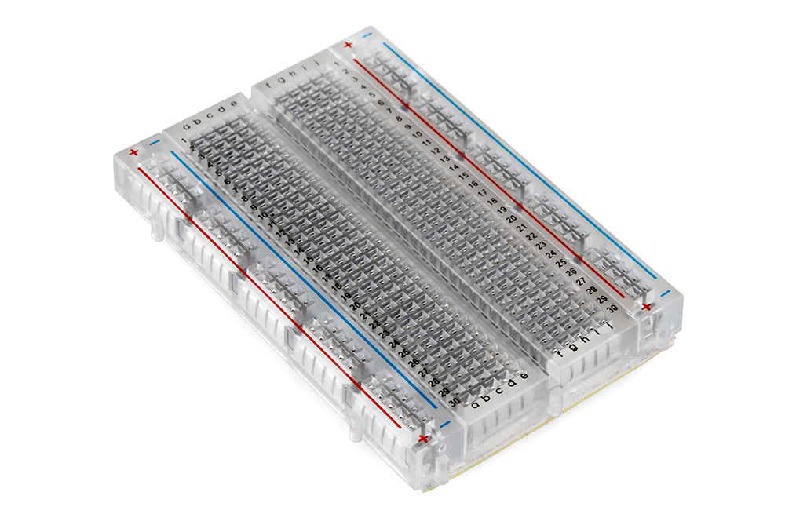

参考になるチュートリアル:

- [電圧、電流、抵抗とオームの法則](./voltage-current-resistance-and-ohms-law.md)
- [回路とは何か](./what-is-a-circuit.md)
- [配線の基本](./working-with-wire.md)
- [回路図の読み方](./how-to-read-a-schematic.md)
- [コネクタの基礎](./connector-basics.md)
- [テスターの使い方](./how-to-use-a-multimeter.md)

## 歴史

1960年代より前に回路を組み立てようとすると、たいていは[ワイヤーラップ](https://ja.wikipedia.org/wiki/ワイヤラッピング)という技法が使われていた。
ワイヤーラップは、[パーフボード](https://ja.wikipedia.org/wiki/ユニバーサル基板)（プロトボードとも呼ばれる）に取り付けた導電性のピンに、被覆を剥いた電線を巻き付けていく方法である。
見てのとおり、この方法はすぐに配線が複雑になってしまう。
今でも使われている技法ではあるが、試作をずっと簡単にしてくれるものがある。
それがブレッドボードである。

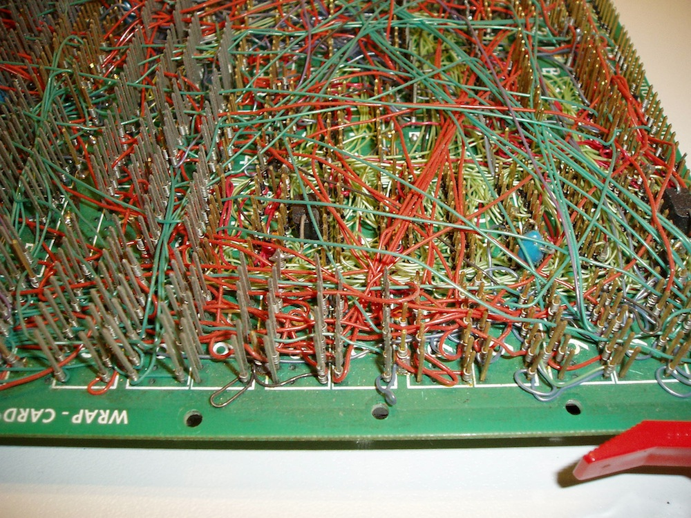

### 「ブレッドボード」という名前の由来

「ブレッドボード」と聞くと、大きな木の板と、焼きたてのパンを思い浮かべるかもしれない。
実際、その想像はそれほど的外れではない。

電子部品がまだ大きくてかさばっていた時代、人々はパンを切るための板（ブレッドボード）と釘や画鋲を手に取り、その板の上に配線をつないで回路を組み立てる土台にしていた。
これが、電子部品の「回路を組み立てる板」を今でもブレッドボードと呼ぶ理由である。

その後、電子部品はずっと小型になり、回路をつなぐより良い方法も登場した。
それでも、この紛らわしい名前だけはそのまま残った。
厳密に言えば、文字通りのパン切り板を使う方法も今なおブレッドボードと呼べるが、このチュートリアルで扱うのは、現代の「はんだ付け不要」なブレッドボードについてである。

## なぜブレッドボードを使うのか

電子工作で言う「ブレッドボード」とは、サンドイッチを作るためのまな板ではなく、**はんだ付け不要のブレッドボード**を指す。
これは一時的な回路や試作を作るのに適した部品であり、はんだ付けを一切必要としない。

**プロトタイピング**（試作）とは、アイデアを試すために暫定的なモデルを作り、そこから別の形を発展させたり複製したりする作業のことであり、ブレッドボードのもっとも一般的な使い道の1つである。
ある条件のもとで回路がどう動くか確信が持てないときは、まず試作を組んで実際に試してみるのが一番よい。

電子工作や回路を初めて学ぶ人にとって、ブレッドボードはたいてい最良の出発点になる。
単純な回路も複雑な回路も同じように組み立てられる点こそが、ブレッドボードの本当の魅力である。
このチュートリアルの後半で見るように、回路がブレッドボード1枚に収まらなくなったときは、複数のブレッドボードをつなぎ合わせて、どんな規模や複雑さの回路にも対応できる。

ブレッドボードのもう1つのよくある使い道は、IC（集積回路）のような新しい部品を試すことである。
ある部品がどう動作するのかを確かめながら何度も配線を組み替えたいとき、そのたびにはんだ付けをするわけにはいかない。

すでに触れたように、組み立てる回路が常に恒久的なものである必要はない。
SparkFunのテクニカルサポートチームも、顧客から報告された不具合を再現するとき、しばしばブレッドボードを使って回路を組み、テストし、分析している。
顧客の手元にある部品と同じ構成をつなぎ、回路を組んで問題を特定できたら、すべてをばらして片付け、また次のトラブルシューティングが必要になるまでしまっておける。

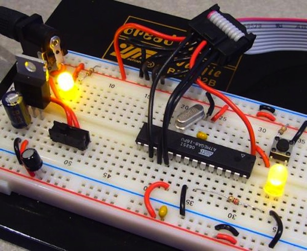

## ブレッドボードの構造

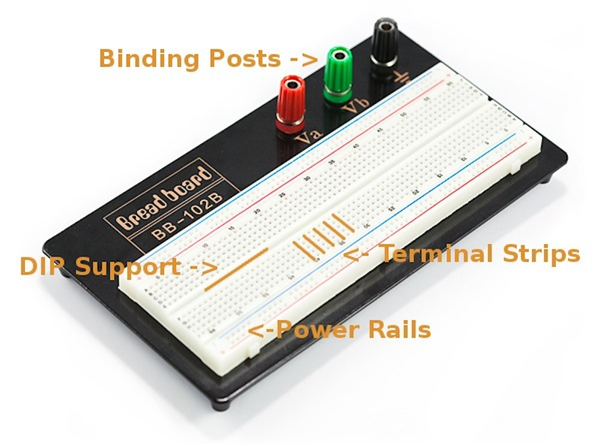

ブレッドボードの仕組みを説明する一番の方法は、実際に分解して中を見てみることである。
小さめのブレッドボードを使うと、その仕組みがより見えやすくなる。

### ターミナルストリップ

裏の粘着シートを剥がしたブレッドボードを見ると、裏面に金属の帯が横方向にいくつも並んでいるのがわかる。

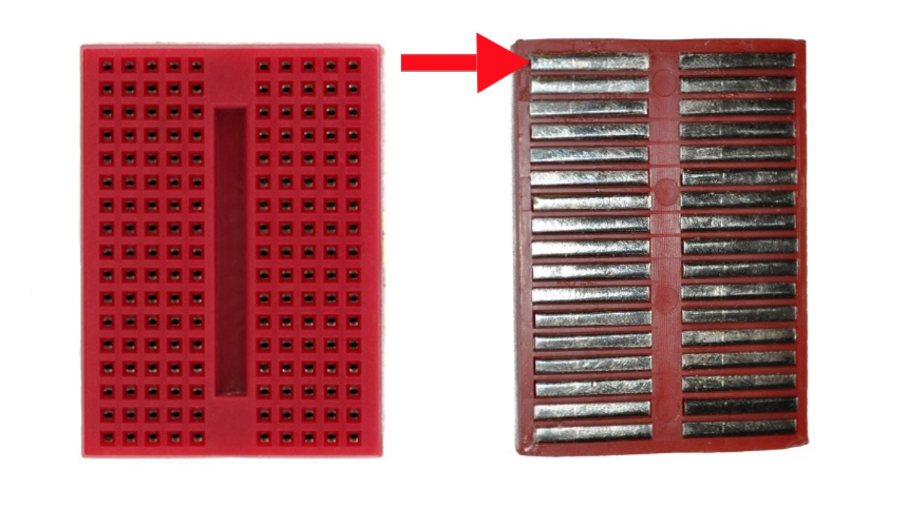

金属の帯の上側には小さな金具（クリップ）があり、プラスチックの穴の下に隠れている。
それぞれの金属帯と差し込み穴は、0.1インチ（2.54mm）という規格化された間隔で並んでいる。
このクリップのおかげで、電線や部品の足を穴に差し込むだけで、その場に固定できる。

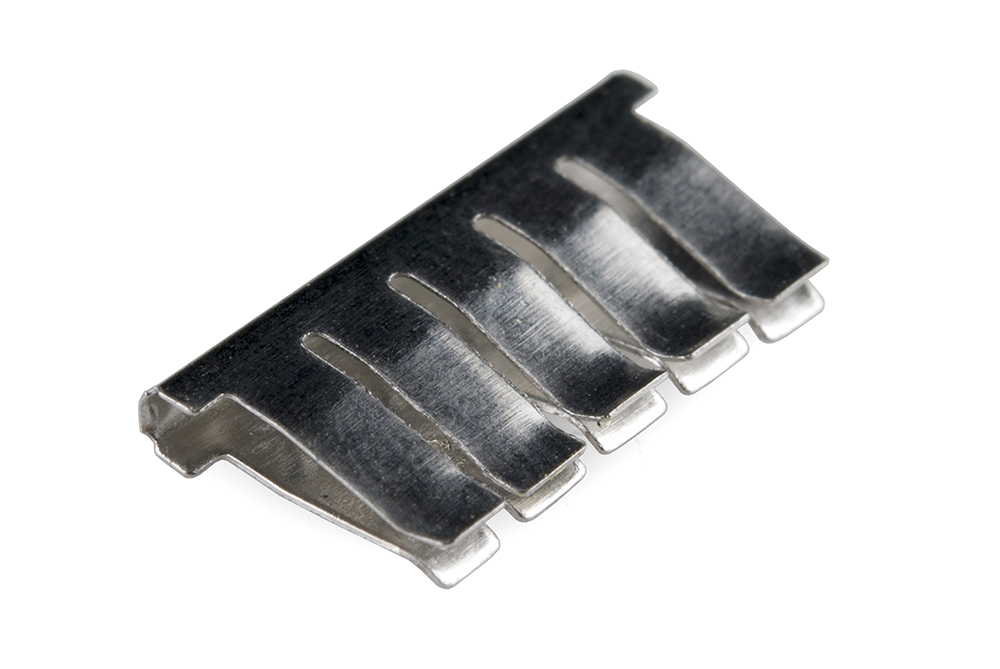

差し込んだ部品は、その行にある他のどの穴に差し込んだものとも電気的につながる。
これは、金属帯自体が導電性を持ち、帯の中のどの点からも電流が流れられるからである。

この金属帯にはクリップが5つしかないことに気づくだろう。
これはほとんどすべてのブレッドボードに共通する仕様である。
そのため、ブレッドボードの1つの区画には最大5個までしか部品をつなげない。
1行には穴が10個あるのに、なぜ5個までしかつなげないのか。
それは、ブレッドボードの中央に、それぞれの横一列を分断する溝があるからである。
この溝は、同じ行の両側を互いに電気的に切り離している。
その狙いについてはこの後すぐに説明するが、今のところは「同じ行でも溝の両側はつながっていない」ということだけ覚えておけば十分であり、そのため片側には5か所しか部品を差せない。

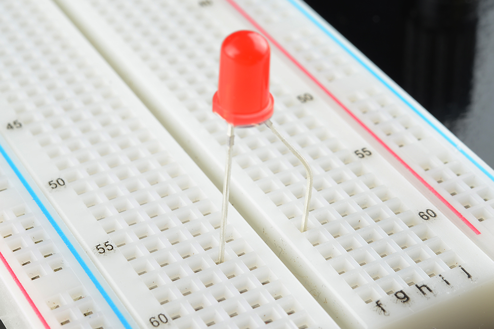

### 電源レール

ブレッドボードの中の接続のしくみがわかったところで、より一般的な、少し大きめのブレッドボードを見てみよう。
横方向の行のほかに、ブレッドボードにはたいてい**電源レール**と呼ばれる帯が、両端に縦方向に走っている。

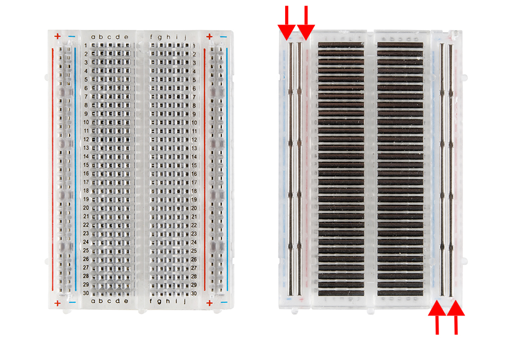

電源レールは、横方向の帯と同じ金属の帯だが、通常はレール全体がひとつながりになっている点が異なる（製品によっては上下で分かれているものもある。詳しくは後述する）。
回路を組んでいると、電源をいろいろな場所で使いたくなる場面が多い。
電源レールがあれば、回路上のどこからでも簡単に電源へアクセスできる。
たいていの場合、電源レールには「+」と「-」の表示があり、正極側には赤、負極側には青または黒の線が引かれている。

左右の電源レールはそれぞれ独立していて、互いにはつながっていない。
そのため、両側で同じ電源を使いたい場合は、ジャンパー線で両側をつなぐ必要がある。
レールの「+」「-」の表示はあくまで目安であり、必ず「+」レールに電源、「-」レールにグラウンドをつながなければならないという決まりはない。
とはいえ、常にその決まりを守っておくと、後で回路を見返したときにわかりやすい。

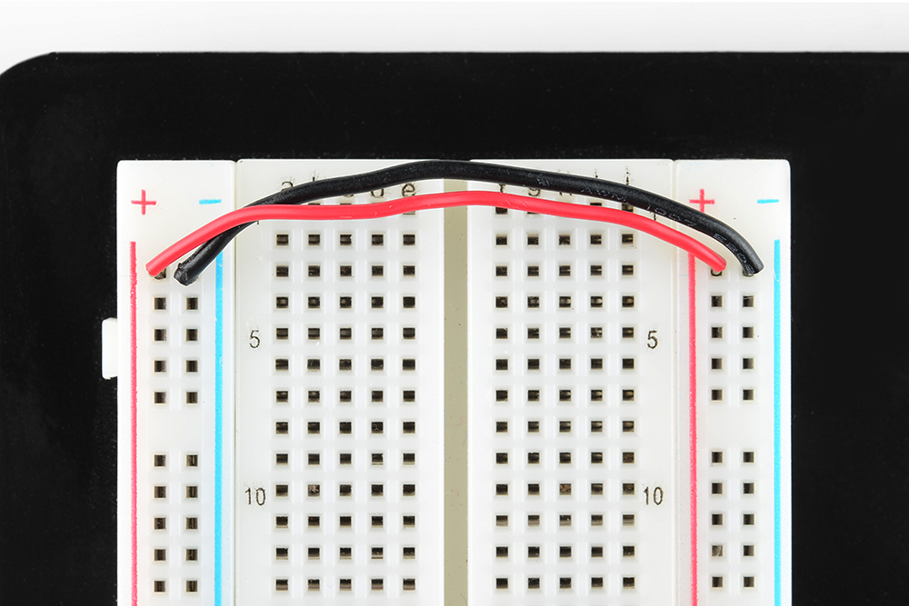

### DIPパッケージへの対応

先ほど、ブレッドボードの両側を分ける溝について触れた。
この溝には重要な役割がある。
IC（集積回路。単に「チップ」とも呼ばれる）の多くは、ブレッドボードにそのまま差し込めるように設計されている。
ブレッドボード上で場所を取りすぎないよう、これらのICは[DIP（Dual In-line Package）](https://ja.wikipedia.org/wiki/パッケージ_(電子部品))と呼ばれる形状で作られている。

DIPパッケージのICは、両側から足が伸びていて、ちょうどあの溝をまたぐ形にぴったり収まる。
ICの各足はそれぞれ役割が異なるため、両側を電気的につなげてしまっては困る。
そこで、ブレッドボード中央の溝が役に立つ。
これにより、ICの反対側の足の働きに影響を与えることなく、両側それぞれに別の部品をつなげられる。

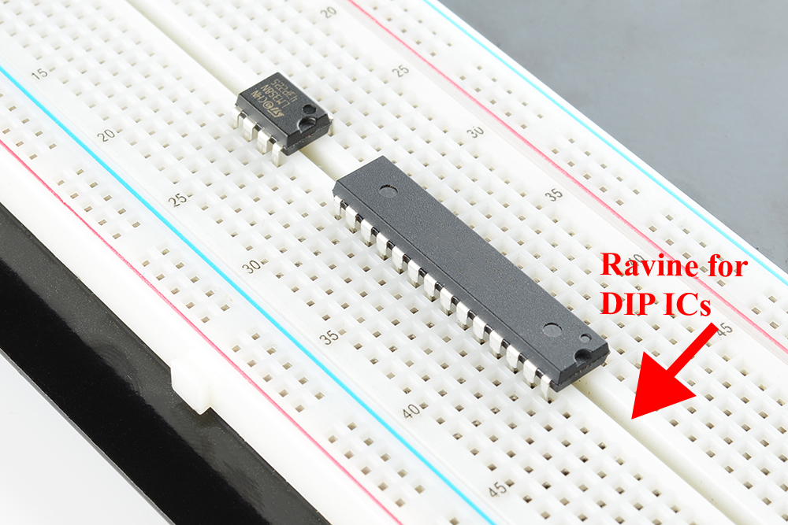

### 行と列の番号

ブレッドボードの行や列には、**数字**や**アルファベット**の表示があることに気づくだろう。
これらは回路を組む際の目印以外の役割は持たない。
回路はすぐに複雑になりやすく、部品の足を1本差し間違えただけで、回路全体が誤動作したりまったく動かなくなったりする。
接続したい行の番号がわかっていれば、目分量で位置を探すよりもずっと簡単に、狙った穴へ配線できる。

これらの表示は、[SparkFun Inventor's Kit](http://cdn.sparkfun.com/datasheets/Kits/SFE03-0012-SIK.Guide-300dpi-01.pdf)に付属するような説明書を使うときにも役立つ。
多くの書籍やガイドには回路図が載っており、それを見ながら回路を組み立てていくことになる。
ただし、書籍の回路図とまったく同じ位置にブレッドボード上で配置する必要はない。
それどころか、見た目が似ている必要すらない。
必要な電気的接続さえすべて満たしていれば、回路はどんな配置で組んでもかまわない。

### バインディングポスト

ブレッドボードの中には、**バインディングポスト**と呼ばれる接続端子が付いた台に乗っているものもある。
このポストを使うと、さまざまな種類の外部電源をブレッドボードに接続できる。
この点については、次の節でもう少し詳しく説明する。

### その他の機能

回路を組むとき、必ずしも1枚のブレッドボードに収める必要はない。
より広いスペースが必要な回路もある。
多くのブレッドボードは側面（ものによっては上下面にも）に小さな突起と溝があり、これによって複数のブレッドボードを連結し、より大きな試作用のスペースを作れる。

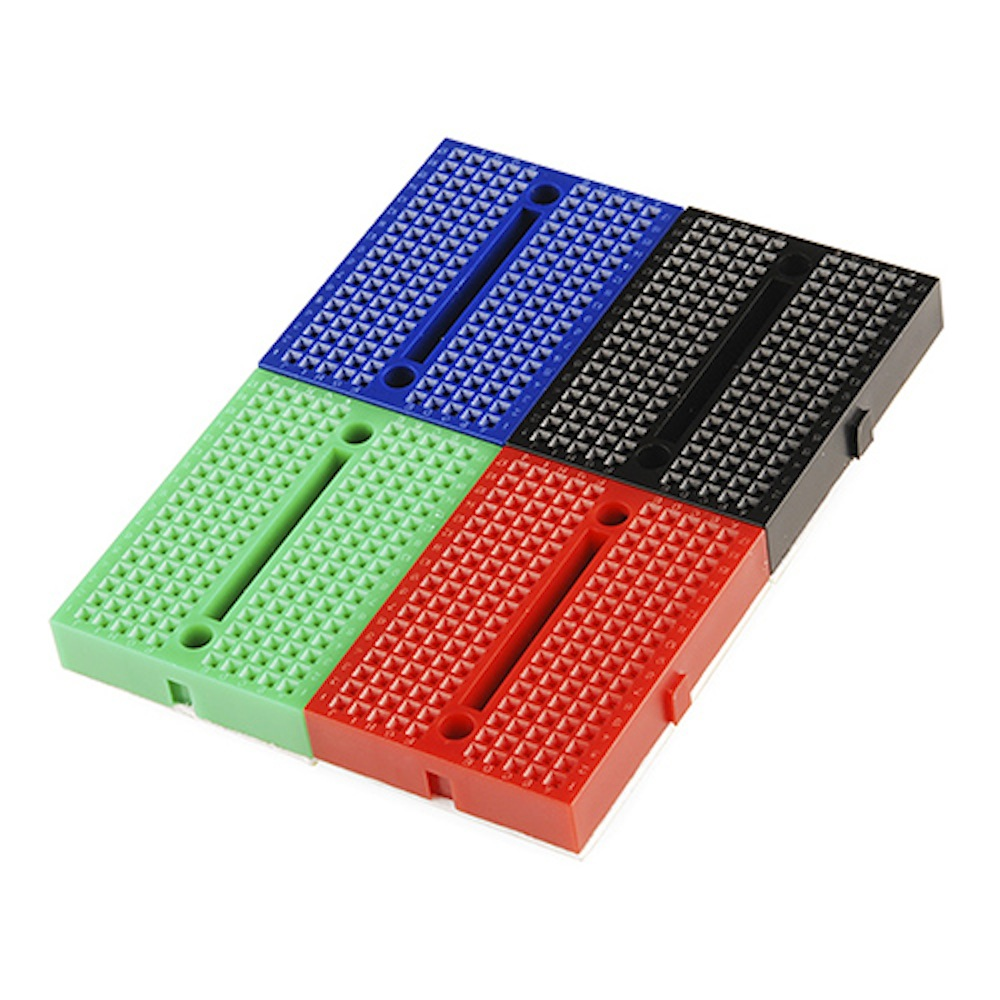

裏面に粘着シートが付いていて、さまざまな面に貼り付けられるブレッドボードもある。
自作のケースや筐体の内側にブレッドボードを固定したいときなどに便利である。

> [!NOTE]
> 大きめのブレッドボードでは、電源レールの上半分と下半分が互いに独立している（左右ではなく上下で分かれている）ことがある。
> これは、3.3Vと5Vのように異なる2つの電圧を同時に使いたいときに便利である。
> ただし、電源レールが独立しているかどうかを知らずに回路を組むと、思わぬトラブルの原因になることがある。
> テスターを使って、電源レールの導通の有無をあらかじめ確認しておくとよい。

## ブレッドボードへの電源供給

ブレッドボードに電源を供給する方法にはいくつもの選択肢がある。

### 他の電源から取る

[Arduino](https://learn.sparkfun.com/tutorials/what-is-an-arduino)のような開発ボードを使っているなら、Arduinoのメスヘッダーからそのまま電源を取り出せる。
Arduinoには電源ピンとグラウンドピンが複数あり、これをブレッドボードの電源レールや他の行に接続できる。

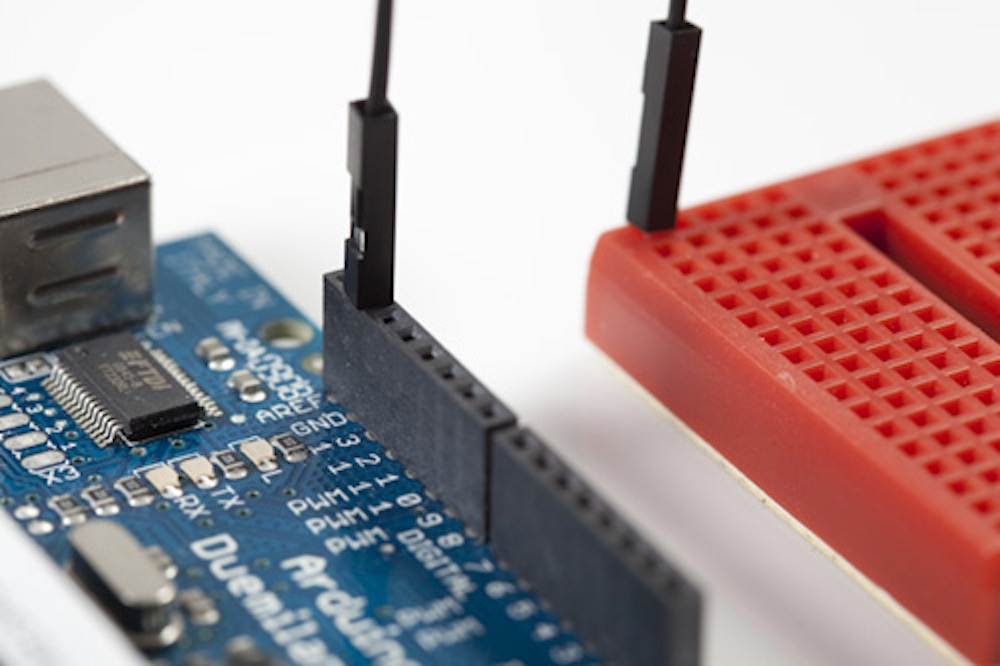

Arduino自体は、通常パソコンのUSBポートや、バッテリーパック、ACアダプター（ウォールワート）のような外部電源から電力を得ている。

### バインディングポスト

前の節で触れたとおり、ブレッドボードによってはバインディングポストが付いていて、外部電源を接続できるようになっている。

バインディングポストを使う最初の一歩は、ジャンパー線を使ってポストをブレッドボードに接続することである。
一見ポストとブレッドボードが最初からつながっているように見えるかもしれないが、実際にはつながっていない。
もしつながっていたら、電源を供給できる場所が限定されてしまう。
ブレッドボードは自由自在に組み替えられることを前提とした部品であり、バインディングポストもその例外ではない。

そこで、ポストとブレッドボードをつなぐには配線が必要になる。
やり方は、ポストのつまみを回して軸に空いた穴を露出させ、[被覆を剥いた](https://learn.sparkfun.com/tutorials/working-with-wire/how-to-strip-a-wire)ジャンパー線の先をその穴に通し、ワイヤーがしっかり固定されるまでつまみを締め直せばよい。

たいていの場合、ポストからブレッドボードに接続する必要があるのは電源用とグラウンド用の2本だけである。
別の電源も使いたい場合は、3本目のポストを利用できる。

これでポストとブレッドボードはつながったが、まだ電気は流れていない。
ポスト経由でブレッドボードに電源を供給する方法はいくつもある。

### ベンチトップ電源

多くの電子工作の実験室には、幅広い電圧や電流を回路に供給できる[ベンチトップ電源](https://www.sparkfun.com/products/9291)がある。
バナナコネクタを使えば、この電源からバインディングポストへ給電できる。

もちろん、ワニ口クリップやICフック、あるいはバナナ端子付きの他のケーブルを使って、ブレッドボードをさまざまな電源につなぐこともできる。

バインディングポストのもう1つの使い方として、[バレルジャック](https://learn.sparkfun.com/tutorials/connector-basics/power-connectors)を電線にはんだ付けし、その電線をバインディングポストに接続する方法もある。
これはやや高度な手法であり、ある程度のはんだ付けの技術が求められる。

### ブレッドボード用電源モジュール

ブレッドボードに電源を供給するもう1つの方法として、さまざまなブレッドボード用電源モジュールを使う方法もある。
SparkFunでも、ブレッドボードに直接差し込んで使える電源キットやモジュールを複数扱っている。
ウォールワートを直接差し込めるものもあれば、パソコンのUSBポートから電源を取れるものもある。
そのほとんどが電圧を切り替えられるようになっており、回路を組む際によく使う電圧に幅広く対応できる。

## 最初の回路をブレッドボードで組む

ブレッドボードの内部構造と電源の供給方法がわかったところで、いよいよ実際に使ってみよう。
まずは簡単な回路から始める。

### 必要なもの

このチュートリアルの回路で使う部品は、LED、抵抗、ボタン（タクトスイッチ）、ジャンパー線、そしてブレッドボードである。
他にも手持ちの部品があれば、それを使って回路を少し変えてみてもよい。
1つの回路にも、組み方は1通りとは限らない。
中には何十通りもの組み方ができる回路もある。

### 回路を組む

> [!NOTE]
> 警告：ブレッドボード用電源スティックを使うときは、GNDピンを「-」側のレールに、VCCピンを「+」側のレールに差し込むように注意すること。
> こうすることで、回路に逆極性の電源を加えてしまう事故を防ぎやすくなる。

ここに、ブレッドボード上に組んだ小さな回路がある。
写真に写っている赤い基板は、ヘッダーピンが[はんだ付け](https://learn.sparkfun.com/tutorials/how-to-solder-through-hole-soldering)されたブレッドボード用電源スティックであり、9Vのウォールワートからの電圧を5Vまたは3.3Vに変換して電源レールに供給している。

回路の構成は次のとおりである。

- VCC側の電源レールと、LEDの正極（アノード）側の足が配線でつながっている。
- LEDの負極（カソード）側の足は、330Ωの抵抗につながっている。
- その抵抗は、ボタンへとつながっている。
- ボタンを押すと回路がグラウンドにつながり、回路が閉じてLEDが点灯する。

### 回路図

回路図の読み方については[別のチュートリアル](https://learn.sparkfun.com/tutorials/how-to-read-a-schematic)で扱っているが、回路を組むうえで非常に重要な知識なので、ここでも簡単に触れておく。

**回路図**は、世界中の誰もが理解し、回路を組み立てられるようにするための共通の記号体系である。
電子部品にはそれぞれ固有の回路図記号があり、これらの記号をさまざまなソフトウェアを使って組み合わせることで回路図ができあがる。
もちろん、手描きで回路図を書いてもかまわない。
電子工作や回路設計の世界にさらに深く踏み込みたいなら、回路図を読めるようになることは非常に重要な一歩である。

上で紹介した回路の回路図を見てみよう。
上部の矢印は電源を表す（スイッチが5V側に切り替わっているとする）。
そこからLED（矢印の出ている三角形と線の記号）へとつながり、LEDは抵抗（ギザギザの線）につながる。
その先はボタン（掛け金のような形の記号）につながり、最後にボタンはグラウンド（下部の水平線）につながっている。

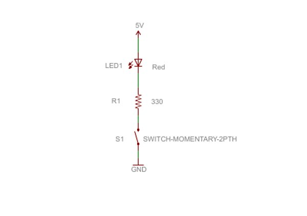

一見すると回路図は奇妙な描き方に見えるかもしれないが、何十年も前から使われてきた基本的な表記法である。
回路図があるおかげで、国籍や言語が異なる人どうしでも、誰かが設計した回路を組み立てたり、共同で開発したりできる。
すでに述べたとおり、1つの回路の*組み方*には何通りもの方法があるが、この回路図が示すように、必ず満たさなければならない接続関係も存在する。
この回路図から外れた配線をすれば、まったく別の回路になってしまう。

### 習うより慣れよ

最後に伝えておきたいのは、実際にブレッドボードを使わなくても回路を組めるツールやソフトウェアが数多くあるということである。
SparkFunでよく使われているソフトウェアの1つが[Fritzing](http://fritzing.org/)である。
Fritzingは無料のソフトウェアで、仮想的なブレッドボード上で自分の回路を組み立てられる。
組み立てた回路の回路図も自動的に生成してくれる。
先ほどと同じ回路をFritzingで組んだものを見てみよう。

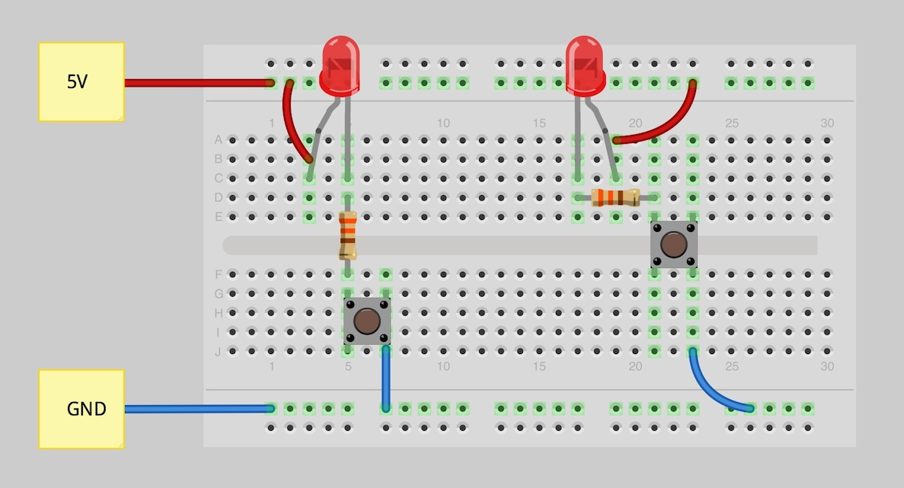

Fritzing以外にも同様のソフトウェアは数多くあり、無料のものも有料のものもある。
中には、組んだ回路をシミュレーションで動作確認できるものもある。
自分に合ったツールを探してみるとよい。

## まとめ

ここまでで、ブレッドボードとは何か、どう動作するのかが理解できたはずである。
ここからが本当の面白さの始まりであり、ブレッドボードで回路を組むという世界は、まだほんの入り口に触れたにすぎない。
部品の使い方や、それらをブレッドボード上の回路に組み込む方法について、さらに学べるチュートリアルを以下に挙げる。

- [抵抗器](./resistors.md)
- [コンデンサ](./capacitors.md)
- [ダイオード](./diodes.md)
- [発光ダイオード](./light-emitting-diodes-leds.md)
- [シフトレジスタ](https://learn.sparkfun.com/tutorials/shift-registers)
- [集積回路](./integrated-circuits.md)

回路を組む技術がある程度身についたら、次のレベルとして、次のようなチュートリアルにも挑戦してみてほしい。

- [はんだ付けの基本](./how-to-solder-through-hole-soldering.md)
- [はんだ付け対応ブレッドボードの使い方](./large-solderable-breadboard-hookup-guide.md)
- [PCB基板の基礎](./pcb-basics.md)
- [電子部品の組み立て](./electronics-assembly.md)
- [PCB設計ツールEagleの使い方](./how-to-install-and-setup-eagle.md)

タグ: 電気工学、プロトタイピング、スキル

---

出典：[How to Use a Breadboard](https://learn.sparkfun.com/tutorials/how-to-use-a-breadboard)（SparkFun Learn）を日本語に翻訳し、再構成した。
原文は [CC BY-SA 4.0](https://creativecommons.org/licenses/by-sa/4.0/) ライセンスで公開されており、本ページも同ライセンスの下で提供する。
