# テスターの使い方

[テスター（マルチメーター）](https://ja.wikipedia.org/wiki/回路計)は、いったいどう使えばいいのか。
このチュートリアルでは、デジタルマルチメーター（DMM）の使い方を説明する。
これは回路の診断や、他の人が設計した電子回路の理解、さらには電池のチェックにまで使える必須の道具であり、「マルチ（複数の）」「メーター（測定器）」という名前もそこから来ている。

もっとも基本的な測定対象は電圧と電流である。
テスターは、基本的な動作確認やトラブルシューティングにも大いに役立つ。
回路が動かない、スイッチはちゃんと機能しているのか。
そんなときはテスターを当ててみればよい。
テスターは、システムのトラブルシューティングにおける最初の頼みの綱である。
このチュートリアルでは、[電圧、電流、抵抗](./voltage-current-resistance-and-ohms-law.md)、そして導通の測定方法を扱う。

参考になるチュートリアル:

- [電気とは何か](./what-is-electricity.md)
- [電圧、電流、抵抗とオームの法則](./voltage-current-resistance-and-ohms-law.md)
- [回路とは何か](./what-is-a-circuit.md)
- [メートル法の接頭辞](./metric-prefixes-and-si-units.md)
- [ブレッドボードの使い方](./how-to-use-a-breadboard.md)
- [コネクタの基礎](./connector-basics.md)
- [極性](./polarity.md)
- [直列回路と並列回路](./series-and-parallel-circuits.md)
- [交流と直流の違い](./alternating-current-ac-vs-direct-current-dc.md)
- [PCB基板の基礎](./pcb-basics.md)

> [!NOTE]
> このチュートリアルではSparkFun VC830Lというテスターを例に説明するが、ここで紹介する方法はほとんどのテスターに当てはまる。

## テスターの各部

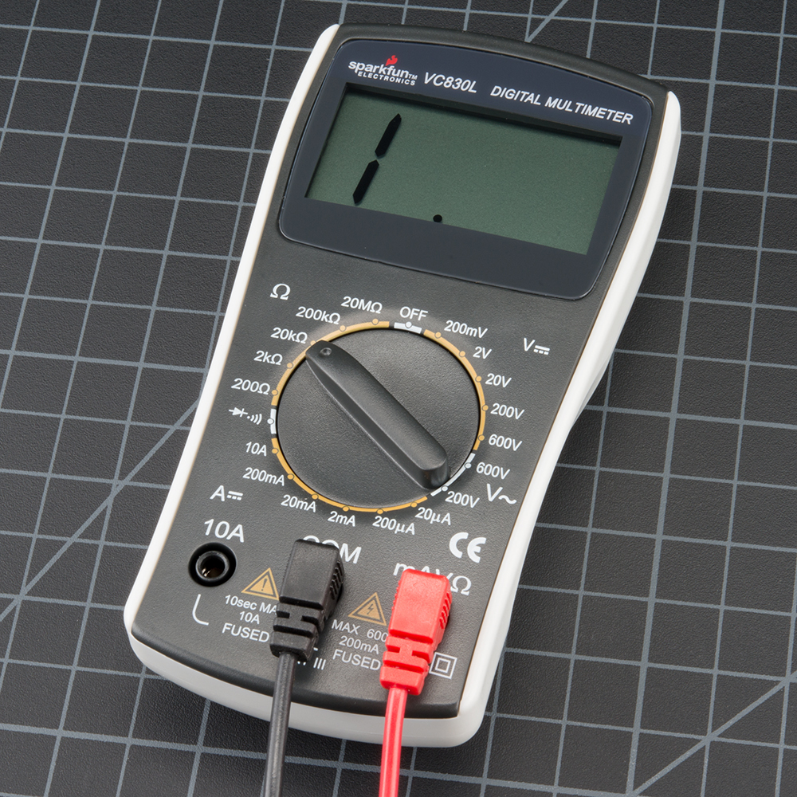

テスターは3つの部分からできている。

- 表示部
- レンジ切り替えつまみ
- 端子

**表示部**は、たいてい4桁の数字と、マイナス記号を表示できる。
薄暗い場所でも見やすいよう、バックライト付きの表示部を持つテスターもある。

**レンジ切り替えつまみ**を使うと、[電流](./voltage-current-resistance-and-ohms-law.md)（ミリアンペア、mA）、[電圧](./voltage-current-resistance-and-ohms-law.md)（V）、[抵抗](./voltage-current-resistance-and-ohms-law.md)（Ω）など、測定したい対象を切り替えられる。

2本のプローブを、本体前面にある**端子**のうち2つに差し込んで使う。
**COM**は「コモン（共通）」を意味し、ほぼ常に回路のグラウンドや「-」側につなぐ。
COM用のプローブは慣習的に黒色だが、赤いプローブとのあいだに色以外の違いはない。
**10A**は、大きな電流（200mAを超えるもの）を測るときに使う特別な端子である。
**mAVΩ**は、赤いプローブを差し込むのが慣習になっている端子であり、電流（200mAまで）、電圧（V）、抵抗（Ω）を測定できる。
プローブの先端には*バナナ*タイプのコネクタが付いていて、これをテスター本体に差し込む。
バナナプラグのプローブであれば、どんなものでもこのテスターで使え、[さまざまな種類のプローブ](https://www.sparkfun.com/search/results?term=banana&what=products)を使い分けられる。

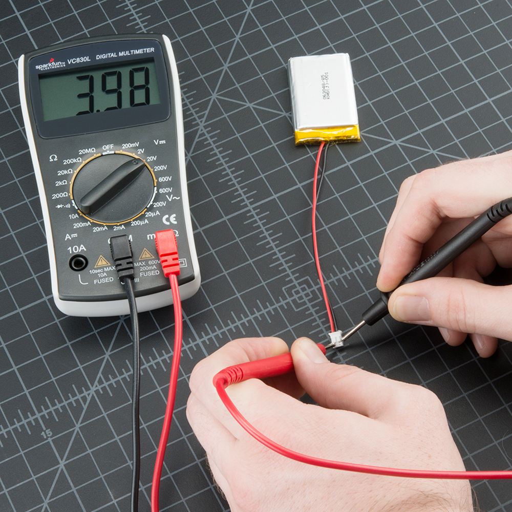

## プローブの種類

テスター用のプローブには、[さまざまな種類](https://www.sparkfun.com/search/results?term=banana&what=products)が用意されている。
よく使うものをいくつか紹介する。

- **バナナ - ワニ口クリップ**：太い電線やブレッドボードのピンに接続するのに適している。回路を操作しながらプローブを手で押さえておかなくてよいので、長時間のテストに向いている。
- **バナナ - ICフック**：小型のICや、ICの足を挟むのに適している。
- **バナナ - ピンセット**：SMD部品をテストしたいときに便利である。
- **バナナ - テストプローブ**：もしプローブを1本壊してしまっても、安価に交換できる。

## 電圧を測定する

まずは単3形電池の電圧を測ってみよう。
黒いプローブを**COM**に、赤いプローブを**mAVΩ**に差し込む。
テスターを直流（DC）レンジの「2V」に設定する。
携帯型の電子機器のほとんどは、[交流](https://learn.sparkfun.com/tutorials/alternating-current-ac-vs-direct-current-dc/alternating-current-ac)ではなく[直流](https://learn.sparkfun.com/tutorials/alternating-current-ac-vs-direct-current-dc/direct-current-dc)で動作している。
黒いプローブを電池のグラウンドまたは「-」側に、赤いプローブを電源または「+」側に当てる。
単3形電池の正極と負極の端子に、軽く力を入れてプローブを押し当てる。
新品の電池であれば、表示部にはおよそ1.5V前後の値が表示されるはずである（この電池は新品なので、電圧は1.5Vより少し高くなっている）。

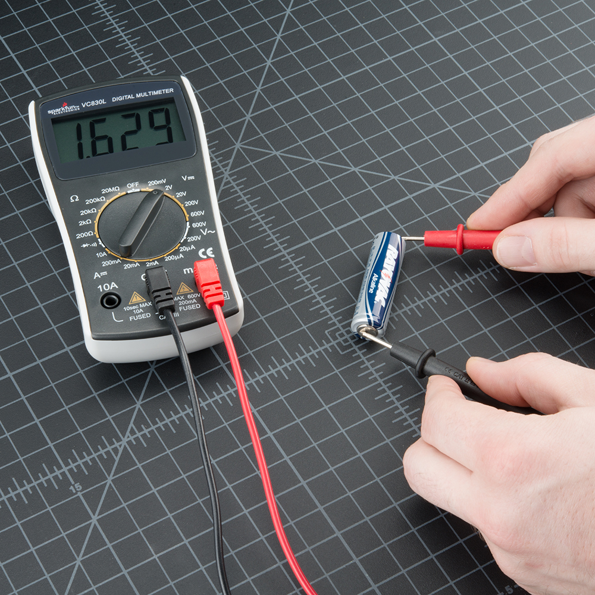

電池やArduinoにつないだセンサーのような直流電圧を測るときは、まっすぐな線が引かれた「V」の位置につまみを合わせる。
壁のコンセントから来るような交流電圧は危険なので、交流電圧の設定（波線が添えられた「V」）を使う場面はめったにない。
交流を扱う必要があるなら、デジタルマルチメーターよりも[非接触式のテスター](https://www.google.com/#hl=en&q=fluke%20non-contact%20voltage%20tester)を使うことをおすすめする。

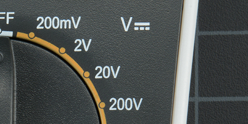

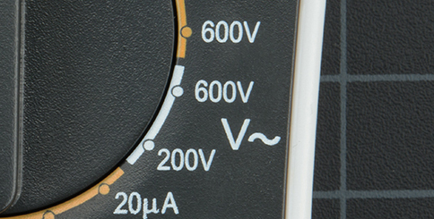

赤と黒のプローブを入れ替えたらどうなるか。
表示される値の符号が単純に反転するだけであり、何も悪いことは起きない。
テスターは、コモン側のプローブを基準にして電圧を測定する。
電池の「+」側は、コモン（マイナス側のピン）と比べてどれだけ電圧が高いか。
1.5Vである。
プローブを入れ替えると、今度は「+」側がコモン、つまり基準の0点になる。
その新しい基準点と比べて、電池の「-」側の電圧はどうなるか。
-1.5Vになる。

続いて、実際の場面で電圧を測る流れを、簡単な回路で確かめてみよう。
回路は単純で、1kΩの抵抗と青色の高輝度LEDを、[SparkFun Breadboard Power Supply Stick](https://www.sparkfun.com/products/10804)で駆動しているだけのものである。
まず、取り組んでいる回路に正しく電源が入っているかを確認する。
回路が5Vであるはずなのに4.5V未満だったり5.5Vを超えていたりしたら、それだけで何かがおかしいとすぐにわかり、電源の接続や配線を確認する必要が出てくる。

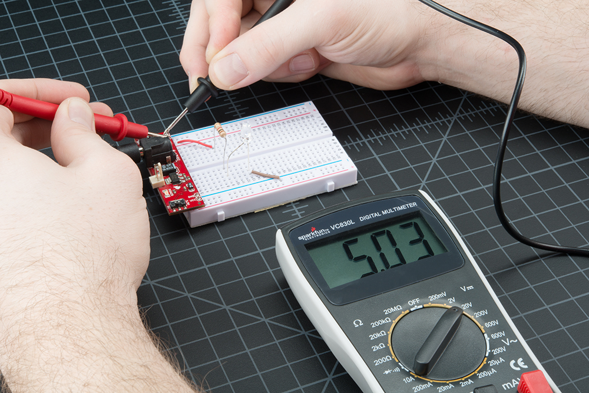

つまみをDCレンジの「20V」（直流電圧レンジは、まっすぐな線の「V」で示される）に合わせる。
テスターの多くはオートレンジ式ではないため、測定対象に合ったレンジを自分で選ぶ必要がある。
たとえば**2V**レンジは**2ボルトまで**、**20V**レンジは**20ボルトまで**測定できる。
そのため12Vの電池を測るなら20Vレンジを使う。
5V系の回路でも20Vレンジを使う。
レンジの選び方を間違えると、表示が切り替わって「1」と表示されることが多い。

力を少し込めて（焼いた肉にフォークを刺すようなイメージで）、露出した金属部分にプローブを押し当てる。
一方のプローブはGNDの接続部に、もう一方はVCCまたは5Vの接続部に当てる。

回路の別々の部分を測定することもできる。
これは[節点解析](https://ja.wikipedia.org/wiki/回路網解析)と呼ばれる手法であり、回路解析の基本的な考え方の1つである。
回路の各部分の電圧を測ることで、それぞれの部品にどれだけの電圧が必要かがわかる。
まずは回路全体を測ってみよう。
抵抗に電圧が入ってくる場所から、LED側のグラウンドまでを測ると、回路全体の電圧、つまりおよそ5V前後が表示されるはずである。

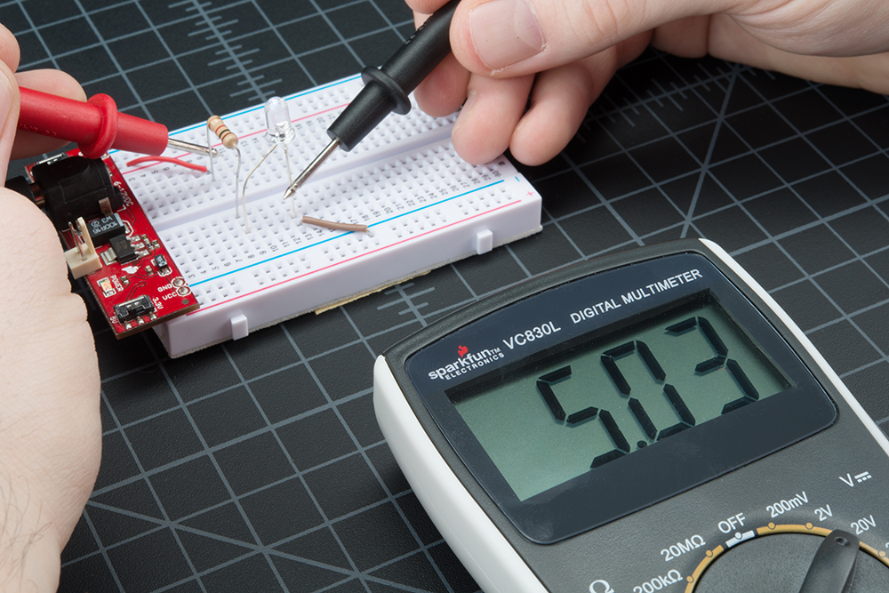

次に、LEDがどれだけの電圧を使っているかも見てみよう。
これは、LEDの**電圧降下**と呼ばれるものである。
今の時点でピンとこなくても心配はいらない。
電子工作を学び進めるうちに、自然と理解できるようになる。
ここで押さえておくべき重要な点は、回路のさまざまな部分を測定することで、回路全体を分析できるということである。

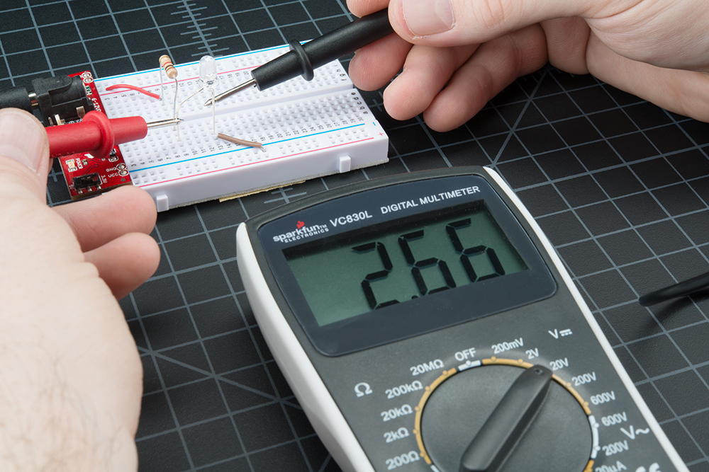

### 過負荷（オーバーロード）

測定しようとしている電圧に対して低すぎるレンジを選んだらどうなるか。
悪いことは何も起きない。
テスターは単に「1」と表示する。
これは、テスターが過負荷、つまりレンジ外であることを知らせているサインである。
測定しようとしている値が、そのレンジには大きすぎるということなので、テスターのつまみを1段階上のレンジに変えてみればよい。

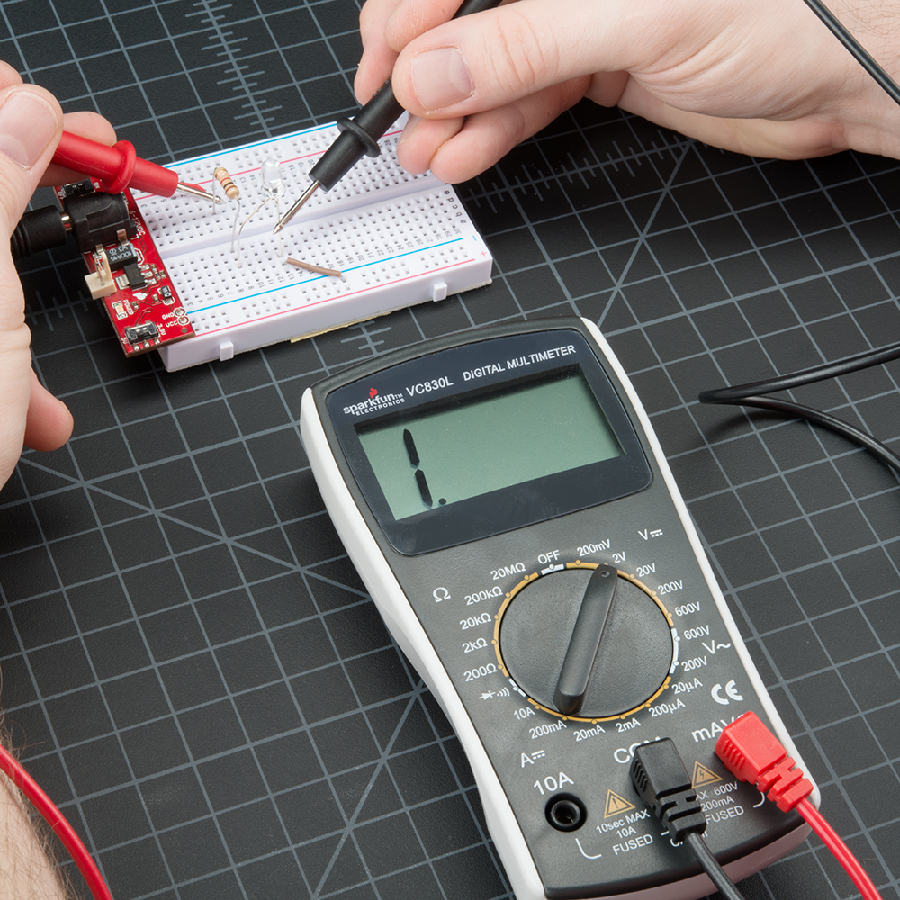

### レンジ切り替えつまみ

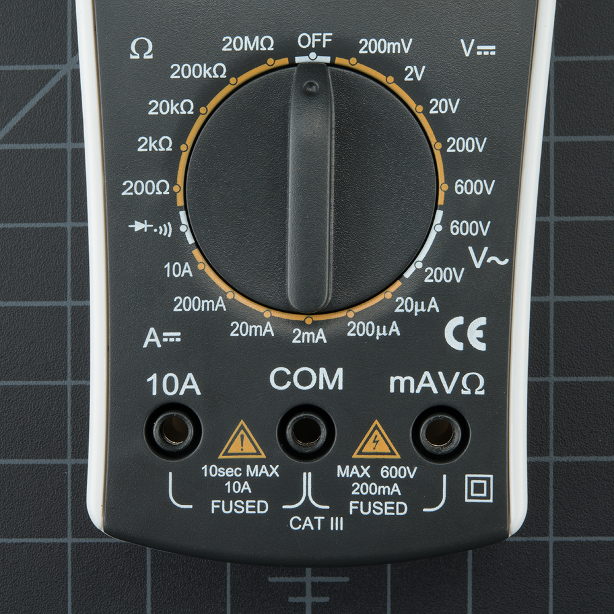

つまみの表示はなぜ10Vではなく20Vになっているのか。
20V未満の電圧を測りたいときは、20Vレンジに合わせる。
これにより、**2.00**から**19.99**までの範囲を読み取れる。

多くのテスターでは、表示の最初の桁は「1」しか表示できない。
そのため測定範囲は**9**9.99ではなく**1**9.99までに制限される。
これが、99Vではなく20Vが上限になっている理由である。

> [!NOTE]
> 警告：基本的には、直流の回路（テスターのつまみでまっすぐな線が引かれている設定）だけを扱うようにすること。
> 多くのテスターは交流（AC）も測定できるが、交流回路は危険を伴う。
> 壁のコンセントの交流、いわゆる「主電源電圧」は、うっかり触れるとかなりの衝撃を受けるようなものである。
> 交流を扱うときは、細心の注意を払うこと。
> コンセントに電気が来ているかどうかを確かめたいだけなら、交流用の検電器を使うほうがよい。
> 交流の電圧を測る必要が出てくるのは、コンセントの様子がおかしいとき（本当に110Vや100Vが来ているのか）や、電熱器のようなヒーターを制御しようとしているときくらいである。
> 交流回路を測定するときは、慎重に、すべてを二重に確認しながら進めること。

## 抵抗を測定する

一般的な[抵抗器](./resistors.md)にはカラーコードが記されている。
その読み方がわからなくても心配はいらない。
簡単に使える[オンラインの計算ツール](https://www.google.com/search?q=resistor+color+calculator)がたくさんある。
それでも、インターネットにつなげない場面では、テスターで実際の抵抗値を測るのが便利である。

適当な抵抗器を1本選び、テスターを20kΩレンジに合わせる。
キーボードのキーを押すのと同じくらいの力加減で、抵抗器の足にプローブを押し当てる。

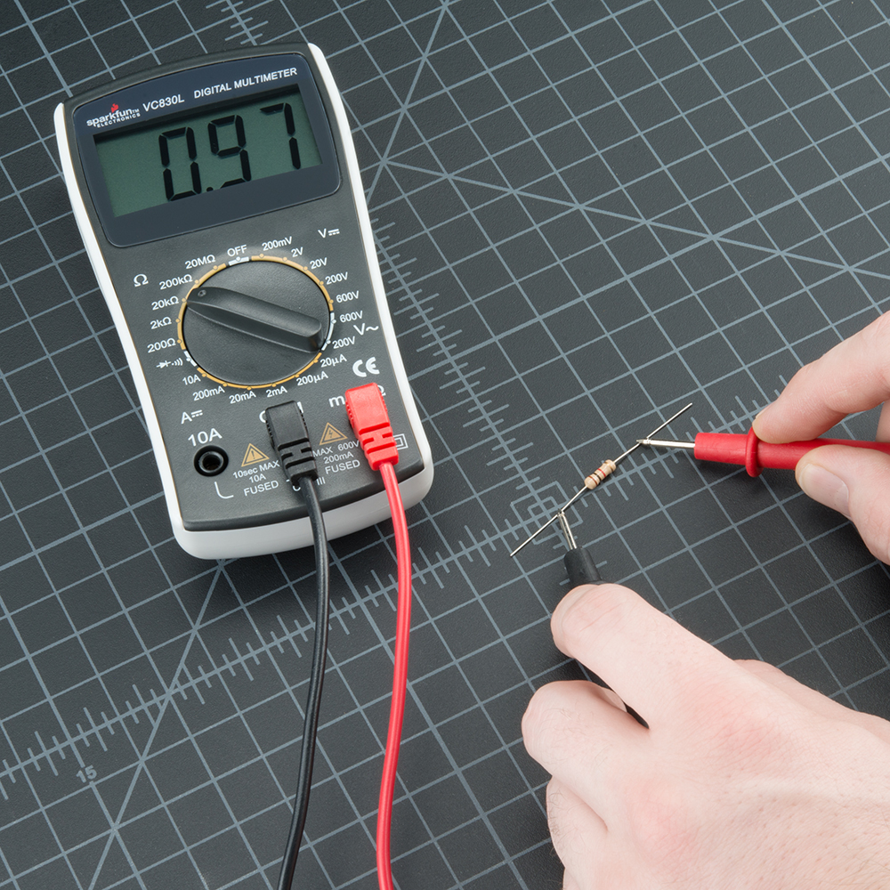

表示部には、**0.00**、**1**、あるいは**実際の抵抗値**のいずれかが表示される。

- 今回の例では0.97と表示されており、これはこの抵抗器の値が970Ω、つまりおよそ1kΩであることを意味する（20kΩ、つまり20,000オームのレンジなので、小数点を右に3桁分ずらして970オームと読む）。
- テスターが**1**または**OL**と**表示された**場合は過負荷であり、**200kΩ**や**2MΩ**（メガオーム）といった、より大きなレンジを試す必要がある。これが起きても問題はなく、単にレンジのつまみを調整すればよいだけである。
- テスターが**0.00**やそれに近い値を示した場合は、**2kΩ**や**200Ω**といった、より小さなレンジに切り替える必要がある。

多くの抵抗器には5%の誤差があることを覚えておいてほしい。
つまり、カラーコードが10,000オーム（10kΩ）を示していても、製造工程のばらつきによって、実際の10kΩ抵抗器は9.5kΩから10.5kΩのあいだのどこかになりうる。
心配はいらない、プルアップ用や一般的な用途の抵抗としては、それで十分に機能する。

つまみを1段階下げて2kΩレンジにしてみよう。
どうなるだろうか。
大きな変化はない。
この抵抗器（1kΩ）は2kΩより小さいので、引き続き表示部に値が出る。
ただし、小数点以下の桁が1つ増え、少しだけ細かい値まで読み取れるようになっているはずである。
では、さらに1段階下げるとどうなるか。
1kΩは200Ωより大きいので、今度はレンジの上限を超えてしまい、過負荷であることを示す表示になり、より大きなレンジに戻す必要が出てくる。

経験則として、1オーム未満の抵抗器を見かけることはめったにない。
抵抗の測定は完璧ではないということも覚えておいてほしい。
温度は測定結果に大きく影響する。
また、部品を回路に実装したまま抵抗を測定するのは、なかなか厄介なことも多い。
基板上の周囲の部品が、測定結果に大きな影響を与えることがある。

## 電流を測定する

組み込み電子工作の世界で、電流の測定はもっとも扱いにくく、それでいてもっとも多くの情報を与えてくれる測定の1つである。
扱いにくい理由は、電流は[直列](./series-and-parallel-circuits.md)に測定しなければならないからである。
電圧はVCCとGNDに（[並列](./series-and-parallel-circuits.md)に）プローブを当てるだけで測れるのに対し、電流を測るには実際に電流の流れを物理的に断ち切り、その間にテスターを割り込ませる必要がある。
これを確かめるために、電圧測定の節で使ったのと同じ回路を使う。

まず必要になるのが、もう1本の電線である。
すでに述べたとおり、電流を測るには物理的に回路を断ち切る必要がある。
言い換えると、抵抗につながっているVCCの配線を一度引き抜き、その接続先だった場所に新しい配線を追加し、電源のプラス端子から抵抗までのあいだにテスターを挟み込む。
これにより、回路への電力が実質的に「切断」される。
そのうえでテスターを直列に挿入し、電流がブレッドボードへ「流れ込む」道筋の途中で測定できるようにする。

今回の写真では、簡単のため[ワニ口クリップ](https://www.sparkfun.com/products/509)を使っている。
電流を測るときは、数秒から数分にわたってシステムの様子を観察したくなることが多い。
その間ずっとプローブを手で押さえておくのは大変なので、両手を空けられるワニ口クリップ付きのプローブが役に立つ。
なお、ほとんどのテスターは同じ大きさの端子（「バナナプラグ」と呼ばれる）を使っているので、いざというときは友人のプローブを借りることもできる。

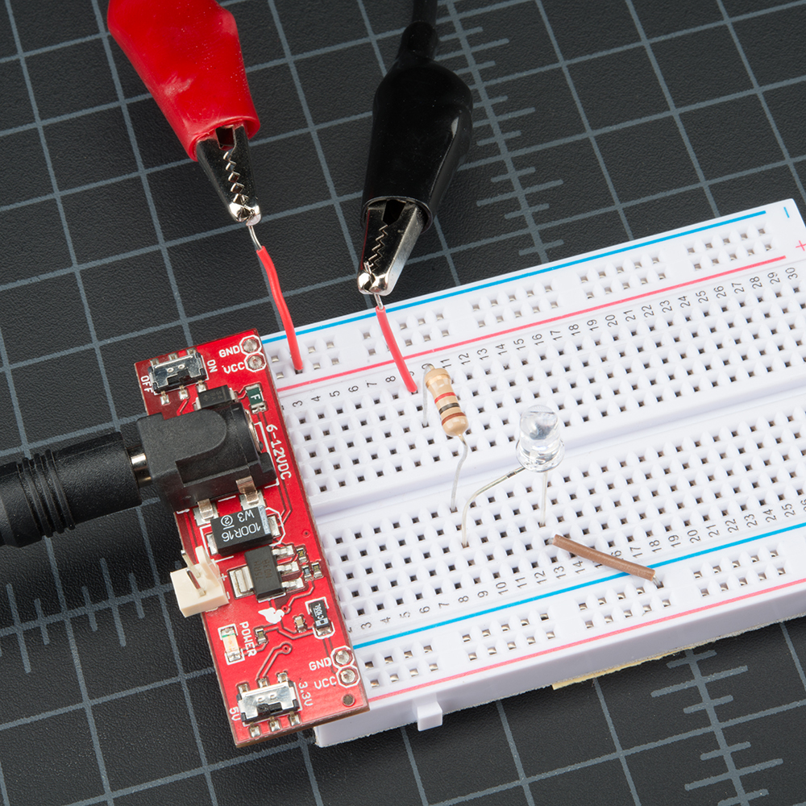

テスターを接続したら、つまみを適切なレンジに合わせて電流を測定する。
電流の測定も、電圧や抵抗と同じように、正しいレンジを選ぶ必要がある。
テスターを200mAレンジに合わせ、そこから調整していく。
ブレッドボードで作る多くのプロジェクトの消費電流は、たいてい200mA未満である。
赤いプローブが、ヒューズ付きの200mA端子に差し込まれていることを確認する。
今回使っているテスターでは、200mA用の端子は電圧や抵抗の測定と同じ端子（**mAVΩ**という表示のある端子）を兼用している。
つまり、電流、電圧、抵抗のどれを測るときも、赤いプローブは同じ端子に差したままでよい。
ただし、回路が200mAに近い、あるいはそれを超える電流を使いそうな場合は、念のためプローブを10A側に差し替えること。
電流の許容量を超えると、単に過負荷の表示が出るだけでなく、ヒューズが飛んでしまうことがある（この点については後述する）。

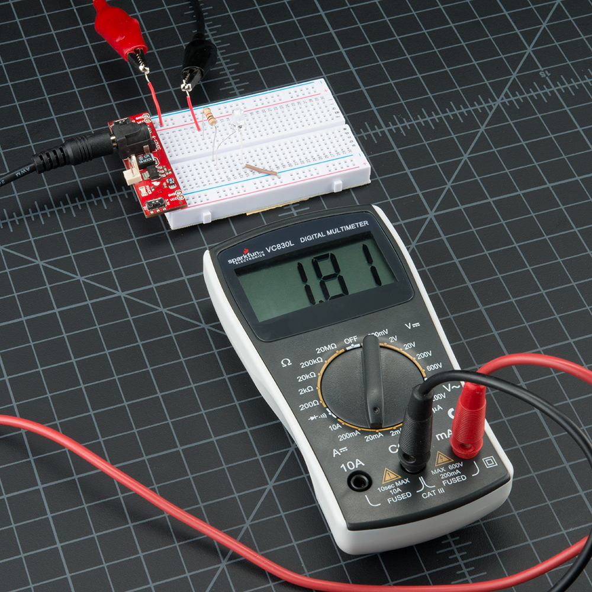

このとき、テスター自体が1本の電線のように振る舞っていることに注意してほしい。
これによって回路が完成し、電源が入る。
これが重要なのは、時間の経過とともにLEDやマイコン、センサーなど、測定対象の消費電力が変化することがあるからである（たとえばLEDが点灯した瞬間に消費電流が20mA増え、消灯した瞬間にまた減る、といった具合である）。
テスターの表示部には、その瞬間の電流値が表示されるはずである。
どのテスターも、ある程度の時間にわたる測定値から**平均**を計算して表示しているため、値は多少ふらつくものだと考えておくとよい。
一般に、安価なテスターほど平均化の効き方が強く、反応も遅いため、表示される値は多少割り引いて見てほしい。
おおまかな範囲、たとえば通常の5V環境で7〜8mA程度、という程度の感覚で捉えておけばよい（7.48mAというような細かい値にこだわらなくてよい）。

他の測定と同じく、電流を測るときもプローブの色は関係ない。
プローブを入れ替えるとどうなるか。
何も悪いことは起きず、単に電流の表示がマイナスになるだけである。
電流自体はシステムの中を変わらず流れ続けており、見ている向きが変わって、表示がマイナスになっただけである。

> [!NOTE]
> 覚えておいてほしいのは、テスターを使い終わったら、必ず電圧測定モードに戻しておくということである（プローブを電圧用の端子に戻し、必要であれば直流電圧レンジに切り替える）。
> 2点間の電圧をさっと測ろうとしてテスターを手に取ったとき、電流測定モードのままになっていることはよくある。
> その状態では表示部に電圧が出ず、代わりに「0.000」と表示され、VCCとGNDのあいだに電流が流れていないように見えてしまう。
> しかしその一瞬のうちに、テスターを介してVCCとGNDを直結してしまっており、200mAのヒューズが飛んでしまう。これはよろしくない。
> だから、その日の作業を終えてテスターを置くときは、次に使う人（未来の自分を含む）に優しい状態にしておくことを忘れないようにする。

電流の測定は、最初の数回はうまくいかないことも多い。
ヒューズを飛ばしてしまっても心配はいらない、私たちも何十回とやらかしてきた。
ヒューズの交換方法は、後の「ヒューズを交換する」の節で説明する。

## 導通を確認する

**導通テスト**とは、2点間の抵抗を調べる操作のことである。
抵抗が非常に低ければ（数Ω未満）、その2点は電気的につながっていると判断され、音が鳴る。
数Ωを超える抵抗があれば回路は開いていると判断され、音は鳴らない。
このテストは、2点間の接続が正しくできているかを確認するのに役立つほか、本来つながっているべきではない2点がつながっていないかを確認するのにも役立つ。

導通テストは、組み込みハードウェアに携わる人にとって、おそらく単一の機能としてはもっとも重要なものである。
この機能を使えば、材料の導電性を調べたり、配線がどこでつながっていて、どこでつながっていないかをたどったりできる。

テスターを「導通」モードに設定する。
DMMの機種によって表示は異なるが、スピーカーから音が伝わっていくような波形が添えられたダイオードの記号を探すとよい。

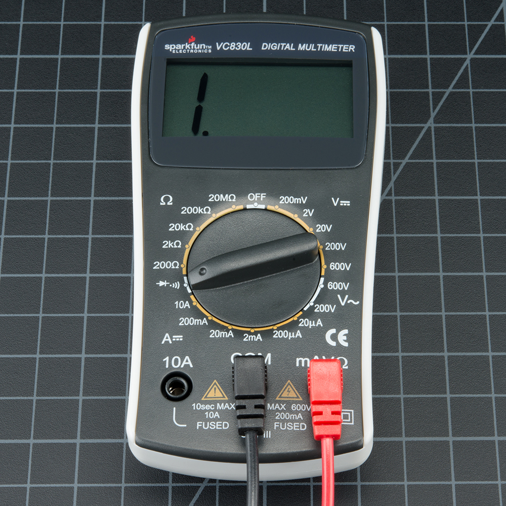

2本のプローブの先端を触れ合わせてみる。
テスターから音が鳴るはずである（注：すべてのテスターに導通モードがあるわけではないが、たいていのものには備わっている）。
これは、プローブの間にごくわずかな電流が、抵抗なし（あるいは非常に小さな抵抗）で流れられることを示している。

> [!NOTE]
> 警告：導通を確認するときは、基本的にシステムの電源を切っておくこと。

電源が入っていないブレッドボードで、2本のプローブを別々のグラウンドピンに当ててみる。
つながっていることを示す音が聞こえるはずである。
続いて、マイコンのVCCピンから電源のVCCまでプローブを当ててみる。
VCCピンからマイコンまで電流が自由に流れられることを示す音が鳴るはずである。
音が鳴らなければ、銅箔パターンをたどっていき、配線やブレッドボード、PCBのどこかで断線していないかを確認していける。

導通テストは、2つのSMDピンが接触しているかどうかを確かめるのにも役立つ。
目で見てもわからないときは、たいていテスターが頼りになる2つ目の確認手段になる。

システムが動かないとき、導通テストはトラブルシューティングのもう1つの手がかりになる。
次のような手順を踏むとよい。

1. システムの電源が入っているなら、電圧レンジでVCCとGNDを慎重に確認し、電圧が正しいレベルになっているかを確かめる。5V系のはずが4.2Vしか出ていない場合は、レギュレータを念入りに確認する。レギュレータが異常に熱くなっていたら、システムが電流を消費しすぎているサインかもしれない。
2. システムの電源を切り、VCCとGNDのあいだの導通を確認する。導通があれば（音が鳴れば）、どこかにショートがある。
3. システムの電源を切ったまま、導通テストでVCCとGNDがマイコンや他の部品のピンに正しく配線されているかを確認する。システム全体には電源が入っていても、個々のICの配線が間違っていることもある。
4. マイコンが動くところまで確認できたら、テスターはいったん脇に置き、シリアル通信でのデバッグや、ロジックアナライザーを使ったデジタル信号の確認に進む。

**導通テストと大きなコンデンサ：** 通常のトラブルシューティングでは、グラウンドとVCCレールのあいだの導通を確認することが多い。
これは、試作した回路の電源を入れる前に、電源系統にショートがないかを確かめるよい方法である。
ただし、プローブを当てた瞬間に短く「ピッ」と鳴っても驚かないでほしい。
これは、電源系統にはたいてい相応の静電容量が存在しているためである。
テスターは2点間がつながっているかどうかを、非常に低い抵抗を基準に判定している。
コンデンサは、エネルギーが満ちるまでの一瞬だけショートのようにふるまい、満ちた後は開放状態のようにふるまう。
そのため、短く「ピッ」と鳴った後は何も鳴らなくなる。
それでよいのであって、単にコンデンサが充電されているだけである。

## ヒューズを交換する

新しくテスターを使い始めた人がやりがちなもっともよくある失敗が、ブレッドボード上でVCCからGNDへ直接プローブを当てて電流を測ろうとすることである（これはよくない）。
これをすると、テスターを介して電源とグラウンドが即座にショートし、ブレッドボードの電源が瞬断してしまう。
テスターに大電流が流れ込むと、内部のヒューズが発熱し、200mAを超える電流が流れることでやがて焼き切れる。
これはほんの一瞬の出来事で、音も物理的な兆候もほとんどないまま起きる。

さて、こうなってしまったらどうすればよいか。
まず、電流の測定は直列に行うものであり、ブレッドボードやマイコンへのVCCラインを一度断ち切って測定するのだということを思い出してほしい。
ヒューズが切れた状態で電流を測ろうとすると、テスターは「0.00」と表示し、テスターをつないだ本来動くはずのシステムも起動しなくなることに気づくはずである。
これは、内部のヒューズが切れて、断線や開放状態と同じようにふるまっているためである。
心配はいらない、これはよくあることであり、修理には[1ドルほど](https://www.sparkfun.com/products/10165)しかかからない。

ヒューズを交換するには、使いやすい[小型のドライバー](http://www.sparkfun.com/products/9146)を用意し、ねじを外していく。
SparkFunのDMMは比較的簡単に分解できる。
まず電池カバーと電池を取り外す。
次に、電池カバーの下に隠れているねじ2本を外す。
テスターの表面パネルを少し持ち上げる。
パネルの下端にあるツメに注意しながら、少し力を入れてパネルを横にスライドさせ、ツメを外す。
ツメが外れれば、パネルは簡単に取り外せる。
これでテスターの内部が見えるようになる。
ヒューズをそっと持ち上げると、簡単に外れる。

**必ず正しい種類のヒューズに交換する**こと。
つまり、200mAのヒューズは200mAのヒューズと交換する。

> [!NOTE]
> 警告：200mA用のヒューズの代わりに10A用のヒューズを取り付けてはならない。
> ヒューズの配置と、プローブ用端子の配置が必ずしも一致しているとは限らない。
> ヒューズ両端の金属キャップに記された表示を確認して、どちらがどちらかを必ず確かめること。

テスター内部の部品や基板のパターンは、それぞれ決まった電流量に耐えるように設計されている。
誤って200mA用の端子に5Aを流してしまうと、テスターを傷め、最悪の場合壊してしまう。

モーターやヒーターのような大電流を扱う部品を測定したい場面もある。
テスター前面には赤いプローブを差す場所が2つあるのに気づいただろうか。
左側の**10A**と、右側の**mAVΩ**である。
**mAVΩ**端子で200mAを超える電流を測ろうとすると、ヒューズを飛ばすリスクがある。
一方、10A端子を使えば、ヒューズを飛ばすリスクはずっと小さくなる。
その代わりに感度が犠牲になる。
先ほど触れたとおり、10A端子とそのレンジ設定では、0.01A（10mA）までしか読み取れない。
たいていのシステムは10mAを超える電流を使うので、10Aのレンジと端子で十分間に合うことが多い。
非常に小さな電力（マイクロアンペアやナノアンペアの単位）を測りたいなら、200mA端子で2mA、200µA、20µAといったレンジを使うとよい。

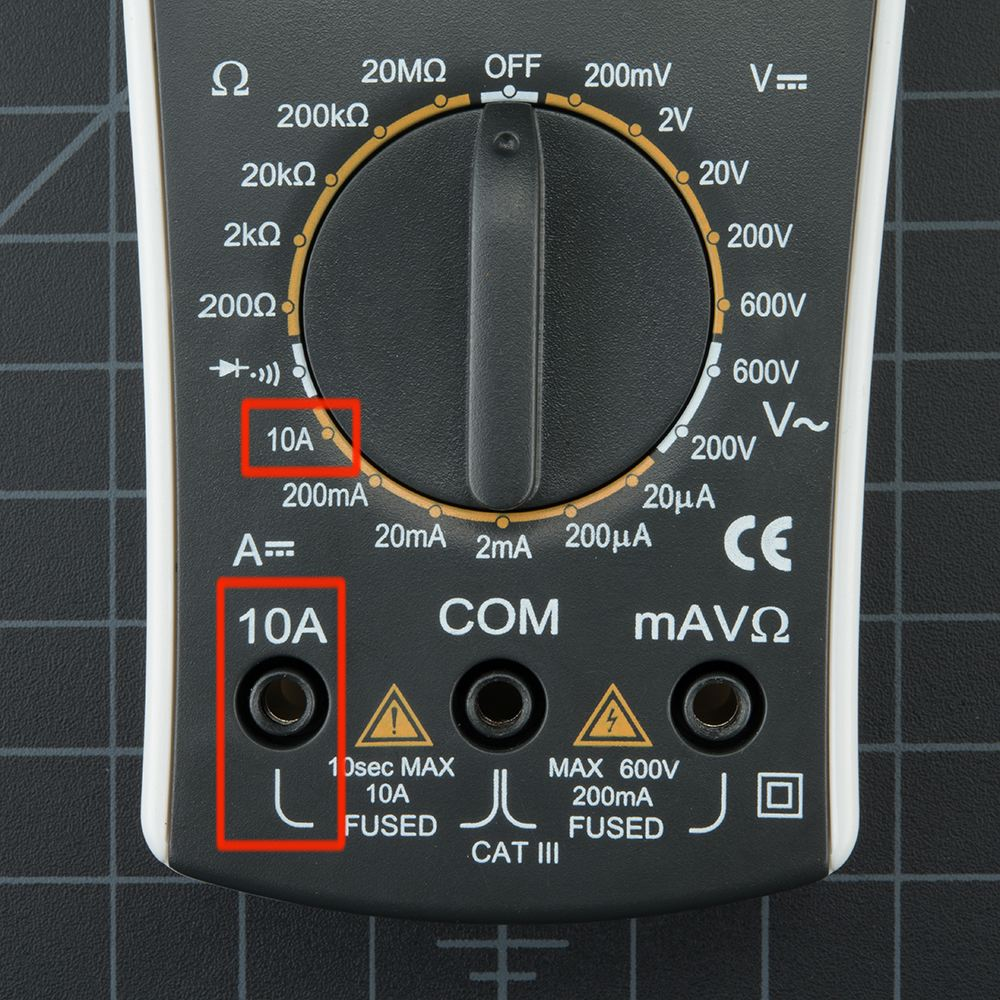

**覚えておいてほしい：** システムが100mAを超える電流を使う可能性があるなら、まず赤いプローブを**10A**端子に差し、**10A**レンジから測定を始めるとよい。

50ドル以下のデジタルテスターで得られる測定値は、あくまでトラブルシューティング用の目安であり、厳密な科学実験の結果ではない。
ICが時間とともにどう電流や電圧を使うかを本格的に調べたいなら、AgilentのようなメーカーのハイエンドなベンチトップDMMを使うとよい。
こうした機器は精度が高く、いろいろと凝った機能も備えている。

## 良いテスターの条件

好みは人それぞれだが、一般的には導通テスト機能があるテスターが好まれる。
それ以外の機能は、いわばおまけのようなものである。

**オートレンジ**機能を持つ、凝ったテスターもある。
これは、測定対象の電圧、抵抗、電流に応じて、内部のレンジを自動的に切り替えてくれる機能である。
使い方さえわかっていれば、オートレンジは非常に便利である。
一般に、オートレンジ機能を持つテスターは品質も高く、機能も豊富な傾向がある。
もしオートレンジ付きのテスターを誰かからもらったら、ぜひ活用してほしい。
ただし、手動モードへの切り替え方も覚えておくこと。
回路の電圧や電流はかなり素早く変動することがあり、システムによっては変動が激しすぎて、オートレンジがうまく追従できないこともある。

**バックライト付きの液晶**は見栄えがよいが、暗闇の中で回路を測定したことは最近あっただろうか。
たいていは、真夜中に測定が必要になるような不気味な状況は避けたいものだが、暗い場所でも使えるテスターが欲しい、必要だという人もいるだろう。

レンジ切り替えつまみの**心地よいクリック感**も、個人的には大きなポイントだと思っている。
つまみの感触が柔らかすぎるテスターは、たいてい安っぽい作りであることが多い。

**しっかりしたプローブ**も長所の1つである。
時間が経つと、リード線は曲げる部分から傷んでいきやすい。
プローブから配線がすっぽ抜けてしまうこともあり、しかもそれはたいてい、まさにそのプローブが必要な瞬間に起きる。
プローブが壊れても、比較的[安価に交換できる](https://www.sparkfun.com/products/12078)。

**オートパワーオフ**は、安価なテスターにはあまり見られない、うれしい機能である。
夜中の2時にテスターの電源を切り忘れるのはよくあることなので、初心者にも上級者にも役立つ機能である。
[SparkFunのデジタルテスター](https://www.sparkfun.com/products/9141)にはこの機能はないが、幸い消費電力が非常に少ないテスターであり、丸2日間つけっぱなしにしても9V電池がようやく弱ってくる程度で済んだこともある。
とはいえ、テスターの電源を切り忘れないようにしたい。

これで、身の回りのさまざまなものをデジタルテスターで測定する準備が整った。
気になる疑問があれば、遠慮なくテスターで確かめてみてほしい。
このLEDには本当に20mA流れているのか。
レモンにはどれくらいの電圧があるのか。
コップ一杯の水は電気を通すのか。
配線の代わりにアルミホイルを使えるのか。
デジタルテスターは、こうした電子工作にまつわる数々の疑問に答えてくれる。

## まとめ

デジタルテスターの基本的な使い方が身についたところで、その技術を活かせる次のチュートリアルにも挑戦してみてほしい。

- [テスターでLEDとダイオードの極性を調べる](https://learn.sparkfun.com/tutorials/polarity/diode-and-led-polarity)
- [発光ダイオード](./light-emitting-diodes-leds.md)
- [ダイオード](./diodes.md)
- [電力](./electric-power.md)
- [電池の技術](./battery-technologies.md)
- [プロジェクトへの電源供給](./how-to-power-a-project.md)

タグ: 電気工学、スキル、プロジェクトを始める、ツール

---

出典：[How to Use a Multimeter](https://learn.sparkfun.com/tutorials/how-to-use-a-multimeter)（SparkFun Learn）を日本語に翻訳し、再構成した。
原文は [CC BY-SA 4.0](https://creativecommons.org/licenses/by-sa/4.0/) ライセンスで公開されており、本ページも同ライセンスの下で提供する。
