# オシロスコープの使い方

回路のトラブルシューティングをしていて、[テスター](./how-to-use-a-multimeter.md)だけでは足りない情報が必要になったことはないだろうか。
周波数、ノイズ、振幅など、時間とともに変化する特性を知りたければ、オシロスコープが必要になる。

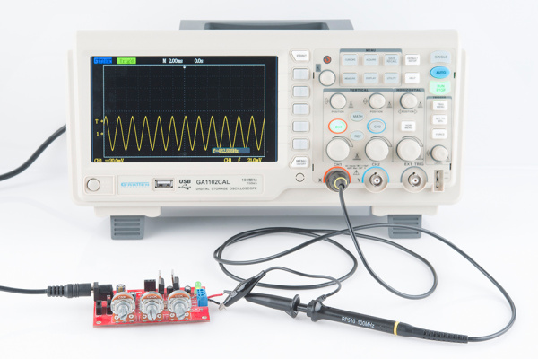

オシロスコープ（O-スコープ）は、電気系エンジニアの実験室に欠かせない道具である。
電気信号が時間とともにどう変化するかを目で見えるようにしてくれるため、[555タイマー](https://www.sparkfun.com/products/9273)回路がうまく点滅しない原因や、[ノイズメーカー](https://www.sparkfun.com/products/9206)の騒々しさが最大レベルに達しない原因を突き止める際に大きな助けになる。

## このチュートリアルで扱う内容

このチュートリアルでは、オシロスコープの概念、用語、制御系を紹介する。次のセクションに分かれている。

- **O-スコープの基礎** — オシロスコープとは何か、何を測定するのか、なぜ使うのかを紹介する
- **オシロスコープ用語集** — オシロスコープに関するよく使われる用語をまとめた用語集
- **O-スコープの構成** — 画面、水平・垂直コントロール、トリガー、プローブといった、オシロスコープの最も重要な各系統の概要
- **オシロスコープの使い方** — オシロスコープを初めて使う人向けのコツと手順

このチュートリアルでは、扱いやすい中級クラスのデジタルオシロスコープである[Gratten GA1102CAL](https://www.sparkfun.com/products/11766)を例に説明する。
他のオシロスコープでは見た目が異なることもあるが、いずれも似たような制御系とインターフェースの仕組みを備えているはずである。

## 参考になるチュートリアル

このチュートリアルを読み進める前に、次の概念に馴染んでおくとよい。詳しく知りたい場合はそれぞれのチュートリアルを参照してほしい。

- [電圧、電流、抵抗とオームの法則](./voltage-current-resistance-and-ohms-law.md)
- [テスターの使い方](./how-to-use-a-multimeter.md)
- [アナログとデジタルの違い](./analog-vs-digital.md)
- [交流と直流の違い](./alternating-current-ac-vs-direct-current-dc.md)

## O-スコープの基礎

オシロスコープの主な目的は、**電気信号が時間とともにどう変化するかをグラフに描く**ことである。
ほとんどのオシロスコープは、**横軸に時間**、**縦軸に電圧**を取った二次元のグラフを描画する。

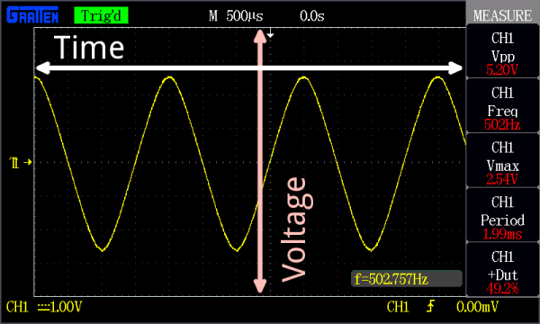

*オシロスコープの表示例。この場合は黄色の正弦波の信号が、横軸の時間と縦軸の電圧のグラフとして描かれている。*

画面の周囲にあるコントロール類を使い、グラフの**縦・横それぞれのスケールを調整**できる。これにより信号を拡大・縮小して見ることができる。
また、**トリガー**を設定するコントロールもあり、表示の焦点を合わせて安定させるのに役立つ。

### オシロスコープで測定できること

こうした基本的な機能に加えて、多くのオシロスコープには測定ツールが備わっており、周波数、振幅、その他の波形の特性を素早く数値化できる。
一般に、オシロスコープは時間に関する特性と電圧に関する特性の両方を測定できる。

**時間に関する特性：**

- **周波数と周期** — 周波数とは、波形が1秒間に繰り返される回数のことである。周期はその逆数（波形が1回繰り返すのにかかる秒数）にあたる。オシロスコープが測定できる最大周波数は機種によって異なるが、多くは数百MHz（1E6 Hz）の範囲に達する。
- **デューティ比** — 波が正、あるいは負である期間が、1周期に占める割合のこと（正のデューティ比と負のデューティ比がある）。[デューティ比](./pulse-width-modulation.md)は、信号が1周期のうちどれだけの時間「オン」で、どれだけの時間「オフ」かを示す比率である。
- **立ち上がり時間と立ち下がり時間** — 信号は瞬時に0Vから5Vへ変化するわけではなく、滑らかに立ち上がる必要がある。波が低い点から高い点へ移るのにかかる時間を立ち上がり時間、その逆を立ち下がり時間と呼ぶ。回路が信号にどれだけ速く応答できるかを考える上で重要な特性である。

**電圧に関する特性：**

- **振幅** — 振幅は信号の大きさを表す尺度である。振幅の測り方にはいくつかの種類があり、信号の最高点と最低点の絶対的な差を測る**ピークツーピーク振幅**もその一つである。一方、**ピーク振幅**は、信号が0Vからどれだけ高く、あるいは低くなるかだけを測る。
- **最大電圧と最小電圧** — オシロスコープは、信号の電圧がどこまで高くなり、どこまで低くなるかを正確に示してくれる。
- **平均電圧** — オシロスコープは信号の平均値を計算でき、信号の最小電圧と最大電圧の平均を示すこともできる。

### O-スコープを使う場面

O-スコープは、次のようなさまざまなトラブルシューティングや研究の場面で役立つ。

- 信号の**周波数と振幅**を調べる。回路の入力・出力・内部の系統をデバッグする上で重要な情報であり、これによって回路のどの部品が誤作動しているかがわかることもある。
- 回路にどれだけの**ノイズ**が乗っているかを調べる。
- 波の**形**（正弦波、方形波、三角波、のこぎり波、複雑な波形など）を特定する。
- 2つの異なる信号の間の位相差を数値化する。

## オシロスコープ用語集

オシロスコープの使い方を学ぶということは、専門用語のひとまとまりを覚えることでもある。
このセクションでは、電源を入れる前に押さえておきたい、重要なオシロスコープ関連の用語をいくつか紹介する。

### オシロスコープの主な仕様

オシロスコープには機種による性能差がある。
次の特性は、そのオシロスコープがどれだけの性能を発揮できるかを示す目安になる。

- **帯域幅** — オシロスコープは、明確な周波数を持つ波形の測定に最もよく使われる。とはいえ完璧なオシロスコープは存在せず、信号の変化をどれだけ速く捉えられるかにはいずれも限界がある。オシロスコープの帯域幅は、確実に測定できる**周波数の範囲**を示す値である。
- **デジタルとアナログ** — 電子機器の多くと同様に、オシロスコープにもアナログ式とデジタル式がある。アナログ式のオシロスコープは、電子ビームを使って入力電圧を直接表示にマッピングする。デジタル式のオシロスコープはマイクロコントローラーを内蔵し、[アナログ-デジタル変換](./analog-to-digital-conversion.md)器で入力信号をサンプリングし、その読み取り値を表示にマッピングする。一般にアナログ式は歴史が古く、帯域幅が狭く機能も少ないが、応答が速いことがある（そして見た目もかっこいい）。
- **チャンネル数** — 多くのオシロスコープは、一度に複数の信号を読み取り、画面に同時に表示できる。オシロスコープが読み取る各信号は、それぞれ別のチャンネルに入力される。2〜4チャンネルのオシロスコープが一般的である。
- **サンプリングレート** — この特性はデジタル式オシロスコープに固有のもので、信号を1秒間に何回読み取るかを示す。複数チャンネルを持つオシロスコープでは、複数チャンネルを同時に使うとこの値が下がることがある。
- **立ち上がり時間** — オシロスコープの仕様に記載される立ち上がり時間は、測定できる最も速い立ち上がりパルスを示す。オシロスコープの立ち上がり時間は帯域幅と密接に関係しており、`立ち上がり時間 = 0.35 / 帯域幅`という式で計算できる。
- **最大入力電圧** — あらゆる電子機器には、高電圧に対する限界がある。オシロスコープにも必ず最大入力電圧の定格がある。信号がこの電圧を超えると、オシロスコープが損傷する可能性が高い。
- **分解能** — オシロスコープの分解能は、入力電圧をどれだけ精密に測定できるかを表す。この値は垂直方向のスケールの調整によって変化する。
- **垂直感度** — 垂直方向、つまり電圧スケールの最小値・最大値を表す値である。1目盛りあたりのボルト数で示される。
- **タイムベース** — タイムベースは通常、水平方向、つまり時間軸の感度の範囲を示す。1目盛りあたりの秒数で示される。
- **入力インピーダンス** — 信号の周波数が非常に高くなると、回路にごくわずかなインピーダンス（抵抗、静電容量、インダクタンス）が加わるだけでも信号に影響が出ることがある。オシロスコープは、読み取る回路に対して必ず一定のインピーダンスを付加しており、これを入力インピーダンスと呼ぶ。入力インピーダンスは通常、大きな抵抗性インピーダンス（1MΩ超）と、小さな静電容量（pFの範囲）が並列（||）に接続されたものとして表される。入力インピーダンスの影響は、非常に高い周波数の信号を測定する際に顕著になり、使用するプローブがその補正を担うこともある。

[GA1102CAL](https://www.sparkfun.com/products/11766)を例に、中級クラスのオシロスコープに期待できる仕様を示す。

| 特性 | 値 |
| --- | --- |
| 帯域幅 | 100MHz |
| サンプリングレート | 1GSa/s（1秒あたり1E9サンプル） |
| 立ち上がり時間 | 3.5ns未満 |
| チャンネル数 | 2 |
| 最大入力電圧 | 400V |
| 分解能 | 8ビット |
| 垂直感度 | 2mV/div〜5V/div |
| タイムベース | 2ns/div〜50s/div |
| 入力インピーダンス | 1MΩ±3% || 16pF±3pF |

これらの特性を理解すれば、自分のニーズに最も合ったオシロスコープを選べるようになるはずである。
とはいえ、使い方も知っておく必要がある。次のセクションに進もう。

## O-スコープの構成

まったく同じオシロスコープというものは存在しないが、いずれも似た働きをする共通点をいくつか備えている。
このセクションでは、オシロスコープでよく見られる系統、すなわちディスプレイ、水平系、垂直系、トリガー系、入力系について説明する。

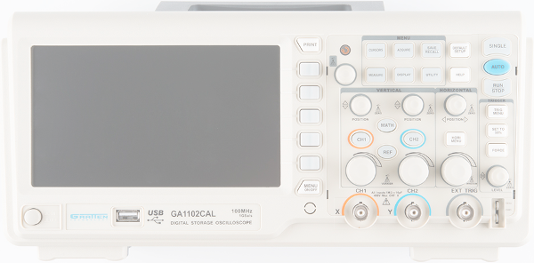

### ディスプレイ

オシロスコープは、テストしたい情報を表示できなければ意味がない。そのためディスプレイは、オシロスコープの中でも特に重要な部分の一つである。

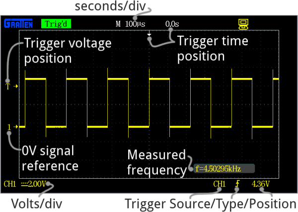

すべてのオシロスコープのディスプレイには、水平線と垂直線が格子状に交差しており、これを**目盛り**（division）と呼ぶ。
この目盛りのスケールは、水平系と垂直系のコントロールで変更する。
垂直系は「1目盛りあたりのボルト数」、水平系は「1目盛りあたりの秒数」で測られる。
一般的なオシロスコープには、縦（電圧）方向に8〜10目盛り、横（時間）方向に10〜14目盛りが用意されている。

古いオシロスコープ（特にアナログ式のもの）は、たいていシンプルなモノクロ表示だが、波の輝度は変化することがある。
より新しいオシロスコープはカラーのLCD画面を備えており、複数の波形を同時に見やすく表示するのに大いに役立つ。

多くのオシロスコープの画面の隣（横または下）には、5個程度のボタン群が配置されている。
これらのボタンを使ってメニューを操作し、オシロスコープの設定を制御できる。

### 垂直系

オシロスコープの**垂直**セクションは、ディスプレイの**電圧スケール**を制御する。
一般に、垂直位置とvolts/divを個別に制御できる2つのつまみが用意されている。

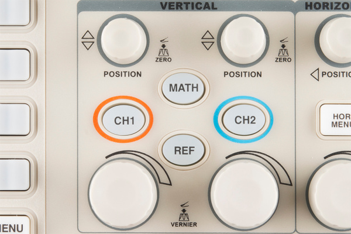

より重要な**volts per division**のつまみは、画面上の垂直スケールを設定するものである。
つまみを時計回りに回すとスケールが小さくなり、反時計回りに回すと大きくなる。
スケールが小さい（画面上の1目盛りあたりのボルト数が少ない）ほど、波形をより「拡大」して見ていることになる。

たとえばGA1102のディスプレイには8つの垂直目盛りがあり、volts/divのつまみは2mV/divから5V/divの間でスケールを選べる。
つまり、2mV/divまで拡大すると、画面の上端から下端までで16mVの波形を表示できる。
最大まで「縮小」すると、40Vを超える範囲の波形を表示できる（後述するように、プローブによってこの範囲をさらに広げることもできる）。

**位置**のつまみは、画面上での波形の垂直方向のオフセットを制御する。
つまみを時計回りに回すと波は下に、反時計回りに回すと上に移動する。
位置つまみを使えば、波形の一部を意図的に画面の外にずらすこともできる。

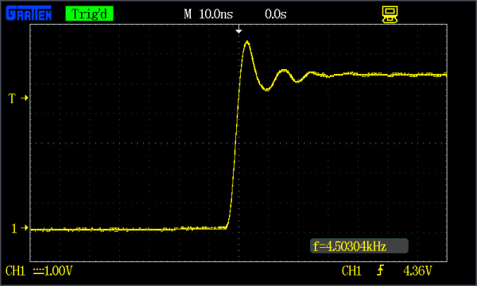

位置つまみとvolts/divつまみを組み合わせて使うことで、最も注目したい波形のごく一部だけを拡大して見ることができる。
たとえば5Vの方形波があり、そのエッジのリンギング（振動）だけが気になる場合は、両方のつまみを使って立ち上がりエッジを拡大表示すればよい。

### 水平系

オシロスコープの水平セクションは、画面上の**時間スケール**を制御する。
垂直系と同様に、水平系のコントロールにも位置とseconds/divという2つのつまみがある。

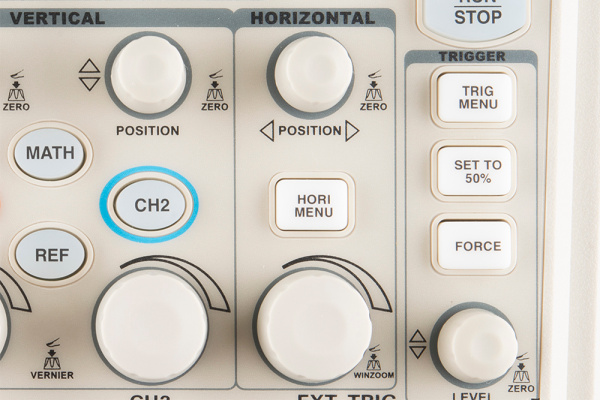

**seconds per division（s/div）**のつまみは、水平方向のスケールを増減させる。
s/divのつまみを時計回りに回すと、1目盛りが表す秒数が小さくなり、時間軸を「拡大」することになる。
反時計回りに回すと時間スケールが大きくなり、画面によりの長い時間を表示できる。

再びGA1102を例にすると、ディスプレイには14の水平目盛りがあり、1目盛りあたり2nSから50sの間で表示できる。
つまり水平スケールを目一杯拡大すると28nSの波形を、目一杯縮小すると700秒にわたる信号の変化を表示できる。

**位置**のつまみは、波形を画面の左右に動かし、水平方向の**オフセット**を調整する。

水平系を使うと、波形の**何周期分**を表示するかを調整できる。
縮小して、信号の複数の山と谷を表示することもできる。

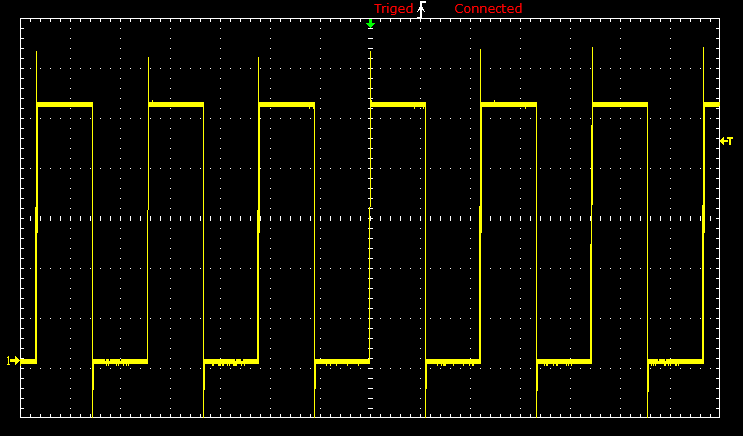

あるいは大きく拡大し、位置つまみを使って波のごく一部だけを表示することもできる。

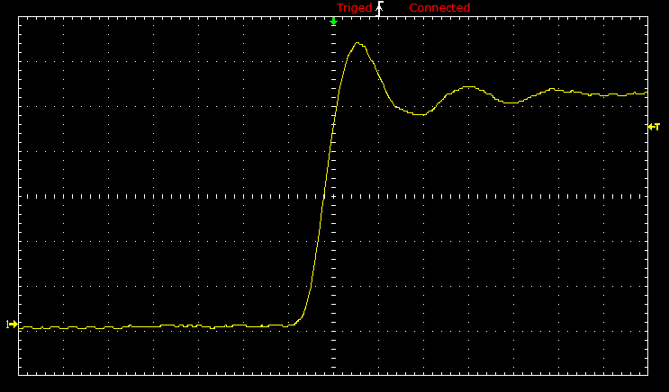

### トリガー系

トリガーのセクションは、オシロスコープの表示を**安定させ**、焦点を合わせるためのものである。
トリガーは、信号のどの部分で「トリガー」をかけて測定を開始するかをオシロスコープに指示する。
波形が**周期的**であれば、トリガーを調整することで表示を**静止**させ、揺れのない状態に保つことができる。
トリガーの設定がうまくいっていない波は、次のように目が回りそうなほど画面上を流れ続けてしまう。

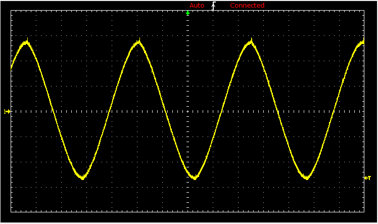

オシロスコープのトリガーセクションは通常、レベルつまみと、トリガーのソースと種類を選ぶための一連のボタンで構成される。
**レベルつまみ**を回すことで、特定の電圧の点にトリガーを設定できる。

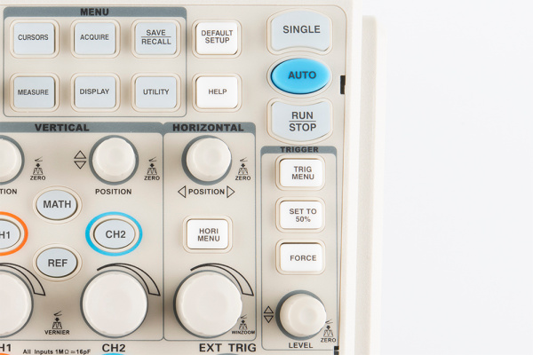

トリガー系の残りの部分は、一連のボタンと画面上のメニューで構成されている。
その主な役割は、トリガーのソースとモードを選択することである。
トリガーがどのように動作するかを変える**トリガーの種類**にはいくつかある。

- **エッジ**トリガーは最も基本的なトリガーの形式である。信号の電圧が特定のレベルを超えたときに、オシロスコープが測定を始めるきっかけとなる。エッジトリガーは、立ち上がりエッジ、立ち下がりエッジ（またはその両方）で検出するよう設定できる。
- **パルス**トリガーは、指定した電圧の「パルス」でオシロスコープをトリガーさせるものである。パルスの持続時間と方向を指定できる。たとえば0V→5V→0Vというごく短い変化の場合もあれば、5Vから0Vへ数秒かけて下がり再び5Vに戻るような場合もある。
- **スロープ**トリガーは、指定した時間内での正または負のスロープ（傾き）でトリガーをかけるよう設定できる。
- さらに複雑なトリガーとして、**NTSC**や**PAL**のような、映像データを運ぶ標準化された波形に焦点を当てるものもある。これらの波形は、フレームの先頭ごとに独特の同期パターンを使う。

たいていの場合、**トリガーモード**も選択できる。これは実質的に、トリガーをどれだけ厳密に扱いたいかをオシロスコープに伝えるものである。
自動トリガーモードでは、トリガーが検出されなくても波形の描画を試みる。
**ノーマルモード**は、指定したトリガーを検出した場合にのみ波形を描画する。
**シングルモード**は、指定したトリガーを検出すると波形を一度だけ描画し、そこで停止する。

### プローブ

オシロスコープは、実際に信号に接続できて初めて役に立つ。そのために必要なのがプローブである。
プローブは、回路からオシロスコープへ信号を送る単一入力のデバイスである。
先端は鋭い**チップ**になっており、回路上の一点に当てて測定する。
チップには、回路に固定しやすくするためのフック、ピンセット、クリップを取り付けられることもある。
どのプローブにも**グラウンドクリップ**が付属しており、これを被測定回路の共通グラウンドポイントに確実に固定する必要がある。

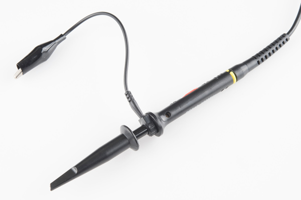

プローブは、回路に固定して信号をオシロスコープに送るだけの単純な装置に見えるかもしれないが、実際にはその設計と選定には多くの検討事項がある。

理想的には、プローブは「見えない」存在であるべきである。つまり、測定対象の信号に何の影響も与えないことが望ましい。
残念ながら、長いワイヤーにはどれもインダクタンス、静電容量、抵抗が本質的に存在するため、（特に高周波では）どうしてもオシロスコープの読み取り値に影響を与えてしまう。

プローブにはさまざまな種類があるが、最も一般的なのは、ほとんどのオシロスコープに付属する**パッシブプローブ**である。
市販の「標準」パッシブプローブの多くは**減衰型**である。
減衰型のプローブは、意図的に組み込まれた大きな抵抗と、それを分流する小さな[コンデンサ](./capacitors.md)を持ち、長いケーブルが回路の負荷に与える影響を最小限に抑える役割を果たす。
オシロスコープの**入力インピーダンス**と直列に接続されることで、この減衰プローブは信号とオシロスコープの入力の間に[分圧回路](./voltage-dividers.md)を作り出す。

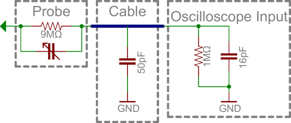

多くのプローブは、減衰用に9MΩの[抵抗](./resistors.md)を備えており、これがオシロスコープの標準的な1MΩの入力インピーダンスと組み合わさることで、1/10の分圧回路を形成する。
このようなプローブは一般に**10倍減衰プローブ**と呼ばれる。
多くのプローブには、10倍と1倍（減衰なし）を切り替えるスイッチが付いている。

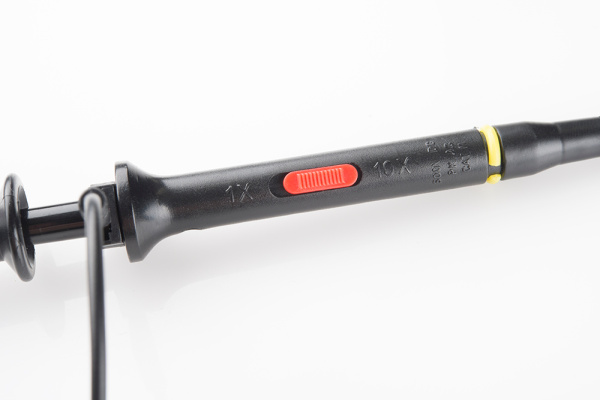

減衰プローブは高周波での精度向上に優れているが、信号の**振幅も小さくしてしまう**。
非常に低電圧の信号を測定したい場合は、1倍プローブを使う必要があるかもしれない。
また、減衰プローブを使っていることをオシロスコープ側に設定する必要がある場合もあるが、多くのオシロスコープはこれを自動的に検出できる。

パッシブな減衰プローブ以外にも、さまざまな種類のプローブが存在する。
**アクティブプローブ**は電源を必要とするプローブ（別途電源が必要）で、信号を増幅したり、オシロスコープに届く前に前処理したりできる。
ほとんどのプローブは電圧を測定するために設計されているが、交流や直流の電流を測定するために設計されたプローブもある。
**電流プローブ**は独特で、ワイヤーの周りにクランプするだけで回路に直接触れることなく測定できることが多い。

## オシロスコープの使い方

信号の種類は無限にあるため、まったく同じ手順でオシロスコープを操作することは二度とないだろう。
とはいえ、回路をテストするたびにほぼ毎回行うことになる、いくつかの共通の手順がある。
このセクションでは、サンプルの信号を例に、それを測定するために必要な手順を示す。

### プローブの選定と設定

まず、プローブを**選ぶ**必要がある。
ほとんどの信号には、オシロスコープに付属するシンプルな**パッシブプローブ**で十分に対応できる。

次に、オシロスコープに接続する前に、プローブの**減衰設定**を行う。
最も一般的な減衰率である10倍は、たいてい最もバランスのよい選択肢である。
ただし、非常に低電圧の信号を測定したい場合は1倍が必要になることもある。

### プローブを接続し、オシロスコープの電源を入れる

プローブをオシロスコープの1チャンネル目に接続し、電源を入れる。
少し辛抱してほしい。オシロスコープの中には、古いパソコンと同じくらい起動に時間がかかるものもある。

起動すると、目盛り、スケール、そしてノイズの乗った平らな波形の線が表示されるはずである。

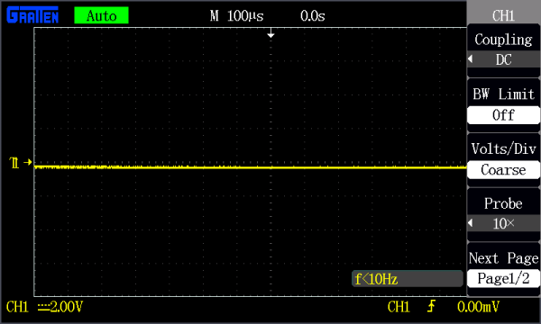

画面には、以前設定した時間とvolts/divの値も表示されているはずである。
これらのスケールはひとまず置いておき、次の調整を行ってオシロスコープを**標準的な設定**にする。

- **チャンネル1をオン**にし、チャンネル2はオフにする。
- チャンネル1を**DCカップリング**に設定する。
- **トリガーソース**をチャンネル1に設定する（外部ソースや別チャンネルによるトリガーは使わない）。
- **トリガーの種類**を立ち上がりエッジに、**トリガーモード**をシングルではなく自動に設定する。
- オシロスコープ側の**プローブ減衰設定**が、プローブ自体の設定（1倍、10倍など）と一致していることを確認する。

これらの調整方法がわからない場合は、オシロスコープの取扱説明書を参照してほしい（一例として[GA1102CALのマニュアル](http://cdn.sparkfun.com/datasheets/Tools/ADS1000%20User%20Manual(1.3).pdf)を挙げておく）。

### プローブをテストする

このチャンネルを、意味のある信号に接続してみよう。
多くのオシロスコープには**内蔵の周波数発生器**があり、安定した既知の周波数の波を出力できる。GA1102CALの場合、前面パネル右下に1kHzの方形波出力がある。
この周波数発生器の出力には、信号用とグラウンド用の2本の独立した導線がある。
プローブの**グラウンドクリップ**をグラウンドに、**プローブ先端**を信号出力に接続する。

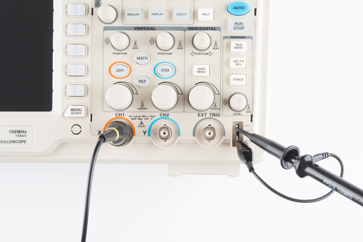

プローブの両方の接続を終えると、すぐに画面上で信号が揺れ動き始めるはずである。
**水平系・垂直系のつまみ**をいろいろ動かし、画面上で波形を操作してみるとよい。
スケールのつまみを時計回りに回すと波形が「拡大」され、反時計回りに回すと「縮小」される。
位置つまみを使えば、波形の位置をさらに調整できる。

波形がまだ不安定な場合は、**トリガー位置**のつまみを回してみるとよい。
**トリガーが波形の最も高いピークより高い値に設定されていないか確認すること**。
デフォルトでは、トリガーの種類はエッジに設定されているはずで、この方形波のような信号には通常これがよい選択となる。

これらのつまみをいろいろ調整して、波の1周期分を画面に表示させてみよう。

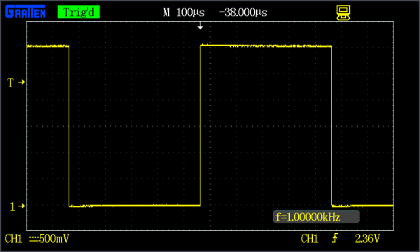

あるいは、時間スケールを大きく縮小して、方形波を何十個も表示させてみてもよい。

### 減衰プローブの補正

プローブが10倍に設定されており、上のようなきれいな方形波にならない場合は、**プローブの補正**が必要かもしれない。
多くのプローブには奥まった位置にねじ頭があり、これを回すことでプローブのシャント容量を調整できる。

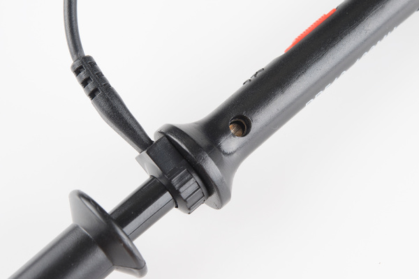

小さなドライバーを使ってこのトリマーを回し、波形がどう変化するか見てみるとよい。

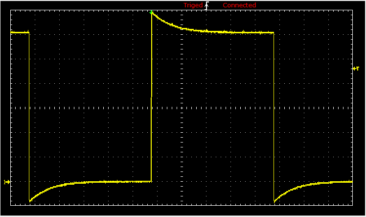

プローブハンドルのトリミングキャパシタを調整し、**エッジがまっすぐな**方形波になるようにする。
補正が必要になるのはプローブが減衰型（10倍など）に設定されている場合だけだが、その場合は極めて重要な作業になる（特に、そのオシロスコープを直前に誰が使ったのかわからない場合はなおさらである）。

### プロービング、トリガー、スケーリングのコツ

プローブの補正が終わったら、いよいよ実際の信号を測定する番である。
信号源（周波数発生器や、[Terror-Min](https://www.sparkfun.com/products/9206)のようなもの）を用意して戻ってきてほしい。

信号をプロービングする際の最初の要点は、しっかりと信頼できる**グラウンドポイント**を見つけることである。
グラウンドクリップを既知のグラウンドに固定する。場合によっては、グラウンドクリップと回路のグラウンドポイントの間を短いワイヤーで中継する必要があるかもしれない。
続いて、プローブの先端を測定対象の信号に接続する。
プローブ先端にはばね式クリップ、細い針、フックなど、さまざまな形状がある。常に手で押さえていなくても済むものを選ぶとよい。

> **⚡ 注意：** **絶縁されていない回路**（電池駆動でない、あるいは絶縁型電源を使っていない回路）をプロービングする際は、グラウンドクリップをどこに接続するか十分に注意すること。商用電源のアースに接続された回路をプロービングする場合は、グラウンドクリップを回路の**商用電源のアースに接続されている側**につなぐこと。これはほとんどの場合、回路のマイナス・グラウンド側にあたるが、別の点になることもある。グラウンドクリップを接続した点に電位差があると、そこで直接ショートが発生し、回路、オシロスコープ、そして自分自身を傷つける恐れがある。商用電源につながった回路をテストする際は、安全のため[絶縁トランス](https://en.wikipedia.org/wiki/Isolation_transformer)を介して電源を供給することを推奨する。

信号が画面に表示されたら、まずは水平・垂直のスケールを信号の「おおよその見当」がつく程度に調整するとよい。
たとえば5V、1kHzの方形波をプロービングしているなら、volts/divはおよそ0.5〜1V、seconds/divはおよそ100µsに設定するとよいだろう（14目盛りで1.5周期程度が表示される）。

波形の一部が画面の上下からはみ出している場合は、**垂直位置**を調整して上下に動かすことができる。
信号が純粋な直流であれば、0Vのラインを画面下部付近に調整するとよいこともある。

スケールのおおよその見当がついたら、波形にはある程度のトリガー調整が必要になる。
**エッジトリガー**（電圧が設定した点を超えて上昇、あるいは下降したときにオシロスコープが走査を始めようとする方式）は、最も使いやすいトリガーの種類である。
エッジトリガーを使う場合は、トリガーレベルを、1周期に一度だけ**立ち上がりエッジを検出する**ような点に設定するとよい。

あとは、必要な表示になるまで**スケール調整、位置調整、トリガー調整を繰り返す**だけである。

### 二度測って一度で決める

信号にスコープを合わせ、トリガーをかけ、スケールを調整できたら、いよいよ過渡現象や周期、その他の波形特性を測定する番である。
オシロスコープによって測定ツールの充実度は異なるが、どの機種にも少なくとも目盛りは備わっており、これだけでも振幅と周波数のおおよその見当をつけることができる。

多くのオシロスコープは、さまざまな自動測定ツールに対応しており、周波数のような重要な情報を常時表示できる機種もある。
オシロスコープを最大限に活用するには、対応している**測定機能**をひととおり確認しておくとよい。
たいていのオシロスコープは、周波数、振幅、デューティ比、平均電圧など、さまざまな波形特性を自動的に計算してくれる。

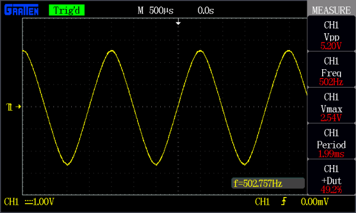

*オシロスコープの測定ツールを使い、VPP、VMax、周波数、周期、デューティ比を求める。*

多くのオシロスコープが備える3つ目の測定ツールが**カーソル**である。
カーソルは画面上で移動できるマーカーで、時間軸または電圧軸の上に配置できる。
カーソルは通常2本組で提供され、片方ともう片方の差を測定できる。

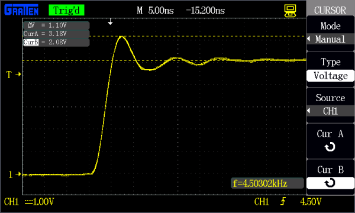

*カーソルを使い、方形波のリンギングを測定する。*

求めたい量を測定できたら、回路に調整を加えてさらに測定を続けることができる。
オシロスコープの中には、波形の**保存**、**印刷**、**記録**に対応しているものもあり、後からその波形を呼び出して、あの信号をスコープで見たときの様子を思い出すこともできる。

自分のオシロスコープがどんなことをできるのか、詳しくは取扱説明書を確認してほしい。

## オシロスコープの購入

この便利な道具の機能と利点を学んだところで、いよいよ作業台にオシロスコープを置く番である。
用途に応じたオシロスコープの選び方については、[SparkFunの検索結果](https://www.sparkfun.com/search/results?term=oscilloscope)から探してみてほしい。

## まとめ・参考資料

このチュートリアルで紹介した道具を身につければ、自分自身で信号をスコープにかける準備が整っているはずである。
オシロスコープの特定の部分が何のためにあるのかまだよくわからない場合は、まず**取扱説明書**を確認してほしい。
その他、次の資料も参考になる。

- [The XYZs of Oscilloscopes](http://ecee.colorado.edu/~mcclurel/txyzscopes.pdf)（PDF） — オシロスコープについて詳しく解説した優れた入門資料
- [How to Use an Oscilloscope](https://www.youtube.com/watch?v=tzndcBJu-Ns)（YouTube） — オシロスコープのメーカーであるTektronixによる、わかりやすい解説動画
- [GA1102CALユーザーズマニュアル](http://cdn.sparkfun.com/datasheets/Tools/ADS1000%20User%20Manual(1.3).pdf) — AttenのGA1102CAL（100MHzオシロスコープ）のユーザーズマニュアル。この機種固有の内容だが、同種のオシロスコープが何をできるか、どう動作するかの概要をつかむのに役立つ

さらに、オシロスコープに習熟してきたら、次はどんな回路をデバッグしてみたいだろうか。
ヒントが欲しい場合は、次の関連チュートリアルもおすすめである。

- [PCB設計ツールEagleの使い方](./how-to-install-and-setup-eagle.md) — 信号レベルで回路のトラブルシューティングをする段階に来ているなら、PCB設計に一歩踏み出す準備ができているのかもしれない。無料で使えるソフトウェアEAGLEで自分の基板を設計する方法を、一連のチュートリアルで解説している
- [Recreating Classic Electronics Kits](https://learn.sparkfun.com/tutorials/recreating-classic-electronics-kits) — スコープでトラブルシューティングする回路を探しているなら、自分だけの「50-in-1電子工作キット」を作ってみるのはどうだろうか
- [パルス幅変調（PWM）](./pulse-width-modulation.md) — PWM信号は、LEDの調光やサーボモーターの駆動の基礎となる。この信号の種類を学んだら、身につけたスキルでスコープにかけてみよう

信号の確認にオシロスコープを使っている、次のようなチュートリアルも参考になる。

- [MCP4725 Digital to Analog Converter Hookup Guide](https://learn.sparkfun.com/tutorials/mcp4725-digital-to-analog-converter-hookup-guide) — MCP4725 DACブレイクアウトボードを使い始めるための簡単な接続ガイド。ArduinoマイコンのI2Cインターフェースのようなデジタル信号源からアナログ信号を出力できるデバイスである
- [MIDI Shield Hookup Guide](https://learn.sparkfun.com/tutorials/midi-shield-hookup-guide) — SparkFun MIDI Shieldの組み立て方と、いくつかのサンプルプロジェクト
- [Stepoko: Powered by grbl Hookup Guide](https://learn.sparkfun.com/tutorials/stepoko-powered-by-grbl-hookup-guide) — Stepokoのハードウェアガイド
- [Boss Alarm](https://learn.sparkfun.com/tutorials/boss-alarm) — オフィスに誰かが入ってきたことを知らせ、自動的にパソコンの画面を切り替えるBoss Alarmを作る
- [Piezo Vibration Sensor Hookup Guide](https://learn.sparkfun.com/tutorials/piezo-vibration-sensor-hookup-guide) — 圧電センサー、大きな値の抵抗、Arduinoを組み合わせて振動センサーを作る方法
- [Proto Pedal Assembly and Theory Guide](https://learn.sparkfun.com/tutorials/proto-pedal-assembly-and-theory-guide) — SparkFun Proto Pedalの使い始め方。基板を組み立てながら、回路の詳細についても解説する
- [Proto Pedal Example: Analog Equalizer Project](https://learn.sparkfun.com/tutorials/proto-pedal-example-analog-equalizer-project) — Proto Pedalを使い、ジャイレータ方式のアナログイコライザーを製作する
- [THAT InGenius and OutSmarts Breakout Hookup Guide](https://learn.sparkfun.com/tutorials/that-ingenius-and-outsmarts-breakout-hookup-guide) — 平衡伝送方式の信号伝送の利点と、THAT InGenius・OutSmartsブレイクアウトの活用方法を学ぶ
- [SparkFun Clock Generator 5P49V60 (Qwiic) Hookup Guide](https://learn.sparkfun.com/tutorials/sparkfun-clock-generator-5p49v60-qwiic-hookup-guide) — 単一の基準クロックからさまざまな周波数・信号形式を柔軟に生成できるSparkFun Clock Generator 5P49V60（Qwiic）ブレイクアウトボードの、利用可能な機能とハードウェアの概要

タグ: 電気工学、スキル、ツール

---

出典：[How to Use an Oscilloscope](https://learn.sparkfun.com/tutorials/how-to-use-an-oscilloscope)（SparkFun Learn）を日本語に翻訳し、再構成した。
原文は [CC BY-SA 4.0](https://creativecommons.org/licenses/by-sa/4.0/) ライセンスで公開されており、本ページも同ライセンスの下で提供する。
