# Raspberry PiでVNCによるリモートデスクトップを使う

## はじめに

[Raspberry Pi](https://www.sparkfun.com/raspberry_pi)をヘッドレス構成（キーボードやマウス、モニタを接続しない構成）で使いたいが、それでもグラフィカルなデスクトップ環境全体にアクセスしたい、という場合にちょうどよい方法がある。
Virtual Network Computing（VNC）というプログラムを使えば、ネットワーク越しにリモートデスクトップへアクセスできる。

学校や個人で、特定のアプリケーション（Scratchや、独自のグラフィカルインターフェースの作成など）のためにデスクトップ環境全体が必要な場合、VNCクライアントを使ってRaspberry Piにアクセスするのがよい選択肢になるだろう。

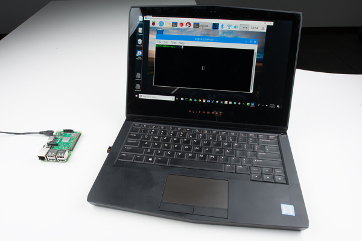

*RealVNCを使ってRaspberry Piのグラフィカルデスクトップにアクセスする様子*

朗報として、Raspberry Piの推奨OSであるRaspbianには、標準でRealVNCがインストールされている。
一方で厄介なのは、それを別の手段で有効化する必要があるという点である。

### 必要な部品

このチュートリアルの内容を実際に試すには、Raspberry Pi、電源、microSDカードが必要である。
モニタ、キーボード、マウスは不要である。

> [!NOTE]
> 注：プロジェクトをより小型にしたい場合は、[Raspberry Pi Zero W](https://www.sparkfun.com/products/14277)でもこのチュートリアルの内容を試せるはずである。

### あると便利な部品

とはいえ、キーボードとマウス、モニタを使ってVNCサーバーを有効化することもできる。
一度有効化してしまえば、（本当に使いたい場合を除いて）これらの周辺機器はもう必要なくなる。

参考になるチュートリアル:

以下の概念に馴染みがなければ、続きを読む前にこれらのチュートリアルを確認しておくことをおすすめする。

- [シリアルターミナルの基礎](./terminal-basics.md)
- [Raspberry Pi 3 Starter Kitの使い方](https://learn.sparkfun.com/tutorials/raspberry-pi-3-starter-kit-hookup-guide)
- [Raspberry Pi Zero Wirelessの使い方](./getting-started-with-the-raspberry-pi-zero-wireless.md)

> [!NOTE]
> 補足：このチュートリアル中の画像が見づらい場合は、遠慮なくクリックして拡大表示してほしい。

## OSを書き込む

Raspberry Piにはいくつかの利用可能なOSがあり、初心者にはNOOBSを使って標準のRaspbianイメージをインストールすることがよく勧められる。
このガイドでは、VNCと組み合わせて使うヘッドレス版のRaspbianを設定する方法を紹介する。
[Headless Raspberry Pi Setupチュートリアル](https://learn.sparkfun.com/tutorials/headless-raspberry-pi-setup)の一部の手順に沿って進めるが、今回はフル版に付属するLinuxのXサーバーが必要になるため、*Raspbian Lite*ではなくフル版の*Raspbian*を使う点に注意してほしい。

まず、最新版のRaspbianをダウンロードする。

[最新版のRaspbianをダウンロード](https://downloads.raspberrypi.org/raspbian_latest)

> [!NOTE]
> 注：このチュートリアルはRaspbian Stretch（2018年6月版）を使って作成されている。異なるバージョンを使う場合、このチュートリアルとは異なる手順が必要になることがある。2018年6月版のRaspbianが必要な場合は、以下からダウンロードできる。
> [Raspbian Stretch（2018年6月版）ダウンロード（ZIP）](http://downloads.raspberrypi.org/raspbian/images/raspbian-2018-06-29/2018-06-27-raspbian-stretch.zip)

SDカードにイメージを書き込むには、[Etcher](https://etcher.io/)というプログラムをおすすめする。
ダウンロードしてインストールする。
（必要であれば[microSD USBリーダー](https://www.sparkfun.com/products/13004)を使って）SDカードをパソコンに挿し、Etcherを起動する。
OSのイメージファイルを選択し（zipを展開する必要はなく、ダウンロードした.zipファイルをそのままEtcherで選択すればよい）、SDカードリーダーを選択して、**Flash!**ボタンをクリックする。


## VNCを有効化する

VNCサーバーを有効化するには、Raspberry Piを直接操作する必要がある。
そのための方法はいくつかある。

- キーボード、マウス、モニタを接続する。デスクトップ左上の**Terminal**アイコンをクリックすると、ターミナルウィンドウが開く。
- [シリアル接続でターミナルウィンドウを開くこの手順](https://learn.sparkfun.com/tutorials/headless-raspberry-pi-setup#serial-terminal)に従う。
- [イーサネット経由のSSHでターミナルウィンドウを開くこの手順](https://learn.sparkfun.com/tutorials/headless-raspberry-pi-setup#ethernet-with-static-ip-address)に従う。
- [WiFi経由のSSHでターミナルウィンドウを開くこの手順](https://learn.sparkfun.com/tutorials/headless-raspberry-pi-setup#wifi-with-dhcp)に従う。

### （任意）RealVNCをインストールする

標準では、RaspbianにはVNCサーバー（RealVNC）がインストールされているはずである。
別のOSを使っている場合は、RealVNCを自分でインストールする必要があるかもしれない。
たいていのDebian系OS（Raspbianも土台はDebianである）では、*apt-get*を使ってRealVNCをインストールできる。
ターミナルで、次のように入力する。

```shell
sudo apt-get update
sudo apt-get install real-vnc-server
sudo apt-get install real-vnc-client
```

### VNCサーバーを有効化する

VNCサーバーを有効化するには、Raspberry Piの設定ツールを開く必要がある。

```shell
sudo raspi-config
```

**Interfacing Option**を選び、続けて**VNC**を選ぶ。
次の画面で**Yes**を選び、*Enter*キーを押して変更を保存する。

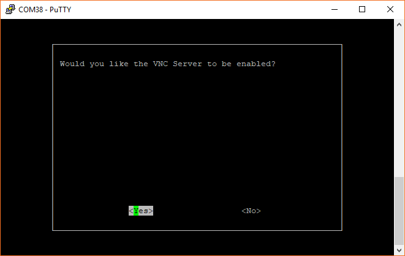

パスワードの変更やキーボードレイアウトの変更など、他に必要な設定があれば自由に行ってよい。

*raspi-config*のホーム画面に戻ったら、*右矢印*キーを2回押して**Finish**を選び、*Enter*キーを押す。

## ローカルネットワーク経由でVNCを使う

ホストとなるパソコンがRaspberry Piと同じローカルネットワーク上にある場合（たとえば同じWiFiやイーサネットのネットワークに接続している場合）は、Raspberry Piへ直接VNC接続できる。
この方法にはいくつかの利点がある。もっとも簡単な方法であり、RealVNCのアカウント登録も不要で、インターネットに接続していない閉じたネットワークでも行える。
欠点は、Piにアクセスするには同じネットワーク上にいる必要がある（つまり物理的に接続しているか、VPN経由である必要がある）という点である。
これは*ダイレクト接続*と呼ばれる方式である。

インターネット経由でRaspberry Piにアクセスしたい場合は、[次のセクション](#インターネット経由でvncを使う)を参照してほしい。

Raspberry Piのターミナルで、次のコマンドを入力する。

```shell
ifconfig
```

*inet*の隣に4つの数字の並びとして表示される、Raspberry PiのIPアドレスを控えておく。
WiFiで接続している場合は*wlan0*の設定の下に、イーサネットで接続している場合は*eth0*の設定の下に表示される。

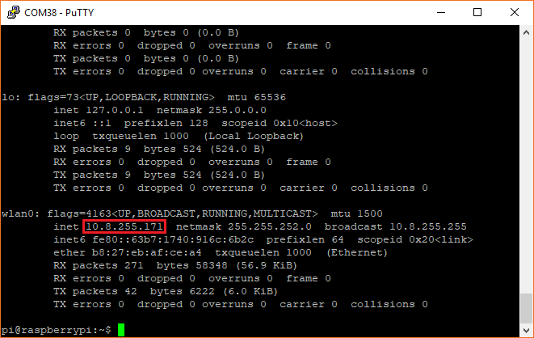

ホスト側のパソコンで、[RealVNC Viewerのダウンロードページ](https://www.realvnc.com/en/connect/download/viewer/)にアクセスし、使用しているOS向けのVNCクライアント（*VNC Viewer*）をダウンロードする。
すべてデフォルトの設定のままインストールする。

*VNC Viewer*を開く。上部のアドレスバーに、Raspberry PiのIPアドレスを入力する（ホスト側のパソコンとPiが同じネットワーク上にあることをもう一度確認しておくこと）。

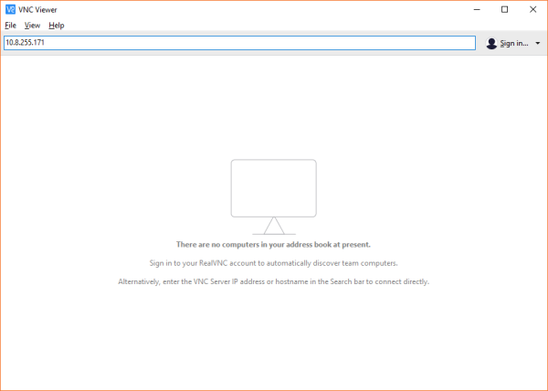

*Enter*キーを押し、「VNC Server not recognized」という警告が出たら**Continue**をクリックする。
**Authentication**ウィンドウが表示されるはずである。
Piのログインユーザー名とパスワードを変更していない場合、デフォルトのログイン情報は次のとおりである。

- **ユーザー名：** pi
- **パスワード：** raspberry

> [!NOTE]
> 警告：パスワードは必ず変更することを強くおすすめする。同じネットワークにアクセスできる人であれば、デフォルトのユーザー名とパスワードを試すだけで簡単にPiにアクセスできてしまう。

認証に成功すると、Raspberry Piのグラフィカルデスクトップが表示されるはずである。
これで、まるでキーボードとマウス、モニタを備えたPiの前に座っているかのように、あらゆる操作をリモートで行えるようになる。
ウィンドウ上部にマウスを乗せると、ドロップダウンボックスが表示され、セッションを終了するボタンをはじめ、RealVNCのさまざまな設定にアクセスできる。

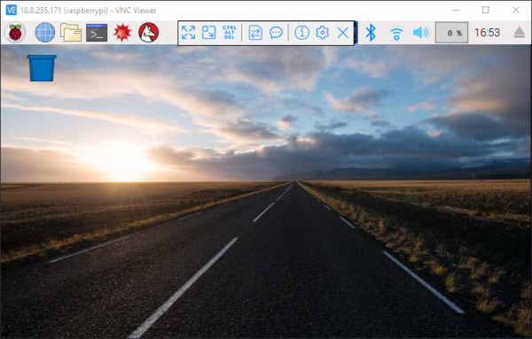

## インターネット経由でVNCを使う

ローカルネットワーク上でリモートデスクトップを使うほうが、はるかに高速で滑らかな体験になりやすいが、必ずしもそのネットワークに直接アクセスできるとは限らない。
幸い、RealVNCを使えば、インターネット経由でも自分のコンピュータにログインできる。

もう一つの朗報は、PiのIPアドレスを探す手間がかからないという点である。

### RealVNCアカウントに登録する

> [!NOTE]
> 注：RealVNCのクラウドサービスを使うには、同社のサイトでアカウント登録が必要になる。また、クラウド接続サービスが無料なのは非商用・教育目的の利用に限られる点にも注意してほしい。詳しくは[RealVNCの料金ガイド](https://manage.realvnc.com/en/pricing)を参照してほしい。

まず、[RealVNCのサイト](https://manage.realvnc.com/en/)でアカウントに登録する（すでにアカウントがあればサインインする）。
**Account**ページに移動し、*Home*版のVNC Connectの下にある**Activate**をクリックする。

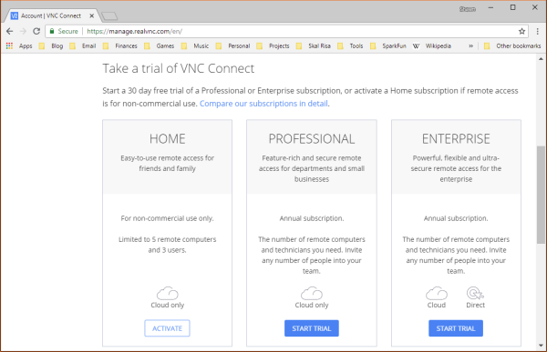

### PiでVNCクラウド接続を有効化する

> [!NOTE]
> 注：この次のステップでは、Raspberry Piのグラフィカルデスクトップにアクセスできる状態が必要である。これには、キーボード・マウス・モニタを使う方法や、ローカルネットワーク経由でVNCに直接接続する方法がある。コマンドラインからVNCクラウド接続を有効化できるのは、RealVNCの*Enterprise*版のみである。

PiでVNCが有効になっていることを前提に、デスクトップ右上の*VNC*ロゴをクリックする。
RealVNCの設定ウィンドウが開く。
そのウィンドウの右上にあるプロパティボタンをクリックし、**Licensing...**を選択する。

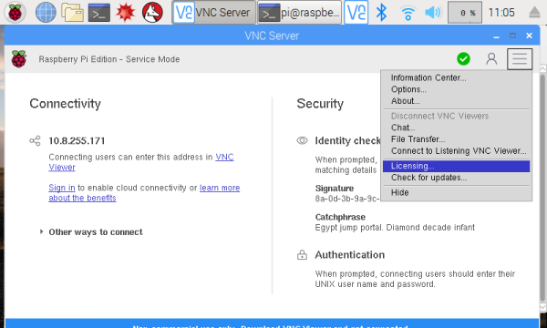

*Sign in to your RealVNC account*が選択された状態のまま、**Next**をクリックする。

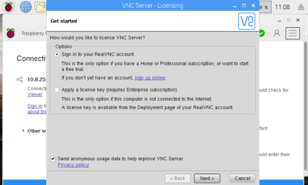

RealVNCのメールアドレスとパスワードを入力し、**Sign In**をクリックする。
次の画面で、接続方式を*Direct and cloud connectivity*に変更する。

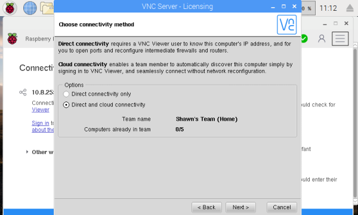

**Next**をクリックする。設定内容を確認し、**Apply**をクリックする。
パスワードを求めずに権限が付与されたという警告のポップアップが表示された場合は、**Close**をクリックする。
次の画面で**Done**をクリックする。

### Raspberry Piをリモートで操作する

ホスト側のマシンで、[RealVNC viewer](https://www.realvnc.com/en/connect/download/viewer/)をダウンロードしてインストールする。
アプリケーションを開き、右上の**Sign in**ボタンをクリックする。
メールアドレスとパスワードを入力し、**Sign in**をクリックする。

右側に、アドレス帳（過去に使用した接続先）と、「Team」（VNCクラウド接続が可能なコンピュータの一覧）が表示されるはずである。
**Team**をクリックすると、VNCの準備が整ったRaspberry Piが一覧に表示されているはずである。

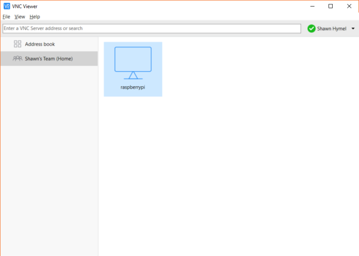

Raspberry Piをダブルクリックして接続する。
Raspberry Pi上のVNCサーバーが確認されたことを説明するポップアップウィンドウが表示されるはずである。
**Continue**をクリックする。
**Authentication**ウィンドウが表示されるはずである。
Piのログインユーザー名とパスワードを変更していない場合、デフォルトのログイン情報は次のとおりである。

- **ユーザー名：** pi
- **パスワード：** raspberry

> [!NOTE]
> 警告：パスワードは必ず変更することを強くおすすめする。同じネットワークにアクセスできる人であれば、デフォルトのユーザー名とパスワードを試すだけで簡単にPiにアクセスできてしまう。

認証されると、Raspberry Piのデスクトップが表示されるはずである。
ウィンドウ上部にマウスを乗せると、ドロップダウンが表示され、セッションを終了するボタンをはじめ、RealVNCのさまざまな設定にアクセスできる。


もう一つ気の利いた機能として、スマートフォンやタブレットからRaspberry Piを操作することもできる。
[iTunes Store](https://itunes.apple.com/us/app/vnc-viewer-remote-desktop/id352019548)または[Google Play](https://play.google.com/store/apps/details?id=com.realvnc.viewer.android)からVNC Viewerアプリをダウンロードする。
アプリを開いてサインインし、Raspberry Piに接続すればよい。

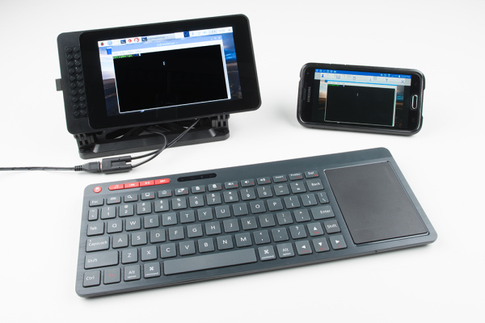

## まとめ

RealVNCについてさらに詳しく知りたい場合は、[ドキュメントページ](https://www.realvnc.com/en/connect/docs/)を確認することをおすすめする。

RealVNCはRaspbianに標準搭載されているが、Linux向けの他のVNCアプリケーションも存在する。代替の選択肢としては、次のようなものがある。

- [vino](https://wiki.archlinux.org/index.php/Vino)
- [x11vnc](http://www.karlrunge.com/x11vnc/)
- [TigerVNC](http://tigervnc.org/)

Raspberry Piにネットワークアクセスの手段がまったくない場合、Pi自身をWiFiアクセスポイントにすることで、独自のネットワークをホストさせることもできる。
これによって、ルーターなどの他のネットワーク機器に頼らずに、別のパソコンからSSHやVNCなどでPiに接続できるようになる。

さらに参考になるチュートリアルを紹介する（いずれも英語）。

- [Setting up a Raspberry Pi 3 as an Access Point](https://learn.sparkfun.com/tutorials/setting-up-a-raspberry-pi-3-as-an-access-point)：Raspberry Piをアクセスポイントとして設定し、ローカルのイーサネットネットワークに接続して、他のWiFi機器にインターネットを共有する方法。
- [Python Programming Tutorial: Getting Started with the Raspberry Pi](https://learn.sparkfun.com/tutorials/python-programming-tutorial-getting-started-with-the-raspberry-pi)：Raspberry Pi上でPythonを使ってハードウェアを制御するプログラムを書く方法。
- [Raspberry Pi Twitter Monitor](https://learn.sparkfun.com/tutorials/raspberry-pi-twitter-monitor)：Raspberry Piを使ってTwitterのハッシュタグを監視し、LEDを点滅させる方法。
- [Raspberry gPIo](https://learn.sparkfun.com/tutorials/raspberry-gpio)：PythonまたはC++を使ってRaspberry PiのI/Oラインを制御する方法。
- [Raspberry Pi Zero Helmet Impact Force Monitor](https://learn.sparkfun.com/tutorials/raspberry-pi-zero-helmet-impact-force-monitor)：人体はどれだけの衝撃に耐えられるのか。ヘルメット、Raspberry Pi Zero、加速度センサーを使って衝撃力モニターを自作する方法。
- [Setting Up the Pi Zero Wireless Pan-Tilt Camera](https://learn.sparkfun.com/tutorials/setting-up-the-pi-zero-wireless-pan-tilt-camera)：Raspberry Pi Zeroを、ヘッドレスなワイヤレスパン・チルトカメラとして組み立て、プログラムし、アクセスする方法。
- [Using Flask to Send Data to a Raspberry Pi](https://learn.sparkfun.com/tutorials/using-flask-to-send-data-to-a-raspberry-pi)：PythonのFlaskフレームワークを使い、内部WiFiネットワーク経由でESP8266 WiFiノードからRaspberry Piへデータを送信する方法。
- [Raspberry Pi Stand-Alone Programmer](https://learn.sparkfun.com/tutorials/raspberry-pi-stand-alone-programmer)：ヘッドレスなRaspberry Piを、AVRマイクロコントローラにhexファイルを書き込むスタンドアロンプログラマとして使う方法。

タグ: 概念、接続ガイド、IoT、Raspberry Pi、シングルボードコンピュータ

---

出典：[How to Use Remote Desktop on the Raspberry Pi with VNC](https://learn.sparkfun.com/tutorials/how-to-use-remote-desktop-on-the-raspberry-pi-with-vnc)（SparkFun Learn）を日本語に翻訳し、再構成した。
原文は [CC BY-SA 4.0](https://creativecommons.org/licenses/by-sa/4.0/) ライセンスで公開されており、本ページも同ライセンスの下で提供する。
