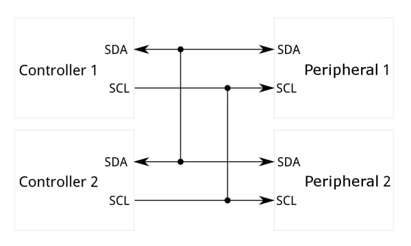
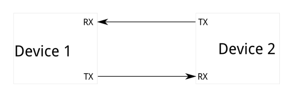
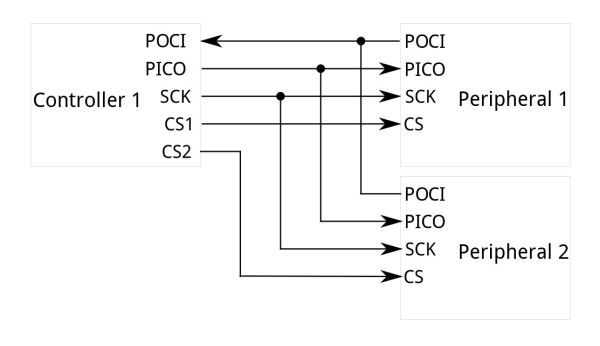
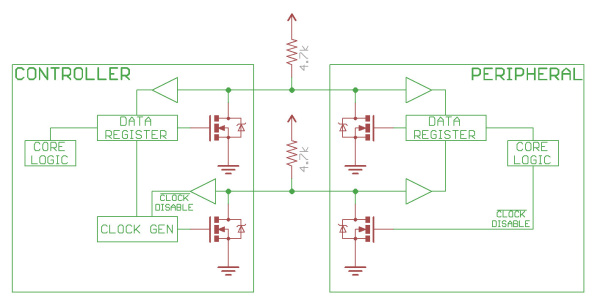
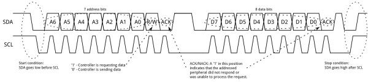
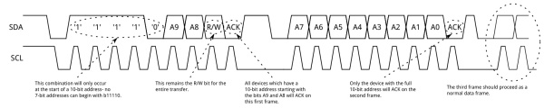
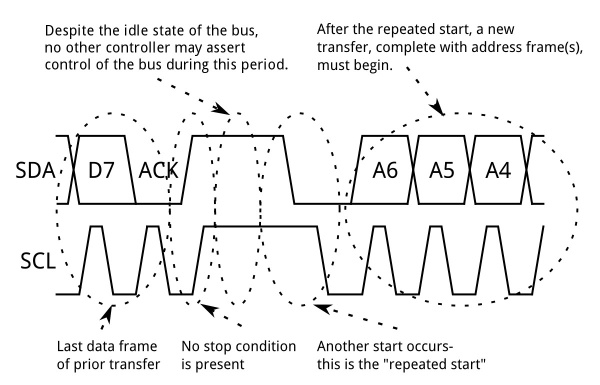
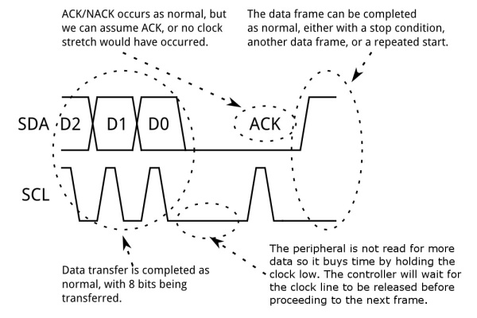

# I2C

このチュートリアルでは、I2C通信プロトコルについて、なぜそれを使いたくなるのか、そしてどのように実装されているのかを学ぶ。

Inter-Integrated Circuit（I2C）プロトコルは、複数の「ペリフェラル」デジタル集積回路（「チップ」）が、1つまたは複数の「コントローラ」チップと通信できるようにするためのプロトコルである。
[SPI（シリアルペリフェラルインターフェース）](./serial-peripheral-interface-spi.md)と同じく、単一の機器の中での短距離通信を想定している。
また、非同期シリアルインターフェース（RS-232やUARTなど）と同じく、情報をやり取りするのに必要な信号線はたった2本だけである。

参考になるチュートリアル:

このチュートリアルを読む前に知っておくと役立つ内容は、次のとおりである。

- [2進数](./binary.md)
- [シリアル通信](./serial-communication.md)
- [SPI（シリアルペリフェラルインターフェース）](./serial-peripheral-interface-spi.md)
- [Shift registers（シフトレジスタ）](https://learn.sparkfun.com/tutorials/shift-registers)
- [ロジックレベル](./logic-levels.md)

## なぜI2Cを使うのか

I2Cで通信したくなる理由を理解するには、まず他の選択肢と比較して、どこが違うのかを見る必要がある。

### シリアルUARTポートの何が問題なのか

シリアルポートは**非同期**（クロックデータが送られない）であるため、それを使う機器は事前にデータレートについて合意しておかなければならない。
また、両方の機器のクロックはほぼ同じ速度でなければならず、その状態を保ち続ける必要がある。両端のクロック速度に大きな差が生じると、データが文字化けしてしまう。

非同期シリアルポートにはハードウェア面でのオーバーヘッドがある。両端のUARTは比較的複雑であり、ソフトウェアで正確に実装しようとすると難しい。
それぞれのデータフレームには少なくとも1つのスタートビットとストップビットが含まれるため、8ビットのデータを送るのに10ビット分の送信時間が必要になり、実効データレートを圧迫する。

非同期シリアルポートのもうひとつの根本的な弱点は、本質的に2台の機器（それもちょうど2台）どうしの通信にしか向いていないという点である。
1つのシリアルポートに複数の機器を接続すること自体は*可能*だが、**バスの競合**（2台の機器が同時に同じ線を駆動しようとする状態）が常に問題となり、機器を損傷から守るには慎重な対策（たいてい外部のハードウェア）が必要になる。

最後に、データレートも課題である。
非同期シリアル通信には*理論上*の上限はないが、たいていのUARTデバイスは決まった一定のボーレートしかサポートしておらず、その最大値はたいてい毎秒230400ビット程度である。

### SPIの何が問題なのか

SPIのもっとも分かりやすい欠点は、必要なピンの数である。
1つのコントローラと1つのペリフェラルをSPIバスで接続するだけでも4本の線が必要であり、ペリフェラルを追加するたびに、コントローラ側にチップセレクト用のI/Oピンが1本ずつ追加で必要になる。
このピン接続の急速な増加は、多数の機器を1つのコントローラに接続したい状況では望ましくない。
また、機器ごとの接続本数が多いことは、PCBのレイアウトが窮屈な状況では配線をより難しくする要因にもなる。

SPIはバス上にコントローラを1つしか置けないが、ペリフェラルの数には（バスに接続された機器の駆動能力と、利用できるチップセレクトピンの数の制約はあるものの）特に制限がない。

SPIは、高速な**全二重**（送受信を同時に行える）接続に向いており、機器によっては10MHz（つまり毎秒1000万ビット）を超えるクロック速度をサポートし、速度のスケーラビリティにも優れている。
両端のハードウェアはたいてい非常に単純なシフトレジスタで済むため、ソフトウェアでの実装も容易である。

### そこで登場するI2C。両方のいいとこ取り

I2Cは、非同期シリアルと同じくたった2本の配線しか必要としないが、その2本の配線で最大1008台ものペリフェラルデバイスをサポートできる。
また、SPIとは異なり、I2Cは複数コントローラのシステムにも対応しており、複数のコントローラがバス上のすべてのペリフェラルデバイスと通信できる（ただし、コントローラどうしがバス上で直接会話することはできず、バスの使用権を順番にやり取りする必要がある）。

データレートは非同期シリアルとSPIの中間程度であり、たいていのI2Cデバイスは100kHzまたは400kHzで通信できる。
I2Cには多少のオーバーヘッドがあり、8ビットのデータを送るたびに、メタデータとして1ビット（後述する「ACK/NACK」ビット）を追加で送信する必要がある。

I2Cの実装に必要なハードウェアは、SPIよりは複雑だが、非同期シリアルよりは単純である。
ソフトウェアでもかなり手軽に実装できる。

> [!NOTE]
> I2Cバス上の機器どうしの関係を表す用語として、「マスター」「スレーブ」という言葉に馴染みがあるかもしれない。これらの用語は廃止されたものと見なされ、現在ではそれぞれ「コントローラ」「ペリフェラル」という用語に置き換えられている。命名規則は、メーカーやプログラミング言語、企業、団体によって異なる場合がある（main/secondary、initiator-responder、source/replicaなど）。

## I2Cの歴史

I2Cは、もともと1982年にPhilipsによって、同社のさまざまなチップ向けに開発された。
当初の仕様では100kHzの通信しかサポートされておらず、アドレスも7ビットに限られていたため、バス上の機器数は112台までに制限されていた（いくつかのアドレスは予約されており、有効なI2Cアドレスとしては使われない）。
1992年に最初の公開仕様が発表され、400kHzのファストモードと、拡張された10ビットアドレス空間が追加された。
たいていの場合（たとえば多くのArduino互換ボードに搭載されているATmega328では）、I2Cのサポートはこの時点で止まっている。
このほかにも、次の3つの追加モードが規定されている。

- ファストモードプラス（1MHz）
- ハイスピードモード（3.4MHz）
- ウルトラファストモード（5MHz）

「素の」I2Cに加えて、1995年にIntelは**System Management Bus**（SMBus）と呼ばれる派生仕様を導入した。
SMBusは、PCマザーボード上のサポートIC間の通信の予測可能性を最大化することを目的とした、より厳密に制御された規格である。
I2Cとの最大の違いは、SMBusが10kHzから100kHzまでの速度に制限されているのに対し、I2Cは0kHzから5MHzまでの機器をサポートできる点である。
SMBusには、低速動作を無効にするクロックタイムアウトモードが含まれているが、多くのSMBus機器は、組み込みI2Cシステムとの相互運用性を最大化するために、それでも低速動作をサポートしている。

## ハードウェアレベルで見るI2C

### 信号

それぞれのI2Cバスは、SDAとSCLという2つの信号から構成される。
SDA（Serial Data）はデータ信号であり、SCL（Serial Clock）はクロック信号である。
クロック信号は常にその時点のバスコントローラによって生成されるが、一部のペリフェラルデバイスは、コントローラがさらにデータを送るのを遅らせたり（あるいはコントローラがクロックを出す前にデータを準備する時間を稼いだりする）ために、クロックを一時的にLOWに固定することがある。
これは「**クロックストレッチング**」と呼ばれ、後述のプロトコルの節で説明する。

UARTやSPIの接続とは異なり、I2Cバスのドライバーは「[オープンドレイン](https://ja.wikipedia.org/wiki/%E3%82%AA%E3%83%BC%E3%83%97%E3%83%B3%E3%82%B3%E3%83%AC%E3%82%AF%E3%82%BF)」方式になっている。
つまり、対応する信号線をLOWに引き下げることはできるが、HIGHに駆動することはできない。
そのため、ある機器が線をHIGHにしようとし、別の機器がLOWに引き下げようとするといったバスの競合が起こりえず、ドライバーの損傷やシステム内での過大な電力消費のリスクがなくなる。
それぞれの信号線には[プルアップ抵抗](./pull-up-resistors.md)が付いており、どの機器も線をLOWにしていないときに信号をHIGHへと戻す役割を果たす。

抵抗値の選び方はバス上の機器によって変わるが、経験則としては**まず4.7kΩの抵抗から始め、必要に応じて値を下げていく**のがよい。
I2Cはかなり堅牢なプロトコルであり、短い配線（2〜3m程度）であれば問題なく使える。
配線が長い場合や、機器の数が多いシステムでは、より小さい抵抗値のほうが適している。

SparkFunのカタログで扱われているたいていのI2Cデバイスには、SCLピンとSDAピン用のプルアップ抵抗があらかじめ搭載されている。
同じバスに多数のI2Cデバイスを接続する場合、いくつかの機器のプルアップ抵抗を切り離すことで、抵抗の合成値を調整する必要が出てくることがある。
接続する内容や設計にもよるが、同じバスにはおよそ**7台程度のI2Cデバイス**を接続できる。
問題が生じた場合は、[ホビーナイフでジャンパーパッドをつなぐトレースを切断する](./working-with-wire.md)か、はんだごてを使ってジャンパーパッドのはんだを取り除くことで、特定の基板上の抵抗を切り離すことができる。

配線をより長く延ばす必要がある設計の場合は、PCA9615のような信号を延長する専用ICを使うという方法もある。

### 信号のロジックレベル

バス上の機器は実際には信号をHIGHに駆動しないため、I2Cには異なるI/O電圧を持つ機器どうしを接続する際にも、ある程度の柔軟性がある。
一般に、片方の機器がもう片方よりも高い電圧で動作しているシステムでは、間にレベルシフト回路を挟まなくても、I2Cで両者を接続できる場合がある。
コツは、プルアップ抵抗を2つの電圧のうち低いほうに接続することである。
これは、低いほうのシステム電圧が、高いほうのシステムのHIGHレベル入力電圧を上回っている場合に限って有効である。たとえば5VのArduinoと3.3Vの加速度センサーの組み合わせなどである。
Arduinoの設計やI2Cデバイスによっては、動作の一貫性を保ち、バス上のいずれの機器も傷めないために、[ロジックレベルコンバータ](./bi-directional-logic-level-converter-hookup-guide.md)を使うことをおすすめする。

2つのシステム間の電圧差が大きすぎる場合（たとえば5Vと2.5Vなど）、SparkFunではPCA9306レベルトランスレータブレイクアウトのような、シンプルなI2Cレベルシフター基板も扱っている。
この専用のレベルシフター基板にはイネーブル線も付いており、特定の機器への通信を無効にするために使うことができる。
これは、同じアドレスを持つ複数の機器を1つのコントローラに接続したい場合（Wiiヌンチャクなどがよい例である）に便利である。
[双方向のロジックレベルコンバータ](./bi-directional-logic-level-converter-hookup-guide.md)を使うという方法もある。

## プロトコル

I2Cによる通信は、UARTやSPIによる通信よりも複雑である。
バス上の機器がそれを有効なI2C通信として認識するには、信号が特定のプロトコルに従っている必要がある。
幸い、たいていの機器は細かい部分をすべて処理してくれるため、私たちはやり取りしたいデータの内容に集中できる。

### 基本

メッセージは2種類のフレームに分けられる。ひとつは、コントローラがメッセージの送信先となるペリフェラルを示す**アドレスフレーム**であり、もうひとつは、コントローラからペリフェラルへ、あるいはその逆方向にやり取りされる8ビットのデータメッセージである**データフレーム**（1つまたは複数）である。
データはSCLがLOWになったあとにSDA線に置かれ、SCLがHIGHになったあとにサンプリングされる。
クロックのエッジからデータの読み書きまでの時間は、バス上の機器によって定義されており、チップごとに異なる。

#### スタート条件

アドレスフレームを開始するため、コントローラ機器はSCLをHIGHのままにしつつ、SDAをLOWに引き下げる。
これにより、すべてのペリフェラルデバイスに、これから通信が始まることが伝わる。
2台のコントローラが同時にバスの所有権を得ようとした場合、先にSDAをLOWに引き下げたほうが競争に勝ち、バスの制御権を得る。
バスの制御権を他のコントローラに明け渡すことなく、新しい通信シーケンスを開始する「リピーテッドスタート」を発行することも可能であり、これについては後ほど説明する。

#### アドレスフレーム

アドレスフレームは、どの新しい通信シーケンスでも必ず最初に来る。
7ビットアドレスの場合、アドレスは最上位ビット（MSB）から先にクロック出力され、続いて読み取り（1）か書き込み（0）かを示すR/Wビットが送られる。

フレームの9ビット目はNACK/ACKビットである。
これはデータフレームであれアドレスフレームであれ、すべてのフレームに共通している。
フレームの最初の8ビットが送信されると、受信側の機器にSDAの制御権が渡される。
受信側の機器が9番目のクロックパルスより前にSDA線をLOWに引き下げなければ、その受信機器がデータを受信できなかったか、メッセージの解析方法が分からなかったと判断できる。
その場合、やり取りは中断され、その後どう進めるかはシステムのコントローラに委ねられる。

#### データフレーム

アドレスフレームが送信されたあと、データの送信が始まる。
コントローラは一定の間隔でクロックパルスを生成し続けるだけであり、R/Wビットが読み取りか書き込みかに応じて、コントローラかペリフェラルのどちらかがSDA上にデータを乗せる。
データフレームの数は任意であり、たいていのペリフェラルデバイスは内部レジスタを自動的にインクリメントするため、続けて読み書きすると次のレジスタが順番に対象になる。

#### ストップ条件

すべてのデータフレームが送信されると、コントローラはストップ条件を生成する。
ストップ条件は、SCLが0から1（LOWからHIGH）へ遷移した*あとで*、SDAが0から1へ遷移し、SCLがHIGHのまま保たれることとして定義される。
通常のデータ書き込み動作中は、誤ったストップ条件を避けるため、SCLがHIGHの間はSDAの値を変化させては**ならない**。

### プロトコルの高度な話題

#### 10ビットアドレス

10ビットアドレス方式では、ペリフェラルのアドレスを送るのに2つのフレームが必要になる。
最初のフレームは`b11110xyz`というコードで構成され、「x」はペリフェラルアドレスの最上位ビット、「y」はペリフェラルアドレスの8ビット目、「z」は前述の読み取り/書き込みビットである。
最初のフレームのACKビットは、アドレスの先頭2ビットが一致するすべてのペリフェラルによって立てられる。

通常の7ビット転送と同じように、直後にもう1つの転送が始まり、この転送にはアドレスの7:0ビットが含まれる。
この時点で、アドレス指定されたペリフェラルはACKビットで応答するはずである。
もし応答しなければ、その失敗モードは7ビットシステムの場合と同じである。

10ビットアドレスの機器は、7ビットアドレスの機器と共存できる。
アドレスの先頭にある「11110」の部分は、有効な7ビットアドレスのどれとも一致しないためである。

#### リピーテッドスタート条件

コントローラが、バス上の他のコントローラに割り込まれることなく、複数のメッセージを一度にやり取りできるようにしたい場合がある。
そのために定義されているのが、リピーテッドスタート条件である。

リピーテッドスタートを行うには、SCLがLOWの間にSDAをHIGHに戻し、SCLをHIGHにしたあと、SCLがHIGHのままの状態で再びSDAをLOWにする。
バス上でストップ条件が発生していないため、それまでの通信は本当の意味では完了しておらず、現在のコントローラがバスの制御権を保持し続ける。

この時点で、次のメッセージの送信を開始できる。
この新しいメッセージの構文は、他のメッセージと同じであり、アドレスフレームに続いてデータフレームが送られる。
リピーテッドスタートの回数に制限はなく、コントローラはストップ条件を発行するまでバスの制御を保持し続ける。

#### クロックストレッチング

コントローラのデータレートが、ペリフェラルがデータを供給できる速度を上回ってしまうことがある。
これは、データがまだ準備できていない場合（たとえばペリフェラルがアナログ-デジタル変換をまだ完了していない場合）や、前の処理がまだ終わっていない場合（たとえば不揮発性メモリへの書き込みが完了しておらず、他の要求に応じる前にそれを完了させる必要があるEEPROMなど）に起こりうる。

このような場合、一部のペリフェラルデバイスは「クロックストレッチング」と呼ばれる動作を行う。
本来、クロッキングは**すべて**コントローラによって駆動されており、ペリフェラルはコントローラのクロックパルスに応じて、単にバスにデータを乗せたり、バスからデータを受け取ったりするだけである。
データ転送の過程のどの時点でも、アドレス指定されたペリフェラルは、コントローラがSCL線を解放したあとも、それをLOWに保持し続けることができる。
コントローラは、ペリフェラルがSCL線を解放するまで、それ以上のクロックパルスやデータ転送を控えなければならない。

## Qwiic Connectシステム

SparkFun Qwiic Connectシステムは、SparkXのNateによって開発され、2017年にリリースされた。
馴染みがなければ説明すると、Qwiic Connectシステムは、I2Cセンサー、アクチュエータ、シールド、ケーブルなどからなるエコシステムであり、試作をより速く、よりミスの少ないものにしてくれる。

Qwiic対応のすべての基板は、共通の1mmピッチで4ピンのJSTコネクタを採用しており、基板間の配線をはんだ付けしたり被覆を剥いたりする余分な手間を省いてくれる。
このコネクタは必要なPCB上のスペースを削減し、極性のある接続なので配線を間違える心配もない。
複数の基板を数珠つなぎにすることで、同じバスに複数の機器を接続することもできる。

Qwiicケーブル（4ピンJST）は、開発ボードからセンサー、シールド、アクセサリー基板などへ簡単に差し込むことができ、新しい試作を組み立てる作業を手軽にしてくれる。

ブレッドボード上でSDAとSCLの配線をうっかり入れ替えてしまう心配もない。
Qwiicコネクタには極性があるため、最初から必ず正しく配線できる。

いよいよI2Cバスの力を活用するときである。
たいていのQwiic基板には2つ以上のコネクタが付いており、複数の機器を接続できるようになっている。

## まとめ

I2Cは比較的複雑なインターフェースであり、それを扱うのに役立つ情報源が数多く存在する。
以下にいくつか特に参考になるものを挙げる。

- [Wikipedia Article on I2C](https://ja.wikipedia.org/wiki/I2C)：完璧ではないが、出発点としては悪くない
- [Standards Doc](http://www.nxp.com/documents/user_manual/UM10204.pdf)：かつてのPhilips SemiconductorはNXPになった。これはI2Cの公式仕様書である
- [I2C primer](http://www.i2c-bus.org/i2c-bus/)：I2Cと関連技術についての公式入門書
- [Linux Tools for I2C](https://i2c.wiki.kernel.org/index.php/I2C_Tools)：pcDuinoやRaspberry PiのようなLinux組み込み環境で、I2Cや関連バスを扱うための便利なツール集
- [Qwiic Connect System](https://www.sparkfun.com/qwiic)：SparkFunのQwiic Connectシステムについて

長距離でI2Cを使いたい場合は、専用のPCA9615差動I2Cバスエクステンダーを確認してみてほしい。

タグ: 通信、概念、Qwiic

---

出典：[I2C](https://learn.sparkfun.com/tutorials/i2c)（SparkFun Learn）を日本語に翻訳し、再構成した。
原文は [CC BY-SA 4.0](https://creativecommons.org/licenses/by-sa/4.0/) ライセンスで公開されており、本ページも同ライセンスの下で提供する。
