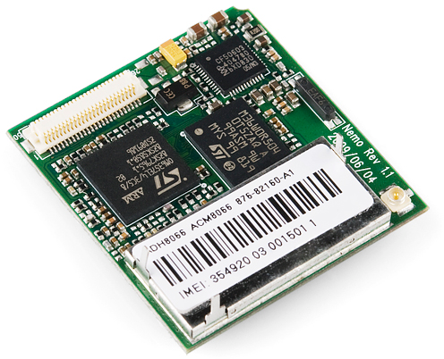
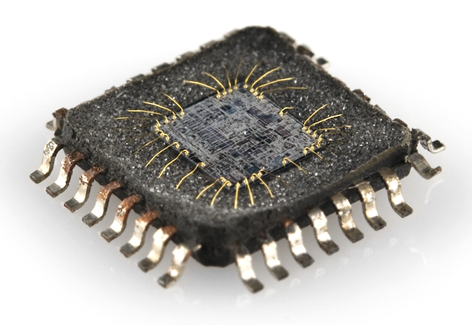
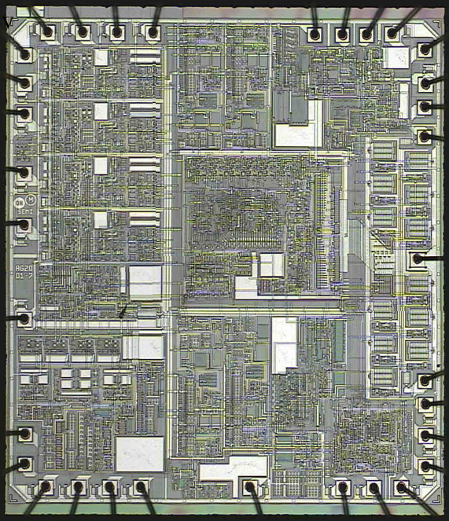
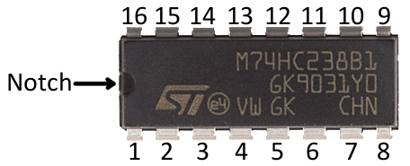
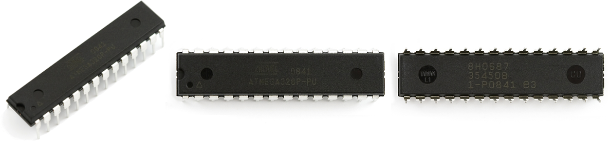
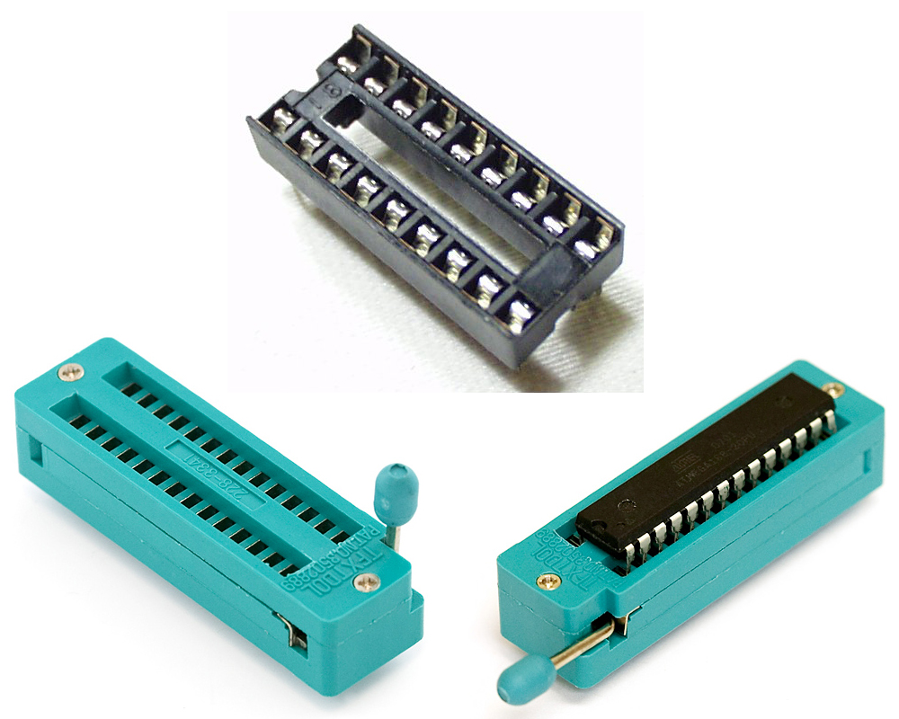
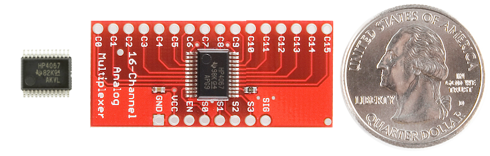
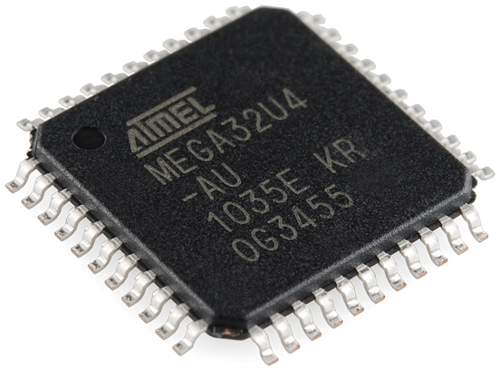
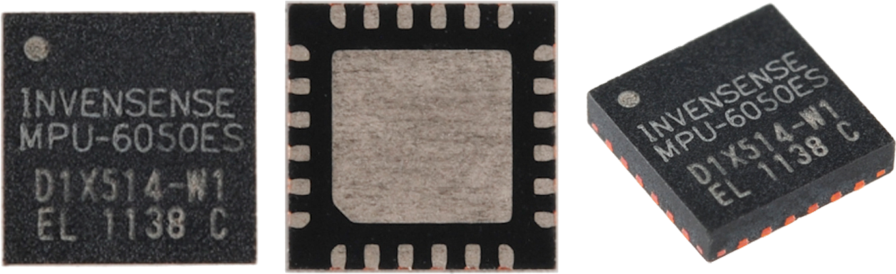
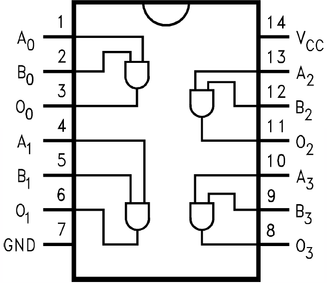

# 集積回路

**集積回路**（IC）は、現代の電子工学を支える要である。
ほとんどの回路にとって心臓であり頭脳でもある。
ほぼすべての基板の上で見かける、あの黒くて小さな「チップ」がICである。
よほど変わったアナログ電子工学の達人でもない限り、作る電子工作プロジェクトにはたいてい少なくとも1つのICが使われているはずであり、その中身を理解しておくことは重要である。

ICとは、[抵抗器](./resistors.md)、[トランジスタ](./transistors.md)、[コンデンサ](./capacitors.md)といった電子部品の集まりを、小さなチップの中に詰め込んで互いに接続し、1つの共通の目的を果たすようにしたものである。
単純な論理ゲート1つだけのものから、オペアンプ、555タイマー、電圧レギュレータ、モータードライバ、マイコン、マイクロプロセッサ、FPGAまで、実にさまざまな種類がある。

このチュートリアルで扱う内容:

- ICの構成
- よく使われるICのパッケージ
- ICの見分け方
- よく使われるICの種類

参考になるチュートリアル:

- [回路とは何か](./what-is-a-circuit.md)
- [抵抗器](./resistors.md)
- [ダイオード](./diodes.md)
- [極性](./polarity.md)
- [コンデンサ](./capacitors.md)
- [トランジスタ](./transistors.md)

## ICの内部

集積回路と聞いて思い浮かぶのは、たいてい黒くて小さなチップである。
では、その黒い箱の中身はどうなっているのだろうか。

ICの本当の「中身」は、半導体ウエハー、銅、その他の材料を複雑に積み重ねた構造であり、これらが相互接続されて回路の中のトランジスタや抵抗、その他の部品を形作っている。
このウエハーを切り出し、成形したものを**ダイ**と呼ぶ。

IC自体は小さいが、それを構成する半導体ウエハーや銅の層は信じられないほど薄く、層と層のあいだの接続も非常に緻密である。
先ほどのダイを拡大すると、その様子がよくわかる。

ICのダイは、回路をこれ以上ないほど小さくした姿であり、そのままではんだ付けしたり接続したりするには小さすぎる。
ICに接続する作業を楽にするため、私たちはダイを**パッケージ**に収める。
ICパッケージが、あの繊細で小さなダイを、誰もが見慣れた黒いチップへと変えてくれる。

## ICのパッケージ

**パッケージ**は、ICのダイを封入し、私たちが接続しやすいように端子を外部に引き出す役割を果たす。
ダイの外周にある接続点は、それぞれ細い金線を通じてパッケージの**パッド**や**ピン**につながっている。
ピンは、IC本体から突き出た銀色の端子であり、回路の他の部分へと接続される。
このピンこそが、回路の他の部品や配線とつながる部分であり、私たちにとってもっとも重要な要素である。

パッケージには多くの種類があり、それぞれ独自の寸法や実装方式、ピン数を持っている。

### 極性の表示とピン番号

すべてのICは[極性を持ち](./polarity.md)、どのピンも位置と機能の両方において唯一無二である。
そのため、パッケージにはどのピンがどれかを示す何らかの方法が必要になる。
たいていのICは、1番ピンを示すために**切り欠き**か**丸印**のどちらかを使う（両方あることもあれば、どちらか一方だけのこともある）。

1番ピンの位置がわかれば、そこから反時計回りに進むにつれてピン番号が順番に増えていく。

### 実装方式

パッケージの種類を特徴づける主な要素の1つが、基板への実装方式である。
パッケージはすべて、スルーホール（PTH）か表面実装（SMDまたはSMT）のどちらかに分類される。
**スルーホール**パッケージは一般に大きく、扱いやすい。
基板の片面から挿し込み、反対側ではんだ付けするように設計されている。

**表面実装**パッケージは、小さなものから極小のものまでさまざまなサイズがある。
すべて基板の片面に乗せて、その面ではんだ付けするように設計されている。
SMDパッケージのピンは、チップの側面から垂直に突き出ているものもあれば、チップの底面にマトリクス状に配置されているものもある。
この形状のICは手作業での実装にあまり向いておらず、たいてい[専用の道具](https://learn.sparkfun.com/tutorials/electronics-assembly)が必要になる。

### DIP（デュアルインラインパッケージ）

**DIP**（デュアルインラインパッケージの略）は、もっともよく見かけるスルーホール型のICパッケージである。
この小さなチップは、四角い黒いプラスチックのケースから、2列に並んだピンが垂直に突き出た形をしている。

DIP ICのそれぞれのピンは0.1インチ（2.54mm）間隔で並んでおり、これは[ブレッドボード](./how-to-use-a-breadboard.md)をはじめとする試作用基板にぴったり収まる標準的な間隔である。
DIPパッケージ全体の大きさは、ピン数によって変わり、4ピンから64ピン程度まで幅がある。

ピンの2つの列のあいだの間隔は、DIP ICがブレッドボードの中央部分をまたげるようにちょうどよく設計されている。
これにより、それぞれのピンが基板上で独立した行に対応し、互いに[ショート](./what-is-a-circuit.md)しないようになっている。

DIP ICはブレッドボードで使うだけでなく、**PCBにはんだ付け**することもできる。
基板の片面から挿し込み、反対側ではんだ付けして固定する。
ICを直接はんだ付けする代わりに、**ソケット**を使うのがよい場合もある。
ソケットを使えば、ICが「青い煙を吐いて」しまったときに、取り外して交換できる。

### 表面実装（SMD/SMT）パッケージ

今日では、表面実装パッケージには実に多くの種類がある。
表面実装型のICを扱うには、たいてい対応する銅箔パターンを持つ専用のプリント基板（[PCB](https://learn.sparkfun.com/tutorials/pcb-basics)）が必要になる。

ここでは、比較的よく見かける表面実装パッケージをいくつか紹介する。
手はんだのしやすさで言えば、「なんとかできる」ものから、「専用の道具があればなんとかできる」もの、「*非常に*特殊な、たいていは自動化された道具でなければ無理」なものまで幅がある。

#### スモールアウトライン（SOP）

スモールアウトラインIC（SOIC）パッケージは、DIPの表面実装版のようなものである。
DIPのすべてのピンを外側に折り曲げ、サイズを小さくしたものだと考えるとよい。
手先が安定していて、よく目を凝らせば、SOICパッケージは手はんだしやすいSMD部品の部類に入る。
SOICパッケージでは、ピンの間隔はたいてい0.05インチ（1.27mm）程度である。

SSOP（シュリンクスモールアウトラインパッケージ）は、SOICパッケージをさらに小さくしたものである。
似たようなICパッケージには、TSOP（シンスモールアウトラインパッケージ）やTSSOP（シンシュリンクスモールアウトラインパッケージ）もある。

[MAX232](https://www.sparkfun.com/products/589)や[マルチプレクサ](https://www.sparkfun.com/products/299)のような、比較的単純で1つの役割に特化したICの多くは、SOICやSSOPの形で提供される。

#### クアッドフラットパッケージ

ICのピンを四方すべてに広げると、クアッドフラットパッケージ（QFP）のような形になる。
QFPのICは、1辺あたり8ピン（合計32ピン）から、70ピン以上（合計300ピン以上）まで幅がある。
QFPのピン間隔はたいてい0.4mmから1mm程度である。
標準的なQFPパッケージをさらに小さくしたものに、シン（TQFP）、ベリーシン（VQFP）、ローププロファイル（LQFP）パッケージがある。

QFPのICのピンを削り取ったような形にすると、**クアッドフラットノーリード**（QFN）パッケージになる。
QFNパッケージの接続部は、ICの底面の角に露出した小さなパッドである。
側面と底面の両方に露出しているものもあれば、底面だけに露出しているものもある。

シン（TQFN）、ベリーシン（VQFN）、マイクロリード（MLF）パッケージは、標準的なQFNパッケージをさらに小さくしたものである。
デュアルノーリード（DFN）やシンデュアルノーリード（TDFN）のように、2辺だけにピンを持つパッケージもある。

多くのマイクロプロセッサやセンサー、その他の現代的なICはQFPやQFNパッケージで提供されている。
人気の高い[ATmega328](https://www.sparkfun.com/products/9261)マイコンはTQFPパッケージとQFN系（MLF）パッケージの両方で提供されており、[MPU-6050](https://www.sparkfun.com/products/10937)のような小型の[加速度センサー](./accelerometer-basics.md)兼[ジャイロセンサー](https://learn.sparkfun.com/tutorials/gyroscope)は極小のQFN形状で提供されている。

#### ボールグリッドアレイ

最後に、より高度なICのために、ボールグリッドアレイ（BGA）パッケージがある。
これは、ICの底面に小さなはんだのボールを2次元格子状に並べた、驚くほど緻密なパッケージである。
はんだボールがダイに直接取り付けられていることさえある。

BGAパッケージは、[pcDuino](https://www.sparkfun.com/products/11712)や[Raspberry Pi](https://www.sparkfun.com/products/11546)に搭載されているような、高度なマイクロプロセッサ向けに使われることが多い。

BGAパッケージのICを手ではんだ付けできるなら、はんだ付けの達人と自負してよい。
たいていは、ピックアンドプレース機やリフロー炉を使った自動化された工程でPCBに実装される。

## よく使われるIC

集積回路は電子工作のあらゆる場面に登場するため、そのすべてを網羅するのは難しい。
ここでは、電子工作の学習でよく出会うICをいくつか紹介する。

### 論理ゲート、タイマー、シフトレジスタなど

ICそのものを構成する基本要素である論理ゲートも、それ自体を1つのICとしてパッケージ化できる。
論理ゲート用のICには、この4入力ANDゲートのように、1つのパッケージに複数のゲートが収められているものもある。

論理ゲートをIC内部で組み合わせることで、タイマー、カウンター、ラッチ、シフトレジスタなど、その他の基本的な論理回路も作れる。
こうした単純な回路の多くは、DIPだけでなくSOICやSSOPのパッケージでも見つかる。

### マイコン、マイクロプロセッサ、FPGAなど

数千、数百万、数十億個ものトランジスタを小さなチップに詰め込んだマイコン、マイクロプロセッサ、FPGAも、すべて集積回路の一種である。
これらの部品は、機能、複雑さ、大きさにおいて非常に幅広い。
[Arduino](https://www.sparkfun.com/products/11021)に搭載されている[ATmega328](https://www.sparkfun.com/products/9061)のような8ビットマイコンから、パソコンの動作を統括する複雑な64ビットマルチコアのマイクロプロセッサまで、さまざまなものがある。

これらの部品は、たいてい回路の中でもっとも大きなICになる。
単純なマイコンは、DIPからQFN/QFPまでのパッケージに収められ、ピン数は8から100程度である。
これらの部品が複雑になるほど、パッケージも同じように複雑になっていく。
[FPGA](https://www.sparkfun.com/products/11838)や複雑な[マイクロプロセッサ](https://www.sparkfun.com/products/11712)は1000本を超えるピンを持つこともあり、QFN、LGA、BGAといった高度なパッケージでしか提供されない。

### センサー

温度センサーや[加速度センサー](./accelerometer-basics.md)、[ジャイロセンサー](https://learn.sparkfun.com/tutorials/gyroscope)といった現代のデジタルセンサーも、すべて集積回路として作られている。

これらのICは、基板上のマイコンや他のICと比べてたいてい小さく、ピン数は3から20程度である。
DIPパッケージのセンサーICは珍しくなりつつあり、現代の部品はたいていQFP、QFN、あるいはBGAパッケージで提供されている。

## まとめ

集積回路は、ほぼすべての回路に登場する部品である。
ICについて理解できたところで、次のような関連する概念のチュートリアルも確認してみてほしい。

- [PCB基板の基礎](./pcb-basics.md)：ICは何らかの方法で回路に接続する必要がある。たいていはプリント基板（PCB）にはんだ付けすることになる。あの緑色の小さな基板について、このチュートリアルで学べる。
- [シリアル通信](./serial-communication.md)、[SPI通信](./serial-peripheral-interface-spi.md)、I2C：どれも、ICどうしが通信するための通信プロトコルである。

次のようなスキル系のチュートリアルもおすすめである。電子工作を始めたばかりの人なら、ぜひ身につけておきたいスキルである。

- [はんだ付けの基本](./how-to-solder-through-hole-soldering.md)：ブレッドボードでICを使うのでなければ、はんだ付けが必要になるはずである。
- [PCB設計](https://learn.sparkfun.com/tutorials/designing-pcbs-advanced-smd)：すでにPCBに慣れているなら、実際に自分で設計してみるのはどうだろうか。

タグ: 部品、電気工学、技術

---

出典：[Integrated Circuits](https://learn.sparkfun.com/tutorials/integrated-circuits)（SparkFun Learn）を日本語に翻訳し、再構成した。
原文は [CC BY-SA 4.0](https://creativecommons.org/licenses/by-sa/4.0/) ライセンスで公開されており、本ページも同ライセンスの下で提供する。
